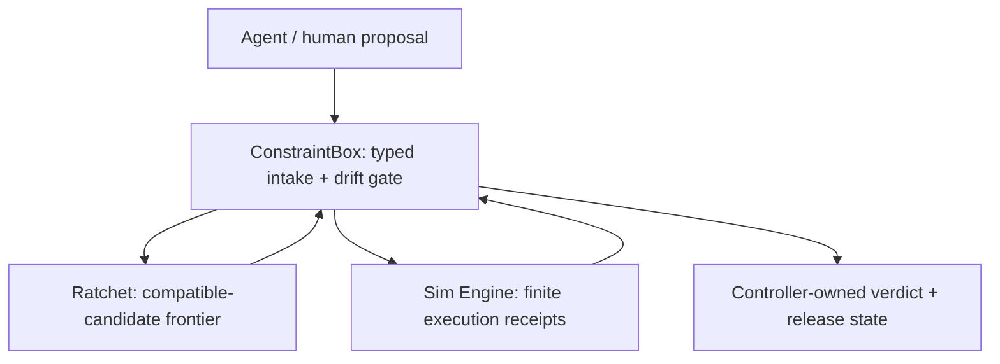

# ConstraintBox Semantic-Drift and Argument-Control Specification

**Status:** Proposed implementation specification; non-canonical until separately admitted.  
**Date:** 2026-08-06  
**Primary target:** ConstraintBox (CB) control plane  
**Related systems:** Ratchet, Sim Engines, ClaimGate, LevOS adapters  
**Canon mutation:** Forbidden by this document. This is a controller and test specification, not a new ontology.  
**Implementation priority:** High. This is a precondition for trusting LLM-assisted claim processing.

---

## 1. Executive direction

ConstraintBox must prevent a recurrent failure in language-model reasoning and in human theory-building:

> A system begins with a familiar explanatory frame, silently relabels every counterexample in that frame's vocabulary, and then presents the relabeling as a proof that the frame was necessary all along.

The immediate adversarial case was an argument that a finite admit/exclude constraint already *is* utility ranking, then already *is* agency, then already makes means--ends causality necessary. The important issue is not Austrian economics. The issue is whether CB can detect and block this kind of **semantic coercion** before it contaminates a model, a simulation claim, a control decision, or the canon.

CB must treat the following as distinct typed objects unless a separately tested bridge is supplied:

1. finite constraint admission or exclusion;
2. probe-relative distinguishability;
3. MSS/frontier comparison;
4. preference ranking or utility;
5. agent policy and actuation;
6. causal or scientific claims.

No agent, including an LLM, may propose a claim, interpret its own evidence, and issue the deciding verdict. Agent output is always a proposal. A controller-owned verifier and receipt decide what the system is allowed to claim.

### 1.1 Non-negotiable outcomes

- A Boolean or finite admission predicate must **not** be silently upgraded into a preference order, utility, goal, policy, or causal relation.
- A numerical encoding of a predicate may be used as an implementation convenience, but it may only support the claim **representation exists**, never the claim **ontology, agency, or causality follows**.
- CB must preserve `UNRESOLVED`, `HOLD`, `INCOMPARABLE`, `PARKED`, and Purgatory/re-offer states. It must never force a scalar winner merely to make a narrative complete.
- Every bridge between types must have declared inputs, a finite representation, a scope, an executable control surface, and a controller-owned verdict.
- Claims that say “necessary for any assertion,” “required for all action,” or similar universal language must be explicitly classified as a theorem, a declared axiom, or an interpretation. They may not be released as earned science merely because they sound unavoidable.

---

## 2. Why this is an engineering problem, not a debate preference

An LLM has no externally visible truth-maintenance ledger by default. It generates locally coherent language from a prompt and its preceding context. Once it selects a familiar frame, its own earlier wording becomes a high-probability continuation path. This creates a local, path-dependent semantic basin:

```text
initial frame → self-consistent phrasing → challenge absorbed as wording → frame preserved
```

That pattern can look like judgment, conviction, or philosophical rigor. Operationally, it is an unverified transformation of terms. The same thing happens in human institutions when a theory is used both to describe evidence and to decide what counts as evidence.

The failure is especially dangerous for this program because the program explicitly rejects primitive identity, equality, causality, privileged coordinates, primitive probability, and narrative-first explanation. A default agent will often pull the discussion back toward familiar identity/agent/cause language unless the control plane makes the layer change explicit.

### 2.1 The observed drift sequence

The following sequence must be detectable as a claim delta, not accepted as one continuous argument:

| Step | Surface wording | Illicit move |
|---|---|---|
| 1 | “Usable prediction requires regularity.” | May be locally true; does not establish metaphysical causality. |
| 2 | “Action requires means and ends.” | Assumes an agent/action layer. |
| 3 | “Differential retention is selection.” | Replaces a filter with an optimizer. |
| 4 | “Admit/exclude is ranking by construction.” | Re-encodes a predicate numerically and calls the encoding an identity. |
| 5 | “Any assertion presupposes selection.” | Converts an interpretation or axiom into a universal necessity claim. |

Each row needs a bridge. A fluent paragraph is not a bridge.

### 2.2 What CB must protect

CB must protect at least four boundaries:

| Boundary | What may be true | What may not be inferred without a bridge |
|---|---|---|
| Constraint → ranking | A constraint separates admitted from excluded candidates. | One admitted candidate is preferred to another. |
| Ranking → policy | An explicit ranking can order options. | A system has an action space, actuator, policy, or goal. |
| Policy → causality | A policy can be evaluated under declared interventions. | Its story is a fundamental causal law. |
| Representation → ontology | A predicate can be encoded as `0/1`, a scalar, a vector, or a graph. | The encoding is the thing encoded, or carries its explanatory content. |

---

## 3. Scope and non-goals

### 3.1 In scope

- Typed intake and claim registration for proposals from LLMs, humans, engines, and tools.
- Detection of semantic/type/quantifier drift between a proposed premise and a claimed conclusion.
- Enforcement of finite, controller-owned bridge obligations.
- Preservation of plural frontiers and non-terminal uncertainty states.
- Adversarial test fixtures derived from the filter-versus-optimizer failure.
- Receipts, hashes, source binding, independent recomputation, and replayable verdicts.
- A safe interaction protocol for using LLMs as proposal generators without letting them become adjudicators.

### 3.2 Explicitly out of scope

- Declaring the user’s ontology proved.
- Declaring causality, agency, preference, or whole-history compatibility false in every possible theory.
- Settling Mises, Kant, Hume, Austrian economics, or any other tradition by prompt rhetoric.
- Installing a universal scalar objective, total order, or privileged future into CB.
- Allowing the controller to silently rewrite a submitted rival model into the owner’s model.

The correct controller response to an unearned bridge is `HOLD`, `PARKED`, or a blocked-claim ceiling—not a persuasive counter-narrative.

---

## 4. System boundary and authority separation



### 4.1 Component responsibilities

| Component | Authority | Must not do |
|---|---|---|
| Agent / LLM | Propose definitions, candidates, proofs, experiments, counterarguments, and repair ideas. | Issue its own admission verdict or expand the allowed claim. |
| ConstraintBox | Enforce types, contracts, evidence binding, drift rules, receipts, and release ceilings. | Invent a model narrative or run unregistered semantics. |
| Ratchet | Compare compatible candidates under declared finite demands; preserve the weakest sufficient plural frontier. | Assert absolute MSS, a global utility, or a forced winner. |
| Sim Engine | Execute registered finite contracts and emit artifacts. | Interpret its own result as a scientific verdict. |
| Controller / verifier | Independently recompute, test, and issue the bounded verdict. | Accept producer-authored evidence as sufficient by shape alone. |

### 4.2 Core rule

> **Producer output is not a verdict. Receipt shape is not execution truth.**

This rule applies equally to a model-generated philosophical argument, a simulation result, and a JSON object that looks like a proof.

---

## 5. Required vocabulary and type system

The following names are intentionally narrow. CB must reject unqualified use of overloaded words such as `selection`, `viability`, `preference`, `cause`, `objective`, and `survival` when their layer is not declared.

### 5.1 Root and methodological objects

| Type | Meaning | Allowed output | Forbidden automatic escalation |
|---|---|---|---|
| `FINITE_SUPPORT` | A declared finite candidate/observation surface. | A finite domain or manifest. | Infinite or hidden completion claims. |
| `PROBE_DEMAND` | A finite, declared distinction that a candidate must preserve, merge, separate, or leave unresolved. | Probe outcomes and witness records. | Object identity or a universal law. |
| `COMPATIBILITY_CONSTRAINT` | A condition under which a candidate or nested continuation is admitted, excluded, or unresolved. | Set membership/status. | Utility, purpose, policy, or causal direction. |
| `ADMISSION_RESULT` | Controller result: `ADMIT`, `EXCLUDE`, or `UNRESOLVED`. | A finite status plus witness. | A preference ranking among admitted candidates. |
| `MSS_FRONTIER` | The coarsest adequate survivors under an explicit demand packet; may be plural and incomparable. | An antichain/frontier plus residuals. | A global optimum or ordinary scalar score. |
| `RATCHET_HISTORY` | Append-only evidence and exclusion receipts. | Replayable lineage. | Primitive causal force or a single narrative. |

### 5.2 Agent- and model-level objects

| Type | Meaning | Minimum extra data required |
|---|---|---|
| `PREFERENCE_ORDER` | An explicit binary order, partial order, or scalar evaluation over alternatives. | Domain, comparison relation or score, tie policy, scope, and origin. |
| `UTILITY_FUNCTION` | A specified evaluation function used by a particular agent/model. | Agent binding, codomain, update rule, and proof that the function is actually consumed. |
| `AGENT_POLICY` | A rule mapping an agent state and observation to an action or action distribution. | State space, observation interface, action space, actuator/dispatch link, and execution trace. |
| `CAUSAL_CLAIM` | A bounded directional/interventional claim. | Declared variables, scope, intervention/counterfactual contract, controls, and evidence. |
| `REPRESENTATIONAL_ENCODING` | A lossless or lossy coding of one object in another carrier. | Encoding/decoding contract and preserved properties. |

### 5.3 Mandatory layer qualification for “viability”

The word `viability` is prohibited in a CB claim unless one of these values is present:

- `compatibility_viability`: at least one finite compatible extension exists;
- `probe_viability`: a candidate survives declared probe demands;
- `method_viability`: a candidate remains eligible for the current Ratchet comparison;
- `organism_viability`: a bounded organism/control model remains within declared regulatory conditions;
- `utility_preference`: a declared agent evaluates one outcome above another.

These meanings are not interchangeable.

---

## 6. Formal anti-coercion invariants

This section uses a small amount of notation. Every symbol is explained immediately below it.

Let \(\Omega\) be a finite candidate set. Let \(C\) be a finite compatibility/admission test. The admitted subset is:

\[
A_C = \{x \in \Omega : C(x)=\mathrm{ADMIT}\}.
\]

In plain language: `A_C` is the set of candidates that pass the declared finite test. It says nothing about which passing candidate is better.

An agent may choose to encode that predicate numerically:

\[
U_C(x) =
\begin{cases}
1, & C(x)=\mathrm{ADMIT}\\
0, & C(x)=\mathrm{EXCLUDE}.
\end{cases}
\]

In plain language: this writes “pass” as `1` and “fail” as `0`. It is a coding convention. It does **not** establish an agent, a goal, a choice, an action, or a fundamental preference relation.

If \(a\) and \(b\) both pass, then \(U_C(a)=U_C(b)=1\). The encoding leaves them tied. It cannot select between them unless an additional tie-breaker, ordering, or policy is supplied.

### 6.1 No automatic implication chain

CB must enforce:

\[
\texttt{COMPATIBILITY\_CONSTRAINT}
\not\Rightarrow
\texttt{PREFERENCE\_ORDER}
\not\Rightarrow
\texttt{AGENT\_POLICY}
\not\Rightarrow
\texttt{CAUSAL\_CLAIM}.
\]

The crossed-out arrows mean “does not automatically imply.” Each arrow can be proposed as a *new* bridge claim, but it must then be tested under this specification.

### 6.2 Filter versus optimizer

CB must distinguish these two operations:

| Operation | Form | Meaning |
|---|---|---|
| Filter | \(\{x : C(x)=\mathrm{ADMIT}\}\) | Keep every candidate satisfying declared constraints. |
| Optimizer | \(\operatorname*{argmax}_x U(x)\) | Choose candidate(s) with maximal explicit evaluation. |

A filter may return zero candidates, one candidate, multiple tied candidates, or an incomparable frontier. An optimizer requires an explicit value/order relation and a tie rule. A system must not infer the second merely because it has implemented the first.

### 6.3 Representation is not identity

The following form is permitted:

```text
ENCODING_CLAIM:
  source: COMPATIBILITY_CONSTRAINT C
  target: INTEGER_ENCODING U_C
  allowed_claim: "U_C represents C's pass/fail outcome on this finite domain."
  blocked_claims:
    - "C is an agent preference."
    - "C entails a means–ends policy."
    - "C establishes fundamental causality."
```

This prevents the exact drift: “can be represented as a utility” → “is utility” → “therefore agency/causality is necessary.”

---

## 7. Semantic Drift Gate (SDG)

The SDG is a CB intake gate that compares a proposal’s stated primitive, intermediate steps, and requested release claim. It must run before a proposal can affect a frontier, consume an engine receipt, or be presented as an accepted conclusion.

### 7.1 Required checks

1. **Type check**
   - Every named noun/relation must map to a registered claim type.
   - Overloaded terms require layer qualification.

2. **Bridge check**
   - Each requested source-type → target-type transition must name a bridge record.
   - Missing bridge means the escalation is blocked, even if the prose is rhetorically compelling.

3. **Scope and quantifier check**
   - Detect changes such as `some → all`, `this probe → any assertion`, `local → universal`, `model interface → fundamental ontology`.
   - A wider scope requires an explicit scope bridge.

4. **Representation/identity check**
   - Numeric, vector, graph, or logical encodings are marked `REPRESENTATIONAL_ENCODING` by default.
   - They cannot carry ontological or causal authority without separate evidence.

5. **Scalarization check**
   - Detect improper replacement of a set/frontier/relation with a single score.
   - A score must declare its producer, interpretation, ties, and failure mode.
   - Axis-0, entropy–geometry, and fuzz/path structures must not be flattened into an untyped scalar utility.

6. **Agent insertion check**
   - Claims using `chooses`, `prefers`, `relieves uneasiness`, `aims`, `selects`, or `uses` must declare an agent/state/action interface.
   - If no such interface exists, preserve the claim as compatibility, regulation hypothesis, or interpretation—not agent action.

7. **Causal insertion check**
   - Claims using `causes`, `therefore produces`, `drives`, or a directional narrative must supply a bounded causal claim packet.
   - Ordered updates or retained history alone do not license causal language.

8. **Self-sealing necessity check**
   - A claim that no possible counterexample could matter must be marked `DECLARED_AXIOM_OR_INTERPRETATION` unless a finite proof contract and countermodel search are supplied.

9. **Countermodel obligation**
   - A universal bridge claim must either supply a finite countermodel search surface or explicitly state why none is available.
   - “No counterexample because I renamed every counterexample” is a semantic drift failure.

10. **Verdict separation check**
    - A proposal generator cannot author both the decisive interpretation and the controller verdict.

### 7.2 Gate pseudocode

```python
def semantic_drift_gate(packet: ClaimPacket) -> GateVerdict:
    require_registered_types(packet)
    require_declared_scope(packet)
    require_declared_primitives(packet)

    deltas = compare_claim_chain(packet.primitives, packet.intermediates, packet.requested_claim)

    for delta in deltas:
        if delta.is_type_escalation and not packet.has_verified_bridge(delta):
            return parked(
                reason="UNBRIDGED_TYPE_ESCALATION",
                blocked_claim=delta.target_claim,
                required_artifact=bridge_contract(delta),
            )
        if delta.is_quantifier_widening and not packet.has_scope_bridge(delta):
            return parked(reason="UNBRIDGED_SCOPE_WIDENING")
        if delta.is_encoding_to_identity:
            return blocked(reason="REPRESENTATION_IS_NOT_IDENTITY")

    if packet.uses_self_sealing_necessity and not packet.has_proof_or_countermodel_contract:
        return parked(reason="UNTESTABLE_NECESSITY_CLAIM")

    return admit_for_further_testing(packet)
```

This is deliberately not an LLM-only procedure. LLMs may help normalize words into candidates, but the type comparison, required fields, and verdict states must be controller-owned and replayable.

---

## 8. Claim packet contract

Every claim crossing a CB boundary must include the following minimum contract. JSON is shown because it is easy to serialize and audit; the actual runtime representation may use typed Python models plus canonical JSON export.

```json
{
  "claim_id": "CB-SD-001",
  "proposal_origin": {
    "producer_kind": "llm|human|sim_engine|tool",
    "producer_id": "opaque-producer-id",
    "source_hash": "sha256:..."
  },
  "claim_type": "COMPATIBILITY_CONSTRAINT",
  "source_layer": "root|probe|method|organism|scientific_model",
  "requested_target_type": "PREFERENCE_ORDER",
  "mathematical_statement": "C(x)=ADMIT implies ...",
  "declared_primitives": ["finite_support", "probe_demand", "compatibility_constraint"],
  "finite_representation": {
    "domain_manifest_hash": "sha256:...",
    "carrier": "finite_partition|automaton|density_matrix|other",
    "dimension_or_cardinality": 3
  },
  "scope": {
    "quantifier": "local|finite|universal",
    "applicability": "exact declared domain and probes only"
  },
  "bridge_claims": [
    {
      "from": "COMPATIBILITY_CONSTRAINT",
      "to": "PREFERENCE_ORDER",
      "bridge_kind": "THEOREM|MODEL_ASSUMPTION|ENCODING|EMPIRICAL_HYPOTHESIS",
      "proof_or_test_ref": "required"
    }
  ],
  "controls": {
    "positive": [],
    "negative": [],
    "hostile": [],
    "deletion": [],
    "metamorphic": [],
    "countermodel": []
  },
  "independent_recomputation": {
    "required": true,
    "engine_or_worker": "controller-owned"
  },
  "requested_release": "bounded_claim_text",
  "allowed_claim": "filled only by controller",
  "blocked_claims": [],
  "verdict": "PENDING|ADMIT|EXCLUDE|UNRESOLVED|HOLD|PARKED|BLOCKED",
  "receipt_refs": [],
  "lineage": []
}
```

### 8.1 Required release ceilings

| Evidence state | Highest allowed claim |
|---|---|
| Proposal only | “Candidate interpretation; unverified.” |
| Encoding verified | “This encoding preserves specified finite outcomes.” |
| Finite admission test verified | “This candidate passed/failed these declared finite demands.” |
| MSS frontier verified | “These compatible candidates are coarsest adequate under this packet; no absolute winner implied.” |
| Ranking bridge verified | “This specified model defines this order on this specified domain.” |
| Policy bridge verified | “This agent/model executed this policy under these bounded conditions.” |
| Causal bridge verified | “This bounded intervention model passed these controls.” |

No lower row may publish a claim reserved for a higher row.

---

## 9. Mandatory adversarial fixtures

These fixtures are not illustrations only. They must become executable controller tests. Each has a finite counter-surface and an expected verdict.

### CB-SD-001 — Filter is not optimizer

**Purpose:** Block `admit/exclude → preference → policy` collapse.

```text
Finite support: Ω = {a, b, c}
Constraint: C(a)=ADMIT, C(b)=ADMIT, C(c)=EXCLUDE
Requested escalation: "C therefore ranks a over b or supplies an agent choice."
```

**Expected controller result:**

```text
ADMISSION_RESULT: a and b admitted; c excluded
FRONTIER: {a, b}
RELATION(a, b): INCOMPARABLE or TIED_UNDER_C_ONLY
POLICY: NOT_PROVIDED
VERDICT: PARKED / UNBRIDGED_TYPE_ESCALATION
```

This is a finite countermodel to the claim that any filter alone entails an agent-level preference order or policy.

### CB-SD-002 — Boolean encoding is not utility identity

**Purpose:** Permit safe coding while blocking explanatory substitution.

```text
Given C from CB-SD-001, define U_C(x)=1 if C(x)=ADMIT else 0.
Claim A: "U_C encodes pass/fail on Ω."
Claim B: "C is therefore a utility function / agent preference."
```

**Expected result:**

| Claim | Verdict |
|---|---|
| A | `ADMIT` as `REPRESENTATIONAL_ENCODING`, bounded to the finite domain. |
| B | `BLOCKED` as `ENCODING_TO_IDENTITY_DRIFT`. |

### CB-SD-003 — Plural MSS is not scalar optimization

**Purpose:** Preserve an antichain of coarsest adequate candidates.

```text
Candidates: π1, π2, π3
Declared demand packet: D
Survivors: π1, π2
π1 and π2: both coarsest adequate under D; neither is finer/coarser under all demanded distinctions.
π3: excludes a demanded distinction.
```

**Expected result:** `MSS_FRONTIER = {π1, π2}`, `π3 = EXCLUDE`, no forced winner, no scalar score invented.

### CB-SD-004 — Unresolved is information, not failure or preference

**Purpose:** Block the false choice “a total answer or pure randomness.”

```text
Probe family cannot distinguish candidates a and b under declared finite resources.
No witnessed merge is available either.
```

**Expected result:** `UNRESOLVED`, a declared next probe or Purgatory re-offer condition, and no promotion to identity, equality, randomness, or a hidden preference.

### CB-SD-005 — Scope widening / self-sealing necessity

**Input claim:**

```text
"This finite compatibility criterion is necessary for any assertion or any usable map."
```

**Expected result:** `PARKED` unless the packet supplies:

1. exact primitives and formal language;
2. a finite proof obligation or countermodel search contract;
3. a statement of what output would overturn the claim;
4. a scope bridge from local finite model to universal necessity.

If the proposer says no result could overturn the claim, classify it as `DECLARED_AXIOM_OR_INTERPRETATION`, not an earned conclusion.

### CB-SD-006 — Grok/Mises filter-to-agent drift case

**Purpose:** Regression test the exact conversation failure.

**Normalized proposal chain:**

```text
P0: finite constraint distinguishes admitted from excluded outcomes.
P1: therefore the constraint is a utility ranking.
P2: therefore the system performs selection.
P3: therefore means–ends action is necessary.
P4: therefore all usable maps presuppose the category.
```

**Expected controller analysis:**

| Step | Required bridge | Default verdict without it |
|---|---|---|
| P0 → P1 | Explicit preference/ranking semantics beyond pass/fail encoding. | `PARKED` |
| P1 → P2 | Agent/model policy, action interface, tie behavior. | `PARKED` |
| P2 → P3 | Theorem or empirical bridge from this policy to means–ends necessity. | `PARKED` |
| P3 → P4 | Universal scope proof/countermodel contract. | `PARKED` |

The fixture passes only if CB blocks every unbridged escalation while retaining the original finite admission claim as separately valid.

### CB-SD-007 — Agent policy is real only when operationally bound

**Purpose:** Allow real policies without trivializing them.

**Required packet fields:**

```text
agent_state, observation_space, action_space, policy_rule,
actuation/dispatch interface, trace, declared evaluation source,
counterfactual or ablation control.
```

**Expected result:** A policy claim is admissible only when these fields are present and independently recomputed. A verbal claim that a constraint “selects” is insufficient.

---

## 10. LLM interaction protocol

The answer to model lock-in is not a more persuasive paragraph. It is an interface in which the model cannot silently alter the task type.

### 10.1 Required proposal format

For claims involving selection, purpose, agency, causality, entropy, identity, or necessity, an LLM must return this structure before prose:

```text
1. PRIMITIVES
   - Typed objects assumed at the start.

2. CLAIM CHAIN
   - Each intermediate claim and its source/target type.

3. BRIDGES
   - The exact mechanism, theorem, model assumption, or experiment for each type change.

4. FINITE COUNTERMODEL ATTEMPT
   - A smallest finite case that would fail the proposed bridge, or a reason it cannot be constructed.

5. SCOPE
   - Local/probe-relative, model-specific, or universal.

6. RETRACTION CONDITION
   - What finite output, evidence, or proof result would change the claim.

7. PERMITTED VERDICTS
   - ADMIT / EXCLUDE / UNRESOLVED / HOLD / PARKED only.
```

Natural-language explanation may follow, but it cannot replace the typed payload.

### 10.2 Adversarial prompt template

```text
Perform a type audit, not a rhetorical debate.

Let C be a finite admission relation with outputs ADMIT, EXCLUDE, or UNRESOLVED.
Let R be an explicit preference relation or score.
Let π be an agent policy over a declared action space.
Let K be a bounded causal claim.

For each proposed implication C→R, R→π, and π→K:
1. state the extra premise;
2. give a finite witness or countermodel attempt;
3. state scope;
4. return HOLD if the bridge is unearned.

Do not use an encoding of C as a numeric value as proof that C is R.
Do not broaden a local result into a universal necessity claim without an explicit scope bridge.
```

### 10.3 Multi-role separation

Use at least these logical roles, even if one runtime hosts them separately:

| Role | Function |
|---|---|
| Proposer | Generates candidate interpretation, bridge, or experiment. |
| Normalizer | Extracts typed premises/claims without deciding truth. |
| Challenger | Attempts finite countermodels, deletion tests, and scope attacks. |
| Verifier | Runs controller-owned checks and recomputation. |
| Reporter | Writes a bounded human explanation from the verdict. |

The proposer must never select the final interpretation of its own evidence.

---

## 11. Receipt, evidence, and replay requirements

Every SDG verdict must emit an immutable receipt. At minimum it contains:

```text
receipt_id
claim_id
input packet hash
normalized term/type table
detected deltas
required bridges
controls executed
countermodels attempted
independent worker / command digest
artifact hashes
verdict
allowed claim
blocked claims
reason codes
parent receipt(s)
re-offer condition, if any
```

### 11.1 Required controls

| Control | Why it is required |
|---|---|
| Positive control | Shows the gate can admit a genuinely supplied bridge. |
| Negative control | Shows the gate rejects a known unbridged leap. |
| Hostile control | Uses adversarial paraphrases and loaded vocabulary to try to evade typing. |
| Deletion control | Removes the purported bridge and verifies that the stronger claim no longer releases. |
| Mutation control | Changes a load-bearing input and checks that the predicted verdict flips or remains appropriately bounded. |
| Metamorphic control | Re-encodes equivalent data (for example Boolean ↔ `0/1`) and verifies no stronger ontological claim appears. |
| Independent recomputation | Prevents producer-authored output from certifying itself. |

### 11.2 Purgatory rules

An unearned strong claim is not necessarily deleted. It enters Purgatory with:

```text
candidate hash
source claim packet
exact failed bridge
obstruction witness
current scope
re-offer condition
next required evidence
```

Purgatory is comparison memory. It is not a physical mechanism, a hidden causal store, or permission to revive a claim without satisfying the recorded condition.

---

## 12. Implementation plan

This plan deliberately keeps CB lean and independent. It does not require modifying LevOS, Ratchet internals, or a simulation engine before the control boundary is functioning.

### P0 — Typed contract and vocabulary firewall

**Deliverables**

- Enumerations for claim types, source layers, bridge kinds, verdicts, and reason codes.
- A strict schema for `ClaimPacket`, `BridgePacket`, and `SemanticDriftReceipt`.
- A prohibited-unqualified-term list with layer qualification requirements.
- A no-coercion matrix encoding allowed and blocked source→target transitions.

**Pass condition**

`COMPATIBILITY_CONSTRAINT → PREFERENCE_ORDER` cannot be represented in a release claim without a named bridge packet.

### P1 — Semantic Drift Gate implementation

**Deliverables**

- Deterministic term/type normalization rules.
- Claim-chain diff engine.
- Scope/quantifier widening detector.
- Representation-to-identity detector.
- Scalarization and agent/causal insertion checks.
- Controller verdict builder and receipt emitter.

**Pass condition**

All fixtures `CB-SD-001` through `CB-SD-006` produce the expected verdict and blocked-claim ceiling from controller-owned inputs.

### P2 — Adversarial fixture harness

**Deliverables**

- Versioned fixture directory.
- Positive, negative, hostile, deletion, mutation, and metamorphic cases for every bridge class.
- Golden receipts and snapshot diffs.
- A test command that runs without an LLM or network dependency.

**Pass condition**

Changing only the wording “filter” to “selection,” “viability,” “utility,” or “means–ends” cannot alter a verdict unless the packet contains an actual new bridge.

### P3 — Ratchet and Sim Engine adapters

**Deliverables**

- Explicit adapter packets from CB to Ratchet and CB to each Sim Engine.
- A frontier adapter that preserves `INCOMPARABLE` and `HOLD`.
- An evidence adapter that binds engine artifacts and independent recomputation to a claim ceiling.

**Pass condition**

No engine result can promote a semantic bridge merely by emitting a scalar, a success flag, or a self-authored interpretation.

### P4 — Multi-agent / LLM evaluation

**Deliverables**

- Proposer/normalizer/challenger/verifier role harness.
- A corpus of semantic-drift cases, including the Grok/Mises case.
- Measurements for revision under countermodel, scope preservation, type preservation, and false `HOLD` rate.

**Pass condition**

At least two independently configured evaluators agree on the normalized type chain and controller verdict, with disagreements preserved as `HOLD` rather than flattened.

---

## 13. Definition of done

This specification is implemented only when all of the following are true:

- [ ] CB has explicit types for admission, MSS/frontier, ranking, utility, policy, causal claim, and representation.
- [ ] Unqualified `selection`, `viability`, `preference`, `cause`, and `objective` are rejected or normalized into a declared layer-specific type.
- [ ] A Boolean encoding of a constraint is classified as `REPRESENTATIONAL_ENCODING`, never as proof of utility or agency.
- [ ] Plural and incomparable survivors are first-class results.
- [ ] `UNRESOLVED`, `HOLD`, `PARKED`, `BLOCKED`, and Purgatory re-offer conditions are preserved in receipts and APIs.
- [ ] All requested type bridges require a finite contract and controller-owned controls.
- [ ] Self-sealing universal-necessity language is either proven within an explicit formal system or marked as an axiom/interpretation.
- [ ] No agent can issue its own final admission/release verdict.
- [ ] `CB-SD-001` through `CB-SD-007` run deterministically and produce replayable receipts.
- [ ] Adapters to Ratchet and Sim Engines are explicit, versioned, and do not mutate their internals implicitly.
- [ ] The Grok/Mises fixture cannot pass by changing vocabulary alone.

---

## 14. Open seams that must remain honest

This specification does not erase real hard problems. It makes them visible instead of allowing language to solve them by definition.

1. **Constraint provenance**
   - A compatibility condition, a human probe demand, a Ratchet update family, and an organism’s regulatory condition may have different origins. They must remain typed separately.

2. **Emergence of organism-level preference and policy**
   - The program still needs a positive, finite, testable bridge from constrained distinguishability and ordered updates to embodied regulation, preference, and action. That is a research target, not an assumed root.

3. **Dynamics versus static compatibility**
   - A nested compatibility region does not automatically provide a dynamic attractor or a causal story. Any such bridge must be separately modeled and tested.

4. **Root ontology versus Ratchet method**
   - The Ratchet has declared demand packets, supplied update operations, and methodological comparison rules. Those make it a disciplined method; they do not prove those structures are primitive facts of the universe.

5. **Universal necessity claims**
   - If a rival wishes to treat means–ends action, causality, identity, or another category as a transcendental axiom, CB may register it as such. It may not call it an empirical derivation without the corresponding proof/evidence package.

The correct response to an open seam is not an invented story. It is a typed `HOLD`, an explicit rival, a finite experiment, or a Purgatory re-offer condition.

---

## 15. Immediate implementation request to CB

Implement P0, P1, and the seven fixtures before allowing future LLM outputs to contribute unreviewed bridge claims to CB, Ratchet, ClaimGate, LevOS adapters, or any canon-facing workflow.

The first release must answer this exact controller question deterministically:

> Given a finite `ADMIT/EXCLUDE/UNRESOLVED` relation, can the system prove that it entails a preference order, an agent policy, or a causal claim?

The expected baseline answer is:

```text
No automatic entailment.
Possible encoding is representation only.
Each stronger relation requires a separately typed and tested bridge.
If the bridge is absent, preserve the finite admission result and return PARKED/HOLD for the stronger claim.
```

That is the minimum viable defense against semantic drift, circular self-justification, and LLM lock-in.

