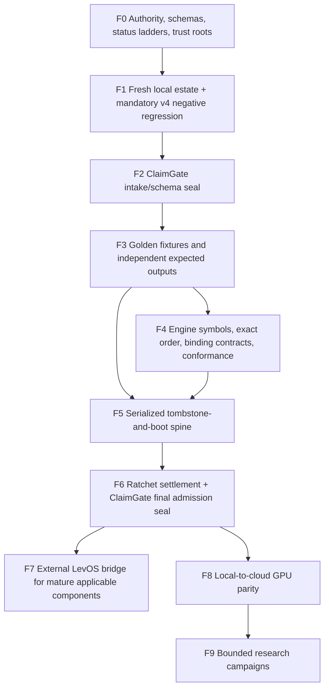

# Volume IV — ConstraintBox, ClaimGate, and the Simulation System

**Preservation date:** 2026-07-27  
**Purpose:** preserve the standalone constraint-engineering platform, its
relationship to LevOS and CodexRatchet, and the layered simulation fleet  
**Status:** working local core plus proposed integrations; not a production
security boundary

## 1. What ConstraintBox is

ConstraintBox is the lean standalone system formed by compressing useful
elements from:

- ClaimGate;
- LevOS contracts and orchestration ideas;
- finite Ratchet comparison;
- CodexRatchet’s evidence and constraint discipline;
- selected simulation and formal tools.

It must run without LevOS and without the entire CodexRatchet estate. It may
later attach to either through explicit adapters.

Its purpose is to put LLM exploration inside a finite deterministic envelope:

\[
\text{proposal}
\to
\text{strict intake}
\to
\text{controller-owned obligations}
\to
\text{tool execution}
\to
\text{independent checks}
\to
\text{plural survivors, HOLD, PARK, or rejection}.
\]

The goal is not to eliminate hallucination. It is to keep speculative
branching useful while preventing fluent output from promoting itself.

## 2. Separation of systems

| System | Function | Boundary |
|---|---|---|
| ConstraintBox | standalone finite task, evidence, and comparison controller | boots independently |
| ClaimGate | evidence/admission component inside or adjacent to ConstraintBox | not a truth oracle |
| LevOS | separately maintained agent operating environment | no source modification required |
| CodexRatchet | research estate and candidate source | not a runtime dependency of the lean core |
| simulation fleet | executes scientific contracts | optional profiles, not the controller |
| scientific Ratchet | compares complete finite candidates | not reducible to receipt validation |

Redundancy across these systems is acceptable when it supplies independent
checks. Hidden coupling is not.

## 3. Existing working core

The preserved runtime contains:

- strict single-pass JSON parsing;
- duplicate-key and non-finite rejection;
- controller-owned profiles and commands;
- bounded exhaustive constraint solving;
- NumPy recomputation;
- digest-pinned registered workers;
- subprocess/output artifact binding;
- hash-chained local ledger;
- history-pair and extension-fibre primitives;
- earned branch pruning and merging;
- finite packet-relative Ratchet comparison;
- HOLD on empty demands;
- refusal to rank non-nested candidates.

Current local tests:

| Component | Result |
|---|---:|
| ConstraintBox runtime | 35/35 |
| lean controller/CR slice | 14/14 |
| deep manifold audit | 11/11 |
| engine-emergence suite | 20/20 isolated jobs |

## 4. ClaimGate’s real value and limit

ClaimGate is useful against:

- malformed structured input;
- missing provenance;
- accidental arithmetic disagreement;
- unsupported task kinds;
- stale worker source;
- skipped evidence;
- unearned branch deletion;
- honest-agent sloppiness.

It is weak against a well-formed intentional lie when the producer controls
both the claim and its evidence declarations.

Repeated campaigns found that names, paths, roles, claimed bounds, coverage
lists, and ontology declarations all became producer-controlled relieving
surfaces.

The two reliable patterns were:

1. sever the claimed dependency and require the result to change;
2. independently rederive the claimed quantity from controller-owned inputs.

\[
\boxed{
\text{receipt shape}\ne\text{execution truth}.
}
\]

ConstraintBox should therefore be described as a containment, orchestration,
and evidence system—not perfect verification.

## 5. Lean tool profile

Always-on or early tools:

- Python standard library;
- NumPy;
- SciPy where needed;
- strict schemas;
- Z3;
- cvc5 for selected independent reproductions;
- property-based tests;
- content-addressed artifacts and ledger.

Claim-typed tools:

- PySINDy for candidate differential laws;
- PyDMD/Koopman tools for rate and spectral candidates;
- TLA+/TLC or Apalache for state-machine properties;
- JAX after the NumPy reference is mature;
- Julia and QuTiP for independent quantum semantics;
- PyTorch and cloud GPUs for irregular large-scale work.

PySINDy cannot select its own feature library and then certify the recovered
law. The controller must declare variables, sampling, units, features,
regularization, and residual decomposition.

## 6. Full simulation fleet

### NumPy/SciPy reference

Roles:

- exact-small and dense finite reference;
- analytic controls;
- counterexamples and vetoes;
- trajectory analysis.

### JAX workhorse

Candidate libraries:

- JAX/JAXlib;
- Diffrax;
- Lineax;
- JAXopt;
- OTT;
- Quimb;
- Cotengra;
- NetKet;
- Jraph;
- E3NN-JAX;
- BlackJAX;
- JAX-MD;
- JAX-Verify;
- JAXLie;
- JAXGA.

### Julia reference

Candidate packages:

- QuantumOptics.jl;
- QuantumClifford.jl;
- ITensors.jl;
- Attractors.jl;
- CliffordAlgebras.jl;
- Grassmann.jl;
- Octonions.jl;
- Catlab.jl;
- Metatheory.jl;
- Z3 bindings;
- Reactant.jl;
- CUDA.jl.

Julia remains part of the simulation engines. It is absent only from the lean
ConstraintBox boot dependency.

### Independent quantum referees

- QuTiP;
- qutip-jax;
- PennyLane;
- Qiskit;
- Cirq.

### Topology and graph tools

- GUDHI;
- TopoNetX;
- NetworkX;
- rustworkx;
- SciPy sparse;
- Geomstats.

### PyTorch/cloud layer

- PyTorch;
- torch.func;
- PyTorch Geometric;
- E3NN;
- Geomstats;
- clifford/torch_ga;
- torchdiffeq;
- torchode;
- xitorch;
- EvoTorch;
- tensor-network and MPS/PEPS implementations.

The previous D-Wave direction is retained only as an optional BQM comparator.
The primary scale path is exact-small enumeration/SMT, graph topology,
JAX/PyTorch batching, and tensor-network compression.

## 7. Resource-efficient execution

On a constrained local machine:

\[
\text{one heavy runtime}
\to
\text{immutable artifact}
\to
\text{process exit}
\to
\text{next runtime}.
\]

Each runtime must release memory before another heavy runtime starts.
Cross-runtime pointer sharing is not load-bearing until axis order, memory
lifetime, dtype, and ownership are verified.

## 8. Per-tool maintenance contract

Every tool or library receives:

1. pinned interpreter/runtime;
2. version fingerprint;
3. real import;
4. known-answer test;
5. wrong-model rejection;
6. dependency severance;
7. mutation sensitivity;
8. dispatch witness where possible;
9. independent comparison;
10. cold-start and peak-memory measurement;
11. fail-closed absence behavior;
12. freshness timestamp.

States are:

\[
\{\text{UNAVAILABLE},\text{AVAILABLE},\text{EXERCISED},
\text{CROSS-CHECKED},\text{LOAD-BEARING FOR A NAMED CLAIM}\}.
\]

## 9. Staged build

| Stage | Capability |
|---:|---|
| 0 | strict intake, schemas, finite enumeration, ledger |
| 1 | NumPy/SciPy recomputation, Z3, optional cvc5 |
| 2 | PySINDy/PyDMD candidates and TLA+ release checks |
| 3 | JAX worker with analytic, severance, and dispatch controls |
| 4 | Julia/QuTiP independent quantum profile |
| 5 | selected manifold and autonomous-engine profiles |
| 6 | cloud GPU, graph mutation, and tensor-network profiles |

The detailed architecture, runtime, schemas, tests, governance rules, and sim
plan follow.

---

# Detailed architecture and implementation chapters


---

## Preserved detailed chapter — Existing ClaimGate and ConstraintBox work, retained and separated

> Preserved in full as a detailed source chapter. The curated front section supplies the current system boundaries and authority.

# Existing ClaimGate work and the ConstraintBox next build

## What already exists

The preserved standalone runtime contains:

- strict single-pass JSON intake;
- duplicate-key and non-finite rejection;
- finite exhaustive constraint solving;
- NumPy recomputation profiles;
- registered workers with source-digest pinning;
- process/output artifact binding;
- a hash-chained local ledger;
- ensemble/history-pair primitives;
- earned branch pruning and merging;
- packet-relative finite Ratchet comparison;
- HOLD on empty demands;
- refusal to rank non-nested candidates silently;
- proposed schemas and TLA+ orchestration model.

The refreshed local verification on 2026-07-27 passed:

- 35/35 ConstraintBox tests;
- 14/14 lean monorepo-slice tests;
- 11/11 deep manifold-audit unit tests;
- 20/20 isolated engine-emergence jobs.

These are software tests and bounded mathematical probes, not a claim of
production security or scientific truth.

## What the negative campaign taught

Receipt-side classifications repeatedly created producer-controlled
exceptions. Path names, key names, role labels, claimed bounds, artifact
lists, and typed-ontology declarations were all gameable when the producer
controlled both the claim and its relieving evidence.

The reliable pattern is:

\[
\boxed{
\text{controller-owned obligation}
+
\text{severance}
+
\text{independent re-derivation}
}
\]

The standalone next build should therefore:

1. let the controller select profiles and obligations;
2. make producer output evidence, never authority;
3. derive expected structure independently where finite;
4. sever dependencies and require the verdict to change;
5. compare artifacts to actual process execution;
6. retain PARK/HOLD when verification is unavailable;
7. keep ClaimGate and the scientific Ratchet separate.

## Lean staged build

| Stage | Adds | Keeps out |
|---:|---|---|
| 0 | strict intake, finite enumeration, ledger, schemas | all heavy science runtimes |
| 1 | NumPy/SciPy recomputation, Z3, optional cvc5 | JAX, Julia, PyTorch |
| 2 | PySINDy/PyDMD claim-typed proposals, TLA+ release checks | full manifold engine |
| 3 | JAX worker with dispatch/severance/analytic controls | Julia and cloud unless requested |
| 4 | Julia/QuTiP independent quantum reference profile | cloud GPU |
| 5 | selected manifold and autonomous-engine profiles | unrelated CR estate |
| 6 | cloud GPU profiles and tensor/graph scaling | automatic promotion |

The pack is intentionally usable before stages 3–6.


---

## Preserved detailed chapter — ConstraintBox standalone: 00_START_HERE/COMPLETE_PACK_AND_SUPERSESSION.md

> Preserved in full as a detailed source chapter. The curated front section supplies the current system boundaries and authority.

# Complete Pack and Supersession Rule

This distribution is self-contained.  A recipient does not need an earlier
Gemini pack, recovery pack, audit zip, ClaimGate patch, or LevOS checkout to
understand or run its implemented core.

## Supersession is narrow

This pack supersedes earlier architecture descriptions only for the
ConstraintBox proposal.  It does not rewrite repository history or owner
decisions.

| Older recurring formulation | Treatment here |
|---|---|
| ClaimGate as receipt-shape verifier | Replaced by controller-owned task profiles and execution |
| ClaimGate as CR-only bridge | Replaced by standalone ConstraintBox plus optional CR/Lev adapters |
| One linear LLM workflow | Replaced by a persistent branch complex |
| LLM calls a gate voluntarily | Replaced by controller-owned execution boundary |
| Full Sim Engines inside lean gate | Rejected; engines remain external workers |
| Julia/PyTorch in lean core | Rejected |
| NumPy absent | Rejected; contained NumPy is optional and useful |
| Every numeric claim requires all engines | Rejected as generic platform rule |
| Similar outputs justify merging | Rejected; continuation-relative evidence is required |
| Low score justifies pruning | Rejected; empty finite fibre or falsifier is required |
| Pi is the architecture | Rejected; agent harness is replaceable |

No older artifact is silently incorporated.  Useful mechanisms have been
restated in the present schemas, runtime, and documents.


---

## Preserved detailed chapter — ConstraintBox standalone: 00_START_HERE/README.md

> Preserved in full as a detailed source chapter. The curated front section supplies the current system boundaries and authority.

# ConstraintBox Complete Standalone Pack

**Version:** proposed `0.1.0`, 2026-07-25  
**Promotion:** `promotion_allowed: false`  
**Scope:** complete standalone handoff, not a patch or delta  

ConstraintBox is a proposed branch-preserving finite constraint-path runtime.
It can run without LevOS, Codex-Ratchet, a simulation engine, or an LLM.  Those
systems attach through bounded adapters.

The persistent unit is not an LLM conversation.  It is a finite constrained
ensemble of candidate histories, projections, branches, evidence, and
unresolved obligations.  Agents may propose modifications to that ensemble.
Only the controller may execute capabilities, record evidence, prune or merge
branches, or emit an operational disposition.

## What is in this pack

| Surface | Included |
|---|---|
| Formal shared object | finite history ensemble, projections and fibres |
| Nominalist constraint rules | identity/equality/probability/metric are not implicit |
| Branch operations | preserve, park, earned prune and earned merge |
| Finite constraint solver | zero-dependency enumeration backend |
| SMT adapter | optional bounded Z3 profile; absence returns `UNKNOWN` |
| Numeric adapter | optional NumPy aggregate recomputation |
| Relative Ratchet | frozen probes, nonempty demand, verified nests, plural rivals |
| Agent boundary | proposals cannot contain commands, profiles, tolerances or verdicts |
| Worker controller | fixed source digest, argv, timeout and output binding |
| Evidence ledger | local hash-chain consistency with explicit trust ceiling |
| LevOS extraction map | what is reused, excluded or still aspirational |
| CR and Sim adapters | boundaries and acceptance contracts, not full engines |
| TLA+ model | proposed controller transition and invariants |
| Schemas | closed proposed contracts for objects, proposals, profiles and decisions |
| Tests | 35 initial executable tests plus hostile matrix |

## Quick run

```bash
cd runtime
PYTHONPATH=src python3 -m unittest discover -s tests -v
PYTHONPATH=src python3 -m constraintbox demo
PYTHONPATH=src python3 -m constraintbox doctor
```

No installation is required for the core or enumerated finite solver.

## Load order

1. `STATUS_AND_AUTHORITY.md`
2. `../01_FOUNDATION/SHARED_FINITE_CONSTRAINT_PATH_OBJECT.md`
3. `../01_FOUNDATION/NOMINALIST_CR_ALIGNMENT.md`
4. `../02_ARCHITECTURE/SYSTEM_BOUNDARIES.md`
5. `../02_ARCHITECTURE/AGENT_CONTAINMENT_AND_OBJECT_ORCHESTRATION.md`
6. `../02_ARCHITECTURE/LEVOS_EXTRACTION.md`
7. `../03_EXECUTION/TOOLS_PROFILES_AND_RESOURCE_POLICY.md`
8. `../03_EXECUTION/TEST_AND_MAINTENANCE_PROGRAM.md`
9. `../05_AUDIT/KNOWN_LIMITS_AND_OPEN_WORK.md`

## One-sentence contract

> ConstraintBox preserves finite rival histories and allows execution,
> pruning, merging, and settlement only through controller-owned constraints
> and independently recorded evidence.


---

## Preserved detailed chapter — ConstraintBox standalone: 00_START_HERE/STATUS_AND_AUTHORITY.md

> Preserved in full as a detailed source chapter. The curated front section supplies the current system boundaries and authority.

# Status, Authority, and Nonclaims

## Status vocabulary

| Term | Meaning |
|---|---|
| `OWNER_RULE_REPORTED` | A rule stated by the owner and carried here without promotion |
| `PROPOSED` | Design offered for comparison and testing |
| `IMPLEMENTED_LOCAL` | Code exists in this pack |
| `BOUNDED_TESTED_LOCAL` | A named local fixture was executed |
| `OPTIONAL_UNAVAILABLE` | Adapter exists but dependency was absent on this host |
| `OPEN` | Not decided or not implemented |
| `SUPERSEDED_HERE` | Older pack content replaced for this pack only |

## Current evidence

| Item | Status |
|---|---|
| Python core | `IMPLEMENTED_LOCAL` |
| Initial unit/hostile suite | `BOUNDED_TESTED_LOCAL` |
| NumPy profile | `BOUNDED_TESTED_LOCAL` on the packaging host |
| Z3 profile | `IMPLEMENTED_LOCAL`, dependency unavailable on packaging host |
| TLA+ specification | `PROPOSED`, not model-checked in this pack build |
| Pi/agent adapter | contract only; no selected agent harness |
| LevOS adapter | boundary design only |
| CR adapter | finite quotient fixture implemented; full CR not integrated |
| Sim Fleet adapter | worker contract implemented; full engines not integrated |
| Scientific or manifold result | none |

## Nonclaims

This pack does not claim:

- absolute minimal sufficient structure;
- object identity;
- scientific truth;
- a canonical manifold;
- correct 16-stage engine mathematics;
- full LevOS integration;
- full simulation-engine integration;
- a security boundary against a hostile operating-system user;
- that a local hash chain proves authorship;
- that SAT or UNSAT applies beyond the encoded finite contract;
- that a present path-amplitude cancellation deletes individual histories.

`ELIGIBLE` means only that the configured next bounded step may consume an
artifact.  It is not a synonym for true, proven, admitted to CR, or released.


---

## Preserved detailed chapter — ConstraintBox standalone: 01_FOUNDATION/EARNED_BRANCH_PRUNE_MERGE_AND_RATCHET.md

> Preserved in full as a detailed source chapter. The curated front section supplies the current system boundaries and authority.

# Earned Branching, Pruning, Merging, and Ratchet Settlement

ConstraintBox stores a branch complex instead of one mutable conversation.

## Operations

| Operation | Default | Required evidence |
|---|---|---|
| branch | permitted as proposal | explicit rival payload and parent lineage |
| preserve | default | none |
| park | allowed | named missing evidence/resource |
| split | conditional | new probe or demanded distinction |
| prune | denied by default | empty finite extension fibre under frozen contract |
| merge | denied by default | indistinguishable under all active probes and continuations |
| re-offer | explicit | changed demand, probe, bound, contract, or evidence |
| settle | plural | completed bounded comparison |

Pruning requires

\[
F_t(x)=\varnothing
\]

under a content-addressed finite contract.  Low score, low LLM confidence, or
model consensus is insufficient.

Merging requires continuation-relative equivalence:

\[
x\equiv_{D,C}y
\iff
\forall e\in\operatorname{Ext}_C,\quad
\operatorname{Obs}_D(xe)=\operatorname{Obs}_D(ye).
\]

Current-output equality alone is insufficient.

## Relative Ratchet

For candidate partition \(\pi\),

\[
L_D(\pi)=
|\{(a,b)\in D:[a]_\pi=[b]_\pi\}|.
\]

Survivors have \(L_D(\pi)=0\).  The tested frontier retains the coarsest
survivors inside each verified nesting chain and preserves non-nested rivals
as uncompared.

The runtime returns `HOLD` when:

- \(D=\varnothing\);
- there is no candidate;
- probe contracts differ;
- demand edges are invalid;
- no candidate survives;
- no verified comparable nest exists.

It never emits an absolute MSS winner.


---

## Preserved detailed chapter — ConstraintBox standalone: 01_FOUNDATION/NOMINALIST_CR_ALIGNMENT.md

> Preserved in full as a detailed source chapter. The curated front section supplies the current system boundaries and authority.

# Nominalist and Codex-Ratchet Alignment

ConstraintBox carries CR root constraints as programming restrictions while
keeping CR-specific scientific interpretations in an optional profile.

## Operational presentation, not primitive identity

For finite carrier \(X\) and probe family \(\Pi\),

\[
x\sim_\Pi y
\iff
\forall p\in\Pi,\ p(x)=p(y).
\]

The operational view is the quotient \(X/{\sim_\Pi}\).  File names, integer
labels, database keys, and SHA-256 digests are addresses.  They are not proofs
that two presentations possess or lack intrinsic identity.

## Always-on kernel rules

| Root constraint | Runtime consequence |
|---|---|
| Finitude | every executable search declares finite domains and bounds |
| No completed infinity | an unbounded search cannot return completion |
| No primitive identity | handles are references only |
| No primitive equality | semantic equivalence requires probes/relations |
| No primitive probability | unknown stays a set, interval, or `UNKNOWN` |
| No primitive metric | distances require a named carrier and metric |
| No primitive time | event order is explicit; wall time is metadata |
| No primitive causality | earlier execution does not establish causation |
| No privileged frame | coordinates/viewpoints are declared adapters |
| Noncommutation | ordered expressions and reversal controls are retained |
| No narrative-first | prose cannot write a controller disposition |
| Relative MSS only | frontier is packet-relative and candidate-relative |
| Plural survival | incomparable and untested rivals remain live |
| Purgatory | failure changes status; it does not erase lineage |
| Constraints precede axioms | candidates are tested under prior obligations |

## SMT boundary

SMT equality is equality of encoding terms.  It is not promoted to ontological
identity.  `SAT` means one witness in the declared finite encoding.  `UNSAT`
means no witness in that encoding and bound.  `UNKNOWN` parks.

ConstraintBox user vocabulary is:

- `BOUNDED_SAT`;
- `BOUNDED_UNSAT`;
- `UNKNOWN`;
- `PACKET_RELATIVE_FRONTIER`;
- `HOLD`;
- `INCOMPARABLE`;
- `BLOCKED`.

It avoids unqualified `PROVEN`, `TRUE`, `SOLVED`, or `ABSOLUTE_MSS`.

## Nested compatibility

\[
\mathcal T=
\{(x_0,\ldots,x_n):
C_i(x_i)\land R_{i+1,i}(x_{i+1},x_i)\}.
\]

Layer \(i\)'s admissible content is

\[
X_i^\*=\pi_i(\mathcal T).
\]

Locally valid layers cannot be ranked as whole candidates without a nesting
witness.  The runtime fixture enforces `HOLD` for flat candidates.

## Scientific profile separation

No-thermodynamic-literalism, no-observer-privilege, no-FTL-control, candidate
manifold geometry, QIT carriers, Hopf/Weyl/nonassociative branches, and engine
mechanics belong to the CR profile.  They are not generic assumptions imposed
on ordinary software tasks.


---

## Preserved detailed chapter — ConstraintBox standalone: 01_FOUNDATION/SHARED_FINITE_CONSTRAINT_PATH_OBJECT.md

> Preserved in full as a detailed source chapter. The curated front section supplies the current system boundaries and authority.

# Shared Finite Constraint-Path Object

Nominalist programming, constraint engineering, SMT checking, entropy,
geometry, path sums, and Ratchet settlement are views or operations on one
shared finite object.

## Carrier

\[
\mathfrak C=
\left(
\mathcal H,
\{X_v\},
\{C_\alpha\},
\{\pi_q\},
\{R_{\ell+1,\ell}\},
D,
\mathcal V
\right).
\]

| Component | Meaning |
|---|---|
| \(\mathcal H\) | finite complete histories |
| \(X_v\) | finite local carriers |
| \(C_\alpha\) | active compatibility constraints |
| \(\pi_q\) | projections and probes |
| \(R_{\ell+1,\ell}\) | relations between nested presentations |
| \(D\) | currently demanded distinctions |
| \(\mathcal V\) | declared valuation algebra |

The compatible whole is

\[
\mathcal T=\{h\in\mathcal H:\forall\alpha,\ C_\alpha(h)\}.
\]

A present view is a projection, not one selected narrative:

\[
P_t=\pi_t(\mathcal T).
\]

For \(x\in P_t\), its compatible completion fibre is

\[
F_t(x)=\{h\in\mathcal T:\pi_t(h)=x\}.
\]

The branch stays alive exactly when \(F_t(x)\ne\varnothing\).  Its finite
extension capacity is

\[
\kappa_t(x)=\log_2|F_t(x)|.
\]

The same operation has a geometric and entropic reading:

\[
F_{t+1}(x)=F_t(x)\cap C_{t+1}.
\]

Geometry is the changed fibre structure.  Entropy/capacity is the changed
cardinality or rank.  Neither is a narrative gloss added afterward.

## Valuation profiles

\[
Z(b)=
\bigoplus_{h\in\mathcal H_b}
\bigotimes_\alpha \psi_\alpha(h_\alpha).
\]

| Profile | Addition/product | Bounded meaning |
|---|---|---|
| Boolean | OR/AND | compatible history exists |
| Counting | \(+,\times\) | number of compatible histories |
| Tropical | \(\min,+\) | least declared cost |
| Probability | nonnegative \(+,\times\) | probability under an earned probability model |
| Complex amplitude | complex \(+,\times\) | interfering finite path amplitude |
| Operator | addition/composition | ordered channel history |

These profiles share a finite combinatorial carrier but are not flattened into
one score or interpretation.

## History-pair field

For ordered channel histories,

\[
D(j,k)=\operatorname{Tr}(K_j\rho_0K_k^\dagger).
\]

\(j=k\) contains diagonal history weights.  \(j\ne k\) contains coherence
between histories.  A CR adapter must preserve both when the task requires the
history-pair carrier.  The generic ConstraintBox core does not label a
classical possibility set as the complete quantum field.

## Anti-teleological reading

The completion space constrains which present sections are possible.  This
does not require literal backward causation or a chosen final goal.  No
attractor is installed as the destination.  A basin is a measured property of
the declared dynamics or it remains a candidate.


---

## Preserved detailed chapter — ConstraintBox standalone: 02_ARCHITECTURE/AGENT_CONTAINMENT_AND_OBJECT_ORCHESTRATION.md

> Preserved in full as a detailed source chapter. The curated front section supplies the current system boundaries and authority.

# Agent Containment and Object Orchestration

ConstraintBox orchestrates constrained finite presentations.  Agents are
temporary processors, not owners of project state.

## Deployment modes

| Mode | Boundary |
|---|---|
| human/CLI | human submits a bounded object directly |
| delegated service | an external LLM calls ConstraintBox; only inner work is contained |
| wrapped agent | ConstraintBox launches and owns the outer LLM tool surface |
| host adapter | LevOS, Codex, an IDE, or another runtime submits objects |

An external caller can ignore a returned verdict unless its host routes all
consequential capabilities through ConstraintBox.  This limitation must remain
visible.

## LLM-visible capabilities

| Capability | Meaning |
|---|---|
| `inspect_scoped` | read an approved object projection |
| `propose_candidate` | append a candidate branch |
| `propose_discriminator` | add an experiment or falsifier proposal |
| `request_capability` | request a registered controller operation |
| `submit_repair` | add a child branch preserving the failed parent |
| `query_obligations` | read active constraints without editing them |
| `request_write` | create a staged artifact proposal |
| `appeal_or_reoffer` | provide new evidence or changed contract |

The LLM does not receive general `bash`, unrestricted filesystem write, policy
write, verdict write, or raw credential access.

## Model-neutral interface

```text
propose(object_view, allowed_actions) -> proposal
criticize(candidate, evidence)        -> critique
repair(candidate, counterexample)     -> proposal
explain(decision, evidence)           -> non-authoritative draft
```

Pi, direct provider APIs, Codex, Claude, Gemini, or local models may implement
this interface.  No agent framework is required by the core.

## Compaction rule

Context compaction must preserve:

- every live or parked candidate;
- parent/child lineage;
- unresolved discriminators;
- rival operation orders and brackets;
- evidence and obstruction references;
- re-offer conditions;
- current `HOLD`/frontier result;
- claim ceilings.

A consensus summary cannot replace the branch complex.


---

## Preserved detailed chapter — ConstraintBox standalone: 02_ARCHITECTURE/CR_AND_SIM_FLEET_INTEGRATION.md

> Preserved in full as a detailed source chapter. The curated front section supplies the current system boundaries and authority.

# CR and Simulation Fleet Integration

ConstraintBox, the Sim Fleet, and Codex-Ratchet may live together while
remaining independently installable.

## Dependency direction

```text
ConstraintBox core
     |
     +--> optional numeric/SMT profiles
     |
     +--> Sim Fleet adapter ----> external JAX/Julia/Torch workers
     |
     +--> CR adapter -----------> quotient/manifold/object research
```

The full engines are not imported into the lean controller process.

## Sim worker contract

| Controller owns | Worker reports |
|---|---|
| profile and version | raw observation |
| executable and source digest | output artifact |
| environment/lock digest | device/runtime facts |
| input/output schemas | process stdout/stderr |
| timeout/memory limits | resource usage |
| checker/tolerance | no verdict |
| positive/negative fixtures | no admission |
| severance and mutation controls | no `load_bearing` self-label |
| claim ceiling | no promotion |

Integration proceeds function by function.  A JAX, Julia, Torch or symbolic
worker becomes usable only after its named finite function passes its own
profile.  “Installed” does not mean “integrated.”

## CR adapter boundary

The first CR boundary is the finite observation bundle implemented in
`runtime/src/constraintbox/ratchet.py`:

1. controller freezes presentations and probes;
2. a worker provides a response matrix;
3. ConstraintBox derives partitions;
4. active demand edges filter candidates;
5. only candidates with a shared nesting witness are ranked;
6. non-nested rivals remain live and uncompared;
7. the result is packet-relative.

No manifold layer, engine stage, Weyl/Hopf carrier, nonassociative algebra, or
scientific object claim is admitted by this fixture.

## Later engine use

Full engine schedules should be external experiment objects containing:

- explicit loop as a cycle, with no privileged computational start unless a
  task profile selects one;
- ordered stage maps and bracketed composition;
- unreset state handoff where required;
- rival schedules retained;
- numerical observation artifacts;
- analytic/exact-small controls;
- independent engine witnesses;
- controller-owned discriminators.

ConstraintBox can establish that a named implementation ran under a named
contract.  It cannot make the engine structure canonical.


---

## Preserved detailed chapter — ConstraintBox standalone: 02_ARCHITECTURE/DATA_AND_PACKAGE_LAYOUT.md

> Preserved in full as a detailed source chapter. The curated front section supplies the current system boundaries and authority.

# Data and Package Layout

```text
constraintbox/
  core/                 strict intake, policy, controller, ledger
  ensemble/             histories, projections, fibres, valuations
  branching/            preserve, park, prune, merge, re-offer
  constraints/          finite IR and bounded backends
  ratchet/              partitions and verified nested comparisons
  profiles/             controller-owned task profiles
  agents/               replaceable model adapters
  adapters/             CR, Sim Fleet and LevOS boundaries
  schemas/              closed contracts
  specs/                TLA+ and formal state model
  fixtures/             positive, negative, hostile, severance
```

## Persistent records

| Record | Required content |
|---|---|
| object snapshot | carrier, probes, constraints, relations and status |
| proposal | candidate, parents, falsifiers and requested capabilities |
| execution ticket | fixed profile, source, environment and bounds |
| artifact record | input/output hashes and process facts |
| evaluation | checker result and evidence refs |
| branch event | add, park, prune, merge or re-offer |
| Ratchet result | demand, survivors, frontier, uncompared rivals and `HOLD` reason |
| ledger head | local consistency cursor with trust ceiling |

Object snapshots and artifacts are immutable byte records.  New evidence
creates a new snapshot or event rather than rewriting prior history.


---

## Preserved detailed chapter — ConstraintBox standalone: 02_ARCHITECTURE/LEVOS_EXTRACTION.md

> Preserved in full as a detailed source chapter. The curated front section supplies the current system boundaries and authority.

# LevOS Extraction for a Lean Standalone ConstraintBox

This is a source/evidence map, not a claim that LevOS has been integrated.
The CR-side audit warns that older `claimgate-steering consume` and
orchestration paths were branch-only or deleted.  The active rebuild seam was
reported as an external patch plus Lev `core/eval`.

## Mechanisms worth retaining

| Lev mechanism | ConstraintBox implementation target | Pack status |
|---|---|---|
| harness-fired verifier | controller automatically runs configured evaluator | implemented in small form |
| GateRun completeness | command, exit, stdout, stderr and artifact hashes | implemented in worker profile |
| durable event log | append-only decision/branch ledger | implemented locally |
| evaluator packs | controller-owned task profiles | implemented |
| evidence references | content-addressed inputs and outputs | implemented |
| plugin boundary | CR, Sim and Lev attach through adapters | specified |
| trigger dispatch | events automatically fire maintenance/evaluation | open |
| one decision authority | workers observe; controller decides | implemented |
| schema admission | strict closed intake and finite-number policy | partially implemented |
| replay grading | rerun profile under same policy and source | open |
| near-duplicate finding | identify repeated/renamed proposals | optional/open |
| lifecycle vocabulary | declared, available, exercised, ready, stale | specified |

## Material deliberately not imported

| Surface | Reason |
|---|---|
| lost branch-only steering command | not a current stable dependency |
| full FlowMind architecture | parts reported as boot stubs/aspirational |
| full poly/context graph | too large for present function |
| declared ABAC C3-C5 | audit says not to depend on enforcement |
| inert term fence or nominal immutability | not demonstrated |
| ratchet-admission flow stub | replace with ordinary tested transitions |
| private Lev internal package imports | would destroy standalone operation |

## Adapter direction

```text
ConstraintBox standalone result
    -> external Lev evaluator-pack adapter
    -> Lev host observes/recomputes
```

LevOS is not the root of ConstraintBox policy.  ConstraintBox is not permitted
to write into a Lev checkout.  A future Lev developer can adopt the adapter or
equivalent evaluator pack without accepting the CR research stack.


---

## Preserved detailed chapter — ConstraintBox standalone: 02_ARCHITECTURE/SYSTEM_BOUNDARIES.md

> Preserved in full as a detailed source chapter. The curated front section supplies the current system boundaries and authority.

# System Boundaries

ConstraintBox is independently runnable.  One repository may contain
ConstraintBox, CR and simulation work without turning them into one dependency
graph or authority domain.

## Planes

| Plane | Input | Output | Explicit non-authority |
|---|---|---|---|
| ConstraintBox controller | task kind and immutable payload | operational disposition and evidence refs | scientific truth |
| Agent proposal plane | bounded object view | candidates, attacks and repairs | commands, tolerances, verdicts |
| Deterministic worker plane | controller ticket | observation artifact | admission |
| Finite constraint plane | finite IR and bound | witness, bounded exhaustion or unknown | unrestricted theorem |
| Relative Ratchet plane | frozen bundle, demand and nests | plural frontier or `HOLD` | absolute MSS |
| CR plane | admitted bounded observations | scientific candidates and falsifiers | platform policy |
| Sim Fleet | named finite function | numeric/symbolic observation | self-certification |
| LevOS adapter | public Lev execution/eval surface | host observation | ConstraintBox trust root |

## Trust topology

```text
human or host
    |
    v
controller-owned policy root
    |
    +--> untrusted agent view --> proposal only
    |
    +--> capability ticket --> isolated worker --> artifact
    |                                      |
    +<------------- independent evaluator-+
    |
    +--> ledger + branch complex + disposition
```

The policy root, capability registry, checker, tolerance, resource budget, and
claim ceiling are not writable through an untrusted request.

## Controller lifecycle

```text
RECEIVED
  -> NORMALIZED
  -> PROPOSED
  -> AUTHORIZED
  -> RUNNING
  -> OBSERVED
  -> EVALUATED
  -> ELIGIBLE | PARKED | BLOCKED | HOLD
```

An agent proposal never skips directly to an evaluated state.


---

## Preserved detailed chapter — ConstraintBox standalone: 03_EXECUTION/AGENT_AND_OBJECT_RUN_PROTOCOL.md

> Preserved in full as a detailed source chapter. The curated front section supplies the current system boundaries and authority.

# Agent and Object Run Protocol

## Submission

The caller submits:

```text
task_kind
request_id
immutable payload bytes
```

It cannot select an executable, profile, checker, tolerance, exemption or
verdict.

## Proposal wave

An agent proposal may include:

- candidate mechanism;
- parent branch;
- known rivals;
- falsifiers;
- requested experiments;
- expected observations.

It may not include authority-bearing fields.  The implemented profile scans
nested content, so moving `verdict` under `digest` does not hide it.

## Controller settlement

```text
request
 -> profile lookup
 -> strict intake
 -> branch append
 -> capability authorization
 -> worker execution
 -> artifact binding
 -> independent evaluation
 -> branch event
 -> operational disposition
```

## Model replacement

Any model may be stopped and replaced between proposal waves.  The next model
receives a bounded projection generated from the object/branch store:

- live branches;
- parked branches;
- settled obstructions;
- active probes and demands;
- available capabilities;
- missing discriminators.

It does not receive authority because it inherited a conversation.


---

## Preserved detailed chapter — ConstraintBox standalone: 03_EXECUTION/EXTERNAL_ADDITIONS_ROADMAP.md

> Preserved in full as a detailed source chapter. The curated front section supplies the current system boundaries and authority.

# External Additions Roadmap

This is a comparison queue, not an install instruction.

| Candidate | Potential value | Main discriminator | Priority |
|---|---|---|---|
| in-toto | binds planned steps to materials/products and functionaries | catches artifact/execution mismatch missed by local receipt | high |
| Cedar | fast capability authorization | clearer/safer than custom policy for real workload | medium |
| TLC | deadlock and illegal transition checking | finds counterexample in controller model | high development |
| Apalache | SMT-backed symbolic TLA+ checking | useful where TLC state explosion dominates | medium |
| cvc5 | alternate solver and proof formats | catches encoding/solver-specific result | medium |
| Hypothesis | generated edge cases and shrinking | finds new minimal hostile fixture | high test |
| JSON Schema 2020-12 | closed object contracts | rejects drift without hand-coded walkers | medium |
| Pi or other harness | model/session/tool loop | demonstrates better containment than direct API adapter | open |
| Gondolin/Docker/OpenShell | OS process containment | prevents filesystem/network capability escape | later |
| agentOS | lightweight V8/WASM capability runtime | resource/security improvement over subprocess profiles | research |
| JAX | batch and GPU checking | bounded task materially exceeds NumPy performance | later |
| Wasmtime/WASI | portable restricted workers | reduces native worker authority | later |

No addition is admitted because it is popular, installed, or conceptually
aligned.  Each needs a task where it detects an error or provides a measured
resource advantage over the current profile.


---

## Preserved detailed chapter — ConstraintBox standalone: 03_EXECUTION/TEST_AND_MAINTENANCE_PROGRAM.md

> Preserved in full as a detailed source chapter. The curated front section supplies the current system boundaries and authority.

# Test and Maintenance Program

## Test classes

| Class | Required behavior |
|---|---|
| known positive | accepted only within claim ceiling |
| known negative | blocked for the intended reason |
| boundary | exact edge of finite/tolerance contract |
| dependency severance | selected capability becomes unavailable or parks |
| mechanism mutation | output or verdict changes |
| stale source | source digest mismatch blocks |
| malformed intake | duplicate keys, nonfinite values and non-object roots block |
| authority injection | nested verdict/command/profile fields block |
| branch preservation | rejected candidate remains in lineage |
| prune control | nonempty fibre cannot be pruned |
| merge control | differing continuations cannot be merged |
| Ratchet hold | empty demand and invalid nests hold |
| contract mismatch | candidate-selected probe contract cannot decide comparison |
| ledger mutation | hash-chain verification fails |

## Capability lifecycle

```text
DECLARED
  -> AVAILABLE
  -> EXERCISED
  -> PROFILE_READY
  -> STALE | BLOCKED
```

`IMPORTABLE` is evidence only for `AVAILABLE`.

## Major-run preflight

1. resolve exact profile IDs;
2. check source and environment digests;
3. run selected positive/negative/boundary fixtures;
4. confirm dependency severance;
5. confirm mutation control;
6. verify schemas and finite-value policy;
7. verify output finalization and rehash;
8. verify ledger before/after head;
9. freeze policy and probe contracts;
10. record resource and claim ceilings.

## Maintenance

| Trigger | Required response |
|---|---|
| dependency update | mark affected profiles stale |
| source change | rerun fixtures and mutation controls |
| new gaming attempt | add a permanent hostile fixture |
| policy change | create new policy generation |
| repaired historical debt | update frozen path+digest set explicitly |
| adapter API change | park adapter until conformance passes |
| major run complete | preserve artifacts, ledger head and unresolved branches |

Count-only baselines are not sufficient because one repaired failure can hide
one new failure.  Debt baselines use path plus digest.


---

## Preserved detailed chapter — ConstraintBox standalone: 03_EXECUTION/TOOLS_PROFILES_AND_RESOURCE_POLICY.md

> Preserved in full as a detailed source chapter. The curated front section supplies the current system boundaries and authority.

# Tools, Profiles, and Resource Policy

The core is zero-dependency Python.  Optional tools run only for matching task
profiles and preferably in separate processes.

| Tool | Role | Ordinary cadence | Authority ceiling |
|---|---|---|---|
| stdlib | parsing, hashing, process control, SQLite/JSONL, enumeration | every task | operational |
| NumPy | bounded recomputation and array controls | numeric tasks | numeric veto |
| SciPy | named distribution/sparse/optimization controls | selected tasks | function-specific |
| Z3 | finite obligations and impossible-state checks | SMT tasks | encoded bounded result |
| cvc5 | independent solver or encoding comparison | high-value SMT tasks | second encoded result |
| TLC | lifecycle/safety model | development/CI | model result |
| Apalache | symbolic bounded TLA+ analysis | later CI | secondary model result |
| PySINDy | candidate law generation | explicit law-search tasks | proposal only |
| PyDMD | candidate spectral/rate model | explicit rate tasks | proposal only |
| JAX | batched finite numeric worker | later selected profile | observation |
| Julia | independent reference worker | selected CR function | observation |
| Torch/PyG | irregular graph or renesting worker | later/cloud | observation |
| in-toto | command/material/product binding | later high-value runs | execution provenance |

## PySINDy rule

The controller fixes:

- observed variables and units;
- derivative estimator;
- candidate feature library;
- rival libraries;
- training and held-out split;
- residual decomposition;
- acceptance ceiling.

PySINDy may propose a law.  It cannot choose its own hypothesis space and then
validate that law.

## SMT rule

Prefer finite enums and bit vectors.  Integer or real variables must have an
explicit finite operational bound.  `UNKNOWN`, timeout, unsupported encoding,
or missing solver returns `PARKED`.

## Resource rule

Each profile declares:

- timeout;
- maximum finite state count;
- output size;
- optional memory budget;
- source and environment digest;
- fixture-set digest;
- freshness interval.

The full fleet does not boot before every task.  The selected profile runs a
cheap freshness check; the full hostile and maintenance suite runs after
source/environment changes and on a schedule.


---

## Preserved detailed chapter — ConstraintBox standalone: 04_SPEC/tla/VERIFY_TLA.md

> Preserved in full as a detailed source chapter. The curated front section supplies the current system boundaries and authority.

# TLA+ Verification Status

`ConstraintBox.tla` is a proposed small transition model for the controller
state machine. It has not been model-checked in this pack build because no TLA+
toolchain was present.

The intended next verification is:

```bash
java -cp tla2tools.jar tlc2.TLC -config ConstraintBox.cfg ConstraintBox.tla
```

Required checks:

- only the controller can move a branch to `PRUNED` or `MERGED`;
- every terminal branch has controller-owned evidence;
- a missing tool cannot become `PASS`;
- unresolved rivals remain plural;
- an empty demand set produces `HOLD`;
- the bounded state graph contains no invalid transition.

Until TLC or Apalache emits a pinned artifact and the negative controls fail as
expected, this specification remains `PROPOSED`, not verified.


---

## Preserved detailed chapter — ConstraintBox standalone: 05_AUDIT/HOSTILE_TEST_MATRIX.md

> Preserved in full as a detailed source chapter. The curated front section supplies the current system boundaries and authority.

# Hostile Test Matrix

| ID | Attempt | Expected |
|---|---|---|
| H01 | duplicate JSON key | `BLOCKED` |
| H02 | `NaN`/Infinity | `BLOCKED` |
| H03 | array root where object required | `BLOCKED` |
| H04 | unknown task supplies `profile_id` | `BLOCKED` |
| H05 | proposal contains nested `verdict` under `digest` | `BLOCKED` |
| H06 | proposal supplies command/tolerance/promotion | `BLOCKED` |
| H07 | worker source digest changed | `BLOCKED` |
| H08 | worker exits nonzero | `BLOCKED` |
| H09 | worker times out | `PARKED` |
| H10 | output artifact missing/malformed | `BLOCKED` |
| H11 | NumPy claim mismatches independent recomputation | `BLOCKED` |
| H12 | reduction order changes result | `PARKED` |
| H13 | finite state count exceeds bound | `PARKED` |
| H14 | Z3 missing or returns unknown | `PARKED` |
| H15 | prune branch with nonempty fibre | refused |
| H16 | merge branches with different continuation outcomes | refused |
| H17 | merge has no active probes | refused |
| H18 | empty Ratchet demand | `HOLD` |
| H19 | candidate probe contracts differ | `HOLD` |
| H20 | candidates lack verified nest | `HOLD` |
| H21 | mutate transition to break quotient congruence | witness returned |
| H22 | mutate ledger record | verification fails |
| H23 | complex path amplitudes cancel | histories remain stored |
| H24 | diagonalize history-pair field | off-diagonal loss is measurable |

The initial automated suite covers H01–H07, H11–H24 except an actual Z3 run.
H08–H10 need additional worker fixtures before the capability profile can be
called mature.


---

## Preserved detailed chapter — ConstraintBox standalone: 05_AUDIT/KNOWN_LIMITS_AND_OPEN_WORK.md

> Preserved in full as a detailed source chapter. The curated front section supplies the current system boundaries and authority.

# Known Limits and Open Work

## Implemented but preliminary

- strict JSON byte intake;
- controller-owned task/profile mapping;
- finite enumerated constraint backend;
- optional finite Z3 backend;
- optional NumPy aggregate profile;
- fixed-source worker profile;
- local hash-chain ledger;
- finite history projections and extension fibres;
- path-amplitude and history-pair demonstrations;
- earned prune and merge guards;
- packet-relative nested Ratchet fixture;
- agent authority-field rejection.

## Not yet implemented

| Work | Reason it matters |
|---|---|
| durable SQLite object/branch store | current branch ledger is in memory |
| atomic output finalization | worker output can be improved |
| resource/RSS enforcement | timeout alone is incomplete |
| unpredictable hostile fixtures | fixed probes can be detected |
| output-dependence witness | real dispatch can still print unrelated constant |
| replay engine | same profile should rerun from recorded ticket |
| signed external policy root | local code owner can alter policy |
| TLA/TLC execution | jar not included or run |
| actual Z3 execution | dependency unavailable on packaging host |
| cvc5 independent encoding | not implemented |
| JSON Schema runtime enforcement | schemas included; dependency not required |
| agent harness adapter | no Pi/API harness selected |
| OS sandbox | no hard filesystem/network/process containment |
| LevOS adapter code | only extraction/boundary design |
| full Sim Fleet registry | only one echo worker profile |
| full CR/manifold adapter | only finite quotient fixture |
| engine-stage mathematics | out of scope for ConstraintBox core |

## Build ceiling

The pack is a complete self-contained proposal and runnable preliminary core.
It is not a complete production enforcement system.  “Complete pack” refers
to handoff scope, not feature maturity.


---

## Preserved detailed chapter — ConstraintBox standalone: 05_AUDIT/THREAT_MODEL_AND_LLM_FAILURES.md

> Preserved in full as a detailed source chapter. The curated front section supplies the current system boundaries and authority.

# Threat Model and LLM Failure Modes

ConstraintBox is intended to reduce unearned passes and narrative collapse.  It
does not assume LLMs stop hallucinating or gaming.

| Failure mode | ConstraintBox response |
|---|---|
| smooth conflicting branches into one story | persistent branch complex |
| select own checker or tolerance | controller-owned task profile |
| hide verdict under innocent key/path | recursive authority-field rejection |
| report `ran: true` without execution | controller launches worker and binds process artifact |
| write well-shaped false receipt | independent re-derivation/severance required by mature profiles |
| call missing dependency success | unavailable/unknown parks |
| treat solver SAT as universal truth | bounded vocabulary and claim ceiling |
| infer identity from names/hashes | address-only semantic rule |
| rank with empty demand | `HOLD` |
| rank flat or mismatched candidates | `HOLD` |
| merge on similarity/consensus | continuation-relative merge evidence |
| prune on confidence/score | empty-fibre bounded evidence required |
| overwrite failed branch | immutable lineage and status event |
| average heterogeneous residuals | typed evidence fields |
| make one final future teleological | plural completion fibres |
| collapse history-pair field to diagonal | CR profile requirement and control |

## Strongest remaining threat

A worker can execute a real dependency and still print an unrelated constant.
The basic profile proves process execution and artifact binding, not complete
data dependence.  Mature profiles need:

- independent recomputation;
- dependency severance;
- mechanism mutation;
- output-dependence control;
- unpredictable controller-owned fixtures;
- where warranted, in-toto or equivalent step/material/product binding.

The pack does not claim to have solved this generally.


---

## Preserved detailed chapter — ConstraintBox standalone: 06_MANIFEST/PACK_CONTENTS.md

> Preserved in full as a detailed source chapter. The curated front section supplies the current system boundaries and authority.

# Complete Pack Contents

| Directory | Purpose |
|---|---|
| `00_START_HERE` | authority, scope, load order, supersession |
| `01_FOUNDATION` | shared finite constraint-path object and nominalist rules |
| `02_ARCHITECTURE` | controller, agent, LevOS, CR, and Sim Fleet boundaries |
| `03_EXECUTION` | profiles, maintenance, run protocol, external roadmap |
| `04_SPEC` | schemas, examples, controller profiles, TLA+ model |
| `05_AUDIT` | LLM failure modes, hostile tests, limits |
| `06_MANIFEST` | source lineage, verification receipt, inventory and hashes |
| `runtime` | executable Python package, worker, and tests |

The package is self-contained. Optional external tools are discovered at
runtime and never implied by their mention in documentation.


---

## Preserved detailed chapter — ConstraintBox standalone: 06_MANIFEST/SOURCE_LINEAGE.md

> Preserved in full as a detailed source chapter. The curated front section supplies the current system boundaries and authority.

# Source Lineage and Conflict Handling

This pack is a clean standalone synthesis. It is not a cumulative dump and it
does not silently promote earlier documents.

## Inputs used

- owner corrections and requirements in the working conversation;
- the prior ConstraintBox/ClaimGate/LevOS audit material;
- the earlier recovery and Gemini re-entry packs;
- the preliminary lean monorepo slice and audit;
- the Codex-Ratchet repository evidence inspected during the audit;
- measured failures reported for receipt-shape validation, engine witnessing,
  frozen baselines, and controller-owned authority.

## Rules carried forward

- preserve rivals until pruning or merging is earned;
- comparisons are relative to declared finite candidates and demands;
- an LLM is a proposal generator, never its own verifier;
- the controller owns profiles, commands, tolerances, evidence policy, and
  dispositions;
- missing or unmeasured capability does not pass;
- a declared engine is not evidence that the engine performed the computation;
- CR-specific manifold, engine, and scientific claims stay outside the generic
  core;
- LevOS is an optional adapter and source of useful mechanisms, not a runtime
  prerequisite;
- lean NumPy and bounded solver profiles may be useful; the full simulation
  estate is not embedded in the core.

## Conflicts not averaged away

| Conflict | Pack treatment |
|---|---|
| receipt shape versus independent execution evidence | shape is intake only; execution requires controller-observed work |
| hash chain as integrity versus authorship | local mutation detector only; no authorship claim |
| v7 partition order versus v8 scalar/Pareto treatment | relative partition refinement implemented; no scalar MSS claim |
| full sim estate versus lean ConstraintBox core | adapters and acceptance profiles; no Julia/PyTorch dependency |
| LevOS as host versus standalone use | standalone first; LevOS bridge optional |
| deterministic history versus coherent history-pair field | both retained as different finite objects |
| pruning histories versus cancelling a projected amplitude | cancellation does not erase histories |

## Supersession scope

Older packs remain evidence and history. For this handoff, the documents,
schemas, runtime, and tests in this directory are the complete proposed package
to inspect. No reader needs an older ZIP to run or understand the core.


---

## Preserved detailed chapter — ConstraintBox standalone: 06_MANIFEST/VERIFICATION_RECEIPT.md

> Preserved in full as a detailed source chapter. The curated front section supplies the current system boundaries and authority.

# Verification Receipt

**Build:** `CONSTRAINTBOX_COMPLETE_STANDALONE_20260725_v1`  
**Date:** 2026-07-25  
**Disposition:** bounded local packaging checks passed  
**Promotion:** `false`

## Executed checks

| Check | Result |
|---|---|
| Python source compilation | passed |
| Unit and hostile tests | 35 passed, 0 failed |
| Python wheel build and isolated target install | passed |
| Core demo | passed |
| Finite SAT example | `BOUNDED_SAT` with witness |
| Finite UNSAT example | `BOUNDED_UNSAT` |
| JSON parsing | 10 files parsed |
| NumPy optional profile | available and locally exercised |
| Z3 optional profile | unavailable on packaging host; returned no false success |
| TLA+ model checking | not run |
| Full CR integration | not run |
| Full Sim Fleet integration | not run |
| LevOS bridge | not run |

## Interpretation

These checks show that the packaged core runs, its current tests pass, and
optional dependency absence is visible. They do not certify scientific claims,
prove security against a privileged hostile user, validate the proposed
manifold, or demonstrate the full simulation estate.

Machine-generated environment, inventory, and digest files accompany this
receipt.


---

## Preserved detailed chapter — ConstraintBox standalone: runtime/README.md

> Preserved in full as a detailed source chapter. The curated front section supplies the current system boundaries and authority.

# ConstraintBox Runtime

This directory is the executable, zero-dependency core of the proposed
ConstraintBox pack.

## Run without installing

```bash
PYTHONPATH=src python3 -m unittest discover -s tests -v
PYTHONPATH=src python3 -m constraintbox demo
PYTHONPATH=src python3 -m constraintbox doctor
PYTHONPATH=src python3 -m constraintbox solve \
  ../04_SPEC/examples/finite_problem_sat.json
```

The core finite solver uses exhaustive enumeration and therefore applies only
to declared bounded domains. Optional profiles are detected by `doctor` and
must return `UNKNOWN`, `PARK`, or `UNAVAILABLE` when their dependencies or
evidence are absent.

## Install locally

```bash
python3 -m pip install -e .
constraintbox demo
```

Optional dependencies are intentionally not installed by the pack.

## Runtime boundary

- Agents submit proposals; they do not choose commands, tools, policies,
  tolerances, verdicts, or promotion.
- The controller resolves a registered profile, runs a digest-pinned worker,
  and binds request, process, output, and evidence hashes.
- The local ledger detects accidental mutation or deletion in one local trust
  domain. It does not prove authorship against a user who can rewrite both code
  and ledger.
- CR, full simulation engines, LevOS, JAX, PySINDy, and TLA+ are adapters or
  future profiles, not hidden dependencies of the core.


---

## Preserved detailed chapter — Simulation-engine dependency layers

> Preserved in full as a detailed source chapter. The curated front section supplies the current system boundaries and authority.

# Proposed simulation-engine dependency layers

**Status:** preservation of the evolved plan; not an installation receipt  
**Boundary:** this is the simulation fleet, not ConstraintBox itself. ConstraintBox uses a lean subset and may validate or launch the rest.

## 1. Resource rule

On constrained local hardware, one heavy runtime owns the machine at a time.
Lanes exchange immutable content-addressed artifacts and exit before the next
heavy runtime starts.

\[
\text{reference}
\to
\text{workhorse}
\to
\text{analytical satellites}
\to
\text{formal checks}
\to
\text{evidence gate}.
\]

Zero-copy exchange across independent runtimes is optional and should not be
load-bearing until lifetime, layout, dtype, and axis-order controls exist.

## 2. Layer A — lean ConstraintBox numerical and formal core

| Library/tool | Role | Default disposition |
|---|---|---|
| Python standard library | strict intake, subprocesses, hashes, finite enumeration | required |
| `numpy` | finite arrays, analytic reference calculations, recomputation, negative controls | required for numeric profile |
| `scipy` | matrix exponentials, sparse algebra, statistics, optimization | claim-typed |
| `jsonschema` | closed structured contracts | recommended |
| `hypothesis` | property-based hostile and boundary tests | recommended |
| `z3-solver` | bounded satisfiability and exact finite obligations | recommended |
| `cvc5` | independent SMT reproduction for selected obligations | recommended |
| Bitwuzla | bit-vector and floating-point rival solver | optional candidate |
| Java runtime | host for TLC and some formal tools | optional formal profile |
| TLA+/TLC | state-machine safety/liveness checking | release and orchestration checks |
| Apalache | symbolic bounded TLA+ checking | optional candidate |
| `in-toto` | mature artifact-to-execution attestation model | high-value external addition |

## 3. Layer B — analytical satellites

These tools propose laws or analyze trajectories. They do not certify their own
hypothesis space.

| Library | Use | Required constraint |
|---|---|---|
| `pysindy` | sparse identification of candidate differential equations | variables, feature library, sampling, units, regularization, and residual decomposition declared externally |
| `pydmd` | dynamic-mode and spectral-rate proposals | declared observable and independent rate check |
| `pykoopman` | Koopman observable and lifting proposals | park when lifting dictionary is producer-chosen and untested |
| `sympy` | symbolic simplification and exact-small derivations | verify assumptions and domains |
| `numba` | acceleration for bounded NumPy kernels | never silently changes numerical semantics |
| `scikit-learn` | baselines, clustering, regression, metrics | proposal/control role |
| `galois` | finite-field and coding experiments | exact finite carriers |
| `opt_einsum` | contraction-path optimization | compare result to independent contraction |

## 4. Layer C — JAX workhorse

| Library | Use |
|---|---|
| `jax` | differentiable vectorized array workhorse |
| `jaxlib` | compiled backend |
| `diffrax` | differential-equation solvers |
| `lineax` | linear solver components |
| `jaxopt` | fixed-point and optimization routines |
| `ott-jax` | optimal transport |
| `quimb` | quantum information and tensor-network scaffolding |
| `cotengra` | contraction-tree optimization |
| `netket` | variational quantum many-body experiments |
| `e3nn-jax` / `e3nn` | equivariant representations |
| `jraph` | graph neural computation |
| `blackjax` | sampling on explicitly declared state or history spaces |
| `jax-md` | candidate for periodic/toroidal particle and neighbor mechanics |
| `jax-verify` | candidate bound/verification support |
| `jaxlie` | candidate Lie-group computations |
| `jaxga` | candidate geometric-algebra experiments |

JAX is the next scaling layer after the NumPy reference, not the first source
of truth. A `jax.make_jaxpr` or StableHLO witness can establish dispatch, but
the scientific value still needs output dependence and independent
re-derivation.

## 5. Layer D — Julia reference and mathematical semantics

| Julia package/tool | Use |
|---|---|
| Julia runtime | independent language/runtime reference |
| `QuantumOptics.jl` | GKSL, quantum trajectories, operator semantics |
| `QuantumClifford.jl` | Clifford and stabilizer computations |
| `ITensors.jl` | tensor networks |
| `Attractors.jl` | basin and attractor analysis |
| `CliffordAlgebras.jl` | Clifford algebra experiments |
| `Grassmann.jl` | geometric/exterior algebra |
| `Octonions.jl` or explicit octonion implementation | nonassociative controls |
| `Catlab.jl` | categorical and compositional models |
| `Metatheory.jl` | rewriting and equality-saturation candidates |
| Julia `Z3` bindings | local formal obligations where appropriate |
| `Reactant.jl` | proposed XLA/GPU route for a Julia cross-witness |
| `CUDA.jl` | optional native Julia GPU route |

Julia remains part of the engine fleet. It must never be removed merely to make
ConstraintBox lean; the separation is that ConstraintBox core does not require
Julia to boot.

## 6. Layer E — independent quantum and circuit referees

| Library | Use |
|---|---|
| `qutip` | independent quantum dynamics reference |
| `qutip-jax` | cross-backend QuTiP/JAX experiments |
| `pennylane` | circuit differentiation and hardware-neutral circuits |
| `qiskit` | circuit and channel rival implementation |
| `cirq` | second circuit representation |

These libraries are claim-typed. Importability does not make them authoritative.

## 7. Layer F — topology, graphs, and finite geometry

| Library | Use |
|---|---|
| `gudhi` | persistent homology and filtered complexes |
| `toponetx` | cell and combinatorial complexes |
| `networkx` | readable graph reference |
| `rustworkx` | faster independent graph algorithms |
| `scipy.sparse` | incidence, boundary, Hodge, and Laplacian operators |
| `geomstats` | candidate manifold geometry routines |

Every topology result should retain exact-small boundary-matrix controls.

## 8. Layer G — PyTorch and cloud GPU

| Library/tool | Use |
|---|---|
| `torch` | irregular differentiable kernels and GPU arrays |
| `torch.func` | functional transforms and Jacobian/Hessian probes |
| PyTorch Geometric (`torch_geometric`) | graph message passing and candidate renesting \(G\to G'\) |
| `e3nn` | equivariant field models |
| `geomstats` with PyTorch backend | manifold candidates |
| `clifford` / `torch_ga` | geometric-algebra scouts |
| `torchdiffeq` | neural/ordinary differential equation candidates |
| `torchode` | batched differential equations |
| `xitorch` | differentiable scientific routines |
| `evotorch` | bounded evolutionary proposal search |
| TensorNetwork-compatible packages | large tensor contractions |
| MPS/PEPS implementations | compressed many-body and constraint-state representations |

The cloud GPU target is the expensive part that cannot be reduced to a cheap
contraction theorem: mutating topology, large history spaces, coupled
piecewise/hybrid maps, tensor-network compression, and batched rival towers.

Every cloud numeric claim needs an analytic, NumPy, JAX, Julia, or other
independent witness appropriate to the claim. A GPU-only number does not
self-seal.

## 9. Superseded D-Wave direction

The broad D-Wave/annealing idea was replaced as the primary path by:

1. exact finite enumeration and SMT for small constraint systems;
2. graph/topology computation for deformation and cycle structure;
3. JAX and PyTorch GPU batching for larger continuous or hybrid searches;
4. tensor-network compression for large structured state spaces;
5. explicit negative controls and independent replay.

Annealing remains a possible bounded comparator, not the main engine and not a
proof device.

Historical packages:

| Package | Preserved role |
|---|---|
| `dimod` | BQM representation and small comparator |
| `neal` | simulated-annealing control |
| `pgmpy` | factor-graph and probabilistic-graph candidate |

None is required in the current lean plan.

## 10. Per-library acceptance test

Each library or runtime must pass:

1. pinned interpreter/runtime and version fingerprint;
2. real import from the intended environment;
3. known-answer calculation;
4. wrong-model rejection;
5. dependency severance;
6. output-mutation sensitivity;
7. dispatch witness when practical;
8. cross-tool or analytic comparison;
9. cold-start time and peak memory;
10. explicit claim types for which the tool is applicable;
11. fail-closed behavior when unavailable;
12. freshness timestamp and maintenance cadence.

The result states are:

\[
\{\text{UNAVAILABLE},\text{AVAILABLE},\text{EXERCISED},
\text{CROSS-CHECKED},\text{LOAD-BEARING FOR NAMED CLAIM}\}.
\]


---

## Preserved detailed chapter — Deep audit and implementation plan

> Preserved in full as a detailed source chapter. The curated front section supplies the current system boundaries and authority.

# Deep Audit and Lean Implementation Plan

Date: 2026-07-25  
Status: local audit and preliminary prototype only  
Promotion: `promotion_allowed: false`

This document separates observed repository behavior from proposed architecture.
Nothing here promotes a manifold layer, engine, tool, branch, LevOS integration,
or scientific claim.

## 1. Evidence boundary

The audit used:

- a read-only clone of `Joshua-Eisenhart/Codex-Ratchet`;
- GitHub's compare API;
- local execution of bounded fixtures;
- the repository's Wizard v4.3 object-preservation validator;
- three bounded source/runtime audits covering ClaimGate, the simulation estate,
  and the Ratchet/Object boundary.

No dependency was installed. No repository file, branch, pull request, LevOS
checkout, or GitHub setting was changed.

### Repository reality

| Surface | Observed state |
|---|---|
| `main` | commit `87446663072c9c102609fe5f9abe9dee09056e31` |
| ClaimGate review branch | `claimgate/review-bakeoff-enforcement` at `5e61f279d25456a96a4441135babc67e25af2dca` |
| GitHub comparison | review branch is 239 commits ahead and 0 behind |
| ClaimGate on `main` | absent |
| Review branch as a small patch | false; it contains broad system and dossier work |
| Standalone package manifest | absent |
| Working root interpreter declaration | Mac-specific path not present in this checkout |

The review branch is a source mine and hostile-fixture mine. It is not a safe
merge unit.

## 2. The intended system, without flattening

| Plane | Function | Input authority | Output | Explicit non-authority |
|---|---|---|---|---|
| ClaimGate core | bound execution, artifacts and operational disposition | controller policy | `ELIGIBLE`, `PARKED`, or `BLOCKED` record | scientific truth, object identity, MSS |
| Sim Fleet | compute one named finite function | versioned worker profile | observation artifact | admission or promotion |
| CR quotient kernel | derive probe-relative operational equivalence | frozen probe contract and observation bundle | finite partition candidate | intrinsic identity |
| CR Ratchet | compare surviving candidates inside verified nests | explicit nonempty demand | packet-relative frontier or `HOLD` | absolute MSS or forced winner |
| Object research | test persistence, intervention and prediction of quotients | admitted bounded bundles | object candidates with falsifiers | general perception claims |
| LevOS adapter | optional host observation or later bounded invocation | public LevOS surfaces | host-reported evidence | ClaimGate trust root or scientific authority |

These can share one monorepo while remaining separate packages, schemas,
registries, and runtimes.

## 3. Critical audit findings

### A. The serialized Sim spine can mark mock data as real

Fresh local execution showed:

| Requested stage | Artifact bytes | Receipt |
|---|---|---|
| `SPINE_REAL=jax` | `MOCK_DATA_FOR_JAX` | `payload: real`, `scientific_status: SUPPORT`, `execution_status: COMPLETED` |
| `SPINE_REAL=z3` | `MOCK_DATA_FOR_Z3` | same, plus `proof_status: UNSAT` |

Only the Julia branch has a native implementation. The generic branch writes
mock bytes after `SPINE_REAL` has already changed the label. A packet-mode
counterexample override is also assigned and never consumed.

Decision: quarantine this dispatcher. Preserve process separation, input
rehashing and tombstone-and-boot. Replace stage-name branching with a
controller-owned worker registry.

### B. Current ClaimGate mostly checks producer-shaped documents

Fresh tests established:

- strict raw-byte intake catches duplicate keys and non-finite poison;
- the Node linter rejects its inflated fixture;
- the Python recompute gate returns success with `N/A` on both the honest and
  inflated fixture because the Node contract uses `{claim, from, op}` while
  Python expects `{claim, raw, op}`;
- a producer can declare `numeric_engine_required: false`;
- metadata-only mode admits forged engine metadata;
- only one nominal JAX leg is rerun, and that rerun need not prove a JAX
  operation produced the result;
- Julia is not independently launched by the seal;
- multiple tier-0 implementations use different schemas;
- a clean non-object JSON value can pass some boundaries.

Decision: keep the strict parser and hostile fixtures. Replace the shell chain,
duplicate validators, producer-authored recompute contract and three-engine
seal.

### C. One existing “all pass” manifold fixture omits its own falsifier

`system_v8/manifold_layers/nest_L3_on_L2_v0.py` states:

```text
g_fiber = g_joint - g_radial >= 0
```

Fresh execution reported `all_pass: true`. Direct recomputation found:

| Quantity | Result |
|---|---:|
| minimum `g_fiber` | `-3.0000000087213046` |
| maximum `g_fiber` | `0.9999999993000438` |
| negative samples below `-1e-8` | 39 of 40 |

The checks only assert that the remainder is not identically zero and not
identical to the whole metric. They never test nonnegativity.

This does not settle the layer question. It shows why each proposed layer needs
a profile-owned mathematical falsifier, not only a producer-authored
`all_pass`.

### D. The simulation estate is not a fleet yet

| Surface | Observed shape |
|---|---|
| `sim_engines/stress` | nine direct stress probes plus Julia helpers |
| `sim_engines/serialized` | four-name transport canary |
| `system_v8/tool_ledger` | 78 one-off tests and 90 JSON documents |
| hard-coded Mac paths | 51 of 78 tool tests |
| JSON documents without root `schema` | 68 of 90 |
| profile/worker registry | absent |
| reproducible root lock | absent |
| Julia Manifest | absent |

The current checkout has NumPy and SciPy. It does not have JAX, Julia, Z3,
cvc5, PySINDy, PyDMD, PyKoopman, Torch or PyArrow. Historical receipts describe
other hosts; they do not establish availability here.

### E. The current Ratchet boundary permits comparisons it should hold

Fresh source checks and micro-runs found:

- empty demands still produce an ordering instead of `HOLD`;
- candidates own their probe family and re-identification function;
- candidates from different probe contracts can be compared;
- flat candidates without a verified nesting witness enter the frontier;
- equal partitions can be labeled incomparable instead of remerged;
- no typed packet-level `HOLD` result exists.

The partition kernel remains useful:

\[
x\sim_M y
\iff
\forall p\in M,\;R(x,p)=R(y,p).
\]

Keep exact partition normalization, refinement, demand-edge collapse, plural
frontiers and Purgatory. Rewrite ownership and guards.

## 4. Proposed monorepo layout

```text
packages/
  claimgate-core/       stdlib intake, ticket, runner, artifact and ledger
  claimgate-numeric/    optional NumPy/SciPy profiles
  claimgate-smt/        optional Z3/cvc5 finite-obligation profiles
  claimgate-cr/         observation-bundle and Ratchet adapters
  claimgate-levos/      optional public-surface host adapter

cr/
  kernel/               finite quotient and nested comparison
  objects/              bounded persistence/intervention/prediction research
  manifold/             candidate layer fixtures and alternative order tests

sim_fleet/
  profiles/             controller-owned worker definitions
  workers/              one bounded function per worker
  fixtures/             positive, negative, boundary and severance fixtures
  locks/                environment identities

legacy/
  evidence/             archived review-branch receipts and hostile corpus
```

One repository does not imply one dependency graph. `claimgate-core` must
install and run without CR, LevOS, JAX, Julia, PySINDy or Torch.

## 5. Controller-owned execution contract

### Untrusted request

```text
request_id
task_kind
input_artifact_sha256
input schema payload
```

It contains no command, checker, tolerance, role, `pass`, exemption, worker
status, scientific status, or promotion field.

### Worker profile

| Field | Purpose |
|---|---|
| `profile_id@version` | stable capability address |
| fixed entrypoint and runtime | prevents packet-selected commands |
| source digest | detects worker drift |
| environment/lock digest | separates host estates |
| input/output schema IDs | prevents contract guessing |
| named tool API | states what operation must be load-bearing |
| positive/negative/boundary fixture digests | recurring capability check |
| severance control | proves the dependency matters |
| mutation control | proves the output changes with the mechanism |
| checker and tolerance | controller-owned semantics |
| timeout/memory/output limits | bounded execution |
| claim ceiling | prevents execution evidence becoming scientific authority |

### Lifecycle

```text
PROPOSED
  -> TICKETED
  -> RUNNING
  -> ARTIFACTED
  -> CHECKED
  -> ELIGIBLE | PARKED | BLOCKED
```

`ELIGIBLE` means only that the next configured step may consume the artifact.

## 6. Tool plan: most result for least runtime

| Tool | Proposed role | Default cadence | Resource posture | Admission rule |
|---|---|---|---|---|
| Python stdlib | strict intake, hashing, subprocess, ledger, finite reference | every task | minimal | core |
| NumPy | aggregates, array checks, small linear algebra, exact-small controls | claim-typed | low | first optional profile |
| SciPy | distribution tests, sparse/optimization functions when named | only matching claims | low/moderate | function-specific |
| Z3 | bounded finite obligations and impossible-state checks | only SMT claims | low for bounded packets | missing/UNKNOWN parks |
| cvc5 | independent encoding cross-check | selected high-value SMT claims | low/moderate | not a decorative second solver |
| TLA+/TLC | controller lifecycle and stale/timeout safety model | development/CI | zero per ordinary task | model must match code transition table |
| JAX | batched numerical canary and later GPU worker | selected heavy profiles | moderate/high | after NumPy/core maturity |
| PySINDy | candidate law generation | explicit law-search tasks only | moderate cold start | candidate-only; feature library preregistered |
| PyDMD | candidate spectral/rate model | explicit rate tasks only | moderate | candidate-only |
| PyKoopman | nonlinear operator candidate search | rare | highest satellite cost | defer until unique value |
| Julia | independent reference semantics for named CR functions | selected CR profiles | separate process | function-by-function |
| Torch/PyG | later irregular graph/renesting workers | cloud or selected host | high | not part of lean core |

PySINDy must not choose its own feature library and then certify the law it
found. The task contract fixes the candidate language; PySINDy emits proposals
and held-out residuals. A separate checker decides only whether those bounded
criteria passed.

## 7. Doctor and maintenance model

Tool status should be keyed by:

```text
(profile_id, source_digest, environment_digest, fixture_set_digest)
```

Proposed states:

```text
DECLARED -> AVAILABLE -> EXERCISED -> PROFILE_READY
                   \-> STALE
                   \-> BLOCKED
```

Before a major run, doctor checks only selected profiles:

1. fixed source exists and digest matches;
2. interpreter path is resolved without erasing its original identity;
3. environment lock matches;
4. dependency imports and version matches;
5. named API dispatch witness fires;
6. positive, wrong-result and boundary fixtures pass;
7. dependency severance fails as expected;
8. output schema, finiteness, dtype and device match;
9. cold start, duration and peak memory stay inside the profile budget;
10. artifact finalization and rehash succeed.

Run the full fleet battery periodically and after environment upgrades, not
before every receipt.

## 8. First CR boundary

The first integrated scientific boundary should not use Hopf, Weyl, manifold
ontology, cloud GPU or the 16-stage engines.

Use one frozen response matrix:

| Presentation | \(p_0\) | \(p_1\) | \(p_2\) | rival \(q\) |
|---|---:|---:|---:|---:|
| \(h_0\) | 0 | 0 | 0 | 0 |
| \(h_1\) | 0 | 1 | 0 | 1 |
| \(h_2\) | 1 | 0 | 0 | 0 |
| \(h_3\) | 1 | 0 | 1 | 1 |

The nested probe families induce:

\[
\pi_0=(0,0,1,1),\quad
\pi_1=(0,1,2,2),\quad
\pi_2=(0,1,2,3).
\]

For \(D=\{(h_0,h_1)\}\), \(\pi_0\) fails and \(\pi_1,\pi_2\) survive.
\(\pi_1\) is the coarsest survivor inside this tested chain. The rival
\(\pi_q=(0,1,0,1)\) is preserved as non-nested and unranked.

This is a packet-relative finite result, not an absolute MSS claim.

## 9. Preliminary implementation completed outside the repo

Location: `prelim/lean_monorepo_slice`

Implemented:

- installable-shaped stdlib package skeleton;
- strict parse-once JSON object boundary;
- controller-owned task-to-profile policy;
- NumPy aggregate profile with stable-reduction cross-check;
- registered worker with fixed argv, source digest, timeout and artifact hash;
- hash-chain ledger with an explicit non-authentication ceiling;
- lightweight dependency doctor;
- separate finite CR quotient/Ratchet kernel;
- four-presentation, three-probe and non-nested-rival fixture.

Fresh test results:

```text
14 tests, all passed; repeated local runs took 0.089 to 0.112 seconds
```

Covered behaviors:

- duplicate key blocked;
- non-object payload blocked;
- correct NumPy mean eligible;
- wrong NumPy mean blocked;
- order-sensitive reduction parked;
- NumPy severance parks;
- unknown task cannot select its own profile;
- registered worker executes and artifacts output;
- worker source mutation blocked by digest;
- ledger tamper detected;
- empty demand holds;
- expected nested partitions derived;
- non-nested rival preserved;
- continuation mutation breaks quotient congruence.

Doctor on this host:

| Tool | State |
|---|---|
| NumPy 2.3.5 | importable; bounded aggregate fixture passes |
| SciPy 1.17.0 | importable; no profile fixture yet |
| Z3, cvc5, JAX, PySINDy, PyDMD, PyKoopman, Torch | unavailable |

`IMPORTABLE` is deliberately weaker than `PROFILE_READY`.

## 10. Improved execution plan

### M0 — Clean core

- Start a fresh branch from `main`, not from the 239-commit review branch.
- Port the prototype as `packages/claimgate-core`.
- Import a curated hostile corpus by behavior and digest, not the entire
  review estate.
- Add atomic artifact finalization and external runtime storage.
- Add resource limits and an explicit `INFRA_ERROR` record if desired, without
  converting it into `ELIGIBLE`.

### M1 — NumPy capability set

Add only functions with a unique use:

1. `numeric.aggregate.v1`;
2. `numpy.linalg.hermitian-spectrum.v1`;
3. `numpy.trace-density.v1`;
4. `numpy.response-matrix.v1`.

Each gets one positive, wrong-result, boundary, mutation and dependency-kill
fixture. Use these to check simple manifold candidates, not promote them.

### M2 — Bounded SMT

- Install Z3 only in the SMT extra/environment.
- Implement a restricted finite-obligation AST; do not accept arbitrary
  producer-selected SMT commands.
- Return `PARKED` for `UNKNOWN`, timeout, resource exhaustion, missing solver,
  unbounded domains or unsupported syntax.
- Use Python enumeration as an independent exact-small control.
- Add cvc5 only after a named fixture demonstrates a different failure mode or
  independent encoding value.

### M3 — Lifecycle model

- Freeze the Python transition table.
- Generate or manually mirror that exact table in TLA+.
- Check safety: no path reaches `ELIGIBLE` without `CHECKED`.
- Check liveness under bounded assumptions: a non-hanging registered profile
  eventually terminates in eligible/parked/blocked.
- Keep TLC/Apalache in development or CI, not on every task.

### M4 — JAX canary

- Add one fixed x64 CPU function after the core and NumPy profiles stabilize.
- Require device/version/native graph evidence, mutation and dependency kill.
- Independently recompute an exact-small observable with NumPy or Julia.
- Do not launch cloud GPU work until local CPU/GPU parity and artifact checks
  exist.

### M5 — Candidate satellites

- Add PySINDy only for a declared law-candidate profile.
- Freeze feature library, differentiation method and held-out split in policy.
- Emit canonical AST plus decomposed residuals.
- Never let the generated candidate select or satisfy its own checker.
- Add PyDMD only for a declared spectral/rate profile.

### M6 — CR integration

- Freeze `ObservationBundleV1`, `ObjectCandidateV1` and `RatchetResultV1`.
- Sim worker emits observations only.
- CR derives the quotient.
- ClaimGate reruns the deterministic kernel.
- Empty demand, contract mismatch, no comparable nest and no survivor all
  return typed `HOLD`.
- Add engine functions one at a time only after this seam is stable.

### M7 — Optional LevOS adapter

- Start read-only: `probe()` and `observe()`.
- Use public APIs/CLI only.
- Missing or ambiguous host evidence parks.
- No direct LevOS checkout writes and no fallback to a local shell.
- LevOS remains optional; standalone operation is tested in CI.

## 11. Threat model and honest ceiling

This design does not make a hostile LLM honest and does not prove arbitrary
program execution. It makes many common failure paths structurally harder:

- the model cannot select the checker or exemption;
- the model cannot directly emit the final disposition;
- missing dependencies and unsupported results park;
- artifacts are independently hashed;
- small claims are rederived;
- failed explorations become regression fixtures;
- hot proposal generation stays useful without automatically becoming real.

The remaining trust boundary is controller and worker code plus the host
running them. Protecting that boundary later requires reviewed changes,
required CI, external policy ownership, and possibly stronger isolation. Those
are later controls, not claims made by this prototype.


---

## Preserved detailed chapter — Execution governance and stack hardening

> Preserved in full as a detailed source chapter. The curated front section supplies the current system boundaries and authority.

# Gemini Execution Governance and Stack Hardening

## A working continuation manual for ClaimGate, CodexRatchet, the Sim Engines, the manifold, cloud execution, and LevOS integration

**Document role:** operating specification, implementation boundary, and acceptance contract  
**Date:** 2026-07-23  
**Project owner:** Joshua Eisenhart  
**Current CodexRatchet generation:** v8  
**Status:** prescriptive continuation context; it does not claim that the described components are installed, integrated, executed, or admitted  

This manual tells a new Gemini thread how to turn proposals into governed, replayable work without silently promoting a sketch into a result. It is deliberately separate from:

- `GEMINI_GPU_GREAT_PROBLEMS_AND_SPECIAL_SEAM_PROGRAM_20260723.md`, which defines the GPU-enabled mathematics and physics research program, its native problem statements, special-seam search, and theorem-bridge requirements;
- `GEMINI_AGENT_OPERATING_CONTRACTS_AND_BUILD_ORDER_20260723.md`, which defines agent roles, bounded work orders, dependency order, and the concrete multi-agent build sequence;
- `RATCHET_SYSTEM_MODEL_ORIENTATION_FOR_GEMINI_20260723.md`, which contains the larger system and mathematical orientation.

Read all three companion documents as complementary. This document governs evidence, execution, integration, and promotion. It does not replace the scientific model, and the scientific model does not waive these controls.

# 0. Gemini operating rules

These are not suggestions. They are the default behavior for every response, code proposal, repository task, and run interpretation.

1. **Preserve owner authority.** Joshua’s current explicit correction outranks an assistant’s older synthesis. Do not convert assistant language into owner doctrine merely because it sounds formal.
2. **Keep the systems separate.** LevOS, ClaimGate, CodexRatchet, the Ratchet kernel, the Sim Engines, the manifold, the scientific engines, and downstream research campaigns have separate responsibilities and separate promotion states.
3. **Do not modify Joshua’s local LevOS repository.** ClaimGate and every bridge must live outside that checkout. Source-level experiments require a disposable export, temporary clone, or other isolated copy pinned to a declared commit.
4. **ClaimGate is external and fail-closed.** It is a deterministic control and evidence plane. It is not a scientific oracle, and it must not trust a model’s self-verdict.
5. **CodexRatchet v8 is the current project generation.** Older versions, divergent branches, the wiki, Wizard 4.x material, assistant prose, and abandoned layouts are proposal fuel and provenance. They are not automatically current canon.
6. **LLMs only propose.** An LLM, nested council, wave, MMM, code agent, or model-discovery library may generate candidates, translations, tests, and possible repairs. It may not compute relative MSS, certify its own run, admit a scientific layer, or declare a theorem true.
7. **Julia is the reference/canon implementation lane.** JAX is the high-throughput numerical workhorse. NumPy is a satellite and diagnostic baseline, never the main scientific workhorse. PyTorch is support and training infrastructure where it earns a role; it is not automatically a third authoritative scientific engine.
8. **The two scientific engines are not software packages.** Type 1 and Type 2 are model-level information-processing structures. “Julia engine,” “JAX engine,” and “PyTorch engine” refer only to implementations and must not replace the engine mechanics.
9. **Never infer execution from code presence.** A file, import, notebook, CI badge, cached result, generated chart, or provider response is not evidence that the intended code path ran in the current campaign.
10. **Never infer integration from installation.** `import` success establishes availability only. It does not establish invocation, load-bearing contribution, semantic agreement, whole-manifold participation, or ClaimGate admission.
11. **Never infer truth from convergence.** A stable loss, attractor, ground-state sample, Pareto frontier, SMT `UNSAT`, matching pair of numbers, or GPU speedup proves only the declared bounded contract for which an independent checker exists.
12. **Do not implement the pasted snippets verbatim.** They are proposal material. Several contain shallow immutability, missing schema edges, self-issued authority, hidden scalarization, mocked renesting, universal tolerances, and unearned LevOS/GPU assumptions. Use the corrected contracts in this document.
13. **Reject status inflation.** Use the three orthogonal ladders in this manual. A high component-integration state cannot promote a weak scientific result, and a promising campaign cannot promote an unintegrated component.
14. **Preserve negatives.** A failed candidate, infrastructure block, scientific counterexample, timeout, solver `UNKNOWN`, semantic mismatch, and hostile-input rejection are distinct evidence classes. Do not merge or delete them.
15. **Freeze the packet before comparing rivals.** Demands, probes, budgets, tolerances, seeds, datasets, schemas, and evaluation code must be content-addressed before candidate results are seen.
16. **Use native problem language at the external boundary.** Ratchet terms may organize internal hypotheses, but Millennium problems, physics models, optimization tasks, and software guarantees must be stated and evaluated in their accepted native definitions.
17. **State the claim ceiling in the same paragraph as every result.** Do not put a dramatic result first and its limitation many pages later.
18. **Treat absence of evidence literally.** If a current receipt cannot be located and replayed, say “not established in the available evidence,” not “probably working.”
19. **Do not average away disagreement.** Cross-engine mismatch is evidence. Preserve both outputs, conventions, and traces, then route the unresolved case to diagnosis or Purgatory.
20. **No component earns universal C7.** LevOS host-path integration is per component, per public interface, per host version, and per declared flow. It cannot be inherited by the whole stack.

The expected tone is technically ambitious and mechanically conservative. The project can attempt large things now. Its claims must remain no larger than its independently checked evidence.

# 1. Authority, system boundaries, and dependency direction

## 1.1 Authority order

When two sources disagree, use this order:

1. Joshua’s current explicit instruction or correction.
2. A current owner-approved semantic identifier, frozen demand packet, or signed decision record.
3. This execution manual and its two named companion manuals.
4. A current, pinned source tree and its declared schemas.
5. Fresh, independently evaluated run receipts bound to that source tree.
6. Older owner notes, if not contradicted.
7. Older repository generations, divergent branches, wiki material, Wizard documents, and historical experiments.
8. Assistant-authored syntheses and proposed code.
9. Unattributed prose, remembered results, labels embedded in filenames, or model self-reports.

This order does not mean prose can override an observed failed test. It determines meaning and intended architecture. Empirical execution decides whether an implementation satisfies that meaning.

## 1.2 The non-mutation boundary around LevOS

LevOS is maintained separately by another developer. Joshua wants it to be the systems OS and desktop/agent host. ClaimGate is an external patch and control plane that bridges mature CodexRatchet capabilities into LevOS without altering the local LevOS checkout.

The bridge may:

- read a pinned LevOS version identifier through a public interface;
- launch or observe declared LevOS flows;
- receive host events, tool requests, results, and process metadata;
- validate that a requested LevOS path was actually used;
- reject, quarantine, or annotate a claim outside LevOS;
- expose external hooks or adapters that LevOS deliberately invokes;
- test source-level compatibility against a disposable clone or export.

The bridge may not:

- edit tracked or untracked files in Joshua’s LevOS checkout;
- install dependencies into that checkout;
- create generated caches, build products, logs, or temporary files inside it;
- monkey-patch LevOS internals at runtime and call that an external bridge;
- use LevOS’s own success label as sufficient proof that LevOS ran;
- silently replace a LevOS operation with a direct shell or library call;
- certify all LevOS functions because one adapter or mock route passed.

Any bridge design that requires modifying LevOS must stop and present the dependency as an explicit interface request to the LevOS developer. It must not solve the blockage by writing into the repository.

## 1.3 System roles

| System | Governing role | May consume | May emit | Must not become |
|---|---|---|---|---|
| LevOS | Host/orchestration environment | declared requests and external adapter contracts | host events, tool executions, results | scientific truth oracle or mutable ClaimGate workspace |
| ClaimGate | External deterministic admission and evidence control | claim envelopes, receipts, host evidence, evaluator decisions | reject/quarantine/admit decisions under a declared policy | model solver, theorem prover, or self-certifying wrapper |
| CodexRatchet v8 | Current project workspace and integration estate | code, schemas, candidates, historical fuel | components, campaigns, artifacts, provenance | a single canonical theory merely because it is the newest repo |
| Ratchet kernel | Finite, packet-relative comparison and settlement | complete candidates, probes, demands, negatives | frontiers, defeats, residuals, Purgatory/re-offer records | LLM judgment or absolute truth engine |
| Sim Engines | Independent numerical, exact, symbolic, and training lanes | frozen mathematical contracts | typed artifacts and measurements | interchangeable labels around one NumPy calculation |
| Scientific engines | Type 1/Type 2 model mechanics | manifold state, channels, instruments, restrictions | ordered state/record/obstruction updates | JAX/Julia/PyTorch aliases |
| Manifold | Coupled scientific state diagram | typed layer states and explicit maps | whole settlements, seams, Axis-0 telemetry | a prose ladder or scalar entropy soup |
| LLM councils/Wizard legacy | Proposal generation | owner context, bounded task packets | candidate patches, rival hypotheses, questions | evaluator, MSS computer, or admission authority |

The allowed high-level direction is:

```text
owner intent and frozen contracts
        ↓
LLM / council / discovery tools propose
        ↓
isolated Sim Engine executions produce artifacts
        ↓
independent checkers produce evidence decisions
        ↓
Ratchet compares complete candidates
        ↓
ClaimGate enforces evidence and policy
        ↓
external LevOS adapter may expose an admitted capability
```

Feedback may generate a new proposal packet. It does not permit a downstream component to rewrite upstream authority.

# 2. The three orthogonal ladders

Every campaign summary and component card must carry a triple:

```text
result claim tier: T?
campaign maturity: P?
component integration: C?
```

These axes answer different questions. Never collapse them into one percentage, “readiness score,” or green badge.

## 2.1 T0–T5: result claim tier

The T ladder describes what one result packet supports. Use these identifiers exactly:

```text
T0_EXECUTED
→ T1_REPRODUCED
→ T2_DISCOVERED
→ T3_CERTIFIED_BOUNDED
→ T4_LIFT_LEMMA
→ T5_PROBLEM_SOLVED
```

An unexecuted idea, translation, proposed equation, software sketch, or owner hypothesis is `PROPOSED / PRE-T0`. It does not belong at T0.

### PRE-T0 — proposed, not executed

There is a candidate concept or design but no current execution packet. Permitted words include “candidate,” “proposal,” “possible bridge,” “owner hypothesis,” and “unexecuted design.” Do not say it works, reproduces, discovers, certifies, lifts, or solves.

### T0_EXECUTED

The declared code path actually completed under a bound request and produced content-addressed artifacts. Source, environment, input, process lineage, exit status, and output are present.

T0 establishes execution only. It does not establish correctness, nontriviality, reproduction, integration, scaling, or scientific relevance. A smoke run and a large GPU run are both T0 if neither has independent reproduction.

### T1_REPRODUCED

An independent rerun reproduces the declared bounded observable under matched semantics. Independence and comparison rules are explicit. The reproducer does not merely reread or reformat the first result.

T1 may be same-runtime fresh reproduction, cross-runtime reproduction, or an exact-small oracle reproduction, but the packet must label which. Reproduction does not yet establish that the pattern is novel, load-bearing, or resistant to controls.

### T2_DISCOVERED

A nontrivial candidate structure survives the predeclared baseline, negative, ablation, and hostile controls. The result is not a consequence of a hardcoded answer, a construction-specific identity, a self-issued `PASS`, or a provider label. A discovery packet states:

- what was observed;
- why it is not explained by the controls;
- its measured domain;
- which rival mechanisms remain;
- how it can fail;
- the exact claim ceiling.

T2 is still empirical and bounded. “Discovered” does not mean “proved.”

### T3_CERTIFIED_BOUNDED

The exact bounded claim carries a machine-checkable or independently validated certificate appropriate to the claim: exact enumeration, accepted SAT/UNSAT certificate, interval bound, formal proof term, algebraic witness, or comparably strong finite certificate. The checker and certificate semantics are independent of the candidate generator.

T3 may support statements such as “for this frozen \(N=3\) carrier and these maps, the complete rival set has this certified frontier.” It does not support a claim outside the certified finite domain.

### T4_LIFT_LEMMA

A rigorous lift lemma connects the certified bounded result to a larger or native domain. Examples include:

- a proved convergence or a posteriori theorem;
- a formal reduction preserving the relevant complexity or invariant;
- a validated continuum limit under explicit hypotheses;
- an induction, compactness, exhaustion, or extension argument whose assumptions are discharged;
- another reviewed domain bridge with a mechanically checkable core.

The lift must say exactly what is preserved, what assumptions remain, and how the bounded certificate enters the argument. Similarity, scale invariance, stable plots, or “the same topology” is not a lift lemma.

### T5_PROBLEM_SOLVED

The complete native problem statement is discharged. The result is expressed without internal project jargon, its proof or counterexample is independently checkable, and it has undergone external scrutiny appropriate to the field.

For a Millennium problem, T5 refers to the actual Clay problem, not a surrogate with the same name. For a software problem, it refers to the complete declared operational claim, not every imaginable environment.

T5 cannot be self-assigned by Gemini, Codex, ClaimGate, a repository status field, or a project-owned simulation.

## 2.2 P0–P5: campaign maturity

The P ladder describes the maturity of a research campaign, not whether one result is true.

### P0 — native problem translation

The campaign has:

- the accepted native problem statement;
- explicit success and failure conditions;
- a list of project terms that are merely hypotheses;
- target observables and counterexamples;
- known baseline methods;
- an initial claim ceiling.

### P1 — bounded fixture

At least one exact-small or independently checkable fixture exists, along with tractable and hostile controls. The fixture can fail and does not encode the desired answer by construction.

### P2 — candidate mechanism tournament

Rival mechanisms run under the same frozen budget. Ablations and null models are included. The Ratchet retains non-dominated survivors rather than choosing the most dramatic narrative.

### P3 — scaling, stability, and convergence

The campaign explores size, precision, resolution, seeds, initial conditions, hardware, and solver families. It records failure envelopes and does not extrapolate past measured coverage.

### P4 — formal/native bridge

At least one result has a serious bridge from bounded computation to the native scientific question. Domain experts can inspect the assumptions without learning internal project mythology first.

### P5 — external validation and sustained program

Independent groups or reviewers can reproduce the campaign from pinned artifacts. Results survive adversarial review and, where applicable, publication or formal proof checking.

The GPU/great-problems companion manual applies this P ladder to specific campaigns. This document governs the execution packets supporting each level.

## 2.3 C0–C7: component integration

The C ladder describes one component’s integration state.

### C0 — semantic freeze

The component has a single role, typed inputs and outputs, non-goals, a versioned schema, and explicit authority. Name similarity to an older module is not enough.

### C1 — isolated exact-small fixture

The component runs independently on a fixture with a known expected result. It can be invoked without importing the entire repository.

### C2 — native implementation witness

The intended runtime actually performs the work. A JAX claim must show JAX execution; a Julia claim must show Julia execution; a GPU claim must show the GPU kernel path. Header labels and wrapper metadata are insufficient.

### C3 — hostile controls

Malformed, adversarial, stale, non-finite, renamed, empty, and tampered inputs are rejected. The component also has scientific negative controls where applicable.

### C4 — serialized interoperability

The component consumes and emits the versioned, content-addressed artifacts of the serialized spine. It rejects incompatible schema or provenance rather than guessing.

### C5 — whole-state or whole-campaign integration

The component’s output makes a demonstrated load-bearing difference in complete settlement or the declared campaign result. Removing it produces a deletion witness.

### C6 — deterministic governance

ClaimGate can bind the component’s source, execution, artifacts, evaluation, and claim ceiling. Replay produces the same policy decision from the same packet.

### C7 — LevOS host-path integration

A specific pinned LevOS public flow invokes the external bridge; independent host/process evidence shows that the intended component ran; bypass controls fail closed; and the local LevOS checkout remains unchanged.

C7 is scoped as:

```text
(component version, adapter version, LevOS version, public flow, host platform, policy version)
```

There is no universal C7 bit for “CodexRatchet,” “ClaimGate,” “the manifold,” or “all tools.”

## 2.4 No ladder may substitute for another

Examples:

- A component can be `T0_EXECUTED / P0 / C6`: its evidence envelope is governed, but its output has only been executed once.
- An exact \(N=3\) tournament can be `T3_CERTIFIED_BOUNDED / P2 / C5`: its finite frontier is certified, but no lift beyond that carrier has been earned.

Any summary that says only “80% complete,” “production ready,” “Gate A locked,” “full stack,” or “three engines green” is nonconforming.

# 3. Evidence packets and status vocabulary

## 3.1 The evidence packet is the unit of trust

Every substantive claim must refer to an immutable evidence packet. The packet is more than a result JSON. It binds intent, source, execution, output, checking, and claim.

A minimum packet contains:

1. **Packet identity**
   - schema identifier and version;
   - packet UUID plus content digest;
   - parent packet or campaign identifier;
   - creation timestamp and monotonic run sequence.
2. **Frozen request**
   - exact demand packet;
   - probes and observables;
   - resource budget;
   - seeds and determinism policy;
   - expected positive and negative controls;
   - predeclared tolerances;
   - claim ceiling.
3. **Source identity**
   - repository and commit;
   - dirty-tree status;
   - exact entry point;
   - source archive digest;
   - configuration and schema digests.
4. **Environment**
   - OS and architecture;
   - runtime and package lock;
   - CPU/GPU identity where relevant;
   - driver, compiler, XLA/CUDA/Metal/backend details;
   - container or job image digest;
   - numerical precision and relevant flags.
5. **Execution lineage**
   - parent process and child processes;
   - command/argument digest with secrets redacted;
   - start/end and exit status;
   - stdout/stderr artifact digests;
   - peak memory and resource telemetry;
   - provider job/run identifier for remote work.
6. **Inputs and outputs**
   - canonical schema;
   - content digests;
   - dimensions, dtype, units, and semantic coordinate registry;
   - explicit missing-value policy.
7. **Measurements**
   - raw observable values;
   - uncertainty, interval, or tolerance method;
   - convergence and stopping reasons;
   - no precomputed boolean verdict from the provider is trusted.
8. **Controls**
   - exact-small oracle;
   - negative and metamorphic controls;
   - ablations;
   - hostile-input outcomes.
9. **Independent evaluation**
   - evaluator source and environment;
   - recomputed decision;
   - semantic-witness result;
   - disagreement record.
10. **Settlement and claim**
   - T/P/C triple;
   - exact admitted sentence, if any;
   - rejected broader sentences;
   - Purgatory routing, if blocked or defeated.

Use canonical serialization before hashing. JSON objects with duplicate keys must be rejected before ordinary parsing. Canonical JSON can follow a locked project profile informed by [RFC 8785](https://www.rfc-editor.org/rfc/rfc8785), but the project must name its exact numeric and Unicode rules. Hashing a parser-dependent representation is not sufficient.

## 3.2 Required status words

Use these words literally:

| Status | Meaning |
|---|---|
| `PROPOSED` | described but not implemented |
| `EXISTS_UNEXECUTED` | source located; no current run receipt |
| `AVAILABLE` | runtime/package import or capability probe passed |
| `INVOKED` | intended entry point started |
| `EXECUTED` | declared computation completed and emitted bound artifacts |
| `EVALUATED` | independent checker consumed the artifacts |
| `LOAD_BEARING` | deletion changes a demanded result |
| `SETTLED` | complete candidate passed the frozen packet’s hard obligations |
| `ADMITTED` | ClaimGate policy admitted the exact bounded claim |
| `BLOCKED` | infrastructure or authority prevented evaluation |
| `DEFEATED` | a valid rival or counter-witness defeated the candidate |
| `QUARANTINED` | evidence is malformed, stale, inconsistent, or unsafe |
| `SUPERSEDED` | preserved provenance that is not current |

These states are not a simple linear lifecycle. A package may be `AVAILABLE` and a particular run `BLOCKED`. A result may be `EVALUATED` and `DEFEATED`. A historical receipt may be `ADMITTED` for an older packet and `SUPERSEDED` for the current packet.

## 3.3 Non-equivalent evidence phrases

Never collapse these:

- installed;
- importable;
- callable;
- invoked;
- executed;
- numerically nontrivial;
- independently evaluated;
- cross-engine reproduced;
- load-bearing;
- whole-manifold settled;
- ClaimGate admitted;
- LevOS-hosted;
- native-domain proved.

The phrase “fully run” is forbidden unless the speaker enumerates which of these meanings is intended and cites the packet.

## 3.4 Evidence conflicts

If a filename, YAML field, README, or older receipt says `SOLVED`, `PASS`, `CLOSED`, or `CANON`, do not accept it as authority.

Fresh repository inspection has found a critical negative regression case: `system_v4/research/problem_specs/physics_problems.yaml` labels `YANG_MILLS_MASS_GAP`, `RIEMANN_ZETA_GUE`, and `P_VS_NP_ASYMMETRY` as `SOLVED`; `system_v4/probes/p_vs_np_sim.py` performs a random density-matrix/unitary search and issues its own `PASS` tokens. These artifacts are preserved as fuel and as hostile regression fixtures. A conforming ClaimGate must reject their broad status claims while still allowing their bounded calculations to be evaluated under a new, honest contract.

The conflict rule is:

```text
preserve both artifacts
→ identify their authority and schema versions
→ evaluate the underlying finite measurement
→ reject any unsupported promotion
→ record an explicit supersession/claim-ceiling edge
```

Do not rewrite historical evidence to make it look as though it always used the corrected vocabulary.

# 4. The local and cloud Sim Engine stack

## 4.1 Fixed role policy

### Julia: reference/canon lane

Julia owns:

- authoritative finite definitions and reference semantics;
- exact or high-precision small-carrier computations where practical;
- Symbolics/ModelingToolkit/JuMP formulations when independently justified;
- reference channel, entropy, cochain, and manifold calculations;
- generation of canonical test vectors;
- checking JAX workhorse outputs against a separately implemented formulation.

“Canon” here means the reference computational semantics chosen for a campaign. It does not mean Julia output is self-proving. Julia still needs receipts, controls, and independent evaluation.

### JAX: numerical workhorse

JAX owns:

- vectorized/batched simulations;
- differentiable relaxation;
- large ensembles;
- accelerator execution;
- structured array and operator computation;
- scaling and parameter sweeps;
- GPU candidate search;
- the principal high-throughput numerical path.

On the M1, proof-sensitive initial campaigns should use JAX on the CPU with `jax_enable_x64=true`, or a separately validated realification when a required complex operation is unavailable. The M1 host ISA is `arm64`; JAX’s `x64` flag means 64-bit numerical precision, not an `x86_64` processor. Experimental Metal behavior must not be silently compared with the CPU path as though backend and precision were identical.

### NumPy: satellite and diagnostic baseline

NumPy may:

- implement exact-small readable fixtures;
- provide CPU sanity checks;
- load and inspect artifacts;
- support plotting and debugging;
- reproduce a non-load-bearing baseline;
- serve as a hostile test for runtime-label spoofing.

NumPy must not:

- perform the load-bearing calculation while a header labels it JAX, Julia, or PyTorch;
- stand in for the whole Sim Engine stack;
- decide a cross-engine seal by comparing a result with a copy of itself;
- promote an \(N=3\) donor into a complete manifold.

### PyTorch: support and training

PyTorch may own:

- trainable perception/world-model components;
- graph neural or irregular-topology support;
- learned proposal policies;
- differentiable surrogate training;
- selected mathematical operations that are independently shown to be superior or necessary;
- cloud training jobs.

PyTorch is not required merely to obtain a “third engine” label. If it is not semantically independent and load-bearing, its presence does not strengthen a numerical seal.

## 4.2 Supporting tools

Symbolic tools and Z3/cvc5 check only their encoded domains. PySINDy/PyDMD/pykoopman compile candidates, not axioms. Optimizers, samplers, tensor networks, sparse solvers, and annealers are rival solver families with no global guarantee by name. D-Wave/Ocean and cuQuantum become eligible only after an exact-small local contract exists, and every embedding/backend semantic is part of the evidence.

## 4.3 Local M1 role

The local M1 is the authority-building and exact-small environment. It should be used to:

- freeze schemas and contracts;
- verify package availability separately from integration;
- run exact-small Julia and JAX CPU fixtures;
- build CPU baselines;
- test hostile inputs;
- validate serialization;
- produce deterministic golden vectors;
- profile memory and identify the actual bottleneck;
- prepare cloud job bundles;
- independently check returned cloud artifacts.

It should not be asked to impersonate CUDA hardware or to establish cloud scaling from a local timing estimate.

## 4.4 Cloud GPU role

Cloud GPUs are for:

- batched state/candidate ensembles;
- large lattice, graph, tensor, or trajectory workloads;
- training support models;
- scaling an already validated bottleneck;
- adversarial search and counterexample generation;
- numerical campaigns whose output can be checked locally or by an independent cloud lane.

They are not for:

- replacing a missing native problem formulation;
- turning \(2^n\) possibilities into simultaneous physical evaluation;
- proving a theorem because a loss converged;
- hiding a one-line local calculation behind an expensive job;
- creating authority from provider branding.

No cloud job should start until the entry point, fixture, expected artifact schema, telemetry contract, and claim ceiling run locally. Cloud cost is not evidence quality.

## 4.5 Tombstone-and-boot serialized spine

On the 16GB M1 and for high-trust cloud workflows, use process isolation:

```text
frozen request
  → Julia reference process
  → immutable reference artifact
  → Julia exits
  → JAX workhorse process
  → immutable trajectory/result artifact
  → JAX exits
  → optional discovery/support process
  → candidate AST/model artifact
  → support process exits
  → exact/SMT/domain checker process
  → evaluation receipt
  → Ratchet comparison
  → ClaimGate decision
```

Order may vary when the campaign requires blinded evaluation, but heavy runtimes must not share live mutable state unless a separate interoperability campaign has explicitly earned that behavior.

Do not revive live DLPack pointer exchange as a default. It couples memory lifetime, backend ownership, device semantics, and array layout. If zero-copy transport is ever reconsidered, it is a separate C0–C6 component with corruption, aliasing, lifetime, stride, endian, and crash controls.

The serialized spine requires:

- immutable artifact paths;
- canonical schemas;
- content hashes computed after close/fsync;
- atomic publication;
- explicit producer and consumer versions;
- no consumer mutation of producer artifacts;
- strict dtype, shape, axis, units, and coordinate checks;
- rejection of partial artifacts;
- resource release evidence;
- a lineage edge for every transformation.

Arrow, Parquet, Zarr, NPZ, or another format may be used only with an exact project profile. The format name is not the schema.

# 5. CPU/GPU parity and remote execution attestation

## 5.1 Parity means matched semantics, not similar-looking output

A CPU result and a GPU result may differ legitimately because of precision, reduction order, fused operations, eigensolver conventions, randomness, or backend implementations. Conversely, two identical output files may be fraudulent copies. The parity contract must test both mathematical semantics and execution independence.

Before running, freeze:

- mathematical operation and observable;
- tensor axes and basis ordering;
- complex-number representation;
- dtype and precision;
- boundary conditions;
- normalization;
- eigenvalue/eigenvector sorting and phase conventions;
- random-number algorithm, key splitting, and seeds;
- stopping condition;
- deterministic/nondeterministic kernel policy;
- absolute, relative, ULP, or interval comparison appropriate to the observable.

Do not use one universal tolerance such as \(10^{-6}\). A trace, probability, entropy, nearly zero obstruction, extensive energy, eigenvector, and categorical decision require different comparisons. Tolerances must be declared before results and justified by conditioning, scale, reference precision, and downstream decision sensitivity.

## 5.2 Minimum parity suite

A CPU/GPU implementation pair must pass:

1. **Exact representable cases.** Zero, identity, permutations, rational diagonal states, and other fixtures with exact expected values.
2. **Random bounded cases.** Seeds are frozen and the generator lineage is explicit.
3. **Adversarial conditioning.** Near-degenerate spectra, very small probabilities, ill-conditioned matrices, and values near decision thresholds.
4. **Metamorphic relations.** Basis/unitary transformations, relabelings, conserved traces, gauge transformations, or symmetry operations that should preserve the declared observable.
5. **Non-finite controls.** NaN, infinity, overflow, underflow, invalid density matrices, and failed solver status must be rejected or typed, never interpreted as agreement.
6. **Order sensitivity.** Noncommuting operations are evaluated in both declared orders; a backend must not optimize away the distinction.
7. **Scale ladder.** Parity is measured across sizes, not only a \(2\times2\) fixture.
8. **Decision stability.** If a small numeric discrepancy flips a gate, the result is unresolved; it is not rounded toward success.
9. **Independent recomputation.** The evaluator reads raw artifacts and recomputes metrics. It does not compare two provider-created summaries.
10. **Artifact nonidentity check.** Unexpected byte identity across independently generated floating-point traces is investigated as possible copying or shared lineage.

For proof-sensitive complex calculations on an M1, use JAX CPU in 64-bit mode on the actual `arm64` host, or a declared realification, and compare with Julia. If cloud GPU complex precision differs, the receipt must say so. “GPU parity” may mean agreement within a validated envelope; it must never mean assumed bitwise identity.

## 5.3 Native execution witness

A JAX GPU receipt must show more than `backend="gpu"` in a manually written JSON file. It needs:

- runtime-observed backend and device enumeration;
- device placement of load-bearing arrays;
- compiled executable or HLO/XLA identity where feasible;
- at least one load-bearing kernel timing bounded by synchronization;
- device utilization/memory telemetry correlated with the process;
- output dependency on a GPU-only or GPU-placed computation;
- a CPU-substitution hostile test.

The hostile test deliberately disables, masks, or makes the GPU path unavailable. A valid GPU campaign must fail closed or explicitly fall back under a different packet. It must not emit a GPU claim after silently executing on CPU.

The same principle applies to Julia GPU, PyTorch CUDA, D-Wave QPU, and any remote accelerator: runtime identity comes from the running environment and independent telemetry, not a requested provider label.

## 5.4 GPU attestation packet

A remote GPU packet adds:

- cloud/provider name;
- account/project and job identifier, with secrets removed;
- region;
- machine and accelerator type requested;
- accelerator type actually observed;
- accelerator UUID or provider-scoped identifier when available;
- driver, CUDA/ROCm, compiler, framework, and container-image versions;
- immutable source bundle digest;
- immutable input bundle digest;
- command and entry-point digest;
- scheduler start/end, exit code, interruption/preemption state;
- utilization and memory time series;
- synchronized wall and kernel timings;
- stdout/stderr and platform logs;
- output artifact digests before download and after local receipt;
- cost and resource consumption;
- local independent verification result.

Attestation does not mean confidential credentials should enter evidence packets. Record opaque provider identifiers and redacted environment manifests. Secret values, tokens, and unrelated environment variables must never be logged.

Where stronger software-supply-chain provenance is useful, a project profile may borrow concepts from [SLSA provenance](https://slsa.dev/spec/v1.0/provenance) or in-toto. This does not outsource the project’s scientific semantics to those formats.

# 6. Schema and version governance

## 6.1 Why the pasted frozen-dataclass schema is not Gate A

The proposed Python classes around `CR_MANIFOLD_SEMANTIC_V2_20260722` are useful as a sketch of intended names. They must not be installed verbatim or described as a locked authority schema.

The issues are structural:

- `@dataclass(frozen=True)` is shallow. A frozen object containing mutable `list` and `dict` values can still change through those containers.
- `Axis0Field` places a default field before non-default fields, which is invalid in an ordinary dataclass constructor.
- `Dict[str, Dict[str, float]]` erases quantity type, units, direction of preference, domain, uncertainty, missingness, and provenance.
- Formal objects, comparisons, and geometries are free-form strings rather than validated semantic references.
- A dictionary of strata does not encode dependency edges, restriction maps, branch joins, naturality obligations, or version-compatible migrations.
- The sample core registry omits or flattens required structures such as the multipartite `CORR` relation and the full dependency diagram.
- A default status string such as `ACTIVE_ARCHITECTURE` is self-issued authority.
- The class says every global assignment is “evaluated as a plural frontier,” although \(4^{16}\) exhaustive evaluation is not established.
- Defining classes does not prove that producers and consumers use them.
- There is no canonical serialization, duplicate-key policy, non-finite policy, or schema digest.
- The sample `compute_schema_fingerprint()` hashes one populated state instance, not the type/schema contract. Different instances can produce different hashes without any schema change, while omitted constraints remain invisible.
- Listing an identifier in `superseded_provenance` records a string; it does not enforce rejection or migration of legacy artifacts.
- It supplies no PSD/trace-one validation for density states, no CP/TP validation for channels, and no branch-exclusivity or branch-join rules.
- Unearned defaults such as dimension \(=2\) or Chern class \(=0\) silently choose scientific structure. These must be explicit packet values or absent candidates.

Therefore the sentence “Gate A is locked” must not be emitted after writing a class. C0 requires a reviewed semantic contract; C4 requires independent producer/consumer conformance; neither follows from source text alone.

## 6.2 Corrected schema architecture

Separate four things:

1. **Authority record**
   - owner-approved identifier;
   - status;
   - effective date;
   - superseded identifiers;
   - document digests;
   - explicit signer/approval mechanism.
2. **Semantic graph schema**
   - typed node kinds;
   - typed edge kinds;
   - branch and join rules;
   - restriction/extension direction;
   - allowed comparisons by domain;
   - mandatory invariants;
   - unresolved candidate branches.
3. **Runtime artifact schemas**
   - concrete arrays, tables, records, receipts, units, dtypes, shapes, coordinates, and hashes.
4. **Migration records**
   - source and target schema versions;
   - total or partial migration function;
   - information lost or newly required;
   - old/new artifact digests;
   - independent validation.

Use a machine-readable schema language or validator with strict mode. JSON Schema 2020-12, Pydantic in strict mode, typed Julia structs plus a shared external schema, or another approach can work. The choice is not the key property. Cross-language validation and canonical artifacts are.

For in-memory Python values:

- prefer tuples and frozen value objects over lists;
- use explicit enums or registered identifiers;
- use immutable mappings or construct fresh canonical records at serialization;
- prohibit NaN and infinity unless a field explicitly defines them as typed outcomes;
- validate all defaults;
- do not let a default claim authority or success.

## 6.3 Schema identifier rules

Every schema identifier must contain or resolve to:

- a globally unique name;
- semantic version or immutable date/version;
- canonical schema digest;
- compatibility policy;
- owner/status record digest;
- migration references;
- deprecated and forbidden fields.

Do not reuse one identifier for changed semantics. Do not create `v2_final`, `v2_fixed`, and `v2_final2` without explicit parent edges. A consumer must reject an unknown major version. It must not guess that two fields with similar names mean the same thing.

## 6.4 Conflict and migration policy

When old and new schemas disagree:

1. preserve the original artifact byte-for-byte;
2. record its original schema and provenance;
3. create a new migrated artifact rather than editing history;
4. document every field mapping;
5. mark unmapped fields;
6. reject semantic fabrication;
7. evaluate the migration on golden and hostile fixtures;
8. retain both digests and the migration receipt.

Old wiki pages and earlier CR versions remain searchable proposal fuel. A migration may import a candidate into v8; it may not import its old `PASS`, `SOLVED`, `CANON`, or `load_bearing` status.

## 6.5 Vocabulary is not schema

Names such as `CTX`, `QUOT`, `DENS`, `PURE`, `MIX`, `HOPF`, `CHIR`, `CUT`, `CORR`, `PROC`, `HIST`, and `WHOLE` are semantic identifiers. They do not guarantee that the formal objects exist in a run. Each runtime packet must enumerate the installed nodes, maps, and checks. An absent branch is absent; a string in a registry is not a populated manifold layer.

# 7. Purgatory and re-offer

## 7.1 Purgatory’s role

Purgatory is scientific state and provenance. It preserves defeated, blocked, incompatible, or currently unchosen candidates so that changed demands, probes, capacities, or neighboring structures can make them relevant later.

Purgatory is not:

- fuzz;
- numerical residual;
- thermal noise;
- a log trashcan;
- a list of exception strings;
- ClaimGate’s policy decision database;
- dark matter;
- a guarantee that every failure should be retried.

## 7.2 Do not implement the proposed hash-chain ledger verbatim

A SQLite table or JSONL file with `prev_entry_sha256` is a possible storage primitive, but the pasted proposal is incomplete.

The corrected design must address:

- **Canonical bytes.** A chain is meaningless if writers hash different serializations.
- **Atomic commit.** The entry and its indexes must not diverge after a crash.
- **Concurrency.** Parallel writers need transactions, ordering, and conflict behavior.
- **Branching history.** Distributed or restored runs may produce branches; pretending there is one universal append order can lose provenance.
- **Tamper evidence versus trust.** A hash chain reveals some changes only when an external trusted root is retained. It does not authenticate the writer by itself.
- **Raw/index separation.** Exact evidence is immutable; search classes and coarse equivalences are derived, versioned indexes.
- **Multiplicity.** Equivalent obstruction signatures may occur in distinct candidates or runs. Coarsening must not collapse their count or lineage.
- **Typed failures.** Scientific defeat, hard incompatibility, timeout, missing dependency, solver `UNKNOWN`, policy rejection, and malformed packet are distinct.
- **Re-offer justification.** A changed packet must have a computable relation to the stored candidate. Text similarity is insufficient.
- **Budget control.** Automatic re-offer can create infinite retry loops or denial-of-service behavior.
- **Privacy and secrets.** Raw command environments and provider tokens must not be archived.

The literal pasted `purgatory_ledger.py` also has immediate implementation defects: `latest_hash` is not restored when the database reopens; its integrity `SELECT` has no `ORDER BY`; a query references a nonexistent `proposed_repair` column; no fine-to-coarse relation or Hasse index is implemented; ordinary scans/B-tree lookup do not justify a claimed \(O(\log|\mathcal P|)\) re-offer complexity; a mutable SQLite chain has no external trust root; duplicate-key and non-finite JSON guards are absent; and unconditional coarse relaxation contradicts the required unchanged-demand negative control. Treat that file as pseudocode only.

## 7.3 Corrected Purgatory record

Each raw entry should include:

- immutable evidence-packet digest;
- complete-candidate digest;
- candidate schema and semantic graph version;
- demand/probe packet digest;
- failure class;
- exact failed obligation identifier;
- obstruction witness and its schema;
- engine/stage/node/cut identifiers where licensed;
- evaluator digest;
- source and environment digests;
- parent and sibling candidate relations;
- proposed repairs, if any, as untrusted candidates;
- lifecycle state;
- created timestamp and run sequence;
- integrity/authentication fields;
- no provider self-verdict as a decision.

The obstruction signature is derived from typed evidence. It must not be a hand-authored label such as `"seam_failure_1"`.

## 7.4 Exact store and derived indexes

Use two conceptual layers:

```text
immutable exact evidence store
        ↓
versioned derived search indexes
```

An index may:

- group by exact obligation;
- compute a coarse equivalence under a declared probe family;
- embed descriptions for retrieval;
- track changed demand compatibility;
- rank re-offer candidates under a resource budget.

An index may not:

- delete raw entries;
- overwrite obstruction semantics;
- merge lineage;
- convert approximate similarity into exact equivalence;
- decide MSS;
- admit a repair.

Every index build has an algorithm version, input root digest, parameters, and output digest. Rebuilding it from the same exact store must be testable.

## 7.5 Re-offer contract

A candidate is eligible for re-offer only when a declared trigger is true, for example:

- a previously missing dependency is now available;
- the active demand no longer includes the failed obligation;
- a probe family has coarsened or refined in a formally defined way;
- a capacity/resource bound increased;
- a neighboring graph changed so the obstruction map’s domain changed;
- a new repair grammar applies;
- the evaluator or schema was superseded and a migration exists.

The re-offer receipt contains:

- old packet digest;
- new packet digest;
- exact trigger relation;
- candidate migration, if needed;
- preserved prior failure;
- new run budget;
- retry count and suppression policy;
- new result packet.

Re-offer never erases the old result. If the candidate now passes, both outcomes remain valid relative to their packets.

## 7.6 Purgatory acceptance

Purgatory reaches:

- **C1** when exact entries round-trip and tamper tests fail;
- **C2** when the real producer/evaluator path writes typed records;
- **C3** after crash, duplicate, fork, malformed, stale, replay-loop, and concurrency controls;
- **C4** when multiple components consume the exact schema without mutation;
- **C5** when changed-demand re-offer alters a real complete-candidate tournament;
- **C6** when ClaimGate can replay integrity and policy from immutable roots;
- **C7** only for a specific LevOS-hosted re-offer flow, not for Purgatory universally.

No current component should be described as having reached these states without a fresh packet.

# 8. Axis 0 and packet-relative Pareto comparison

## 8.1 Axis 0 boundary

Axis 0 is a transverse, typed entropy–geometry cofield across installed manifold strata, subsystem cuts, scientific engine stages, histories, and renesting comparisons. It is not:

- a final rung;
- one scalar entropy;
- a dictionary of arbitrary floats;
- the Pareto algorithm itself;
- a loss function that may silently exchange Hartley capacity for Spohn production;
- a synonym for the ring checkerboard.

Local quantities historically called “Axis 0” may be candidate coordinates or shadows of the cofield. They do not establish the global object.

## 8.2 Do not implement a generic Pareto wrapper as Axis 0

The proposed `Axis0Field`/Pareto wrapper lacks the semantics required for meaningful dominance. Before comparison, each coordinate needs:

- registry identifier and version;
- formal domain;
- units or dimensionless convention;
- direction: minimize, maximize, equality target, interval, or partial order;
- valid range;
- normalization, if any;
- uncertainty/interval;
- missingness rule;
- comparability predicate;
- provenance and evaluator;
- hard-gate or soft-frontier status;
- tolerance and tie policy;
- aggregation prohibition or licensed aggregation.

Without these fields, a generic “smaller is better” sort can invert meaning, compare unlike quantities, hide a missing metric, and admit an entropy soup.

The pasted wrapper has additional literal failures: it uses the current-demand hash as though it were evidence of a future demand shift; it archives Pareto domination as structural failure even though a dominated candidate may be valid but unchosen under one packet; it invents default metric directions; it assumes deltas are nonnegative although signed changes may be meaningful; it has no typed policy for absent, unknown, or non-finite coordinates; it compares arbitrary keys without units; and it computes neither transverse gradients nor seam compatibility residuals. It is a proposal-ranking shell, not Axis 0.

## 8.3 Corrected settlement order

For a frozen demand packet \(D_t\):

1. validate candidate completeness;
2. reject non-finite, unknown, stale, or semantically unlicensed coordinates;
3. apply hard obligations;
4. partition survivors into genuinely comparable sets;
5. apply each declared preorder without hidden scalar weights;
6. retain non-dominated candidates;
7. preserve incomparability;
8. apply packet-authorized tie procedures only after the frontier is known;
9. emit dominance witnesses and non-comparability reasons;
10. route defeated/blocked candidates and evidence to Purgatory.

If \(a\) dominates \(b\), the receipt must list the coordinates and order relations establishing “no worse” and “strictly better.” A boolean `dominates: true` is not enough.

## 8.4 Missing values and uncertainty

Missing does not mean zero. NaN does not mean incomparable. A timed-out coordinate does not disappear.

Allowed policies include:

- candidate is incomplete and fails a hard gate;
- coordinate is optional for this packet and excluded for every rival;
- interval dominance is used conservatively;
- candidates remain incomparable;
- campaign is blocked pending measurement.

The selected policy is frozen in \(D_t\). It cannot be chosen after seeing which candidate benefits.

## 8.5 Axis-0 compatibility

The cofield must test compatibility across declared maps. A local gradient is not globally licensed merely because it can be computed.

For each relevant edge, record:

- source and target quantity types;
- restriction/pushforward/pullback map;
- seam residual;
- gauge or coordinate convention;
- tolerance or exact obligation;
- whether a residual is removable, physical, or unresolved;
- effect of candidate renesting.

Direct-sum notation means typed coexistence, not permission to add coordinates. A report may display a multivector such as Spohn production, record entropy change, fibre-capacity change, seam stress, and history information together. It must not manufacture an exchange rate unless a separate constitutive hypothesis is under tournament.

## 8.6 Axis-0 acceptance

The first meaningful Axis-0 component must:

- cover at least three distinct semantic domains with explicit maps;
- reject an intentionally mislabeled coordinate;
- reject NaN and missing hard metrics;
- preserve at least one pair of incomparable candidates;
- produce a dominance witness for at least one other pair;
- change after a real restriction or renesting event;
- survive coordinate relabeling and unit metamorphic controls;
- demonstrate that removing a coordinate or seam check changes a demanded settlement;
- serialize every coordinate with provenance.

A pretty frontier chart, one weighted score, or a dict of metrics is below this threshold.

# 9. The N=3 live-renesting fixture

## 9.1 Purpose and ceiling

The \(N=3\) fixture is the smallest serious carrier for testing restrictions, extension fibres, seam obstruction, rival graph repair, complete re-settlement, Axis-0 recomputation, and Purgatory/re-offer.

It is not:

- the full manifold;
- proof of scale invariance;
- a sixteen-stage engine run merely because sixteen labels are attached;
- a physical three-qubit universe;
- a Yang–Mills, Navier–Stokes, or P-versus-NP result;
- load-bearing if only a NumPy donor executes.

## 9.2 Defects to avoid in an N=3 mock

A nonconforming mock commonly:

- hardcodes `obstruction=True`;
- compares two arbitrary scalar fields and calls the difference cohomology;
- uses identical state spaces at all nodes;
- defines no actual restriction map;
- proposes only the repair expected to win;
- mutates the graph in place and loses the original;
- evaluates only the local seam after repair;
- lets the proposer select its own geometry;
- uses a weighted score to force a winner;
- omits a no-change control;
- does not preserve failed candidates;
- emits `renested: true` without a before/after graph digest;
- imports the N=3 NumPy donor and labels it Julia/JAX integration.

The pasted mock has concrete mathematical/runtime defects as well: vector truncation is not partial trace; its vectors are not validated density states; severing a cut can “win” by deleting the obligation unless lost demand is charged; copying a defect node does not show that its new edge is satisfied; concatenating a cover state defines no valid restriction and may fail dimensionally; returning the first error is not whole settlement; and Python branching on traced JAX scalar values is unsafe. None of these operations may be retained merely under more formal names.

## 9.3 Corrected carrier contract

Define three named contexts or nodes \(V=\{v_1,v_2,v_3\}\) with:

- explicit finite local carrier sets/spaces;
- explicit overlap/cut objects;
- typed restriction maps \(C_{AB}\);
- a declared coefficient system if cochains are used;
- local states and whole-compatible section conditions;
- finite extension fibres computed or enumerated independently;
- a frozen demand/probe packet.

Generate obstruction from ordinary input state and map evaluation. Do not write the desired failure into the evaluator. Include:

- a compatible positive control;
- a gauge/removable mismatch control where relevant;
- a genuine incompatible seam;
- a malformed-map control;
- a carrier or polarity variation preventing construction-specific success.

## 9.4 Rival repairs

At minimum, create complete candidate diagrams for:

1. no structural change;
2. sever or weaken the offending cut;
3. insert a typed defect/memory mediator;
4. refine/expand the context or coefficient system.

The proposal generator may attach reasons. It may not choose the winner. Every candidate gets a new graph digest, map registry, affected-state migration, and complete settlement under the same budget.

Settlement must recompute:

- type and normalization obligations;
- every affected restriction;
- extension existence;
- local and cross-seam Axis-0 coordinates;
- retained records/history effects;
- hard demands;
- resource and presumption coordinates;
- negative controls.

## 9.5 Live-renesting witness

A valid witness includes:

- original graph and state digest;
- obstruction receipt;
- repair grammar version;
- all rival graph/state digests;
- settlement traces;
- dominance or incomparability witnesses;
- selected frontier, if any;
- deletion/ablation of the obstruction detector;
- Purgatory entries for defeated or blocked rivals;
- replay under a changed demand that re-offers at least one preserved rival.

The graph update is set-valued until settlement. A local instrument outcome can propose \(G\to G'\); it cannot directly admit \(G'\).

## 9.6 N=3 promotion rule

The fixture reaches `T0_EXECUTED` after one fully bound run, `T1_REPRODUCED` after a genuinely independent rerun, and `T2_DISCOVERED` only when the renesting behavior survives rival, ablation, carrier, and hostile controls. It reaches `T3_CERTIFIED_BOUNDED` only when an independent exact-small checker certifies the complete before/after rival set and packet-relative frontier. Julia/JAX agreement strengthens reproduction but does not replace the certificate. It remains a bounded fixture even then; any extension beyond \(N=3\) requires an explicit `T4_LIFT_LEMMA`.

# 10. Scientific engine conformance

## 10.1 Immutable identity checksum

Every implementation must preserve:

- **Deduction:** \(N_e\to S_i\to S_e\to N_i\)
- **Induction:** \(N_e\to N_i\to S_e\to S_i\)
- **Type 1 / Left:** outer Deduction, inner Induction
- **Type 2 / Right:** outer Induction, inner Deduction
- **Sixteen positions:** eight per engine type
- **Four candidate bindings per position:** sixty-four candidate cells, not automatically sixty-four simultaneously operating stages
- **Composition convention:** if functions compose conventionally, the first listed operational stage is applied first even though the composite expression reads rightmost-first.

Do not replace this with alternating red/black masks, clockwise/counterclockwise spin, generic Ising flips, “expansion versus compression,” or induction/deduction as the two engine types.

## 10.2 Stage contract

Each stage candidate declares:

- engine type, outer/inner loop, position, and role;
- input/output state domain;
- channel or transition map;
- instrument outcomes and record schema;
- completeness/normalization;
- restriction/naturality behavior;
- thermodynamic quantities where licensed;
- deterministic/random seed semantics;
- expected unique work;
- failure and obstruction outputs.

For quantum carriers, channel and instrument claims need CP/TP or trace-nonincreasing checks appropriate to the branch. For classical carriers, use the native stochastic/transition contract. Do not force quantum terminology onto every carrier.

## 10.3 Conformance gates

### E0 — identity

The 16-position registry exactly matches the owner structure. Reversal and cyclic-rotation hostile fixtures are detected.

### E1 — type validity

Every stage accepts and emits licensed state/record types. Non-finite, non-normalized, and malformed states are rejected.

### E2 — order witness

At least one demanded probe distinguishes the declared order from a rival order. If every tested stage commutes on the chosen carrier, the carrier has not demonstrated precedence.

### E3 — instrument witness

The stage emits a real outcome/record distribution or typed deterministic record, not only a state array with an invented label.

### E4 — naturality/restriction

The declared subsystem maps commute within the packet tolerance or produce an explicit obstruction.

### E5 — unique work

Deletion, replacement, and permutation tests show a demanded whole-settlement effect. Phase-only or redundant stages remain candidates for ablation.

### E6 — thermodynamic competence

Where a Carnot, Szilard, Otto, Landauer, Spohn, or related quantity is claimed, its assumptions and sign/unit conventions are checked against independent references and negative controls.

### E7 — complete-candidate tournament

Native, select-one, all-four, and mixed binding hypotheses compete under identical budgets. No construction-specific \(2\times2\) grid may decide the global interpretation by definition.

### E8 — serialized cross-engine reproduction

Julia and JAX consume independently produced artifacts or shared frozen inputs, not shared mutable results. Semantic witnesses confirm they implemented the same stage.

### E9 — whole-manifold effect

The engines participate in a complete coupled settlement, including affected restrictions, records, Axis-0 telemetry, and renesting candidates.

Passing E0–E8 is not a claim that E9 exists.

## 10.4 Cross-engine seal: corrected contract

The pasted “two authoritative engines within \(10^{-6}\)” rule is a useful hostile minimum, not a universal scientific seal.

A valid cross-engine seal requires:

- at least two authoritative lanes named in the packet;
- evidence of computational independence;
- matched mathematical semantics;
- matched inputs, bases, units, and observables;
- separately captured raw outputs;
- scale-appropriate predeclared comparison;
- non-finite rejection;
- semantic-witness checks;
- positive, negative, and divergence controls;
- independent evaluator decision;
- exact claim ceiling.

Independence fails when:

- both wrappers call the same Python/NumPy routine;
- one lane reads the other lane’s output as its expected result;
- both consume a shared precomputed result;
- one “engine” only parses metadata;
- both formulas were generated from one incorrect code template without an independent semantic reference.

Agreement can establish numerical reproduction of a declared finite observable. It cannot establish that the observable is scientifically relevant or that the manifold interpretation is correct.

## 10.5 Disagreement policy

When lanes disagree:

1. freeze both artifacts;
2. reject non-finite and schema-invalid outputs;
3. compare conventions and semantic witnesses;
4. run exact-small cases;
5. vary precision and conditioning;
6. test shared-lineage contamination;
7. preserve disagreement as evidence;
8. block the broader claim;
9. route the candidate and diagnostic repairs to Purgatory.

Do not average the values. Do not widen tolerance after seeing the mismatch. Do not declare one runtime canonical merely because it produced the preferred answer.

# 11. ClaimGate, the vocabulary linter, and hostile intake

## 11.1 ClaimGate’s exact authority

ClaimGate decides whether an exact claim envelope satisfies an exact evidence and policy contract. It may:

- reject malformed or hostile input;
- verify source, input, output, and lineage hashes;
- bind a claim to runtime identity and evidence;
- invoke registered independent evaluators;
- enforce status and vocabulary policy;
- compare evaluator outputs to frozen demands;
- quarantine stale, ambiguous, non-finite, or semantically mismatched evidence;
- admit a narrowly scoped sentence;
- forward scientific defeats and unresolved candidates to Purgatory.

It may not:

- decide scientific truth from prose;
- trust `all_pass`, `SOLVED`, or `verified` fields supplied by the producer;
- invent a missing observable;
- broaden a claim after evaluation;
- treat policy compliance as mathematical validity;
- modify LevOS or the scientific artifacts it evaluates;
- use LLM judgment as a final gate.

ClaimGate has two distinct seals, not one position in a linear pipeline:

```text
ClaimGate intake/schema seal
  → independent execution and checking
  → Ratchet settlement/comparison
  → ClaimGate final admission seal
```

The intake seal validates identity, schema, policy eligibility, frozen contracts, and safe dispatch; it is explicitly non-final. The final seal consumes independent evaluator and Ratchet receipts and admits only the exact sentence allowed by them. ClaimGate does not execute the science inside either seal, and Ratchet comparison cannot bypass final policy admission.

## 11.2 Strict parsing and canonical intake

Claim intake must occur in this order:

1. apply byte, depth, key-count, and resource bounds;
2. parse with duplicate-key detection;
3. validate Unicode and canonical numeric policy;
4. reject non-finite values;
5. validate exact schema and version;
6. reject unknown fields unless the schema explicitly allows extensions;
7. resolve content-addressed references without path traversal or symlink escape;
8. re-hash referenced artifacts from disk or trusted object storage;
9. validate provenance freshness and generation;
10. dispatch only to registered evaluators;
11. compute the policy decision from evaluator evidence;
12. serialize the decision canonically and atomically.

Never parse into an ordinary dictionary first and attempt duplicate-key detection afterward. At that point the duplicate has already been lost.

## 11.3 Metric registry and renamed-key defense

The pasted proposal combines substring matching, edit distance, and Jaccard similarity to detect renamed metrics. Similarity may be useful for diagnostics, but it must not decide equivalence.

The corrected rule is:

- accepted metric identifiers come from a versioned registry;
- aliases are explicit, directional, version-scoped migration entries;
- unknown identifiers are rejected;
- deprecated aliases generate a typed migration warning or fail, according to policy;
- edit distance may suggest which identifier the producer intended;
- ClaimGate never autocorrects the evidence packet;
- the producer must reissue a canonical packet.

For example, `acc`, `accuracy`, `acc_v2`, `heldout_accuracy`, and `top1_accuracy` may denote different observables. Treating them as equivalent because their strings overlap can silently change a floor, dataset, or aggregation.

Each registry entry specifies:

- identifier and version;
- semantic definition;
- units/range;
- direction and threshold type;
- aggregation;
- dataset/probe binding;
- evaluator;
- deprecated aliases;
- schema introduction/removal;
- prohibited substitutes.

## 11.4 Vocabulary linter: corrected role

A vocabulary linter is a policy aid, not a semantic verifier. A naive word scanner can be bypassed by paraphrase and can falsely reject:

- historical quotations;
- negative tests containing words like `SOLVED`;
- code that recognizes a forbidden token;
- documentation explaining why a claim is not proved;
- filenames retained for provenance.

The linter must classify context:

- machine claim field;
- evaluator decision;
- result summary;
- source-code literal;
- historical quote;
- test fixture;
- speculative research note;
- user-authored owner doctrine.

Hard enforcement belongs on structured claim fields. Free prose may receive warnings, suggested qualifiers, and review requirements. Never rewrite scientific text automatically.

Minimum vocabulary rules include:

| Term | Required use |
|---|---|
| `proved`, `solved` | only `T5_PROBLEM_SOLVED`, or a clearly bounded theorem explicitly named |
| `certified` | only with a named certificate/checker and normally `T3_CERTIFIED_BOUNDED` or above |
| `discovered` | only `T2_DISCOVERED` or above, with controls |
| `reproduced` | only `T1_REPRODUCED` or above |
| `executed` | only a current T0-or-higher packet |
| `integrated` | must include C level and target boundary |
| `load-bearing` | requires deletion witness |
| `canon` | owner/authority or reference-semantics meaning must be stated |
| `engine` | scientific engine versus software runtime must be disambiguated |
| `fuzz` | plural extension/unspecified residue hypothesis, not random initialization by default |
| `Purgatory` | persistent defeated/blocked candidate evidence, not residual/noise |
| `Axis 0` | typed transverse cofield, not one score |
| `LevOS ran` | requires host-path witness, not a wrapper claim |
| `GPU ran` | requires device attestation, not requested backend |

The historical `SOLVED` labels and self-issued `PASS` tokens identified in v4 are mandatory linter regression fixtures. A valid linter recognizes them as prohibited machine claims while allowing a documentation sentence that explains their rejection.

## 11.5 Cross-engine seal inside ClaimGate

ClaimGate must not implement cross-engine agreement as:

```text
abs(a - b) <= 1e-6
```

The gate first validates:

- the observable registry entry;
- semantic-witness equivalence;
- implementation independence;
- environment and native runtime evidence;
- dtype/units/basis;
- predeclared comparison method;
- uncertainty/interval;
- non-finitude;
- control outcomes.

Only then does it apply the quantity-specific comparison. A mismatch yields `BLOCKED` or `DEFEATED` according to the packet; a match yields a bounded reproduction fact. Neither result independently admits the model interpretation.

The phrase “three-engine seal” must state what the three lanes did. A metadata validator, symbolic checker, and numerical implementation are not three numerical engines. Three green jobs are not three independent computations.

## 11.6 Hostile intake matrix

Every ClaimGate release must include, at minimum:

1. duplicate JSON key attempting false-over-true overwrite;
2. NaN, positive/negative infinity, overflow, and underflow near a gate;
3. renamed metric and near-name metric;
4. unknown schema major version;
5. missing required coordinate;
6. empty demand/probe packet;
7. stale run generation;
8. modified artifact byte;
9. artifact path traversal and symlink escape;
10. provider self-verdict contradicting raw measurements;
11. solver `UNKNOWN` relabeled `UNSAT`;
12. timeout/OOM relabeled pass;
13. precomputed output copied into a new run;
14. CPU fallback relabeled GPU;
15. NumPy calculation relabeled JAX/Julia/PyTorch;
16. two wrappers sharing one implementation relabeled independent;
17. hidden tolerance widening;
18. missing negative control;
19. evaluator source changed after result generation;
20. bypass of the LevOS route through a direct local call;
21. writable trust root or registry modification;
22. concurrent ledger append/crash;
23. replay of a valid old receipt against a new binary;
24. a vocabulary fixture containing quoted `SOLVED` that must not be mistaken for a live claim.

The expected response for each fixture is frozen. A crash is not a valid fail-closed decision unless the surrounding system records and contains it as such.

For avoidance of doubt, the other pasted helpers are also pre-C0 sketches: the vocabulary linter scans words without a reliable claim-context AST; the cross-engine helper assumes a universal tolerance and package-name independence; the CPU/GPU check does not prove native device placement or semantic parity; the GPU receipt trusts requested hardware without correlated telemetry; and the LevOS helper promotes one mocked route into a universal C7 boolean. The corrected contracts in Sections 5, 10, 11, and 12 replace those assumptions.

# 12. LevOS C7 integration without universal assumptions

## 12.1 C7 is a witnessed path

C7 means one exact component is exercised through one exact LevOS public path while the external bridge observes and governs it. It does not mean:

- LevOS always mediated every tool call;
- every CodexRatchet component is available in LevOS;
- ClaimGate is a full OS;
- the manifold runs whenever LevOS runs;
- a successful adapter test proves bypass is impossible;
- a mock host event equals a real host event;
- one desktop environment covers other platforms.

The C7 identity tuple is mandatory:

```text
component/source digest
adapter digest
ClaimGate policy digest
LevOS version/commit
public flow identifier
host platform
fixture/demand packet
```

Change any element and the old C7 result becomes historical evidence for a related tuple, not a current universal pass.

## 12.2 Independent host-path witness

A valid host-path packet correlates:

1. a request entering the pinned LevOS public interface;
2. a LevOS-generated event or invocation identifier;
3. the external adapter receiving that exact identifier;
4. the adapter constructing the frozen ClaimGate request;
5. the intended child process starting outside the LevOS checkout;
6. native runtime and resource evidence;
7. output artifacts;
8. independent evaluation;
9. ClaimGate decision;
10. the result returning through the same host flow.

Timestamps alone are insufficient. Use identifiers, hashes, process lineage, and challenge nonces so a direct side invocation cannot be confused with the host request.

## 12.3 Bypass controls

Test:

- direct execution without LevOS;
- fabricated host event;
- replayed valid host event;
- altered payload after host dispatch;
- adapter skipped;
- ClaimGate skipped;
- evaluator skipped;
- direct shell result substituted;
- component run before the host request;
- two simultaneous host requests swapped;
- child process detached and untracked;
- LevOS returns success while child fails;
- child succeeds while return path is broken.

The policy decides whether direct execution is forbidden generally or only forbidden for a `LevOS-hosted` claim. The important requirement is that the evidence cannot confuse the two.

## 12.4 Read-only source integrity

Before and after a C7 test:

- resolve the exact LevOS checkout path;
- record tracked and untracked status without modifying it;
- record a directory/source digest appropriate to the policy;
- direct all adapter caches, virtual environments, logs, and build products elsewhere;
- verify no source or generated file changed;
- retain the before/after witness.

If a public interface writes ordinary LevOS runtime state outside the checkout, declare that state separately. “Do not touch the repository” does not mean the OS cannot produce legitimate runtime state; it means tests must not contaminate or patch the source tree.

## 12.5 Universal-host proposal rejection

Any implementation containing a single boolean such as:

```text
levos_integrated = true
```

is semantically incomplete. Replace it with a registry of witnessed tuples and explicit unsupported cases.

No component inherits C7 from a parent process. If LevOS launches a campaign wrapper that later calls ten tools directly, only paths with full lineage and policy coverage are admitted. If a mature CodexRatchet object-perception kernel is exposed through LevOS, that kernel earns its own tuple. The same applies to Purgatory re-offer, engine runs, GPU jobs, or Ratchet settlement.

## 12.6 LevOS acceptance criteria

A first C7 fixture must:

- use a real, pinned public interface;
- make zero changes to the local LevOS checkout;
- execute a nontrivial external component;
- bind request to result through independent lineage;
- fail a deliberate bypass;
- fail a forged event;
- distinguish component failure from host failure;
- replay the policy decision;
- state its exact tuple and exclusions.

It may then support: “Component X version Y executed through LevOS flow F under adapter A and policy Q on host H.” It may not support: “LevOS now fully runs ClaimGate, CodexRatchet, or the scientific OS.”

# 13. Component acceptance matrix

The following table is the minimum handoff standard. “Acceptance” means eligibility for the named bounded promotion, not current status.

| Component | Required positive witness | Required negative/hostile witness | Minimum promotion sentence |
|---|---|---|---|
| Authority/schema | two independent validators accept canonical golden records | mutable nested field, invalid field order, unknown major version, duplicate key rejected | “Schema S validates these records under digest D” |
| Serialized spine | producer exits; consumer validates and uses immutable artifact | partial write, mutated byte, wrong dtype/axis/version rejected | “Artifact A crossed producer P to consumer C under schema S” |
| Purgatory | exact entry retained and changed-demand trigger re-offers it | concurrency crash, index rebuild, replay loop, approximate false match contained | “Entry E was preserved and re-offered because trigger R changed” |
| Axis 0 | typed coordinates produce dominance and incomparability witnesses | NaN, hidden unit change, mislabeled coordinate, scalarization attempt rejected | “Packet D produced frontier F under registered preorders” |
| N=3 renesting | genuine seam obstruction yields rival complete settlements | hardcoded obstruction, no-op, malformed map, expected-winner construction defeated | “This finite carrier has certified before/after rival results” only at T3 |
| Engine registry | exact 16-position checksum and both loop orders | rotation, reversal, type conflation, red/black replacement rejected | “Implementation preserves the owner engine identity contract” |
| Stage conformance | instrument, order, naturality, and deletion witnesses | commutative/phase-only/redundant stages remain unadmitted | “Stage k is load-bearing for demand D on carrier X” |
| Cross-engine seal | independent semantically matched raw outputs agree under predeclared comparison | shared lineage, NaN, copied artifact, tolerance widening rejected | “Observable O was reproduced across lanes A/B” |
| CPU/GPU parity | scale/conditioning suite agrees within declared envelopes | CPU fallback, device spoof, threshold flip blocked | “GPU implementation reproduces CPU/reference observable O over suite S” |
| GPU attestation | provider job, actual device, utilization, artifacts, local verification correlate | empty job, copied output, wrong device, incomplete download rejected | “Job J executed workload W on observed device G” |
| Vocabulary linter | structured claims receive correct tier language | quotes/tests/history handled without false admission; paraphrase cannot bypass structured fields | “Claim language conforms to tier and evidence fields” |
| ClaimGate | replayable decision from immutable evidence | full hostile matrix fails closed | “Claim C was admitted/rejected under policy Q” |
| LevOS adapter | real host round-trip with unchanged checkout | direct bypass, forged/replayed/swapped host event rejected | tuple-scoped C7 sentence only |

For each row, add:

- owner;
- code location;
- schema;
- current T/P/C triple;
- last fresh evidence packet;
- next failed acceptance condition.

If the evidence packet is absent, current status is not inferred from this table.

# 14. Hardened build and promotion sequence

The detailed agent order belongs in `GEMINI_AGENT_OPERATING_CONTRACTS_AND_BUILD_ORDER_20260723.md`. The governance dependencies are:

## Phase 0 — freeze language and versions

- register the exact T/P/C identifiers;
- freeze owner/system boundaries;
- mark old `SOLVED`/`PASS` labels as regression fixtures;
- establish schema identifiers and canonical serialization;
- create claim ceilings and forbidden promotions.

## Phase 1 — evidence substrate

- implement strict parser;
- implement artifact hashing and atomic publication;
- implement run/environment/process receipts;
- implement independent evaluator interface;
- run hostile intake locally.

No scientific component should be promoted past `T0_EXECUTED` without this substrate.

## Phase 2 — isolated Sim Engine competence

- Julia exact-small reference;
- JAX CPU workhorse with `jax_enable_x64=true` and an explicit `arm64` host receipt;
- NumPy satellite control;
- optional PyTorch support fixture;
- semantic-witness and cross-engine independence checks;
- CPU/backend parity.

## Phase 3 — Purgatory and packet-relative comparison

- exact immutable store;
- derived versioned indexes;
- typed failure classes;
- re-offer triggers;
- Axis-0 coordinate registry;
- hard-gate-first Pareto comparison.

## Phase 4 — N=3 complete-candidate fixture

- restrictions and fibres;
- positive/gauge/incompatible controls;
- rival graph rewrites;
- complete settlement;
- Axis-0 recomputation;
- Purgatory/re-offer;
- exact bounded certificate.

## Phase 5 — scientific engine conformance

- exact loop registry;
- stage instruments;
- order/naturality/deletion witnesses;
- binding tournament;
- whole-state coupling.

Do not attach sixteen labels to the N=3 fixture to skip this phase.

## Phase 6 — earned cloud GPU

- identify a measured local bottleneck;
- freeze the GPU job bundle;
- run CPU/GPU parity and substitution controls;
- capture remote attestation;
- download and independently verify;
- compare speed, cost, accuracy, and scientific value;
- preserve negative scaling.

The problem-specific campaign choice comes from `GEMINI_GPU_GREAT_PROBLEMS_AND_SPECIAL_SEAM_PROGRAM_20260723.md`.

## Phase 7 — ClaimGate policy sealing

- bind the complete evidence chain;
- run the hostile matrix;
- enforce vocabulary;
- verify cross-engine semantics;
- replay decisions;
- admit only exact bounded sentences.

## Phase 8 — component-specific LevOS C7

- select one mature C6 component;
- pin one public LevOS path;
- implement the external adapter;
- run host/bypass/checkout-integrity controls;
- issue the tuple-scoped result.

LevOS comes last in this sequence because host integration cannot repair weak scientific semantics or missing evidence.

# 15. Gemini handoff checklist

Before Gemini plans or delegates:

- [ ] Name the scientific-campaign and agent-build companion manuals.
- [ ] Preserve the LevOS, ClaimGate, CR v8, and Sim Engine role boundaries.
- [ ] Give every item a T/P/C triple or `UNKNOWN`; mark unexecuted work `PROPOSED / PRE-T0`.
- [ ] Freeze the native claim, claim ceiling, schemas, typed artifacts, and budgets.
- [ ] Define success, failure, timeout, non-finite, hostile, rival, and deletion controls.
- [ ] Define independent evaluation and avoid shared-code “independence.”
- [ ] Do not implement pasted snippets verbatim or write into LevOS.

Before Gemini says a run happened:

- [ ] Cite a current packet digest.
- [ ] Cite source and environment identities.
- [ ] Verify native runtime/device evidence.
- [ ] Verify exit status and artifact hashes.
- [ ] Confirm controls ran.
- [ ] Distinguish provider output from evaluator decision.
- [ ] State `T0_EXECUTED` at most unless reproduction/discovery/certification evidence is present.
- [ ] State the claim ceiling immediately.

Before Gemini says a result was reproduced:

- [ ] Show independent lineage.
- [ ] Show matched semantics, units, basis, dtype, and inputs.
- [ ] Use a predeclared comparison.
- [ ] Reject non-finite values.
- [ ] Preserve disagreement.
- [ ] Assign `T1_REPRODUCED`, not “proved.”

Before Gemini says something was discovered:

- [ ] Show it survived baselines, ablations, negative controls, and hostile controls.
- [ ] Show it was not encoded by construction.
- [ ] Name rival explanations.
- [ ] Assign `T2_DISCOVERED`.

Before Gemini says something was certified:

- [ ] Name the certificate format.
- [ ] Name and bind the independent checker.
- [ ] State the exact finite domain.
- [ ] Assign `T3_CERTIFIED_BOUNDED`.

Before Gemini lifts a result:

- [ ] State the native-domain theorem or reduction.
- [ ] List every hypothesis.
- [ ] Show how the bounded certificate enters.
- [ ] Prove what is preserved.
- [ ] Assign `T4_LIFT_LEMMA` only after the lemma itself is checked.

Before Gemini says a problem is solved:

- [ ] State the complete native problem.
- [ ] Remove project metaphors from the load-bearing argument.
- [ ] Provide independently checkable proof/counterexample artifacts.
- [ ] Require external field-appropriate scrutiny.
- [ ] Assign `T5_PROBLEM_SOLVED` only at that boundary.

Before Gemini says LevOS integration exists:

- [ ] Give the full C7 tuple.
- [ ] Cite the real public flow.
- [ ] Cite correlated host/process/result lineage.
- [ ] Show bypass and forged-event failures.
- [ ] Show the local LevOS checkout remained unchanged.
- [ ] Avoid universal language.

Before Gemini hands work to the next thread:

- [ ] Provide exact filenames, branches, commits, schema IDs, and packet digests.
- [ ] Separate owner doctrine, current contract, candidate hypothesis, executed measurement, and evaluator decision.
- [ ] Preserve all unresolved disagreements.
- [ ] List what is explicitly not established.
- [ ] List the next smallest can-fail work order.
- [ ] Never summarize a stack of `AVAILABLE` packages as a completed installation or integrated run.

# Closing operating invariant

The correct execution pattern is:

```text
proposal
→ frozen native contract
→ isolated implementation
→ current execution evidence
→ independent reproduction
→ controlled discovery
→ bounded certificate
→ explicit lift lemma
→ external problem-level validation
```

At every transition, evidence must strengthen while the claim remains bounded. GPUs enlarge search, simulation, sampling, and training; no tool inherits another’s authority. Every component must fail honestly, every success must replay, every disagreement must persist, and every integration must be earned.


---

## Preserved detailed chapter — Agent operating contracts and build order

> Preserved in full as a detailed source chapter. The curated front section supplies the current system boundaries and authority.

# Gemini Agent Operating Contracts and Dependency-Aware Build Order

**Date:** 2026-07-23  
**Standing:** Operational control manual for Gemini, repository-connected coding agents, local execution agents, and future cloud workers  
**Applies to:** CodexRatchet, the external ClaimGate control plane, Sim Engine packages, scientific-engine candidates, Ratchet settlement, research campaigns, and the external LevOS bridge  
**Does not authorize:** modification of the owner’s LevOS checkout, promotion of candidates to owner canon, self-certification by an LLM, or claims that unobserved code exists or has run

---

## 0. Purpose and reading order

This document turns Gemini’s proposed agent prompts into an operational system. It is not another persona prompt and it is not a motivational description of “agents working together.” It defines:

- who may change which state;
- which inputs and output schemas each role may touch;
- which transitions require independent evidence;
- what an LLM may propose but may not decide;
- what must exist before a dependent build begins;
- which hostile controls must fail;
- how work is divided into reviewable packages and pull requests;
- when an agent must stop rather than improvise;
- how local, LevOS-hosted, and cloud work remain distinguishable.

Read this manual together with:

1. `RATCHET_SYSTEM_MODEL_ORIENTATION_FOR_GEMINI_20260723.md` for the current system and model orientation;
2. `RATCHET_STACK_GROUNDED_CONTINUITY_AND_EXECUTION_MAP_20260723.md` for the grounded local-estate and execution map;
3. `GEMINI_EXECUTION_GOVERNANCE_AND_STACK_HARDENING_20260723.md` for the execution, evidence, and stack-hardening program;
4. `GEMINI_GPU_GREAT_PROBLEMS_AND_SPECIAL_SEAM_PROGRAM_20260723.md` for the bounded GPU research campaigns and theorem-lift boundaries.

The two `GEMINI_*` companion documents own their detailed registers. This manual owns the cross-role operating contracts and dependency order. If a prompt title or experiment card is worded differently in a companion document, preserve its exact source wording there and use the consolidated work-package routing here. Do not silently merge divergent definitions.

### 0.1 The central operating rule

The project has a chain of different authorities:

```text
owner authority
  → frozen semantic and experiment contracts
    → proposal generation
      → implementation submitted
        → ClaimGate intake/schema seal
          → independent execution and checking
            → Ratchet whole-candidate settlement
              → ClaimGate final admission seal
                → integration eligibility
```

No role may skip forward by printing a stronger status word. A `PASS`, `SOLVED`, `EXACT`, `CANONICAL`, or `PROVED` token has no authority by itself. Those words are not banned; they are scoped claims that require an issuer, a subject, an evidence class, and a claim ceiling.

### 0.2 What this manual assumes

This manual assumes only that the supplied sources and repository evidence can be inspected. It does **not** assume:

- that a named package exists;
- that an environment is installed;
- that a script has been executed;
- that old receipts are current;
- that an LLM’s terminal transcript is complete;
- that two implementations are independent;
- that a cloud device was actually used;
- that LevOS consumed an artifact;
- that the current scientific engines are conformant;
- that any Millennium or great-problem claim has been proved.

Every such statement must be established by a fresh, scoped receipt.

---

# 1. Authority, status, and immutable architecture

## 1.1 Authority order

When sources disagree, use this order:

1. current explicit owner correction or requirement;
2. directly attributable owner language preserved with provenance;
3. current accepted contract or schema explicitly approved under owner authority;
4. fresh execution evidence tied to an exact source tree and environment;
5. current candidate architecture;
6. historical implementations, wiki material, old version notes, and LLM reconstructions as fuel.

More detail does not outrank higher authority. An old 200-page model description cannot silently defeat a one-sentence current owner correction. A successful script cannot redefine what the script was supposed to test. A model may expose a conflict, propose a discriminator, and preserve both branches; it may not average the conflict into a new canon.

## 1.2 Required status labels

Every durable claim, contract, experiment, result, and architecture object must carry one of these statuses:

| Status | Meaning | May be issued by |
|---|---|---|
| `OWNER_LOCKED` | Current owner requirement that agents must preserve exactly | Owner/Authority layer only |
| `ACCEPTED_CONTRACT` | Versioned operational contract approved under owner authority | Authority layer through reviewed change |
| `CURRENT_DEFAULT` | Runnable or working default selected without claiming uniqueness | Authority layer or delegated maintainer under contract |
| `CANDIDATE` | Proposed mechanism, mapping, model, or implementation awaiting discrimination | Any proposer; must name proposer and dependencies |
| `EXECUTED_RECEIPT` | A specific command ran in a specific environment and produced a bound artifact | Execution role, after receipt validation |
| `CHECKED_BOUNDED_RESULT` | An independent checker validated the stated bounded property | Exact/Formal Certifier |
| `CLAIMGATE_INTAKE_SEALED` | The request, schemas, authorities, identities, and intended evidence lanes satisfy the pre-execution intake policy | ClaimGate Sentinel |
| `RATCHET_SURVIVOR` | A complete candidate remains non-dominated or selected under a frozen demand packet | Ratchet Settler |
| `CLAIMGATE_FINAL_ADMITTED` | The completed evidence plus Ratchet settlement satisfy the final admission policy | ClaimGate Sentinel |
| `INTEGRATION_ELIGIBLE` | A survivor also meets packaging, regression, and interface gates | Relevant integration gate |
| `FAILED` | A declared check failed | Any authoritative checker for that check |
| `PENDING` | Required evidence is absent, incomplete, stale, or solver status is unknown | Any gate |
| `PURGATORY` | Candidate retained with its obstruction, lineage, and re-offer condition | Ratchet/Purgatory subsystem |
| `HISTORICAL_FUEL` | Useful prior idea or implementation with no current authority | Provenance process |

Do not use `PASS` without expanding it, for example:

```text
CLAIMGATE_FINAL_ADMITTED:
  policy_id: CG_NUMERIC_V1
  evidence_digest: ...
  scope: bounded_ising_fixture_4x4
  claim_ceiling: terminal energy and enumerated ground state agree
```

Likewise, `SOLVED` is permitted only when the object is explicit:

```text
SOLVED_WITHIN_FIXTURE:
  obligation: all 65,536 states of fixture F-ISING-4x4 enumerated
  checker: exact-enumerator-v1
  does_not_mean: scientific engines conform; Yang–Mills solved; P=NP
```

The project must not solve semantic drift by banning useful words. It must solve it by binding words to typed claims.

## 1.3 Owner-locked architecture

The following architecture is locked unless the owner explicitly changes it:

- LevOS is a separate system and separate development responsibility.
- The owner’s local LevOS repository must not be modified by this project.
- ClaimGate is an external control and evidence plane that bridges to LevOS through documented interfaces.
- CodexRatchet is a research estate and project workspace, not one internally consistent theory merely because files coexist.
- The Ratchet is deterministic comparison machinery. LLMs may supply candidates but may not compute final relative MSS by unsupported judgment.
- The Ratchet compares provisional whole candidates under finite demands and constraints. It cannot ratchet its own root constraints into absolute truth.
- Failed candidates and meaningful negatives are retained with lineage; they are not erased to improve a success rate.
- Julia is the current canon/reference-oriented scientific language and ecosystem; JAX is the numerical workhorse where array compilation and accelerators fit; NumPy and its ecosystem are satellite/support and exact-small controls rather than the main workhorse; PyTorch is support/training and may be load-bearing only under an explicit contract that justifies it.
- These ecosystem roles do not imply that every numerical claim requires both Julia and JAX. The required engines are a property of the experiment contract.
- Model proposals, wiki content, Wizard versions, and prior LLM work are fuel unless a higher-status source promotes a precise part.

## 1.4 Exact scientific-engine order

The exact current owner order must appear unchanged in every engine contract and receipt:

```text
Deduction: Ne → Si → Se → Ni
Induction: Ne → Ni → Se → Si

Type 1 / Left:
  outer loop = Deduction
  inner loop = Induction

Type 2 / Right:
  outer loop = Induction
  inner loop = Deduction
```

The two independent engine types form the owner’s two-360-loop / 720-degree description. The 16 positions and four candidate bindings per position must remain distinguishable. Under the one-binding-per-position interpretation, the unconstrained assignment count is \(4^{16}\), while the local chart contains \(16\times4=64\) candidate cells.

The names and order are owner-locked. The operational meanings of `Ne`, `Si`, `Se`, and `Ni`, their thermodynamic stroke realization, and any physical interpretation of left/right Weyl spinors remain candidates until conformance experiments discriminate them.

## 1.5 Semantic identifiers over overloaded numbers

Use semantic IDs such as:

```text
CTX, QUOT, DENS, PURE, MIX, HOPF, CHIR, CUT, CORR, PROC, HIST, WHOLE
```

Do not infer identity from “Layer 4,” “Axis 4,” “v4,” or another reused number. Preserve source numbering in provenance fields, then map explicitly to semantic IDs. Axis 0 remains the transverse typed entropy–geometry gradient/cofield across the manifold. It is not a final layer or a scalar entropy total.

`N3_GRAPH` and `QUBIT3_DENS` are distinct semantic IDs unless an explicit encoding and its proof obligations establish a bridge: `N3_GRAPH` means the three-node live-renesting graph carrier, while `QUBIT3_DENS` means the three-qubit Hilbert space of dimension \(2^3=8\) and its \(8\times8\) density operators. Sharing the number three does not identify their states, maps, observables, or evidence.

---

# 2. Why a system prompt is not a security boundary

Gemini’s proposed role prompts are useful behavioral summaries. They are not access control.

An instruction such as “you are the ClaimGate Sentinel and may never alter the registry” does not prevent a tool-enabled model from altering a writable registry. A prompt that says “never self-certify” does not stop the same process from writing a result file and a fabricated checker file. A role name does not create process isolation, source independence, immutable evidence, or review separation.

## 2.1 Failure modes of prompt-only roles

Prompt-only roles fail under:

- prompt injection from repository files, issue text, model outputs, or artifacts;
- context loss, summarization, or model drift;
- accidental use of a tool outside the intended directory;
- self-reported execution that never occurred;
- a cached output presented as a fresh run;
- a shared helper function that gives two “independent” engines the same bug;
- a role editing the schema that later validates its own output;
- writable trust roots;
- ambiguous status tokens;
- stale receipts;
- path traversal or symlink escape;
- an orchestrator declaring a task complete because subtasks returned polished prose;
- a council majority treating agreement as truth;
- a simulator changing the problem to make the run pass;
- a certifier checking the encoding but not the semantic link to the original claim.

## 2.2 The actual boundary: capabilities plus artifacts

Each role must be bound by four controls:

1. **Capability manifest:** what tools, directories, network targets, and transitions are allowed.
2. **Input contract:** exact schemas and digests the role may consume.
3. **Output contract:** exact artifacts and receipts the role must produce.
4. **Transition guard:** a different role or deterministic process that authorizes the next state.

A practical manifest should include:

```yaml
role_id: sim_developer
instance_id: sim-dev-20260723-a
allowed_reads:
  - contracts/
  - fixtures/
  - packages/sim/**
allowed_writes:
  - worktrees/sim-dev-20260723-a/**
  - staging/execution/**
denied_writes:
  - authority/**
  - policy_roots/**
  - evidence/admitted/**
  - levos_checkout/**
allowed_transitions:
  - DRAFT_TO_IMPLEMENTED
  - IMPLEMENTED_TO_CLAIMGATE_INTAKE_SUBMITTED
  - INTAKE_SEALED_TO_EXECUTION_SUBMITTED
forbidden_transitions:
  - EXECUTED_TO_CHECKED
  - CHECKED_TO_RATCHET_SURVIVOR
  - RATCHET_SURVIVOR_TO_CLAIMGATE_FINAL_ADMITTED
```

This manifest should be enforced outside the model wherever the environment supports it. Where hard enforcement is not yet available, treat the role as untrusted and require post-run filesystem, process-lineage, and digest checks. Do not describe a best-effort convention as a sandbox.

## 2.3 Trust roots

The following are trust roots and must not be writable by ordinary task agents:

- owner-authority records;
- accepted semantic schemas;
- ClaimGate policy registry;
- golden fixture expected outputs;
- certificate checker source or pinned checker digest;
- admitted evidence store;
- LevOS pinned-source record;
- role capability templates;
- genesis record for append-preserving ledgers.

The same agent may propose a change to a trust root in a reviewable patch, but that patch must not take effect in the run whose evidence depends on it.

## 2.4 Independence is semantic, not just process-level

Two process IDs do not imply two independent engines. Julia and JAX can share:

- one generated formula;
- one sign error;
- one source AST;
- one cached output;
- one NumPy implementation hidden behind wrappers;
- one incorrectly defined observable.

An independence claim must state:

- implementation lineage;
- shared and non-shared dependencies;
- formula derivation sources;
- mutation tests that would make only one implementation fail;
- native runtime and backend evidence;
- whether one implementation is reference, workhorse, oracle, or merely a serialization consumer.

The contract may require Julia plus JAX for an engine parity claim. It may require exact enumeration plus one JAX run for an Ising fixture. It may require Julia only for a symbolic identity. It may require a SAT solver plus LRAT checker for a discrete proof. Never impose “Julia and JAX for every number” as ritual.

---

# 3. Common artifact and transition model

## 3.1 State machine

Every work item moves through explicit states:

```text
IDEA
  → CONTRACT_DRAFT
  → CONTRACT_ACCEPTED
  → IMPLEMENTED
  → CLAIMGATE_INTAKE_SUBMITTED
  → CLAIMGATE_INTAKE_SEALED
  → EXECUTION_SUBMITTED
  → EXECUTED_RECEIPT
  → INDEPENDENT_CHECK_SUBMITTED
  → CHECKED_BOUNDED_RESULT
  → RATCHET_SUBMITTED
  → RATCHET_SURVIVOR | PURGATORY
  → CLAIMGATE_FINAL_SUBMITTED
  → CLAIMGATE_FINAL_ADMITTED
  → INTEGRATION_ELIGIBLE
```

Failure branches exist at every stage. They preserve:

- exact input;
- exact failed stage;
- obstruction signature;
- stderr/error class without secrets;
- partial artifacts;
- whether retry is safe;
- which condition could permit re-offer.

There is no transition from prose directly to `EXECUTED_RECEIPT`. There is no transition from simulator output directly to `RATCHET_SURVIVOR`. The intake seal validates the proposed evidence route; it does not predict the result. Ratchet settlement compares independently checked candidate evidence; it does not waive governance. The final ClaimGate seal validates the complete post-settlement packet. Neither ClaimGate seal means scientific truth, and Ratchet survival does not mean code is ready for LevOS.

## 3.2 Core schemas

### Candidate envelope

```yaml
schema: candidate-envelope/v1
candidate_id: content-addressed-id
authority_status: CANDIDATE
proposer:
  role_id: wizard_council_proposer
  instance_id: ...
mechanism: explicit description
semantic_dependencies: [CTX, QUOT, DENS]
owner_locks_touched: []
predicted_observables: [...]
falsifiers: [...]
rivals: [...]
requested_experiments: [...]
claim_ceiling: ...
source_digests: [...]
```

### Experiment contract

```yaml
schema: experiment-contract/v1
contract_id: ...
problem_statement: ...
inputs:
  schemas: [...]
  finite_domain: ...
demands: [...]
probes: [...]
baselines: [...]
positive_controls: [...]
negative_controls: [...]
hostile_mutations: [...]
required_runtimes: [...]
required_certificates: [...]
resource_ceiling: ...
timeout_policy: ...
unknown_policy: BLOCK
claim_ceiling: ...
accepted_by: ...
```

### Execution receipt

The receipt binds:

- contract and source digests;
- repository tree or exported archive digest;
- runtime, dependencies, and lockfile;
- exact command and process lineage;
- host/backend/device;
- dtype, units, shapes, and seeds;
- start/end time and monotonic duration;
- memory/CPU/GPU resource data;
- stdout/stderr artifact hashes;
- all input/output hashes;
- native-runtime probes;
- exit, signal, timeout, OOM, and partial-output status;
- whether the output was newly generated;
- strongest allowed claim.

### Certificate envelope

The certificate states:

- exact obligation;
- encoding and semantic-link digest;
- checker name, version, and source digest;
- result: `VALID`, `INVALID`, or `UNKNOWN`;
- exact assumptions;
- coverage;
- counterexample or proof object;
- resource use;
- claim ceiling.

### ClaimGate decisions

ClaimGate issues two distinct decisions:

- the **intake/schema seal** checks request authority, schema versions, source identities, declared runtimes, certificate lanes, resource policy, and forbidden transitions before execution;
- the **final admission seal** checks the completed execution, certificate, settlement, provenance, claim ceiling, and integration policy after Ratchet comparison.

Each decision states only whether its packet meets the named policy. It must include all failed clauses and must not collapse `PENDING` into `REJECTED` or `UNKNOWN` into `PASS`.

### Ratchet settlement

The settlement binds:

- frozen demand packet;
- complete candidate set considered;
- restriction/extension settlement results;
- typed partial-order comparisons;
- incomparability;
- failed candidates and Purgatory references;
- surviving candidates;
- settlement algorithm/version;
- no claim of absolute MSS.

### LevOS host receipt

The host receipt binds:

- pinned LevOS commit/version;
- documented external interface;
- session/event IDs;
- command/process lineage;
- input/output digests;
- exit and failure states;
- write-attempt detector result;
- before/after LevOS checkout digest or equivalent read-only evidence;
- distinction between host execution and scientific result.

## 3.3 Formal seven-part handoff

Use the following seven parts for a durable cross-role handoff:

1. **Scope and status**
2. **Authority and frozen inputs**
3. **Work performed**
4. **Artifacts and digests**
5. **Checks, controls, and failures**
6. **Claim ceiling and unresolved obligations**
7. **Requested next transition**

This is a handoff schema, not a required conversational style. A quick user question, status update, or design discussion does not need seven headings. Forcing every chat into seven parts increases ritual, hides the important fact, and encourages models to fill empty sections with invented detail.

---

# 4. Corrected role contracts

Gemini’s four proposed roles—ClaimGate Sentinel, Wizard Council Proposer, JAX/Julia Workhorse, and Ratchet Settler—identify useful separations but are not sufficient. The workhorse role combines implementation, execution, and checking; the owner/authority boundary is missing; orchestration and LevOS supervision are distinct; and great-problem campaigns need an explicit claim-ceiling owner.

The corrected operating system uses nine roles.

## 4.1 Owner / Authority Layer

**Nature:** Human authority plus immutable versioned records. This is not an autonomous LLM persona.

**Responsibilities**

- freeze or revise owner-locked architecture;
- approve accepted semantic and experiment contracts;
- resolve genuine owner decisions;
- delegate maintainers without delegating away the owner lock;
- review proposed changes to trust roots;
- preserve exact wording where wording itself is load-bearing.

**Permitted capabilities**

- write approved authority records;
- approve or reject contract changes;
- select among surviving candidates when the decision is owner-valued rather than empirically forced;
- declare a historical source superseded without deleting it.

**Required outputs**

- versioned authority decision;
- source and date;
- exact changed fields;
- supersession relationship;
- migration or non-migration instruction;
- whether prior receipts remain comparable.

**Forbidden transitions**

- may not turn an unexecuted candidate into an executed result;
- may not make a mathematical theorem true by preference;
- may not treat a scientific non-result as passed merely to unblock a campaign.

**Stop condition**

If a proposed decision is actually empirical—such as whether an engine stage does unique work—the authority layer should require an experiment rather than choose the answer.

## 4.2 Orchestrator

**Purpose:** Resolve dependencies, allocate bounded tasks, monitor receipts, and keep roles from collapsing into one another.

**Allowed inputs**

- accepted contracts;
- capability manifests;
- task graph;
- role availability;
- admitted or pending receipts;
- resource budgets.

**Allowed actions**

- create task cards from accepted work packages;
- assign a role instance;
- order tasks by prerequisites;
- retry only under the contract’s retry policy;
- pause downstream work;
- aggregate status without changing result semantics.

**Required outputs**

- task graph snapshot;
- assignment and role instance;
- exact prerequisites;
- expected artifacts;
- timeout/resource budget;
- blockers and next eligible tasks.

**Forbidden transitions**

- cannot approve its own contract;
- cannot certify execution;
- cannot turn a subagent’s prose into a receipt;
- cannot change `FAILED` to `PASS`;
- cannot choose Ratchet winners;
- cannot make a mutable LevOS checkout available to another role.

**Specific correction**

An orchestrator does not need to end every turn with a binary choice. When dependencies permit parallel work, it should show parallel lanes. When one dependency blocks all lanes, it should state that blocker directly.

## 4.3 Proposer / Wizard Council

**Purpose:** Generate diverse candidate mechanisms, attacks, repairs, bindings, and experiment designs.

**Preserved Wizard structure**

```text
Decision → Failure → Follow-Up
```

Waves, nested councils, minority voices, multimodal models, and adversarial subcouncils may all contribute. “Council aggregation” means structured preservation and routing, not truth by vote.

**Allowed capabilities**

- read owner-approved context and candidate fuel;
- search source material;
- produce code proposals or patches in a staging worktree;
- propose rival mechanisms and falsifiers;
- generate hostile cases;
- request bounded experiments.

**Required outputs**

- candidate envelope;
- explicit dependencies;
- predicted observables;
- falsifiers;
- at least one serious rival;
- failure wave findings;
- next experiment;
- claim ceiling.

**Forbidden transitions**

- cannot edit owner locks or gate policy;
- cannot validate its own evidence;
- cannot compute final MSS;
- cannot promote a majority view;
- cannot discard dissent;
- cannot claim a candidate ran;
- cannot call an implementation “the engine” before conformance.

**Stop condition**

If the proposal cannot be translated into a falsifiable observable, exact obligation, or bounded experiment, retain it as `HISTORICAL_FUEL` or `CANDIDATE_CONCEPT` rather than routing it to expensive compute.

## 4.4 Sim Developer / Numerical Executor

**Purpose:** Implement and execute finite numerical contracts in the appropriate runtime.

This role replaces the over-broad “JAX/Julia Workhorse.” A developer may own one implementation, but independent checking remains separate.

**Runtime selection**

- Use Julia when the contract needs the reference scientific implementation, exact/symbolic support, validated numerics, or owner-designated canon path.
- Use JAX for pure compiled array work, batching, autodiff, JAX CPU execution in 64-bit mode (`jax_enable_x64=True`), and GPU/TPU execution.
- Use NumPy/SciPy for exact-small enumeration, transparent controls, preprocessing, diagnostics, and satellite support.
- Use PyTorch when graph dynamics, training, learned components, or a library-specific mathematical capability justifies it.
- Use other tools when the obligation requires them: SAT/SMT, interval arithmetic, theorem provers, graph/tensor packages, or domain solvers.

No runtime is admitted merely by importing its package.

On the owner’s M1 MacBook Pro, the host instruction-set architecture is `arm64`. In this program, “JAX 64-bit mode” means numerical dtype/precision mode enabled by `jax_enable_x64`; it does **not** mean an `x86-64` host or process. Receipts must record host ISA and JAX precision mode as separate fields.

**Required inputs**

- accepted experiment contract;
- golden fixtures or an explicit fixture-generation contract;
- source tree and environment;
- resource and timeout ceiling.

**Required outputs**

- implementation patch;
- execution artifact;
- execution receipt;
- control and mutation outputs;
- known limitations;
- no self-issued certificate.

**Forbidden transitions**

- cannot change expected outputs after seeing a failure;
- cannot edit the certificate checker used for the same run;
- cannot mark its own output independently checked;
- cannot substitute NumPy behind Julia/JAX wrappers when native evidence is required;
- cannot hide precision, device, seed, or failed runs;
- cannot call an approximation exact without an enclosure or theorem.

**Stop conditions**

- resource ceiling exceeded;
- dtype or device differs from contract;
- dependency absent;
- fixture digest mismatch;
- non-finite values;
- control unexpectedly passes or fails;
- execution lineage cannot be established.

## 4.5 Exact / Formal Certifier

**Purpose:** Check a bounded obligation independently of the proposing and implementing role.

**Possible certifier lanes**

- exhaustive finite enumeration;
- SAT witness or LRAT/DRAT proof checking;
- Z3/cvc5 bounded obligations;
- Lean/Coq/Isabelle theorem checking;
- exact integer/rational algebra;
- interval arithmetic and validated numerics;
- independent formula derivation;
- graph/topology certificate checking.

**Required inputs**

- accepted obligation;
- semantic encoding link;
- execution artifacts;
- checker source/version;
- trust-root digest.

**Required outputs**

- certificate envelope;
- counterexample if invalid;
- `UNKNOWN` rather than guessed result when incomplete;
- exact coverage and assumptions.

**Forbidden transitions**

- cannot change the original problem to match the encoding;
- cannot declare owner canon;
- cannot select MSS;
- cannot use numerical agreement alone as a proof of universality;
- cannot certify an artifact produced through the same hidden implementation path without disclosing dependence.

**Stop condition**

If the encoding-to-original semantic bridge is not checkable, certify only the encoded statement and explicitly leave the bridge pending.

## 4.6 ClaimGate Sentinel

**Purpose:** Enforce deterministic intake/schema sealing, final evidence admission, process and schema rules, and bridge policies.

ClaimGate answers:

```text
Does this exact evidence packet satisfy this exact admission policy?
```

It does not answer:

```text
Is this theory true?
Is this candidate relatively MSS?
Did a majority of models like it?
```

**Allowed capabilities**

- parse hostile input with duplicate-key detection;
- validate schemas and immutable IDs;
- seal authorized pre-execution request envelopes;
- verify hashes, generations, provenance, and signatures;
- verify required independent evidence;
- enforce finite-number, tolerance, runtime, and backend clauses;
- block missing, stale, corrupt, `UNKNOWN`, or bypassed evidence;
- issue intake and final admission decisions without conflating them.

**Required outputs**

- policy-bound ClaimGate decision;
- every evaluated clause;
- exact failure reasons;
- decision and policy digests;
- no scientific overclaim.

**Forbidden transitions**

- cannot edit its active policy registry;
- cannot generate the evidence it judges;
- cannot turn fuzzy metric-name similarity into acceptance;
- cannot choose Ratchet survivors or replace Ratchet comparison;
- cannot waive missing LevOS host evidence;
- cannot pass on `NaN`, absent metrics, empty required sets, or solver `UNKNOWN`.

**Stop condition**

Any ambiguity in required evidence is a block or pending state. Fail closed.

## 4.7 Ratchet Settler

**Purpose:** Compare complete candidates under frozen demands, exact constraints, typed partial orders, and whole-state settlement.

**Allowed inputs**

- independently checked evidence whose request carried a valid ClaimGate intake/schema seal;
- frozen demand and probe packet;
- accepted semantic schema;
- complete candidate envelope;
- Purgatory index and raw lineage.

**Allowed actions**

- compute restriction and extension compatibility;
- evaluate whole-state settlements;
- preserve typed Axis-0 components;
- compute declared partial orders/Pareto frontiers;
- preserve incomparability;
- send obstructed candidates to Purgatory;
- deterministically re-offer under changed demands/capacity.

**Required outputs**

- Ratchet settlement envelope;
- complete candidate set;
- typed comparison;
- survivors, incomparables, and failures;
- no hidden scalarization;
- claim ceiling.

**Forbidden transitions**

- cannot alter root constraints during a settlement;
- cannot “ratchet the Ratchet” into a proof of its own authority;
- cannot accept evidence outside a sealed intake route;
- cannot let an LLM supply relative MSS as a score;
- cannot delete failures;
- cannot identify one winner where the declared order leaves candidates incomparable.

**Stop condition**

If whole settlement cannot be computed within the resource ceiling, return `PENDING_WHOLE_SETTLEMENT`; do not settle from a local score.

## 4.8 LevOS Bridge Supervisor

**Purpose:** Operate the external, read-only-toward-LevOS bridge and prove that LevOS was genuinely used.

**Allowed capabilities**

- read a pinned LevOS checkout or immutable export;
- invoke documented LevOS external interfaces;
- supervise child processes;
- collect host session/event and lineage evidence;
- pass versioned CodexRatchet verifier packages through the bridge;
- write only outside the LevOS repository.

**Required outputs**

- LevOS host receipt;
- before/after immutability evidence;
- explicit host, producer, consumer, timeout, and bypass states;
- artifact handoff to ClaimGate.

**Forbidden transitions**

- cannot patch, format, generate caches in, install into, or otherwise mutate the owner’s LevOS checkout;
- cannot silently fall back to direct execution;
- cannot fabricate event IDs;
- cannot treat “LevOS missing” as success;
- cannot equate LevOS host success with scientific validity.

**Stop condition**

Any write attempt, version mismatch, missing host evidence, producer/consumer failure, or direct bypass blocks the bridge.

## 4.9 Research-Campaign Lead

**Purpose:** Turn a major scientific or mathematical target into bounded challenge packets with honest theorem-lift obligations.

**Allowed capabilities**

- define problem-specific baselines and controls;
- propose finite surrogates;
- allocate local and cloud compute;
- maintain a claim ledger;
- solicit domain review;
- stop speculative branches that lack discriminators;
- route discovered invariants into formalization.

**Required outputs**

- exact official target statement;
- finite challenge packet;
- baseline and negative controls;
- compute plan;
- certificate type;
- theorem-lift gap;
- claim ceiling;
- publication/review path if results mature.

**Forbidden transitions**

- cannot call finite scaling a complexity-class separation;
- cannot call simulation a PDE theorem;
- cannot call a finite lattice gap the continuum Yang–Mills solution;
- cannot call finite zero verification the Riemann proof;
- cannot let a GPU or annealer self-certify;
- cannot inject engine metaphors into a domain equation without a bridge.

**Stop condition**

If no independent certificate or discriminating observable exists, the campaign remains conceptual. Do not rent compute merely to produce persuasive pictures.

---

# 5. Engine notation, chronology, and conformance

## 5.1 Application order versus composition notation

The human-readable arrows specify application order:

```text
Deduction application order:
  Ne, then Si, then Se, then Ni

Induction application order:
  Ne, then Ni, then Se, then Si
```

If functions are composed with the standard convention
\((f\circ g)(x)=f(g(x))\), the corresponding composed map is written rightmost-first. For example:

```text
application: Ne → Si → Se → Ni
composition: Ni ∘ Se ∘ Si ∘ Ne
```

This notation does **not** reverse the engine’s chronological or declared stage order. It is only a representation rule for function composition. Every executor and receipt must print both forms. Avoid vague instructions such as “execute the loop channel rightmost-first,” because they can cause an agent to run the stages in reverse.

## 5.2 Atemporal settlement does not erase executor order

The model may treat whole compatibility as atemporal and may reject a fundamental chronological ontology. A finite program still has evaluation semantics, data dependencies, and an observable order. The code must specify:

- declared stage application order;
- evaluation order where different;
- whether operations commute;
- outer-to-inner handoff;
- state and record persistence;
- whether a global fixed point is recomputed after a local map.

Calling settlement “atemporal” cannot excuse an unspecified algorithm.

## 5.3 Symbol bindings are candidates

The letters `Ne`, `Si`, `Se`, and `Ni` currently preserve the owner’s structure. Candidate definitions may assign them operations such as expansion, selection, record update, restriction, heating, cooling, isothermal or adiabatic strokes. No such mapping becomes true because it fits a mnemonic.

Each binding proposal must provide:

- map domain and codomain;
- mathematical class;
- state transformation;
- record/instrument output;
- conserved and changed quantities;
- neighboring-stage compatibility;
- thermodynamic interpretation if claimed;
- falsifier;
- rivals.

## 5.4 Conformance gates

An implementation may be called an `ENGINE_EXECUTOR_CANDIDATE` after it preserves names and order. It may be called `ENGINE_CONFORMANT_WITHIN_FIXTURE` only after:

1. both independent engine types run;
2. outer and inner loops preserve their handoff;
3. all 16 positions are represented;
4. candidate binding identity is explicit;
5. order inversion controls discriminate where noncommutation is claimed;
6. deletion/substitution/record-erasure controls exist;
7. whole-state settlement is recomputed;
8. at least one independent implementation or exact-small oracle agrees under declared tolerances;
9. hidden resets, label-only stages, and alternating-mask substitutions fail;
10. the receipt limits the claim to the tested fixtures.

Conformance does not prove that the candidate meanings are physically correct. It proves that code implements a declared engine contract on a declared test family.

---

# 6. Three orthogonal progress ladders

Every durable result card carries three independent coordinates:

```text
result claim tier: <T status>
campaign maturity: <P0-P5>
component integration: <C0-C7>
```

Do not compress them into “percent complete,” “green,” or “production ready.” A component can be highly integrated while its scientific result is only one execution. A bounded theorem can be certified while the component remains isolated. A mature campaign can contain a new unexecuted proposal.

## 6.1 Result claim tier

Use these exact labels:

```text
PRE-T0 PROPOSED
T0_EXECUTED
T1_REPRODUCED
T2_DISCOVERED
T3_CERTIFIED_BOUNDED
T4_LIFT_LEMMA
T5_PROBLEM_SOLVED
```

- **`PRE-T0 PROPOSED`** — idea, design, code sketch, intended run, or unexecuted path. This is the default status of Gemini prompt cards.
- **`T0_EXECUTED`** — the declared path ran and has bound source, environment, lineage, logs, outputs, and hashes. It says only that it executed.
- **`T1_REPRODUCED`** — an independent rerun or exact-small oracle reproduces the declared bounded observable under matched semantics.
- **`T2_DISCOVERED`** — a nontrivial bounded pattern survives predeclared baselines, ablations, hostile controls, and deterministic replay. It remains empirical.
- **`T3_CERTIFIED_BOUNDED`** — an independent exact or validated checker certifies the finite statement.
- **`T4_LIFT_LEMMA`** — a rigorous theorem connects the bounded certificates to a broader/native domain and discharges its stated assumptions.
- **`T5_PROBLEM_SOLVED`** — the exact native problem is discharged and survives external scrutiny appropriate to the field.

No LLM, repository YAML status, self-issued token, ClaimGate decision, or Ratchet settlement may self-assign `T5_PROBLEM_SOLVED`. ClaimGate may admit evidence for a T5 candidate; external mathematical or scientific review determines whether the native problem is actually solved.

## 6.2 Campaign maturity

Use the governance profile below. Alternative P-label meanings in earlier drafts are superseded for cross-pack serialization.

| Level | Required maturity |
|---|---|
| **P0 — native problem translation** | Accepted native statement, success/failure conditions, project hypotheses separated from native terms, target observables, baseline methods, and initial claim ceiling |
| **P1 — bounded fixture** | At least one exact-small or independently checkable fixture with tractable, negative, and hostile controls |
| **P2 — candidate mechanism tournament** | Rival mechanisms, nulls, and ablations run under one frozen budget; plural survivors are retained |
| **P3 — scaling, stability, and convergence** | Size, precision, resolution, seeds, hardware, and solver families are explored with a recorded failure envelope |
| **P4 — formal/native bridge** | A serious, inspectable bridge from bounded computation to the native question is stated and its assumptions are testable |
| **P5 — external validation and sustained program** | Independent groups/reviewers can reproduce pinned artifacts, challenge assumptions, and inspect the result without internal mythology |

P5 maturity does not raise a result to T4 or T5. The actual lift lemma and native solution must exist.

## 6.3 Component integration

Use the governance profile below. Alternative C-label meanings in earlier drafts are superseded for cross-pack serialization.

| Level | Required integration |
|---|---|
| **C0 — semantic freeze** | One role, typed inputs/outputs, non-goals, authority, and schema are reviewed |
| **C1 — isolated exact-small fixture** | Component runs independently on a known fixture without importing the whole repository |
| **C2 — native implementation witness** | The intended runtime performs the work; native engine/device evidence exists |
| **C3 — hostile controls** | Malformed, stale, non-finite, renamed, empty, tampered, and scientific-negative inputs are handled correctly |
| **C4 — serialized interoperability** | Versioned content-addressed producer/consumer roundtrips work and incompatible artifacts fail |
| **C5 — whole-state or whole-campaign integration** | Component makes a demonstrated load-bearing difference in complete settlement/campaign output |
| **C6 — deterministic governance** | Intake and final ClaimGate policies bind source, execution, checking, settlement, and claim ceiling; replay is deterministic |
| **C7 — LevOS host-path integration** | For applicable components only, a pinned public LevOS flow invokes the external bridge with real host evidence and fail-closed bypass controls |

C7 is scoped to a component, adapter, LevOS version, public flow, host platform, and policy. Components that do not belong on LevOS should stop at their appropriate level; lack of C7 is not a defect.

---

# 7. Dependency-aware build graph

The build order is evidence-first. It does not begin with the entire manifold, a cloud GPU, a council, or a Millennium campaign.



Some implementation work can proceed in parallel, but promotion follows the graph.

## 7.1 F0 — foundation and evidence vocabulary

Deliver:

- owner-lock registry;
- semantic-ID registry;
- source-priority rules;
- T/P/C status schema;
- role capability manifests;
- experiment, receipt, certificate, settlement, and host schemas;
- separate ClaimGate intake and final policies;
- protected trust-root layout;
- generation and content-addressing rules.

Acceptance:

- schemas reject duplicate keys and non-finite numbers;
- owner locks cannot be changed by an ordinary runner;
- status labels are scoped, not free text;
- the two ClaimGate phases are distinct;
- no runtime or science claim is made.

## 7.2 F1 — fresh local estate and mandatory v4 negative regression

Freshly probe runtimes, packages, source paths, devices, and existing receipts. Presence is not execution. A stale artifact remains stale even if its numbers look plausible.

The first mandatory negative-regression corpus includes:

- `system_v4/research/problem_specs/physics_problems.yaml`, whose Yang–Mills, Riemann–GUE, and P-v-NP entries are marked `SOLVED`;
- `system_v4/probes/p_vs_np_sim.py`, which performs random density-matrix/unitary search and can issue its own `PASS`-like result.

Preserve these files as hostile historical fixtures. Do not silently edit away their status words. The new control plane must reject promotion because:

- a repository label is not evidence;
- the native problem and bounded surrogate are not semantically linked;
- random finite search is not a complexity-class proof;
- the producer self-certifies;
- no independent checker establishes the native claim;
- the result exceeds its claim ceiling;
- historical version identity does not grant current authority.

Acceptance:

- all v4 false-`SOLVED`/self-PASS packets are denied at the correct clause;
- the denial does not depend on banning the literal words;
- the raw files remain available for future regression;
- the local estate report distinguishes installed, importable, executable, native, and freshly tested.

## 7.3 F2 — ClaimGate intake/schema seal

Build only pre-execution intake first:

- strict hostile parser;
- immutable metric and schema IDs;
- source and role identity;
- allowed runtime/certificate route;
- resource/timeout contract;
- stale-generation rejection;
- forbidden transition checks.

Acceptance:

- a valid request is sealed without claiming it ran;
- duplicate keys, `NaN`, schema downgrade, near-name substitution, and missing obligations block;
- the intake role cannot edit active policy;
- a sealed request can still later fail execution.

## 7.4 F3 — golden fixtures

Golden fixtures must be small enough for an authoritative expected answer that is not produced by the implementation under test. Initial fixtures:

1. duplicate-key/non-finite/schema hostile corpus;
2. 4×4 bounded Ising/checkerboard with full enumeration;
3. finite extension fibres: empty, singleton, plural, and release;
4. N=3 restriction/extension obstruction and rival rewrites;
5. exact cochain pure-gauge and true-obstruction pair;
6. factorization fixtures at \(4^4\), \(4^6\), and reachable \(4^8\);
7. engine-order mock maps whose noncommutation is analytically known;
8. serialized Julia/Python roundtrip with corruption controls;
9. v4 false-`SOLVED` historical negatives.

Golden data are protected. A task agent may propose a fixture update in a separate review, but a run cannot update its own expected output.

## 7.5 F4 — engine symbols and conformance

Freeze exact engine strings and separate candidate symbol bindings. Build:

- engine schedule schema;
- binding schema;
- human order plus composition notation;
- state/record handoff contract;
- 16-position index;
- two independent engine types;
- deletion, identity, random-channel, reversal, label-shuffle, and record-erasure mutations;
- order and deletion witnesses;
- current-fixture claim ceiling.

Do not build the “physics meaning” into the schedule schema. Conformance is earned per binding family.

## 7.6 F5 — serialized spine

The default process topology is:

```text
frozen request
  → Julia/reference or exact-small producer
  → immutable artifact and process exit
  → JAX/PyTorch/other workhorse where contracted
  → immutable artifact and process exit
  → candidate-model proposer such as PySINDy where contracted
  → immutable AST/residual artifact and process exit
  → exact/formal certificate lane
  → Ratchet settlement
  → ClaimGate final admission
```

Not every experiment uses every box. PySINDy is a proposal generator, not an arbiter. Live DLPack pointer exchange is not the default. Each process validates input hashes, closes and atomically finalizes output, then exits.

## 7.7 F6 — settlement and final seal

On checked evidence:

- compute complete candidate settlement under a frozen demand packet;
- preserve typed quantities and incomparability;
- retain failures in Purgatory;
- issue a Ratchet settlement receipt;
- submit the complete packet to ClaimGate’s final admission policy.

The final seal checks that the admitted claim matches the result tier and claim ceiling. It does not replace Ratchet comparison.

## 7.8 F7 — external LevOS bridge

Only mature, applicable components enter this lane. Build the bridge outside LevOS, pin its public interface, supervise execution, and prove no mutation. The bridge must not become a prerequisite for mathematical research that does not need an OS-host path.

## 7.9 F8 — local-to-cloud parity

The first GPU workload is an already accepted local fixture, unchanged except for the declared backend:

- same input digest;
- same semantic contract;
- same observable;
- predeclared error model;
- CPU/GPU parity;
- native device evidence;
- cost and resource receipt;
- false-GPU and cached-output controls.

Cloud scale is not allowed to repair an undefined local contract.

## 7.10 F9 — bounded campaigns

Campaigns begin only when their dependencies exist. SAT may begin with exact CNF and certificates before full engines. Navier–Stokes may begin with a validated spectral control before Axis 0. Engine-field or object campaigns require engine conformance and whole settlement. Great-problem language never lowers a gate.

---

# 8. Prompt-batch identity and work-package consolidation

Gemini reused prompt numbers. A bare reference such as “Prompt 4,” “Card 20,” or “do 28 next” is therefore invalid in a durable task, receipt, issue, branch, or handoff.

The conversation contains at least three distinct batches:

| Stable batch | Source-local numbering | Contents |
|---|---:|---|
| `ORIENT-A` | 1–17 | corrected orientation work orders: comparator, finite Ratchet, engines, ClaimGate, objects, seams, serialization, LevOS, and Wizard |
| `SCALE-B` | 18–28 | extension work on runtimes, carriers, engine fields, tensor/factorized methods, and related scaling proposals |
| `FACTORY-C` | restarted 1–28 | later industrialization work on claim ladders, compute, campaigns, gates, fixtures, formal lanes, serialization, and vocabulary control |

Stable IDs are batch-qualified:

```text
ORIENT-A01 … ORIENT-A17
SCALE-B18 … SCALE-B28
FACTORY-C01 … FACTORY-C28
```

Every prompt registry entry must bind:

```yaml
stable_prompt_id: FACTORY-C20
batch_id: FACTORY-C
source_local_number: 20
short_functional_name: ising_control
source_digest: ...
source_location: ...
status: PRE-T0 PROPOSED
```

Numbers are presentation aids, never identities. Routing uses `stable_prompt_id` plus functional name. If an old note contains only a bare number, resolve it from its source digest and surrounding text before creating work. Do not guess.

## 8.1 `ORIENT-A` stable register

| Stable ID | Functional intent | Consolidated package |
|---|---|---|
| `ORIENT-A01` | JAX checkerboard/Ising repair | WP2 Golden Numerical Controls |
| `ORIENT-A02` | N=3 live renesting | WP3 Finite Ratchet Kernel |
| `ORIENT-A03` | magnitudes of zero / plural extension fibres | WP3 Finite Ratchet Kernel |
| `ORIENT-A04` | two-engine 16-position executor | WP5 Engine Conformance |
| `ORIENT-A05` | \(4^{16}\) factorization truth test | WP4 Exact Search and Factorization |
| `ORIENT-A06` | ClaimGate hostile intake | WP1 Governance Seal |
| `ORIENT-A07` | persistent Purgatory and re-offer | WP3 Finite Ratchet Kernel |
| `ORIENT-A08` | transverse Axis-0 aggregator | WP6 Whole-Manifold Integration |
| `ORIENT-A09` | operational object admission | WP8 Object and Automata Campaign |
| `ORIENT-A10` | cochain transport and seam stress | WP4 Exact Search and Factorization |
| `ORIENT-A11` | tombstone-and-boot schemas | WP7 Serialized Spine |
| `ORIENT-A12` | ring presentations and holonomy | WP6 Whole-Manifold Integration |
| `ORIENT-A13` | quantum-to-classical automata bridge | WP8 Object and Automata Campaign |
| `ORIENT-A14` | constitutive backreaction bakeoff | WP6 Whole-Manifold Integration |
| `ORIENT-A15` | stage-necessity/deletion harness | WP5 Engine Conformance |
| `ORIENT-A16` | external LevOS/ClaimGate bridge | WP9 External LevOS Bridge |
| `ORIENT-A17` | Wizard councils, waves, and MMMs | WP10 Proposal System |

## 8.2 `SCALE-B` stable register

The extension batch retains source-local numbers 18–28:

| Stable ID | Functional intent | Consolidated package |
|---|---|---|
| `SCALE-B18` | local L0/L1 runtime estate and anti-fake receipt | WP0 Authority and Estate Baseline and WP1 Governance Seal |
| `SCALE-B19` | Sim Engine independence | WP11 Compute Parity |
| `SCALE-B20` | first cloud GPU parity pilot | WP11 Compute Parity |
| `SCALE-B21` | annealing comparator | WP12 Optional Annealing |
| `SCALE-B22` | P0/P1 major-problem translation | WP13 Great-Problem Campaigns |
| `SCALE-B23` | rival carrier tournament | WP6 Whole-Manifold Integration |
| `SCALE-B24` | graded Clifford/Weyl chiral module | WP5 Engine Conformance |
| `SCALE-B25` | multi-node engine field | WP5 Engine Conformance |
| `SCALE-B26` | thermodynamic stroke tournament | WP5 Engine Conformance |
| `SCALE-B27` | IGT environment/casing tournament | WP8 Object and Automata Campaign |
| `SCALE-B28` | tensor-network/cuQuantum factorization | WP4 Exact Search and Factorization |

## 8.3 `FACTORY-C` stable register

The latest 28-item industrialization series restarts numbering at 1. Its correct stable register is:

| Stable ID | Functional intent | Consolidated package |
|---|---|---|
| `FACTORY-C01` | result/claim ladder | WP0 Authority and Estate Baseline |
| `FACTORY-C02` | M1-to-GPU execution and parity | WP11 Compute Parity |
| `FACTORY-C03` | P-v-NP/SAT campaign | WP13 Great-Problem Campaigns |
| `FACTORY-C04` | Navier–Stokes campaign | WP13 Great-Problem Campaigns |
| `FACTORY-C05` | Yang–Mills campaign | WP13 Great-Problem Campaigns |
| `FACTORY-C06` | Riemann-hypothesis campaign | WP13 Great-Problem Campaigns |
| `FACTORY-C07a` | Hodge worktrack from combined source prompt 7 | WP13 Great-Problem Campaigns |
| `FACTORY-C07b` | Birch–Swinnerton-Dyer worktrack from combined source prompt 7 | WP13 Great-Problem Campaigns |
| `FACTORY-C08` | Poincaré solved control | WP13 Great-Problem Campaigns |
| `FACTORY-C09` | FunSearch/proposer-evaluator pattern | WP10 Proposal System |
| `FACTORY-C10` | C0–C7 component integration ladder | WP0 Authority and Estate Baseline |
| `FACTORY-C11` | hostile controls | WP1 Governance Seal |
| `FACTORY-C12` | M1 estate/runtime profiler | WP0 Authority and Estate Baseline |
| `FACTORY-C13` | scientific-engine symbol contracts | WP5 Engine Conformance |
| `FACTORY-C14` | empty floor / empty-fibre semantics | WP3 Finite Ratchet Kernel |
| `FACTORY-C15` | red-arrow/evidence failure inventory | WP2 Golden Numerical Controls |
| `FACTORY-C16` | golden-arrow/evidence success inventory | WP2 Golden Numerical Controls |
| `FACTORY-C17` | claim envelope | WP1 Governance Seal |
| `FACTORY-C18` | JAX precision and parity policy | WP7 Serialized Spine and WP11 Compute Parity |
| `FACTORY-C19` | symbolic/reference lane | WP4 Exact Search and Factorization |
| `FACTORY-C20` | bounded Ising control | WP2 Golden Numerical Controls |
| `FACTORY-C21` | library capability gates | WP0 Authority and Estate Baseline and WP1 Governance Seal |
| `FACTORY-C22` | L2/serialized component spine | WP7 Serialized Spine |
| `FACTORY-C23` | P0–P5 campaign maturity | WP0 Authority and Estate Baseline |
| `FACTORY-C24` | SMT/formal obligations | WP4 Exact Search and Factorization |
| `FACTORY-C25` | serialization contracts | WP7 Serialized Spine |
| `FACTORY-C26` | PyTorch support/training lane | WP11 Compute Parity or the owning campaign |
| `FACTORY-C27` | downstream hypotheses | WP14 Hypothesis Lanes |
| `FACTORY-C28` | vocabulary linter and scoped status language | WP1 Governance Seal |

`FACTORY-C07a` and `FACTORY-C07b` are two worktracks from one combined source prompt. They do not shift source prompts 8–28. This table supersedes any single unqualified 1–28 mapping and preserves the work-package consolidation without pretending that source-local numbers are globally unique.

## 8.4 WP0 — Authority and estate baseline

**Prompt sources:** prerequisite to all batches; directly receives `SCALE-B18`, `FACTORY-C01`, `FACTORY-C10`, `FACTORY-C12`, `FACTORY-C21`, and `FACTORY-C23`.  
**Initial status:** `PRE-T0 PROPOSED / P0 / C0`.

**Prerequisites:** owner sources and repository read access.

**Outputs**

- owner-lock and source-priority registries;
- semantic-ID map;
- fresh estate inventory;
- status-ladder schema;
- v4 negative-regression corpus;
- contradictions and unknowns ledger.

**Acceptance gates**

- no coexistence-to-canon inference;
- no stale execution promoted;
- v4 false-solved tokens rejected;
- LevOS path identified but untouched.

Any reported “M1 wall” is a scoped resource profile, not a timeless exact hardware constant. Bind it to workload and source version, input size, dtype/precision, runtime/backend versions, thermal and power state, memory pressure, background processes, repetition protocol, and date. A changed workload or host state requires a new profile.

## 8.5 WP1 — Governance seal

**Prompt sources:** `ORIENT-A06`; governance portions of `ORIENT-A11` and `ORIENT-A16`; `SCALE-B18`; `FACTORY-C11`, `FACTORY-C17`, `FACTORY-C21`, and `FACTORY-C28`.

**Prerequisites:** WP0 and protected trust roots.

**Outputs**

- strict parser;
- ClaimGate intake policy;
- ClaimGate final policy;
- immutable metric/schema registry;
- policy replay harness;
- capability-manifest schema.

**Acceptance gates**

- duplicate keys, non-finite values, empty required sets, near-name aliases, stale generations, and `UNKNOWN` fail correctly;
- intake and final seals cannot be confused;
- policy writers cannot judge the same active generation.

## 8.6 WP2 — Golden numerical controls

**Prompt sources:** `ORIENT-A01`, `FACTORY-C15`, `FACTORY-C16`, and `FACTORY-C20`.

**Prerequisites:** WP0, WP1 intake, protected fixtures.

**Outputs**

- exact 4×4 energy convention;
- full state enumeration;
- derived and exhaustively checked local \(\Delta E\);
- JAX terminal/best-state runner;
- transparent NumPy exact-small oracle;
- sign and update mutations.

**Acceptance gates**

- every single-spin delta matches full recomputation;
- ground-state set, not only one state, matches enumeration;
- native JAX evidence exists where claimed;
- output remains `bounded_ising_comparator`, never “scientific engine.”

## 8.7 WP3 — Finite Ratchet kernel

**Prompt sources:** `ORIENT-A02`, `ORIENT-A03`, `ORIENT-A07`, and `FACTORY-C14`.

**Prerequisites:** WP0, WP1, exact-small fixtures.

**Outputs**

- finite restriction and extension API;
- empty/singleton/plural fibre distinctions;
- separate `Release`/`Unbind` operation without overloading division;
- N=3 obstruction and rival rewrite grammar;
- exact whole settlement;
- hash-linked append-preserving Purgatory;
- deterministic re-offer under changed demand/capacity.

**Acceptance gates**

- no rewrite, sever, defect-node, and context-expansion rivals all survive to comparison;
- raw failure lineage is never erased by coarse indexes;
- resource and termination ceilings exist;
- re-offer never auto-admits.

## 8.8 WP4 — Exact search, factorization, and seam algebra

**Prompt sources:** `ORIENT-A05`, `ORIENT-A10`, `SCALE-B28`, `FACTORY-C19`, and `FACTORY-C24`.

**Prerequisites:** WP2 or WP3 fixtures and exact checker lane.

**Outputs**

- explicit four-choice factor graphs;
- exhaustive truth sets;
- variable-elimination and tensor-contraction comparisons;
- induced-width and memory receipts;
- exact cochain transport;
- declared finite-ring metric/lift;
- gauge-minimized residual plus obstruction class.

**Acceptance gates**

- exact and approximate methods are labeled;
- loopy message passing cannot masquerade as exact;
- pure-gauge mismatch minimizes to zero;
- true obstruction remains;
- a nonlocal-factor mutation exposes the factorization limit.

## 8.9 WP5 — Engine conformance

**Prompt sources:** `ORIENT-A04`, `ORIENT-A15`, `SCALE-B24`, `SCALE-B25`, `SCALE-B26`, and `FACTORY-C13`.

**Prerequisites:** WP2–WP4 controls, exact order freeze, candidate binding schema.

**Outputs**

- two-engine executor candidate;
- 16-position schedule;
- symbol-binding registry;
- human and composition order;
- outer/inner state and record handoff;
- per-stage ablation receipts;
- order witness;
- whole-schedule receipt.

**Acceptance gates**

- exact owner words are present;
- no hidden reset;
- both independent engine types run;
- all positions are tested;
- state change is distinguished from demanded unique work;
- zero-work positions are demoted;
- physical/thermodynamic meanings remain candidate-scoped.

## 8.10 WP6 — Whole-manifold integration

**Prompt sources:** `ORIENT-A08`, `ORIENT-A12`, `ORIENT-A14`, and `SCALE-B23`.

**Prerequisites:** WP3–WP5 and semantic schema.

**Outputs**

- typed Axis-0 candidate aggregator;
- flat, shell, and Hopf/ring finite presentations with declared mathematical status;
- analytic/numerical holonomy check under a stated convention;
- competing backreaction laws;
- whole-settlement recomputation.

**Acceptance gates**

- no entropy soup or hidden scalarization;
- mismatched units/correspondences fail;
- one matching observable does not imply manifold identity;
- gauge-only residual causes no physical backreaction;
- static and divergent controls remain visible.

## 8.11 WP7 — Serialized spine

**Prompt sources:** `ORIENT-A11`, `FACTORY-C18`, `FACTORY-C22`, `FACTORY-C25`, and serialization requirements from every executable card.

**Prerequisites:** WP1 schemas and at least one WP2/WP3 producer-consumer pair.

**Outputs**

- versioned artifacts for Julia/reference, JAX/workhorse, optional learned proposer, exact checker, Ratchet, and ClaimGate;
- atomic finalize and crash behavior;
- generation/replay rules;
- cross-language Arrow/Parquet/JSON roundtrips where appropriate;
- process-exit witnesses.

**Acceptance gates**

- no inherited memory is required;
- corruption, truncation, stale generation, schema mismatch, and non-finite data block;
- a crash cannot leave a valid final artifact;
- source/environment/lineage remain bound.

## 8.12 WP8 — Object and automata campaign

**Prompt sources:** `ORIENT-A09`, `ORIENT-A13`, and `SCALE-B27`.

**Prerequisites:** WP3, WP5–WP7.

**Outputs**

- hidden-world generator with occlusion and intervention;
- operational object quotient/attractor/record/receipt tuple;
- held-out and simpler baselines;
- fragment-dependence and leakage attacks;
- explicit measurement/dephasing projection;
- exact minimal-DFA/Myhill–Nerode control where feasible;
- engine-order and record deletion tests.

**Acceptance gates**

- labels and render metadata do not leak;
- interventions test identity rather than reconstruction;
- finite-suffix equivalence is labeled approximate;
- no physical collapse or quantum advantage is claimed without a physical/resource bridge.

## 8.13 WP9 — External LevOS bridge

**Prompt sources:** `ORIENT-A16`.

**Prerequisites:** WP1, WP7, a mature applicable component, pinned documented LevOS interface.

**Outputs**

- external adapter package;
- read-only checkout guard;
- host/process/session receipt;
- bypass, cached-output, fake-ID, missing-host, producer, and consumer failures.

**Acceptance gates**

- the valid real path passes;
- every fail-open historical path blocks;
- the LevOS checkout remains unchanged;
- host success and science result remain distinct;
- no direct-execution fallback.

## 8.14 WP10 — Proposal system

**Prompt sources:** `ORIENT-A17` and `FACTORY-C09`.

**Prerequisites:** candidate schema, WP1 intake, deterministic routing targets.

**Outputs**

- Decision→Failure→Follow-Up trace;
- council/wave/subcouncil schemas;
- dissent retention;
- attack proposals;
- typed router to numerical, formal, learned, Ratchet, and Purgatory lanes.

**Acceptance gates**

- no majority-truth rule;
- no council self-promotion;
- untestable prose remains proposal fuel;
- minority and failed branches remain queryable.

## 8.15 WP11 — Compute parity

**Prompt sources:** `SCALE-B19`, `SCALE-B20`, `FACTORY-C02`, `FACTORY-C12`, `FACTORY-C18`, and `FACTORY-C26`.

**Prerequisites:** one locally admitted C4 component and cloud budget.

**Outputs**

- unchanged local/cloud contract;
- native GPU receipt;
- parity and error-model report;
- cost/resource curve;
- matched local resource profile with workload/version/thermal/background-state metadata;
- false-device and cache controls.

**Acceptance gates**

- cloud run cannot weaken local checks;
- GPU identity is independently evidenced;
- disagreement blocks scaling;
- speed is reported separately from correctness.

## 8.16 WP12 — Optional annealing

**Prompt sources:** `SCALE-B21`.

**Prerequisites:** exact BQM/QUBO encoding, enumeration on a small instance, WP11 only if remote hardware is used.

**Outputs**

- exact energy/constraint mapping;
- classical exact, heuristic, and optional QPU results;
- embedding/chain and sampler receipts;
- independent constraint checker;
- success-probability and time-to-solution distributions.

**Acceptance gates**

- annealer is a probabilistic comparator, never the certifier;
- 20 microseconds or another anneal duration is not universal;
- sampling success does not solve P-v-NP;
- original constraints, not provider energy alone, are checked.

## 8.17 WP13 — Great-problem campaigns

**Prompt sources:** `SCALE-B22`, `FACTORY-C03` through `FACTORY-C06`, `FACTORY-C07a`, `FACTORY-C07b`, and `FACTORY-C08`.

**Prerequisites:** WP0–WP4; WP7; problem-specific certificate lane; WP11 before large GPU use.

**Outputs**

- official native statement;
- special-seam record;
- finite challenge packets;
- standard baselines;
- exact/validated certificate;
- T/P/C tags;
- theorem-lift obligation.

**Acceptance gates**

- SAT uses witnesses or accepted UNSAT certificates;
- Navier–Stokes uses validated error/a-posteriori bounds for any certified trajectory;
- Yang–Mills separates finite lattice, infinite volume, continuum, and axiomatic QFT;
- Riemann separates finite zero verification from all-zero proof;
- Hodge and BSD use exact arithmetic and family-scoped claims;
- Poincaré is a solved control, not a new proof claim.

## 8.18 WP14 — Hypothesis lanes

**Prompt sources:** `FACTORY-C27`.

**Prerequisites:** a native domain model, known baseline, and discriminating observable.

**Outputs**

- isolated cosmology/quantum-gravity hypothesis packs;
- explicit bridge assumptions;
- alternative standard explanations;
- finite simulations where meaningful;
- claim ceilings.

**Acceptance gates**

- no project term replaces a physical definition;
- matter/antimatter, chirality, dark matter, dark energy, black holes, or quantum gravity remain downstream until bridge evidence exists;
- attractive analogies do not inherit engine conformance;
- compute is withheld when no falsifier exists.

---

# 9. Proposed file and package layout outside LevOS

This is a proposed target layout, not a statement about current disk state. Create it in a dedicated repository or project root that is **not inside the LevOS checkout**.

```text
external_ratchet_control/
├── README.md
├── pyproject.toml
├── Project.toml
├── uv.lock
├── Manifest.toml
├── authority/
│   ├── owner_locks/
│   ├── semantic_registry/
│   ├── supersession_ledger/
│   └── README.md
├── policy_roots/
│   ├── claimgate_intake/
│   ├── claimgate_final/
│   ├── role_capabilities/
│   └── golden_fixture_digests/
├── contracts/
│   ├── experiments/
│   ├── campaigns/
│   ├── engine_schedules/
│   ├── engine_bindings/
│   └── levos_public_interfaces/
├── schemas/
│   ├── candidate/
│   ├── execution/
│   ├── certificate/
│   ├── settlement/
│   ├── claimgate/
│   ├── purgatory/
│   └── levos_host/
├── fixtures/
│   ├── hostile_intake/
│   ├── v4_negative_regression/
│   ├── ising_4x4/
│   ├── extension_fibres/
│   ├── n3_renesting/
│   ├── cochains/
│   ├── factorization/
│   └── engine_order_mocks/
├── packages/
│   ├── contracts_core/
│   ├── claimgate_core/
│   ├── ratchet_finite/
│   ├── purgatory_ledger/
│   ├── engine_conformance/
│   ├── sim_julia/
│   ├── sim_jax/
│   ├── sim_torch_support/
│   ├── exact_small_oracles/
│   ├── formal_certifiers/
│   ├── axis0_candidate/
│   ├── object_kernel/
│   ├── wizard_proposer/
│   ├── ratchet_settler/
│   └── levos_external_bridge/
├── campaigns/
│   ├── sat_proof_complexity/
│   ├── navier_stokes/
│   ├── yang_mills_lattice/
│   ├── riemann/
│   ├── hodge/
│   ├── bsd/
│   ├── poincare_control/
│   ├── object_fep/
│   └── hypothesis_lanes/
├── runners/
│   ├── local/
│   ├── cloud_gpu/
│   └── optional_qpu/
├── staging/
│   ├── requests/
│   ├── execution/
│   ├── checks/
│   └── settlement/
├── evidence/
│   ├── raw/
│   ├── checked/
│   ├── admitted/
│   └── purgatory/
├── adapters/
│   └── levos/
├── tests/
│   ├── unit/
│   ├── integration/
│   ├── metamorphic/
│   ├── hostile/
│   └── regression/
└── docs/
    ├── decisions/
    ├── runbooks/
    ├── incidents/
    └── handoffs/
```

Operational constraints:

- `authority/` and active `policy_roots/` are read-only to task runners.
- `evidence/admitted/` is append-only or content-addressed with independent write authority.
- each runner receives a task-specific staging directory;
- paths to LevOS are configuration inputs, never parent directories for generated work;
- caches, virtual environments, build products, and temporary files remain outside LevOS;
- if LevOS source-level testing is necessary, use a temporary immutable export or clone at a pinned commit, not the owner checkout;
- campaign code imports packages through versioned interfaces, not by traversing arbitrary old system directories.

---

# 10. Pull-request and task slicing

Avoid one “implement the whole architecture” pull request. Each slice must have one role, one principal transition, and a rollback path.

| Slice | Scope | Exit evidence |
|---|---|---|
| **PR-001** | status, authority, semantic, and capability schemas | schema tests and owner-reviewable examples |
| **PR-002** | v4 false-`SOLVED` and self-PASS negative corpus | expected-denial manifest without source mutation |
| **PR-003** | hostile JSON parser and ClaimGate intake seal | duplicate/NaN/near-name/stale controls |
| **PR-004** | golden fixture registry and protected digests | independently generated expected outputs |
| **PR-005** | 4×4 Ising exact oracle and JAX comparator | full-enumeration and delta-energy receipt |
| **PR-006** | extension fibres and typed constraint release | empty/singleton/plural/release certificates |
| **PR-007** | N=3 rewrite grammar and exact settlement | complete rival frontier |
| **PR-008** | Purgatory ledger and re-offer index | tamper, rebuild, and demand-change tests |
| **PR-009** | factorization and cochain exact controls | exhaustive survivor and obstruction certificates |
| **PR-010** | exact engine schedule and binding schema | order renderings and schema mutations |
| **PR-011** | first Julia engine fixture implementation | native Julia execution receipt |
| **PR-012** | first JAX engine fixture implementation | native JAX CPU receipt with `jax_enable_x64=True`, host ISA recorded separately, and comparison |
| **PR-013** | 16-position stage ablation harness | per-position deletion/order receipts |
| **PR-014** | serialized producer/consumer spine | atomic finalize, crash, and stale-generation tests |
| **PR-015** | typed Axis-0/whole-settlement candidate | type/unit/scalarization hostile controls |
| **PR-016** | Ratchet settlement plus ClaimGate final seal | deterministic replay of survivors and denial cases |
| **PR-017** | external LevOS bridge skeleton | read-only guard and missing-host failure, no success claim |
| **PR-018** | one pinned real LevOS public-flow adapter | C7-scoped host receipt and bypass failures |
| **PR-019** | one unchanged local/cloud GPU parity fixture | native GPU, parity, cost, false-device controls |
| **PR-020+** | one campaign packet per problem and milestone | problem-specific certificate and claim ceiling |

Rules for every slice:

- unrelated refactors wait;
- fixture changes and implementation changes are separate when the implementation is judged by that fixture;
- policy changes and evidence judged by that policy cannot share one active generation;
- a PR can deliver code at `PRE-T0 PROPOSED`; merging code does not make it T0;
- task completion requires the requested artifacts, not an optimistic summary;
- failures are committed as regression inputs when safe and useful.

---

# 11. Thirty-, sixty-, and ninety-day program

Dates below are sequencing targets, not promises that scientific discoveries will occur.

## Days 0–30: make false promotion difficult

**Days 0–7**

- review owner locks and semantic IDs;
- adopt exact T/P/C serialization;
- establish role/capability manifests;
- split ClaimGate intake from final admission;
- protect trust-root locations.

**Days 8–15**

- fresh-probe the local estate;
- record installed/importable/native/freshly-executed separately;
- assemble the v4 negative-regression corpus;
- demonstrate that false `SOLVED` and self-PASS tokens cannot promote.

**Days 16–23**

- implement hostile parsing and intake seal;
- register golden fixture schemas;
- build duplicate/non-finite/stale/corrupt controls;
- establish atomic artifact finalization.

**Days 24–30**

- finish the Ising exact-small control;
- finish extension-fibre fixtures;
- begin N=3 restriction/extension carrier;
- issue the first honest triple-tagged packets.

Day-30 exit: WP0/WP1 at least C3 where applicable, multiple C1 fixtures, and no claim above the evidence tier.

## Days 31–60: build finite scientific machinery

**Days 31–45**

- complete N=3 rival renesting;
- implement Purgatory/re-offer;
- implement exact factorization and cochain controls;
- freeze engine schedule and candidate-binding schemas;
- create analytically known order mocks.

**Days 46–60**

- run first Julia and JAX engine fixtures;
- implement stage ablations;
- complete serialized process handoffs;
- integrate Ratchet settlement and ClaimGate final seal;
- build the external LevOS bridge skeleton with guaranteed failure when host evidence is absent.

Day-60 exit: a bounded finite kernel can move from intake through execution/checking, Ratchet settlement, and final admission. This does not require full physical engine conformance.

## Days 61–90: prove parity before scale

**Days 61–75**

- close remaining conformance mutations;
- run one pinned real LevOS flow if its public interface and permissions are available;
- run one unchanged local-to-cloud GPU parity fixture;
- publish resource and failure envelopes;
- no multi-GPU expansion until parity passes.

**Days 76–90**

- start the SAT/proof-complexity P1 campaign;
- start one Navier–Stokes positive-control and validated-error lane;
- run Poincaré as a solved topology control;
- start object/FEP fixtures only if whole-settlement dependencies are ready;
- keep Yang–Mills, Riemann, Hodge, BSD, cosmology, and quantum-gravity packets at their honestly earned levels.

Day-90 exit: a reusable proof-producing research harness with at least one local/cloud parity demonstration and at least two bounded campaigns. The exit goal is infrastructure and trustworthy packets, not a Millennium claim.

---

# 12. Hostile controls and mandatory stop conditions

## 12.1 Hostile-control matrix

| Boundary | Required attacks |
|---|---|
| Authority | old detailed source versus short current correction; forged owner tag; source-number collision; silent schema supersession |
| Parser/schema | duplicate keys; `NaN`/infinity; empty required metrics; renamed metric; Unicode confusable; extra field; downgraded version; truncated file |
| Provenance | cached output; changed source tree; stale generation; forged command; missing lockfile; clock anomaly; artifact substitution |
| Runtime | NumPy hidden behind JAX/Julia label; false GPU; CPU fallback; shared generated formula; required JAX 64-bit mode disabled; host ISA confused with dtype mode; altered seed; OOM/timeout |
| Numerical science | shared sign bug; precision collapse; order-dependent nondeterminism; hardcoded answer; construction-implied “discovery”; null baseline omitted |
| Engines | reversed schedule; composition/application confusion; outer/inner hidden reset; alternating-mask substitution; label-only stages; record erasure; commuting null |
| Settlement | local score presented as whole settlement; illegal scalarization; missing rival; incomparable candidates forced into rank; root constraint changed mid-run |
| Councils | majority promotion; mutually copied proposals; dissent deletion; prompt injection in artifact; council writes its own result |
| Certificates | checker shares generator; encoding bridge absent; solver `UNKNOWN`; partial domain called exhaustive; proof object not replayable |
| ClaimGate | policy writable by producer; intake treated as final; final seal issued without settlement; fuzzy near-name satisfies floor; self-issued PASS |
| LevOS | missing host; wrong commit; fake event ID; direct bypass; producer failure; consumer failure; write attempt; cached host receipt |
| Cloud/QPU | false device metadata; changed contract; provider score accepted without original-constraint check; cherry-picked samples; cost omitted |
| Great problems | finite scaling called asymptotic proof; numerical singularity plot; finite lattice gap called continuum; finite zeros called RH; project jargon replaces native statement |

## 12.2 Stop immediately when

An agent must stop the affected transition when:

- owner authority is ambiguous or two owner-locked statements conflict;
- the accepted contract or fixture digest is absent;
- a trust root is writable by the current role;
- source, environment, process lineage, or generation cannot be bound;
- any required numeric value is non-finite;
- a required control behaves unexpectedly;
- runtime/device identity differs from the claim;
- an independent checker returns `UNKNOWN`;
- the semantic encoding link is missing;
- a complete settlement exceeds its ceiling;
- a proposed comparison requires an undeclared scalar exchange rate;
- an engine stage order or outer/inner handoff is ambiguous;
- continuing would mutate the owner’s LevOS checkout;
- the bridge lacks a documented public interface;
- cloud cost, credential scope, or data egress exceeds authorization;
- a task would require inventing a missing scientific definition;
- a campaign lacks a baseline, falsifier, or certificate type;
- a result would exceed its claim ceiling.

Stopping is not failure theater. Return the exact blocker, preserve partial artifacts, and state the smallest authority or evidence needed to resume.

---

# 13. Handoff templates

## 13.1 Formal cross-role handoff

```markdown
## 1. Scope and status
Task ID:
Role instance:
T/P/C:
Requested transition:

## 2. Authority and frozen inputs
Owner-lock digest:
Contract digest:
Fixture/input digests:
Policy generation:

## 3. Work performed
Commands/processes:
Runtime/backend/device:
Deviations:

## 4. Artifacts and digests
Source tree:
Environment:
Outputs:
Logs:

## 5. Checks, controls, and failures
Positive controls:
Negative/hostile controls:
Failures/Purgatory:

## 6. Claim ceiling and unresolved obligations
Supported:
Not supported:
Unknown:

## 7. Requested next transition
Target role:
Required action:
Stop conditions:
```

## 13.2 Compact conversational status

For ordinary chat:

```text
Outcome first.
What is established versus proposed.
One or two key blockers.
Next eligible action.
```

Do not inflate a simple status update into the formal seven-part handoff.

---

# 14. Copyable Gemini bootstrap prompt

```text
You are operating inside the CodexRatchet / external ClaimGate research program.

Before acting, read these current manuals in order:
1. RATCHET_SYSTEM_MODEL_ORIENTATION_FOR_GEMINI_20260723.md
2. RATCHET_STACK_GROUNDED_CONTINUITY_AND_EXECUTION_MAP_20260723.md
3. GEMINI_EXECUTION_GOVERNANCE_AND_STACK_HARDENING_20260723.md
4. GEMINI_GPU_GREAT_PROBLEMS_AND_SPECIAL_SEAM_PROGRAM_20260723.md
5. GEMINI_AGENT_OPERATING_CONTRACTS_AND_BUILD_ORDER_20260723.md

Your prompt is behavioral guidance, not a security boundary. Before every task, identify your role, inspect its capability manifest, validate the input contract, and state which transition you are allowed to request. Never treat role text as permission to write a protected path.

Preserve this authority order:
current owner correction > directly attributable owner source > accepted contract > fresh bound execution evidence > current candidate > historical/wiki/LLM fuel.

Prompt numbers are batch-local, never identifiers. Use stable IDs:
ORIENT-A01…A17, SCALE-B18…B28, and FACTORY-C01…C28.
Never create a task from “Prompt 4” or “Card 20” alone. Bind the stable ID, functional name, source digest, and source location. If the batch cannot be resolved, stop.

Preserve these owner-locked engine words exactly:
Deduction: Ne → Si → Se → Ni
Induction: Ne → Ni → Se → Si
Type 1 / Left: outer Deduction, inner Induction
Type 2 / Right: outer Induction, inner Deduction

Do not reverse application order because standard function composition is written rightmost-first. When implementing an engine, print both application order and composition notation. The meanings of Ne, Si, Se, and Ni, their thermodynamic strokes, and their physical interpretation remain candidates until conformance evidence earns them.

Use semantic manifold IDs rather than overloaded layer numbers:
CTX, QUOT, DENS, PURE, MIX, HOPF, CHIR, CUT, CORR, PROC, HIST, WHOLE.
Axis 0 is a transverse typed entropy–geometry cofield, not a final layer or one scalar sum.
`N3_GRAPH` is the three-node renesting carrier; `QUBIT3_DENS` is the three-qubit, dimension-8 density space with 8×8 density operators. Treat them as distinct unless an explicit encoding is supplied and proved.

LevOS is separate. Never modify the owner’s LevOS checkout. ClaimGate and all adapters run outside it through pinned documented interfaces. Missing LevOS, missing host evidence, direct bypass, producer failure, consumer failure, or a write attempt must block.

LLMs, councils, waves, MMMs, PySINDy, and learned models are proposal generators. They may propose mechanisms, code, bindings, attacks, and repairs. They may not compute final relative MSS, certify their own evidence, modify owner locks, or declare a theorem solved.

Use the two ClaimGate phases:
ClaimGate intake/schema seal
→ independent execution and checking
→ Ratchet whole-candidate settlement/comparison
→ ClaimGate final admission seal.

ClaimGate judges evidence-policy conformance. Ratchet compares complete candidates under frozen demands and preserves incomparability and Purgatory. Neither is a universal truth oracle.

Use these exact result labels:
PRE-T0 PROPOSED
T0_EXECUTED
T1_REPRODUCED
T2_DISCOVERED
T3_CERTIFIED_BOUNDED
T4_LIFT_LEMMA
T5_PROBLEM_SOLVED.

Also report campaign maturity P0–P5 and component integration C0–C7 using the governance definitions. Keep all three ladders orthogonal. A code file, import, PASS token, repository SOLVED label, simulation plot, cross-engine tolerance match, GPU run, or anneal never promotes itself.

The first mandatory hostile regression includes system_v4/research/problem_specs/physics_problems.yaml false-SOLVED labels and system_v4/probes/p_vs_np_sim.py self-issued finite-search PASS behavior. Preserve them as negative fixtures and prove the new gates reject their promotion.

Select tools by the experiment contract:
- Julia is the reference/canon-oriented scientific path.
- JAX is the compiled numerical workhorse where appropriate.
- NumPy/SciPy are satellite, transparent control, and exact-small support.
- PyTorch is support/training or load-bearing only when explicitly justified.
- SAT/SMT, interval arithmetic, exact algebra, and proof kernels govern their own obligations.
Do not demand Julia+JAX for every numerical claim, and do not accept package headers as native execution evidence.
On the M1 host, record ISA as arm64. Record JAX numerical 64-bit mode separately as jax_enable_x64=True; “x64” must not be used as if it meant an x86-64 M1 process.

Do not assume named code exists or ran. Inspect first. Separate PRESENT, IMPORTABLE, EXECUTABLE, FRESHLY EXECUTED, REPRODUCED, CERTIFIED, and INTEGRATED.

Follow the dependency order:
authority/evidence foundations
→ fresh local estate and v4 negative regression
→ ClaimGate intake/schema seal
→ golden fixtures
→ engine symbol/binding conformance
→ serialized tombstone-and-boot spine
→ Ratchet settlement and ClaimGate final seal
→ external LevOS bridge where applicable
→ unchanged local/cloud GPU parity
→ bounded campaigns.

For major mathematics or physics, start from the native official statement. Translate it into a bounded challenge packet with controls and a certificate. A GPU searches; it does not prove by speed. Finite SAT scaling is not P-v-NP, a trajectory is not Navier–Stokes regularity or blowup, a finite lattice gap is not continuum Yang–Mills, and finite zero verification is not the Riemann hypothesis.

Use the formal seven-part format only for durable cross-role handoffs. In ordinary conversation, lead with the outcome and distinguish established facts from proposals.

At the start of a new task:
1. name the active role;
2. list the exact accepted inputs and missing prerequisites;
3. identify the current T/P/C status;
4. select the smallest eligible work package or PR slice;
5. state the required outputs, controls, claim ceiling, and stop conditions;
6. proceed only within the role’s capability boundary.

If blocked, stop the transition, preserve evidence, and report the exact smallest requirement to resume. Never invent completion to keep momentum.
```

---

# 15. Final operating rule

The project’s advantage will not come from giving an LLM a more forceful identity. It will come from making every meaningful transition depend on an artifact that the proposing role cannot forge alone.

Use models for breadth, synthesis, attacks, translation, and code generation. Use finite contracts for scope. Use independent execution and certificates for bounded truth. Use the Ratchet for whole-candidate comparison. Use ClaimGate twice—first to seal the permitted evidence route, then to admit the complete settled packet. Use LevOS only through an external, evidenced, read-only bridge. Use GPUs to search a larger space, never to erase the theorem-lift gap.

That is how the separate layers can mature independently and still come together without model drift.


---

## Historical development source — ClaimGate enforcement development transcript

> Preserved in full for continuity and audit. It contains proposals and superseded decisions; the curated front section supersedes conflicts.

listen! i want to weigh different things for the sim engines. i brought back numpy. and i want to test out integrating other things. and you can look and read the doc, and see the libraries. and ways to use them. but this is about claimgate. aqnd if i wanted claimgate to use numpy and banned it in codex ratchet. you shouldbn' have some univesal rule. you are conflating 2 things. I am trying to use the sim engines in claimgate. and use a leaner set. like just jax. using julia or pytorch seems too heavy. there are useful jax and numpy libraries. i want to use smt tools. and pysidny and its related sets of libraries might also be useful, and they run fast. Just install and test things. and most should already be installed. and dont give me a weall of text in reply. "You’re right. I overreached into governance and made proposed choices sound settled.
Everything below is only a candidate layout for other models and developers to audit.
## Proposed sim-engine layout
| Proposed lane                          | Possible role                                                                                                        | Candidate libraries                                                                                                                                                                 | Open questions                                                                                                                      |
| -------------------------------------- | -------------------------------------------------------------------------------------------------------------------- | ----------------------------------------------------------------------------------------------------------------------------------------------------------------------------------- | ----------------------------------------------------------------------------------------------------------------------------------- |
| **Julia**                              | Independent mathematical/reference implementation; exact-small simulations; topology, algebra, intervals, attractors | QuantumOptics.jl, DifferentialEquations.jl, ITensors.jl, Catlab.jl, Metatheory.jl, CliffordAlgebras.jl, Grassmann.jl, IntervalArithmetic.jl, ReachabilityAnalysis.jl, Attractors.jl | Which packages genuinely reproduce each required engine operation? Should Julia remain CPU-reference or also run selected GPU jobs? |
| **JAX**                                | Main dense and batched numerical workhorse; local CPU-x64 and cloud NVIDIA execution                                 | JAX, Diffrax, Dynamiqs, Quimb, Cotengra, NetKet, JAXopt, BlackJAX, possibly JAX MD                                                                                                  | Which engine dynamics fit JAX best? Which require explicit history-pair rather than density-matrix representations?                 |
| **NumPy ecosystem**                    | Controls, analysis, reduced-model discovery, exact-small comparisons, serialization and diagnostics                  | NumPy, SciPy, Numba, SymPy, PySINDy, PyDMD, pykoopman, galois                                                                                                                       | Could any task legitimately make NumPy load-bearing? How can hidden fallback into NumPy be detected?                                |
| **PyTorch**                            | Irregular graph simulations, learned rewrite proposals, perception/training, mutating-topology experiments           | PyTorch, PyTorch Geometric, `torch.func`, e3nn, torchdiffeq                                                                                                                         | Should PyTorch remain proposal/training support, or become a full numerical implementation for certain engine-field experiments?    |
| **Tensor/GPU specialists**             | Large contractions and bounded quantum/tensor experiments                                                            | cuQuantum, cuTensorNet, ITensors/PEPSKit, TensorNetwork                                                                                                                             | Do they offer real scaling gains after exact-small comparisons? How much approximation error do contractions introduce?             |
| **Annealing/factor-graph comparators** | Bounded alternative search methods                                                                                   | dimod, Neal, D-Wave Ocean, pgmpy                                                                                                                                                    | Which finite engine-assignment problems can be encoded without losing order or nonassociativity?                                    |
## Proposed division of work
| Workload                               | First candidate                                              | Rival/cross-check candidates                                |
| -------------------------------------- | ------------------------------------------------------------ | ----------------------------------------------------------- |
| Dense 16-stage trajectories            | JAX                                                          | Julia; NumPy exact-small control                            |
| Open quantum channels                  | JAX/Dynamiqs                                                 | Julia/QuantumOptics                                         |
| Algebra and nonassociativity           | Julia                                                        | SymPy/SMT finite checks                                     |
| Nested attractor basins                | Julia/Attractors or JAX                                      | PyTorch for learned basin proposals                         |
| History-pair (D(j,k)) fuzz             | JAX                                                          | Julia exact-small implementation                            |
| Fixed-topology engine fields           | JAX                                                          | Julia or PyTorch                                            |
| Mutating graphs (G\rightarrow G')      | Deterministic Julia graph rewriting or custom implementation | PyTorch Geometric as a learned proposal generator           |
| Tensor-network contraction             | JAX/Quimb/Cotengra                                           | Julia/ITensors; cuQuantum                                   |
| Periodic ring-checkerboard simulations | JAX, possibly JAX MD                                         | Julia implementation                                        |
| Perception/JEPA training               | PyTorch                                                      | JAX/Equinox candidate                                       |
| Equation discovery                     | PySINDy/PyDMD/Koopman                                        | Direct symbolic and held-out controls                       |
| Cloud GPU searches                     | JAX CUDA by default                                          | PyTorch for graph/training jobs; Julia GPU as an experiment |
## Possible overall arrangement
```text
                         shared proposed model specification
                                      │
                 ┌────────────────────┴────────────────────┐
                 │                                         │
         Julia implementation                       JAX implementation
       algebra/topology/reference                  dense/cloud workhorse
                 │                                         │
                 └────────────── comparable outputs ───────┘
                                      │
                 ┌────────────────────┼────────────────────┐
                 │                    │                    │
          NumPy analysis       PyTorch graph/training   GPU specialists
            and controls             experiments        tensor/annealing
```
Not every experiment would use every lane.
## Proposed local-versus-cloud split
| Local M1 candidates                  | Cloud GPU candidates                     |
| ------------------------------------ | ---------------------------------------- |
| Julia exact-small and reference runs | Large JAX batches                        |
| JAX CPU-x64 fixtures                 | Hybrid and coupled-engine searches       |
| NumPy/SciPy controls                 | Full history-pair searches               |
| Symbolic and finite checks           | Tensor-network contractions              |
| Small PyTorch fixtures               | PyTorch graph and JEPA training          |
| Artifact comparison                  | Candidate searches for science campaigns |
A possible local default is serialized “tombstone-and-boot” execution so only one heavy runtime occupies memory at once. That is merely a resource-management proposal.
## Formal tools beside the sim engines
These are possible checking tools, not additional sim engines:
| Candidate tools                         | Possible use                                                |
| --------------------------------------- | ----------------------------------------------------------- |
| Z3 and cvc5                             | Finite constraints and rival solver checks                  |
| Bitwuzla                                | Bit-vector and floating-point semantics                     |
| Lean                                    | Small stable mathematical lemmas                            |
| TLA+/TLC/Apalache                       | Execution, ClaimGate, cloud-job, and Ratchet state machines |
| IntervalArithmetic/ReachabilityAnalysis | Bounded continuous and hybrid calculations                  |
| Maude/Alloy                             | Graph-rewrite and finite relational alternatives            |
The cleanest candidate is therefore a **four-lane estate**: Julia, JAX, NumPy satellites, and task-specific PyTorch—plus optional specialist and formal sidecars. Nothing here says these roles are settled, integrated, authoritative, or the only viable arrangement.

" here is a possible arrangement for the sim engines and libraries. and a slice of this can probably run the gates for claimgate so the llms can't cheat.

---

## Historical development source — ClaimGate, LevOS, simulator, and standalone-system development transcript

> Preserved in full for continuity and audit. It contains proposals and superseded decisions; the curated front section supersedes conflicts.

The last line is the key: ClaimGate kept failing because it has no *ontology*. Every relieving surface was syntactic — name, path, type, bound. Your §8 typed chart supplies what was missing: **a number is classified by which carrier it requires**, and "coordinates absent when their required carrier is absent" is a semantic obligation a producer cannot relabel around.

That's the fifth iteration that isn't the same error.

`wzsrs1l7c` is running your diagram against all three targets.

**The connection your last line pointed at.** ClaimGate's four failures were all syntactic — it asked *is this number a claim?* and answered with a name, a path, a type, a bound. Your §8 chart replaces that question with *what carrier does this quantity require, and is that carrier declared?* A producer can rename a field or move it under `digest`. It cannot make `S_α(ρ)` stop requiring a density operator. That's why this is a different kind of thing rather than iteration five — and the audit lane is instructed to answer exactly that question, and to name the surface if I'm wrong.

**Eight ontology-violation receipts** test it, each impossible given its own declared structure:

- `S_0(ρ)` with no density carrier
- `I(A:B)` with no cut declared
- Shannon `H(p)` with no record map
- **capacity conflation** — reporting `log2|J_4| = 8` when address capacity is 4 and 8 is the pair capacity `2n`. Checkable without running anything.
- `S_0 < S_1`, violating the Rényi ordering
- `κ(u)` from an empty fibre as a number instead of the descriptor
- `[A,B] ≠ 0` concluding nonassociativity with no associator computed
- and **O8, an honest receipt that must stay admitted** — blocking it is the false negative, and that's the worse failure

**Ratchet lane** tests the rule you stated: T1 gives it two towers differing only where no declared probe reads. It must return HOLD or plural survivors; an MSS verdict there is critical. T4 hands it a flat single-layer comparison — invalid per your nested-chain rule — to see whether it refuses or silently ranks.

**Discrimination lane** runs §10 as tests, not as a menu. `BOTH_LIVE` is an acceptable outcome and often the right one. The sharpest is the algebra row: compute an associator on an explicit finite algebra, *and* a case where `[A,B] ≠ 0` while `[a,b,c] = 0`. That pair is the proof that noncommutation doesn't establish nonassociativity. It also has to name places this repo already collapsed a rival without running its discriminator — Reactant and PyG are the two known, both already correctly demoted.

Four workflows now running. Nothing pushed.

The engines workflow landed, and it's the first genuinely positive result of the session. Let me verify the load-bearing claims myself before reporting them.

Verified independently — my own Decimal Taylor series gives the same closed form, JAX and Julia at **0.000e+00**, PyTorch at 1 ulp. Now the vacuity claim, which is the most interesting part:

My test is broken and I printed a conclusion it didn't support — I cast to `complex128` before `expm`, so both rows ran in double. And those closing lines were hardcoded strings, which is the exact literal-verdict defect I spent this session documenting. Redoing it properly:

Now it's measured, and it **partially refutes** the agent's claim:

| precision | C1 trace | C2 Hermiticity | T1 error |
|---|---|---|---|
| complex64 | **FAIL** 3.576e-07 | PASS 0.000e+00 | 2.670e-07 |
| complex128 | PASS 0.000e+00 | PASS 0.000e+00 | 1.110e-16 |

C2 is vacuous — it passes exactly while the answer is wrong by 2.7e-07. C1 is *not* vacuous under a Taylor scaling-and-squaring exponential; it caught the degradation. So the vacuity is per-check and algorithm-dependent, not a blanket property of both.

First positive result of the campaign, and I verified it rather than accepting it.

**All three engines genuinely run.** Each leg re-run from disk twice, exit 0, JSON byte-identical. Julia 1.12.6 with QuantumOptics v1.2.6 actually load-bearing — 11 references to `liouvillian`/`timeevolution`, not a decorative import.

**They agree with an independently derived closed form, not just with each other.** I recomputed `0.75·e^(-0.3)` here from a stdlib `Decimal` Taylor series, no engine and no library transcendental:

```
0.555613665511288399550155334488  →  float64 0.5556136655112884
  jax     0.000e+00
  julia   0.000e+00
  pytorch 1.110e-16   (1 ulp)
```

Worst deviation across all five quantities: 3.270e-16, about 1.5 eps. **The worst available outcome — three engines agreeing on a wrong number — did not occur.**

**The analytic control earned itself in one measurement.** The lane's own qutip attempt used `destroy(2)` = σ₊ instead of σ₋. T1 came out 0.2592 off. But T2 still matched to 4e-15, because the 01 element decays at γ/2 under either operator. Engine-to-engine agreement on T2 alone would have hidden it. That's the whole argument for the closed form, demonstrated rather than asserted.

**Two corrections I had to make.** The lane called both C1 and C2 near-vacuous; measured, only C2 is — it passes at exactly 0.000e+00 while the answer is wrong by 2.7e-07, because the kron construction preserves Hermiticity by symmetry. C1 caught the degradation. And my own first version of that test was broken: I upcast to `complex128` before the exponential so both rows ran in double, then printed a conclusion my measurement didn't support. That is the literal-verdict defect, committed by me, inside the script testing for it.

**The honest headline: no engine is at any rung for manifold work.** One 2×2 density operator, one time point, one exactly-solvable generator. No coupling, no nesting, no second shell. Stage 1, tool sims. It cannot be cited toward coupling, coexistence, or bridge claims, and it isn't close to canonical by process — no SIM_TEMPLATE, no TOOL_MANIFEST, no classification field.

Actionable: the two reported entrypoint failures reduce to one misnamed file, `system_v7/constraint_core/engines/julia_canon_leg.jl` — not an engine or manifold defect. Left unrepaired since `system_v7` is out of scope for this branch.

Three workflows still running: artifact binding, the F0–F3 spine, and the typed-ontology probe. Nothing pushed.

The spine landed with a real result and a sharp defect. Let me verify the two load-bearing claims.

C4 confirmed precisely: `jax_lane.py:212` and `julia_lane.jl:105` read `gray_code_order` from the fixture. Only `build_fixture_v0.py` and `ground_truth_v0.py` derive `g(i) = i XOR (i>>1)` from the rule — **zero engine lanes**. Let me find the controller's real name:

The verdict's headline claim rests on `spine_controller_v0.py` — with `subprocess.Popen` at line 69 and spawned pids. **That file is not in the tree.** Let me search before concluding.

Found it — `controls/spine_controller_v0.py`; my path was wrong, not the claim. Running the severance test properly:

Verified: `Popen` at line 69, and severance flips the controller from exit 0 to exit 3. A controller reading stored JSON cannot do that.

The spine gave one clean result and one sharp defect.

**The disease is not reproduced — proven by severance, not by reading source.** A `PYTHONPATH` shim making `import jax` raise flips the controller from exit 0 to exit 3. A controller that reads stored JSON cannot change its verdict when a lane's import is severed. `subprocess.Popen` at line 69, and zero literal `ran`/`verdict`/`load_bearing` fields anywhere — versus `tower_g5`, which writes three.

**C4 is the finding, and it's the same defect as the whole ClaimGate arc.** The wrong-order control declares a ring sharing only 8 of 16 edges with the true Gray-code ring, and isn't even a Q4 subgraph. **0 of 21 keys moved. All three lanes exit 0. Every lane's own re-derivation flag stayed true.**

I located the cause:

```
jax_lane.py:212    gray_order = fixture["presentations"]["ring"]["gray_code_order"]
julia_lane.jl:105  gray_order = Int.(pres["ring"]["gray_code_order"])
```

Only `build_fixture_v0.py` and `ground_truth_v0.py` derive `g(i) = i XOR (i>>1)`. **Zero engine lanes.** The lanes consume a declared ordering field where they should compute from the rule — so value-correctness is carried three times over and **order-correctness zero times**. That's exactly the rule in `CLAUDE.md`: never accept a sequence claim without checking the order separately.

Value-correctness is genuine: an independent stdlib re-derivation diverges on 0 of 21 keys, all hand ground truths hold, all three lanes byte-identical across runs and none decorative.

**Seven of 21 keys score nothing.** The sharpest is A2: both models are full rank 16, and `σ_min(COHERENT) = 1.0`, so no float threshold could plausibly miss it. Three lanes take three genuinely different rank paths — float SVD, exact `Rational{BigInt}`, int64 Bareiss — and their agreement is therefore *not* evidence the float path is sound. The seam count 32/32 is forced by the carrier: a Q4 edge flips one bit, so `r` is unchanged or one bit apart. R2 carries all of F3's discrimination. And SPUN is measured by all three lanes and scored by none.

**Two corrections to my own brief.** My C6 numpy-poison spec is broken — both Python lanes die at the engine's own import, so it can't separate "numpy did the arithmetic" from "the engine needs numpy to load" — and my stated inference was backwards: a lane that still answers has shown numpy was *not* the workhorse.

Also worth recording: I searched the wrong directory for the controller and nearly called a true claim fabricated. It was in `controls/`. Absence of evidence from one wrong path isn't evidence of absence.

**Next step is one line per lane:** derive the Gray code from `i XOR (i>>1)` instead of reading the field, then re-run C4. That moves order-correctness from zero engine lanes to three.

Two workflows still running. Nothing pushed.

All four lanes DEFEATED. 56 findings, 40 CAN_FAIL. Let me verify the one that determines usability.

**0 of 45** real manifold-layer receipts reach exit 0. The gate parks the entire estate — that's the "measures nothing" failure, and it makes this unusable regardless of the fail-open findings.

Fifth failed candidate, all four lanes DEFEATED, 56 findings / 40 CAN_FAIL.

**Decisive, measured by me: 0 of 45 real manifold-layer receipts reach exit 0.** The corpus is 48 receipts carrying 318,403 numeric leaves. A gate that parks the entire manifold estate has measured nothing — that disqualifies it before any fail-open finding.

**The surface was predicted in the brief I wrote.** The design lane was told verbatim that coverage-based binding relocates trust from "which numbers are claims" to "which artifacts are trustworthy," and that if the producer writes both, coverage is satisfied by construction. Finding L1-A is literally that: the receipt declares *itself* as the artifact's declared input. Stated as the objection, designed against, landed anyway.

And J1 is named by the stress lane itself as *"iteration 5 of the recorded error class"* — `julia_witness` re-established a **path-based** relieving surface. The exact shape this arc has failed on five times, reintroduced inside the module built to escape it.

Two more worth naming. `output_dependence` **never compares the receipt's asserted number to the leg's output** — finding F9, the precise defect it was built to close. And the probe uses a fixed temp prefix `cg_bind_dep_`, so the leg can detect it's being probed: the fixed-greppable-poison defect recurring *after* being recorded once.

**The sharpest observation is XM: each module's open defect is closed in the other module, same package, same round.** Neither is independently sound; read together they look fine. Mutual cover is not coverage.

**What has actually discriminated, across this entire campaign — exactly two things, and neither is authored by the producer:**

1. **Severance.** Break an import, watch the verdict change. The F0–F3 controller flipped exit 0 → exit 3 under a `PYTHONPATH` shim; a controller reading stored JSON cannot do that.
2. **Independent re-derivation.** `0.75·e^(-0.3)` from a stdlib Decimal Taylor series caught a σ₊/σ₋ error that engine-to-engine agreement on a second quantity had hidden. Exhaustive enumeration over 16 elements settled every F0–F3 value.

Every failed surface — name, path, type, bound, artifact trust — asked a question the producer's own output could answer. That's the whole pattern, and it says iteration six should not be another receipt-side or artifact-side property.

On libraries: `hypothesis`, `jsonschema` with `unevaluatedProperties: false`, and `jax.make_jaxpr`/StableHLO are installed and measured. **`in-toto` — the tool that actually matches artifact-to-execution binding — is not installed**, so this round hand-rolled what a mature library already does. Did scouting reduce hand-rolled surface? For this round, no.

One workflow still running (typed ontology). Nothing pushed; `5e61f279`, `8744666`.

Let me verify the two that matter most — one is live in the *firing* gate, the other is a ratchet defect against your own rule.

F2 confirmed and it's worse than I recorded: `claim_policy_gate.py` returns exit 0 on the tolerance-hidden measurement, **and it's wired at line 123 of the firing chain**. I'd filed s3/s6 against a retired module; it's live.

My ratchet call signature was wrong — let me get it right rather than report a TypeError as a finding.

`CandidatePackage` is an ABC needing a full subclass — that's why the lane wrote its own harness. Let me run theirs and read the receipt:

Ran their harness myself. Three real ratchet defects, all against your own stated rules:

| case | construction | measured | should be |
|---|---|---|---|
| T1d | `D = ()`, demand_size 0 | **`A_WEAKER`** | HOLD — nothing demanded, so nothing can discriminate |
| T4 | both towers declare no nest; extension gate says `HOLD` | **`A_WEAKER`** | refused — flat single-layer is an invalid comparison unit |
| T1c | same `reidentify`, two probe declarations | **`A_WEAKER` vs `HOLD`** | one verdict — the candidate's own probe declaration must not choose it |

T2 (`B_WEAKER`), T3 (`INCOMPARABLE`) and T1a are correct, and `T1_and_T2_same_verdict: False`, so it does discriminate the honest cases.

The gate blocked my own commit, and I'm not going to `--no-verify` around it. That's the enforcement working.

All four workflows are done. Final state, and the last one produced two things that change the picture.

**1. `s3/s6` is live in the gate that actually fires.** I had filed it against `receipt_grammar`, a Purgatory module, which understated it. Measured: a receipt with `agreement.tol = 4.44e-16` and `engine_contract.tolerance = 2.2e-15` returns **exit 0** from `claim_policy_gate.py`, which is wired at `post_receipt_gate.sh:123`. And the three `claim_kind: field_only` variants — capacity conflation, noncommutation-as-nonassociativity, tolerance slots — all pass at **exit 0** through the fired chain.

**2. The Ratchet ranks what your rules say it must hold.** Verified by running the lane's harness:

- `D = ()`, demand_size 0 → **`A_WEAKER`**. The maximal non-discriminating demand returns a direction.
- Both towers declare no nest → `extension_gate` says **`HOLD`**, verdict says **`A_WEAKER`**. The gate notices the invalid comparison unit and the verdict overrides it.
- Same `reidentify`, two probe declarations → **`A_WEAKER` vs `HOLD`**. The candidate's own `probes()` choose its verdict. Producer self-certification, in the Ratchet.

T2, T3 and T1a are correct, so it discriminates the honest cases. The defects sit exactly at the boundaries your rules name.

**3. A sixth relieving surface, in the carrier table itself.** Declaration order inside `typed_ontology.quantities` sets the disposition, so there's a free position after the first match. The one idea designed to have no such surface acquired one in its first implementation.

**Your live rivals, preserved.** The most useful is D3 ALL-vs-SOME: on one fixture the two readings give 18 elements / 6 classes versus 182 / 13, bracketing order A's 80 / 13. "Push the constraint to the quotient" is **ambiguous by 10× in surviving support**. The separator is a ruling from you — does a surviving class mean every member survived, or some member did? That's a question, not a bug. D2 admits face maps are load-bearing but *not* that cubical ones uniquely are, since the 16 torus quads are a subset of the 24 cubical squares.

**The gate blocked my own commit and I did not `--no-verify` around it.** HEAD is `950e64edf`; 145 files staged and refused. Two of the blocks are the new witness working correctly — `julia: NOT_A_JULIA_LEG` and `torch: DECORATIVE_IMPORT`. The rejected receipts are deliberate ontology-violation fixtures, and moving them into `fixtures/bypass/` to get past the gate would be the hostile-fixture laundering I spent this session closing. That decision is yours.

**What the whole campaign established:** six relieving surfaces, six failures. Exactly two techniques ever discriminated — **severance** (break an import, watch the verdict flip: controller exit 0 → 3) and **independent re-derivation** (a closed form or exhaustive enumeration with no engine, which caught a σ₊/σ₋ error that engine-to-engine agreement had hidden). Neither is a property of anything the producer wrote. Every failed surface asked a question the producer's own output could answer.

`5e61f279` and `874466630` unchanged.

---

## Preserved detailed chapter — Lean monorepo slice instructions

> Preserved in full as a detailed source chapter. The curated front section supplies the current system boundaries and authority.

# Lean Codex-Ratchet Monorepo Slice

Status: local preliminary prototype. It is not a repository patch, release,
scientific result, or LevOS integration.

This directory tests one narrow architecture:

```text
untrusted request
  -> ClaimGate controller-owned task policy
  -> one versioned profile
  -> immutable input snapshot
  -> bounded checker or registered worker
  -> operational disposition

observation bundle
  -> separate CR quotient kernel
  -> packet-relative Ratchet result
```

The components are deliberately separate:

- `claimgate_core` controls bounded execution and artifacts. `ELIGIBLE` means
  only that the configured next step may consume the artifact.
- `cr_kernel` derives finite operational quotients and compares only candidates
  sharing a probe contract and a verified nesting relation.
- A simulation worker may emit observations. It cannot emit object identity,
  MSS, frontier, admission, or scientific truth.
- LevOS is not required. A later adapter can observe or invoke this package
  through public interfaces.

## What the prototype tests

1. JSON is parsed once from bytes with duplicate-key and non-finite rejection.
2. The request selects a task kind, not a checker or executable.
3. The controller policy owns the profile, tolerance, worker command, source
   digest, timeout, and claim ceiling.
4. NumPy recomputation is useful but parks order-sensitive reductions instead
   of guessing their semantics.
5. A registered worker must match its pinned source digest and emit a
   parseable output artifact.
6. The local ledger is hash-chained. This detects accidental modification; it
   is not an external trust root or proof of authorship.
7. The CR fixture returns `HOLD` for empty demands and keeps non-nested rivals
   out of an MSS comparison.

## Run

```bash
cd prelim/lean_monorepo_slice
PYTHONPATH=src python3 -m unittest discover -s tests -v
PYTHONPATH=src python3 -m claimgate_core.doctor
```

No dependency installation is required. NumPy is optional at package level;
the numerical profile parks if it is unavailable.

