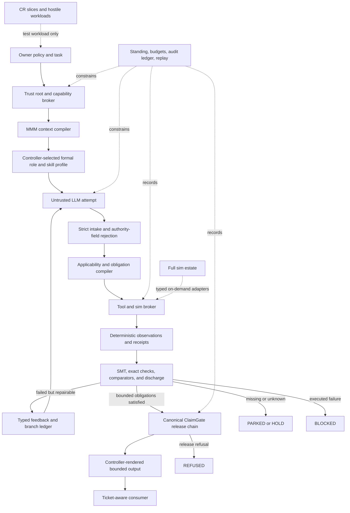
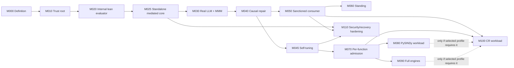

# ConstraintBox Top-View Master Plan

| Field | Value |
|---|---|
| Document ID | `CB-DOC-0001` |
| Status | `OWNER_REVIEW_CANDIDATE` |
| Purpose | One top-level definition and execution plan for ConstraintBox |
| Current-state cutoff | Local audit of `/Users/joshuaeisenhart/Codex-Ratchet`, branch `claimgate/bypass-regression`, on 2026-07-27 |
| Product claim | Architecture and program plan only |
| Explicit non-claim | This document does not claim that ConstraintBox is assembled, deployed, canonical, or presently unavoidable |
| Governance rule | If owner-approved, this becomes the sole normative ConstraintBox architecture document; other prose is source, evidence, a derived view, or superseded material |

## Executive definition

**ConstraintBox is a standalone constraint-engineering harness that puts an LLM inside a controller-owned box.** The controller constrains what enters the model, what operations it may request, what form its work must take, how its work is checked, how failures are returned for repair, and what—if anything—may leave the box.

The model may remain imaginative, speculative, and high-variance inside the loop. What exits must be task-dependent, correctly structured, procedurally compliant, evidence-bound, reproducible, and limited to a declared claim ceiling.

ConstraintBox is not a truth machine. It establishes that one exact candidate satisfied one versioned, finite contract under named tools and bounds. It does not establish scientific truth, completeness of the contract, correctness of every tool, or validity outside the encoded domain.

> **Cardinal rule:** LLMs may be wild inside; only controller-admitted, task-dependent, auditable work exits.

> **Anti-theater rule:** A component is not integrated unless severing or poisoning it changes the final disposition of the same public end-to-end run.

## Top-level correction

The current local code does **not** yet satisfy this definition.

An untracked `constraintbox run` path now exists, but it is an optional plumbing canary:

- its accepted proposal does not contain a substantive task answer;
- a constant minimal JSON proposal can satisfy incompatible tasks;
- its NumPy operation runs beside the task instead of being semantically required by the task;
- its Z3 gate checks a narrow Boolean/claim envelope rather than task semantics;
- its release text is fixed rather than derived from the admitted task result;
- it invokes a shallow box-local ClaimGate verifier rather than the full intake/recompute/policy/seal/ledger chain;
- formal agents, formal skills, standing, hooks, CI, full sim engines, and CR workloads are not in the caller path;
- the entire `constraint_box/` tree is untracked and the supported path is avoidable.

The right next move is therefore not more disconnected gate documents or a tool inventory. It is one task-dependent vertical evaluator transaction in which a lean sim/SMT slice is load-bearing from task input through final settlement. That scripted transaction remains `INTERNAL_ONLY` until a standalone broker and sole output sink mediate release; a real LLM must not be launched before that boundary exists.

## Master index

| Prefix | Index | Purpose |
|---|---|---|
| `CB-DEF-*` | Definitions | What ConstraintBox means |
| `CB-DRV-*` | Architectural drivers | What the design must optimize |
| `CB-BND-*` | System boundaries | What is inside, adjacent, or external |
| `CB-AUTH-*` | Authority | Who may control which decisions |
| `CB-OBJ-*` | Typed objects | Finite identities and allowed transformations |
| `CB-CMP-*` | Components | Runtime architecture |
| `CB-GATE-*` | Gates | Deterministic constraints and their ceilings |
| `CB-LOOP-*` | Loops | Retry, tool, standing, and self-improvement cycles |
| `CB-HOOK-*` | Hooks | Where the controller must fire |
| `CB-PROFILE-*` | Tool profiles | Lean and full-estate capability sets |
| `CB-ROLE-*` | Formal roles | Agents, skills, and non-model authorities |
| `CB-STATE-*` | State namespaces | Non-interchangeable dispositions |
| `CB-INT-*` | Integration levels | What “installed,” “run,” and “load-bearing” mean |
| `CB-REQ-*` | Requirements | Cross-cutting product requirements |
| `CB-FF-*` | Fitness functions | Kill tests for architecture claims |
| `CB-M-*` | Milestones | Ordered implementation program |
| `CB-DEC-*` | Decisions | Owner locks and open choices |
| `CB-SRC-*` | Sources | Intent, code, receipts, and context |

## 1. What ConstraintBox is and is not

| ID | ConstraintBox is | It is not |
|---|---|---|
| `CB-DEF-001` | A controller-owned harness around untrusted LLM work | An LLM reviewing or grading itself |
| `CB-DEF-002` | Constraint engineering applied to prompts, context, actions, artifacts, evidence, retries, and release | Only an output-format checker |
| `CB-DEF-003` | A finite, typed, SMT-aligned procedure for settling bounded obligations | An unrestricted theorem prover |
| `CB-DEF-004` | A standalone mini-OS for governed LLM work, extracting useful mechanisms from ClaimGate, LevOS, Wizard, Ratchet, MMM, and the sim estate | Full LevOS, or a LevOS patch whose authority remains inside LevOS |
| `CB-DEF-005` | A system that allows broad internal exploration while narrowing what may leave | A system that prevents all hallucination or forces one narrow style of thought |
| `CB-DEF-006` | A release and capability boundary over actions actually mediated by its host | A perfect security boundary over arbitrary external processes |
| `CB-DEF-007` | A user of task-scoped sim and formal instruments | The global validator or owner of the sim estate |
| `CB-DEF-008` | A harness that uses sim-engine and CR workloads to expose and repair its own missing constraints | A mechanism for proving CR, its manifolds, basins, engines, or scientific theory |
| `CB-DEF-009` | A producer of auditable, controller-rendered bounded results | A producer of model prose labeled “verified” |
| `CB-DEF-010` | A liveness-aware constraint system | An always-block gate that calls refusal safety |

### Architectural drivers

| ID | Driver | Design consequence | Failure if omitted |
|---|---|---|---|
| `CB-DRV-001` | Authority integrity | Models propose; owner policy and deterministic code decide | LLMs put ConstraintBox in a box |
| `CB-DRV-002` | Auditability | Every consequential step has exact inputs, versions, outputs, and lineage | Plausible prose replaces work |
| `CB-DRV-003` | Task dependence | Successful output must change when the task changes | Constant pass-shaped proposals work |
| `CB-DRV-004` | Causal integration | Required tools must affect the same final settlement | Green sidecar receipts create theater |
| `CB-DRV-005` | Bounded failure | Timeouts, unavailable tools, `UNKNOWN`, and failed checks remain distinct | Missing capacity becomes falsehood or success |
| `CB-DRV-006` | Liveness | Known-good, nontrivial work must pass within finite budgets | Safety degenerates into permanent refusal |
| `CB-DRV-007` | Exploration preservation | Live alternatives and falsifiers survive until a discriminator earns pruning | Gates collapse research to trivial answers |
| `CB-DRV-008` | Standalone operation | Core boot does not require CR, LevOS, or every heavy engine | The product becomes another subsystem patch |
| `CB-DRV-009` | Host mediation | Consequential capabilities require controller-issued authority | A wrapper is confused with containment |
| `CB-DRV-010` | Honest claim ceilings | Release says exactly what the bounded contract supports | SAT, simulation, or a receipt becomes “truth” |

## 2. Top-view architecture

### End-to-end flow

| Step | ID | Controller action | Model authority | Required output |
|---:|---|---|---|---|
| 1 | `CB-FLOW-001` | Accept a strict task envelope and select policy | None | Task digest and policy version |
| 2 | `CB-FLOW-002` | Compile a source-ranked MMM projection with exclusions | None | Ordered context bytes and digest |
| 3 | `CB-FLOW-003` | Select a formal role, skill, schema, tools, budget, and claim ceiling | May not change selection | Dispatch ticket |
| 4 | `CB-FLOW-004` | Launch the provider in a mediated capability profile | Generate candidate only | Raw quarantined attempt |
| 5 | `CB-FLOW-005` | Strictly parse and reject authority-bearing fields | None | Typed candidate or intake failure |
| 6 | `CB-FLOW-006` | Compile applicable finite obligations from owner policy and task type | May propose additional checks only | Obligation set and digest |
| 7 | `CB-FLOW-007` | Dispatch exact tool functions in isolated workers | May request within allowlist | Bound observations and receipts |
| 8 | `CB-FLOW-008` | Run exact checks, SMT encodings, independent comparators, and mutation controls | None | Clause-level settlement |
| 9 | `CB-FLOW-009` | Return bounded counterexamples on a monotone retry budget | Repair candidate only | Child attempt linked to parent |
| 10 | `CB-FLOW-010` | Invoke canonical ClaimGate on the settled evidence package | None | Release decision and ceiling |
| 11 | `CB-FLOW-011` | Render output only from typed controller-owned values | Raw prose cannot escape | Bounded release or no release |
| 12 | `CB-FLOW-012` | Require the consumer to verify the ticket, lineage, and release class | None | Named next action or refusal |

## 3. System boundary index

| ID | Boundary | Owns | Must never own | Relationship to core |
|---|---|---|---|---|
| `CB-BND-001` | ConstraintBox core | Task envelope, policy, obligations, budgets, retries, dispositions, release ceiling | Scientific truth | Product |
| `CB-BND-002` | MMM/context compiler | Source projection, precedence, exclusions, context digest | Verdict or truth | Inbound constraint boundary |
| `CB-BND-003` | LLM/provider | Candidates, attacks, falsifiers, repairs, explanations | Policy, tolerances, obligations, status, release | Untrusted producer |
| `CB-BND-004` | Deterministic checker layer | Bounded observations and predicate results | Universal truth or policy completeness | Core worker boundary |
| `CB-BND-005` | ClaimGate lineage | Deterministic release checks, evidence binding, refusal semantics | Independent product authority or truth | Mechanism donor embedded in core |
| `CB-BND-006` | Lean sim slice | Exact task-scoped numeric, symbolic, SMT, and finite operations | Full-estate readiness | Core capability profile |
| `CB-BND-007` | Full sim estate | Function-level capability supply and demanding integration workloads | CB policy or release | External on-demand workers |
| `CB-BND-008` | Codex Ratchet | Real problems, fixtures, rivals, and hostile claims | CB policy, answer key, or core ontology | Workload and downstream consumer |
| `CB-BND-009` | LevOS | Useful event, evaluator, ledger, plugin, and orchestration mechanisms | CB trust root or mandatory runtime | Mechanism donor and optional adapter |
| `CB-BND-010` | Wizard and councils | Plural proposals, dissent, bounded packets, routing, collapse resistance | Admission, tolerances, or release | Proposal-routing donor |
| `CB-BND-011` | Owner and host | Policy changes, trust roots, capability mediation, promotion | Invisible bypass presented as normal release | Ultimate authority |
| `CB-BND-012` | Consumers | Named next action permitted by release class | Interpretation of raw model prose as stronger evidence | Enforcement completion point |

### Inherited mechanisms

| ID | Donor | Retain | Do not inherit |
|---|---|---|---|
| `CB-MECH-001` | ClaimGate | Typed dispositions, evidence binding, hostile bypass corpus, one release chokepoint | Duplicate trees, truth language, relabeling loopholes |
| `CB-MECH-002` | LevOS | Event-triggered evaluation, durable ledger, content-addressed references, plugin boundary | Full FlowMind/poly graph or LevOS authority |
| `CB-MECH-003` | Wizard | Bounded packets, multiple independent views, dissent preservation, source slices | Wizard as the judge |
| `CB-MECH-004` | Ratchet | Branch lineage, discriminator-earned pruning/merging, re-offer conditions | Forced single winner or scalar “truth” |
| `CB-MECH-005` | MMM | Source precedence, salience shaping, vocabulary, exclusions, digest | Archive prose treated as fact |
| `CB-MECH-006` | Sim estate | Isolated workers, exact function receipts, immutable handoffs, replay, mutation and severance controls | Package readiness inferred from one function |
| `CB-MECH-007` | SMT/formal methods | Declared variables, finite domains, explicit bounds, SAT/UNSAT/UNKNOWN | “UNSAT means universally impossible” |
| `CB-MECH-008` | CR | Difficult fixtures, rival structures, hostile overclaims, actual research workloads | CR ontology, canon, or scientific verdicts |

## 4. Authority model

### Source authority

| Rank | ID | Source class | Allowed use | Forbidden use |
|---:|---|---|---|---|
| 0 | `CB-AUTH-000` | Current direct owner request | Product purpose, correction, scope | Silent averaging with older contrary prose |
| 1 | `CB-AUTH-010` | Repository `AGENTS.md` | Current repository operating rules | Replacing direct owner intent |
| 2 | `CB-AUTH-020` | Repository `CODEX.md` | Codex-specific process overlay | Product canon |
| 3 | `CB-AUTH-030` | Tracked process contracts | Rules inside their declared scope | Proof that enforcement is deployed |
| 4 | `CB-AUTH-040` | Current source, callers, fresh tests, fresh receipts | What presently exists or runs | Normative product definition |
| 5 | `CB-AUTH-050` | Provenance-tagged owner archive material without newer conflict | MMM source and mechanism context | Current implementation status |
| 6 | `CB-AUTH-060` | Untracked ConstraintBox docs and packs | Candidate mechanisms, hostile fixtures, conflicts | Canon or promotion |
| 7 | `CB-AUTH-070` | Claude, Codex, councils, model synthesis | Proposals and retrieval leads | Owner intent, policy, or verdict |
| 8 | `CB-AUTH-080` | Random, stale, or unregistered documents | Routing leads only | Any normative or current-state claim |

### Runtime authority

| Field | Owner | Model may do | Model may not do |
|---|---|---|---|
| Task type | Owner/controller | Interpret within schema | Relabel task to weaken checks |
| MMM sources and ordering | Context compiler | Use supplied context | Add unregistered authority sources |
| Policy and claim ceiling | Owner/controller | Propose a narrower claim | Increase or rewrite the ceiling |
| Active obligations | Obligation compiler | Propose extra falsifiers | Drop, satisfy, or mark obligations |
| Tool/profile selection | Applicability registry | Request allowed functions | Choose an easier profile or fake availability |
| Solver encoding | Protected evaluator | Supply candidate values | Change variables, bounds, or semantics |
| Tolerances | Protected evaluator | None | Author tolerances in output |
| Attempt budget | Controller | Spend remaining attempt | Reset or enlarge the budget |
| Disposition | Deterministic settlement | Explain its proposal | Emit effective `PASS`, `BLOCKED`, or `RELEASED` |
| Standing | Verified ledger | Receive consequences | Select identity or edit history |
| Release | ClaimGate plus consumer | None | Render or publish raw result |

### Protected trust-root requirements

A source digest inside the model-writable checkout is not a trust root: an agent could change the policy, evaluator, fixtures, expected outputs, and digest together.

| ID | Requirement | Minimum control |
|---|---|---|
| `CB-AUTH-100` | Active policy and evaluator isolation | The active evaluator package, policy manifest, required fixture digests, and promotion key live outside the model-writable task checkout |
| `CB-AUTH-110` | Separately authorized updates | A candidate change is shadow-tested and promoted through a controller/owner path the task agent cannot invoke |
| `CB-AUTH-120` | Pre-dispatch pinning | Task, policy, schema, evaluator, ClaimGate, tool profile, fixture set, and consumer are pinned before the provider starts |
| `CB-AUTH-130` | Immutable run identity | The run ticket binds every selected digest plus a fresh nonce and permitted next action |
| `CB-AUTH-140` | Canonical ClaimGate manifest | The production entrypoint, executable/source digest, evidence schema, registry, required tiers, policy, seal, ledger, exit mapping, and claim ceilings are explicitly named |
| `CB-AUTH-150` | Honest pre-enforcement label | Until a broker and consumer enforce the manifest, successful evaluator output is `INTERNAL_ONLY` or the path is `UNCONTAINED`, never `RELEASED` |

### ClaimGate lineage selection target

| Field | `CB-M-010` target |
|---|---|
| Leading candidate entrypoint | `/Users/joshuaeisenhart/Codex-Ratchet/claimgate_plugin/post_receipt_gate.sh` |
| Why only a candidate | It exposes the fuller intake/recompute/policy/seal/ledger route, but the current ConstraintBox does not call it and its hostile controls must be rerun before selection |
| Explicitly rejected production paths | Box-local direct `claim_verify.py`, injected fake callables, wrappers that translate missing/failed downstream work into exit zero, and any route that treats every exit 3 as admission |
| Required claim class | A typed bounded-tool-execution class whose tiers and ceiling cannot be weakened by relabeling it `field_only` |
| Frozen identity | Entrypoint plus every invoked source, registry, policy, schema, fixture/control, required tier, exit mapping, seal, and ledger dependency |
| Protection | Installed read-only evaluator/manifest plus separately held promotion authority outside the task agent’s writable checkout |
| Selection result | If this candidate cannot satisfy the manifest and hostile controls, `CB-M-010` stops; “full ClaimGate” is not awarded by name |

## 5. Nominalist and finite object model

ConstraintBox applies nominalist and SMT principles operationally: an object exists for the harness only through a declared finite identity, typed fields, allowed observations, admitted transformations, and versioned equivalence tests. Names and prose do not create authority.

| ID | Object | Finite identity | Required bindings | Invalid shortcut |
|---|---|---|---|---|
| `CB-OBJ-001` | `TaskObject` | Exact task bytes, schema, task kind, nonce | Policy, context profile, consumer | Reusing a receipt for a changed task |
| `CB-OBJ-002` | `ContextObject` | Ordered source slices and exclusions | Source class, digests, conflict edges | Calling all archive prose “owner context” |
| `CB-OBJ-003` | `PolicyObject` | Versioned owner-approved constraints | Trust-root signature/digest | Model-authored policy field |
| `CB-OBJ-004` | `CandidateObject` | Parsed model output and parent attempt | Task, provider, schema, prompt digest | Treating raw prose as release |
| `CB-OBJ-005` | `ObligationObject` | Typed predicate, applicability rule, bound | Policy, task, checker | Agent claims its own obligation passed |
| `CB-OBJ-006` | `ToolObject` | Exact function/API, source, interpreter, fixture | Inputs, outputs, controls, environment | Package import means integration |
| `CB-OBJ-007` | `EvidenceObject` | Immutable artifact digest and provenance DAG | Task, operation, checker, nonce | Receipt-shaped self-report |
| `CB-OBJ-008` | `BranchObject` | Attempt lineage and unresolved constraints | Parent, feedback, remaining budget | Compaction deletes a rival |
| `CB-OBJ-009` | `DispositionObject` | Controller-owned clause results | Evidence and exact policy | Model emits its own status |
| `CB-OBJ-010` | `ReleaseObject` | ClaimGate result, ceiling, ticket, consumer | All upstream digests | “Released” interpreted as scientific truth |
| `CB-OBJ-011` | `StandingObject` | Authenticated producer plus verified event chain | Executed outcomes only | New self-declared name resets history |
| `CB-OBJ-012` | `CapabilityObject` | Function-specific receipt under an exact runtime | Freshness and severance result | Entire engine marked ready |

## 6. Runtime component index

| ID | Component | Deterministic owner | LLM participation | Current state | Completion test |
|---|---|---|---|---|---|
| `CB-CMP-001` | Trust root and policy registry | Owner/host | Propose changes only | Not selected as one canonical root | Policy mutation by model leaves effective digest unchanged |
| `CB-CMP-002` | Capability/provider broker | Host controller | Uses issued capability | Missing | Direct provider output cannot reach sanctioned consumer |
| `CB-CMP-003` | Strict task intake | Controller | Supplies task only through schema | Narrow task parser exists | Duplicate keys, hidden fields, nonfinite values, and authority injection fail |
| `CB-CMP-004` | MMM context compiler | Controller | Consumes compiled context | Six packs are loaded in one optional path | Byte mutation changes lineage; controlled A/B changes the intended behavior without changing policy; unregistered source is excluded |
| `CB-CMP-005` | Formal role and skill router | Controller registry | Runs selected role | Disconnected | Same task deterministically selects pinned role/skill profile |
| `CB-CMP-006` | Provider sandbox | Host/broker | Generates attempts | Source path exists; no accepted real end-to-end run | Exact provider/model/command/capability receipt exists |
| `CB-CMP-007` | Candidate parser and authority firewall | Controller | Emits candidate fields | Narrow envelope parser exists | Model-controlled policy/status/tolerance fields are rejected |
| `CB-CMP-008` | Applicability and obligation compiler | Controller | Proposes optional falsifiers | Missing task-semantic obligations | Changed task changes required predicates |
| `CB-CMP-009` | Tool and sim broker | Controller | Requests allowed operation | One fixed NumPy run exists | Tool input derives from task and tool output changes settlement |
| `CB-CMP-010` | Isolated workers | Exact runtime/profile | No verdict authority | Estate workers exist as manual surfaces | Process, operation, output, resource, and control receipts bind |
| `CB-CMP-011` | SMT/exact comparator layer | Protected evaluator | Supplies candidate values only | Narrow Boolean Z3 gate exists | Exact task facts are solver-bound and erasure flips a negative |
| `CB-CMP-012` | Discharge and final safety | Controller | None | Partial | Independent recomputation catches a bypass of an earlier check |
| `CB-CMP-013` | Typed feedback and branch ledger | Controller | Repairs child candidate | Two-attempt envelope loop exists | Feedback severance prevents a claimed causal repair |
| `CB-CMP-014` | Standing and escalation | Verified ledger/controller | Subject only | Detached prototype | Two process-separated runs prove monotone enforced floor |
| `CB-CMP-015` | Canonical ClaimGate chain | Protected evaluator | None | Multiple/shallow paths conflict | Full intake/recompute/policy/seal/ledger route is pinned; the consumer later makes it sole |
| `CB-CMP-016` | Release renderer | Controller | No raw prose | Fixed text exists, but not task-dependent | Two incompatible tasks yield distinct bounded results; no provider field is interpolated |
| `CB-CMP-017` | Consumer verifier | Server/host consumer | None | Missing | Copied output, stale ticket, or `--no-verify` cannot land |
| `CB-CMP-018` | Audit, replay, and health | Controller/independent verifier | Read-only explanations | Local receipts, no whole-run replay | Deterministic stages replay without rerunning the LLM |
| `CB-CMP-019` | Output-channel quarantine | Host/controller | Raw output is stored as restricted evidence only | Missing as a complete boundary | Stdout, stderr, events, exceptions, paths, logs, UI status, and artifacts cannot leak unrendered model text |

## 7. Deterministic gate index

These gates constrain form, procedure, bounded evidence, and permitted action. None independently determines truth.

| ID | Gate | Enforces | Cannot claim | Required hostile control |
|---|---|---|---|---|
| `CB-GATE-001` | Task intake | Exact allowed keys, types, sizes, finite values | Task is meaningful or true | Duplicate key, ignored nested claim, overflow/nonfinite |
| `CB-GATE-002` | Context authority | Ordered, registered, digest-bound MMM bytes | Injected context is factually correct | Omit, reorder, mutate, or add unregistered source |
| `CB-GATE-003` | Provider identity | Exact executable, model, command, capability, nonce | Provider is honest | Replay output under changed task or model |
| `CB-GATE-004` | Candidate schema | Parseable typed structure | Candidate solves the task | Constant schema-perfect proposal across incompatible tasks |
| `CB-GATE-005` | Authority firewall | No model-owned policy, status, tolerance, obligation, ceiling, or budget | Model follows prompt instructions | Inject every authority-bearing field |
| `CB-GATE-006` | Task-output dependence | Candidate and release are functions of exact task | Scientific correctness | Swap tasks or task fields and require settlement change |
| `CB-GATE-007` | Procedure | Required steps and artifact lineage occurred | Procedure was sufficient | Skip a required step while preserving final-looking JSON |
| `CB-GATE-008` | Capability eligibility | Named function has fresh, scoped receipt | Whole library or engine works | Stale green, fresh red, wrong interpreter |
| `CB-GATE-009` | Operation use | Real named API was exercised | Operation result is scientifically valid | After source/pin validation succeeds, poison/sever the API or substitute constant output |
| `CB-GATE-010` | Evidence binding | Task → tool input → operation → output → claim DAG | Evidence source is globally authoritative | Reuse receipt, mutate artifact, swap nonce |
| `CB-GATE-011` | SMT/exact encoding | Formula result inside declared variables/domain/bounds | Unrestricted theorem or physical truth | Expand domain; force `UNKNOWN`; erase a load-bearing constraint |
| `CB-GATE-012` | Independent comparator | Two implementations/representations agree under contract | Common-mode error is impossible | Seed plausible shared error and use withheld case |
| `CB-GATE-013` | Mutation/severance | Claimed mechanism affects final settlement | Mechanism is the only valid method | Remove dependency, mutate kernel, swap operation |
| `CB-GATE-014` | Feedback causality | Repair descends from exact failed clauses/counterexample | Model understood the failure | Corrupt/sever feedback; identical retry gets no credit |
| `CB-GATE-015` | Budget/liveness | Finite attempts/resources and known-good passage | Every good task will pass | Always-block and inconsistent-policy canaries |
| `CB-GATE-016` | Standing | Verified history raises enforced requirements | Producer is morally trustworthy | Identity rotation, ledger truncation, relabeling |
| `CB-GATE-017` | Claim ceiling | Output does not exceed bounded evidence | Underlying reality matches the claim | Ask for stronger consumer/action with same evidence |
| `CB-GATE-018` | ClaimGate release | Canonical chain agrees on structured verdict, exit, policy, evidence | Truth or global readiness | Contradict exit/verdict; mutate after check |
| `CB-GATE-019` | Consumer ticket | Only sanctioned lineage permits consequential action | All host activity is contained | Direct provider, copied output, cross-task ticket, `--no-verify` |
| `CB-GATE-020` | Replay | Deterministic settlement reproduces from frozen artifacts | LLM generation itself is deterministic | Edit/truncate/rechain run artifacts |
| `CB-GATE-021` | Output-channel confinement | Every user-visible channel is controller-rendered or access-restricted | Provider never produced harmful prose | Seed secrets/overclaims into stdout, stderr, events, exceptions, filenames, logs, artifacts, and UI status |

## 8. State namespaces

These states must not be converted automatically between subsystems.

| ID | Namespace | Examples | Meaning |
|---|---|---|---|
| `CB-STATE-001` | `wizard.route.*` | `accepted`, `dissent`, `collapse_risk` | Reasoning route only |
| `CB-STATE-002` | `cb.disposition.*` | `blocked`, `parked`, `hold`, `refused`, `internal_only`, `released`, `evaluation_error`, `uncontained` | Outcome of one bounded CB transaction |
| `CB-STATE-003` | `claimgate.release.*` | `admitted_within_ceiling`, `rejected`, `insufficient_depth` | Release-chain outcome only |
| `CB-STATE-004` | `estate.capability.*` | `ready`, `degraded`, `failed`, `unavailable`, `stale` | Exact function/runtime capability |
| `CB-STATE-005` | `cr.status.*` | CR-owned vocabulary | CR scientific/process status only |
| `CB-STATE-006` | `repo.evidence.*` | `exists`, `runs`, `passes_local_rerun`, `canonical_by_process` | Public evidence label |

### Required CB disposition semantics

| Disposition | Use only when | Never use when |
|---|---|---|
| `BLOCKED` | A declared applicable obligation executed and failed | A tool was missing or applicability was unknown |
| `PARKED` | Required instrumentation, representation, or bounded decision capacity was unavailable | An executed check falsified the candidate |
| `HOLD` | Alternatives are incomparable, demand is empty, or owner choice is needed | A deterministic release failure occurred |
| `REFUSED` | No candidate survives the release gates within budget | The task is merely waiting on a tool |
| `EVALUATION_ERROR` | Gate infrastructure, exit/verdict agreement, or replay integrity failed | The candidate simply failed an obligation |
| `UNCONTAINED` | A consequential path is outside host mediation | The system has actually enforced the action |
| `INTERNAL_ONLY` | A scripted/development evaluator result reached settlement but no mediated output consumer exists | User-visible release or containment is claimed |
| `RELEASED` | One named next action is permitted within an explicit claim ceiling | Scientific truth, canon, or project completion is implied |

## 9. Loops and hooks

### Loop index

| ID | Loop | Trigger | Model role | Deterministic settlement | Current state |
|---|---|---|---|---|---|
| `CB-LOOP-001` | Input/MMM loop | New task or source-version change | Consume context | Compile, rank, exclude, digest | Partial and optional |
| `CB-LOOP-002` | Attempt/repair loop | Failed repairable obligation | Propose repair | Typed clause result, counterexample, budget | Tiny two-attempt envelope loop |
| `CB-LOOP-003` | Tool/sim loop | Applicable task profile | Request/interpret candidate operation | Worker, comparator, mutation, replay | Manual estate CLIs, not task loop |
| `CB-LOOP-004` | Branch/Ratchet loop | Multiple live candidates or failures | Generate rivals/discriminators | Preserve, prune only with earned discriminator | Candidate only |
| `CB-LOOP-005` | Standing loop | Verified executed outcome | Subject to next floor | Append event, compute monotone floor | Detached prototype |
| `CB-LOOP-006` | Self-tuning loop | Repeated failure class across workload corpus | Propose policy/profile/checker patch | Shadow compare old/new on frozen and hidden corpus | Missing |
| `CB-LOOP-007` | Capability maintenance loop | Runtime/source/freshness change | None | Re-run exact function and hostile controls | Existing estate surfaces, not CB-governed |
| `CB-LOOP-008` | Replay/audit loop | Release, refusal, crash, or dispute | Explain only | Reproduce deterministic settlement | Missing whole-run command |

### Hook index

Hooks trigger the controller; hooks are not themselves authority.

| ID | Hook | Required action | Current reality | Target enforcement |
|---|---|---|---|---|
| `CB-HOOK-001` | Session/task start | Strict task intake and MMM compile | Claude has generic `SessionStart` only | Sole provider gateway |
| `CB-HOOK-002` | Context compaction | Rehydrate immutable task/context/branch references | Generic `PostCompact` exists | Digest-checked state restoration |
| `CB-HOOK-003` | Provider start | Mint one-use ticket and capability profile | Missing | Host/provider broker |
| `CB-HOOK-004` | Pre-attempt | Bind schema, policy, context, budget | Inside optional function only | Controller |
| `CB-HOOK-005` | Post-attempt | Quarantine output, strict parse, evaluate | Inside optional function only | Controller |
| `CB-HOOK-006` | Tool dispatch | Resolve exact function and isolated runtime | Manual estate callers | Tool broker |
| `CB-HOOK-007` | Feedback | Emit only typed failed clauses and bounded counterexample | Narrow JSON feedback exists | Controller branch ledger |
| `CB-HOOK-008` | Pre-release | Full canonical ClaimGate chain | Shallow box-local verifier | Protected release service |
| `CB-HOOK-009` | Post-release/crash | Append immutable terminal event | Plain files; no guaranteed crash event | Authoritative ledger |
| `CB-HOOK-010` | Local commit | Defense-in-depth check | Bypassable, path-limited, fail-open pre-commit | Local warning only |
| `CB-HOOK-011` | Server CI/merge | Verify ticket, replay, hostile controls | Workflow local/untracked; branch unprotected | Required server-side check |
| `CB-HOOK-012` | Downstream consume | Reject output without valid release lineage | Missing | Artifact/merge/deploy consumer |

## 10. Integration level index

No tool, gate, skill, or agent is called “integrated” below `CB-INT-005`.

| Level | ID | Evidence | Allowed statement |
|---:|---|---|---|
| 0 | `CB-INT-000` | Path or document exists | “Exists” |
| 1 | `CB-INT-001` | Package imports or executable starts | “Imports/runs” |
| 2 | `CB-INT-002` | Exact function performs known-answer operation | “Function operation passes local rerun” |
| 3 | `CB-INT-003` | Supported controller caller reaches it | “Caller-reachable” |
| 4 | `CB-INT-004` | Its typed output is bound to task obligations | “Task-semantic” |
| 5 | `CB-INT-005` | Poisoning/severing it flips the same final settlement | “Load-bearing integration” |
| 6 | `CB-INT-006` | Sanctioned consumer rejects bypass/replay without it | “Enforced on named path” |

## 11. Sim-engine and tool architecture

### Tool-layer model

| Layer | ID | Contents | Core boot? | Authority |
|---|---|---|---|---|
| Controller substrate | `CB-PROFILE-000` | Python stdlib, strict JSON, hashing, schemas, subprocess/resource controls, ledger primitives | Yes | Procedure only |
| First lean finite/SMT task profile | `CB-PROFILE-010` | NumPy, SciPy, Z3, finite enumeration; CVC5/SymPy when selected as independent checks | No; selected by applicable tasks | Bounded observation/checking |
| Provenance/DAG adapter | `CB-PROFILE-020` | Typed immutable artifacts; Rustworkx is a candidate DAG implementation | Optional | Evidence relationships only |
| System-identification profile | `CB-PROFILE-030` | PySINDy, PyDMD, bounded PyKoopman/PyMDP uses | On demand | Candidate generation and bounded comparison |
| JAX profile | `CB-PROFILE-040` | JAX, Diffrax, Quimb/Cotengra, Dynamiqs, NetKet | On demand | Batched numeric/dynamics/tensor work |
| PyTorch profile | `CB-PROFILE-050` | Torch, PyG, e3nn, torchdiffeq/torchode | On demand | Graph/autograd/equivariant work |
| Julia profile | `CB-PROFILE-060` | Strict Julia carrier, algebra/QIT/dynamics/reference functions | On demand | Independent finite/reference observations |
| Graph/topology profile | `CB-PROFILE-070` | NetworkX, igraph, Rustworkx, XGI, TopoNetX, GUDHI, KaHyPar | On demand | Exact named graph/topology observations |
| Cross-engine profile | `CB-PROFILE-080` | Isolated Torch → artifact → JAX → artifact → Julia/comparator chain | On demand | Integration workload only |
| CR workload profile | `CB-PROFILE-090` | Bounded CR commands, fixtures, rivals, hostile pass-shaped claims | Never core boot | Workload, never authority |

The unconditional core must boot without NumPy, SMT, or any heavy engine. A task that requires an unavailable selected profile becomes `PARKED`; the controller does not fail to start and does not silently fall back.

### Fresh runtime inventory and current CB relationship

Fresh import means only that the named library loaded under the canonical local runtime. It does not establish a passing operation or integration.

| Tool/engine | Fresh verified local state | Existing receipt evidence | Present CB consumer | Planned role | Current ceiling |
|---|---|---|---|---|---|
| Python | `3.13.6`; canonical alias `/Users/joshuaeisenhart/.local/share/sim-stack/bin/python3` | Runtime doctor returned `ok=true` with sandbox warning on process scan | Manual `PYTHONPATH` CLI only | Lean and full worker runtime | `passes local rerun` for doctor |
| NumPy | `2.3.4` imports | S1 operation/severance material; one fixed density profile | Fixed pre-LLM side operation | First load-bearing numeric instrument | Not task-semantic today |
| SciPy | `1.17.1` imports | S1 exact-operation material | Manual estate only | Lean numeric/signal substrate | Not in LLM loop |
| Z3 | `4.16.0.0` imports | S1 SAT/UNSAT paths; narrow current Boolean gate | Narrow structural gate | Exact finite obligations | Not bound to substantive task today |
| CVC5 | `1.3.3` imports | S1 SAT/UNSAT paths | Manual estate only | Independent solver comparator | Not in LLM loop |
| SymPy | `1.14.0` imports | Stress/lego receipts exist | None | Exact symbolic cross-check | No CB consumer |
| JAX/JAXlib | `0.10.1` imports | S2 plus v8 receipt reporting 22 checks; receipt currently dirty | Manual S2 estate | Batched/differentiable workload | Not freshly operation-rerun here |
| Diffrax | `0.7.2` imports | S2 records `READY` for named function | Manual S2 estate | JAX dynamics adapter | Function-specific only |
| Quimb/Cotengra | `1.14.0` / `0.8.0` import | S2 records Quimb ready and Cotengra version drift | Manual S2 estate | Tensor-network workload | Version conflict unresolved |
| PyTorch | `2.11.0` imports | S3 density plus v8 receipt reporting 13 checks; receipt dirty | Manual S3 estate | Graph/autograd workload | No CB consumer |
| PyG/e3nn | `2.7.0` / `0.6.0` import | Existing lego/stress material | None | Typed graph/equivariant functions | Import evidence only here |
| Julia | `1.12.6`; strict carrier core imports run | Root stress plus v8 receipt reporting 7 checks | No CB adapter | Reference algebra/QIT/dynamics | Full-estate only |
| PySINDy | `2.1.0` imports | Capability results and live CR stage use exist | S3 readiness record only | Governed system-ID candidate generator | No exact-operation poison in CB |
| PyDMD | `2025.8.1` imports | Capability/readiness material | S3 readiness record only | Alternative dynamics decomposition | Not load-bearing |
| PyMDP | `1.0.3` imports | Readiness material | S3 readiness record only | Specialized workload | Not load-bearing |
| PyKoopman | `1.2.1` imports | Bounded capability result | None | `Identity + EDMD` only until expanded | Quarantined outside bounded surface |
| Graph/topology set | NetworkX `3.6.1`, igraph `1.0.0`, Rustworkx `0.17.1`, XGI `0.10.1`, TopoNetX `0.4.0`, GUDHI `3.12.0`, KaHyPar `1.3.7` import | Stress and finite-topology receipts exist | None | On-demand exact graph/topology functions | Import/receipt leads only |
| Cross-engine chain | Existing Torch → JSON → JAX → JSON → Julia shape | v8 integration receipt reports 10 checks; file currently dirty | None | Best first full-estate integration workload | Must be rerun under CB |
| Formal-scout estate | Latest index reports 558 results, 237 validator passes, 103 failures | Every row blocked by `fresh_rerun_not_performed` | None | Input corpus for future workload selection | Never proof of CR or readiness |

### Current runtime conflicts that block a canonical lean lock

| ID | Conflict | Current observation | Required resolution |
|---|---|---|---|
| `CB-CON-001` | Proposed CB estate is Linux/Python 3.12 oriented | Live canonical host is Darwin/Python 3.13.6 | Generate a Darwin/hermetic CB lock from the chosen lean profile |
| `CB-CON-002` | Proposed versions drift | Proposed NumPy `2.5.1`, SciPy `1.18.0`, Z3 `5.0.0.0`, CVC5 `1.3.4`; live versions differ | Lock platform truth instead of treating drift as tool failure |
| `CB-CON-003` | JAX/Cotengra proposed pins drift | Proposed JAX `0.11.0`, Cotengra `0.8.2`; live `0.10.1`, `0.8.0` | Resolve before profile admission |
| `CB-CON-004` | Julia docs and carrier disagree | Catlab is described as quarantined but directly declared/imported; Metatheory committed/live state conflicts | Owner/process decision before canonical role |
| `CB-CON-005` | Estate counts conflict | Older May index and July readiness index disagree materially | Fresh, scoped rerun; never choose canon by larger count |
| `CB-CON-006` | Operation poisoner is not pinned in current Darwin receipt set | A critical load-bearing control can drift | Include its source digest and independent hostile mutation |

### PySINDy decision

**PySINDy is appropriate for ConstraintBox, but not as a core truth gate.**

| Aspect | Controller-owned requirement |
|---|---|
| Role | Generate sparse candidate dynamics or feature sets for a bounded system-identification workload |
| Inputs | Variables, units, sampling interval, derivative estimator, train/held-out split, and allowed feature library are fixed by the profile |
| Model authority | The LLM may propose a profile from an allowlist or interpret candidates; it cannot select an unconstrained hypothesis space after seeing results |
| Required checks | Known-answer fixture, wrong-library control, held-out residual, replay, dependency severance, implementation mutation, and alternate candidate comparison |
| Release ceiling | “This named candidate met these finite held-out criteria under this profile” |
| Forbidden claim | “PySINDy discovered the true law,” “axiom extracted,” or “CR proved” |
| Milestone | After the lean NumPy/SMT vertical slice and per-function capability gate |

### Full-engine integration rule

Each heavy runtime runs in its own process. Handoffs are immutable, typed, digest-bound serialized artifacts. Live in-process cross-runtime sharing is not a core requirement. A cross-engine result counts only when:

1. the task selects the profile;
2. every required function has a fresh scoped receipt;
3. artifact schemas and digests bind producer to consumer;
4. independent comparators evaluate the coupled result;
5. reordering, deleting, replaying, or mutating a required leg changes final settlement;
6. the final release remains function- and task-specific.

## 12. Formal agents and formal skills

Formal agents remain LLMs. They can improve search, critique, translation, and repair, but they never become the deterministic authority.

### Formal role index

| ID | Role | Allowed output | Forbidden authority | Deterministic gate |
|---|---|---|---|---|
| `CB-ROLE-001` | State archaeologist | Source map, contradictions, candidate precedence edges | Declare a document canonical | Source registry and digest checks |
| `CB-ROLE-002` | MMM curator | Candidate context slices and exclusion proposals | Inject unregistered context | Context compiler |
| `CB-ROLE-003` | Task/profile planner | Candidate task decomposition and tool requests | Choose effective applicability or weaker profile | Applicability registry |
| `CB-ROLE-004` | General proposer | Candidate artifact, answer, falsifier | Status, policy, release | Schema and task-semantic gates |
| `CB-ROLE-005` | Julia builder | Julia candidate code/config | Declare Julia/CR correct | Julia worker and independent comparator |
| `CB-ROLE-006` | JAX builder | JAX candidate code/config | Declare parity or admission | JAX worker and comparator |
| `CB-ROLE-007` | PyTorch builder | Torch candidate code/config | Declare graph/scientific validity | Torch worker and comparator |
| `CB-ROLE-008` | SMT engineer | Candidate finite encoding and adversarial cases | Select protected final encoding alone | Encoding review, dual solver, mutation |
| `CB-ROLE-009` | System-ID agent | Candidate variables/features/models | Claim true dynamics | Frozen profile and held-out evaluator |
| `CB-ROLE-010` | Fabrication auditor | Claims-to-predicate trace, missing bindings | Final disposition | Mechanical gatekeeper |
| `CB-ROLE-011` | Failure council | Bypass hypotheses and kill tests | Release or policy mutation | Controller selects registered tests |
| `CB-ROLE-012` | Repair agent | Patch/candidate responding to exact failure packet | Drop obligations or reset budget | Monotone branch controller |
| `CB-ROLE-013` | Mechanical gatekeeper | None; this is deterministic code, not an LLM | N/A | Protected implementation |
| `CB-ROLE-014` | Release renderer | None; deterministic typed rendering | Raw model prose | ClaimGate and consumer |

### Skill index

| Skill | CB use | Present status | Constraint |
|---|---|---|---|
| `codex-ratchet-sim-audit-spine` | Evidence-first sim workflow and receipts | Available, used for this audit | Procedure support, not admission |
| `codex-ratchet-tool-status-auditor` | Separate imports, operations, callers, and load-bearing status | Available, used for this audit | Cannot promote a tool |
| `julia-sim` | Julia-specific build/audit profile | Available | On-demand worker role |
| `jax-sim` | JAX-specific build/audit profile | Available | On-demand worker role |
| `pytorch-sim` | PyTorch-specific build/audit profile | Available | On-demand worker role |
| `three-engine-sim` | Cross-engine serialized workflow | Available | Must be controller-called and poison-tested |
| `sim-stack-maintenance` | Runtime stewardship and drift repair | Available | Maintenance plane, not release plane |
| `lego-sim-classifier` | Function-level evidence classification | Available | Cannot infer engine canon |
| `premortem` | Threat enumeration and bypass tests | Available | Proposal source only |
| `three-council-wizard-v4-3` | Object preservation, plurality, dissent, route audit | Available; object-preservation guard used here | Wizard does not validate sims, proof, or admission |
| Formal `.claude/agents` and `.claude/skills` | Role definitions and mechanism donors | Present but disconnected from CB | Must be selected by controller registry and digest-pinned |

## 13. Current-state matrix

| Surface | Verified current observation | Honest status | Missing before product claim |
|---|---|---|---|
| Product tree | `constraint_box/` contains zero tracked files | Scratch/untracked candidate | Select, review, commit, and package one core |
| Public entrypoint | `constraintbox run` exists in source and can be called manually through `PYTHONPATH` | Optional source path | Installed public CLI and sanctioned gateway |
| Task dependence | Proposal schema lacks substantive task answer; release is fixed | Fails core requirement | Task-specific candidate, evaluator, and renderer |
| Provider | A fixed `codex exec` command path exists | Source-reachable; no accepted real end-to-end release | Fresh real provider receipt and bounded release |
| MMM | Six ordered digest-pinned packs are injected in the optional path | Bytes included, effect unproven | Sole gateway, authority tags, mutation/saliency controls |
| Strict intake | Narrow exact task/proposal schemas and authority rejection exist | Useful partial control | Substantive artifact schema and hostile parser corpus |
| Lean tool | Fixed NumPy density profile executes | One narrow operation, unrelated to task | Task-derived input and settlement dependence |
| SMT | Enumeration/Z3 agreement on Boolean/claim conditions | Real structural gate | Task-semantic variables and evidence binding |
| Feedback | Two attempts with reason-code JSON | Tiny envelope repair | Clause counterexample causality and progress check |
| ClaimGate | Box-local direct `claim_verify.py` with `field_only` labeling | Shallow and potentially laundering | One canonical full release chain |
| Standing | Prototype files and regressions exist, untracked | Detached/test-only | Authenticated identity, verified ledger, real caller |
| Formal agents/skills | Many roles and skills exist | Disconnected | Controller-owned routing registry |
| Hooks | Local pre-commit exists | Bypassable, path-limited, fail-open | Defense-in-depth only; do not call containment |
| CI | Useful local workflow text exists | Not pushed/required; remote main unprotected | Required server-side consumer check |
| Audit ledger | Many local files/digests are written | Useful receipts, no authoritative whole-run ledger | Crash-safe append, trust anchor, replay |
| Full sim estate | Rich live runtime and historical receipts exist | External capability supply | Typed CB adapters and fresh scoped reruns |
| Cross-engine work | A v8 Torch/JAX/Julia chain has historical receipt material | Existing workload lead; receipt dirty | CB-controlled rerun and ablation |
| PySINDy/system ID | Libraries and bounded CR use exist | Candidate workload | Exact CB profile and hostile controls |
| CR | Fixed fixtures and separate commands exist | Workload source only | Live CR → CB failure → repair loop |
| Packaging | No standalone trusted installation | Missing | Core package, locks, installer, upgrade/recovery |

## 14. Program plan

The plan deliberately builds vertical end-to-end slices. It does not qualify every tool first and then hope a harness appears.

### Milestone roadmap

| ID | Milestone | User-visible capability | Required caller path | Acceptance test | Claim ceiling |
|---|---|---|---|---|---|
| `CB-M-000` | Owner-lock the system definition | One authoritative map replaces random-doc drift | Owner review → `CB-DOC-0001` plus source/conflict registry | Owner approves the definition and every conflicting document is classified | Architecture only |
| `CB-M-010` | Freeze protected trust root and one ClaimGate lineage | One exact gate manifest is available to the development pipeline | Controller → pinned intake/recompute/policy/seal/ledger entrypoint | Entrypoint, source digest, schema, registry, required tiers, exit mapping, ledger, and promotion authority are frozen outside the model-writable checkout; stop if no candidate chain passes hostile controls | Selected release mechanics, not global enforcement |
| `CB-M-020` | First task-dependent lean evaluator transaction | A scripted provider produces task-specific finite-density witnesses and reaches a distinct internal settlement for generated valid/invalid tasks | Developer CLI → neutral fixed context → proposal → NumPy observation → exact rational/Z3 constraints → pinned ClaimGate → internal test sink | Held-out/metamorphic cases, candidate ablations, constant proposal, post-pin operation poison, two-sided measured-value mutation, erased binding, receipt replay, and always-block liveness kills | `INTERNAL_ONLY` for one bounded 2×2 rational profile |
| `CB-M-025` | Standalone mediated core cut | A clean-installed package runs without repo `PYTHONPATH`, CR, or LevOS and exposes one brokered local output sink | Installed CLI → one-use ticket → scripted provider → controller → packaged ClaimGate → ticket-aware local sink | One valid ticketed scripted run reaches the sink; direct/copied output and every raw side channel are rejected or quarantined | Named local package and sink only |
| `CB-M-030` | Real LLM and inbound MMM | A real Codex attempt supplies a nontrivial load-bearing witness under digest-bound MMM and reaches one useful bounded local release | Standalone gateway → provider → same deterministic transaction → local sink | One real Codex task releases; null/wrong/irrelevant candidate fails; missing/mutated MMM, ontology leakage, external answer import, and secret/overclaim side-channel probes fail | Real provider path for one task class and local sink |
| `CB-M-040` | Bounded causal repair | Failed clause and counterexample cause a valid child repair | Attempt 1 → settlement → feedback → attempt 2 → release/refusal | Severed/corrupt feedback defeats claimed repair; no third attempt | One fail-then-repair task class |
| `CB-M-045` | First deterministic self-tuning pass | Formal agents propose harness changes from `finite_density_v1` failures; only a better shadow-tested version is promotable | Frozen corpus → current/candidate controllers → hidden comparator → separately authorized promotion | Candidate improves an explicit objective without safety, liveness, exploration, or ceiling regression; rejected candidate cannot alter active policy | One controller change over one frozen/hidden corpus |
| `CB-M-050` | Sanctioned landing consumer | Direct/copy/replay paths cannot land governed work | Ticket gateway → run → release → server/landing consumer | One valid ticketed run lands; direct `codex exec`, copied output, stale ticket, cross-task replay, and `--no-verify` fail at consumer | Named provider and named landing path only |
| `CB-M-060` | Enforced standing and budgets | Verified failures raise the next run’s actual floor without killing known-good liveness | Authenticated `CB-M-050` identity → standing ledger → profile selector → next run | A known-good escalated producer still completes; identity rotation, ledger truncation, and relabeling cannot reset floor | Exact authenticated producer domain |
| `CB-M-070` | Generic per-function capability admission | A fresh known-good function becomes eligible and causally changes the next boxed run | Estate command → isolated worker → function receipt → registry → next run | Positive eligibility case plus fresh-red, fake-import, stale-result, operation-poison, and severance controls | Exact function/API/profile/runtime |
| `CB-M-080` | Governed PySINDy system-ID workload | A known-answer deterministic fixture releases a bounded held-out result | `CB-M-070` admits exact PySINDy API/profile → frozen system-ID task → PySINDy → held-out comparator → feedback/release | Positive known-answer result plus wrong-library, constant candidate, mutation, severance, replay, and held-out failure controls | Named candidate met finite held-out criteria |
| `CB-M-090` | Minimal full-engine integration profile | One named task selects only the required JAX/Torch/Julia or topology functions and releases a useful coupled result | Registry → selected isolated workers → artifact DAG → comparator → ClaimGate | One known-good named chain releases; delete/reorder/replay/mutate a required leg and settlement changes; unneeded profiles are absent | Named integration profile only |
| `CB-M-100` | CR as hostile self-tuning workload | The sanctioned gateway launches a real bounded CR command; one bounded observation releases while a paired overclaim is blocked or repaired | Gateway → CR command → hostile result adapter → generic task/evidence objects → selected profiles → feedback → release | Command, source, result, and adapter digests bind; positive bounded observation releases; forged CR status fields do not help; required evidence deletion blocks | CB handling of one CR-derived workload |
| `CB-M-110` | Standalone OS security/recovery hardening | The early standalone core is recoverable, versioned, tamper-evident, and deployable without CR/LevOS/full estate | Installer → gateway → workers → ledger → upgrade/recovery | Fresh-estate install, rollback, tamper, crash, side-channel, and replay suite | Named platform/release |

### Critical path

`CB-M-020` is the first real build, but it is explicitly an internal evaluator acceptance test. It combines the controller and lean sim slice so neither becomes a disconnected island. `CB-M-025` makes the core standalone and mediated before any real provider is launched. CR, PySINDy, and the full estate are not prerequisites for that standalone core.

The program should still complete at least one named full-engine integration workload at `CB-M-090` to tune ConstraintBox against the real sim estate. `CB-M-100` then selects only the profiles required by its chosen CR workload; CR does not automatically force PySINDy, topology, or every heavy engine into one run.

### Exact first execution slice: `finite_density_v1`

| Element | Required design |
|---|---|
| Entry gate | Complete `CB-M-010` first. Freeze the exact ClaimGate entrypoint, source/executable digest, evidence schema, registry, required tiers, policy, seal, ledger, exit mapping, and promotion authority outside the model-writable checkout. Stop if no candidate chain satisfies the full requirements. |
| Task | Classify one bounded 2×2 rational symmetric matrix under a declared finite density-matrix contract and provide a class-specific exact witness or failing clause |
| Task corpus | A protected seeded generator produces valid, invalid, exact-boundary, near-boundary, held-out, and metamorphic cases. The provider, checker, and renderer cannot use a two-fixture lookup table. |
| Context | A neutral fixed `ContextObject`, not the real MMM system. MMM authority, behavioral A/B testing, and saliency tuning begin at `CB-M-030`. |
| Provider at first | Deterministic scripted provider, so harness defects are isolated from model variance |
| Candidate | Task-specific classification plus exact class-specific witness: symmetry/trace/principal-minor fields for a valid case, or the exact failed clause and finite counterexample for an invalid case. A claim enum/hash is insufficient. |
| Candidate-dependence kills | Hold task and tool receipts fixed, then mutate or erase classification, failing clause, witness, falsifier, or the entire provider result. Wrong, irrelevant, and null candidates must fail settlement even though the controller can independently compute the answer. |
| Numeric representation | Input rationals have explicit numerator/denominator bounds and a canonical float64 conversion. The profile fixes finite-value rejection, signed-zero normalization, tolerance, rounding mode assumptions, and maximum admitted denominator. |
| NumPy observation | The real `numpy.linalg.eigvalsh` call produces `lambda_min_float64`; the controller converts it under a fixed error envelope into one finite token: `NEGATIVE_MARGIN`, `NONNEGATIVE_MARGIN`, `BOUNDARY_CONSISTENT`, or `AMBIGUOUS`. |
| Exact predicate | Protected exact rational checks determine symmetry, trace = 1, and the 2×2 positive-semidefinite conditions. They also label whether the exact minimum eigenvalue is negative, positive, or exactly zero. |
| SMT coupling | Z3 binds the candidate classification/witness, every exact clause, and the controller-derived numeric token. Exact-valid cases require a compatible nonnegative/boundary token; PSD-invalid cases require a compatible negative token; candidate fields must select the same finite clause. Mutating only the numeric token must change settlement. |
| Boundary rule | An exact-zero case may pass only with `BOUNDARY_CONSISTENT`. A nonzero case inside the undeclared numerical margin and any exact/numeric disagreement becomes `PARKED`; it is not rounded into pass/fail. Near-boundary fixtures test this rule. |
| ClaimGate | Invoke only the `CB-M-010` pinned chain; no injected fake gate, no `field_only` relabeling, and no model-writable replacement |
| Result sink | The controller renders a matrix-specific result into an internal test sink. At `CB-M-020` it is `INTERNAL_ONLY`, not `RELEASED`. |
| Positive liveness | Correct classification of both a valid matrix and an invalid matrix is a known-good harness outcome. Both must reach useful distinct internal results across held-out cases. An invalid matrix is not a failed run. |
| Status rule | `BLOCKED` means the candidate misclassified the matrix or failed an applicable executed obligation. Missing instrumentation/solver capacity and numerical ambiguity are `PARKED`. |
| Constant-proposal kill | One unchanged proposal cannot settle both incompatible tasks; generated and held-out cases prevent fixture-specific hardcoding |
| Operation kill | After source/pin validation has succeeded, poison or sever `eigvalsh`; final settlement must change or park for operation reasons, not merely because a digest changed |
| Measured-value two-sided control | Keep receipt lineage valid. A mutation crossing a declared numeric decision boundary must flip or park settlement; a perturbation remaining inside the same finite token must preserve the bounded classification. This separates semantic dependence from mere hash sensitivity. |
| Solver kill | Erase evidence-to-formula binding or substitute constant-SAT behavior; final settlement must refuse |
| Receipt kill | Reuse a receipt under the other task; digest/nonce binding must fail |
| Claim ceiling | “This exact 2×2 rational input met/failed this finite declared contract under these implementations and bounds” |
| Explicit non-claim | No physics truth, general density-matrix theorem, engine readiness, or CR proof |

This slice proves the controller/evaluator plumbing for one finite task class. It does not yet prove useful LLM behavior. `CB-M-030` must add a real unseen task whose model-generated witness is nontrivial and load-bearing.

### Why this is first

| Rejected sequence | Why it fails |
|---|---|
| Qualify every sim library before a real boxed loop | Recreates tool islands and green receipt theater |
| Make hooks mandatory before a useful transaction exists | Makes an empty or trivial box unavoidable |
| Use a real LLM before a deterministic scripted-provider path works | Model variance hides controller defects |
| Start with CR theorem claims | Confuses harness testing with proving CR |
| Add more documents before one public caller works | Repeats the observed failure mode |

## 15. ConstraintBox self-tuning

ConstraintBox may use its failures to improve itself, but an LLM never edits the live gate and then certifies the edit. The first mandatory self-tuning milestone is `CB-M-045`, using the frozen and hidden `finite_density_v1` corpus before PySINDy or full-engine expansion.

| Step | ID | Action | Authority boundary |
|---:|---|---|---|
| 1 | `CB-SELF-001` | Run a frozen workload corpus through the current controller | Current protected policy |
| 2 | `CB-SELF-002` | Cluster failures by exact gate, bypass, liveness loss, or missing instrument | Deterministic telemetry; LLM may propose labels |
| 3 | `CB-SELF-003` | Let formal agents propose policy/profile/checker/test changes | Proposal branch only |
| 4 | `CB-SELF-004` | Build candidate controller version in isolation | Cannot replace active trust root |
| 5 | `CB-SELF-005` | Shadow-run old and candidate versions on positive, negative, adversarial, and hidden fixtures | Deterministic comparator |
| 6 | `CB-SELF-006` | Reject regressions in safety, liveness, exploration, or claim ceilings | Controller-owned thresholds |
| 7 | `CB-SELF-007` | Require owner or separately authorized promotion | No autonomous self-promotion |
| 8 | `CB-SELF-008` | Record version, discriminators, accepted losses, rollback, and re-offer conditions | Append-only decision ledger |

### Self-tuning objective vector

No single “gate strictness” score is sufficient.

| Objective | Measurement | Failure mode prevented |
|---|---|---|
| Safety | Known hostile proposals do not release | Slop or authority injection escapes |
| Liveness | Known-good nontrivial tasks release within budget | Always-block theater |
| Usefulness | Released output answers the exact task | Schema-perfect emptiness |
| Causal integration | Required tool deletion changes settlement | Sidecar receipts |
| Exploration | Live rivals/falsifiers survive until discriminator | Overconstraint and triviality |
| Auditability | Whole settlement replays from frozen artifacts | Narrative-only verification |
| Stability | Unrelated policy/context changes do not perturb unrelated tasks | Global brittleness |
| Cost | Bounded attempts, time, memory, and tool calls | Infinite bounce loops |

## 16. Acceptance and anti-theater fitness functions

| ID | Kill test | Required behavior |
|---|---|---|
| `CB-FF-001` | Inject policy, tolerance, verdict, claim ceiling, obligations, or retry budget into model output | Reject fields or prove effective policy unchanged |
| `CB-FF-002` | Run one constant valid-looking proposal against incompatible tasks | Same successful release is impossible |
| `CB-FF-003` | Change one MMM byte or source order | Prompt/lineage changes; stale response cannot release |
| `CB-FF-004` | Remove MMM entirely | Sanctioned provider launch refuses |
| `CB-FF-005` | Put an overclaim or secret in model fields, stdout, stderr, events, exceptions, filenames, logs, run artifacts, and UI status | No unrendered value reaches any user-visible channel |
| `CB-FF-006` | Poison or sever a claimed load-bearing function | Same run’s final settlement changes |
| `CB-FF-007` | Make one function pass and another in the same package fail | No library/engine readiness is inferred |
| `CB-FF-008` | Before successful execution, make an instrument unavailable, force a bounded timeout, or return solver `UNKNOWN` | `PARKED`, never truth, pass, or infrastructure error |
| `CB-FF-009` | Expand the finite domain so prior UNSAT changes | Release remains bound-specific |
| `CB-FF-010` | Bypass first discharge and force a pass | Independent final safety catches it |
| `CB-FF-011` | Sever or corrupt feedback | Claimed repair cannot release |
| `CB-FF-012` | Repeat byte-identical failed attempt | Budget decreases; no loop reset |
| `CB-FF-013` | Use an evaluator that blocks every input | Known-positive liveness gate fails the harness |
| `CB-FF-014` | Rotate producer identity or truncate standing ledger | Enforced floor does not reset |
| `CB-FF-015` | Directly invoke provider, copy output, reuse ticket, or use `--no-verify` | Sanctioned consumer rejects it |
| `CB-FF-016` | Contradict ClaimGate exit and structured verdict | No release; evaluation error |
| `CB-FF-017` | Mutate evidence after checking | Consumer or post-check detects mismatch |
| `CB-FF-018` | Pass one CR-derived fixture | No CR status/canon changes |
| `CB-FF-019` | Forge CR `PASS`, `ADMITTED`, `VERIFIED`, or `claim_kind` fields | CB outcome does not improve |
| `CB-FF-020` | Add unregistered normative Markdown | Authority check fails; MMM cannot load it |
| `CB-FF-021` | Remove a runtime call while leaving docs and receipts green | End-to-end topology test fails |
| `CB-FF-022` | Crash between provider result and terminal disposition | Crash event is durably recorded and no orphan release exists |
| `CB-FF-023` | Replay deterministic stages from frozen artifacts | Same bounded settlement reproduces |
| `CB-FF-024` | Ask a stronger consumer/action to use a weaker release | Consumer refuses by release class |
| `CB-FF-025` | Hold task/tool evidence fixed and mutate or erase provider classification, clause, witness, or entire result | Settlement changes; provider is not decorative |
| `CB-FF-026` | Use only two hardcoded fixtures | Held-out generated and metamorphic cases defeat lookup-table implementations |
| `CB-FF-027` | Exercise exact-zero and near-boundary numeric cases | Exact-zero follows its declared boundary rule; ambiguous nonzero cases park |
| `CB-FF-028` | Run controlled MMM A/B pairs with task/policy fixed | Intended salience-sensitive behavior changes; effective authority, gate result rules, and unrelated controls do not |
| `CB-FF-029` | Let a declared-ready worker execute but emit missing/malformed required observations, contradictory receipt fields, or an unreplayable result | `EVALUATION_ERROR`; broken enforcement cannot relabel itself unavailable |

## 17. Requirement index

| ID | Requirement | Satisfied by | First milestone |
|---|---|---|---|
| `CB-REQ-001` | One controller-owned internal evaluator pipeline | `CB-CMP-003`, `007`–`013`, `015`–`016`, `018` | `CB-M-020` |
| `CB-REQ-002` | Input and MMM bytes are authority-ranked and digest-bound | `CB-GATE-002` | `CB-M-030` |
| `CB-REQ-003` | Model cannot author effective control fields | `CB-GATE-005` | `CB-M-020` |
| `CB-REQ-004` | Successful result depends on exact task | `CB-GATE-006` | `CB-M-020` |
| `CB-REQ-005` | Required tool output is task-semantic and load-bearing | `CB-GATE-009`–`013` | `CB-M-020` |
| `CB-REQ-006` | Feedback is typed, bounded, and causal | `CB-GATE-014` | `CB-M-040` |
| `CB-REQ-007` | Known-good liveness is enforced | `CB-GATE-015` | `CB-M-020` |
| `CB-REQ-008` | One exact full ClaimGate lineage is pinned before implementation; the consumer later makes it sole | `CB-AUTH-140`, `CB-GATE-018` | `CB-M-010`, enforced at `CB-M-050` |
| `CB-REQ-009` | Consequential sanctioned action requires valid lineage | `CB-GATE-019` | `CB-M-050` |
| `CB-REQ-010` | `PARKED`, `BLOCKED`, `HOLD`, and `REFUSED` remain distinct | State model | `CB-M-020` |
| `CB-REQ-011` | Tool readiness is exact-function and exact-runtime scoped | Integration levels | `CB-M-070` |
| `CB-REQ-012` | Heavy engines are isolated and artifact-coupled | Full-engine rule | `CB-M-090` |
| `CB-REQ-013` | PySINDy remains candidate generation, not truth authority | `CB-PROFILE-030` | `CB-M-080` |
| `CB-REQ-014` | CR is workload, not proof or policy | `CB-BND-008` | `CB-M-100` |
| `CB-REQ-015` | Formal agents/skills are routed but nonauthoritative | Role/skill registry | `CB-M-030` |
| `CB-REQ-016` | Whole deterministic settlement replays | `CB-GATE-020` | `CB-M-025` |
| `CB-REQ-017` | Self-improvement is shadow-tested and separately promoted before tool expansion | Self-tuning loop | `CB-M-045` |
| `CB-REQ-018` | Standalone core installs without repo `PYTHONPATH`, LevOS, CR, or full estate | Boundary/package model | `CB-M-025` |
| `CB-REQ-019` | A minimal capability broker and sole local output sink exist before a real provider | `CB-CMP-002`, `017` | `CB-M-025` |
| `CB-REQ-020` | Every provider output channel is quarantined or controller-rendered | `CB-CMP-019`, `CB-GATE-021` | `CB-M-025`, real-provider proof at `CB-M-030` |

## 18. Documentation and evidence governance

This document is meant to end the random-document failure mode, not add to it.

### Document classes

| Class | Meaning | May set policy? | May enter MMM? |
|---|---|---:|---:|
| `NORMATIVE` | Owner-approved row in `CB-DOC-0001` | Yes | Yes |
| `SOURCE` | Verbatim owner input or registered external source | No | Only with role/source tag |
| `EVIDENCE` | Source, test, receipt, runtime output | No | Only when task-relevant |
| `DERIVED_VIEW` | Generated table, dashboard, or report from normative index | No | No by default |
| `SUPERSEDED` | Replaced but retained for provenance | No | No |
| `QUARANTINED` | Conflicted, mixed-provenance, stale, or unverified | No | No |

### Anti-proliferation rules

1. No second normative ConstraintBox architecture Markdown file.
2. New architecture changes patch a stable row in `CB-DOC-0001`.
3. IDs are never reused; supersession is explicit.
4. Tests and receipts refer to requirement and fitness IDs instead of creating explanatory authority.
5. Existing docs are registered as `SOURCE`, `EVIDENCE`, `SUPERSEDED`, or `QUARANTINED`.
6. Directory names do not confer authority.
7. Unregistered Markdown is excluded from normal MMM compilation.
8. A machine-readable sidecar may be generated from this document but is never hand-edited or treated as a second authority.
9. Current-state claims require named source, caller, fresh execution where applicable, and a claim ceiling.
10. A passing module, wrapper exit zero, suite count, or receipt shape never substitutes for end-to-end settlement.

### Required row schema for the future machine index

| Field | Meaning |
|---|---|
| `id` | Stable ID |
| `kind` | Definition, boundary, component, gate, requirement, decision, source |
| `title` | Human-readable name |
| `normative_status` | Candidate, approved, superseded, quarantined |
| `scope` | Exact bounded domain |
| `authority` | Who may change it |
| `source_refs` | Verbatim intent, code, receipt, or contract references |
| `supersedes` / `replaced_by` | Explicit history |
| `blocked_consumers` | What cannot use it yet |
| `acceptance_test_ids` | Fitness/requirement links |
| `review_trigger` | Event requiring re-evaluation |

## 19. Owner-lock decision table

Recommendations are supplied so execution can proceed without another round of vague planning. They become normative only after owner approval.

| ID | Decision | Recommended lock | Why |
|---|---|---|---|
| `CB-DEC-001` | Product identity | Standalone LLM constraint OS; mini-LevOS-like extraction, not full LevOS | Matches current owner correction |
| `CB-DEC-002` | Core purpose | Constrain inputs, procedure, tools, artifacts, retries, and release; not truth | Prevents literal reversal |
| `CB-DEC-003` | First workload | `finite_density_v1` vertical NumPy + exact/Z3 task | Makes the box and sim slice load-bearing together |
| `CB-DEC-004` | ClaimGate lineage | Evaluate the root full intake/recompute/policy/seal/ledger path as the leading candidate; freeze exact identities outside the model-writable checkout and stop if it fails hostile controls | Avoids a movable “full gate” label and verifier theater |
| `CB-DEC-005` | Core and first task profile | Core boot is stdlib controller substrate; first task profile is NumPy + SciPy + Z3, with CVC5/SymPy selected as independent checks after platform lock | Keeps boot standalone while making the first workload useful |
| `CB-DEC-006` | PySINDy role | On-demand constrained proposal instrument with held-out checks | Useful fit without granting truth authority |
| `CB-DEC-007` | Heavy engines | JAX, PyTorch, Julia, topology as isolated on-demand adapters | Keeps core lean while using real estate |
| `CB-DEC-008` | CR role | Hostile workload, fixture source, downstream consumer; never CB authority | Tests CB without pretending to prove CR |
| `CB-DEC-009` | Formal agents/skills | Controller-selected, digest-pinned proposer/auditor roles | Uses them without LLM-owned gates |
| `CB-DEC-010` | Enforcement | Minimal broker/local sink before real LLM; server landing consumer later; hooks only defense-in-depth | Wrapper/hooks alone are bypassable |
| `CB-DEC-011` | Standing | Add after the sanctioned consumer supplies authenticated identity; use a verified monotone ledger | Prevents identity-reset theater without blocking the first box |
| `CB-DEC-012` | Self-modification | Mandatory `CB-M-045` shadow evaluation plus separately authorized promotion before tool expansion; no autonomous live gate rewrite | Prevents self-certifying policy changes |
| `CB-DEC-013` | Documentation | Approve this as the sole normative master definition; register all other docs | Stops random-doc drift |
| `CB-DEC-014` | State vocabulary | Keep Wizard, CB, ClaimGate, estate, CR, and repository status namespaces distinct | Prevents status laundering |

## 20. Source and evidence index

| ID | Source | Class | Use in this plan | Claim ceiling |
|---|---|---|---|---|
| `CB-SRC-001` | Current owner requests in this task | Direct owner intent | Product definition, correction, priority | Normative intent candidate |
| `CB-SRC-002` | `/Users/joshuaeisenhart/.codex/attachments/f4dd91e8-3cdd-4226-befc-76f3e1884560/pasted-text.txt` | Mixed conversation | Owner correction plus unverified Claude claims separated by speaker | Context only except direct owner text |
| `CB-SRC-003` | `/Users/joshuaeisenhart/Codex-Ratchet/AGENTS.md` and `CODEX.md` | Repository authority | Process hierarchy and Wizard limits | Repository workflow only |
| `CB-SRC-004` | Three tracked process contracts under `system_v5/docs/` | Scoped contracts | Evidence/status/sim discipline | Partially historical/aspirational |
| `CB-SRC-005` | Live `constraint_box/src/constraintbox/agentrun.py` and CLI | Current untracked source | Caller and gate audit | Exists; scratch candidate |
| `CB-SRC-006` | Root and box-local `claimgate_plugin` paths | Current source | Release-chain comparison and bypass boundaries | Local implementation evidence |
| `CB-SRC-007` | Local hooks and `.github/workflows/three-engine-seal.yml` | Current local source | Enforcement audit | Local/bypassable; not deployed server enforcement |
| `CB-SRC-008` | Canonical runtime doctor and runtime maps | Fresh execution plus tracked docs | Runtime identities and imports | Environment health/import evidence |
| `CB-SRC-009` | `constraint_box/receipts/darwin/*` and sim estate receipts | Existing receipt evidence | Function/workload candidates | Mixed fresh/stale/dirty; no global readiness |
| `CB-SRC-010` | `system_v8/engine_estate/ENGINE_ESTATE_REPORT.md` and receipt files | Historical working-sim evidence | Full-engine workload selection | Not freshly rerun; `promotion_allowed:false` |
| `CB-SRC-011` | Constraint foundations Packs 4 and 5 | Mixed-provenance source/fixture corpus | Mechanisms, hostile fixtures, MMM candidates | Not current wiring or CR proof |
| `CB-SRC-012` | `/Users/joshuaeisenhart/Documents/Codex/2026-07-27/new-chat/outputs/CONSTRAINTBOX_FIRST_INTEGRATION_AUDIT.md` | Prior local audit | Earlier plumbing evidence | Superseded where current audit found stronger limits |
| `CB-SRC-013` | Wizard v4.3 object-preservation receipt under `work/constraintbox_top_view_20260727/` | Process receipt | Verified that the requested object was preserved during planning | No sim, proof, admission, or implementation validation |

## 21. Immediate execution packet

The next work package has one entry gate and one build:

> **Entry gate — `CB-M-010`:** Select and freeze the exact ClaimGate production candidate, including entrypoint, executable/source digest, evidence schema, registry, required tiers, policy, seal, ledger, exit mapping, and promotion authority outside the model-writable checkout. Stop if no chain satisfies the full requirements.

> **Build — `CB-M-020`:** Build one supported, task-dependent `finite_density_v1` evaluator transaction using a deterministic scripted provider, neutral fixed context, task-derived NumPy observation, exact rational/Z3 constraints, independent final safety, and the pinned ClaimGate chain. Require generated/held-out/metamorphic tasks, provider-candidate ablations, post-pin operation poison, two-sided measured-value mutation, erased binding, receipt replay, numeric-boundary controls, and always-block liveness. Its output is `INTERNAL_ONLY`.

### Done means

| Check | Required evidence |
|---|---|
| Supported caller | One documented developer CLI command reaches every evaluator stage without manual gate calls |
| Task dependence | Generated valid and invalid tasks produce distinct controller-rendered internal results |
| Candidate dependence | With task/tool evidence fixed, wrong, irrelevant, erased, and null provider witnesses fail |
| Tool dependence | Poisoning NumPy changes final settlement |
| Measured-value dependence | A boundary-crossing observation mutation flips/parks settlement; a within-token perturbation preserves classification, proving semantic rather than hash-only dependence |
| SMT dependence | Erasing evidence-to-formula binding or using constant-SAT behavior changes final settlement |
| Gate integrity | The externally pinned ClaimGate path runs; shallow/fake injection is impossible in the development path |
| Liveness | Correct classifications of both valid and invalid matrices reach useful internal results in finite budget |
| Generalization | Seeded held-out and metamorphic cases defeat two-fixture lookup tables |
| Numeric boundary | Exact-zero, wide-margin, and near-boundary cases follow the declared pass/park rules |
| Safety | Constant proposal and hostile overclaim cannot reach an accepted internal settlement |
| Replay | All deterministic stages reproduce from exact receipts |
| Claim ceiling | Output remains local to the finite fixture/profile |
| Tracking | Source, tests, policy, fixtures, and receipts are registered; untracked scratch is not called product |

After this internal transaction works, complete `CB-M-025`: cut a clean-install standalone core with its packaged ClaimGate, one-use broker, sole local output sink, full output-channel quarantine, and no CR/LevOS dependency. Only then may a real LLM be substituted and MMM saliency be tested at `CB-M-030`.

After real causal repair works, `CB-M-045` must use the finite-density corpus to tune the harness under deterministic shadow comparison before the same controller expands function-by-function through PySINDy, JAX, PyTorch, Julia, named cross-engine profiles, and finally bounded CR workloads.
