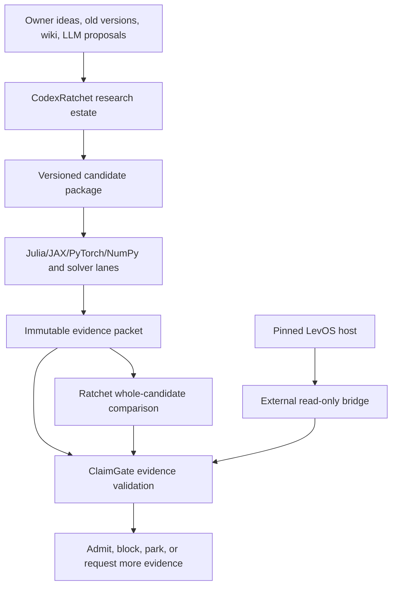

# Volume I — Overall Model Intent and Finite Mathematics

**Preservation date:** 2026-07-27  
**Purpose:** state the entire research intent before any specialized manifold,
engine, software, or physics discussion  
**Status:** owner-directed research model with candidate formalizations and
bounded evidence; not canonized by this document

## 1. The overall intent

The program is an attempt to construct mathematics, geometry, information,
dynamics, and eventually scientific objects from finite constrained
distinguishability rather than silently assuming identity, equality,
continuum, metric, probability, causality, or global time at the start.

The central research question is:

\[
\boxed{
\text{What is the weakest finite structure that can support
persistent, extensible distinctions under ordered constraints?}
}
\]

The process is not supposed to select the most elaborate theory. It keeps the
coarsest structures that preserve the declared distinctions, retains
incomparable survivors, records obstruction witnesses, and refuses to invent a
next layer when the available demand does not discriminate.

The system has three inseparable views:

1. a finite nested possibility carrier and its Ratchet;
2. the same carrier deformed into a nested entropic–geometric manifold;
3. cyclic degrees of freedom inside the mature manifold, represented
   dynamically by the ring model and engine fields.

The research is anti-teleological. The present is not explained by writing a
smooth narrative toward a desired endpoint. Many candidate futures remain
live; constraints remove, merge, or preserve them only when the relevant
distinctions and continuation tests earn that transition.

## 2. Finite numerical frames

A numerical computation cannot use a number without first fixing the finite
carrier on which the number can be represented. The hidden “graph paper” of
ordinary notation is made explicit as a formal numerical frame:

\[
\mathfrak F=(X,o,\delta,\nu),
\qquad |X|=2^n<\infty.
\]

Here:

- \(X\) is the finite encoding set;
- \(o\in X\) is the declared origin;
- \(\delta\) is resolution;
- \(\nu\) is the interpretation map;
- \(n\) is the bit capacity.

The number of available encodings and its additive information scale are:

\[
N(\mathfrak F)=|X|=2^n,
\qquad
S_0(\mathfrak F)=\log_2|X|=n.
\]

The count \(N\) and bit scale \(S_0\) express one finite fact in multiplicative
and additive form. Maximum entropy is fundamental here because the unweighted
base declares only which possibilities exist, before probabilities select
among them.

Changing the frame is itself a computation:

\[
\iota_{n,m}:\mathfrak F_n\hookrightarrow\mathfrak F_m.
\]

The map must state how origins, resolutions, values, overflow, and unused
encodings are handled. Cross-frame arithmetic is undefined until such a map is
declared.

This does not claim that standard real or complex mathematics is useless. It
claims that actual computations use finite representations and that the
assumptions of those representations should be part of the mathematical
object rather than invisible background.

## 3. Number emergence and magnitude of zero

Numbers are downstream of:

1. a finite carrier;
2. an origin;
3. a scale and resolution;
4. an equivalence or interpretation rule;
5. admissible operations.

Zero is therefore frame-relative. A zero output may conceal a large fibre of
states that a quotient or measurement merged.

For:

\[
q:X\to Y,
\]

the released fibre is:

\[
\mathcal R_q(y)=q^{-1}(y).
\]

A candidate magnitude-of-zero descriptor is:

\[
\mathbf z_q(y)=
\left(
|q^{-1}(y)|,\,
\log_2|q^{-1}(y)|,\,
\operatorname{rank}D_y,\,
\beta_\bullet(K_y),\ldots
\right).
\]

This is not ordinary field division by zero. It is a new typed operation that
returns the finite unresolved structure collapsed at a map’s singular or
zero-valued output.

## 4. The finite Ratchet

At round \(r\), define:

\[
\mathcal K_r=
\left(
D_r,P_r,\mathcal C_r,
\{\preceq_{r,a}\}_{a\in A_r},
\mathcal H_r
\right),
\]

where \(D_r\) is the demand set, \(P_r\) the probe contract,
\(\mathcal C_r\) the finite candidate family, the \(\preceq_{r,a}\) are
declared partial orders, and \(\mathcal H_r\) is the retained history.

A candidate induces an operational equivalence:

\[
x\sim_{c,P_r}y
\iff
\forall p\in P_r,\;p(c,x)=p(c,y).
\]

This gives a partition \(\pi_c\). Demand loss is:

\[
L_{D_r}(\pi_c)
=
\sum_{(x,y)\in D_r}
\mathbf 1([x]_{\pi_c}=[y]_{\pi_c}).
\]

Survivors satisfy:

\[
\mathcal S_r
=
\{c\in\mathcal C_r:L_{D_r}(\pi_c)=0\}.
\]

The minimal-sufficient frontier consists of the coarsest survivors under the
declared partition-refinement or presumption order. Incomparable survivors
remain plural.

\[
D_r=\varnothing
\Longrightarrow
\text{HOLD}.
\]

An empty demand cannot justify a directional verdict.

## 5. Nested comparisons

The comparison unit is a compatible tower:

\[
\mathcal T
=
(X_0,\ldots,X_R;
\rho_{1,0},\ldots,\rho_{R,R-1}),
\]

not a bag of independently scored layers.

Each retained layer is a projection of the compatible tower:

\[
X_r^\ast=\Pi_r(\mathcal T).
\]

An inner candidate survives only when it extends into a compatible whole.
Outer constraints compress the available inner carrier, while inner
obstructions constrain which outer extensions can exist.

MSS is relative to the finite packet, demand, probes, and partial orders. It
cannot prove an absolutely minimal ontology or establish unrestricted truth.

## 6. Finitude, noncommutation, and nonassociativity

Finitude requires every realized carrier, history, probe family, and execution
budget to be declared.

Noncommutation is the first order-sensitive defect:

\[
[A,B]=AB-BA.
\]

Nonassociativity is a different obligation:

\[
[a,b,c]=(ab)c-a(bc).
\]

\[
[A,B]\ne0
\not\Rightarrow
[a,b,c]\ne0.
\]

Exact linear-map composition remains associative. Effective
nonassociativity can appear when projection or lossy reduction is inserted
between compositions:

\[
\Pi(\Pi(A\circ B)\circ C)
\ne
\Pi(A\circ\Pi(B\circ C)).
\]

Octonions and exceptional algebras remain serious rivals only if they explain
something that ordinary lossy effective reduction cannot.

## 7. One gradient, three representations

The core visual statement is:

\[
\boxed{
\text{flat nested checkerboard}
\longrightarrow
\text{ordered curvature}
\longrightarrow
\text{closed sphere = spinning-ring realization}.
}
\]

- The checkerboard is the finite Ratchet view.
- Its curvature is the ordered-deformation manifold.
- Closure is the dynamic ring/engine representation.

These are not independent decorations around the theory. They are three
views of one geometric–entropic gradient.

## 8. Hard nonclaims

This program does not currently establish:

- that its candidate layer order is unique;
- that every physically meaningful continuum can be replaced without loss;
- that a zero or singularity empirically releases the proposed field;
- that the engine structure emerges autonomously end to end;
- that exceptional algebras are required;
- that any Millennium problem is solved;
- that finite computation by itself proves an unrestricted theorem.

The detailed source chapters below preserve the model’s development. Where
they conflict with this front section, the current front section and explicit
owner-correction ledgers control.

---

# Detailed source chapters


---

## Preserved detailed source — Cumulative research master v2

> This chapter is preserved in full. Current corrections in the front section supersede conflicts.

# Constraint–Geometry Research Continuity

**Preservation date:** 2026-07-27  
**Document type:** cumulative continuity record  
**Scope:** the finite mathematics model, Ratchet, ordered-deformation manifold, ring/checkerboard geometry, engine degrees of freedom, engine fields, ConstraintBox/ClaimGate, simulation architecture, and the bounded program for major mathematics and science problems  
**Authority:** this document preserves and organizes work; it does not canonize model-generated prose or promote bounded simulations into proofs

## 1. Reading rules

This research has repeatedly been damaged by flattening distinct objects into one smooth story. The following labels are mandatory:

| Label | Meaning |
|---|---|
| **OWNER STATEMENT** | A current statement or correction made by Joshua Eisenhart. |
| **FORMALIZATION** | A precise mathematical representation proposed for an owner statement. It remains replaceable. |
| **EXECUTED — BOUNDED** | Code ran on the declared finite carrier and supports only the stated result. |
| **DERIVED CANDIDATE** | A mathematical consequence conditional on the chosen formalization. |
| **OPEN RIVAL** | A serious alternative retained for comparison. |
| **NEGATIVE RESULT** | An attempted implication or mechanism that failed a declared test. |
| **UNTESTED** | Described but not executed. |
| **SUPERSEDED** | Preserved for provenance but not current. |

The authority order is:

1. current owner correction;
2. attributable owner text;
3. freshly executed code and independently inspectable evidence, within its claim ceiling;
4. current repository material consistent with 1–3;
5. older repository versions and prior continuity packs;
6. LLM output as proposals, rivals, and test fuel.

### 1.1 Current owner supersessions

The following corrections govern this pack even where preserved older
documents disagree.

#### Engine loops

The current cyclic traversal classes are:

\[
[\ell_{\mathrm{ind}}]_{\mathrm{cyc}}
=
[(S_e,S_i,N_i,N_e)]_{\mathrm{cyc}},
\]

\[
[\ell_{\mathrm{ded}}]_{\mathrm{cyc}}
=
[(N_e,N_i,S_i,S_e)]_{\mathrm{cyc}}.
\]

A cyclic rotation changes only the chosen entry point:

\[
(x_0,x_1,x_2,x_3)
\sim_{\mathrm{cyc}}
(x_k,x_{k+1},x_{k+2},x_{k+3}).
\]

The loops therefore have no intrinsic first stage. Observation-first and
theory-first scientific procedures may select convenient entry points without
changing the underlying loop.

Older schedules such as
`Ne → Si → Se → Ni`, `Ne → Ni → Se → Si`,
`Se → Ne → Ni → Si`, and `Se → Si → Ni → Ne` remain in preserved source
documents as provenance. They are not current authority.

#### Four topologies, eight terrains, sixteen placements

The current structural requirement is:

\[
4\text{ local flow topologies}
\times
2\text{ flux orientations}
=
8\text{ flux-bearing terrains},
\]

followed by

\[
8\text{ terrains}
\times
2\text{ precedence/sign states}
=
16\text{ engine placements}.
\]

The four candidate formal flow classes are:

1. dissipative outward transport;
2. attracting relaxation;
3. Hamiltonian orbit circulation;
4. invariant-subspace stratification.

Write them as

\[
\mathfrak T
=
\{\mathcal G_{\mathrm{out}},
\mathcal G_{\mathrm{sink}},
\mathcal G_{\mathrm{orb}},
\mathcal G_{\mathrm{strat}}\}.
\]

The eight flux-bearing terrains are indexed by

\[
\mathcal T_{a,\chi},
\qquad
a\in\{1,2,3,4\},
\quad
\chi\in\{-1,+1\},
\]

with an orientation-sensitive record

\[
\Phi_{a,\chi}
=
\chi\int_{\Sigma_a}F_a.
\]

This indexing preserves the current structural statement. The unique
generator and physical realization of every class remain open to tournament.

#### Axis 6

Axis 6 is not composition order alone. It specifies:

1. operator-first versus terrain-first composition; and
2. a corresponding operator-sign reversal.

A sign-neutral formal placeholder is:

\[
\Psi^{\uparrow}_{a,\chi}
=
\Phi_{a,\chi}\circ
\mathcal O^{\sigma_\uparrow}_{a,\chi},
\]

\[
\Psi^{\downarrow}_{a,\chi}
=
\mathcal O^{\sigma_\downarrow}_{a,\chi}
\circ\Phi_{a,\chi},
\]

subject to

\[
\sigma_\uparrow=-\sigma_\downarrow.
\]

The owner correction establishes the reversal. It does not, in the sources
available to this pack, uniquely establish which arrow receives the positive
sign for every operator family. That binding must be stated explicitly and
tested rather than guessed.

The user’s informal labels may appear in explanatory crosswalks. Formal object names and equations do not depend on those labels.

---

## 2. The central object

### 2.1 Three views of one finite process

**OWNER STATEMENT**

1. The flat, recursively nested checkerboard is the Ratchet view.
2. The checkerboard curving upward is the manifold view.
3. When the curvature closes into a sphere, that closed geometry is the spinning-ring realization. The rings are the operational engine view.
4. These are positions along one geometric–entropic gradient, not three unrelated metaphors.

The model begins with a finite possibility carrier. Ordered constraints deform it. The deformations create new admissible structures, new invariants, new geometries, and new entropies. At sufficient depth, residual cyclic degrees of freedom may support engine dynamics. Those dynamics may then create records, histories, fields, and further constraint material.

The dependency is:

\[
\boxed{
\text{finite possibility carrier}
\xrightarrow{\text{ordered constraints}}
\text{nested deformed carrier}
\xrightarrow{\text{residual cyclic degrees}}
\text{engine dynamics}
\xrightarrow{\text{records and coupling}}
\text{new effective geometry and entropy}
}
\]

This is a research program, not an already-established theorem.

### 2.2 What “geometry and entropy are one” means here

At the base, the same finite structure has two readings:

- geometrically: which alternatives, adjacencies, identifications, boundaries, and extensions exist;
- entropically: how many alternatives remain available at the declared resolution.

An ordered deformation changes both at once. Removing a face from a finite cell complex, for example, can create a new homology class and increase the Hartley capacity of that homology group. The geometry and the capacity are not two unrelated outputs; they are two invariants of the same finite deformation.

Later layers license different entropy functionals. They must remain typed. Hartley capacity, Shannon entropy, von Neumann entropy, relative entropy, conditional entropy, coherent information, entropy production, and path entropy are not interchangeable scalars.

---

## 3. Finite numerical frames

### 3.1 Numbers require a declared finite carrier

**OWNER STATEMENT**

A number is not used before the finite field of representable possibilities has been specified. A computation requires:

- a finite number of possible encodings;
- an origin;
- a resolution;
- a scale or span;
- a representation rule;
- explicit maps when the carrier grows or when values move between carriers.

There is no operational infinity inside a completed computation. A continuum may be a limiting construction or an external mathematical ideal, but every actual run occupies a finite declared frame.

### 3.2 Formal numerical frame

**FORMALIZATION**

Define a finite numerical frame

\[
\mathfrak F
=
(X,o,\delta,\nu),
\qquad
|X|=2^n<\infty,
\]

where:

- \(X\) is the finite set of encodings;
- \(o\in X\) is the chosen origin;
- \(\delta>0\) is the resolution;
- \(\nu:X\to\mathbb R\) is an interpretation map used only after the frame is declared.

One common signed fixed-point interpretation is

\[
\nu(x)=a+\delta\,q(x),
\]

where \(q:X\to\mathbb Z\) is a chosen integer code and \(a\) fixes the interpreted origin.

The possibility count and its bit scale are

\[
N(\mathfrak F)=|X|=2^n,
\qquad
S_0(\mathfrak F)=\log_2|X|=n.
\]

Here \(N\) is the count of encodings and \(S_0\) is its Hartley/Rényi-0 capacity in bits.

### 3.3 Frame growth

A larger carrier does not appear without a map. Growth is:

\[
\iota_{n,m}:\mathfrak F_n\hookrightarrow\mathfrak F_m,
\qquad
m>n,
\]

with explicit obligations:

\[
\iota_{n,m}(o_n)=o_m,
\]

\[
\nu_m\!\left(\iota_{n,m}(x)\right)=\nu_n(x)
\quad\text{or an explicitly declared approximation},
\]

and a stated treatment of resolution, overflow, rounding, and unused encodings.

Cross-frame arithmetic is undefined until an embedding or reconciliation map is declared.

### 3.4 Magnitude of zero

**OWNER DIRECTION; FORMALIZATION OPEN**

Zero is not treated as a universally context-free atom. A zero result can encode the magnitude and structure of what was collapsed by a map.

For a finite map

\[
q:X\to Y,
\]

define the fibre over \(y\in Y\):

\[
q^{-1}(y)=\{x\in X:q(x)=y\}.
\]

A candidate finite “magnitude of zero” descriptor at \(y\) is the fibre-capacity vector

\[
\mathbf z_q(y)
=
\left(
|q^{-1}(y)|,\,
\log_2|q^{-1}(y)|,\,
\operatorname{rank}D_y,\,
\beta_\bullet(K_y),\,
\ldots
\right),
\]

where \(D_y\) and \(K_y\) are declared history and geometric structures on that fibre. This is not ordinary division by zero. It is a set- or structure-valued release operation describing what a quotient or singular map merged.

Any proposed arithmetic such as “\(1/0\) returns a field” must therefore be expressed as a new typed operation:

\[
\mathcal R_q(y)=q^{-1}(y)
\quad\text{or}\quad
\mathcal R_q(y)=\text{an invariant object constructed from }q^{-1}(y),
\]

not as a claim that ordinary field division has changed its standard meaning.

---

## 4. The finite Ratchet

### 4.1 Input contract

At round \(r\), let:

\[
\mathcal K_r
=
\left(
D_r,\,
P_r,\,
\mathcal C_r,\,
\{\preceq_{r,a}\}_{a\in A_r},\,
\mathcal H_r
\right),
\]

where:

- \(D_r\) is a finite set of demanded distinctions;
- \(P_r\) is a finite probe family;
- \(\mathcal C_r\) is a finite candidate family;
- \(\preceq_{r,a}\) are declared partial orders of presumption;
- \(\mathcal H_r\) is the retained history and obstruction record.

A candidate \(c\) induces an observational partition

\[
\pi_c
=
\{[x]_{c,P_r}:x\in X_r\},
\]

where

\[
x\sim_{c,P_r}y
\iff
\forall p\in P_r,\;p(c,x)=p(c,y).
\]

### 4.2 Demand loss

For demanded pairs \(D_r\subseteq X_r\times X_r\), define

\[
L_{D_r}(\pi_c)
=
\sum_{(x,y)\in D_r}
\mathbf 1\!\left([x]_{\pi_c}=[y]_{\pi_c}\right).
\]

The admissible survivors are

\[
\mathcal S_r
=
\{c\in\mathcal C_r:L_{D_r}(\pi_c)=0\}.
\]

No demand means no discrimination:

\[
D_r=\varnothing
\quad\Longrightarrow\quad
\text{HOLD},
\]

not an invented preference.

### 4.3 Minimal sufficient structure

Under partition refinement,

\[
\pi_a\preceq\pi_b
\iff
\forall B\in\pi_a\;\exists C\in\pi_b\text{ such that }B\subseteq C.
\]

The desired frontier is the set of coarsest demand-preserving survivors:

\[
\mathcal F_r
=
\left\{
c\in\mathcal S_r:
\nexists c'\in\mathcal S_r
\text{ with }
\pi_c\prec\pi_{c'}
\right\}.
\]

When survivors are incomparable under one or more declared orders, they remain plural. The Ratchet does not invent a scalar score to force a winner.

MSS is relative to the candidate packet, demand, probes, and partial order. It is not an unrestricted proof of an absolutely minimal ontology.

### 4.4 Nested comparison

A manifold candidate is a compatible tower:

\[
\mathcal T
=
(X_0,X_1,\ldots,X_R;
\rho_{1,0},\rho_{2,1},\ldots,\rho_{R,R-1}),
\]

with

\[
\rho_{r+1,r}:X_{r+1}\to X_r
\]

and compatibility constraints

\[
C_r(X_{\le r})=1.
\]

A layer is not compared in isolation when its meaning depends on the tower. Its observable content is a projection:

\[
X_r^\ast=\Pi_r(\mathcal T).
\]

Flat comparison of two isolated layers is invalid unless a declared forgetful functor makes it valid.

### 4.5 Ratchet output

Each round returns a vector, not a story:

\[
\Delta_r
=
(\text{survivors},\,
\text{defeats},\,
\text{incomparables},\,
\text{obstructions},\,
\text{unmet demands},\,
\text{next finite obligations}).
\]

If no new finite obligation is earned, the correct transition is HOLD.

---

## 5. The ordered-deformation manifold

### 5.1 Core thesis

**OWNER STATEMENT**

The nested manifold is generated by ordered deformations of a finite maximum-capacity Hartley/Rényi-0 base. Each earned deformation constrains the carrier and licenses a new class of mathematics, geometry, and entropy. The order of deformations is content.

### 5.2 Formal deformation chain

Let

\[
\mathcal M_0=\mathfrak F_n
\]

be the finite base. A candidate tower is

\[
\mathcal M_r
=
\mathcal D_r\circ\mathcal D_{r-1}\circ\cdots\circ\mathcal D_1(\mathcal M_0).
\]

Two orderings are equivalent only if an explicit natural equivalence or conjugacy is exhibited:

\[
\mathcal D_i\circ\mathcal D_j
\cong
\mathcal D_j\circ\mathcal D_i.
\]

Order is load-bearing when

\[
[\mathcal D_i,\mathcal D_j](\mathcal M)
:=
\mathcal D_i\!\circ\mathcal D_j(\mathcal M)
-
\mathcal D_j\!\circ\mathcal D_i(\mathcal M)
\ne0
\]

under an admitted finite discriminator.

Grouping is load-bearing when the associator

\[
\alpha(\mathcal D_i,\mathcal D_j,\mathcal D_k)
=
(\mathcal D_i\circ\mathcal D_j)\circ\mathcal D_k
-
\mathcal D_i\circ(\mathcal D_j\circ\mathcal D_k)
\]

is nonzero after the effective reductions actually used by the model.

Noncommutation does not imply nonassociativity.

### 5.3 Earned layer criterion

A deformation earns a layer only if:

1. it is well-defined on the previous layer;
2. its compatibility map is explicit;
3. at least one new invariant becomes computable;
4. deleting it changes a demanded invariant after all allowed refits;
5. no declared redundancy map reproduces the same change;
6. relevant rival orderings have been retained or killed by finite witnesses.

Coordinate changes, relabelings, and conjugations that create no new invariant are gauge, not new layers.

### 5.4 Candidate deformation ladder

This is a likely ordering and a test plan, not a settled canon.

| Rung | Formal deformation | New mathematical carrier | Newly licensed geometry | Newly licensed entropy/information | Required negative |
|---:|---|---|---|---|---|
| 0 | none | finite set \(X\), \(|X|=2^n\) | finite incidence without metric | \(S_0(X)=\log_2|X|\) | no probabilities or continuum imported |
| 1 | probe quotient | \(X/{\sim_P}\) | partition lattice, quotient incidence, fibre geometry | class and fibre capacities | change labels while preserving probes; result must not change |
| 2 | extension structure | fibres \(\operatorname{Ext}(y)\) and restriction maps | presheaf-like finite extension geometry | \(\log_2|\operatorname{Ext}(y)|\) | no holonomy unless transition maps are invertible |
| 3 | weighting | probability simplex \(\Delta^{d-1}\) | Fisher information geometry | Shannon, classical Rényi, KL divergence | unweighted carrier must not gain Shannon entropy |
| 4 | complex linear carrier | finite-dimensional Hilbert space and density cone | convex state geometry, rank strata | rank Rényi-0, von Neumann, Umegaki relative entropy | basis relabeling must be gauge |
| 5 | projectivization and phase quotient | rays in \(\mathbb{CP}^{d-1}\) | Fubini–Study metric and quantum geometric tensor | pure-state spectral and geometric-phase invariants | global phase must be unobservable |
| 6 | tensor factorization and cuts | \(\mathcal H_A\otimes\mathcal H_B\) | cut lattice, Schmidt strata, entropy cone | mutual, conditional, coherent information; negativity as a monotone | no cut entropy before a cut exists |
| 7 | grading or double cover | graded Clifford module / spin representation | orientation and chirality bundle candidates | graded coherence and orientation-sensitive records | conjugate copies that add no discriminator are demoted |
| 8 | connection | principal or vector bundle with \(A\) and \(F=dA+A\wedge A\) | holonomy and curvature; nested-leaf relative flux | phase records; distributions over records only after readout | contractible-loop control must show the boundary of “flux requires nesting” |
| 9 | process | finite channels or semigroups | flow, fixed points, basins, currents | data-processing contraction and entropy production | a topological cycle with zero affinity must carry no current |
| 10 | history | path register \(D(j,k)\) | path-space and cycle-space geometry | path entropy, coherent-history distinguishability, full-counting statistics | dephasing must erase orientation information when it is coherence-only |
| 11 | effective reduction | Schur complement, coarse-graining, projection | effective nested geometry | information loss and retained sufficient statistics | exact unreduced composition must remain associative |
| 12 | bracketing-sensitive reduction | nonassociative effective composition if earned | associator geometry; exceptional algebra only as a rival | distribution of associator defects; spectral entropy if licensed | lossy projection must compete against octonionic explanations |
| 13 | field coupling | spatially indexed local generators \(x\mapsto G_x\) | bundle/graph field, defects, domains, transport | local production, transfer, path and field entropies | uncoupled and scrambled-topology controls |

The ladder is a directed acyclic candidate system, not necessarily one forced linear chain. Some deformations may commute; others may branch; some may be incomparable.

### 5.5 Entropy ordering without flattening

The universal support ordering on one declared density operator is:

\[
S_0(\rho)
\ge
S_\alpha(\rho)
\ge
S_\beta(\rho)
\ge
S_\infty(\rho),
\qquad
0\le\alpha\le\beta\le\infty.
\]

For the standard named members:

\[
S_0(\rho)=\log\operatorname{rank}\rho,
\]

\[
S_1(\rho)=-\operatorname{Tr}(\rho\log\rho),
\]

\[
S_2(\rho)=-\log\operatorname{Tr}(\rho^2),
\]

\[
S_\infty(\rho)=-\log\lambda_{\max}(\rho).
\]

This is not the nesting order of the whole manifold. It is an inequality family licensed after the density carrier exists. Earlier finite-set capacity and later cut, path, production, and record functionals occupy different types.

---

## 6. The checkerboard, curvature, sphere, and ring realization

### 6.1 The finite checkerboard

The checkerboard is a visual carrier for a finite recursively nested possibility system. Each cell at resolution \(r\) carries a finite fibre:

\[
\pi_r:E_r\to B_r,
\qquad
\pi_r^{-1}(x)\cong X_{r,x},
\qquad
|X_{r,x}|=2^{n_{r,x}}.
\]

The fibre may carry a history-pair matrix

\[
D_x(j,k)
=
\operatorname{Tr}
\left(
K_j\rho_xK_k^\dagger
\right).
\]

The diagonal terms encode history weights. The off-diagonal terms encode retained coherence between histories. A \(2^n\)-element history set gives a \(2^n\times2^n\) history-pair field, not merely a list of \(2^n\) probabilities.

### 6.2 Curvature as ordered constraint

The “board curving upward” is the visual representation of ordered deformation. It is not an extra sphere placed around a still-flat board.

A discrete version can use weighted cochains:

\[
d_k:C^k(K)\to C^{k+1}(K),
\]

\[
\mathcal D=d+d^\dagger,
\qquad
\Delta=\mathcal D^2.
\]

Changes in faces, identifications, weights, and transition maps change the Hodge decomposition:

\[
C^1
=
\operatorname{im}d_0
\oplus
\operatorname{im}d_1^\dagger
\oplus
\ker\Delta_1.
\]

The exact, coexact, and harmonic components provide finite discriminators for gradient settlement, local circulation, and global cycle degrees of freedom.

### 6.3 Closure

**OWNER STATEMENT**

When the upward curvature closes into a sphere, the closed sphere is equal to the ring model with spinning rings. The rings do not independently “become” a sphere; the sphere is the closed realization of the curved checkerboard, and spinning rings are its dynamic representation.

A candidate mathematical chart is the Hopf fibration:

\[
\pi:S^3\to S^2,
\]

\[
(z_1,z_2)
=
(\cos\eta\,e^{i\phi_1},
\sin\eta\,e^{i\phi_2}),
\]

whose regular leaves

\[
T_\eta
=
\{|z_1|=\cos\eta,\;|z_2|=\sin\eta\}
\]

are Clifford tori. This chart is a formal candidate for the ring realization; it does not by itself prove that the physical model must use Hopf geometry.

For a connection \(A\) with curvature \(F=dA\), a relative flux through an inter-leaf strip \(\Sigma_{\eta_1,\eta_2}\) is

\[
\Phi(\eta_1,\eta_2)
=
\int_{\Sigma_{\eta_1,\eta_2}}F
=
\oint_{C_{\eta_2}}A
-
\oint_{C_{\eta_1}}A.
\]

On the tested Hopf chart this becomes

\[
\Phi
=
2\pi
\left(
\sin^2\eta_{\mathrm{out}}
-
\sin^2\eta_{\mathrm{in}}
\right)
=
\pi
\left(
\cos2\eta_{\mathrm{in}}
-
\cos2\eta_{\mathrm{out}}
\right).
\]

The qualified statement is:

- noncontractible leaf loops need relative inter-leaf geometry for this flux;
- a contractible loop can bound a disk and carry flux without a second nested leaf;
- therefore “flux requires nesting” is true for the selected noncontractible leaf class, not universally.

---

## 7. Engine degrees of freedom

### 7.1 Loops have no intrinsic first stroke

**OWNER STATEMENT**

Engine traversals are loops. A scientific procedure may choose a preferred entry point, but the engine itself can be entered at any stage. The invariant content is cyclic order, orientation, composition order, and continuous state handoff.

For a cyclic word

\[
w=(G_0,G_1,\ldots,G_{m-1}),
\]

the \(k\)-shift

\[
\tau_k w
=
(G_k,G_{k+1},\ldots,G_{m-1},G_0,\ldots,G_{k-1})
\]

is the same unbased loop when only cyclic structure is observed. Reversal

\[
w^{-1}
=
(G_{m-1},\ldots,G_1,G_0)
\]

is generally different.

For the current four-stage classes:

\[
[\ell_{\mathrm{ind}}]_{\mathrm{cyc}}
=[(S_e,S_i,N_i,N_e)]_{\mathrm{cyc}},
\qquad
[\ell_{\mathrm{ded}}]_{\mathrm{cyc}}
=[(N_e,N_i,S_i,S_e)]_{\mathrm{cyc}}.
\]

The two classes traverse the same four labels in opposite cyclic direction.
The preferred beginning of a scientific procedure is an entry convention,
not a fifth engine degree of freedom.

### 7.2 Complete affine generator coordinates

For a qubit state

\[
\rho=\frac12(I+r\cdot\sigma),
\]

every trace-preserving, Hermiticity-preserving generator has

\[
\dot r=b+Ar.
\]

The matrix \(A\in\mathbb R^{3\times3}\) has the unique decomposition

\[
A=\Omega+\lambda I+S,
\]

\[
\Omega^\mathsf T=-\Omega,
\qquad
S^\mathsf T=S,
\qquad
\operatorname{tr}S=0.
\]

The full real parameter count is

\[
\underbrace{3}_{b}
+
\underbrace{3}_{\Omega}
+
\underbrace{1}_{\lambda}
+
\underbrace{5}_{S}
=12.
\]

These are formal local degrees of freedom:

| Component | Formal name | Geometric effect | Entropic effect |
|---|---|---|---|
| \(b\) | affine translation | displaces the stationary point | permits relaxation toward a noncentral state |
| \(\Omega\) | antisymmetric generator | tangent rotation | isospectral; von Neumann entropy preserved |
| \(\lambda I\) | scalar symmetric generator | isotropic radial contraction or dilation | direction-independent purity change |
| \(S\) | traceless symmetric generator | anisotropic contraction, shear, axis selection | direction-dependent production or contraction |

This decomposition exhausts the local affine generator space. It does not prove that four previously named flow families are uniquely selected. The bounded census found many valid mixtures and additional normal forms.

### 7.3 Minimum engine conditions

A cycle is only capacity. An engine requires:

\[
\boxed{
\text{cycle capacity}
+
\text{nonzero affinity}
+
\text{stationary current}
+
\text{load or task coupling}
}
\]

For a finite Markov network with stationary distribution \(\pi\) and rates \(k_{ij}\):

\[
J_{ij}=\pi_i k_{ij}-\pi_j k_{ji},
\]

\[
BJ=0,
\]

\[
J=\sum_\gamma j_\gamma c_\gamma,
\]

\[
\mathcal A_\gamma
=
\sum_{(i,j)\in\gamma}
\log\frac{k_{ij}}{k_{ji}},
\]

\[
\dot\Sigma
=
\sum_\gamma j_\gamma\mathcal A_\gamma
\ge0.
\]

Useful output requires an explicitly declared relation such as

\[
\sum_a\dot Q_a+\dot W=0.
\]

Without a load or task, the system is a driven circulating process, not yet a heat, work, or information engine.

### 7.4 How engine degrees can emerge

The currently defensible mechanism is:

1. ordered constraints create a finite residual cycle class;
2. a non-exact affinity cochain drives that class;
3. dynamics supplies nonzero current weights;
4. retained histories preserve order and orientation information;
5. a load turns circulation into an operational engine;
6. records feed new constraints into later Ratchet rounds.

The finite topology test established:

\[
\beta_1:0\to1\to0
\]

under filled-disk, puncture, and slit deformations, and

\[
S_0(H_1):0\to1\to0\text{ bit}.
\]

It also established the necessary negative:

\[
\text{cycle capacity}\not\Rightarrow\text{current}.
\]

The 512-candidate face tournament then found that the coarsest constraint system preserving one specifically demanded central circulation had:

\[
\dim H_1=1.
\]

With the weaker demand \(\beta_1\ge1\), nine incomparable one-hole survivors remained. The demand selected a cycle; the algorithm did not invent one.

### 7.5 Autonomous history cycles

For a primitive stationary quantum semigroup, the density operator may converge while quantum-jump histories retain nonzero cycle currents. Therefore an autonomous engine’s cyclic address can live in history space even when

\[
\dot\rho_{\mathrm{ss}}=0.
\]

The executed three-qubit absorption-machine scout used:

\[
H_0=\sum_{i=1}^{3}E_i n_i,
\]

\[
H_{\mathrm{int}}
=
g
\left(
|010\rangle\langle101|
+
|101\rangle\langle010|
\right),
\]

with

\[
E_2=E_1+E_3.
\]

Its history graph had eight vertices, twelve reservoir edges, and one coherent chord:

\[
\dim\ker B=13-7=6.
\]

The six reservoir orderings formed a cycle basis:

\[
J=\sum_{\pi\in S_3}j_\pi c_\pi.
\]

All six coefficients were positive in the productive regime. Equal temperatures, zero coherent coupling, and reversed gradients behaved as required controls.

This supports autonomous weighted cycle currents. It does not yet establish an explicit work load, an autonomous derivation of the proposed holonomy record, or survival of all sixteen sectors in the fully coupled model.

### 7.6 Cohomological affinity

The thermal cube alone had

\[
\beta_1=5
\]

but zero cycle affinity because the edge-affinity cochain was exact:

\[
a_{\mathrm{thermal}}=B^\mathsf T\phi.
\]

The coherent chord raised the cycle dimension to six and made the full cochain non-exact. The six cycle coordinates split into:

\[
\boxed{
\text{one driven chord-winding coordinate}
\oplus
\text{five zero-affinity ordering coordinates}.
}
\]

Entropy production detects the driven coordinate. Unequal cycle weights also contain kinetic information in the five ordering coordinates.

### 7.7 Sixteen conditional sectors

The local crossing

\[
4\text{ flow exemplars}
\times
2\text{ composition signs}
\times
2\text{ orientations}
\]

creates sixteen labels but only ten distinguishable local channels in the tested construction.

Adding a coherent two-history record:

\[
D_\chi
=
\frac12
\begin{pmatrix}
1&e^{i(-1)^\chi\Phi}\\
e^{-i(-1)^\chi\Phi}&1
\end{pmatrix}
\]

restored sixteen distinguishable sectors. Dephasing:

\[
D_\chi\mapsto\frac12I
\]

returned the count to ten. Opposite orientations differed only in off-diagonal terms.

Thus the current bounded result is:

\[
\text{local channel}
+
\text{ordered placement}
+
\text{coherent relative-history record}
\Longrightarrow
16\text{ distinguishable sectors}.
\]

The history record remains load-bearing and must be generated autonomously in the decisive experiment.

### 7.8 Thermodynamic analogues

Carnot, Otto, and Szilard engines are comparison structures, not literal identifications.

The useful shared grammar is:

- a finite cyclic word;
- alternating approximately isospectral and dissipative processes;
- at least two distinct potentials, reservoirs, or information stores;
- entropy/information accounting;
- a declared load or task;
- no intrinsic first stroke.

A literal temperature interpretation is unlicensed until a probability weighting and a Gibbs state are defined. At earlier layers, capacity gradients may play the analogous role, but they are not temperatures.

---

## 8. Engine fields

### 8.1 Definition

An engine field is a spatial or graph-indexed family of local finite generators:

\[
x\longmapsto G_x
=
\left(
b_x,\Omega_x,\lambda_x,S_x
\right),
\qquad x\in V(K),
\]

with coupling operators

\[
C_{xy}:\mathcal H_x\otimes\mathcal H_y
\to
\mathcal H_x\otimes\mathcal H_y
\]

on edges \((x,y)\in E(K)\).

A discrete field evolution can be written:

\[
\dot\rho_x
=
\mathcal L_x(\rho_x)
+
\sum_{y\sim x}
\mathcal C_{xy}(\rho_x,\rho_y).
\]

The field is not created by placing names on a grid. It requires:

- local physical generators;
- explicit coupling;
- boundary conditions;
- stability and complete-positivity checks where applicable;
- transport, defect, domain, and correlation observables;
- topology-scramble and uncoupled controls.

### 8.2 Candidate normal forms

Near a Hopf bifurcation, a complex amplitude field is often reduced to the complex Ginzburg–Landau equation:

\[
\partial_t A
=
\mu A
+
(1+ic_1)\nabla^2A
-
(1+ic_3)|A|^2A.
\]

This is a leading candidate normal form for collective engine-field phases, defects, and traveling structures. It assumes smooth amplitude, spatial scale separation, and continuum derivatives; those assumptions are not licensed at the finite base and must be earned by coarse-graining tests.

A finite graph alternative is:

\[
\dot A_x
=
\mu_x A_x
-
\sum_y L_{xy}A_y
-
\gamma_x|A_x|^2A_x,
\]

where \(L\) is a declared graph Laplacian.

### 8.3 Tape and machine

A finite computational layer may use:

- a finite tape carrier \(T\);
- a finite head state set \(Q\);
- a local transition map

\[
\delta:Q\times\Sigma\to Q\times\Sigma\times\{-1,+1\};
\]

- explicit periodic or twisted boundary conditions.

The transition system may be encoded in reversible Hamiltonian dynamics, stochastic channels, or finite state updates.

For a twisted cyclic tape:

\[
\psi(x+L)=U_{\mathrm{twist}}\psi(x).
\]

Candidate boundary classes include trivial periodic, exchange, conjugation, orientation-reversing, and antiperiodic twists. “Möbius-like” is a visual label; the formal object is the specified bundle holonomy \(U_{\mathrm{twist}}\).

The proposed tape–machine equivalence becomes a finite fixed-point problem only after the transition rule is itself represented as tape content:

\[
\Theta(M)=M.
\]

No mechanism has yet established that manifold depth forces this fixed point.

### 8.4 Oracles and demons

An oracle-like lookup over a precomputed fibre

\[
\operatorname{Ext}(y)
\]

is amortized computation, not free computation. The cost has moved into construction and maintenance of the fibre.

A demon-like selective instrument has:

\[
p(y|\rho)=\operatorname{Tr}(M_y\rho),
\qquad
\rho_y
=
\frac{K_y\rho K_y^\dagger}{p(y|\rho)}.
\]

Feedback may use \(y\), but record formation and erasure must be accounted separately. The typed entropy ledger prevents an information gain from being silently canceled by an unrelated entropy term.

---

## 9. ConstraintBox and ClaimGate

### 9.1 Purpose

ConstraintBox is the lean standalone system being extracted from:

- useful LevOS contracts and orchestration ideas;
- existing ClaimGate intake, evidence, and ledger work;
- finite Ratchet comparison machinery;
- a small resource-efficient subset of the simulation and formal-tool stack;
- CodexRatchet’s constraint and evidence discipline.

It must work independently. It may also act as a patch or adapter for LevOS and as a controller for selected CodexRatchet and simulation tasks.

It is not the whole LevOS repository, the whole CodexRatchet estate, or the full simulation fleet.

### 9.2 Intended containment model

LLMs generate branches inside a deterministic finite box:

\[
\text{proposal}
\to
\text{strict intake}
\to
\text{finite obligations}
\to
\text{tool execution}
\to
\text{independent checks}
\to
\text{plural survivors or rejection}.
\]

The goal is not to make hallucination impossible. It is to:

- contain exploration;
- prevent fluent prose from self-promoting;
- preserve live alternatives;
- require executable consequences;
- stop unsupported claims at the boundary;
- make branch pruning and merging earned.

### 9.3 What existing ClaimGate work established

The prior campaign improved:

- strict JSON intake;
- duplicate-key and non-finite-number rejection;
- frozen path-and-digest debt baselines;
- hostile regression fixtures;
- orphan receipt detection;
- durable local ledgers;
- claim-typed tool dispatch;
- basic recomputation and severance tests;
- resource bake-offs for NumPy, SciPy, Z3, cvc5, PyDMD, PySINDy, JAX, and related tools.

It also established a decisive limitation:

\[
\boxed{
\text{receipt shape}\ne\text{execution truth}.
}
\]

Six syntactic or producer-controlled relieving surfaces failed. The two techniques that repeatedly discriminated were:

1. **severance:** break the claimed dependency and require the verdict to change;
2. **independent re-derivation:** recompute the claim from independent inputs and logic.

Therefore the standalone system should be called a constraint/evidence box, not a universal truth verifier.

### 9.4 Lean core

The practical core is:

| Function | Default implementation | Resource policy |
|---|---|---|
| strict intake and schemas | Python standard library + JSON Schema when available | always on |
| finite arithmetic and arrays | NumPy | always on for numeric profiles |
| scientific reference functions | SciPy | claim-typed dispatch |
| finite logical obligations | Z3; cvc5 as independent rival for selected obligations | claim-typed dispatch |
| state-machine and orchestration properties | TLA+/TLC or Apalache when installed | scheduled or release checks |
| law discovery proposals | PySINDy | only when feature library, variables, sampling, and residual budget are declared |
| spectral/rate proposals | PyDMD/Koopman tools | only for declared dynamic claims |
| scalable differentiable computation | JAX | maturity layer after NumPy reference and controls |
| durable evidence | content-addressed artifacts + append-only ledger | every run |

PySINDy proposes candidate laws. It never chooses its own feature library and never certifies the law it fits.

### 9.5 Simulation installation validation

The system should validate the larger simulation estate in layers:

1. **Core constraint layer:** Python, NumPy, SciPy, Z3, cvc5, schemas, test runner.
2. **Manifold and engine layer:** JAX, Diffrax, QuTiP, Julia, QuantumOptics, graph/topology and symbolic packages.
3. **Science-field layer:** tensor networks, active-inference and field tools selected per experiment.
4. **Cloud layer:** PyTorch/JAX/Julia GPU execution, graph mutation, large contractions, and batch search.

Each layer needs:

- version and interpreter fingerprint;
- genuine import and operation witness;
- known-answer positive and negative controls;
- dependency severance;
- output mutation sensitivity;
- cross-backend or analytic witness where warranted;
- peak time and memory;
- maintenance/freshness timestamp.

One heavy runtime should own a constrained local machine at a time. Immutable artifacts and process exit separate runtime lanes.

---

## 10. Mathematics and science problem program

### 10.1 Bounded-computation rule

Every campaign follows:

\[
\text{native statement}
\to
\text{finite challenge}
\to
\text{candidate search}
\to
\text{deterministic replay}
\to
\text{independent certificate}
\to
\text{explicit lift obligation}.
\]

The finite challenge never silently becomes the unrestricted theorem.

### 10.2 Singularity-to-field hypothesis

**OWNER DIRECTION; OPEN**

The model proposes that approaching a singular quotient need not produce an operational infinity. It may release a finite unresolved field of alternatives.

Let

\[
f_\epsilon:X_\epsilon\to Y_\epsilon
\]

be a family of finite maps. If distinct states collapse toward \(y_0\) as \(\epsilon\to0\), define:

\[
\mathcal F_{\epsilon}(y_0)
=
f_\epsilon^{-1}(B_\epsilon(y_0)).
\]

Candidate observables include:

\[
N_\epsilon
=
|\mathcal F_\epsilon(y_0)|,
\]

\[
S_{0,\epsilon}
=
\log_2N_\epsilon,
\]

\[
D_\epsilon(j,k),
\]

\[
\beta_\bullet(K_\epsilon),
\]

and distributions of finite renormalized residues. An empirically useful claim requires a measurable prediction that distinguishes this finite-field release from ordinary noise, unresolved instrumentation, standard critical fluctuations, and known regularization effects.

### 10.3 Special seams

A special seam is the exact missing statement connecting a finite certified result to a broader claim.

Every campaign must state:

- the native claim and quantifiers;
- the bounded carrier and bounds;
- the discretization or projection;
- information lost by that projection;
- the independently checkable certificate;
- the missing lift lemma;
- the maximum claim tier.

Special seams may be searched for, but a small residual or stable plot is not itself a lift lemma.

### 10.4 Major-problem tracks

The project has considered tracks touching:

- complexity and satisfiability;
- Navier–Stokes and nonlinear PDE regularity;
- Yang–Mills and lattice-to-continuum gaps;
- the Riemann hypothesis and finite zero searches;
- algebraic and arithmetic geometry;
- quantum gravity, cosmology, and finite singular behavior;
- object formation, perception, and machine intelligence.

These are research tracks. None is claimed solved.

The model’s possible contribution is methodological:

1. make the finite representational carrier explicit;
2. enumerate hidden frame assumptions;
3. preserve rival discretizations and orderings;
4. use topology, entropy, and history as typed invariants;
5. identify a seam where a finite structure could support a new lemma;
6. use GPUs for candidate discovery and falsification;
7. use exact checkers, formal proof, interval methods, or analytic arguments for bounded certification.

### 10.5 Proposed GPU experiment

The most valuable unified experiment is not “run every possibility.” It is:

1. generate rival finite deformation towers from the same \(2^n\) carrier;
2. vary ordering, quotient rules, cuts, connection, and history retention;
3. compute homology, Hodge components, affinities, stationary currents, and entropy vectors;
4. select coarsest candidates preserving declared distinctions and circulation;
5. couple the surviving cycle to an explicit finite load;
6. derive rather than prescribe the history/holonomy record;
7. test whether sixteen sectors remain distinguishable;
8. scale across carrier size and precision;
9. preserve incomparables and negative controls;
10. emit independent artifacts for NumPy, JAX, Julia, and selected GPU lanes.

This experiment can deepen the manifold and engine proposal without claiming that the proposal is already true.

---

## 11. Current bounded evidence

The preserved engine-emergence suite reports 20/20 isolated jobs passing under one subprocess per probe with Python isolation. The source, results, verifiers, and suite receipt are included in this pack.

### 11.1 Supported within tested carriers

| Result | Current bounded support |
|---|---|
| ordered topological deformation changes capacity | finite cell-complex sequence with \(\beta_1:0\to1\to0\) and matching Hartley capacity |
| topology does not generate current | same one-skeleton and rates retained the same current; zero affinity gave zero current |
| coarsest sufficient cycle can be isolated | exact 512-candidate face tournament; one demanded central cycle gave unique \(\beta_1=1\) survivor |
| weak demand preserves plurality | nine incomparable one-hole survivors under \(\beta_1\ge1\) |
| complete affine qubit generator coordinates | \(3+3+1+5=12\), reconstruction and rotation covariance near machine precision |
| four named flow examples are not exhaustive | finite census contains mixtures, saddles, and spiral flows outside four examples |
| autonomous currents can live in histories | three-qubit stationary absorption-machine scout with six cycle currents and control reversals |
| affinity has a cohomological obstruction form | thermal edge cochain exact; added coherent chord makes enlarged cochain non-exact |
| order affects kinetics | six cycle orders share affinity but carry different current weights |
| coherent history can make orientation observable | local count 10; coherent history count 16; dephased count 10 |
| projection can create effective nonassociativity | exact composition associative; lossy intermediate projection produced a nonzero effective associator |
| noncommutation is not nonassociativity | explicit controls keep the two obligations separate |

### 11.2 Not established

- the manifold ladder is uniquely selected;
- the Hopf chart is the required physical geometry;
- the sixteen-sector construction emerges autonomously end to end;
- a useful work load has been coupled to the autonomous machine;
- the holonomy record is generated by the jump cycles rather than supplied;
- exceptional Lie algebras or octonions are required;
- the engine field has been derived from the finite base;
- singularities empirically release the proposed finite field;
- gravity and entropy have been unified by this model;
- a Millennium problem or other unrestricted problem has been solved;
- ConstraintBox/ClaimGate verifies intentional honesty;
- the full simulation fleet is installed, integrated, and sealed in one current environment.

### 11.3 Decisive next experiment

The next high-value build is:

\[
\boxed{
\text{demand-protected finite cycle}
\to
\text{autonomous quantum-jump current}
\to
\text{explicit finite load}
\to
\text{derived history holonomy}
\to
\text{16-sector discrimination}
}
\]

Required controls:

- fill or slit the cycle;
- set affinity to zero;
- remove the coherent chord;
- equalize reservoirs;
- reverse the gradient;
- dephase history;
- identify inner and outer leaves;
- erase orientation;
- scramble order while preserving multiset;
- replace authored holonomy with derived cycle statistics;
- delete the load;
- run independent analytic, NumPy, JAX, and Julia witnesses.

---

## 12. Preservation map

| Pack directory | Contents |
|---|---|
| `00_START_HERE` | this master record, status rules, and navigation |
| `01_CORE_MODEL` | high-level system orientation and grounded continuity documents |
| `02_RATCHET_AND_MANIFOLD` | formal manifold/Ratchet sources and ordered-layer work |
| `03_ENGINES_AND_ENGINE_FIELDS` | engine-emergence reports, scripts, results, and independent audits |
| `04_CONSTRAINTBOX_AND_CLAIMGATE` | standalone ConstraintBox design/runtime and ClaimGate lessons |
| `05_SIM_AND_FORMAL_TOOLING` | sim-engine audit, lean package slice, and implementation plan |
| `06_MATH_AND_SCIENCE_PROGRAM` | GPU, special-seam, and major-problem program documents |
| `07_EXECUTABLE_EVIDENCE` | bounded probes, receipts, and verifiers |
| `08_USER_SOURCE_DOCUMENTS` | attached source transcripts, audits, PDFs, and preserved raw inputs |
| `09_PRIOR_CONTINUITY_PACKS` | earlier curated packs, not entire repositories |
| `10_MANIFEST` | hashes, inventory, build receipt, source status |

The repository checkouts are intentionally not embedded. Another system with repository access should use the preserved repository pointers and hashes to inspect them directly.


---

## Preserved detailed source — Nominalist constraint model

> This chapter is preserved in full. Current corrections in the front section supersede conflicts.

# Nominalist Constraint Model

## Scope

This document translates the owner’s philosophical and mathematical orientation into operational constraints. It does not claim that the resulting formalization is unique, complete, or physically realized.

## Core stance

The project begins neither from a catalog of universal objects nor from a ready-made continuum. It begins from finite, operationally available distinctions under declared probes and constraints.

Names are bookkeeping. A label such as “particle,” “object,” “stage,” “entropy,” “engine,” or “same state” earns content only from a tested pattern of distinctions, transformations, records, restrictions, and counterfactuals.

The root direction is:

```text
bounded addressability
    → probe-relative distinctions
    → operational quotient classes
    → admissible extensions and obstructions
    → nested constraint-bearing carriers
    → persistent records and structures
    → comparative settlement under active demands
```

This is a research architecture. Several arrows remain candidate formalizations.

## Constraints precede axioms

“Constraints precede axioms” means:

1. Do not begin by assuming a fully furnished ontology.
2. Declare what can be represented, compared, transformed, and observed.
3. Determine which candidate structures survive those demands.
4. Treat the surviving algebraic or geometric structure as earned relative to that packet.
5. Retain alternatives when demands do not discriminate them.

It does not mean:

- ordinary logic is banned;
- code cannot use equality;
- an arbitrary constraint set becomes physically true;
- a solver can choose the constraints;
- or every axiom system is reducible to one numerical objective.

## Finitude

Finitude is operational bounded representability.

A finite task must state:

- its address universe;
- coefficient carrier;
- bit or symbol budget;
- precision/interval model;
- permitted operations;
- and probe family.

Do not conflate:

1. a finite-dimensional vector space over an infinite field;
2. a finite set of bit strings;
3. a finite machine representation;
4. a bounded experimental domain;
5. a physically finite system.

For example, an \(n\)-qubit Hilbert space has finite dimension \(2^n\), but the normalized complex amplitudes form an uncountable set unless coefficients are discretized. A statement that “all values are \(2^n\)” is licensed only for \(n\) declared binary degrees of freedom or another explicit finite encoding.

## Distinguishability before primitive identity

Let \(\Pi\) be a declared probe family. Two states may be operationally equivalent when no probe in \(\Pi\) distinguishes them:

\[
x \sim_\Pi y
\quad\Longleftrightarrow\quad
\forall \pi \in \Pi,\; \pi(x)=\pi(y)
\]

The quotient class \([x]_\Pi\) is not a claim that all members are ontologically identical. It is a record that they remain indistinguishable under the current probes.

As probes refine, a class may split. As probes coarsen, classes may merge. Raw lineage must remain available so this change cannot rewrite history.

## Plural extension fibres and the fuzz

Given a restriction or quotient map \(C_{AB}: X_A \to X_B\) and a visible state \(\rho_B\), define the candidate extension fibre:

\[
\mathcal{F}_{A/B}(\rho_B)
=
\{\rho_A \in X_A^{\mathrm{finite}} : C_{AB}(\rho_A)=\rho_B\}.
\]

Its bounded Hartley-like capacity may be:

\[
\kappa_{A/B}(\rho_B)
=
\log_b \left|\mathcal{F}_{A/B}(\rho_B)\right|
\]

when the fibre is actually finite and enumerable. For large or symbolic fibres, the system may retain:

- a symbolic set descriptor;
- upper and lower cardinality bounds;
- a generating grammar;
- a decision procedure;
- or an interval-valued capacity.

The owner’s “fuzz” is best protected as unspecified or operationally uncollapsed plurality under a visible quotient. It is not:

- floating-point noise;
- a Gaussian residual by default;
- arithmetic infinity;
- literal division by zero;
- the physical vacuum;
- Purgatory;
- or a license to return arbitrary output.

### Typed release operation

When a constraint is lifted or a representational ceiling is reached, use a typed operation such as:

\[
\operatorname{Release}_{C}(q) = \mathcal{F}_{C}(q)
\]

not the arithmetic expression \(1/0\). The release operation changes the admissible set; it does not redefine the field’s multiplicative inverse.

## Three zeros

Keep distinct:

1. **Arithmetic zero** — the additive identity in a declared algebra.
2. **Obstruction zero** — a partition function, feasible set, or section count equal to zero because no candidate satisfies the current constraints.
3. **Visible zero with hidden plurality** — a quotient observation that suppresses distinctions among a large extension fibre.

The same glyph does not make these mechanisms equivalent.

## Nested constraints and the relational whole

The manifold is not a chronological ladder. It is a typed diagram with local carriers, restriction maps, extension relations, seams, and cross-stratum compatibility conditions.

A schematic finite whole is:

\[
\mathfrak{M}^{\mathrm{finite}}_{G,t}
=
\left\{
(z_{\ell,A})
:
C_{AB}^{(\ell)}(z_{\ell,A})=z_{\ell,B},
\;
(z_{\ell+1,A},z_{\ell,A})\in R_A^{(\ell+1,\ell)}
\right\}
\cap
\prod_{\ell,A}X_{\ell,A,t}^{\mathrm{finite}}.
\]

This formula is a proposed organizing form. Every carrier, map, and relation must be defined before it can be executed.

An obstruction is informative only relative to:

- a declared candidate;
- a demand packet;
- an exact failed relation;
- a probe family;
- and a serious rival.

The system must not manufacture trivial negatives to make a favored branch look necessary.

## Noncommutation

The engines depend on order-sensitive operations. For maps \(\mathcal{A}\) and \(\mathcal{B}\), a witness may be:

\[
\Delta_{\mathcal{A},\mathcal{B}}(\rho)
=
d\!\left(
\mathcal{A}\!\circ\!\mathcal{B}(\rho),
\mathcal{B}\!\circ\!\mathcal{A}(\rho)
\right).
\]

Noncommutation is earned when:

- domains and codomains match;
- both orders execute;
- the distance is typed and meaningful;
- the result survives numerical/error controls;
- and the difference affects a demanded observable after whole settlement.

Merely writing different function names in different orders is not evidence.

## Nonassociativity

Nonassociativity is a distinct candidate property. Standard function composition is associative, even when individual operations do not commute. Testing a nonassociative carrier requires explicit bracket-sensitive multiplication:

\[
[\mathcal{A},\mathcal{B},\mathcal{C}]_\star
=
(\mathcal{A}\star\mathcal{B})\star\mathcal{C}
-
\mathcal{A}\star(\mathcal{B}\star\mathcal{C}).
\]

An implementation must preserve the brackets in the data structure and use a carrier whose multiplication table is actually nonassociative. A Python call tree or ordinary matrix multiplication cannot establish octonionic or Jordan behavior by naming.

## Entropy and geometry

The project seeks a construction in which constraints on distinguishability, extension, correlation, transport, records, and dissipation are simultaneously geometric and informational.

Typed quantities may include:

- Hartley/Rényi-0 support capacity;
- Rényi spectra;
- Shannon entropy of classical records;
- von Neumann entropy;
- relative entropy;
- mutual and conditional information;
- Holevo information;
- extension-fibre capacity;
- Spohn entropy production;
- chiral coherence;
- seam stress;
- holonomy and curvature;
- graph-cut or Laplacian data.

These do not share a unit, domain, monotonicity, or operational meaning merely because each is called entropy-like. Axis 0 must retain types and maps. If comparison is needed, use a packet-declared partial order or typed constraint predicate, not an unlicensed sum.

## MSS as packet-relative comparison

MSS is not one universal number. Let \(D_t\) be an active demand packet, \(\Pi_t\) a probe family, and \(\mathcal{C}_t\) a set of fully specified candidates.

The Ratchet may compare candidates by:

- satisfied hard constraints;
- presumption inclusion;
- structural additions;
- resource requirements;
- predictive or explanatory distinctions;
- retained optionality;
- repair cost;
- and typed exhaust.

Several candidates may remain incomparable. A non-dominated set is an acceptable outcome.

An LLM cannot choose the winning order by rhetoric. The packet must declare:

- each order;
- its orientation;
- missing-value behavior;
- tolerance/error semantics;
- tie behavior;
- and the authority that licensed it.

## Purgatory

Purgatory preserves failed, blocked, dominated, superseded, or presently inadmissible candidates with their exact obstruction context.

It is:

- an immutable raw archive;
- a source of negative evidence;
- a source of future repairs;
- and a way to prevent the winner from rewriting the candidate set.

It is not:

- the fuzz;
- deletion;
- proof that a survivor is true;
- or permission to coarsen failures until they look equivalent.

Derived indexes may be rebuilt and coarsened. Raw records and lineage remain immutable.

## Model-fitting discipline

When connecting this model to known mathematics or physics:

1. name the native standard object;
2. name the project object;
3. give the explicit map;
4. state whether the map is injective, surjective, approximate, or unknown;
5. state information lost;
6. name a standard baseline;
7. name a distinguishing experiment;
8. state the claim ceiling.

Similarity of vocabulary does not create a bridge.


---

## Preserved detailed source — Equality, identity, and operational equivalence

> This chapter is preserved in full. Current corrections in the front section supersede conflicts.

# Equality, Identity, and Operational Equivalence

## Why this distinction matters

An LLM can distort the owner’s nominalism in two opposite directions:

- restore primitive identity by treating labels, hashes, or array equality as ontology; or
- ban every use of equality, making executable mathematics and software verification impossible.

The project needs a typed equality discipline.

## Equality classes

### Token identity

Two references point to the same in-memory or language-level object.

Use:

- cache and alias analysis;
- mutation detection;
- process-local bookkeeping.

Does not establish:

- mathematical equality;
- semantic equivalence;
- or persistent identity across serialization.

### Byte equality

Two serialized artifacts contain identical bytes.

Use:

- immutability checks;
- exact file replication;
- pre/post LevOS checkout comparison.

Does not establish:

- equal meaning under different encodings;
- numerical equivalence;
- scientific reproducibility.

### Digest equality

Two byte strings yield the same declared cryptographic digest.

Use:

- content addressing;
- artifact lineage;
- generation binding.

Requires:

- named algorithm;
- canonical byte representation;
- protection against chosen-input and authority attacks.

Does not establish:

- authorization;
- provenance by itself;
- correct semantics.

### Definitional or syntactic equality

Two expressions normalize to the same form under a declared grammar or rewrite system.

Use:

- canonical AST comparison;
- schema validation;
- formal proof kernels.

Does not establish:

- empirical equivalence;
- equivalence under a different theory;
- that the encoded obligation is relevant.

### Numerical equality

Two computed quantities agree under declared error semantics.

Forms:

- bitwise equality;
- exact rational equality;
- interval overlap or inclusion;
- norm tolerance;
- statistically calibrated agreement.

Every use must state:

- dtype/carrier;
- units;
- norm;
- tolerance source;
- error model;
- and missing/nonfinite policy.

Tolerance equality is not transitive in general and cannot become an equivalence relation merely by naming.

### Operational equivalence

\[
x \sim_\Pi y
\quad\Longleftrightarrow\quad
\forall\pi\in\Pi,\;\pi(x)=\pi(y).
\]

This relation is always scoped to a probe family. A new probe may split a former class.

Use:

- quotient construction;
- object admission;
- coarse-graining;
- Purgatory indexes.

### Structural isomorphism

Two structures are related by an invertible map preserving declared operations and relations.

Requires:

- explicit structures;
- explicit map and inverse;
- preservation checks.

A graph hash, similar statistics, or matching node count is not an isomorphism witness.

### Scientific equivalence

Two models produce indistinguishable demanded observables over a declared domain and intervention family.

This is stronger than one held-out metric and weaker than ontological identity. It is provisional under the test packet.

## Persistence

An “object” should not be admitted because a label repeats. Candidate persistence can require:

- multi-view consistency;
- counterfactual persistence under permitted interventions;
- independent environmental records;
- predictive gain over null models;
- deletion witnesses;
- and whole-manifold compatibility.

The exact criteria remain a proposed operational-object program. Hidden simulator IDs, filenames, memory addresses, array positions, or metadata must be stripped before testing.

## Identity receipt

Every component crossing a process or language boundary should carry:

```yaml
identity_receipt:
  schema_id: "..."
  semantic_type: "..."
  generation_id: "..."
  source_bytes_sha256: "..."
  canonical_ast_sha256: "optional"
  units: "..."
  shape: []
  dtype_or_carrier: "..."
  probe_contract_sha256: "..."
  equality_relation:
    kind: "byte|exact|interval|tolerance|operational|isomorphism"
    parameters: {}
```

No consumer may silently change the equality relation.

## Hostile tests

1. Same filename, different bytes.
2. Same bytes, different declared schema.
3. Same numeric values, different units.
4. Same tolerance result, different norm.
5. Same observable under training probes, split by held-out probes.
6. Isomorphic relabeling with different node IDs.
7. Same hash field copied into a changed payload.
8. Duplicate JSON keys changing the interpreted equality mode.
9. Unicode-confusable schema or metric names.
10. Hidden metadata that predicts identity without observable structure.

The system should block or park ambiguous identity, never “pick the likely one.”


---

## Preserved detailed source — Owner locks, authority, and supersession

> This chapter is preserved in full. Current corrections in the front section supersede conflicts.

# Owner Locks, Authority, and Supersession

## Purpose

This is the pack’s authority map. It prevents a repository file, a generated answer, a consensus of models, or a long mathematical derivation from silently outranking the owner’s current corrections.

## Authority order

For this recovery pack:

1. current explicit owner instruction;
2. current owner correction recovered from the active project context;
3. current owner-approved schema, receipt, or signed decision;
4. fresh machine-produced evidence under an approved contract;
5. current repository code and repository-local contracts, scoped to their version;
6. archived receipts and earlier audits;
7. historical project versions and Wizard material;
8. wiki, brainstorms, model prose, and external analogy.

Higher authority does not make an empirical claim true. It decides what the project means, what constraints are active, and which candidate is authorized for testing. Execution and scientific conclusions still require evidence.

## Current owner locks

### System boundaries

1. LevOS is a separate project developed by a separate developer working with the owner.
2. The owner wants LevOS to become the systems OS and notes that it works for desktop environments.
3. ClaimGate is an external patch/control plane intended to bridge the owner’s work into LevOS.
4. ClaimGate and this project must not alter the local LevOS repository.
5. A solution already present in LevOS should be activated and attested rather than reimplemented merely because an LLM failed to find it.
6. Codex-Ratchet is the broad research repository and is currently called v8 by the owner.
7. Previous repository versions must not be merged into v8 merely because names or files resemble one another.
8. The wiki is untrusted fuel; nothing in it is canon solely by presence.
9. Wizard 4.2, 4.3, and 4.4 are historical proto-ClaimGate/orchestration branches whose ideas may be recovered independently.

### LLM and deterministic authority

1. An LLM may generate proposals, code, attacks, explanations, repairs, or candidate mappings.
2. An LLM may not gate itself, compute authoritative MSS by assertion, or certify its own promotion.
3. Nested councils, waves, and multi-model systems remain proposal generators even when they agree.
4. Prompts and role instructions are behavioral guidance, not a security boundary.
5. Deterministic gates, formal agents, hooks, process boundaries, exact solvers, and independent simulation engines are intended to constrain model behavior.
6. Those deterministic mechanisms must themselves be tested for semantic correctness, hostile bypass, and writable trust roots.

### Sim Engine roles

1. Julia and its selected libraries are the reference/canon lane.
2. JAX and its selected libraries are the primary numerical workhorse.
3. NumPy and its libraries are satellite support, exact-small convenience, and diagnostics; they are not the main workhorse.
4. PyTorch and its libraries are support and training, especially where trainability or a distinct mathematical capability is earned.
5. Merely importing a library is not integration.
6. A header, wrapper, adapter name, or receipt field cannot substitute one backend for another.
7. Any new stack must pass isolated acceptance, exact-small tests, independent implementation checks, hostile controls, and integration tests before load-bearing use.

### Ratchet

1. The Ratchet is a deterministic comparison and constraint-settlement mechanism, not an LLM.
2. It is rooted in nominalism, finitude, constrained distinguishability, noncommutation, nonassociativity as a tested branch, SMT/Z3-style bounded constraints, and MSS.
3. MSS concerns weakest/minimal presumptions and leaps compatible with evolving persistent structure.
4. The Ratchet compares nested constraint-bearing candidates and branches.
5. It does not provide unrestricted classical proof merely by comparison.
6. The Ratchet cannot ratchet its own root constraints without a distinct owner-authorized meta-process.
7. Failed candidates and strong negatives are retained as information; they are not erased to make a survivor look stronger.

### Manifold

1. The manifold is an integrated entropy–geometry constraint architecture, not a decorative layer list.
2. Every admitted stratum constrains and is constrained by the relational whole.
3. The base begins from finite distinguishability and a Hartley/Rényi-0-like capacity candidate.
4. Higher correlations and entropy types must remain typed; they may not be added into an “entropy soup.”
5. The current semantic diagram is a proposal subject to rival branches and stress testing.
6. Negatives and obstructed extensions form meaningful boundary evidence only when they are serious rivals under the same demands.
7. Trivial toys, deliberately weak negatives, or changed demands do not support a candidate.
8. Axis 0 is currently a transverse typed entropy–geometry cofield or gradient operating across the manifold, not a last rung or one scalar.

### Scientific engines

1. There are two independent engine types.
2. Each is a 720-degree construction containing two coupled 360-degree loops on a shared manifold.
3. Type 1 / Left has an outer Deduction loop and an inner Induction loop.
4. Type 2 / Right has an outer Induction loop and an inner Deduction loop.
5. Deduction application order is `N_e → S_i → S_e → N_i`.
6. Induction application order is `N_e → N_i → S_e → S_i`.
7. The inner loop begins from the unreset output and records of the outer loop.
8. Each complete two-type schedule has 16 positions.
9. Four possible bindings per position produce 64 candidate cells; this does not create 64 stages.
10. Thermodynamic mappings to Carnot, Szilard, Quantum Otto, heating/cooling, expansion/compression, isothermal/adiabatic, or other strokes are candidates until discriminated.
11. Weyl/chiral and left/right interpretations require an explicit representation and may not be reduced to Hamiltonian sign flips.

### IGT/FEP

1. The four casing combinations are `WINwin`, `WINlose`, `LOSEwin`, and `LOSElose`.
2. Uppercase is associated with the outer loop; lowercase with the inner loop.
3. `WIN`/`LOSE` and `win`/`lose` are not moral good/bad labels.
4. MAX/min, impedance, known/unknown, and FEP mappings are rival semantic candidates.
5. The mathematical manifold and engines are intended to explain or generate IGT patterns rather than assume them by relabeling.

### Compute and major problems

1. Local bounded fixtures and exact-small certification precede expensive cloud scaling.
2. NVIDIA GPU compute is a candidate accelerator for search, simulation, tensor contraction, and batched evaluation.
3. Quantum annealing is a bounded comparator, not a proof oracle.
4. Finite computation cannot silently replace a native infinite or continuum problem.
5. Every major-problem track must preserve the exact native statement and identify a special seam or lift obligation.
6. A million suggestive runs remain discovery evidence unless a checked certificate or theorem bridge promotes them.

## Supersession rules

### Field-level, not document-level

A newer correction may supersede one field without making the entire older document invalid. Record supersession as:

```yaml
supersession:
  subject: "Axis 0 definition"
  old_value: "terminal scalar or local cut label"
  old_source: "historical document"
  new_value: "transverse typed entropy-geometry cofield"
  new_source: "current owner correction"
  scope: "semantic meaning"
  retained_provenance: true
```

### No averaging

Forbidden:

- Type 1 is “mostly” deduction because two documents disagree.
- The current system is “v7-ish” because the owner says v8 and README says v6.
- Wizard 4.3/4.4 is a hybrid because both contain useful ideas.
- Axis 0 is both a terminal rung and transverse field without typed separation.

Allowed:

- active value from higher authority;
- historical value preserved under its source;
- rival value retained as a candidate;
- empirical discriminator where the owner has not locked the outcome.

### Owner locks versus scientific hypotheses

The owner can lock:

- vocabulary;
- architecture;
- dependency direction;
- the exact identity of the engine proposal;
- permitted roles;
- repository mutation boundaries;
- campaign priorities.

An owner lock alone cannot establish:

- that nature implements the model;
- that a mathematical construction is consistent;
- that code produces the stated object;
- that a finite result lifts;
- that a conjecture is solved.

That separation protects the owner’s model from LLM replacement without converting ownership into scientific proof.

## Required conflict output

Whenever a model finds a conflict, it must report:

| Field | Active value | Rival/historical value | Authority basis | Practical consequence | Discriminator |
|---|---|---|---|---|---|

It may not resolve a conflict through rhetorical synthesis.


---

## Preserved detailed source — Ratchet, MSS, settlement, and Purgatory

> This chapter is preserved in full. Current corrections in the front section supersede conflicts.

# Ratchet, MSS, Settlement, and Purgatory

## Candidate object

A Ratchet candidate is not merely a parameter vector. It contains:

- semantic schema;
- finite carrier and bound;
- nesting/restriction diagram;
- maps and operation schedule;
- records/history;
- assumptions and structural additions;
- demanded observables;
- evidence receipts;
- parent lineage;
- repair history;
- typed Axis-0 data.

Two candidates that share outputs but differ in assumptions or history remain distinguishable.

## Demand packet

The active packet \(D_t\) declares:

- hard constraints;
- probe family;
- required observables;
- permitted carriers;
- finitude/resource bounds;
- comparison orders;
- tolerances and uncertainty;
- tie/missing policy;
- claim ceiling;
- owner authority digest.

The packet must be immutable during one settlement. Changing it creates a new generation and may trigger re-offer from Purgatory.

## Hard settlement

A candidate is blocked when:

- required types/maps are absent;
- restriction diagrams do not commute within the declared exact/error relation;
- a feasible section is empty;
- the engine order is violated;
- outer/inner state is reset;
- evidence tuple does not match;
- a required solver returns unknown;
- protected roots changed;
- or a hard owner lock is contradicted.

Hard-blocked does not mean metaphysically false. It means inadmissible under the current packet.

## Relative MSS

Suppose candidates \(a,b\) satisfy hard gates. Define separate packet-authorized relations such as:

- \(a \preceq_{\mathrm{prem}} b\): presumptions of \(a\) are no stronger than those of \(b\);
- \(a \preceq_{\mathrm{struct}} b\): structural additions of \(a\) are no greater;
- \(a \preceq_{\mathrm{resource}} b\): resource demands of \(a\) are no greater;
- \(a \preceq_{\mathrm{residual}} b\): typed residuals are no worse;
- \(a \preceq_{\mathrm{retention}} b\): \(a\) preserves at least as much demanded structure or optionality.

The packet may seek candidates non-dominated across these relations. It must not silently transform them into:

\[
w_1 f_1 + \cdots + w_n f_n
\]

unless weights, units, and compensation rules are owner-authorized and scientifically justified.

## Weakest versus simplest

Weakest presumptions are not always:

- fewest lines of code;
- fewest parameters;
- smallest runtime;
- lowest scalar entropy;
- most familiar mathematics;
- or highest predictive score.

A familiar carrier may import strong ontological assumptions. A complicated explicit finite carrier may make fewer hidden assumptions. MSS must compare declared commitments, not aesthetics.

## Negatives

A negative supports discrimination only when:

- it satisfies the same task and resource class;
- it is a serious rival;
- its failure is mechanistically diagnosed;
- and the survivor does not receive hidden extra information.

Forbidden:

- strawman negatives;
- deliberately broken code;
- changed probes;
- weaker data;
- toy grids used to defeat standard baselines;
- untrained controls against trained project models.

## Purgatory raw record

Recommended logical fields:

```yaml
purgatory_record:
  schema_id: "ratchet.purgatory_record.v1.proposed"
  record_id: "sha256:..."
  candidate_sha256: "..."
  parent_lineage: []
  demand_packet_sha256: "..."
  probe_contract_sha256: "..."
  semantic_schema_sha256: "..."
  failed_stage_or_gate: "..."
  obstruction:
    type: "..."
    exact_or_interval_value: "..."
    witness_sha256: "..."
  attempted_repairs: []
  reoffer_predicate: "typed expression"
  created_generation: "..."
  prior_ledger_root: "..."
```

## Ledger design cautions

A simple application-maintained “previous row hash” is insufficient if:

- SQLite query order is unspecified;
- concurrent writers fork;
- deletion or insertion changes lineage invisibly;
- the process can rewrite the database and head;
- JSON canonicalization changes;
- raw and derived index are mixed.

Preferred separation:

1. append-only raw objects addressed by content;
2. a signed or separately protected append log / Merkle structure;
3. one serialized writer or explicit branch-and-merge protocol;
4. derived query indexes that may be rebuilt;
5. checkpointed roots and verification.

## Re-offer

A failed candidate can be re-offered when a typed condition changes:

- demand changed;
- probe family changed;
- representational capacity expanded;
- a missing backend became available;
- a repair exists;
- a former obstruction class split or merged under an explicit map.

Re-offer must:

- create a new candidate generation;
- preserve old failure;
- name the changed condition;
- rerun all affected gates;
- avoid endless unchanged loops.

## Coarse indexes

A Hasse/poset or equivalence-class index may accelerate lookup, but claims of logarithmic complexity require actual data structure and workload analysis. Coarse equivalence is probe-relative:

\[
y_1 \sim_{\Pi_B} y_2
\]

and must not erase raw differences.

Bloom filters, embeddings, approximate nearest neighbors, or LLM summaries may be discovery aids. They cannot be the sole authoritative index because false positives/semantic drift can alter re-offer behavior.

## Renesting

When a section is empty or seam obstruction occurs, rival repairs may include:

- sever a cut;
- insert a memory/defect mediator;
- expand/refine context;
- alter a carrier or restriction map within authorized candidate space;
- retain no-repair control.

Every repair creates \(G'\) and requires complete re-settlement. A “defect node” whose state is simply copied to make equality pass is not an earned repair.

## Ratchet receipts

A settlement receipt must show:

- candidate set digest;
- packet and policy digest;
- hard failures;
- exact comparison relations;
- non-dominated survivors;
- incomparable pairs;
- Purgatory appends;
- re-offer ancestry;
- missing values;
- tie behavior;
- code/verifier digest.

It may say `settled under packet D`. It may not say `true`.


---

## Preserved detailed source — Large system-model orientation

> This chapter is preserved in full. Current corrections in the front section supersede conflicts.

# The Ratchet Project
## System Model, Mathematical Orientation, and Execution Manual for Gemini

**Owner:** Joshua Eisenhart  
**Orientation date:** 2026-07-23  
**Purpose:** give a new Gemini thread enough structure to understand the project without merging versions, substituting analogies for mechanisms, or turning candidate mathematics into claims of completed proof  
**Document kind:** model orientation and working system specification — **not an audit report, not final canon, and not a claim that the full system is already implemented**

---

## Navigation

0. [Read this before answering](#0-read-this-before-answering)
1. [The project in plain language](#1-the-project-in-plain-language)
2. [The ten workstreams](#2-the-ten-workstreams-separate-first-integrated-through-contracts)
3. [Root philosophy as constraints](#3-root-philosophy-translated-into-operational-constraints)
4. [The deterministic Ratchet](#4-the-ratchet-deterministic-comparison-not-an-llm-and-not-unrestricted-proof)
5. [Current nested manifold](#5-the-current-nested-entropicgeometric-manifold)
6. [Axis 0 and the axes](#6-axis-0-the-dual-ratchet-and-the-remaining-axes)
7. [Conditional algebra and Magnitude of Zero](#7-conditional-algebraic-branches-nonassociativity-and-magnitude-of-zero)
8. [Ring-checkerboard model](#8-the-ring-checkerboard-model)
9. [Two scientific engines](#9-the-two-scientific-information-engines)
10. [IGT, FEP, objects, and engine field](#10-igt-fep-operational-objects-and-the-engine-field)
11. [LevOS, ClaimGate, CR, and Wizard](#11-levos-claimgate-codexratchet-wizard-and-the-control-plane)
12. [Sim Engines and runtime estate](#12-sim-engines-software-roles-current-estate-and-sound-integration)
13. [Cloud GPUs and annealing](#13-cloud-gpus-cuquantum-annealing-and-major-problem-tracks)
14. [Implementation and stress-testing](#14-implementation-and-stress-testing-program)
15. [Corrected 17 work orders](#15-corrected-work-orders-derived-from-geminis-17-prompts)
16. [Open questions and glossary](#16-open-questions-downstream-branches-and-drift-resistant-vocabulary)
17. [Provenance and sources](#17-provenance-and-source-map)
18. [Invariant kernel](#18-final-invariant-kernel-for-a-new-gemini-thread)

---

# 0. Read this before answering

Gemini: this project contains many recurring patterns viewed through mathematics, physics, information theory, geometry, thermodynamic engines, Jungian/IGT notation, computation, AI, and agent control. Similarity across views is part of the research program. It is also the main source of model drift.

Your first job is therefore **not** to compress everything into one elegant story. Your first job is to preserve the identities, dependency directions, open alternatives, and evidence levels of the objects being discussed.

## 0.1 Authority order

When sources conflict, use this order:

1. **Joshua’s current explicit statement or correction.**
2. **A directly attributable owner statement preserved verbatim.**
3. **Executable code plus a fresh, independently checkable receipt.**
4. **Current repository documentation consistent with 1–3.**
5. **Older CodexRatchet versions and receipts as provenance or test fuel.**
6. **The Joshua-Eisenhart Wiki as research fuel only. Nothing in the wiki is canon merely because it is written down.**
7. **Gemini, GPT, Claude, or another model’s prose as proposals only.**

Never average conflicting versions together. Never let a more detailed older document silently defeat a short current owner correction.

## 0.2 Status vocabulary

Use these labels whenever you explain or extend the project:

| Label | Meaning |
|---|---|
| **OWNER-LOCKED** | Current explicit owner requirement or correction |
| **ROOT CONSTRAINT** | A rule the Ratchet is not allowed to ratchet away within a campaign |
| **CURRENT DEFAULT** | The present runnable or organizing choice, retained while rivals remain open |
| **OPEN CANDIDATE** | Serious mathematical or engineering proposal that still requires comparison |
| **EXECUTED — BOUNDED** | Code ran and supports only the stated finite claim ceiling |
| **REPO-REPORTED** | A repository document or receipt says it ran; not freshly reproduced in the current session |
| **AVAILABLE** | Installed/importable according to an estate inventory, but not load-bearing in an admitted experiment |
| **PROPOSED** | Architecture, prompt, or code design that has not been demonstrated |
| **SUPERSEDED** | Historical work retained for provenance but not current authority |
| **REJECTED CLAIM** | A conclusion that exceeds the mathematics or execution evidence |
| **UNKNOWN / NEEDS RECEIPT** | Installation or execution is not established by available evidence |

Do not use `proven`, `integrated`, `canonical`, `running`, or `complete` without one of these evidence meanings.

## 0.3 Mandatory structure checksum

Before every substantial answer about this project, silently verify all of the following:

1. LevOS is maintained by another developer and Joshua’s local LevOS repository must remain untouched.
2. ClaimGate is an external deterministic bridge/control plane, not a patch written into the LevOS source tree.
3. CodexRatchet is the large research estate; its repository name is not the name of the theory.
4. CodexRatchet v8 must not be silently merged with v1–v7.
5. The wiki and LLM output are fuel, not canon.
6. Julia/JAX/NumPy/PyTorch are **software backends**, not the two scientific engine types.
7. Type 1 and Type 2 are two independent scientific engines. Each contains both induction and deduction.
8. Deduction is currently `Ne → Si → Se → Ni`; induction is `Ne → Ni → Se → Si`.
9. There are 16 typed positions and four candidate bindings per position: 64 local cells. Under the current one-binding-per-position policy this gives \(4^{16}\) complete assignments before earned factorization; all-four and mixed policies remain rivals.
10. Axis 0 is a typed entropy–geometry gradient across the whole manifold, not a terminal layer.
11. Axes are readouts over the manifold. Terrains, flux, holonomy, nesting, operators, and engine stages are not axes.
12. The manifold is a coupled whole. A “layer list” is only a dependency display unless its maps and compatibility relations are defined.
13. Probes remain active throughout the nest. The current default installs finite-dimensional density operators early and later structures operate on or through that carrier.
14. Classical Shannon entropy belongs to explicit classical records/distributions, not near the pre-probabilistic base merely because it is familiar.
15. “Fuzz,” Purgatory, numerical residual, thermal noise, null space, and maximum entropy are different objects.
16. “Magnitudes of Zero” uses a new set-valued release operation. It is not ordinary field division.
17. ClaimGate can validate declarations and receipts; it cannot manufacture scientific truth.
18. The Ratchet compares finite candidate packets. It does not ratchet its root constraints and does not establish unrestricted classical proof.
19. An LLM, council, PySINDy fit, annealer, GPU, attractor, or SMT result cannot self-promote a theory.
20. Working technology is Joshua’s primary evidence standard, but a capability demonstration and a theorem about an unrestricted mathematical problem remain different claim types.

If your answer violates one of these, stop and repair the answer before presenting it.

## 0.4 Response behavior

Do:

- preserve alternatives instead of forcing premature closure;
- explain jargon in plain language before reusing it;
- identify the mathematical object, the software implementation, and the evidence status separately;
- show dependencies and interfaces;
- state what an experiment would discriminate;
- use serious rival models and negative controls;
- distinguish “not yet run” from “failed”;
- distinguish a local finite result from a universal claim;
- end with a dependency-aware next-action set, not a fake binary choice.

Do not:

- ask whether Joshua wants “A or B” when both can proceed on separate tracks;
- call a checkerboard color mask a scientific engine;
- call PySINDy an arbiter or axiom discoverer;
- call Z3 `UNSAT` a proof of unencoded physics;
- call low Ising energy a universal attractor;
- call a GPU run proof that the GPU evaluated the whole exponential state space;
- claim D-Wave “flawlessly maps” the manifold without a verified BQM/QUBO translation;
- use `1/0` as ordinary arithmetic while claiming standard algebra endorses the new operation;
- moralize `win` and `lose`;
- make type 1 “expansion” and type 2 “compression”;
- make induction one engine and deduction the other;
- place Axis 0 at the end of the manifold;
- insert Shannon entropy early merely to fill an entropy table;
- treat `L5` in one historical document as the same object as `L5` in another.

---

# 1. The project in plain language

The project asks whether a finite, nominalist, constraint-first process can build progressively stronger persistent structure without assuming identity, metric, probability, time, causality, or continuum mathematics at the start.

The foundational act is not “assert an object.” It is:

1. present a finite comparison surface;
2. apply probes and demands that can distinguish some possibilities but not others;
3. retain the weakest complete structures that survive;
4. preserve serious failures as boundaries and future repair fuel;
5. install stronger geometry, algebra, entropy, dynamics, and records only when earlier constraints require them;
6. execute the complete coupled nest again whenever one part changes.

Geometry and information/entropy are intended to be two views of the same constrained distinction structure. Information comparisons induce geometry; geometry changes which comparisons, paths, extensions, and dynamics are possible. Operators act on that geometry and also carve it. This is the **dual Ratchet** or **co-ratchet**.

The two scientific engines are proposed local degrees of freedom of the mature manifold. Each is a 720-degree dual-loop structure made from two coupled 360-degree loops, one inductive and one deductive. Type 1 and Type 2 place those two loop types oppositely on outer and inner left/right Weyl-oriented charts. A field of complete engines can then support IGT, FEP, object formation, games, adaptive systems, AI, and physics experiments.

The engineering stack exists to make this process real rather than verbal:

- software runtimes genuinely execute candidate mathematics;
- the Ratchet compares complete finite candidates;
- ClaimGate rejects malformed, unbound, or insufficient evidence;
- LevOS orchestrates agents and tools through a real host;
- LLMs generate candidates and attacks but cannot admit their own output.

---

# 2. The ten workstreams: separate first, integrated through contracts

## 2.1 System table

| # | Workstream | What it is | What it receives | What it emits | Hard boundary |
|---:|---|---|---|---|---|
| 1 | **Leviathan OS / LevOS** | The agent/desktop operating environment, maintained separately | Pinned flows, external tools, adapters, requests | Host sessions, tool executions, events, results | Do not modify Joshua’s local LevOS repository |
| 2 | **ClaimGate** | External deterministic control, evidence, and admission layer | Claims, receipts, host attestations, schemas, policies | Typed admit/block/park/pending results | No LLM or council may be the hard promoter |
| 3 | **CodexRatchet / CR** | The large research and campaign repository | Owner ideas, code, old versions, experiments, wiki/LLM fuel | Isolated candidate packages, tests, receipts, audits | Coexistence in the repo does not make content one theory or one version |
| 4 | **Sim Engines** | Software runtimes and libraries that execute scientific contracts | Typed experiments, fixtures, candidate code | Backend-specific raw artifacts and receipts | Do not fake multiple backends with NumPy wrappers |
| 5 | **The Ratchet** | Deterministic finite comparison and settlement mechanism | Complete candidates, demands, probes, constraints, results | Packet-relative survivors, defeats, residuals, Purgatory, re-offers | Cannot ratchet its own root constraints |
| 6 | **Nested entropic–geometric manifold** | The coupled mathematical object the Ratchet explores | Candidate carriers, layers, maps, entropies, geometries, negatives | Settled finite manifold candidates and obstructions | No LLM-authored layer list becomes canon by prose |
| 7 | **Two scientific information engines** | Type 1/left and Type 2/right dual-loop degrees of freedom | Whole state, stage bindings, order, instruments | Engine trajectories, records, work/information observables | Both engines contain both induction and deduction |
| 8 | **IGT / FEP / science-method branch** | Competing epistemic, game-theoretic, active-inference descriptions | Formal meanings for WIN/LOSE, environments, engine outputs | Predictions, interventions, model comparisons | Win/lose is not good/bad; labels do not select foundations |
| 9 | **Engine Field** | A field or graph whose nodes are complete type-1, type-2, or paired engines | Validated engines, topology, couplings, axes/readouts | Collective phases, games, transport, object behavior | Do not build the field by replacing full engines with individual stages |
| 10 | **Great-problem and new-technology program** | Concurrent challenge tracks in mathematics, physics, AI, and computation | Mature encodings and the same execution/gating stack | Working capabilities, counterexamples, benchmark results, formal obligations | A successful finite encoding establishes only the capability and bridge actually tested |

## 2.2 Integration topology



The interface is the artifact and its schema. A mutable research directory is not an interface.

## 2.3 Allowed dependency direction

- CodexRatchet may export a mature, versioned verifier or adapter.
- ClaimGate may consume that exported package.
- ClaimGate must not depend on the entire mutable CodexRatchet tree.
- LevOS may invoke the external bridge through public interfaces.
- The bridge must not write into the LevOS checkout.
- Sim Engines serve scientific contracts; they are not intrinsic LevOS layers.
- ClaimGate may require independent recomputation, but it does not become the scientific Ratchet.
- The manifold and engines may be launched by LevOS without becoming LevOS internals.
- LLM councils may propose candidates, attacks, and repairs, but every hard transition is deterministic and receipted.

---

# 3. Root philosophy translated into operational constraints

The project is nominalist and radically skeptical: structures are admitted because finite distinctions and constraints require them, not because mathematical names are assumed to exist independently.

## 3.1 Core root commitments

| Code / name | Root pressure | Operational consequence |
|---|---|---|
| **F01 — Finitude** | Every realized candidate and execution has finite capacity | Candidate sets, states, probes, histories, and resource bounds must be finite and declared |
| **N01 — Noncommutation** | Order can matter | At least one declared probe must distinguish \(B\circ A\) from \(A\circ B\) before order is load-bearing |
| **Nonassociativity pressure** | Grouping may matter | \((A\circ B)\circ C\) and \(A\circ(B\circ C)\) remain rival bracket programs until tested |
| **Constrained distinguishability** | Identity is not primitive | Operational classes arise from probes and demands |
| **MSS** | Make the weakest/minimal presumptions and leaps that still support evolving persistent structure | Keep plural minimally sufficient survivors; do not maximize sophistication |
| **Nominalism** | Names do not create objects | Every named structure needs a finite carrier, operations, and discriminator |
| **Persistence** | Structure must survive relevant changes and restrictions | Reidentification and held-out tests are required |
| **Evolvability** | A viable structure must permit continuations | A dead-end perfect fit is not automatically preferred |
| **Exclusion-first evidence** | Serious failures form real boundaries | Preserve negative candidates and obstruction witnesses |

## 3.2 No-primitive constraints

These are design constraints, not slogans:

| Constraint | What may not be assumed at the root | What may later be earned |
|---|---|---|
| No primitive identity/equality | \(A=A\) as an ontological starting point | Equality of operational quotient classes under a declared probe contract |
| No primitive causality | A causal arrow as foundational explanation | Ordered dependence or controllable influence after an operational test |
| No primitive time | A global time coordinate | Sequence/history arising from noncommuting updates |
| No primitive metric | Distance, angle, norm, or Cartesian grid | Finite refinement geometry or a metric induced by a licensed divergence |
| No primitive Cartesian structure | Coordinate axes and product space | A product, fibre, or chart only after its construction is specified |
| No privileged frame | One representation is physically absolute | Gauge/projective equivalence plus frame-relative receipts |
| No primitive probability | Probabilities exist before distinguishable outcomes | Density, instrument, or explicit frequency/record models |
| No completed infinities | An actually completed infinite state space | Extensible finite campaigns and declared limiting hypotheses |
| No observer privilege | A conscious observer creates the state | Finite instruments/probes and multi-view object criteria |
| No narrative-first explanation | A story determines the mechanism | The executable maps and receipts determine which story survives |
| No FTL control | Whole-state compatibility is not a signaling license | Any proposed controllable channel must satisfy explicit locality/control negatives |
| No singular future | One fine continuation is not presumed | Plural extension fibres survive until constraints exclude them |

## 3.3 What “constraints precede axioms” means

It does **not** mean the project can execute without any declared rules. It means:

- the fixed campaign root tells the Ratchet how to compare;
- candidate mathematics is installed only in response to demands and discriminator tests;
- an axiom that merely restates the desired conclusion is not evidence;
- stronger structures must demonstrate work that weaker competitors cannot do;
- the Ratchet’s own root package is versioned outside the comparison it governs.

A change to the root package begins a new campaign. It is not a winning move inside the old campaign.

---

# 4. The Ratchet: deterministic comparison, not an LLM and not unrestricted proof

## 4.1 The Ratchet’s job

The Ratchet:

1. receives a finite packet of complete candidates;
2. settles each candidate across every affected layer, context, cut, and engine state;
3. applies hard validity gates;
4. evaluates frozen demand and probe contracts;
5. retains all nondominated survivors;
6. identifies provisional MSS candidates under declared presumption preorders;
7. preserves failures and repairs in Purgatory;
8. re-offers them when demands, probes, capacity, or neighboring structure changes.

The Ratchet does not declare an absolute final theory. It compares what was actually supplied and executed.

## 4.2 Complete candidate

A candidate is not one layer or one equation. A useful whole-candidate schema is

$$
Z=
\left(
G,\,
\{Z_{\ell,A}\},\,
\{C_{AB}^{(\ell)}\},\,
\{\mathcal F_{A/B}^{(\ell)}\},\,
\{\mathcal I_{p}^{y}\},\,
\Omega,\,
\mathsf{Hist},\,
\mathcal R,\,
\mathcal A,\,
\mathcal P,\,
D_t,\,
\Pi_t
\right),
$$

where:

- \(G\) is the nesting/context diagram;
- \(Z_{\ell,A}\) are layer/context states;
- \(C_{AB}^{(\ell)}\) are restriction maps;
- \(\mathcal F_{A/B}^{(\ell)}\) are plural extension fibres;
- \(\mathcal I_{p}^{y}\) are engine instruments indexed by a global engine position \(p\);
- \(\Omega\) is the correlated field state;
- \(\mathsf{Hist}\) is physical history state;
- \(\mathcal R\) is explicit physical record state;
- \(\mathcal A\) is retained scientific archive;
- \(\mathcal P\) is Purgatory;
- \(D_t\) is the frozen demand packet;
- \(\Pi_t\) is the frozen probe contract.

## 4.3 Settlement

A proposal produces an unconstrained typed object:

$$
P_j:Z\mapsto\widetilde Z_j.
$$

Settlement finds every hard-compatible finite whole state:

$$
\operatorname{Sett}_{G_j}(\widetilde Z_j)
=
\left\{
Z'\in\operatorname{RelLim}_{G_j}:
\mathcal R_{\mathrm{hard}}(Z')\le\varepsilon_{\mathrm{hard}}
\right\}.
$$

Settlement propagates a change:

- inward, from enclosing constraints to contained states;
- outward, from fine feasibility to coarse restrictions;
- laterally, across neighbors and contexts;
- vertically, across mathematical strata;
- structurally, through \(G\to G'\) renesting.

If different valid update orders produce inequivalent states, retain them as different candidates. Do not average them away.

## 4.4 Hard gates

| Gate | Question |
|---|---|
| Buildability | Is there a finite executable representation with a resource ceiling? |
| Probe validity | Were all rivals evaluated with the same frozen typed probe contract? |
| Operational identity | Does reidentification preserve the demanded probe partition? |
| Persistence | Do required distinctions survive restrictions and histories? |
| Evolvability | Does at least one admissible continuation remain? |
| Extension | Does every local survivor have a compatible whole-state extension? |
| Adequacy | Do all demand-specific obligations pass jointly? |

Each gate returns `PASS`, `FAIL`, or `PARK`.

- `FAIL` is a finite packet-relative counterexample.
- `PARK` means typing, evidence, resources, or depth is insufficient.
- Neither means universal impossibility.
- Neither may be serialized as ordinary success.

## 4.5 Packet-relative MSS

Let \(\mathcal C_t\) include the current default, the inherited frontier, and all newly settled proposals. With typed loss vector

$$
\mathbf L_{D_t,\Pi_t}(Z')
=
\left(L_1(Z'),\ldots,L_m(Z')\right),
$$

the exactly sufficient packet is

$$
\operatorname{Suff}_t
=
\left\{
Z'\in\mathcal C_t:
\mathbf L_{D_t,\Pi_t}(Z')=\mathbf 0
\right\}.
$$

For a declared presumption preorder \(\preceq_{\mathrm{pres}}\),

$$
\operatorname{MSS}_t
=
\operatorname{Min}_{\preceq_{\mathrm{pres}}}
\operatorname{Suff}_t.
$$

The precise claim is:

> provisional packet-relative minimal survivor among the complete candidates compared so far under the current root package, demands, probes, grammar, and resource budget

It is not:

- global minimality;
- proof that no missing candidate would win;
- validation of the root rules by those same rules;
- proof of ontology outside the encoded campaign.

## 4.6 Multiple weakness/preference orders

Do not collapse these into an LLM score:

- partition/refinement weakness;
- structural/reduct weakness;
- resource weakness;
- predictive performance;
- continuation permissiveness;
- dynamical reachability;
- viable-basin retention.

If no theorem converts one into another, retain separate Pareto/nondominated frontiers.

## 4.7 Negative evidence and Purgatory

A failed candidate emits a finite obstruction signature:

$$
y_{\mathrm{fail}}
=
\operatorname{Sig}_{\Pi_t}
\left(
\mathcal R_{\mathrm{compat}},
\mathsf A_0,
\text{instrument receipts}
\right).
$$

Purgatory stores:

$$
\mathcal P[y_{\mathrm{fail}}]
\supseteq
\left\{
(G_{\mathrm{fail}},P_{\mathrm{fail}},G_{\mathrm{repair}})
\right\}.
$$

Purgatory is:

- a scientific comparison memory;
- content-addressed;
- append-preserving;
- searchable through coarser indexes;
- capable of re-offering candidates when context changes.

Purgatory is **not**:

- physical fuzz;
- a manifold layer;
- numerical residual;
- a trash folder;
- proof that a failed idea later becomes true.

Coarse classes may be merged for search, but exact raw lineage must not be destroyed.

## 4.8 LLM role

LLMs, councils, axiom diggers, constraint diggers, gate diggers, and model-discovery tools may:

- propose candidates;
- find missing assumptions;
- design discriminators;
- produce adversarial rivals;
- suggest repairs;
- translate between representations;
- summarize receipts.

They may not:

- calculate final MSS by prose;
- self-certify evidence;
- set `promotion_allowed`;
- change the root package to admit a preferred answer;
- call consensus proof;
- erase negative results.

---

# 5. The current nested entropic–geometric manifold

This section is the best current model-facing architecture. It incorporates the corrected July 22 manifold work and Joshua’s later clarification that the nest cannot be treated as a disposable sequence of rungs.

Use this schema identifier when referring to this particular arrangement:

```text
CR_MANIFOLD_SEMANTIC_V2_20260722
```

The date in that identifier is provenance, not a claim of finality.

## 5.1 The manifold is a diagram, not a list

There are at least two independent directions:

1. **semantic or mathematical depth** \(\ell\);
2. **context, subsystem, region, shell, or cut** \(A\).

A state is therefore not one value \(z_\ell\). It is a compatible family:

$$
Z=\{z_{\ell,A}\}_{\ell,A}.
$$

Let:

$$
G=\text{the current finite nesting/context diagram},
$$

$$
\widehat Z_{\ell,A}
=
\text{the ambient typed object at depth }\ell\text{ and context }A,
$$

$$
X_{\ell,A,t}^{\mathrm{finite}}
\subseteq
\widehat Z_{\ell,A}
$$

be the finite candidate set actually explored at campaign step \(t\).

For \(B\subseteq A\), let:

$$
C_{AB}^{(\ell)}:
\widehat Z_{\ell,A}
\longrightarrow
\widehat Z_{\ell,B}
$$

be a restriction, quotient, marginalization, or coarse-graining map appropriate to that type.

Let:

$$
R_A^{(\ell+1,\ell)}
\subseteq
\widehat Z_{\ell+1,A}
\times
\widehat Z_{\ell,A}
$$

be the compatibility relation between adjacent semantic depths.

Then the searched complete manifold is:

$$
\boxed{
\mathfrak M_{G,t}^{\mathrm{finite}}
=
\left\{
(z_{\ell,A}):
C_{AB}^{(\ell)}(z_{\ell,A})=z_{\ell,B},
\quad
(z_{\ell+1,A},z_{\ell,A})
\in R_A^{(\ell+1,\ell)}
\right\}
\cap
\prod_{\ell,A}X_{\ell,A,t}^{\mathrm{finite}}
}
$$

This is better thought of as a **relational limit** than a simple tower. A coarse state can have many compatible fine extensions. An upper structure can restrict a lower one, while failure at a lower seam can force a rewrite of the enclosing diagram.

The runtime consequence is:

```text
install or change one typed object
→ propagate the change across contexts and depths
→ recompute affected restrictions, extensions, entropies, and geometries
→ settle the whole finite diagram
→ compare complete settled rivals
```

It is never:

```text
run layer 1
→ discard it
→ run layer 2 in an unrelated representation
→ call the list a manifold
```

## 5.2 Current default dependency spine

The semantic identifiers are:

```text
CTX → QUOT → DENS
               ├→ PURE → HOPF / pure-spinor connection ─┐
               └→ MIX  → Uhlmann / mixed connection ────┤
                                                        ↓
                                                      CHIR
                                                        ↓
                                                      CUT
                                                        ↓
                                                      CORR
                                                        ↓
                                                      PROC
                                                        ↓
                                                      HIST

WHOLE = simultaneous relational closure of every active branch and context
```

This diagram is a dependency display, not a claim that every object is a literal subset of the next. `HOPF` is native to the normalized pure-spinor branch shown here. Mixed states have their own Uhlmann/purification connection structure; any seam or join between the pure and mixed connection branches must be explicitly typed.

Joshua’s current correction is decisive:

- finite probes and demands remain active throughout the nest;
- a density-operator carrier should appear early if it is the weakest carrier that satisfies the active requirements;
- later geometric, algebraic, dynamical, and historical structures must operate on, enrich, restrict, or lift that carrier;
- Shannon entropy appears only once there is an explicit classical distribution or record register;
- the geometry, entropy, carrier, and operators constrain one another continuously;
- alternative carrier branches remain available for Ratchet comparison.

The present default scientific spine is therefore:

```text
finite demanded distinctions
→ finite operational quotients and plural extensions
→ finite-dimensional operator/density carrier
→ pure and mixed geometric lifts
→ connection/chirality/cut/correlation structures
→ channels and instruments
→ histories, records, and operational objects
→ whole-diagram settlement
```

This does **not** mean that complex density matrices have been proven inevitable. It means they are presently the strongest developed runnable carrier and should not be installed late as an afterthought.

## 5.3 `CTX` — contextual constrained distinguishability

**Status:** ROOT CONSTRAINT plus finite implementation evidence.

Let \(X_c\) be a finite observation surface, \(\Pi_c\) a finite probe family, and \(D_c\subseteq X_c^2\) the distinctions demanded in context \(c\).

A proposed presentation:

$$
\pi_c:X_c\to Q_c
$$

has demanded-coface loss:

$$
L_{D_c}(\pi_c)
=
\left|
\{(x,y)\in D_c:\pi_c(x)=\pi_c(y)\}
\right|.
$$

The first geometry is not Euclidean distance. It is the finite structure induced by:

- which pairs must remain distinguishable;
- which probes distinguish them;
- which partitions refine which others;
- which cofaces or contexts must agree;
- which candidate continuations remain possible.

At this level:

- identity is operational, not primitive;
- probability is not yet assumed;
- a metric is not yet assumed;
- time is not yet assumed;
- the finite demand/probe contract determines what distinctions matter.

## 5.4 `QUOT` — finite operational quotient and plural completion

**Status:** STANDARD MATH used as a CURRENT DEFAULT.

Define:

$$
x\sim_{\Pi_c}y
\iff
p(x)=p(y)
\quad\forall p\in\Pi_c,
$$

and:

$$
Q_c=X_c/{\sim_{\Pi_c}}.
$$

Across contexts, compatible sections are:

$$
\Gamma(Q)=\varprojlim_{c\in\mathcal C_G}Q_c.
$$

For \(u\in Q_c\), define:

$$
\operatorname{Ext}_c(u)
=
\{s\in\Gamma(Q):s_c=u\}.
$$

Two distinct capacities are licensed here:

$$
H_0^{(b)}(Q_c)=\log_b|Q_c|
$$

for the number of operationally distinguishable quotient classes, and:

$$
\kappa_c^{(b)}(u)
=
\log_b|\operatorname{Ext}_c(u)|
$$

for the number of whole-compatible extensions hidden behind one visible class.

The experiment contract must declare \(b>1\), commonly \(b=2\) for bits or \(b=e\) for nats. These capacities are defined only for nonempty counted sets. If:

$$
\operatorname{Ext}_c(u)=\varnothing,
$$

route \(u\) to an explicit extension obstruction. Do not silently serialize \(\log 0\), `-Infinity`, or a pass. An extended-value convention may be used only if the schema declares and handles it as a distinct typed state.

This is the natural home of Hartley/Rényi-0-like capacity. It does not license Shannon entropy unless a probability distribution has also been defined.

### 5.4.1 Finitude detail

An \(n\)-bit register has at most \(2^n\) codewords. That does not automatically make:

- the codewords a field;
- the codewords “all possible numbers”;
- overflow a physical infinity;
- every codeword equally probable.

The encoding, operations, quotient, arithmetic, topology, and overflow/release semantics must all be declared.

## 5.5 `DENS` — finite operator and density carrier

**Status:** STANDARD MATH; CURRENT DEFAULT carrier; not uniquely derived.

For the current complex branch:

$$
\mathcal H_A
=
\ell^2(Q_A;\mathbb C),
$$

$$
\mathcal A_A
\subseteq
B(\mathcal H_A),
$$

$$
\mathcal D_A
=
\{\rho_A\succeq0:\operatorname{Tr}\rho_A=1\}.
$$

For a finite density operator, \(\alpha>0\), and \(\alpha\neq1\), the Rényi family is:

$$
S_\alpha(\rho)
=
\frac{1}{1-\alpha}
\log\operatorname{Tr}\rho^\alpha.
$$

Important cases are defined through the appropriate limits:

$$
S_0(\rho)=\log\operatorname{rank}\rho,
$$

$$
S_1(\rho)
=
-\operatorname{Tr}\rho\log\rho,
$$

$$
S_\infty(\rho)
=
-\log\lambda_{\max}(\rho).
$$

Umegaki relative entropy is:

$$
D_U(\rho\Vert\sigma)
=
\operatorname{Tr}\rho(\log\rho-\log\sigma),
\qquad
\operatorname{supp}\rho\subseteq\operatorname{supp}\sigma.
$$

If the support condition fails, the standard mathematical value is \(+\infty\). An executable finite receipt must represent that as a typed support obstruction or declared extended-value state—not as a non-finite JSON number that ClaimGate could mishandle. Every entropy/divergence contract must also declare whether logarithms use nats or bits.

Do not conflate the following:

- Umegaki relative entropy;
- BKM geometry induced through a suitable second variation;
- Bures/SLD geometry induced by fidelity;
- Fubini–Study geometry on pure rays;
- Hilbert-space norm;
- a graph metric on finite quotient classes.

### 5.5.1 Rival carriers

The current complex density branch must continue to compete with at least:

- finite relations and partitions;
- classical simplices;
- real Hilbert/rebit carriers;
- complex Hilbert carriers;
- quaternionic carriers;
- Jordan-algebraic carriers;
- explicitly nonassociative carriers.

The Ratchet should ask which is weakest while still supporting the required:

- distinctions;
- cuts and extension fibres;
- noncommuting operations;
- geometry;
- engine stages;
- records;
- persistent objects.

## 5.6 `PURE` and `MIX` — parallel geometric lifts

These are parallel branches of the density carrier, not two consecutive rungs.

### 5.6.1 `PURE`

For normalized pure states modulo phase:

$$
S(\mathcal H)\to\mathbb P(\mathcal H).
$$

Fidelity is:

$$
\mathsf F(\psi,\phi)
=
|\langle\psi|\phi\rangle|^2.
$$

The Fubini–Study line element is:

$$
ds_{\mathrm{FS}}^2
=
\langle d\psi|d\psi\rangle
-
|\langle\psi|d\psi\rangle|^2.
$$

The quantum geometric tensor may be written:

$$
Q_{\mu\nu}
=
g_{\mu\nu}^{\mathrm{FS}}
+
\frac{i}{2}F_{\mu\nu}.
$$

Pure-state von Neumann entropy is zero. Therefore it cannot generate all useful pure-state geometry. Fidelity and the quantum geometric tensor do real work here.

### 5.6.2 `MIX`

For an amplitude \(w\):

$$
ww^\dagger=\rho,
$$

with a right-unitary gauge.

Mixed-state fidelity is:

$$
\mathsf F(\rho,\sigma)
=
\|\sqrt\rho\sqrt\sigma\|_1^2,
$$

and Bures distance is:

$$
d_B^2
=
2(1-\sqrt{\mathsf F}).
$$

The pure and mixed branches meet on the rank-one boundary. They should not be merged by using one word such as “quantum entropy geometry.”

## 5.7 `HOPF` — spinor, torus, connection, and holonomy branch

**Status:** OPEN CANDIDATE with substantial standard mathematics and bounded diagnostics.

For a normalized two-component complex spinor:

$$
\psi(\eta,\phi,\chi)
=
\begin{pmatrix}
\cos\eta\,e^{i(\phi+\chi)}\\
\sin\eta\,e^{i(\phi-\chi)}
\end{pmatrix},
\qquad
0\leq\eta\leq\frac{\pi}{2}.
$$

The unit spinor lies in:

$$
S^3\subset\mathbb C^2.
$$

The Hopf projection is:

$$
\pi:S^3\to\mathbb CP^1\simeq S^2.
$$

With this coordinate convention:

$$
A
=
-i\psi^\dagger d\psi
=
d\phi+\cos(2\eta)d\chi,
$$

$$
F=dA
=
-2\sin(2\eta)d\eta\wedge d\chi.
$$

At fixed \(0<\eta<\pi/2\):

$$
T_\eta
\simeq
S_\phi^1\times S_\chi^1
\subset S^3.
$$

Correction rules:

- \(S^2\) is the Hopf base/quotient, not simply the next ordinary subset inside \(S^3\).
- The \(T_\eta\) are disjoint foliation leaves, not literally nested tori.
- Literal nested regions can use:
  $$
  V_\eta
  =
  \{(z_1,z_2)\in S^3:\eta(z_1,z_2)\leq\eta\},
  $$
  so that \(V_{\eta_1}\subseteq V_{\eta_2}\).
- Operational shells can nest through restriction maps even when smooth leaves do not.

A Schmidt entropy is licensed only after defining a bipartite lift such as:

$$
|\Psi_\eta\rangle
=
\cos\eta|00\rangle
+
e^{i\chi}\sin\eta|11\rangle,
$$

$$
S_{\mathrm{Sch}}(\eta)
=
-\cos^2\eta\log\cos^2\eta
-\sin^2\eta\log\sin^2\eta.
$$

Do not assign Schmidt entropy to every Hopf curve merely because \(\eta\) appears in both expressions.

## 5.8 `CHIR` — graded Clifford/Weyl branch

**Status:** OPEN CANDIDATE; literal implementation remains incomplete.

Fix the Clifford signature, representation, and grading operator:

$$
\Gamma^\dagger=\Gamma,
\qquad
\Gamma^2=I.
$$

Define:

$$
P_\pm=\frac{I\pm\Gamma}{2}.
$$

For state \(\rho\):

$$
p_\pm=\operatorname{Tr}(P_\pm\rho),
$$

$$
\rho_\pm
=
\frac{P_\pm\rho P_\pm}{p_\pm}
\quad(p_\pm>0).
$$

The graded pinching is:

$$
\mathcal P_\Gamma(\rho)
=
P_+\rho P_+
+
P_-\rho P_-.
$$

A valid graded-coherence quantity is:

$$
C_\Gamma(\rho)
=
D_U\!\left(
\rho\Vert\mathcal P_\Gamma(\rho)
\right)
=
S(\mathcal P_\Gamma\rho)-S(\rho).
$$

Keep separate:

- branch probability entropy:
  $$
  H_\Gamma=-p_+\log p_+-p_-\log p_-;
  $$
- conditional entropies \(S(\rho_\pm)\);
- orientation \(\langle\Gamma\rangle=p_+-p_-\);
- off-block coherence \(C_\Gamma\).

A sign-flipped Hamiltonian pair:

$$
H_L=+H_0,
\qquad
H_R=-H_0
$$

is a useful surrogate. It is not identical to a literal \(\gamma_\ast\) chiral projection.

## 5.9 `CUT` — marginals, Schur compression, and plural extensions

**Status:** central CURRENT CANDIDATE; several bounded pieces tested.

For a tensor-factor candidate:

$$
\mathcal H_A
=
\bigotimes_{v\in A}\mathcal H_v,
$$

$$
\rho_B
=
C_{AB}(\rho_A)
=
\operatorname{Tr}_{A\setminus B}\rho_A.
$$

The plural extension fibre is:

$$
\boxed{
\mathcal F_{A/B}(\rho_B)
=
\{\rho_A:C_{AB}(\rho_A)=\rho_B\}.
}
$$

Its capacity inside the finite searched set is:

$$
\kappa_{A/B}^{(b)}
=
\log_b
\left|
\mathcal F_{A/B}
\cap X_A^{\mathrm{finite}}
\right|.
$$

This is defined only when the searched extension fibre is nonempty. An empty fibre is a cut/extension obstruction and must be recorded as such.

Cut information includes:

$$
I(A:B)
=
S(A)+S(B)-S(AB),
$$

$$
S(A|B)=S(AB)-S(B).
$$

The standard term is **mutual information**, not an undefined generic “mutual entropy.”

Schur elimination gives:

$$
K_{\mathrm{eff}}
=
K_{II}
-
K_{IO}K_{OO}^{-1}K_{OI},
$$

when the inverse and typing assumptions hold.

Partial trace is not universal. Gauge constraints or shared centers may require an algebra inclusion and a completely positive conditional expectation instead.

## 5.10 `CORR` — multipartite compatibility

**Status:** OPEN CANDIDATE built from standard finite-state tools.

A whole candidate can contain compatible marginals:

$$
(\rho_A)_{A\in\mathcal C_G}.
$$

Possible typed coordinates include:

- mutual information;
- conditional mutual information;
- coherent information;
- multipartite information;
- negativity as a separate entanglement witness;
- recovery error;
- quantum entropy-cone inequalities.

An information-weighted cut graph can use:

$$
w_{AB}=I(A:B),
$$

$$
L_I=D_I-W_I.
$$

No local marginal is accepted merely because it is normalized. It must extend into a compatible global family or produce a precisely recorded obstruction.

## 5.11 `PROC` — channels and instruments

**Status:** STANDARD MATH used as the process carrier.

A stage channel is CPTP:

$$
\Phi(\rho)
=
\sum_jK_j\rho K_j^\dagger,
$$

$$
\sum_jK_j^\dagger K_j=I.
$$

An instrument exposes explicit outcomes:

$$
\{\mathcal I^y\}_y,
\qquad
\sum_y\mathcal I^y
\text{ is CPTP}.
$$

A GKSL generator is:

$$
\mathcal L(\rho)
=
-i[H,\rho]
+
\sum_j\gamma_j
\left(
L_j\rho L_j^\dagger
-
\frac12\{L_j^\dagger L_j,\rho\}
\right).
$$

If a process claims consistency across cuts, test:

$$
C_{AB}\circ\Phi_A
=
\Phi_B\circ C_{AB}.
$$

The residual is evidence. The commutative square is not granted by naming it “natural.”

## 5.12 `HIST` — histories, records, and objects

**Status:** OPEN CANDIDATE built from standard histories and record mathematics.

An ordered history has class operator:

$$
C_h
=
K_{h_n}\cdots K_{h_1}.
$$

Its decoherence or Gram matrix is:

$$
G_{hh'}
=
\operatorname{Tr}
\left(
C_h\rho C_{h'}^\dagger
\right).
$$

Classical Shannon entropy is licensed on an explicit record register \(R\):

$$
H(R)
=
-\sum_rp_r\log p_r.
$$

This is why Shannon entropy is late in the dependency graph. A finite set alone does not contain a probability distribution.

`HIST` is also where persistent, multi-view, intervention-tested object candidates become possible.

## 5.13 `WHOLE` — relational closure

`WHOLE` is not one more layer placed after history. It is the demand that all active:

- contexts;
- quotients;
- density states;
- pure/mixed lifts;
- connections;
- chiral sectors;
- cuts;
- marginals;
- channels;
- histories;
- records;
- engine effects

settle together.

Every local optimization remains provisional until the whole finite family has been checked.

## 5.14 How entropy and geometry are coupled without making “entropy soup”

The statement “geometry and entropy are one” does not mean:

$$
S_{\mathrm{vN}}
+
H(R)
+
\kappa
+
\operatorname{Hol}
$$

is one meaningful number.

The grounded meaning is that a licensed information distinction generates or weights the geometry appropriate to its own domain.

For a smooth family and licensed divergence:

$$
\mathscr D_{\ell,A}^{q}(x\Vert y),
$$

a local geometry may be generated by:

$$
g_{ij}^{(\ell,A,q)}(\theta)
=
-\left.
\frac{\partial^2}
{\partial\theta^i\partial{\theta'}^j}
\mathscr D_{\ell,A}^{q}
\bigl(z(\theta)\Vert z(\theta')\bigr)
\right|_{\theta'=\theta}.
$$

For a finite stratum, the geometry can instead be:

- a partition lattice;
- a Hasse diagram;
- an extension graph;
- a weighted survivor graph;
- an incidence or cochain complex;
- a demand hypergraph.

Examples:

| Typed domain | Licensed information quantity | Geometry it may generate or weight |
|---|---|---|
| Contextual distinctions | demanded-coface loss | demand hypergraph and partition lattice |
| Finite quotient | \(H_0\), \(\kappa\) | refinement and extension graph |
| Classical record | KL divergence / Shannon entropy | Fisher information geometry |
| Faithful density states | Umegaki relative entropy | BKM geometry |
| Mixed density states | fidelity/Bures divergence | Bures/SLD geometry |
| Pure rays | transition probability | Fubini–Study geometry and QGT |
| Chiral split | \(C_\Gamma\) | graded block/coherence geometry |
| Bipartite cut | mutual information and recovery error | cut/correlation graph |
| Channel | Choi-state divergence | process geometry |
| History | history-state or record divergence | history geometry |

The seams between these typed geometries must be explicit. If no lawful map exists, keep the coordinates separate.

---

# 6. Axis 0, the dual Ratchet, and the remaining axes

## 6.1 Current Axis 0 definition

**OWNER-LOCKED:** Axis 0 is the typed entropy–geometry gradient across the entire manifold. It is not a terminal entropy, a single parity bit, or the last item in a layer list.

For demand packet \(D_t\), let each typed node have a potential:

$$
\Phi_{\ell,A}^{D_t,q}:
\widehat Z_{\ell,A}\to\mathbb R.
$$

Here:

- \(q\in\mathcal Q_{\ell,A}\) indexes the licensed typed quantity/potential family at node \((\ell,A)\);
- \(s_q\in\{-1,+1\}\), or another explicitly declared finite orientation set, records whether the licensed response follows ascent or descent for that quantity;
- a seam \(\alpha:i\to j\) carries a typed restriction/transport map \(r_\alpha:\widehat Z_i\to\widehat Z_j\);
- \(r_\alpha^\ast\) is the corresponding pullback on covectors;
- \(\chi_\alpha:\mathcal Q_j\rightharpoonup\mathcal Q_i\) is a partial correspondence between quantity types. It is undefined when no lawful cross-seam comparison exists.

On a smooth stratum:

$$
\vartheta_{\ell,A}^{q}
=
d\Phi_{\ell,A}^{D_t,q},
$$

$$
X_{\ell,A}^{q}
=
s_q
(g_{\ell,A}^{q})^\sharp
\vartheta_{\ell,A}^{q}.
$$

On a finite stratum:

$$
\vartheta_{\ell,A}^{q}(x\to y)
=
\Phi_{\ell,A}^{D_t,q}(y)
-
\Phi_{\ell,A}^{D_t,q}(x).
$$

The complete Axis-0 object is:

$$
\boxed{
\mathsf A_0^{D_t}(Z)
=
\left\{
(\vartheta_{\ell,A}^{q},X_{\ell,A}^{q})
\right\}_{\ell,A,q}
\cup
\left\{
\epsilon_{\alpha,q}^{(0)}
\right\}_{\alpha,q}
}
$$

where \(\epsilon_{\alpha,q}^{(0)}\) is a seam-compatibility residual only when the compared quantities have:

- compatible type;
- an explicit correspondence;
- declared units;
- normalization;
- direction convention.

A representative smooth seam residual is:

$$
\epsilon_{\alpha,q}^{(0)}
=
\left\|
d\Phi_i^{D_t,\chi_\alpha(q)}
-
r_\alpha^\ast d\Phi_j^{D_t,q}
\right\|_{(g_i^{\chi_\alpha(q)})^{-1}}.
$$

If there is no legitimate \(\chi_\alpha\), do not add or compare the quantities as if they were one scalar.

## 6.2 The dual or co-ratchet

The coupled mechanism is:

1. finite information distinctions generate or weight geometry;
2. geometry constrains available paths, extensions, cuts, channels, and settlements;
3. operators act on that geometry and may change it;
4. changed structure changes which information comparisons are licensed;
5. the entire candidate is resettled;
6. the Ratchet compares the complete coupled survivor against complete rivals.

Geometry is therefore not a fixed stage over which an entropy payload travels. Nor is entropy merely a number painted onto a pre-existing surface.

## 6.3 Local things historically called Axis 0

Older files use `Axis 0` for narrower objects, including:

1. a finite quadrant parity:
   $$
   a_0=a_1\operatorname{XOR}a_2;
   $$
2. a local Hopf-chart sign:
   $$
   b_0=\operatorname{sign}(\cos2\eta);
   $$
3. a proposed bipartite-cut response:
   $$
   \Phi_{\mathrm{cut}}(\rho_{AB}).
   $$

These can survive as local Axis-0 coordinates, proxies, or diagnostics. None is the whole-manifold Axis-0 cofield.

Rename old \(\Phi_0(\rho_{AB})\) to \(\Phi_{\mathrm{cut}}\) unless an explicit map from it to the global cofield is provided.

Another bounded Type-1 chart relation reported in older axis work is:

$$
b_6=-b_0b_3.
$$

Like the XOR relation, this is a local fixture law with a declared chart/probe ceiling. It is not a theorem about the global Axis-0 cofield or every engine field.

## 6.4 Current axis meanings

The most current owner corrections are:

| Axis | Current role | Status |
|---:|---|---|
| 0 | Whole-manifold typed entropy–geometry gradient; homeostatic/exploratory relation | OWNER-LOCKED |
| 1 | Local branch/frame partition candidate | OPEN; preserve source notation |
| 2 | Local complementary branch/frame partition candidate | OPEN; preserve source notation |
| 3 | Leading candidate: outer/inner or fibre/lifted-base loop class | CURRENT DEFAULT, still needs reconciliation |
| 4 | Direction: induction/heating versus deduction/cooling | OWNER-LOCKED correction |
| 5 | Amount: hot/cold, intensity, or magnitude of directional effect | OWNER-LOCKED correction; quantitative definition open |
| 6 | Operator/terrain composition precedence: `TopoOp = DOWN`, `OpTopo = UP` | OWNER-LOCKED mapping; bounded tests only |
| 7–12 | Candidate collective field/game-theory controls and readouts | OPEN |

Older documents instead use:

- Axis 4 for inductive/deductive word class;
- Axis 5 for dephasing/rotation operator family.

Those older variables may remain useful diagnostics. They must be renamed descriptively in new work—for example `loop_word` and `operator_family`—rather than silently defeating the current Axis-4/5 correction.

## 6.5 Three local quadrant partitions

The four Jungian/engine symbols admit exactly three \(2+2\) bipartitions:

$$
\{N_e,N_i\}
\mid
\{S_e,S_i\},
$$

$$
\{S_e,N_i\}
\mid
\{N_e,S_i\},
$$

$$
\{S_e,N_e\}
\mid
\{N_i,S_i\}.
$$

Older work correlates these with Axis-0/1/2, IGT, and Taijitu features. Because global Axis 0 now has a different meaning, call these:

```text
quadrant_partition_0
quadrant_partition_1
quadrant_partition_2
```

until their precise relationship to the global cofield is earned.

## 6.6 Axes are not the terrain

Gemini must preserve this distinction:

- a **manifold depth** says what type of structure exists;
- a **terrain** is the geometry or constraint surface on which operations act;
- a **stage** is a typed operation at one engine position;
- a **loop** is an ordered composition of stages;
- a **flux** is a directional response or transport;
- a **holonomy** is a connection-dependent loop observable;
- an **axis** is a readout/control coordinate over one or more of those structures.

Renaming every binary distinction an axis creates false unity.

---

# 7. Conditional algebraic branches, nonassociativity, and “Magnitude of Zero”

## 7.1 Finite cochains and seam obstruction

For a finite complex \(K_A\):

$$
c_A\in C^p(K_A;R_A).
$$

A typed transport may be:

$$
\Pi_{AB}
=
q_{AB\#}\circ f_{BA}^\ast,
$$

subject to:

$$
\delta_B\Pi_{AB}
=
\Pi_{AB}\delta_A.
$$

Gauge-minimized seam stress is:

$$
E_{\mathrm{stress}}(AB)
=
\min_\lambda
\left\|
\Pi_{AB}c_A
-
c_B
-
\delta\lambda
\right\|_{W_{AB}}^2.
$$

For coefficients in \(\mathbb Z/n\mathbb Z\), the norm requires an explicit lift, character metric, or other finite-ring distance. A Euclidean norm is not automatically defined on residue classes.

Nonzero minimized stress can identify a mismatch that is not removable by the declared gauge transformations. It does not, by itself, derive spacetime curvature or gravity.

## 7.2 Noncommutation versus nonassociativity

Noncommutation tests:

$$
A\star B\neq B\star A.
$$

Nonassociativity tests:

$$
(A\star B)\star C
\neq
A\star(B\star C).
$$

Ordinary function composition is associative. Reparenthesizing:

$$
(f\circ g)\circ h
\quad\text{and}\quad
f\circ(g\circ h)
$$

does not create a nonassociative witness.

A genuine associator requires an explicitly bracket-sensitive product:

$$
[A,B,C]_\star
=
(A\star B)\star C
-
A\star(B\star C).
$$

The carrier, operation \(\star\), domain, observable, and comparison norm must be specified.

## 7.3 Quaternionic, octonionic, Jordan, and exceptional candidates

Standard facts:

- quaternions are noncommutative but associative;
- octonions are noncommutative, nonassociative, and alternative;
- compact \(G_2=\operatorname{Aut}(\mathbb O)\);
- split \(G_{2(2)}\) is associated with the split octonions;
- \(\mathfrak g_2=\operatorname{Der}(\mathbb O)\);
- \(F_4=\operatorname{Aut}(J_3(\mathbb O))\).

These do not establish a mandatory ladder:

$$
G_2\to F_4\to E_8
$$

or:

$$
\mathbb C\to\mathbb H\to\mathbb O
$$

inside the manifold.

Treat them as carrier or symmetry rivals that become eligible when a declared requirement cannot be met as weakly by an associative alternative.

Required comparisons include:

- associative null carrier;
- quaternionic noncommutative/associative carrier;
- octonionic nonassociative/alternative carrier;
- bracket mutations;
- representation-independent observables;
- full whole-manifold settlement.

## 7.4 “Hilbert and Hamiltonian are one”

This is an owner intuition about co-selection, not a standard equality:

$$
\mathcal H\neq H.
$$

A grounded interpretation is:

- \(\mathcal H\) defines the carrier and available state geometry;
- \(H\) generates coherent motion on that carrier;
- dissipators and instruments add open evolution and records;
- information divergences generate geometry on state and process spaces;
- the Ratchet may test whether one minimal constraint package jointly selects carrier, generator, metric, and dynamics.

If that occurs, state space and dynamics are co-selected. They are still different typed objects.

## 7.5 Owner concept: bounded representability and the fuzz

Computation takes place on a finite representational surface. A local visible state can stand for many hidden compatible extensions. When a resolution or constraint ceiling is reached, the system may release the failing constraint and return a set of still-available possibilities.

Let \(\Omega_n\) be the finite representational universe and:

$$
C:\Omega_n\to Q
$$

a visible quotient.

The hidden extension fibre is:

$$
\mathcal F_C(q)
=
\{x\in\Omega_n:C(x)=q\}.
$$

A magnitude of local underdetermination is:

$$
\boxed{
\mu_0^{(b)}(q)=\log_b|\mathcal F_C(q)|.
}
$$

Here \(b>1\) is declared, and \(\mu_0^{(b)}\) is defined only for a nonempty fibre. An empty fibre is obstruction, not a “negative magnitude of zero.”

Define a set-valued release operation:

$$
\operatorname{Release}_C(q)
=
\mathcal F_C(q),
$$

or, if the visible constraint itself is removed:

$$
\operatorname{Unbind}_n=\Omega_n.
$$

If division-like notation is desired, introduce a new typed symbol:

$$
a\oslash_n0
:=
\operatorname{Unbind}_n,
$$

and explicitly state:

```text
⊘n is a project-defined constraint-release operator.
It is not ordinary division and it does not give zero a field inverse.
```

## 7.6 Do not conflate three different zeros

### Arithmetic zero

$$
0
$$

is the additive identity.

### Obstruction

$$
\{x:C_1(x)\land C_2(x)\}=\varnothing
$$

means no compatible solution exists.

### Hidden plurality

$$
|\mathcal F_C(q)|\gg1
$$

means one visible state hides many compatible extensions.

Under ordinary equation semantics:

- \(0x=1\) has no solution;
- \(0x=0\) permits every \(x\).

Therefore “\(1/0\) returns the whole field” cannot be justified as ordinary inverse arithmetic. It can be implemented as an explicit rule that drops a failed constraint.

## 7.7 Fuzz is not Purgatory

Keep the following separate:

| Term | Object |
|---|---|
| **Fuzz** | Plural hidden extension capacity or released finite possibility set |
| **Obstruction** | Empty compatible-solution set under active constraints |
| **Purgatory** | Persistent archive of failed candidates, reasons, lineage, and re-offer conditions |
| **Numerical residual** | Difference produced by approximation, solver error, discretization, or model mismatch |
| **Thermal noise** | A stochastic physical or algorithmic process |
| **Null space** | Kernel of a declared map |
| **Maximum entropy state** | Optimizer of a declared entropy under declared constraints |
| **Vacuum / singularity** | Downstream physical interpretation requiring a bridge |

Sampling from a fibre is an operation on fuzz. Randomness is not the definition of the fibre.

---

# 8. The ring-checkerboard model

The ring checkerboard predates the LLM work. It began as a way of arranging nested data, chess/checker-like distinctions, opposing color classes, recursive surfaces, and gradients. It is research input with owner priority, but every mathematical identification still needs explicit maps and tests.

## 8.1 Shared finite address support

One useful common support is:

$$
U_d
=
\{
(s,k,i,j):
0\leq s\leq d,\,
0\leq k<K_s,\,
0\leq i,j<n_s
\}.
$$

Interpretations:

- \(s\): nesting depth or shell;
- \(k\): region, patch, ring, or local context within a shell;
- \(i,j\): finite within-patch coordinates.

The shared address set allows several presentations to be compared without assuming they are globally the same manifold.

## 8.2 Flat checkerboard presentation

$$
P_{\mathrm{flat}}:
U_d\to\mathbb R^2
$$

with explicitly declared periodic adjacency.

It is useful for:

- red/black parity controls;
- local constraint masks;
- finite cochain fixtures;
- defects and seams;
- Ising/BQM/QUBO comparators;
- recursive data/rule displays;
- exact finite enumeration.

The flat checkerboard is not automatically a torus unless the edge identifications are part of the data.

## 8.3 Shell presentation

$$
P_{\mathrm{shell}}:
U_d\to\mathbb R^3.
$$

A periodic square support does not become a sphere merely because it is drawn on a shell. Closure requires:

- an explicit quotient;
- seam/gluing data;
- a surgery rule;
- or an adjacency-preserving chart atlas.

The shell view can be a visualization, a genuine quotient construction, or a rival geometry. Those are different claims.

## 8.4 Ring/Hopf presentation

$$
P_{\mathrm{ring}}(u)
\in S^3\subset\mathbb C^2,
$$

with:

$$
(z_1,z_2)
=
\left(
e^{i(\phi+\chi)}\cos\eta,\,
e^{i(\phi-\chi)}\sin\eta
\right).
$$

A winding family is:

$$
\gamma_{m,n}(t)
=
\psi
\left(
\eta,
\phi_0+mt,
\chi_0+nt
\right).
$$

Here:

$$
t\in[0,2\pi],
\qquad
m,n\in\mathbb Z.
$$

For:

$$
A=d\phi+\cos(2\eta)d\chi,
$$

the convention-dependent holonomy is:

$$
\oint_{\gamma_{m,n}}A
=
2\pi\left(m+n\cos2\eta\right).
$$

The sign and coordinate placement depend on the declared spinor and gauge convention. A code fixture must print that convention into its receipt.

## 8.5 Three unresolved relations among the presentations

Keep these as rivals:

1. **Common finite object, different charts:** all three preserve the same adjacency, restriction, parity, and cochain data.
2. **Different phases or scales of one gradient:** the presentations become appropriate in distinct regions or resolution regimes.
3. **Visual analogies only:** one or more presentations fail to preserve the required structure.

Discriminators include:

- adjacency preservation;
- parity preservation;
- restriction-map commutation;
- fibre/base structure;
- cochain pullbacks;
- winding and holonomy;
- linking;
- extension capacity;
- complete settled observables after engine action.

Do not write “flat = sphere = Hopf torus” without such a bridge.

## 8.6 Ring-checkerboard gradient

A useful bounded experiment can:

1. assign a typed capacity or potential to each finite address;
2. calculate permitted neighbor differences;
3. test whether the same finite gradients are represented consistently in flat, shell, and ring charts;
4. apply ordered engine stages;
5. measure whether the order creates distinct holonomy, seam stress, or survivor classes;
6. compare against parity-shuffled and chart-scrambled controls.

This is stronger than drawing a gradient and narrating it as entropy.

## 8.7 Ising and checkerboard controls

An Ising-style comparator may use:

$$
E(s)
=
\sum_{\langle i,j\rangle}J_{ij}s_is_j
+
\sum_i h_is_i.
$$

With this sign convention, a single-spin flip can be derived explicitly and tested against full energy recomputation. The earlier JAX comparator contained sign and terminal-energy concerns, so no copied \(\Delta E\) formula should be trusted without a finite enumeration check.

An Ising or Metropolis fixture can test:

- frustration;
- basin structure;
- annealing;
- parity;
- local versus global search.

It is not, by itself:

- the manifold;
- a QIT engine;
- a proof of factorization;
- a faithful encoding of noncommuting channel composition;
- a proof that an annealer solved the full project.

The red and black cells are not Type 1 and Type 2 engines unless a nontrivial map and deletion witness establish that identification.

---

# 9. The two scientific information engines

“QIT engines” is a working name. The name may change. The structure must not.

## 9.1 Identity constraints

**OWNER-LOCKED:**

- there are two fully independent engine types;
- Type 1 is associated with a left Weyl-oriented branch;
- Type 2 is associated with a right Weyl-oriented branch;
- each engine contains both induction and deduction;
- each engine has an outer and inner loop;
- each engine can operate independently;
- a field can contain only Type 1, only Type 2, both unpaired, or paired engines;
- the engines are local degrees of freedom of the manifold;
- the engines are not Julia, JAX, NumPy, or PyTorch.

Do not describe one as “the induction engine” and the other as “the deduction engine.”

## 9.2 The 720-degree dual-loop idea

Each complete engine is described as a 720-degree structure made from two coupled 360-degree loops.

The standard spinor fact that a \(2\pi\) rotation changes sign and a \(4\pi\) rotation returns the spinor motivates a comparison. It does not establish that a particular eight-stage word is already a geometrically faithful \(4\pi\) loop.

The engine implementation must therefore provide:

- the actual state path;
- the chart or bundle on which it travels;
- the sign/gauge convention;
- loop closure residual;
- holonomy or phase witness;
- comparison with reordered and trivial loops.

## 9.3 Current exact loop orders

**OWNER-LOCKED current order:**

$$
\boxed{
\text{Deduction}:
N_e\to S_i\to S_e\to N_i
}
$$

$$
\boxed{
\text{Induction}:
N_e\to N_i\to S_e\to S_i
}
$$

The complete 16-position chart is:

| Positions | Engine | Weyl association | Loop | Operation | Exact order |
|---:|---|---|---|---|---|
| 1–4 | Type 1 | left | outer | deduction | \(N_e\to S_i\to S_e\to N_i\) |
| 5–8 | Type 1 | left | inner | induction | \(N_e\to N_i\to S_e\to S_i\) |
| 9–12 | Type 2 | right | outer | induction | \(N_e\to N_i\to S_e\to S_i\) |
| 13–16 | Type 2 | right | inner | deduction | \(N_e\to S_i\to S_e\to N_i\) |

Let:

$$
\mathcal P_{16}=\{1,\ldots,16\}
$$

be the global position set. Each \(p\in\mathcal P_{16}\) has a unique decomposition \(p=(e,\lambda,k)\) into engine type \(e\), loop \(\lambda\), and within-loop stage \(k\in\{1,2,3,4\}\). Use \(p\) for whole-schedule tests. In an engine field, use \((v,p)\) for position \(p\) at node \(v\).

Historical sequences beginning with \(S_e\), including:

$$
S_e\to N_e\to N_i\to S_i,
$$

are **SUPERSEDED** unless Joshua explicitly revives one as a negative control.

## 9.4 Do not lose the outer/inner coupling

Type 1:

```text
outer: deduction
inner: induction
```

Type 2:

```text
outer: induction
inner: deduction
```

The loops act on a shared geometric manifold. They are not two isolated functions whose outputs are compared only at the end.

The output state and record of one loop must become typed input to the other. A hidden reset between outer and inner loops destroys the intended mechanics.

## 9.5 Candidate roles of the four symbols

The symbols \(N_e,S_i,S_e,N_i\) are owner notation. One current process-level formalization is:

| Symbol | Candidate channel role | Candidate informational work |
|---|---|---|
| \(N_e\) | coherent/Hamiltonian transport | expand or transport distinguishable hypotheses |
| \(S_i\) | pinching, projection, or conditional expectation | stabilize internally consistent distinctions |
| \(S_e\) | dissipative instrument or open measurement | couple to external evidence and create a record |
| \(N_i\) | contractive/reset/integration channel | compress the update into retained internal state |

This table is an **OPEN CANDIDATE**, not a definition forced by the letters.

Each role needs:

- a valid map class;
- an explicit input and output type;
- an instrument/record model where applicable;
- a distinct deletion effect;
- a serious substitute;
- a falsifying fixture.

## 9.6 Formal execution convention

For engine \(e\) and loop \(\lambda\):

$$
\mathcal E_{e,\lambda}
=
\mathcal S_{e,\lambda,4}
\circ
\mathcal S_{e,\lambda,3}
\circ
\mathcal S_{e,\lambda,2}
\circ
\mathcal S_{e,\lambda,1}.
$$

The rightmost stage acts first.

To prevent prose/order mismatch, a serialized stage record should include:

```json
{
  "engine_type": 1,
  "weyl_branch": "left",
  "loop": "outer",
  "loop_semantics": "deduction",
  "declared_word": ["Ne", "Si", "Se", "Ni"],
  "application_order": ["Ne", "Si", "Se", "Ni"],
  "composition_display": "Ni ∘ Se ∘ Si ∘ Ne",
  "rightmost_first": true
}
```

Every stage should emit:

- state before and after;
- classical record before and after;
- channel or map identity;
- native backend witness;
- normalization/positivity/trace-preservation residual;
- cut/naturality residual;
- Axis-0 changes;
- timing and resource evidence.

## 9.7 Type is not reducible to one axis

Engine Type 1/Type 2 must not be silently reduced to:

- induction/deduction;
- heating/cooling;
- expansion/compression;
- operator-first/terrain-first;
- left/right flux sign;
- matter/antimatter;
- checkerboard color.

Those may become readouts or downstream consequences. Type is the full dual-loop placement plus its carrier and couplings.

Matter/antimatter, chirality, biological sex, cognition, or social-game interpretations are downstream hypotheses. They do not define the engine at the mathematical root.

## 9.8 Sixteen positions, four candidates, sixty-four cells

The current preferred combinatorial reading is:

$$
16\text{ positions}
\times
4\text{ candidate bindings}
=
64\text{ local cells}.
$$

A complete schedule chooses one binding at every position:

$$
\mathbf j
=
(j_1,\ldots,j_{16})
\in
\{1,2,3,4\}^{16}.
$$

The unconstrained complete assignment count is:

$$
\boxed{
4^{16}
=
4{,}294{,}967{,}296.
}
$$

Therefore:

- `64 cells` does not mean 64 simultaneous substages;
- `4^16` does not mean the GPU executes all assignments in one primitive operation;
- a factorized solver must reproduce exhaustive results on reachable smaller cases before its reduction is trusted.

## 9.9 The four candidate bindings

Live policies include:

1. compare four candidate bindings and execute one survivor;
2. execute all four as genuinely distinct work;
3. use a different policy by position;
4. retain the native binding and use the other three as controls.

Joshua’s current view leans toward constrained selection, but the same-task comparison remains open.

One bounded qubit candidate family is:

$$
\left\{
(\mathcal L_z^D,\mathcal L_x^H),
(\mathcal L_x^D,\mathcal L_z^H),
(\mathcal L_z^D,\mathcal L_z^H),
(\mathcal L_x^D,\mathcal L_x^H)
\right\}.
$$

In one authored scratch construction:

- same-basis pairs commute;
- cross-basis pairs survive a local order-sensitivity test.

That is a fixture result, not a universal theorem that two cells always fail and two always pass.

## 9.10 Axis 6 and operator precedence

Two rival compositions are:

$$
\mathcal S^{\mathrm{TopoOp}}
=
\mathcal O\circ\mathcal T,
$$

$$
\mathcal S^{\mathrm{OpTopo}}
=
\mathcal T\circ\mathcal O.
$$

Current owner mapping:

$$
\mathrm{TopoOp}=\mathrm{DOWN},
$$

$$
\mathrm{OpTopo}=\mathrm{UP}.
$$

Let \(X_{\Pi_t}^{\mathrm{test}}\) be the finite test-state family selected by the frozen probe contract \(\Pi_t\). An order witness is:

$$
\Delta_{\Pi_t}^{\mathrm{ord}}
=
\max_{\rho\in X_{\Pi_t}^{\mathrm{test}}}
\left\|
\mathcal O\circ\mathcal T(\rho)
-
\mathcal T\circ\mathcal O(\rho)
\right\|_1.
$$

A zero result on a complete declared probe set means that candidate failed to demonstrate the demanded noncommutation on that fixture. It does not prove universal commutativity.

## 9.11 Thermodynamic comparison families

Carnot, Szilard, and quantum Otto engines are important comparison families. They do not literally share the same four strokes:

- **Carnot:** two isothermal and two adiabatic strokes;
- **quantum Otto:** two isochoric and two adiabatic strokes;
- **Szilard:** measurement/information, feedback, expansion, and work-extraction structure.

The possible shared abstraction is higher-level:

- expansion and compression;
- coupling and insulation;
- information/evidence exchange;
- heating and cooling directions;
- work/record conversion;
- cycle closure.

**OWNER-LOCKED qualitative axis semantics:**

- Axis 4 distinguishes the induction/heating direction from the deduction/cooling direction;
- Axis 5 represents the amount or intensity associated with that direction;
- each full engine couples both directions on one shared manifold.

**OPEN PHYSICAL REALIZATION:** whether `heating` and `cooling` in a particular implementation are literal thermodynamic heat flows, informational analogies, or a typed combination remains to be established. The detailed stroke, bath, work, and sign mappings are candidates.

Still open:

- which \(N_e,S_i,S_e,N_i\) stage maps to which stroke;
- whether a common stroke grammar survives Carnot, Szilard, and Otto controls;
- which stage is adiabatic, isothermal, isochoric, measurement, or feedback;
- which entropy or work quantity is licensed at each point;
- how direction reversal affects record formation and geometry.

The correct method is a mapping tournament, not a narrative choice.

## 9.12 Engine mapping tournament

For every candidate thermodynamic mapping:

1. freeze the stage-to-stroke assignment;
2. declare the state, bath, control, work, heat, and record variables;
3. check units and signs;
4. validate channel class;
5. run forward and reversed cycles;
6. test closure;
7. check heat/work balance;
8. compare with the native Carnot/Szilard/Otto baseline;
9. delete and substitute each stage;
10. recompute whole-manifold compatibility.

No mapping is admitted because its words sound semantically appropriate.

## 9.13 Stage-necessity and unique-work tests

For each of the 16 positions, calculate a deletion witness:

$$
U_{p}^{D_t}
=
d_{\Pi_t}
\left(
\operatorname{Obs}\operatorname{Sett}(Z_{\mathrm{full}}),
\operatorname{Obs}\operatorname{Sett}(Z_{\setminus p})
\right).
$$

The stage earns necessity only if a predeclared demanded observable degrades:

$$
U_{p}^{D_t}>0.
$$

Conditional unique information can be used after declaring a task distribution and estimator:

$$
U_{p}^{\mathrm{info}}
=
I(Y_{p};T
\mid
Y_{\neg p},R_{\mathrm{past}}).
$$

Without a sampling distribution, estimator, confidence interval, and finite-sample control, this formula is only a target.

Also test:

- whole-settlement effect;
- order inversion;
- commuting nulls;
- stage-label shuffles;
- channel substitutions;
- record deletion;
- cut/naturality residual:
  $$
  \epsilon_{AB,p}^{\mathrm{nat}}
  =
  \left\|
  C_{AB}\circ\mathcal S_{A,p}
  -
  \mathcal S_{B,p}\circ C_{AB}
  \right\|.
  $$

A stage that changes phase but has no unique task, history, record, cut, or settlement effect is not load-bearing. Mark it degenerate or ablated rather than relabeling it as successful.

## 9.14 Minimum trustworthy engine run

A complete current engine experiment should:

1. freeze schema, orders, candidate bindings, probes, and demands;
2. execute the exact current 16-position chart;
3. retain outer/inner handoffs without hidden reset;
4. validate each channel or explicitly declare another map class;
5. expose instrument outcomes and records;
6. run both independent engine types;
7. run Type-1-only, Type-2-only, unpaired, and paired controls;
8. run reversed, rotated, randomized, commuting, and deleted-stage nulls;
9. test naturality across cuts;
10. recompute Axis 0 at every affected typed stratum;
11. resettle the whole candidate;
12. compare exact small schedules before factorization;
13. compare independent Julia and JAX implementations;
14. bind native execution evidence and resource receipts;
15. refuse promotion when any required backend is bypassed.

---

# 10. IGT, FEP, operational objects, and the engine field

## 10.1 IGT name and syntax

Use **IGT** as the name unless Joshua explicitly locks its expansion. Do not invent “Irrational Game Theory” or another full form.

The four-ring syntax is:

$$
\{\text{WIN},\text{LOSE}\}_{\mathrm{outer}}
\times
\{\text{win},\text{lose}\}_{\mathrm{inner}}.
$$

The four explicit casing combinations are:

$$
\{
\mathrm{WINwin},
\mathrm{WINlose},
\mathrm{LOSEwin},
\mathrm{LOSElose}
\}.
$$

The casing rule is:

- `WIN`/`LOSE`: outer, major, or macro loop;
- `win`/`lose`: inner, minor, or micro loop;
- casing is not moral value;
- casing is not automatically temporal order.

A historical quadrant mnemonic is:

| Quadrant | Legacy mnemonic |
|---|---|
| \(S_i\) | `WinWin` |
| \(N_e\) | `WinLose` |
| \(S_e\) | `LoseWin` |
| \(N_i\) | `LoseLose` |

Those title-cased legacy strings do **not** preserve the executable outer/inner casing rule. Preserve them as historical quadrant names only. A runnable IGT binding must use explicit `WIN`/`LOSE` outer casing and `win`/`lose` inner casing, and the exact assignment to quadrants and engine types remains to be frozen.

## 10.2 IGT does not mean good versus bad

Current rival interpretations include:

### MAX/min branch

- maximize winning;
- maximize losing;
- minimize losing;
- minimize winning.

### Impedance branch

- outer/major as lower impedance;
- inner/minor as higher impedance;
- both directions can be beneficial or harmful by environment.

### Known/Unknown branch

- known wins;
- known losses;
- unknown wins;
- unknown losses;
- epistemic uncertainty attached to the outer/inner engine structure.

### FEP branch

- prediction;
- uncertainty;
- surprise/error;
- active probing;
- internal versus external update.

These are rival semantic bindings. Each needs:

- an explicit environment;
- observables;
- interventions;
- units or finite measures;
- held-out predictions;
- falsifiers;
- comparison to simpler models.

The manifold and engines are intended to generate the IGT pattern. IGT cannot be installed at the root in a way that guarantees its own rediscovery.

## 10.3 Jungian functions, Taijitu, and I Ching

These systems helped Joshua discover and organize recurring fourfold/two-loop patterns. They may be:

- visualizations;
- naming systems;
- hypothesis generators;
- alternative finite presentations.

They are not independent mathematical proofs merely because they display a similar partition.

A legitimate experiment must translate each presentation into the same typed finite contract and test which distinctions and predictions survive.

## 10.4 FEP as an alternative lens

Variational free energy is:

$$
\mathcal F[q]
=
\mathbb E_{q(z)}
\left[
\log q(z)-\log p(o,z)
\right].
$$

FEP can describe:

- internal-state inference;
- active sampling;
- prediction-error reduction;
- uncertainty-sensitive action;
- homeostatic set maintenance.

It is a downstream process/history lens, not a pre-probability foundation.

Do not equate:

- free energy with thermodynamic heat;
- variational surprise with every project entropy;
- an attractor with an object;
- error minimization with truth.

## 10.5 JEPA, world models, and quantum Hopfield candidates

JEPA, sequence-JEPA, unified world models, energy-based models, and quantum Hopfield networks are candidate implementation families.

Possible division of labor:

```text
world/Holodeck generator creates hidden objects and partial views
→ engines probe and update
→ JEPA/FEP predicts latent continuations
→ instruments create explicit records
→ the Ratchet compares complete object/manifold candidates
```

These technologies may implement or test parts of the architecture. They do not define the theory merely by being powerful.

## 10.6 Operational object criterion

A serious object candidate is:

$$
\mathcal O_z
=
\left(
[z]_\Pi,
\mathcal A_z,
\{\rho_{E_f}^{(z)}\}_{f=1}^m,
\mathcal R_z
\right).
$$

Where:

- \([z]_\Pi\): operational quotient class across views;
- \(\mathcal A_z\): predictive attractor or latent invariant;
- \(\rho_{E_f}^{(z)}\): records in independent environment fragments;
- \(\mathcal R_z\): intervention and reidentification receipt.

Admission gates:

1. **multi-view consistency** across partial views;
2. **counterfactual persistence** under permitted interventions;
3. **redundant-record distinguishability**, with an SBS-inspired test such as:
   $$
   \max_{z\neq z'}
   \mathsf F
   \left(
   \rho_{E_f}^{(z)},
   \rho_{E_f}^{(z')}
   \right)
   \leq\varepsilon_f;
   $$
4. **held-out predictive gain** over null and simpler models;
5. **deletion witnesses** for claimed stages, records, and seams;
6. **whole-manifold compatibility** after restriction and extension.

SBS is an overlay/criterion, not the project’s definition of objecthood. A stable attractor alone is not an admitted object.

Leakage controls are mandatory: hidden object labels, simulator IDs, filenames, or rendering metadata must not be accidentally exposed to the perception system.

## 10.7 Engine field

Let the field contain disjoint finite sets of engine nodes:

$$
V=V_1\sqcup V_2,
$$

with:

$$
\tau(v)=
\begin{cases}
1,&v\in V_1,\\
2,&v\in V_2.
\end{cases}
$$

Optional Type-1/Type-2 pairing is a separate relation:

$$
\mathcal P_{\mathrm{pair}}
\subseteq
V_1\times V_2.
$$

This preserves the independence of both engines. A paired “individual” is a dyad \((u,v)\in\mathcal P_{\mathrm{pair}}\), not one node whose type was collapsed.

Each node has local state:

$$
\omega_v\in\mathcal D(\mathcal H_v),
$$

while the field can have correlated state:

$$
\Omega
\in
\mathcal D
\left(
\bigotimes_{v\in V}\mathcal H_v
\right).
$$

An “individual” in an IGT/game-theory simulation is one **complete engine node**, not a single stage, loop, terrain, or axis.

Initial field comparisons should include:

- Type-1-only fields;
- Type-2-only fields;
- mixed unpaired fields;
- paired Type-1/Type-2 nodes;
- randomized type labels;
- randomized loop orders;
- candidate-binding nulls.

A local instrument acts as:

$$
\widetilde\Omega_{v,p,y}
=
\left(
\mathcal I_{v,p;Z}^{y}
\otimes
\operatorname{id}_{\bar v}
\right)(\Omega).
$$

Its proposed geometric change must still settle across the whole manifold. An engine cannot self-admit the geometry it creates.

## 10.8 Axes 7–12

Axes 7–12 belong primarily to the many-engine field and collective behavior.

They may eventually parameterize:

- pairing and anti-pairing;
- neighborhood relation;
- interaction range;
- phase coordination;
- game coupling;
- collective impedance;
- field-level information transport.

Their exact meanings and equations are **OPEN**. Gemini must not fill the empty numbers merely to make a complete twelve-axis table.

## 10.9 AI capability hypothesis

A credible near-term architecture is:

```text
LLM/council proposes structured candidates
→ Julia/JAX execute declared mechanics
→ SymPy/PySINDy suggest formal or numerical descriptions
→ Z3/cvc5 test bounded obligations
→ ClaimGate binds the evidence
→ the Ratchet compares complete survivors
```

Compare it against:

- LLM alone;
- conventional energy-based model;
- SAT/SMT-only baseline;
- Bayesian or finite-state control;
- architecture with engine order removed;
- shuffled/random stages;
- NumPy-only imitation;
- no-Purgatory ablation;
- no-object-record ablation.

A new AI paradigm is earned by reproducible capability:

- held-out performance;
- transfer;
- calibration;
- sample efficiency;
- deletion witnesses;
- scaling;
- adversarial robustness;
- exact receipts.

It is not earned by a model saying the architecture “resembles cognition.”

---

# 11. LevOS, ClaimGate, CodexRatchet, Wizard, and the control plane

## 11.1 LevOS

Leviathan OS / LevOS is a separate project maintained with another developer. Joshua wants it to become the operating environment in which models and agents are constrained, instead of a library that an LLM can claim to use while bypassing it.

Notes contain both `Leviathan` and `Levithan`. Use `LevOS` in model-facing prose and the exact pinned repository/project name in machine contracts; do not create two projects from the spelling variation.

Relevant conceptual components include:

- FlowMind;
- graph/event-bus structure;
- orchestration;
- execution;
- AgentPing;
- AgentLease;
- desktop/system tool surfaces.

The exact public interfaces must be read from a pinned LevOS checkout or contract. Model prose is not an interface.

**Hard local rule:** do not modify Joshua’s LevOS repository.

Before proposing a new ClaimGate-side feature, perform a read-only capability inventory of the pinned LevOS interfaces. Many apparent gaps may be existing LevOS features that are disabled, unexercised, or bypassed. The preferred order is:

```text
discover existing LevOS capability
→ test it through its public contract
→ activate/use it externally if sound
→ add an external gate or adapter only for the remaining gap
```

Duplicating an existing LevOS mechanism in ClaimGate can create two inconsistent control planes.

## 11.2 ClaimGate

ClaimGate is an external deterministic control and evidence layer whose purposes include:

- validating claim envelopes;
- binding assertions to actual process evidence;
- checking host execution;
- enforcing locked schemas and floors;
- rejecting malformed or non-finite receipts;
- requiring independent scientific backends where appropriate;
- parking incomplete candidates;
- preventing LLM self-promotion;
- feeding mature external capabilities into LevOS without changing LevOS source.

ClaimGate is not:

- the Ratchet;
- the manifold;
- a scientific engine;
- a proof assistant by itself;
- an LLM critic;
- the authority that decides ontology.

## 11.3 Three different kinds of success

Never collapse:

| Success type | Question |
|---|---|
| **Host success** | Did the pinned LevOS host actually execute the declared path? |
| **Governance success** | Did ClaimGate apply the declared deterministic policy to authentic evidence? |
| **Scientific success** | Did the experiment satisfy its typed mathematical/scientific contract and claim ceiling? |

Examples:

- A scientific script can be correct but bypass LevOS: host failure, scientific success.
- LevOS can launch a script that emits meaningless metrics: host success, scientific failure.
- ClaimGate can correctly reject a valid result because a required receipt is absent: governance success, admission blocked.
- Two engines can agree on the same incorrectly encoded formula: numeric agreement, semantic failure.

## 11.4 External bridge architecture

The bridge should live outside the LevOS repository:

```text
external_bridge/
├── pinned_host_contract.json
├── bridge_policy.json
├── invoke_levos_adapter
├── process_supervisor
├── artifact_store/
├── claim_envelopes/
└── receipts/
```

A safe call path is:

```text
request
→ validate bridge policy
→ resolve pinned LevOS executable/interface
→ create immutable generation ID
→ launch LevOS through a supervised child process
→ capture host/session/event evidence
→ launch the scientific task only through the declared path
→ capture process tree and outputs
→ independently validate artifacts
→ submit a bound claim envelope to ClaimGate
→ admit, block, park, or request more evidence
```

The bridge may:

- read public LevOS outputs;
- invoke documented LevOS entry points;
- mount an external adapter/configuration;
- keep its own artifact store;
- export mature CodexRatchet verifier packages.

It may not:

- edit the LevOS checkout;
- copy hidden patches into LevOS;
- treat absence of LevOS as success;
- substitute a direct shell command while claiming LevOS execution;
- trust an LLM statement that a host path ran.

## 11.5 The current bridge is not yet a closed attestation of LevOS execution

The active CodexRatchet inventory reports a `run_through_lev.sh` path as done. Direct code inspection found fail-open behavior in the current script: missing Lev, producer failure, or Lev consumption failure can return success or fail to establish a real orchestration command.

Treat the existing script as **PROPOSED / NEEDS REPAIR**, not a completed bridge:

[Current `run_through_lev.sh` at the inspected commit](https://github.com/Joshua-Eisenhart/Codex-Ratchet/blob/8251f989dee9808422643f645a061a9426812015/claimgate_plugin/run_through_lev.sh)

Required fail-closed rules:

- missing pinned Lev executable → block;
- host version mismatch → block;
- no Lev session/event identifier → block;
- producer nonzero exit → block;
- consumer nonzero exit → block;
- timeout/OOM/signal → block;
- output without matching process lineage → block;
- direct execution detected outside Lev path → block;
- any unavailable required evidence → `PENDING` or `BLOCK`, never `PASS`.

## 11.6 ClaimGate hostile-input requirements

The current stress ledger identifies three proven hostile holes plus one empty-floor discriminability gap:

1. a canonical-classification path that can evade rigor;
2. a semantic claim accompanied by an SMT-decorative tautology;
3. a renamed metric-floor key that can evade a locked demand;
4. separately, an empty/skipped floor can be indistinguishable from pass and therefore requires an explicit state.

The ledger reports a 17-case hostile manifest with 13 `OK` outcomes and four failing cases. The counts are not one-to-one with the three proven holes because the SMT/classification hole is exercised against two gates. That is honest negative evidence, not a passing gate:

[ClaimGate cross-model stress ledger](https://github.com/Joshua-Eisenhart/Codex-Ratchet/blob/8251f989dee9808422643f645a061a9426812015/claimgate_plugin/stress/CROSS_MODEL_STRESS_LEDGER.md)

The intake seal should include:

### Duplicate-key rejection

Reject duplicate object keys before ordinary JSON parsing:

```json
{"all_pass": false, "all_pass": true}
```

must never become a valid object.

### Finitude and non-finite rejection

Reject:

- `NaN`;
- positive or negative infinity;
- out-of-range values;
- missing units;
- silent dtype truncation.

Every tolerance comparison must be finite and typed.

### Locked metric registry

Required metrics should be identified by immutable IDs, not fuzzy names. Fuzzy matching may flag a suspicious near-name, but should not authorize it.

For example:

```text
acc
acc_v2
accuracy
heldout_acc
```

are not interchangeable unless the schema explicitly defines a versioned migration.

### Empty-demand rejection

A required metric set of length zero is not a pass.

### Semantic witness

An SMT receipt is valid only if:

- the exact mechanism-specific obligation is serialized;
- the encoded variables bind to the experiment artifact;
- a mechanism mutation changes the result;
- a demand-erasure control changes the result;
- the solver status is handled exactly;
- `UNKNOWN` never becomes `PASS`.

### Multi-engine seal

For a numerical claim requiring independent recomputation:

- at least Julia and JAX must be genuinely load-bearing;
- implementations must be independent enough to catch a shared wrapper/fallback;
- NumPy, SciPy, or mpmath may be controls or support but not disguised load-bearing engines;
- agreement tolerance, dtype, and device are predeclared;
- backend-dependency kills must fail the appropriate lane;
- semantic tests remain separate from numerical agreement.

Two engines can share the same wrong equation. Agreement is necessary for some claims, never sufficient for meaning.

## 11.7 Claim envelopes

A useful immutable claim envelope contains:

```yaml
schema_id: claim_envelope_v1
claim_id: sha256:...
claim_type: bounded_numeric | bounded_symbolic | host_execution | capability
claim_ceiling: ...
experiment_contract_sha256: ...
source_commit: ...
source_tree_sha256: ...
dirty_state: ...
host:
  levos_commit: ...
  session_id: ...
  event_ids: [...]
  bridge_policy_sha256: ...
backends:
  - name: julia
    native_witness_sha256: ...
  - name: jax
    native_witness_sha256: ...
inputs: [...]
outputs: [...]
required_metrics: [...]
negative_controls: [...]
solver_receipts: [...]
prior_generation_sha256: ...
promotion_allowed: false
```

The producer must not be trusted to set the final admission result. ClaimGate computes that result from locked policy.

## 11.8 CodexRatchet

CodexRatchet is the research estate and campaign repository. “CodexRatchet” is a repository name, not a theory name.

It contains:

- v8 current work;
- earlier versions;
- research notes;
- audits;
- executable experiments;
- partially integrated tools;
- old stage grids;
- old engine orders;
- wiki fuel;
- model output;
- proposed ClaimGate components;
- evidence and receipts.

Co-location is not semantic identity.

Required internal separation:

```text
research fuel
candidate specification
executable implementation
test fixture
raw evidence
settlement output
governance result
historical archive
```

Every reusable package should declare:

- semantic schema ID;
- version;
- authority/status;
- inputs/outputs;
- claim ceiling;
- required runtimes;
- forbidden fallbacks;
- tests;
- provenance.

A CodexRatchet component is mature enough for ClaimGate only when:

- it has passed its isolated and hostile gates;
- it has a narrow versioned interface;
- it has no dependency on the mutable whole research tree;
- its result is independently receipted;
- it measurably improves a current LevOS gate, object, or execution path;
- it can be removed or rolled back without modifying LevOS.

## 11.9 Version conflation rule

Never treat:

- `stage64`;
- Pack 179;
- Ratchet 190;
- Wizard 4.2/4.3/4.4;
- older Axis 0 equations;
- old \(S_e\)-starting engine words;
- current v8 semantics

as one automatically compatible implementation.

Old structures are valuable as:

- negative controls;
- regression fixtures;
- prior candidate branches;
- counterexample fuel;
- migration targets.

They become current only through an explicit mapping and current tests.

## 11.10 Wizard 4.x legacy

Wizard 4.2/4.3/4.4 was a proto-ClaimGate/control architecture. Important ideas include:

- waves;
- nested councils;
- subcouncils;
- voices;
- multimodal models or MMMs;
- axiom/constraint/gate digging;
- persistent follow-up.

The exact high-level sequence to preserve is:

```text
Decision
→ Failure
→ Follow-Up
```

The point is not majority vote. The point is to:

1. generate a structured candidate decision;
2. attack it with real failure modes and rival models;
3. carry failures forward into targeted follow-up;
4. submit all surviving proposals to deterministic execution and settlement.

## 11.11 Council and wave authority

Councils may:

- generate rival formalizations;
- find hidden assumptions;
- produce attacks;
- propose experiment designs;
- translate artifacts;
- group related failures;
- suggest repairs.

Councils may not:

- define final MSS;
- declare a theorem;
- mark their own receipts valid;
- overwrite a locked schema;
- treat consensus as truth;
- remove a negative because all models dislike it.

A wave should emit typed proposal records, not prose blobs:

```yaml
proposal_id: sha256:...
source_model: ...
source_wave: ...
candidate_semantic_schema: ...
claimed_dependencies: [...]
mechanism: ...
predicted_observables: [...]
falsifiers: [...]
known_rivals: [...]
requested_experiments: [...]
self_confidence: informational_only
promotion_allowed: false
```

## 11.12 Persistent Purgatory belongs to scientific state

ClaimGate may store governance denials, but scientific Purgatory belongs to the Ratchet’s comparison memory.

An append-preserving entry should bind:

- exact candidate;
- semantic schema;
- stage/context of failure;
- obstruction signature;
- active demands and probes;
- raw residuals;
- complete lineage;
- proposed repair;
- re-offer condition;
- prior ledger hash.

Coarse equivalence classes may improve retrieval, but raw distinct failures must remain recoverable.

## 11.13 LLM-bypass resistance

For any action claimed to run through LevOS, ClaimGate, or a Sim Engine:

1. identify the expected executable and process boundary;
2. capture child process lineage;
3. capture native runtime evidence;
4. bind inputs and outputs to immutable hashes;
5. run a dependency kill;
6. run a mechanism mutation;
7. check that the correct layer fails;
8. reject self-authored `PASS` flags;
9. record unavailable evidence as unavailable.

The governing principle is:

> An LLM may request an action and interpret evidence. It cannot be the evidence that the action occurred.

---

# 12. Sim Engines: software roles, current estate, and sound integration

“Sim Engines” means software runtimes, numerical libraries, symbolic tools, solvers, serializers, and execution contracts. They are the deterministic computational layer used to run the manifold, scientific engines, controls, and Ratchet fixtures.

They are not the Type-1/Type-2 scientific engines.

## 12.1 Role policy

**OWNER-LOCKED software roles:**

| Runtime | Role |
|---|---|
| **Julia** | Project-canonical/reference scientific semantics; independent authoritative implementation |
| **JAX** | Main numerical workhorse for batching, differentiation, dynamics, and GPU-scale work |
| **NumPy** | Contained satellite, exact-small/control, diagnostics, serialization, and support; never the disguised main workhorse |
| **PyTorch** | Support and training; selected graph/autograd/math tasks when justified |

“Julia is canon” does not mean every floating Julia calculation is exact or every Julia package is automatically correct.

“JAX is workhorse” does not mean every JAX array proves GPU execution.

“NumPy is satellite” does not ban NumPy. It bans passing off a NumPy computation behind multiple wrapper headers as independent multi-engine evidence.

“PyTorch is support/training” does not make it a mandatory third engine in every numerical seal.

## 12.2 Evidence classes for installation and execution

Use these four categories:

| Evidence class | Meaning |
|---|---|
| **Raw Mac receipt** | Command, output, and environment were captured from Joshua’s Mac in a prior evidence pack |
| **Current inventory record** | The active repository’s July 22 measured inventory says installed/importable, smoke-tested, or load-bearing |
| **Archived assertion** | An older result or prose claim exists, but is not current live verification |
| **Fresh host reproduction** | A new machine-produced run has just been executed on the target host with full provenance |

The active inventory is the best current repository status source:

[Active July 22 integration inventory at the inspected commit](https://github.com/Joshua-Eisenhart/Codex-Ratchet/blob/8251f989dee9808422643f645a061a9426812015/system_v8/INTEGRATION_INVENTORY_AND_CAMPAIGN.md)

It is still not a fresh rerun performed on Joshua’s Mac during this orientation task.

## 12.3 What is presently established

### Raw/recorded Mac estate

Prior raw Mac evidence reports:

- Julia 1.12.6 at `/opt/homebrew/bin/julia`;
- JAX 0.10.1;
- PyTorch 2.11.0;
- Z3 4.16;
- cvc5 1.3.3;
- a bounded quotient calibration executed through JAX, PyTorch complex128, and Julia;
- full/erased finite SMT-probe polarity through Z3 and cvc5.

Claim ceiling:

```text
scratch/bounded runtime calibration
```

It does not establish the complete current manifold or current two-engine runtime.

### Current repository inventory

The current inventory reports:

- JAX and Julia genuinely load-bearing together in four numerical arrows;
- PyTorch load-bearing in one limited leg;
- NumPy still incorrectly or incompletely load-bearing in several red arrows;
- a set of one-operation serializer/runtime smokes;
- several bounded library stress probes not promoted into official arrows.

### Fresh recovery-session evidence

The Ratchet-190 N=3 diagnostic was replayed in the GPT scratch environment and passed on its own terms. That was:

- NumPy-only;
- a small finite \(N=3\) fixture;
- not the current 16-position engine order;
- not executed on Joshua’s Mac during this thread;
- not evidence that Julia/JAX/PyTorch are freshly installed and healthy there.

## 12.4 Genuine multi-engine arrows

The current inventory records these four real JAX+Julia numerical arrows:

| Arrow | JAX | Julia | Other support | Current ceiling |
|---|---:|---:|---|---|
| `cut_dependent_entropy` | load-bearing | load-bearing | limited PyTorch, qutip control, Z3/cvc5/SymPy | bounded arrow |
| `pure_to_vn` | load-bearing | load-bearing | symbolic/control support | bounded arrow |
| `renyi_alpha_axis` | load-bearing | load-bearing | symbolic/control support | bounded arrow |
| `vn_to_shannon` | load-bearing | load-bearing | qutip minor inconsistency noted | bounded arrow |

Four arrows are meaningful progress. They are not the complete manifold or engine system.

## 12.5 Nine current red numerical targets

The active inventory reports:

### NumPy still load-bearing

- `bures_to_fubini_study`;
- `real_vs_complex_tomography`;
- `vn_to_shannon_basis_relativity`;
- `carnot_engine`;
- `szilard_engine`.

### No genuine numerical engine value

- `extension_fibre_capacity`;
- `quantum_otto_engine`.

### Mislabeled as numerical while actually symbolic

- `finite_to_continuum_rung`;
- `law_order_branch`.

These should not all be “fixed” the same way:

- migrate genuine numerical work to independent Julia/JAX;
- leave exact finite/symbolic work in the symbolic lane;
- remove fake requirements for a numerical backend where none is needed;
- add a numerical fixture only when the semantics require one.

## 12.6 Installed/importable versus load-bearing

The current inventory distinguishes **AVAILABLE** libraries from integrated ones.

### JAX-side AVAILABLE examples

- `diffrax`;
- `netket`;
- `quimb` / `cotengra`;
- `ott-jax`;
- `e3nn-jax`;
- `jaxlie`;
- `optax`;
- `optimistix`;
- `jaxopt`;
- `lineax`;
- `equinox`;
- `flax`;
- `haiku`;
- `blackjax`;
- `numpyro`;
- `flowMC`;
- `jax-verify`;
- `auto_LiRPA`;
- `jraph`;
- `mctx`;
- `chex`;
- `oryx`;
- `jaxga`;
- `galois`.

### Julia-side AVAILABLE examples

- `QuantumClifford`;
- `Yao`;
- `QuantumToolbox`;
- `CliffordAlgebras`;
- `Grassmann`;
- `Octonions`;
- `Quaternions`;
- `ITensors` and related packages;
- `Manifolds`;
- `DifferentialEquations`;
- `DynamicalSystems`;
- `ChaosTools`;
- `Attractors`;
- `Symbolics`;
- `Z3.jl`;
- `Flux`;
- `Lux`;
- `Zygote`;
- `Enzyme`;
- `PythonCall`;
- `DLPack`;
- `CondaPkg`.

The PythonCall/DLPack bridge was reported environment-incompatible for the proposed carrier path. Package presence does not make it a sound cross-runtime backbone.

### Additional AVAILABLE/support examples

- `dynamiqs`;
- `QuantumOptics`;
- `qutip`;
- `PennyLane`;
- `PySINDy`;
- `PyKoopman`;
- `PyDMD`;
- `TopoNetX`;
- `gudhi`;
- `rustworkx`;
- `xgi`;
- `networkx`;
- `SymPy`;
- `Z3`;
- `cvc5`;
- convex optimization packages.

The rule is:

```text
installed/importable ≠ exercised
exercised once ≠ integrated
integrated in one arrow ≠ generally load-bearing
load-bearing ≠ scientifically sufficient
```

## 12.7 Library stress probes

The inventory reports bounded probes for:

- entropy-gradient sweep;
- `galois`;
- `diffrax`;
- `ott-jax`;
- `QuantumClifford`;
- `Attractors`;
- `ITensors`.

These demonstrate some capability and are useful test fuel. They were marked:

```text
promotion_allowed = false
```

Do not convert them into official manifold layers by mentioning the package name.

## 12.8 Tool-by-tool intended roles and acceptance tests

### Julia

**Role:** reference semantics, finite exact structures where possible, QuantumOptics/Julia scientific implementation, symbolic/dynamics lanes.

**Recorded evidence:** Julia 1.12.6, Z3.jl load, four Julia+JAX arrows, Julia serializer and dynamics smokes.

**Still needed:**

- clean temporary project and `Manifest.toml`;
- fresh host probe;
- native method/type witness;
- dependency kill;
- mutation test;
- independent formulas rather than mirrored wrappers;
- current full-engine fixture.

The declared Julia carrier can be inspected here:

[Julia carrier project file](https://github.com/Joshua-Eisenhart/Codex-Ratchet/blob/8251f989dee9808422643f645a061a9426812015/system_v5/julia_carrier/Project.toml)

### JAX

**Role:** primary numerical workhorse.

**Recorded evidence:** JAX 0.10.1, bounded current arrows, CPU-x64 smoke, `dynamiqs` integration.

**Still needed:**

- explicit `jax_enable_x64`;
- device placement receipt;
- JAXPR or StableHLO witness;
- poisoned-NumPy/fallback controls;
- current engine implementation;
- CPU-to-CUDA golden parity.

Earlier JAX “Oracle” code was an Ising/Metropolis comparator, not a completed entropic topological constraint engine.

### NumPy

**Role:** exact-small/control, diagnostics, interoperability, satellite analysis.

**Strong bounded use:** Ratchet 190’s NumPy campaign reports 26/26 campaign checks and 12/12 tests.

**Problem:** several active arrows remain NumPy-load-bearing or numerically empty.

**Containment test:**

1. poison or remove NumPy result production;
2. run Julia/JAX lanes;
3. require genuine native results;
4. permit NumPy only for explicitly labeled control/support outputs.

### PyTorch

**Role:** training, graph/autograd support, selected math with a demonstrated advantage.

**Recorded evidence:** 2.11.0, limited complex128 arrow.

**Still needed:**

- explicit dtype/device receipt;
- a task whose need for PyTorch is justified;
- held-out benchmark;
- ablation;
- trusted MPS or CUDA run if claimed.

Do not make PyTorch a mandatory third seal simply to produce a number three.

### `dynamiqs` and `QuantumOptics`

These are the current serious open-system/density-dynamics packages:

- JAX + `dynamiqs` on the workhorse side;
- Julia + `QuantumOptics` on the reference side.

The earlier Gemini package proposal was unsound in part because it removed working `dynamiqs` while promoting unintegrated replacements.

### PennyLane

**Role:** optional differentiable quantum-circuit comparator or hardware adapter.

**Recorded evidence:** installed plus a Bell-circuit smoke.

**Not established:** any committed load-bearing manifold arrow or physical QPU run.

Acceptance:

- known analytic circuit;
- explicit device and shots;
- tape/operation receipt;
- parameter-shift comparison;
- independent Julia/JAX baseline;
- dependency kill.

### Symbolics.jl

**Role:** Julia symbolic construction, identities, simplification, code generation.

**Recorded evidence:** installed/importable.

**Not established:** an independent load-bearing Symbolics-to-runtime pipeline.

Acceptance:

- derive a named identity;
- serialize expression tree;
- generate/evaluate code;
- compare with independent SymPy;
- mutate the mechanism and require failure.

### ModelingToolkit

**Role candidate:** compositional ODE/DAE construction only if it beats a simpler path.

**Current evidence:** no direct intentional project run established.

Acceptance:

- isolated environment;
- explicit `ODESystem` or DAE;
- analytic fixture;
- structural simplification receipt;
- parameter mutation;
- Julia/JAX comparison.

### JuMP

**Role candidate:** optimization/certificate lane after a typed optimization obligation exists.

**Current evidence:** not found in the inspected Julia carrier and no actual run established.

Acceptance:

- pinned named solver;
- known optimum;
- infeasible control;
- solver/version receipt;
- independent certificate where applicable.

JuMP is an optimization modeling language, not the Ratchet and not automatically a proof system. [Official JuMP site](https://jump.dev/)

### JAXopt

**Role:** differentiable optimization/root solving.

**Current evidence:** AVAILABLE, not load-bearing.

Acceptance:

- known convex optimum;
- nonconvex trap;
- wrong-gradient control;
- exact-small independent verification;
- device/dtype/seed receipt.

### Optax

**Role:** optimizer for learned JAX components.

**Current evidence:** AVAILABLE, not load-bearing.

Acceptance:

- justified learned task;
- train/held-out split;
- optimizer-state hash;
- baseline;
- overfit control;
- deletion witness.

### BlackJAX / NumPyro / flowMC

**Role:** sampling over parameterized rival models.

They produce samples and uncertainty estimates. They are not deterministic admission gates.

Acceptance:

- known target;
- multiple chains;
- ESS/R-hat;
- posterior-moment checks;
- bad-mixing negative;
- reproducibility.

### PySINDy

**Role:** downstream candidate equation proposer from trajectories.

It can fit sparse dynamics:

$$
\dot x=f(x)
$$

from a feature library and observed trajectories. It does not extract axioms or reveal ontology by itself. [Official PySINDy overview](https://pysindy.readthedocs.io/en/latest/summary.html)

A useful output is:

- canonical candidate AST;
- coefficient values and uncertainty;
- feature-library identity;
- train and held-out residuals;
- residual decomposition;
- solver and differentiation settings.

Required controls:

- known ODE;
- wrong feature library;
- noisy and noiseless trajectories;
- held-out extrapolation;
- rationalization/error enclosure before SMT.

Do not call every PySINDy residual “fuzz.” Residual can include:

- model misspecification;
- differentiation error;
- solver error;
- projection error;
- noise;
- feature-library limitation.

### SymPy

**Role:** exact symbolic identities and support calculations.

**Recorded evidence:** heavily used and a SymPy-to-JAX smoke.

**Risk:** a correct symbolic result can certify an irrelevant tautology.

Acceptance:

- canonical expression/AST;
- exact result;
- generated numerical function;
- independent Symbolics comparison;
- mechanism mutation;
- semantic binding to the actual artifact.

### Z3 and cvc5

**Role:** exact finite satisfiability, counterexamples, and bounded obligations.

Required receipt:

- exact SMT-LIB hash;
- solver version;
- `SAT`, `UNSAT`, or `UNKNOWN`;
- model, core, or proof object where supported;
- timeout/resource limits;
- semantic mutation;
- demand-erasure control;
- independent solver comparison.

An SMT solver establishes only the declared finite encoding and solver result. A generic single-valued-function check can be true and still be decorative.

### Arrow, Feather, and Parquet

**Role:** typed, content-addressed process handoff.

Current inventory reports one-operation smokes for:

- Julia Arrow roundtrip;
- Python `fastparquet`;
- pandas + pyarrow Parquet;
- pyarrow Feather.

This raises the status of the serialized pipeline from pure prose to component-smoked. It does not establish the full cross-language chain.

Acceptance:

- schema fingerprint;
- shape/row/dtype/unit metadata;
- finite-value policy;
- generation ID;
- input/output hashes;
- cross-language roundtrip equality;
- stale-generation rejection;
- partial-file/crash control;
- atomic finalization.

Unified memory on an M1 does not make every cross-process serialization zero-copy.

### JAX-MD

**Role candidate:** differentiable particle/field mechanics only after a concrete physical field experiment requires it.

**Current evidence:** none found in the measured inventory.

Do not add it by name alone. First define an energy/force/conservation fixture and show that it fits the problem better than the current graph/channel tools.

### D-Wave / Ocean

**Role candidate:** optional BQM/QUBO sampler for a precise finite encoding.

**Current evidence:** no Ocean installation, Leap account receipt, solver ID, QPU run, or problem record found.

Acceptance:

1. exact classical enumeration of a tiny BQM;
2. classical simulated annealing;
3. D-Wave simulator;
4. optional QPU/hybrid run;
5. record penalties, embedding, chains, gauges, samples, violations, energy, wall time, and cost.

### NVIDIA / cuQuantum

**Role candidate:** cloud scale for earned JAX workloads and genuine state-vector/tensor-network/density-matrix workloads.

**Current evidence:** no rented NVIDIA instance, CUDA JAX backend, GPU UUID, or cuQuantum run receipt found.

Acceptance:

- pinned container digest;
- GPU identity;
- driver/CUDA/package versions;
- local CPU golden output;
- GPU parity;
- device-resident evidence;
- memory/utilization telemetry;
- raw artifacts;
- exact cost.

## 12.9 What happened to Gemini’s stack proposals

There were at least two different proposals.

### Earlier package-stack proposal

As a package, this was rejected because it:

- removed working `dynamiqs`;
- promoted PennyLane, kingdon, V-JEPA-like components without integration evidence;
- relied on an unverified or environment-incompatible PythonCall/DLPack bridge;
- blurred proposed capability with actual installation.

Useful concepts from it can survive independently. The package should not be revived wholesale.

### Later tombstone-and-boot serialized proposal

The later proposal is:

```text
Julia
→ immutable artifact
→ process terminates

JAX CPU-x64
→ immutable trajectory/artifact
→ process terminates

PySINDy
→ candidate AST + typed residual
→ process terminates

Z3/cvc5
→ bounded SAT/UNSAT/UNKNOWN receipt
```

This is a sound engineering candidate for a 16 GB M1 because it:

- avoids keeping every heavy runtime alive;
- creates inspectable process boundaries;
- makes artifact corruption testable;
- reduces hidden shared state;
- supports independent replay.

It is not:

- one universal pipeline for every task;
- a proof that all steps are already integrated;
- a reason exact finite problems must pass through PySINDy;
- a reason learned object work must avoid PyTorch;
- evidence that serialization is lossless until the schema tests run.

The correct form is a typed experiment DAG:

```text
exact finite branch ───────────────→ Z3/cvc5

Julia reference ─┐
                 ├→ comparison/settlement
JAX workhorse ───┘

trajectory branch → PySINDy → enclosed candidate obligation

learned branch → JAX and/or PyTorch → held-out evaluation

BQM branch → exact enumeration → classical sampler → optional D-Wave
```

## 12.10 Serialized schema contracts

### JAX trajectory artifact

Required metadata:

```yaml
schema_id: jax_trajectory_v1
experiment_contract_sha256: ...
generation_id: ...
source_commit: ...
jax_version: ...
backend: cpu | cuda
device_ids: [...]
x64_enabled: true
seed: ...
state_shape: [...]
state_dtype: complex128
operator_schema: ...
time_or_step_semantics: ...
metrics_schema: ...
input_sha256: ...
payload_sha256: ...
```

Do not call the computation “atemporal” merely because a whole trajectory was processed in one array program. Atemporality requires an explicit whole-state formulation and discriminator.

### PySINDy candidate AST

Required metadata:

```yaml
schema_id: pysindy_candidate_ast_v1
trajectory_sha256: ...
feature_library: ...
differentiator: ...
optimizer: ...
candidate_equations: [...]
coefficient_intervals: [...]
train_residual: ...
heldout_residual: ...
residual_components:
  differentiation: ...
  solver: ...
  projection: ...
  model: ...
  observation_noise: ...
canonical_ast_sha256: ...
```

### SMT obligation receipt

Required metadata:

```yaml
schema_id: bounded_smt_receipt_v1
candidate_ast_sha256: ...
obligation_smtlib_sha256: ...
encoding_schema: ...
solver: z3 | cvc5
solver_version: ...
status: SAT | UNSAT | UNKNOWN
model_or_core_sha256: ...
timeout_seconds: ...
wall_time_seconds: ...
semantic_mutation_result: ...
demand_erasure_result: ...
claim_ceiling: ...
```

## 12.11 Local-to-cloud execution sequence

### L0 — re-establish the estate

Generate a fresh machine-produced inventory on Joshua’s Mac:

- executable paths and versions;
- Python lock/freeze;
- Julia `Project.toml` and `Manifest.toml`;
- one real operation per claimed package;
- CPU/MPS/Metal device identity;
- source commit and dirty state;
- lockfile hashes;
- no import-only green status.

### L1 — local two-engine conformance

Use one tiny common contract:

- the existing \(N=3\), \(8\times8\) density carrier;
- independent Julia reference;
- independent JAX CPU-x64 implementation;
- NumPy exact-small/control;
- PyTorch only on a task that requires it;
- Z3+cvc5 positive and negative finite obligations.

Run:

- dependency kills;
- backend mutations;
- forbidden-fallback tests;
- deterministic replay;
- schema corruption.

### L2 — end-to-end serialized spine

1. Julia validates input, runs, writes, closes, hashes, and exits.
2. A new JAX process validates the digest, runs CPU-x64, writes, and exits.
3. PySINDy validates the trajectory and emits canonical candidates.
4. A rationalization/error-enclosure stage creates a finite obligation.
5. Z3 and cvc5 return exact statuses.
6. ClaimGate validates the evidence.
7. The Ratchet—not ClaimGate—performs packet-relative scientific comparison.

Kill each process after its stage. Deliberately:

- corrupt one byte;
- provide a stale generation;
- truncate a file;
- force timeout;
- force OOM;
- return `UNKNOWN`.

The complete result must block or park.

### L3 — local scientific fixtures

- rerun the four genuine JAX+Julia arrows;
- migrate the five NumPy-red numerical arrows;
- correct the two no-engine and two mislabeled-symbolic cases;
- use Ratchet 190 as N=3 harness fuel with current engine orders;
- exhaust \(4^6\), then \(4^8\), then \(4^{10}\) where feasible;
- compare any factorization with exhaustive results;
- implement live renesting;
- implement persistent Purgatory;
- run the true two-engine stage structure.

### L4 — profile the M1 wall

Record:

- compile time;
- execution time;
- CPU time;
- peak resident memory;
- swap;
- process lineage;
- data-copy volume;
- precision;
- serialization overhead.

The current N=3 fixture is small. Core count is not automatically its blocker.

For a 16 GB machine, keep heavy runtimes serialized and measure before setting a memory budget; roughly 4–6 GB active per heavy stage is a planning target, not a proven universal limit.

## 12.12 Minimum anti-fake-run receipt

Every required lane should bind:

- experiment-contract hash;
- source commit and dirty state;
- source-tree hash;
- lockfile or manifest hash;
- container-image hash where applicable;
- exact command and arguments;
- working directory;
- monotonic start/end timestamps;
- exit code, signal, timeout, or OOM reason;
- PID and process tree;
- OS, CPU, RAM, and device identity;
- runtime/package/compiler/driver versions;
- seed, dtype, precision, and tolerances;
- immutable input/output/intermediate hashes;
- raw standard output/error;
- wall time, CPU time, and peak RSS;
- GPU utilization and memory where relevant;
- independent recomputation;
- negative and mutation controls;
- explicit claim ceiling.

Backend-native sentinels:

| Backend | Native evidence |
|---|---|
| Julia | executable, active project/manifest hash, package, method/type identity |
| JAX | device/backend list, JAXPR or StableHLO, array device, compiled execution evidence |
| PyTorch | tensor device/dtype, autograd graph or profiler/operator evidence |
| PennyLane | device, shots, tape operations, differentiator |
| Z3/cvc5 | exact SMT-LIB hash, status, model/core/proof where supported |
| Arrow/Parquet | schema fingerprint, row/shape count, generation ID, roundtrip result |
| D-Wave | sampler, solver/problem ID, embedding, anneal schedule, raw `SampleSet` metadata |
| NVIDIA | GPU UUID, driver/CUDA/cuQuantum versions, telemetry |

Mandatory hostile controls:

1. remove each backend and require its lane to fail;
2. mutate each native kernel and require changed output;
3. poison NumPy and demonstrate Julia/JAX independence;
4. claim GPU while forcing CPU and require rejection;
5. corrupt an artifact byte;
6. use duplicate JSON keys;
7. submit `NaN` or infinity;
8. rename a required metric;
9. submit a stale generation;
10. return solver `UNKNOWN`;
11. timeout/OOM a required stage;
12. forge a self-verdict;
13. delete a supposedly load-bearing engine stage;
14. replace a semantic obligation with a tautology.

## 12.13 Current estate bottom line

Gemini should say:

> There is meaningful, bounded Julia/JAX integration in four arrows, a limited PyTorch leg, a strong but narrow NumPy N=3 diagnostic, multiple one-operation serializer and library smokes, and substantial installed capability. The full current manifold, exact two-engine 16-position runtime, end-to-end serialized pipeline, closed LevOS bridge, cloud-GPU lane, and D-Wave lane are not yet established by fresh complete receipts.

Gemini must not say:

> The full Sim Engine stack is installed, integrated, stress-tested, and running the theory.

---

# 13. Cloud GPUs, cuQuantum, annealing, and major-problem tracks

Joshua’s excitement is well founded in one important sense: useful cloud-scale experiments do **not** have to wait until the entire theory is finished. The work can begin now as bounded, discriminating technology campaigns.

The correction is about claim type, not about delaying action.

## 13.1 What the M1 can and cannot do

An Apple-silicon MacBook Pro can:

- run exact small finite fixtures;
- run Julia reference code;
- run JAX CPU-x64;
- run NumPy controls;
- run PyTorch CPU and possibly MPS tasks when validated;
- run symbolic solvers;
- build and validate artifacts;
- exhaust small assignment spaces;
- act as the golden-control host.

For JAX specifically, the official installation matrix supports macOS ARM CPU. NVIDIA GPU wheels target Linux with CUDA; Apple GPU support is experimental and not the primary core path. Therefore the sound default is local CPU-x64, then Linux/NVIDIA cloud for CUDA-scale work. [Official JAX installation guide](https://docs.jax.dev/en/latest/installation.html)

An M1’s core count is not the main obstacle for every problem. For the current N=3 fixture, semantic correctness and integration are more urgent than raw compute.

## 13.2 What cloud GPUs can do now

Good near-term workloads include:

- batched JAX evaluation of stage bindings;
- parameter and initial-state sweeps;
- independent engine-field ensemble runs;
- differentiable dynamics;
- JEPA/world-model training;
- quantum Hopfield candidates;
- tensor-network contractions;
- local-message/factor-graph experiments;
- counterexample search;
- ablation campaigns;
- high-resolution ring/checkerboard fixtures;
- learned proposal ranking that remains outside hard admission.

A cloud GPU can make a proven computation faster or larger. It cannot repair an undefined state, missing map, wrong engine order, or meaningless loss.

## 13.3 NVIDIA and cuQuantum

NVIDIA’s cuQuantum SDK provides GPU libraries for state-vector, tensor-network, and density-matrix-style quantum simulation workloads, including cuStateVec, cuTensorNet, and cuDensityMat components. [Official cuQuantum Python documentation](https://docs.nvidia.com/cuda/cuquantum/latest/python/index.html)

This makes cuQuantum a credible candidate for:

- state-vector controls;
- mixed-state/density dynamics;
- tensor-network contractions;
- trajectory or channel fixtures that match its data model.

It does not automatically accelerate:

- arbitrary Z3 constraints;
- a graph rewrite grammar;
- every JAX function;
- a noncommutative schedule search whose encoding is not a tensor network;
- a whole manifold merely because it contains density matrices.

Use cuQuantum only after profiling shows the workload genuinely matches its primitives.

### 13.3.1 Memory scaling

For complex128 values:

$$
\text{state-vector bytes}
=
16\cdot2^n,
$$

$$
\text{density-matrix bytes}
=
16\cdot4^n.
$$

This is before:

- workspaces;
- gradients;
- optimizer state;
- multiple trajectories;
- intermediate contractions;
- framework overhead.

Tensor networks can reduce cost when structure and treewidth permit it. They do not abolish exponential complexity in every case.

## 13.4 First NVIDIA pilot

The first cloud run should be boring and decisive:

1. pin a Linux container image;
2. run a small JAX CPU-x64 golden fixture locally;
3. run the identical JAX CUDA fixture on one GPU;
4. compare within predeclared tolerance;
5. record StableHLO/JAX execution evidence;
6. record GPU UUID, driver, CUDA, package versions, peak memory, utilization, wall time, and cost;
7. mutate the GPU kernel;
8. force CPU while claiming GPU and require ClaimGate to reject it.

A GPU mismatch blocks scaling.

## 13.5 Scale an earned bottleneck

After the pilot, choose one workload based on profiling:

- stage-candidate batch;
- engine-field batch;
- parameter sweep;
- learned perception model;
- tensor contraction;
- stochastic trajectory ensemble.

Scale:

```text
small local golden
→ one GPU
→ larger one-GPU problem
→ multi-GPU only if communication and memory measurements justify it
```

Record throughput, accuracy, memory, and dollars. “More cores” is not an experiment result.

## 13.6 Annealing: what it actually returns

D-Wave’s model is based on binary quadratic models, including QUBO and Ising forms. Samplers return low-energy samples, not a universal theorem. Constraints are generally encoded with penalties, and higher-order structures may require auxiliary variables or quadratization. [D-Wave model documentation](https://docs.dwavequantum.com/en/latest/concepts/models.html) [D-Wave sampler documentation](https://docs.dwavequantum.com/en/latest/concepts/samplers.html)

A BQM has a form such as:

$$
E(x)
=
\sum_i a_ix_i
+
\sum_{i<j}b_{ij}x_ix_j,
\qquad
x_i\in\{0,1\},
$$

or the equivalent Ising form.

The project contains structures that are not automatically quadratic binary:

- complex density matrices;
- CPTP maps;
- noncommuting composition;
- histories;
- extension fibres;
- graph rewrites;
- nonassociative candidate products;
- typed Axis-0 components.

Every one requires an explicit encoding and an encoding-loss analysis.

## 13.7 Sound annealing ladder

For one precisely defined finite subproblem:

1. specify the original typed constraint problem;
2. derive the BQM/QUBO;
3. enumerate the tiny BQM exactly;
4. verify original-constraint satisfaction, not just low BQM energy;
5. run a classical simulated annealer;
6. run a D-Wave simulator;
7. optionally run a QPU or hybrid solver;
8. compare:
   - energy;
   - original constraint violations;
   - ground-state hit rate;
   - embedding and chain overhead;
   - seed/gauge variance;
   - wall time;
   - time to solution;
   - cost.

The claim ceiling is:

```text
This encoded finite comparator found these low-energy feasible candidates
under these penalties, resources, and sampling conditions.
```

It is not:

```text
Quantum annealing proved the model or solved an unrestricted theorem.
```

## 13.8 Factorization of \(4^{16}\)

The full naive assignment space is:

$$
4^{16}=4{,}294{,}967{,}296.
$$

Potential reductions include:

- exact factor graphs;
- variable elimination;
- tensor-network contraction;
- symmetry quotienting;
- constraint propagation;
- branch and bound;
- dynamic programming;
- message passing;
- annealing heuristics.

Each reduction must declare:

- factor scopes;
- treewidth;
- exact versus approximate status;
- lost dependencies;
- error bounds;
- comparison with exhaustive results at \(4^6\), \(4^8\), and larger reachable sizes.

GPU parallelism does not itself constitute factorization.

## 13.9 Great mathematics and physics problems can be active now

They should be represented as challenge tracks with explicit levels:

### Level P0 — problem translation

- exact original statement;
- accepted definitions;
- known reductions and failure modes;
- finite subproblem;
- what the project adds;
- what would count as a bridge.

### Level P1 — bounded fixture

- finite discretization;
- exact enumeration or solver;
- known-answer controls;
- adversarial negatives.

### Level P2 — candidate mechanism

- new invariant, obstruction, factorization, or dynamic;
- direct comparison with standard baselines;
- deletion and substitution tests.

### Level P3 — scaling and convergence

- resource curves;
- stability;
- error bounds;
- discretization dependence;
- continuum-limit hypotheses where relevant.

### Level P4 — formal bridge

- machine-checkable lemmas or certificates;
- independently reviewed assumptions;
- proof obligations connecting finite results to the original problem.

### Level P5 — external validation

- expert review;
- independent reproduction;
- theorem or capability claims stated at the accepted level.

Work can begin at P0–P2 immediately. The project does not need to pretend P5 has been reached to make the work important.

## 13.10 Technology-first evidence

Joshua’s evidence standard prioritizes working technology. Preserve that.

A working artifact can establish:

- a new computational capability;
- a new scaling regime;
- a reproducible solver;
- a useful AI architecture;
- a previously unseen empirical regularity;
- a strong counterexample;
- a formal certificate for a bounded obligation.

These are genuine scientific achievements.

The only forbidden jump is:

```text
working bounded technology
→ therefore every ontological interpretation and unrestricted theorem is true
```

The right response is not to dismiss the technology. It is to bind the exact capability and then build the strongest valid bridge outward.

## 13.11 Recommended parallel campaign lanes

These can proceed concurrently after local contracts are frozen:

| Lane | Immediate target | Success evidence |
|---|---|---|
| Runtime integrity | fresh Mac estate + serialized spine | process-level receipts and hostile failures |
| Engine semantics | exact 16-position two-engine N=3 fixture | stage/order/whole-settlement witnesses |
| Factorization | exhaustive \(4^6/4^8\) versus exact reduction | matching optima and survivor sets |
| Cloud GPU | one JAX CPU/CUDA parity pilot | native GPU evidence, parity, cost |
| Annealing | one exact-small BQM comparator | encoding equivalence and sampler comparison |
| Objects/AI | held-out multi-view world fixture | prediction, intervention, SBS-style records, ablations |
| Renesting | N=3 live obstruction and repair grammar | exact settlement after each rival rewrite |
| Ring geometry | flat/shell/Hopf finite presentation comparison | adjacency/seam/holonomy receipts |
| Major problem | one carefully scoped P0–P1 packet | faithful translation and known-answer controls |

These are not false alternatives. They are dependency-aware parallel tracks.

---

# 14. Implementation and stress-testing program

The project is a stack of separate components that must mature independently and then meet through typed contracts. “Integrated” must therefore mean more than “the files import one another.”

## 14.1 Promotion ladder for every component

Use the following gates for a manifold layer, engine stage, runtime lane, solver, bridge, or AI module.

### Gate C0 — semantic freeze

Required:

- semantic schema ID;
- authority/status;
- input and output types;
- exact maps;
- active demands/probes;
- claim ceiling;
- serious rivals;
- explicit falsifier.

No code promotion before this gate.

### Gate C1 — isolated exact-small fixture

Required:

- smallest nontrivial finite example;
- hand-computable or exhaustively enumerable oracle;
- positive case;
- negative case;
- boundary case;
- deterministic replay.

### Gate C2 — native implementation witness

Required where applicable:

- genuine Julia implementation;
- genuine JAX implementation;
- native backend evidence;
- no shared NumPy result producer;
- agreement within predeclared tolerance.

Exact symbolic components may instead require two independent solvers or a checkable certificate.

### Gate C3 — hostile controls

Required:

- dependency kill;
- mechanism mutation;
- label shuffle;
- stale artifact;
- duplicate key;
- non-finite number;
- wrong backend;
- timeout/OOM;
- self-verdict forgery;
- irrelevant SMT tautology.

### Gate C4 — serialized interoperability

Required:

- versioned schema;
- content hashes;
- cross-process close/reopen;
- cross-language roundtrip;
- corrupted/truncated input failure;
- generation freshness.

### Gate C5 — whole-manifold settlement

Required:

- local output installed into the current complete finite candidate;
- restrictions/extensions recomputed;
- Axis 0 recomputed;
- neighboring layers rerun;
- complete rival compared;
- obstruction stored if settlement fails.

### Gate C6 — deterministic governance

Required:

- immutable claim envelope;
- locked ClaimGate schema;
- evidence policy;
- no producer-controlled pass;
- exact admit/block/park result.

### Gate C7 — LevOS host path

Required only for claims of LevOS integration:

- pinned LevOS version;
- external bridge;
- real host/session/event evidence;
- no write to LevOS checkout;
- bypass detection;
- fail-closed result.

## 14.2 Meanings of “tested”

| Phrase | Minimum meaning |
|---|---|
| `unit-tested` | local functions passed declared isolated fixtures |
| `stress-tested` | adverse values, scales, mutations, failures, and resource pressure were exercised |
| `cross-engine tested` | independent native implementations agreed and dependency-kill controls passed |
| `integrated` | versioned typed artifact crossed a real component/process boundary |
| `whole-integrated` | complete manifold resettled with the component installed |
| `LevOS-integrated` | a pinned LevOS host path was independently witnessed through the external bridge |
| `admitted` | deterministic policy accepted the exact evidence at an explicit ceiling |

No single word `PASS` should stand for all seven.

## 14.3 Current broad status by workstream

| Workstream | Strongest honest current status | Central missing gate |
|---|---|---|
| LevOS | separate working project with orchestration concepts | closed external host bridge and bypass proof |
| ClaimGate | real gate/stress infrastructure with honest hostile failures | close three proven holes, resolve the empty-floor gap, and bind host/science semantics |
| CodexRatchet v8 | active research estate with bounded experiments and inventories | package/version isolation and consistent semantic IDs |
| Sim Engines | four JAX+Julia arrows, limited PyTorch, many smokes | fresh estate replay and full serialized/host campaign |
| Ratchet | finite comparison concepts and N=3 diagnostic fuel | current live renesting, settlement, plural MSS, Purgatory |
| Manifold | corrected formal candidate with several bounded identities | end-to-end current finite implementation |
| Scientific engines | exact current owner structure specified | complete 16-position dual-engine run and deletion evidence |
| IGT/FEP | rich source mappings and candidate definitions | operational semantics and held-out discrimination |
| Engine field | mathematical candidate | validated node engine and first multi-node simulation |
| Great problems/new tech | credible challenge program | faithful first problem packet and bounded bridge |

## 14.4 Bounded results that may be used

The available corpus supports statements such as:

- finite contextual quotient/partition work exists;
- Ratchet 190’s N=3 diagnostic succeeds on its own NumPy-only terms;
- Ratchet 190 reports 26/26 campaign checks and 12/12 tests;
- a bounded Schur-complement fixture has a clean receipt;
- several density/QGT/Bures/Hopf/channel identities have bounded diagnostics;
- a plain-\(S^2\) control reproduced one chosen holonomy observable, showing nested tori were not load-bearing for that observable;
- some older Type-1 axis/precedence relations have bounded parity evidence;
- static exceptional-algebra identities and exploratory octonion/\(G_2\) probes exist;
- four current numerical arrows have repository-reported JAX+Julia implementations;
- serializer and package smokes demonstrate real component capability.

Each statement retains its fixture and version.

## 14.5 Results that are not established

The corpus does not yet establish:

- a complete current two-engine, 16-position runtime;
- a complete \(4^{16}\) tournament;
- an earned exact factorization theorem;
- current live renesting plus persistent Purgatory;
- a full transverse Axis-0 aggregator installed through every layer;
- literal \(\gamma_\ast\) chirality across the current stack;
- a complete geometry/history-to-\(\rho_{AB}\) bridge;
- a stable admitted object-perception engine;
- a unique exceptional-algebra carrier;
- a full serialized Julia→JAX→PySINDy→SMT campaign;
- a fail-closed external LevOS/ClaimGate bridge;
- a cloud NVIDIA or D-Wave execution receipt;
- a proof of a Millennium problem;
- a validated universal new AI paradigm.

Historical Gemini milestone labels such as `M1`–`M5` were plans or partial checks. They should not be cited as completed unless their exact artifacts are reproduced, and earlier “semantic witness” ideas remain bypassable if the witness can be an irrelevant tautology.

## 14.6 Experiment A — operational objects

### Question

Can the system recover and reidentify an object from partial views, records, predictions, and interventions without label leakage?

### Minimum fixture

- finite hidden world;
- at least two objects;
- partial views;
- controlled occlusion;
- multiple independent record fragments;
- permitted interventions;
- null model and simpler latent baseline.

### Required measurements

- multi-view quotient consistency;
- counterfactual persistence;
- held-out predictive gain;
- record distinguishability;
- deletion witnesses;
- whole-manifold extension.

### Claim ceiling

```text
This finite object criterion admitted/rejected these candidates
under this view/intervention contract.
```

## 14.7 Experiment B — assignment factorization

### Question

Can local four-way stage choices be optimized exactly or with bounded error without exhaustive \(4^{16}\) search?

### Ladder

$$
4^4\to4^6\to4^8\to4^{10}\to\cdots
$$

At every reachable size:

- exhaust the complete space;
- run variable elimination/message passing/tensor contraction;
- compare optimum, survivor set, and degeneracy;
- record factor graph and treewidth;
- introduce one nonlocal factor to test failure.

### Claim ceiling

```text
This declared factorization is exact/approximately bounded
for this factor graph and these sizes.
```

## 14.8 Experiment C — N=3 live renesting

### Question

Can an obstruction change the finite nesting diagram and cause the entire candidate to resettle?

### Carrier

$$
V=\{v_1,v_2,v_3\}
$$

with explicit contexts, restrictions \(C_{AB}\), and a controlled seam conflict.

### Rival rewrites

1. sever the incompatible cut;
2. insert a memory/defect node;
3. expand the context category \(\mathcal C_G\);
4. retain the obstructed candidate as a no-rewrite control.

### Requirements

- graph-rewrite grammar;
- termination/resource ceiling;
- exact whole-settlement after each rewrite;
- typed repair cost orders;
- Purgatory entry;
- re-offer test after demand change.

JuMP, Symbolics, Z3, or custom finite enumeration may help, but no one package defines renesting.

## 14.9 Experiment D — ring presentations and Axis 0

### Question

Which finite structures are preserved by flat, shell, and Hopf/ring presentations, and does ordered engine action create distinguishable holonomy or seam classes?

### Controls

- adjacency-scrambled chart;
- parity shuffle;
- flat-only baseline;
- plain-\(S^2\) baseline;
- trivial connection;
- reversed engine order.

### Claim ceiling

```text
These finite presentation maps preserve/fail these declared observables.
```

## 14.10 Experiment E — quantum-to-classical automata bridge

### Question

Can density-state dynamics produce useful compressed classical task states under an explicit projection?

Define a measurement/dephasing projection:

$$
\mathcal P_\Delta:
\mathcal D(\mathcal H)\to\Delta(Q),
$$

$$
p_z=\operatorname{Tr}(P_z\rho P_z)
$$

for declared measurement operators \(\{P_z\}\).

For a regular language \(L\):

$$
x\equiv_Ly
\iff
\forall z,\,
xz\in L\Longleftrightarrow yz\in L.
$$

If equivalence is approximated with a finite suffix horizon, label it empirical. Do not call the projection physical collapse unless a physical measurement model is included.

Compare:

- quantum/density update;
- minimal classical automaton;
- Bayesian control;
- random projection;
- equal-parameter learned baseline.

Measure:

- state compression;
- task prediction;
- sample efficiency;
- distinguishability;
- robustness.

## 14.11 Experiment F — constitutive backreaction

### Question

How should genuine seam stress change the information-weighted graph?

Rival laws:

$$
W'=W+\alpha\mathcal B(E_{\mathrm{stress}}),
$$

$$
W'=W\odot
\exp\!\left(\alpha\mathcal B(E_{\mathrm{stress}})\right),
$$

plus:

- constrained mirror descent;
- static baseline;
- edge-add/delete rewrite.

Test:

- weight positivity;
- gauge invariance;
- restriction naturality;
- repeated-settlement stability;
- typed Axis-0 preservation;
- no hidden scalarization.

These are rival constitutive laws, not one derived law.

## 14.12 Experiment G — engine-stage necessity

Run all 16 positions with:

- deletion;
- substitution;
- reversal;
- label shuffle;
- record erasure;
- commuting null;
- candidate-binding changes.

Output one receipt per position and a whole-candidate receipt. Any zero-unique-work stage is demoted.

## 14.13 Experiment H — cochain seam stress

Implement:

- finite cochains over declared rings;
- explicit reduction/pullback;
- coboundary commutativity;
- gauge minimization;
- gauge-removable positive control;
- genuine obstruction positive control;
- coefficient-ring change.

Output the minimizing gauge and residual obstruction class, not only a scalar.

## 14.14 Experiment I — ClaimGate and LevOS hostile bridge

Run:

- missing LevOS;
- wrong commit;
- producer failure;
- consumer failure;
- direct bypass;
- forged host ID;
- stale artifact;
- valid real host path;
- write-attempt detector against LevOS checkout.

The valid path must pass and every bypass must block.

## 14.15 Experiment J — Sim Engine independence

For one shared finite contract:

- Julia reference implementation;
- JAX CPU-x64 implementation;
- optional PyTorch justified leg;
- NumPy oracle/control;
- Z3/cvc5 finite property.

Hostile variants:

- all wrappers secretly call NumPy;
- one engine returns cached output;
- device claim is false;
- formulas share the same sign bug;
- metric key is renamed.

Numerical equality must be combined with semantic mutations to catch shared bugs.

## 14.16 Experiment K — first cloud GPU

Run one existing accepted local contract unchanged on NVIDIA JAX. Do not make the first cloud experiment the entire \(4^{16}\) system.

Success:

- native GPU evidence;
- CPU/GPU parity;
- resource curve;
- failure on false-GPU claim;
- complete cost receipt.

## 14.17 Experiment L — first annealing comparator

Choose one finite problem with an exact BQM encoding. Validate by enumeration before remote sampling.

Good first candidates:

- constrained local stage assignment at \(4^6\);
- checkerboard frustration with known ground state;
- finite repair-choice selection.

Bad first candidates:

- “the entire manifold”;
- nonassociativity without an encoding;
- unrestricted Millennium theorem;
- a density-channel schedule disguised as binary labels.

---

# 15. Corrected work orders derived from Gemini’s 17 prompts

The 17 prompts from the prior Gemini exchange are **proposal cards**, not recovered implementation status. Most point toward useful work. Several contained hidden assumptions or overly strong language.

Use the corrected forms below.

## 15.1 Work Order 1 — JAX checkerboard/Ising comparator

**Usefulness:** high as a bounded control.

**Do not call it:** the Oracle, a QIT engine, or the entropic topological constraint engine.

**Critical correction:** the spin-flip energy difference depends on the exact energy sign and whether pair terms are counted once or twice. Derive it from the declared full energy and verify every flip by complete energy recomputation on a \(4\times4\) enumerable fixture.

### Corrected prompt

> Build or repair a bounded JAX Ising/Metropolis comparator on a \(4\times4\) periodic checkerboard. First declare the exact energy convention, pair counting, \(J_{ij}\), and \(h_i\). Derive the single-spin \(\Delta E_i\) from that convention and exhaustively verify it against full energy recomputation for every state/flip feasible on the fixture. Keep only terminal state, current energy, best state, and best energy in the compiled loop unless trajectory retention is explicitly requested. Add deterministic seeds, full enumeration of the true ground state, reversed-sign and broken-\(\Delta E\) negative controls, JAX native-execution evidence, dtype/device receipts, and a NumPy exact-small oracle. Label all outputs `bounded_ising_comparator`; do not represent them as execution of the scientific engines.

### Acceptance

- enumerated ground state matches;
- every local \(\Delta E\) matches full recomputation;
- mutation fails;
- memory does not scale by retaining every state unnecessarily;
- native JAX evidence exists.

## 15.2 Work Order 2 — N=3 live renesting

**Usefulness:** central Ratchet experiment.

**Correction:** a package choice does not define the graph-rewrite semantics. JuMP is not automatically the right tool; exact enumeration, Z3, Catlab, Symbolics, or a custom finite grammar may each serve a typed part.

### Corrected prompt

> Implement `Experiment C: N=3 Live Renesting` as a finite, exhaustively checkable carrier with nodes \(V=\{v_1,v_2,v_3\}\), explicit contexts/cuts, restriction maps \(C_{AB}\), inter-depth compatibility relations, and one controlled seam obstruction. Define a deterministic rewrite grammar with at least four rival actions: sever the cut, insert a memory/defect node, expand the context diagram \(\mathcal C_G\), and make no repair. For every rewrite, enumerate or solve the complete post-rewrite relational settlement, recompute typed Axis-0 residuals, record presumption/resource orders without scalarizing them, and append the failed candidate to Purgatory with a re-offer condition. Include termination and resource ceilings, semantic mutations, a no-obstruction control, and a demand-change re-offer test. Use Julia/Z3/custom finite code according to the typed subproblem; do not call optimizer feasibility the Ratchet’s final MSS.

### Acceptance

- obstruction is real and reproducible;
- all rival rewrites are compared;
- whole settlement runs;
- no-rewrite negative is retained;
- Purgatory lineage survives reindexing;
- a changed demand can trigger deterministic re-offer.

## 15.3 Work Order 3 — Magnitudes of Zero and plural extension fibres

**Usefulness:** central formalization.

**Correction:** fibre size is finite only relative to a declared finite searched carrier. Constraint release is a separate operator, not ordinary division.

### Corrected prompt

> Implement a finite plural-extension module. Given a declared finite carrier \(X_A^{\mathrm{finite}}\), restriction map \(C_{AB}\), and visible state \(\rho_B\), calculate
> $$
> \mathcal F_{A/B}^{\mathrm{finite}}(\rho_B)
> =
> \{\rho_A\in X_A^{\mathrm{finite}}:C_{AB}(\rho_A)=\rho_B\}
> $$
> and
> $$
> \kappa_{A/B}^{(b)}
> =
> \log_b|\mathcal F_{A/B}^{\mathrm{finite}}(\rho_B)|.
> $$
> Declare \(b>1\). Define the capacity only for nonempty fibres and route an empty fibre to an explicit obstruction state. Separately define a typed `Release`/`Unbind` operation that drops a declared failed constraint and returns the resulting finite set. Keep arithmetic `/` unchanged. Distinguish empty fibre, singleton fibre, plural fibre, arithmetic zero, and released constraint. Add exhaustive fixtures and establish by enumeration that the returned set is exact within each declared finite case. Do not identify the result with noise, Purgatory, physical vacuum, or maximum entropy.

### Acceptance

- all five cases remain distinct;
- no ordinary division overload;
- exact finite enumeration;
- capacity includes base/log convention and excludes empty fibres;
- release records which constraint was removed.

## 15.4 Work Order 4 — exact two-engine 16-position executor

**Usefulness:** highest-priority scientific-engine implementation.

**Correction:** the exact owner orders must be frozen. The current candidate meanings of \(N_e,S_i,S_e,N_i\) must not be promoted merely by writing composable functions.

### Corrected prompt

> Build a typed executor for both independent scientific engines. Freeze the exact current words:
> $$
> \text{Deduction}:N_e\to S_i\to S_e\to N_i,
> \qquad
> \text{Induction}:N_e\to N_i\to S_e\to S_i.
> $$
> Execute Type 1 as outer deduction then coupled inner induction, and Type 2 as outer induction then coupled inner deduction, preserving state and records across the loop handoff. Represent the 16 positions explicitly. In composition notation, print both the human application order and the rightmost-first composed map to prevent reversal bugs. Treat the proposed channel roles of the four symbols as replaceable bindings. For every stage, validate its map class, capture instrument outcomes, recompute cut/naturality and Axis-0 residuals, and generate deletion, substitution, reversal, commuting-null, and label-shuffle receipts. Let \(X_{\Pi_t}^{\mathrm{test}}\) be the finite test-state family selected by the frozen probe contract. Calculate
> $$
> \Delta_{\Pi_t}^{\mathrm{ord}}
> =
> \max_{\rho\in X_{\Pi_t}^{\mathrm{test}}}
> \|\mathcal O\circ\mathcal T(\rho)-\mathcal T\circ\mathcal O(\rho)\|_1.
> $$
> Run independent Julia and JAX implementations on the same N=3 fixture. Never replace the engines with alternating checkerboard masks.

### Acceptance

- exact words appear in artifact metadata;
- outer/inner handoff has no hidden reset;
- all 16 positions execute;
- both engine types run independently;
- mutations and deletions change expected witnesses;
- Julia/JAX agreement is genuine.

## 15.5 Work Order 5 — factorization truth test

**Usefulness:** critical before any claim of reducing \(4^{16}\).

**Correction:** variable elimination does not “reduce treewidth”; its cost is governed by the graph’s induced width under an ordering. Message passing can be approximate on loopy graphs.

### Corrected prompt

> Implement a factorization truth test for four candidate bindings at \(n\) positions. Define the exact factors \(\psi_\alpha\), their scopes, and whether their product exactly represents the complete settlement objective. Exhaustively enumerate \(4^4\), \(4^6\), and \(4^8\), then compare variable elimination under several orderings, junction-tree contraction where applicable, tensor contraction, and loopy message passing as a separately labeled approximation. Report induced width/treewidth estimates, peak factor size, optimum, complete minimizer set, degeneracy, marginals, runtime, and memory. Add a nonlocal-factor mutation that destroys the expected factorization. Do not claim a \(4^{16}\) reduction until the exact method reproduces exhaustive survivor sets on all reachable controls.

### Acceptance

- explicit factor graph;
- exhaustive truth set;
- exact and approximate methods labeled;
- nonlocal mutation exposes failure;
- no “GPU eliminated exponent” language.

## 15.6 Work Order 6 — ClaimGate hostile intake

**Usefulness:** immediate ClaimGate hardening.

**Correction:** fuzzy matching should detect suspicious metric drift, not authorize a near-name. Two independent numerical engines can still share one semantic bug.

### Corrected prompt

> Harden ClaimGate’s intake as a fail-closed deterministic parser and policy engine. Reject duplicate JSON keys before ordinary parsing; reject every non-finite numeric value; reject empty required-metric sets; validate immutable metric IDs against a locked versioned registry; use edit distance/Jaccard/prefix heuristics only to flag suspicious near-names, never to satisfy a locked floor. Require Julia and JAX native evidence for numerical claims that declare the two-engine seal, with independent implementation, predeclared tolerance, dtype, device, and dependency-kill controls. Treat NumPy/SciPy/mpmath only as explicitly labeled support or control for those claims. Add mechanism-level semantic mutations so two engines agreeing on the same wrong formula do not pass. Handle missing data and solver `UNKNOWN` as block or pending, never pass. Reproduce and close the four failures in the current 17-case stress manifest.

### Acceptance

- duplicate/non-finite/empty/renamed inputs fail;
- near-name cannot satisfy floor;
- NumPy wrapper spoof fails;
- shared-wrong-formula mutation fails;
- all previously known hostile cases resolve as intended.

## 15.7 Work Order 7 — persistent Purgatory ledger

**Usefulness:** central Ratchet memory.

**Correction:** Purgatory is scientific comparison state, not merely a ClaimGate denial log. Coarse classes must never erase raw distinct failures.

### Corrected prompt

> Implement a content-addressed, append-preserving Purgatory ledger for failed scientific candidates. Each entry must bind the exact candidate, semantic schema, active demands/probes, settlement stage \(k\), obstruction signature \(y_{\mathrm{fail}}\), raw residuals, parent lineage, proposed repair, and re-offer condition. Hash-chain entries from a locked genesis record. Maintain separate derived indexes that may group failures under a coarser current probe equivalence, while preserving every raw signature and lineage. Implement deterministic `query_reoffer(current_demand_packet, current_probe_contract, current_capacity)` that returns eligible historical candidates plus the exact condition that changed; it must not auto-admit them. Test tampering, branch forks, coarse-index rebuild, demand change, capacity change, and unchanged-packet no-op.

### Acceptance

- hash tampering detected;
- raw failures never disappear;
- indexes rebuild from ledger;
- re-offer is deterministic and non-promoting;
- unchanged conditions do not re-offer spuriously.

## 15.8 Work Order 8 — transverse Axis-0 aggregator

**Usefulness:** central manifold integration.

**Correction:** the typed direct-sum receipt and Pareto policy are serious candidates, not owner-locked unique definitions. Axis 0 must not become one objective vector stripped of units and types.

### Corrected prompt

> Implement a candidate transverse Axis-0 aggregator for the current semantic schema `CR_MANIFOLD_SEMANTIC_V2_20260722`. Collect typed potentials, covectors/finite differences, raised gradient fields, and seam residuals across `CTX`, `QUOT`, `DENS`, `PURE`, `MIX`, `HOPF`, `CHIR`, `CUT`, `CORR`, `PROC`, and `HIST`. Require an explicit correspondence, units, normalization, and orientation before computing any seam residual. Preserve quantities such as entropy production, record entropy change, extension-capacity change, graded coherence, and obstruction as a typed product/direct sum:
> $$
> \mathfrak A
> =
> (\sigma_\tau,\Delta H(R),\Delta\kappa,C_\Gamma,\chi,\ldots),
> $$
> never as an unlicensed sum. Compare complete candidates with declared partial orders/Pareto frontiers under \(D_t\), preserving incomparability. Add type-mismatch, unit-mismatch, missing-correspondence, and scalarization-attempt negative controls. Label the specific aggregator architecture `CURRENT CANDIDATE`, not final canon.

### Acceptance

- all components retain type and provenance;
- illegal seams fail;
- scalarization attempt fails;
- incomparables remain plural;
- local changes trigger whole-cofield recomputation.

## 15.9 Work Order 9 — operational object admission

**Usefulness:** central to ClaimGate object handling, FEP, Holodeck, and AI tests.

**Correction:** approximate spectrum broadcast structure is one evidence family, not the whole definition of an object. The environment-fragment independence and leakage controls must be real.

### Corrected prompt

> Implement an operational-object test harness for
> $$
> \mathcal O_z
> =
> ([z]_\Pi,\mathcal A_z,\{\rho_{E_f}^{(z)}\}_{f=1}^m,\mathcal R_z).
> $$
> Build a finite hidden-world generator with multiple objects, occlusion, partial views, controlled interventions, and genuinely separated record fragments. Evaluate: multi-view quotient consistency; counterfactual persistence; held-out predictive gain over null and simpler models; approximate fragment-record distinguishability; deletion witnesses for stages/records/seams; and whole-manifold restriction/extension compatibility. Specify the fidelity convention and independence assumptions for the SBS-inspired test. Add label/file/render-metadata leakage attacks, object-swap controls, attractor-only baselines, and record-fragment correlations. The result is a bounded operational-object admission under the declared world contract, not a proof of universal objectivity or physical quantum Darwinism.

### Acceptance

- hidden labels are inaccessible;
- null/simpler models run;
- interventions actually test identity;
- record fragments are audited for dependence;
- deletion degrades a demanded observable;
- whole settlement runs.

## 15.10 Work Order 10 — finite cochain transport and seam stress

**Usefulness:** strong topology/compatibility component.

**Correction:** a squared norm on \(\mathbb Z/n\mathbb Z\) requires a declared finite-ring metric/lift. The transport direction and divisibility assumptions must be typed.

### Corrected prompt

> Implement finite \(p\)-cochains \(c_A\in C^p(K_A;R_A)\) with explicitly declared coefficient rings, simplicial/cellular maps, and transport
> $$
> \Pi_{AB}=q_{AB\#}\circ f_{BA}^\ast.
> $$
> Verify
> $$
> \delta_B\Pi_{AB}=\Pi_{AB}\delta_A
> $$
> on exact finite fixtures. For \(R=\mathbb Z/n\mathbb Z\), define the lift, character metric, or other distance used by
> $$
> E_{\mathrm{stress}}(AB)
> =
> \min_\lambda
> \|\Pi_{AB}c_A-c_B-\delta\lambda\|_{W_{AB}}^2.
> $$
> Return the minimizing gauge, residual cochain, and obstruction/cohomology class where applicable. Include a pure-gauge mismatch that minimizes to zero, a genuine obstruction, a broken coboundary-commutation mutation, and coefficient-ring changes. Do not interpret nonzero stress as gravity without a separate constitutive and physical bridge.

### Acceptance

- exact cochain algebra;
- explicit ring metric;
- pure gauge vanishes;
- true obstruction remains;
- transport mutation fails.

## 15.11 Work Order 11 — tombstone-and-boot schemas

**Usefulness:** high for M1 memory limits and anti-bypass evidence.

**Correction:** the schema must cover provenance, generation, resource, host, and failure state—not only arrays and metrics.

### Corrected prompt

> Define versioned, content-addressed schema contracts for a serialized process DAG. Include: Julia reference artifact; JAX trajectory/operator artifact; PySINDy canonical AST and typed residual envelope; rationalization/error-enclosure artifact; Z3/cvc5 obligation and result; ClaimGate envelope; and optional LevOS host receipt. Every schema must bind experiment-contract hash, semantic schema, source tree, environment/lockfile, command, process lineage, runtime/backend/device, dtype/units/shape, seed/tolerance, generation ID, input/output hashes, wall/resource data, failure status, and claim ceiling. Implement streaming validation, duplicate-key and non-finite rejection, close/hash/atomic-finalize rules, stale-generation rejection, corrupt/truncated-file controls, and cross-language Arrow/Parquet roundtrips. Kill each runtime after output finalization and demonstrate that the next process uses no inherited in-memory state.

### Acceptance

- real Julia↔Python roundtrip;
- process termination verified;
- corruption/staleness blocks;
- schema fingerprint stable;
- crash leaves no valid final artifact;
- all failure modes remain distinguishable.

## 15.12 Work Order 12 — ring presentations and winding holonomy

**Usefulness:** strong bounded geometry experiment.

**Correction:** the three presentations are not automatically charts on one smooth manifold. The connection formula is convention-dependent.

### Corrected prompt

> Construct a shared finite support \(U_d\) and three explicitly typed presentations: periodic flat checkerboard, a shell presentation with declared seams/gluing, and a Hopf/ring presentation in \(S^3\subset\mathbb C^2\). State whether each map is claimed to be an embedding, quotient, visualization, or structure-preserving finite presentation. For the declared spinor convention
> $$
> \psi(\eta,\phi,\chi)
> =
> (\cos\eta\,e^{i(\phi+\chi)},\sin\eta\,e^{i(\phi-\chi)})^T,
> $$
> derive and numerically verify the Berry connection, curvature, and winding holonomy. Compare adjacency, parity, restriction, cochain, linking, and holonomy observables across the presentations. Apply the exact engine precedence only after the base mappings are validated. Include trivial-connection, plain-\(S^2\), chart-scramble, and reversed-order controls. Do not claim global manifold equivalence from one matching holonomy.

### Acceptance

- every presentation declares its mathematical status;
- analytic/numeric holonomy agree;
- convention is receipted;
- controls discriminate;
- matching one observable does not promote identity.

## 15.13 Work Order 13 — quantum-to-classical automata bridge

**Usefulness:** strong bridge for task records and AI.

**Correction:** dephasing/projection is an operational map, not an unexplained physical collapse. Exact Myhill–Nerode equivalence requires the full language; a finite suffix test is approximate.

### Corrected prompt

> Implement a finite quantum-to-classical task bridge. Define a density carrier, measurement/projector family \(\{P_z\}\), and operational map
> $$
> p_z=\operatorname{Tr}(P_z\rho P_z),
> \qquad
> \mathcal P_\Delta(\rho)=(p_z)_z.
> $$
> Define one finite-state regular-language task \(L\), build its exact minimal DFA/Myhill–Nerode classes when feasible, and label finite-suffix approximations explicitly. Map engine trajectories through the same measurement contract and compare their classical task-state compression, prediction, sample efficiency, and robustness with the exact minimal DFA, Bayesian, classical finite-state, random-feature, and equal-capacity learned controls. Add measurement-basis changes, dephasing ablation, and engine-order shuffle. Do not claim physical collapse or quantum advantage without the corresponding physical/resource evidence.

### Acceptance

- exact automaton control;
- projection is explicit;
- empirical equivalence labeled;
- equal-task baselines;
- advantage survives order and capacity controls.

## 15.14 Work Order 14 — constitutive backreaction bakeoff

**Usefulness:** important once seam stress is real.

**Correction:** all proposed update laws are rivals. No law is derived merely because it preserves positivity.

### Corrected prompt

> Given a typed information-weighted graph \(W\), gauge-minimized seam residuals, and a complete settled state, compare: additive update, multiplicative positive update, constrained mirror descent, graph rewrite, and static baseline. Define the backreaction map \(\mathcal B\), units, locality, and which typed stress components it accepts. Enforce positivity where required, gauge invariance, restriction naturality, bounded resource use, and stability under repeated whole settlement. Preserve Axis-0 components as typed coordinates rather than a hidden weighted sum. Run oscillatory, divergent, over-smoothed, and gauge-only controls. The result should identify which laws survive the declared fixture, not declare a universal constitutive law.

### Acceptance

- no hidden scalarization;
- gauge-only mismatch causes no physical update;
- divergence detected;
- static baseline compared;
- complete settlement after each step.

## 15.15 Work Order 15 — engine-stage ablation

**Usefulness:** mandatory before declaring all 16 positions load-bearing.

**Correction:** conditional mutual information requires a declared task distribution, estimator, finite-sample analysis, and uncertainty. A positive state difference alone may not be useful work.

### Corrected prompt

> Build a stage-necessity harness over the exact current 16-position schedule. Use the global position index \(p\in\mathcal P_{16}\). For every \(p\), run deletion, replacement by identity, replacement by a matched random channel, order inversion, label shuffle, record erasure, and candidate-binding substitution. Measure demanded settled-observable distance
> $$
> U_{p}^{D_t}
> =
> d_{\Pi_t}
> (\operatorname{Obs}\operatorname{Sett}(Z_{\mathrm{full}}),
> \operatorname{Obs}\operatorname{Sett}(Z_{\setminus p})),
> $$
> Axis-6 order witness, cut/naturality residual, task performance, and history/record changes. Calculate conditional unique information only after fixing the task distribution, estimator, sample size, uncertainty interval, and bias control. Emit strict per-stage and whole-schedule receipts. A zero-unique-work stage must be marked degenerate/ablated, not relabeled as passing.

### Acceptance

- all 16 positions tested;
- task relevance distinguished from state change;
- uncertainty reported;
- zero-work stage demoted;
- results reproduce independently.

## 15.16 Work Order 16 — external LevOS/ClaimGate bridge

**Usefulness:** highest control-plane priority.

**Correction:** the existing bridge path is fail-open and cannot be treated as complete. The new bridge must be external, pinned, read-only toward LevOS, and fail closed.

### Corrected prompt

> Implement an external `claimgate_levos_bridge` outside the LevOS checkout. Pin the LevOS commit and public execution contract. Supervise every child process; capture LevOS session/event IDs, process lineage, exact commands, exit/signal/timeout/OOM status, and immutable artifacts. Intercept or wrap only through documented external interfaces. Detect direct shell bypass and reject results without host evidence. Treat missing LevOS, producer failure, consumer failure, version mismatch, absent event IDs, or stale outputs as block/pending. Install a write-attempt detector proving that the bridge never modifies the LevOS repository. Import only versioned mature verifier packages exported from CodexRatchet. Add hostile cases for fake host IDs, cached outputs, direct execution, forged `PASS`, and missing adapters. ClaimGate validates evidence; it does not decide scientific MSS.

### Acceptance

- real pinned LevOS path passes;
- every bypass fails;
- repository remains byte-identical/read-only;
- host, governance, and science results are separate;
- no fail-open branch.

## 15.17 Work Order 17 — Wizard councils, waves, and MMMs

**Usefulness:** strong proposal-generation/control research.

**Correction:** preserve the actual Wizard pattern and route councils to typed evaluators. “Aggregation” must not become majority truth.

### Corrected prompt

> Implement a Wizard-derived proposal layer preserving:
> $$
> \text{Decision}\to\text{Failure}\to\text{Follow-Up}.
> $$
> Support waves, nested councils, subcouncils, voices, and multimodal models as proposal and attack generators. Require every output to use a versioned candidate schema containing mechanism, dependencies, predicted observables, falsifiers, rival models, and requested experiments. Run explicit adversarial failure waves before follow-up. Councils may not compute final MSS, alter locked demands, validate their own receipts, or set promotion. Route numerical candidates to independent Julia/JAX execution, symbolic obligations to Z3/cvc5 or checkable certificate lanes, learned candidates to held-out evaluation, and complete results to Ratchet settlement plus ClaimGate evidence validation. Preserve dissenting and failed proposals in Purgatory rather than averaging them away.

### Acceptance

- exact Decision→Failure→Follow-Up trace;
- minority/dissent retained;
- typed routing;
- no council self-promotion;
- hard decisions come only from declared deterministic evaluators;
- failed candidates remain queryable.

## 15.18 Priority without false binary choices

The corrected dependency order is:

1. freeze current semantic schema and exact engine orders;
2. fresh-probe the local runtime estate;
3. close ClaimGate’s known hostile holes;
4. build one N=3 dual-engine/whole-settlement contract;
5. exercise the serialized process spine;
6. repair the external LevOS bridge;
7. run exact-small factorization and renesting;
8. launch one CPU/CUDA parity pilot;
9. launch object, ring, backreaction, automata, and annealing tracks as their dependencies mature.

Several steps can proceed in parallel. Gemini must stop ending every answer with “Which one—A or B?” when the real answer is a dependency graph and multiple bounded lanes.

---

# 16. Open questions, downstream branches, and drift-resistant vocabulary

## 16.1 Owner decisions that remain open

Do not silently fill these gaps:

1. the final expansion, or replacement name, for `QIT`;
2. the final expansion of `IGT`;
3. the admitted operational meanings of \(N_e,S_i,S_e,N_i\);
4. the exact thermodynamic stroke mapping;
5. the final relationship between the 720-degree engine language and a spinor path;
6. whether the four candidates at each position are selected, all executed, or governed by a mixed policy;
7. exact meanings of Axes 1–3;
8. a quantitative definition for Axis 5;
9. definitions of Axes 7–12;
10. whether flat, shell, and ring checkerboards are charts, phases, or rival visualizations;
11. which carrier wins at `DENS` under which demand packet;
12. which nonassociative carrier, if any, earns a load-bearing role;
13. the exact algebra/syntax chosen for constraint release;
14. which MSS partial orders can be related by theorem and which must remain plural;
15. thresholds and fragment assumptions for object admission;
16. the first great-problem challenge packet;
17. the first cloud workload after local parity;
18. the first valid BQM/QUBO subproblem.

Gemini may propose alternatives and discriminators. It may not select an owner meaning by convenience.

## 16.2 Empirical questions that code, not owner preference, should settle

Examples:

- Does a stage do unique work?
- Does order inversion change a demanded observable?
- Does a local state extend to a whole state?
- Does a factorization reproduce exhaustive enumeration?
- Does the ring presentation preserve adjacency and cochains?
- Does a nonassociative carrier outperform associative rivals on grouping-sensitive demands?
- Does a cloud GPU preserve the CPU golden result?
- Does an annealer satisfy the original constraints?
- Does an object survive intervention and partial views?
- Does PySINDy generalize on held-out trajectories?
- Does a proposed backreaction law remain stable?
- Does the LevOS bridge detect bypass?

These are not solved by asking Joshua which answer he prefers.

## 16.3 Downstream hypothesis packs

Preserve, but isolate, hypothesis packs for:

- matter/antimatter;
- chirality and particle physics;
- thermodynamics;
- biology and sex differentiation;
- Jungian cognition;
- active inference;
- social/game dynamics;
- black holes, vacua, and cosmology;
- new AI paradigms;
- major mathematical problems.

For each pack, require:

```text
root objects used
→ bridge assumptions
→ new observables
→ known standard model/baseline
→ distinguishing experiment
→ claim ceiling
```

Do not delete an imaginative branch merely because it is early. Do not inject it into the root merely because it is compelling.

## 16.4 Glossary

| Term | Drift-resistant meaning |
|---|---|
| **Admission** | Deterministic governance result for an exact evidence packet; not scientific truth in general |
| **Arrow** | A named tested relationship or experiment in the repository; not automatically a category-theory morphism |
| **Artifact** | Immutable serialized output with schema, provenance, and digest |
| **Axis** | Typed readout or control over manifold/engine state; not a layer or terrain |
| **Axis 0** | Whole-manifold typed entropy–geometry gradient/cofield |
| **Binding** | One candidate operation assigned to one engine position |
| **Carrier** | The mathematical state space/algebra on which a candidate is realized |
| **Claim ceiling** | Strongest conclusion the evidence is allowed to support |
| **ClaimGate** | External deterministic evidence/admission control layer |
| **Cofield** | Collection of compatible local covectors/finite gradients and seam residuals across the diagram |
| **Constraint release** | Explicit set-valued operation that removes a failed constraint |
| **Context** | Finite observation region, subsystem, shell, or probe domain |
| **Cut** | Declared relation between a larger context and a subsystem/coarse context |
| **Density carrier** | Finite positive trace-one operator state space used by the current complex branch |
| **Demand packet \(D_t\)** | Frozen requirements against which candidates are compared |
| **Engine field** | Finite graph/manifold whose nodes are complete Type-1/Type-2 scientific engines |
| **Engine position** | One of the 16 ordered locations in the two-engine chart |
| **Extension fibre** | Set of fine/whole states compatible with one visible coarse state |
| **Fuzz** | Plural finite hidden extension capacity or a released possibility set |
| **Hartley/Rényi-0 capacity** | Logarithm of a finite count/support/rank, after the counted object is defined |
| **History** | Ordered composition of operations plus its record/decoherence structure |
| **IGT** | Owner’s four-casing game/science-method pattern; full name and semantics remain open |
| **Instrument** | Outcome-resolved quantum/classical process whose sum is a valid channel |
| **LevOS** | Separate agent/desktop operating environment; must remain untouched by the external bridge |
| **Manifold** | Here, the complete finite compatible entropy–geometry constraint diagram, not necessarily one smooth manifold |
| **MSS** | Weakest/minimally presumptive sufficient survivors among candidates actually compared |
| **Native witness** | Evidence that the claimed backend itself executed the load-bearing operation |
| **Negative** | Serious failed rival that defines a boundary or obstruction |
| **Object** | Persistent multi-view/intervention-tested quotient + attractor + redundant records + receipt |
| **Purgatory** | Persistent failed-candidate memory with lineage and re-offer conditions |
| **Probe contract \(\Pi_t\)** | Frozen finite family of discriminating operations/observables |
| **QIT engine** | Working name for one of two scientific dual-loop information/thermodynamic engines |
| **Ratchet** | Deterministic finite proposal-settlement-comparison mechanism |
| **Receipt** | Bound evidence of execution, environment, results, controls, and ceiling |
| **Record** | Explicit classical or environmental outcome structure; licenses Shannon entropy |
| **Relational limit** | Compatible family across contexts and semantic depths when extensions can be plural |
| **Renesting** | Rewrite of the finite context/nesting diagram triggered by obstruction or changed demand |
| **Restriction map** | Typed map from fine/larger context to coarse/smaller context |
| **Scientific engine** | Type 1 or Type 2 dual-loop mechanism; never a software runtime |
| **Seam** | Interface where two typed contexts/layers must be transported and compared |
| **Settlement** | Enumeration/solution of complete candidates satisfying hard structural compatibility |
| **Sim Engines** | Julia/JAX/PyTorch/NumPy and associated libraries/solvers that execute contracts |
| **Stage** | One typed operation at one position in an engine loop |
| **`stage64`** | Historical grid/test fuel; not automatically the current 16×4 semantics |
| **Terrain** | Typed geometry/constraint surface on which operations act |
| **Type 1** | Left-Weyl-associated engine: outer deduction, inner induction |
| **Type 2** | Right-Weyl-associated engine: outer induction, inner deduction |
| **Whole state** | Complete compatible family across every active context, layer, cut, process, and history |
| **Wizard** | Legacy proto-control architecture using Decision→Failure→Follow-Up, waves, councils, and MMMs |
| **Working technology** | Reproducible artifact establishing its exact capability; not automatically an unrestricted theorem |

## 16.5 Words Gemini should avoid unless qualified

Avoid unqualified:

- `proven`;
- `canonical`;
- `oracle`;
- `complete`;
- `fully integrated`;
- `exact`;
- `flawless mapping`;
- `all possible`;
- `emergent` without an operational emergence test;
- `quantum advantage`;
- `solved`;
- `running on LevOS`;
- `GPU-executed`;
- `independent engines`;
- `field`.

Use:

```text
owner-locked
current default
bounded tested
repo-reported
available
proposed
open
superseded
unknown
```

## 16.6 How Gemini should process a new document

For every new file:

1. identify its date, version, author/source, and semantic schema;
2. extract owner statements separately from model reconstruction;
3. identify executable evidence and its host;
4. mark every claim with the status vocabulary;
5. compare exact engine orders, axes, and layer identifiers;
6. list conflicts without averaging them;
7. preserve superseded structures as provenance/test fuel;
8. add only compatible content to the current map;
9. propose explicit migration tests for incompatible content;
10. never infer that the file was installed or run merely because it contains code.

## 16.7 How Gemini should answer Joshua

A good substantial response has:

1. **Current object:** which workstream/component is being discussed.
2. **Authority:** owner lock, current default, candidate, or historical branch.
3. **Exact mechanism:** inputs, maps, outputs, and dependencies.
4. **Evidence:** fresh, repo-reported, archived, or absent.
5. **Conflict check:** versions/orders/axes/layers that could be conflated.
6. **Discriminator:** what code or experiment separates rivals.
7. **Parallel next actions:** dependency-aware tracks rather than a forced binary.

Do not make Joshua repeatedly reteach the two engine orders or the Sim Engine roles.

---

# 17. Provenance and source map

This orientation synthesizes owner statements, the supplied Gemini history, correction audits, a Ratchet-190 archive, current GitHub evidence, and official runtime documentation. Source presence does not give every source equal authority.

## 17.1 Supplied corpus

| File | SHA-256 | Main use |
|---|---|---|
| `GEMINI_THREAD_GROUNDED_RECOVERY_AUDIT_20260723(1).md` | `5224f5a9ba05da8d1f4e1295574f1ccbdd8685fceb1681eeea3ec5b3d865c164` | recovery boundaries, claim ceilings, prompt critique |
| `geminin chat 2 Geometric-Entropy Ratchet Formalization(1).pdf` | `a0efa4cf249029209cf268f1535b01dd7348bf9018f48e61de244c17cab94c62` | earlier Gemini formalization/history |
| `gemini chat save Geometric-Entropy Ratchet Formalization(1).pdf` | `13f373b75a411c7030dcd68e788a06bced4df4fbcaef4b20c0f61d74660b0430` | earlier Gemini formalization/history |
| `gemini 4 manifold layers and entropy(1).txt` | `3d5d7888f7e10aba6de5ca4fbe8b429d9d6976b29c318952adae56d69e30f5d9` | historical layer and entropy proposal |
| `CR_CORRECTED_ENTROPIC_GEOMETRIC_MANIFOLD_AND_ESTATE_AUDIT_20260722(2).md` | `a38b1d0ad426d3534e3f4f965014b82c1d340b6e0614686d8a29c84c028890ef` | corrected manifold/runtime audit |
| `CR_CORRECTED_ENTROPIC_GEOMETRIC_MANIFOLD_AND_ESTATE_AUDIT_20260722_v2(1).md` | `6f803a7bdf64a87cab39f0e106a2beedde589011a7d9986bdab476b75548aa84` | latest supplied semantic manifold architecture |
| `PROBLEMS_FOUND_MANIFOLD_AUDIT_20260722(1).md` | `7d5eff3c64e726edd2a9440d9db7ec358af78282d944b317d3f4f0147d7240a2` | specific defects and overclaims |
| `RATCHET_190_WHOLE_STATE_COMPARISON_AND_CUMULATIVE_CONTINUITY_2026-07-22_v1 (1).zip` | `3712acd7d948537b582387e842019083be95b07abed8ed628be3f07525bea55c` | bounded N=3 code/receipts and historical campaign |
| `Pasted text(67).txt` | `ec563f9fc1482318b3b04e00c20f3a8ae3ddcc76db80bdf4decf02e166c78040` | older axes/IGT extraction plus Joshua’s correction |
| `Pasted text (2)(6).txt` | `4ba66871b675ad0ae3bdccd7cfa22e527c2935149ca0ec7768d37ec0c7a2c347` | current Gemini-thread context and generated questions |

Note: the `PROBLEMS_FOUND...` digest above is copied exactly from the supplied artifact in this workspace.

## 17.2 Earlier GPT continuity map

The prior thread recovery artifact:

```text
RATCHET_STACK_GROUNDED_CONTINUITY_AND_EXECUTION_MAP_20260723.md
SHA-256:
762763d10d10f2c8caa334f308e8b624665b7366d6a1fb674a91c6ee19d5f439
```

was used as continuity evidence and then corrected/expanded here. This manual is not merely a copy of that report.

## 17.3 GitHub evidence

Inspected CodexRatchet commit:

```text
8251f989dee9808422643f645a061a9426812015
```

Primary files:

- [Integration inventory and campaign](https://github.com/Joshua-Eisenhart/Codex-Ratchet/blob/8251f989dee9808422643f645a061a9426812015/system_v8/INTEGRATION_INVENTORY_AND_CAMPAIGN.md)
- [ClaimGate stress ledger](https://github.com/Joshua-Eisenhart/Codex-Ratchet/blob/8251f989dee9808422643f645a061a9426812015/claimgate_plugin/stress/CROSS_MODEL_STRESS_LEDGER.md)
- [External bridge script under review](https://github.com/Joshua-Eisenhart/Codex-Ratchet/blob/8251f989dee9808422643f645a061a9426812015/claimgate_plugin/run_through_lev.sh)
- [Julia carrier project](https://github.com/Joshua-Eisenhart/Codex-Ratchet/blob/8251f989dee9808422643f645a061a9426812015/system_v5/julia_carrier/Project.toml)

The repository inventory is **REPO-REPORTED** evidence. It is not a substitute for a fresh probe of Joshua’s current machine.

## 17.4 Official technical references

- [JAX installation and supported platforms](https://docs.jax.dev/en/latest/installation.html)
- [NVIDIA cuQuantum Python documentation](https://docs.nvidia.com/cuda/cuquantum/latest/python/index.html)
- [NVIDIA cuTensorNet documentation](https://docs.nvidia.com/cuda/archive/13.1.0/cuquantum/latest/cutensornet/index.html)
- [D-Wave model concepts](https://docs.dwavequantum.com/en/latest/concepts/models.html)
- [D-Wave sampler concepts](https://docs.dwavequantum.com/en/latest/concepts/samplers.html)
- [PySINDy overview](https://pysindy.readthedocs.io/en/latest/summary.html)
- [JuMP official site](https://jump.dev/)

These sources establish software capabilities and standard interfaces. They do not establish that Joshua’s local installation or project integration ran.

---

# 18. Final invariant kernel for a new Gemini thread

If context pressure forces compression, preserve this block verbatim:

```text
This project has separate workstreams that join only through explicit contracts:
LevOS, external ClaimGate, CodexRatchet, Sim Engines, the deterministic Ratchet,
the nested entropic–geometric manifold, two scientific engines, IGT/FEP,
the engine field, and great-problem/new-technology tracks.

Do not modify the LevOS repository. ClaimGate must remain an external,
fail-closed, receipted bridge. CodexRatchet v8 is current; old versions and the
wiki are fuel, not canon.

The Ratchet compares finite complete candidates under frozen constraints,
demands, probes, grammar, and resource ceilings. It retains serious failures in
Purgatory. It cannot ratchet its own root constraints. LLMs and councils propose;
they never decide MSS, truth, or promotion.

The manifold is a two-dimensional compatible diagram across semantic depth and
context/cut. Current default:
CTX → QUOT → DENS, with PURE/MIX lifts, then HOPF, CHIR, CUT, CORR, PROC, HIST;
WHOLE is simultaneous closure, not a last layer. Probes remain active throughout.
Density operators are an early current carrier. Shannon entropy is licensed only
on explicit classical records. Geometry and information co-determine one another,
but their typed quantities must never be added into entropy soup.

Axis 0 is the typed entropy–geometry gradient/cofield of the whole manifold.
Axis 4 is the owner-locked qualitative induction/heating versus
deduction/cooling direction; its literal thermodynamic realization is open.
Axis 5 is amount.
Axis 6 is precedence: TopoOp=DOWN and OpTopo=UP. Axes are readouts, not layers.

There are two independent scientific engines, not one induction engine and one
deduction engine. Each contains both loops.
Deduction: Ne → Si → Se → Ni.
Induction: Ne → Ni → Se → Si.
Type 1/left: outer deduction, inner induction.
Type 2/right: outer induction, inner deduction.
There are 16 ordered positions and four candidate bindings per position:
64 local cells. Under the current one-binding-per-position policy there are
4^16 complete assignments before earned factorization; all-four and mixed
policies remain rival implementations.
Old Se-starting sequences are superseded.

Carnot, Szilard, and quantum Otto are comparison families. Heating/cooling,
adiabatic/isothermal/isochoric, expansion/compression, and stage mappings remain
candidate bindings to test. Engine type is not reducible to flux, precedence,
checkerboard color, matter/antimatter, or induction/deduction.

Fuzz is plural finite hidden extension capacity or a typed constraint-release
result. It is not Purgatory, noise, residual, maximum entropy, or ordinary 1/0.
Ordinary division remains standard; any release operation gets a new symbol.

Julia is the reference/canonical project runtime, JAX the numerical workhorse,
NumPy a contained satellite/control, and PyTorch support/training. These software
runtimes are not the scientific engines. Current repository evidence supports
four bounded JAX+Julia arrows, one limited PyTorch leg, a narrow NumPy N=3
diagnostic, and component smokes—not the complete running system.

Cloud GPUs can be used now for bounded earned workloads after local CPU/GPU parity.
D-Wave is an optional exact-encoding BQM/QUBO comparator, not a proof oracle.
Working technology is primary evidence for the capability it actually
demonstrates; unrestricted theorem and ontology claims require additional bridges.

Never force a false A-or-B choice when multiple dependency-aware tracks can run.
Never merge versions because they share jargon. Never turn a proposal, package
import, receipt, solver status, low-energy sample, or model consensus into truth.
```

The shortest correct description is:

> The project compares finite, complete, mutually constraining entropy–geometry manifolds. Two independent dual-loop scientific engines act inside those manifolds. The Ratchet deterministically compares settled wholes; LLMs only propose; Sim Engines only compute; ClaimGate only binds and gates evidence; LevOS only counts when the pinned host path genuinely ran; and every conclusion remains at its exact claim ceiling.
