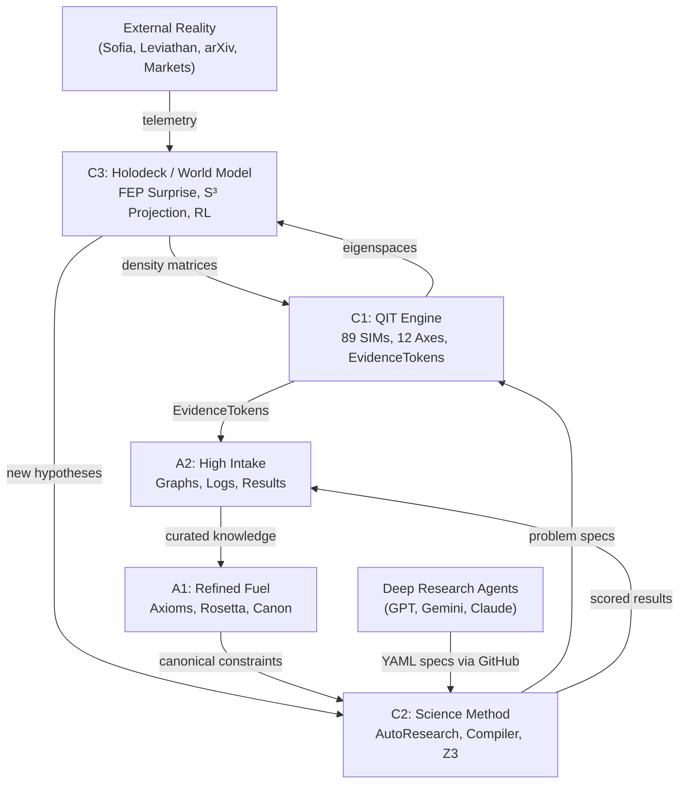

# Codex Ratchet: C-Layer Architecture Specification
**Version**: 1.0
**Status**: PROPOSED

---

## The Problem
The system has organically grown three distinct computational layers beyond the original A1/A2 knowledge architecture:

| Layer | What It Does | Current Location |
|---|---|---|
| **A1** (Refined Fuel) | Curated knowledge, axioms, strategy packets | `core_docs/a1_refined_*`, `system_v4/a1_state/` |
| **A2** (High Intake) | Raw ingestion, graphs, session logs, audit trails | `system_v4/a2_state/`, `core_docs/a2_feed_*` |
| **???** | QIT Engine, 89 SIMs, autoresearch, Holodeck, science method | `system_v4/probes/`, `system_v4/research/` |

The "???" layer is now larger than A1 and A2 combined. It needs formal naming and boundary contracts.

---

## Proposed C-Layer Architecture

```
┌─────────────────────────────────────────────────────────────┐
│                    C3: HOLODECK / WORLD MODEL                │
│   FEP Engine, S³ Projections, Leviathan/Sofia Bridge,       │
│   OpenClaw RL reward loops, live data ingestion              │
├─────────────────────────────────────────────────────────────┤
│                    C2: SCIENCE METHOD                        │
│   AutoResearch Harness, Problem DSL Compiler, Evidence       │
│   Graph Bridge, Deep Research Intake, Z3/SMT Constraints    │
├─────────────────────────────────────────────────────────────┤
│                    C1: QIT ENGINE (KERNEL)                   │
│   89 SIMs, CPTP Channels, Density Matrices, 12 Axes,       │
│   EvidenceTokens, Autopoietic Heartbeat (run_all_sims.py)  │
├─────────────────────────────────────────────────────────────┤
│                    A2: HIGH INTAKE                           │
│   Raw corpus, session logs, graphs, audit logs,             │
│   quarantine, graveyard, trust zones                        │
├─────────────────────────────────────────────────────────────┤
│                    A1: REFINED FUEL                          │
│   Curated axioms, AXES_MASTER_SPEC, Rosetta v2,            │
│   strategy packets, canonical operator definitions          │
└─────────────────────────────────────────────────────────────┘
```

### C1: QIT Engine (The Kernel)
**Purpose**: The mathematical ground truth. Finite density matrices, CPTP channels, 12 structural axes, and 89 falsifiable SIMs.

**Contents**:
- `system_v4/probes/` — All `*_sim.py`, `*_battery.py`, `*_suite.py` files
- `system_v4/probes/proto_ratchet_sim_runner.py` — Core QIT primitives
- `system_v4/probes/axis_orthogonality_suite.py` — Axis definitions (AXES dict)
- `system_v4/probes/run_all_sims.py` — The autopoietic heartbeat loop

**Contracts**:
- Every claim entering the system MUST pass through C1 as a falsifiable SIM
- C1 emits `EvidenceToken` objects (PASS/KILL with measured values)
- C1 NEVER imports from A1, A2, C2, or C3 (strict downward dependency)

### C2: Science Method (The Orchestrator)
**Purpose**: The research automation layer that turns hypotheses into executable SIMs, scores them, and routes results into the knowledge graph.

**Contents**:
- `system_v4/probes/autoresearch_sim_harness.py` — CEGIS evaluation loop
- `system_v4/research/compiler/compile_specs.py` — YAML → SIM config compiler
- `system_v4/research/problem_specs/` — YAML problem definitions
- `system_v4/probes/evidence_to_graph_bridge_sim.py` — Evidence → typed graph
- Future: Z3/SMT constraint solver integration
- Future: Karpathy-style deep research loops

**Contracts**:
- C2 calls C1 SIMs via subprocess (never imports C1 internals directly)
- C2 reads A1 axioms to validate problem specs against canonical constraints
- C2 writes scored results to A2 (`a2_state/sim_results/`)
- Deep Research agents push YAML specs to C2 via GitHub connector

### C3: Holodeck / World Model (The Bridge to Reality)
**Purpose**: The interface between the abstract QIT engine and observable reality. Translates real-world data into finite density matrices, and projects QIT eigenspaces into interpretable geometric coordinates.

**Contents**:
- `system_v4/probes/holodeck_fep_engine.py` — S³ Hopf projection + FEP surprise
- `core_docs/HOLODECK_SCIENCE_SYSTEM_v1.md` — Architectural spec
- Future: `leviathan_to_holodeck_bridge.py` — Live data → density matrix intake
- Future: OpenClaw RL reward engine (trains on C1 evidence scores)
- Future: Sofia robotics telemetry ingestion

**Contracts**:
- C3 consumes C1 density matrices and projects them to geometric spaces
- C3 feeds real-world observations back into C2 as new problem specs
- C3 writes `attractor_coordinates` metadata to A2 graph nodes
- C3 NEVER modifies C1 axioms or A1 canonical definitions

---

## Data Flow



## KILL Conditions for this Architecture
1. **C1 imports C3**: The kernel must never depend on the world model layer.
2. **A1 is mutated by C3**: Canonical axioms must only be updated through C1-verified evidence.
3. **C2 bypasses C1**: No hypothesis can be declared "solved" without a falsifiable SIM.
