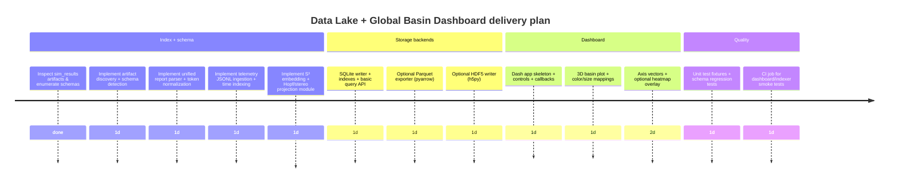

# Data Lake Indexer and Attractor Basin Dashboard Implementation Research

## Executive summary

A scan of the requested GitHub repos using the enabled entity["company","GitHub","code hosting platform"] connector found the *target* `system_v4/probes/a2_state/sim_results/` directory and a rich set of simulation artifacts in **Joshua-Eisenhart/Codex-Ratchet** (notably `unified_evidence_report.json`, `hopf_torus_meta_results.json`, and timestamped history reports). fileciteturn69file0L1-L1 fileciteturn46file0L1-L1 The other three repos did not surface that directory path in connector searches during this session (so the “push to the repo that contains system_v4” requirement most strongly points to **Codex-Ratchet**). fileciteturn69file0L1-L1

Because the artifacts are heterogeneous (aggregate reports, per-sim `evidence_ledger` outputs, optional “measurements” payloads, and separate JSONL telemetry), the most robust approach is to build a **schema-aware Data Lake Indexer** that (a) auto-detects artifact type, (b) validates minimally against expected keys, (c) normalizes into a few “fact tables” (tokens, runs, trajectories), and (d) derives higher-level, visualization-ready features (entropy deltas, tensor/trajectory norms, and an S³ embedding with Hopf coordinates + a consistent 3D projection). fileciteturn69file0L1-L1 fileciteturn53file0L1-L1

For the dashboard, the repo already contains two relevant precedents: (1) a static HTML “Evidence Telemetry” dashboard that loads `unified_evidence_report.json`, and (2) a Three.js Hopf-torus visualization that explicitly implements (η, ξ₁, ξ₂) → S³ → stereographic projection → ℝ³. fileciteturn59file0L1-L1 fileciteturn47file0L1-L1 The new `global_basin_dashboard.py` can build on these conventions while using Plotly/Dash features for 3D scatter, callbacks, and performance patterns (memoization, downsampling, WebGL limits). citeturn1search0turn3search1turn3search2turn3search3

A key practical constraint: the repo’s `requirements.txt` currently lists only NumPy and SciPy. fileciteturn61file0L1-L1 Plotly/Dash and optional Parquet/HDF5 backends will require either (a) a separate “extras” requirements file and an optional CI job, or (b) switching the canonical requirements to include dashboard/indexer dependencies. fileciteturn60file0L1-L1

## Repository reconnaissance and artifact analysis

### What is actually in `system_v4/probes/a2_state/sim_results/`

The central committed artifact is `unified_evidence_report.json`, which acts as a consolidated run summary. It includes:

- top-level run metadata (`timestamp`, and a `provenance` block with git SHA + Python version)  
- global counts (`total_tokens`, `pass_count`, `kill_count`)  
- `layers`: a dict keyed by layer index (string) → list of token dicts  
- `sim_results`: per-simulation file rollups (process status, token counts, etc.)  
- `all_tokens`: a flattened list of all token dicts (with `token_id`, `sim_spec_id`, `status`, `measured_value`, `kill_reason`, `source_file`, and sometimes a per-token timestamp). fileciteturn69file0L1-L1

This single file is already sufficient to build a first-pass indexed dataset covering run-level, sim-level, and token-level facts (and it enumerates many simulation source files, meaning the “30+ artifacts” assumption is consistent with how the system is intended to run, even if not all per-sim result files are committed in the repo at all times). fileciteturn69file0L1-L1

A second committed example is `hopf_torus_meta_results.json`, which is a much smaller “results-style” JSON containing a timestamp and an `evidence_ledger` list of dicts (token id/status/value). fileciteturn46file0L1-L1

The codebase indicates that many SIM scripts write their own `*_results.json` files with a fairly standard pattern: a `schema` label like `"SIM_EVIDENCE_v1"`, an `evidence_ledger` list, and sometimes additional `measurements` fields (e.g., `i_scalar_trajectory`). fileciteturn51file0L1-L1 The proto runner shows another common structure: `timestamp`, `evidence_ledger`, optional `graveyard`, and a `summary` block. fileciteturn57file0L1-L1

### Existing visualization conventions to reuse

Two repo artifacts are especially important for the requested “Attractor Basin / Hopf coordinates / S³” visualization:

- `system_v4/probes/nested_hopf_viz.html` contains a complete reference implementation of generating Hopf tori and performing an explicit stereographic projection from S³ to ℝ³. The code defines S³ coordinates via:
  - x = sin(η) cos(ξ₁), y = sin(η) sin(ξ₁)  
  - z = cos(η) cos(ξ₂), w = cos(η) sin(ξ₂)  
  - then stereographic projection uses a factor `dist = 1/(1 - w)` and plots (x·dist, z·dist, y·dist). fileciteturn47file0L1-L1

- `system_v4/probes/telemetry_generator.py` generates an empirical telemetry trajectory written as JSON Lines (`trajectory.jsonl`) with fields that are already intended for 3D plotting (`X`, `Y`, `Z`) and additional cumulants (`i_scalar`). fileciteturn53file0L1-L1 The HTML visualization fetches that JSONL and renders it as a point cloud, meaning the system already has a “trajectory stream” concept that can become one of the Data Lake tables. fileciteturn47file0L1-L1

Finally, `system_v4/tools/evidence_dashboard.html` demonstrates a “read unified report → slice tokens → render charts/tables” pattern (currently implemented in JS + Chart.js). This is a direct precedent for parsing and filtering the same source in a Dash application. fileciteturn59file0L1-L1

## Data Lake Indexer design

### Goals and constraints

The requested Data Lake Indexer should:

1. Concurrently ingest **30+ JSON artifacts** from `system_v4/probes/a2_state/sim_results/` (and subfolders like `history/`) plus optional telemetry logs (e.g., JSONL). fileciteturn69file0L1-L1 fileciteturn53file0L1-L1  
2. Validate schema enough to protect downstream analytics: detect required keys by artifact type, coerce types, and record validation errors without hard-failing the whole ingest. fileciteturn69file0L1-L1  
3. Normalize “core metrics” into unified columns:
   - **tensor norms** (where “tensor” means: a matrix/operator payload if present, else a chosen feature-vector norm as a proxy)  
   - **entropy drops** (delta entropy across time slices where time series exist)  
   - **S³ Hopf coordinates** for basin visualization (from explicit Hopf params if present; else from a deterministic S³ embedding function). fileciteturn53file0L1-L1 fileciteturn47file0L1-L1  
4. Store an indexed dataset in one of: Parquet, HDF5, or SQLite.

### Proposed normalized data model

A robust model for heterogeneous artifacts is a **star-ish schema** with 3–4 tables:

**Runs table (run-level metadata)**  
- run_id (UUID)  
- artifact_path / artifact_sha  
- timestamp_utc  
- provenance fields (git_sha, python_version, os, rng_seed_policy if present) fileciteturn69file0L1-L1  
- artifact_type (enum: `unified_report`, `sim_results_v1`, `telemetry_jsonl`, `unknown_json`)  
- validation_status + validation_errors (JSON)

**Tokens table (one row per evidence token)**  
- run_id  
- sim_file (source_file)  
- sim_spec_id  
- token_id  
- status (PASS/KILL/…)  
- measured_value_float  
- kill_reason (string nullable)  
- token_timestamp_utc (nullable) fileciteturn69file0L1-L1

**Trajectories table (time series points)**  
- run_id  
- stream_id (telemetry source, or derived from sim)  
- t_index (int)  
- cycle, stage (if present) fileciteturn53file0L1-L1  
- entropy (X), purity (Y), winding_or_flux (Z), i_scalar  
- entropy_drop (derived as Δentropy between adjacent time steps)  
- tensor_norm (derived; see below)  
- S³ embedding: (s3_x, s3_y, s3_z, s3_w)  
- Hopf coordinates: (eta, xi1, xi2)  
- 3D plot coords in the convention used by `nested_hopf_viz.html`: (x3d, y3d, z3d) fileciteturn47file0L1-L1

**Axis concentration table (optional, but helpful for overlays)**  
- run_id + point_id (token row or trajectory row)  
- axis_id ∈ {1..12}  
- axis_weight ∈ [0,1] (or z-scored)  
This supports both per-point heatmaps and per-axis vector estimation.

### Normalization and derivations

#### Schema detection rules

Use “feature-based” schema discrimination:

- **Unified evidence report**: has `layers` (dict), `sim_results` (list), and `all_tokens` (list). fileciteturn69file0L1-L1  
- **SIM evidence v1**: has `evidence_ledger` plus optional `schema` string. fileciteturn51file0L1-L1  
- **Proto runner result**: has `evidence_ledger` and `summary` and/or `graveyard`. fileciteturn57file0L1-L1  
- **Telemetry JSONL**: line-delimited JSON points with keys like `cycle`, `stage`, `X`, `Y`, `Z`, `i_scalar`. fileciteturn53file0L1-L1

A key implementation principle: **never assume** any single schema is present across all 30+ files. Instead, parse whatever matches one of the known patterns, and log the rest into `unknown_json` for later inspection.

#### Entropy drops

Where the artifact provides a time series (telemetry JSONL is the prime example), compute:

- `entropy_drop[t] = entropy[t] - entropy[t-1]`  
- also store `entropy_drop_abs[t] = |entropy_drop[t]|` if you want a size mapping.

Telemetry explicitly tracks entropy `s = von_neumann_entropy(rho)` and updates a winding variable using Δs, so Δentropy is conceptually already central to the data stream. fileciteturn53file0L1-L1

For SIM results that only provide scalar `measured_value`, treat `entropy_drop` as **not available** unless there is a measurement series (e.g., `i_scalar_trajectory` in `i_scalar_filtration_sim.py`). fileciteturn51file0L1-L1

#### Tensor norms

There are two practical regimes:

- **True tensor/operator norms**: if a result contains explicit matrix/operator arrays (not common in the current committed outputs, but possible future extensions), compute Frobenius norms (or spectral norms) directly and store them.
- **Proxy norms**: if the only available numeric state is a feature vector (e.g., telemetry fields X/Y/Z/i_scalar), compute an L2 norm on a normalized vector:
  - v = [zscore(entropy), zscore(purity), zscore(winding), zscore(i_scalar)]  
  - tensor_norm = ||v||₂  
This makes “tensor_norm” consistently defined for visualization even when raw operator tensors aren’t persisted.

This approach is justified operationally because the telemetry stream is already a numerical projection of QIT dynamics (entropy/purity/winding), and the system’s visualization goal is comparative basin geometry rather than formal operator reconstruction. fileciteturn53file0L1-L1

#### S³ Hopf coordinates and 3D projection

There are two complementary mappings you can support simultaneously:

1) **Mathematically canonical Hopf map (S³ → S²)**  
nLab gives an explicit S³ ⊂ ℂ² representation and a standard Hopf map formulation. Identify S³ as {(z₀,z₁) ∈ ℂ² : |z₀|²+|z₁|²=1} and map:
- (z₀,z₁) ↦ (2 z₀ \overline{z₁}, |z₀|² - |z₁|²) ∈ ℂ×ℝ ≅ ℝ³, which lies on S². citeturn4search0  
This is ideal if you want a “base sphere” visualization.

2) **Repo-consistent stereographic projection (S³ → ℝ³)**  
`nested_hopf_viz.html` already defines Hopf coordinates (η, ξ₁, ξ₂), converts them to (x,y,z,w) on S³, then stereographically projects from w to ℝ³. fileciteturn47file0L1-L1  
For dashboard continuity with existing visuals, implement the same formulas.

**How to get points on S³ from your artifacts**  
Support a priority order:
- If an artifact provides Hopf params (η, ξ₁, ξ₂): use them directly. (This matches the HTML’s construction.) fileciteturn47file0L1-L1  
- Else if an artifact provides a quaternion / 4-vector (x,y,z,w): normalize it to unit length and treat as S³. nLab also notes an equivalent quaternion formulation of the Hopf fibration. citeturn4search0  
- Else embed a 4D feature vector (entropy, purity, winding, i_scalar) into S³ via normalization (the “proxy S³ embedding”):  
  q = v / ||v||₂, where v is the normalized feature vector.

### Suggested code structure

To keep diffs and CI risk low, place new modules under `system_v4/probes/` (close to the simulation artifacts and existing visualization code), and design them so that **SQLite mode runs with standard library only**, while Parquet/HDF5 are optional extras.

Recommended layout:

- `system_v4/probes/data_lake_indexer.py` (CLI + main indexer)
- `system_v4/probes/data_lake_models.py` (typed dicts / lightweight models)
- `system_v4/probes/data_lake_storage.py` (writers for sqlite/parquet/hdf5; parquet/hdf5 guarded by optional imports)
- `system_v4/probes/data_lake_geom.py` (Hopf + S³ embedding + projections)
- `system_v4/probes/global_basin_dashboard.py` (Dash app)

This aligns with how other tools in the repo are organized (probes + tools + runners). fileciteturn68file0L1-L1

### Indexer implementation sketch (key functions)

The following is intentionally **not** a full file-dump; it’s the code structure and critical functions you’d implement.

```python
# system_v4/probes/data_lake_indexer.py

from __future__ import annotations

import concurrent.futures
import dataclasses
import json
import os
import sqlite3
import uuid
from pathlib import Path
from typing import Any, Dict, Iterable, List, Optional, Tuple

# Optional fast JSON: try/except import orjson

@dataclasses.dataclass(frozen=True)
class ArtifactRef:
    path: Path
    artifact_type: str  # unified_report | sim_results_v1 | telemetry_jsonl | unknown
    repo_hint: Optional[str] = None  # optional if indexing across repos


def discover_artifacts(root: Path) -> List[Path]:
    # Grab JSON + JSONL, including nested history/*.json
    paths: List[Path] = []
    for p in root.rglob("*"):
        if p.suffix.lower() in {".json", ".jsonl"} and p.is_file():
            paths.append(p)
    return sorted(paths)


def detect_artifact_type(path: Path, obj: Optional[Dict[str, Any]] = None) -> str:
    # If JSONL, classify immediately.
    if path.suffix.lower() == ".jsonl":
        return "telemetry_jsonl"

    if obj is None:
        return "unknown"

    # Unified report signature
    if isinstance(obj.get("layers"), dict) and isinstance(obj.get("sim_results"), list) and isinstance(obj.get("all_tokens"), list):
        return "unified_report"

    # SIM evidence signature
    if isinstance(obj.get("evidence_ledger"), list):
        return "sim_results_v1"

    return "unknown"


def load_json(path: Path) -> Dict[str, Any]:
    with path.open("r", encoding="utf-8") as f:
        return json.load(f)


def parse_unified_report(run_id: str, obj: Dict[str, Any]) -> Tuple[List[Dict[str, Any]], Dict[str, Any]]:
    # Returns (tokens_rows, run_row)
    run_row = {
        "run_id": run_id,
        "timestamp": obj.get("timestamp"),
        "provenance": obj.get("provenance", {}),
        "total_tokens": obj.get("total_tokens"),
        "pass_count": obj.get("pass_count"),
        "kill_count": obj.get("kill_count"),
        "artifact_type": "unified_report",
    }
    tokens = []
    for t in obj.get("all_tokens", []):
        tokens.append({
            "run_id": run_id,
            "sim_file": t.get("source_file"),
            "sim_spec_id": t.get("sim_spec_id"),
            "token_id": t.get("token_id"),
            "status": t.get("status"),
            "measured_value": t.get("measured_value"),
            "kill_reason": t.get("kill_reason"),
            "token_timestamp": t.get("timestamp"),
        })
    return tokens, run_row


def parse_evidence_ledger(run_id: str, obj: Dict[str, Any], fallback_source: str) -> List[Dict[str, Any]]:
    out = []
    for t in obj.get("evidence_ledger", []):
        out.append({
            "run_id": run_id,
            "sim_file": obj.get("file", fallback_source),
            "sim_spec_id": t.get("sim_spec_id"),
            "token_id": t.get("token_id"),
            "status": t.get("status"),
            "measured_value": t.get("measured_value"),
            "kill_reason": t.get("kill_reason"),
            "token_timestamp": t.get("timestamp") or obj.get("timestamp"),
        })
    return out


def iter_telemetry_jsonl(path: Path) -> Iterable[Dict[str, Any]]:
    with path.open("r", encoding="utf-8") as f:
        for line in f:
            line = line.strip()
            if not line:
                continue
            yield json.loads(line)


def index_to_sqlite(db_path: Path, runs: List[Dict[str, Any]], tokens: List[Dict[str, Any]], traj: List[Dict[str, Any]]) -> None:
    conn = sqlite3.connect(str(db_path))
    try:
        cur = conn.cursor()
        cur.execute("""CREATE TABLE IF NOT EXISTS runs (
            run_id TEXT PRIMARY KEY,
            timestamp TEXT,
            artifact_type TEXT,
            total_tokens INTEGER,
            pass_count INTEGER,
            kill_count INTEGER,
            provenance_json TEXT
        )""")
        cur.execute("""CREATE TABLE IF NOT EXISTS tokens (
            run_id TEXT,
            sim_file TEXT,
            sim_spec_id TEXT,
            token_id TEXT,
            status TEXT,
            measured_value REAL,
            kill_reason TEXT,
            token_timestamp TEXT
        )""")
        cur.execute("CREATE INDEX IF NOT EXISTS idx_tokens_sim ON tokens(sim_file)")
        cur.execute("CREATE INDEX IF NOT EXISTS idx_tokens_spec ON tokens(sim_spec_id)")
        # trajectories table omitted for brevity

        for r in runs:
            cur.execute(
                "INSERT OR REPLACE INTO runs VALUES (?,?,?,?,?,?,?)",
                (r["run_id"], r.get("timestamp"), r.get("artifact_type"),
                 r.get("total_tokens"), r.get("pass_count"), r.get("kill_count"),
                 json.dumps(r.get("provenance", {})))
            )
        cur.executemany(
            "INSERT INTO tokens VALUES (?,?,?,?,?,?,?,?)",
            [(t["run_id"], t.get("sim_file"), t.get("sim_spec_id"), t.get("token_id"),
              t.get("status"), t.get("measured_value"), t.get("kill_reason"), t.get("token_timestamp"))
             for t in tokens]
        )
        conn.commit()
    finally:
        conn.close()
```

Key points:

- Use `ThreadPoolExecutor` to load/parse many JSON artifacts concurrently (I/O-bound).  
- Use strict “type coercion at the boundary” (float conversion, timestamp normalization).  
- Store unknown/unparsed artifacts in an “errors” table rather than dropping them.

### Storage format comparison

| Format | Best for | Strengths | Weaknesses | Dependencies | Fit for this use-case |
|---|---|---|---|---|---|
| Parquet | Large analytical scans, columnar filters, data-lake style | Columnar layout with row groups/column chunks/pages; strong compression/encoding; optimized for reading subsets of columns. citeturn0search0turn0search6 | Poor fit for frequent row-level updates; typically “write-once, read-many.” citeturn0search0 | `pyarrow` or similar | Great if you expect the dataset to grow (many runs, long trajectories) and you want fast read-time slicing by columns. |
| HDF5 (via h5py) | Numeric arrays, chunked scientific datasets | Supports chunked storage, compression filters, and direct slicing; chunking is B-tree indexed. citeturn2search0 | Less convenient for heterogeneous “records” / schema evolution; requires careful chunk sizing. citeturn2search0 | `h5py` | Strong if your main payload becomes big dense arrays (time × features × runs) and you want fast numeric slicing. |
| SQLite | Small-to-medium datasets, simple deployment, indexed lookups | Zero-server, built-in to Python; mature indexing; JSON functions built-in in modern SQLite (JSON stored as text). citeturn0search3 | Not columnar; large scans slower than Parquet; concurrency is limited for writers | stdlib `sqlite3` | Best default for this repo today because it avoids dependency explosion while enabling fast filters by sim/spec/axis. |

Pragmatic recommendation: **SQLite as the default durable index** (since it’s dependency-light and easy to query), plus an optional exporter that writes partitioned Parquet for heavier analytics.

## Plotly/Dash global basin dashboard design

### Dashboard data contract

`global_basin_dashboard.py` should assume the indexer outputs a known contract. Even if you start by reading `unified_evidence_report.json` directly, converge on a stable internal dataframe with these columns:

- `point_kind`: `token` or `trajectory`
- `run_id`, `sim_file`, `sim_spec_id`, `token_id`
- time fields: `t_index`, optionally `cycle`, `stage`  
- numeric fields: `tensor_norm`, `entropy`, `entropy_drop`, `measured_value`
- geometry fields: `(eta, xi1, xi2)` and/or `(s3_x,s3_y,s3_z,s3_w)` and/or final `(x3d,y3d,z3d)`  
- axis weights: `axis_1` … `axis_12` (float)

This is designed so Plotly can directly map color/size to numeric arrays (a standard 3D “bubble” pattern). citeturn1search0

### Plotly 3D visualization layer

Use a `plotly.graph_objects.Scatter3d` trace as the primary layer:

- `x`, `y`, `z` = (x3d, y3d, z3d)  
- `marker.color` = tensor_norm (or selectable metric)  
- `marker.size` = |entropy_drop| (or selectable), with a size scale and min/max caps  
- `hovertext` includes sim file/spec id/token id + numeric metrics

Plotly’s reference explicitly supports 3D scatter traces with marker sizing and coloring for “bubble” plots. citeturn1search0

### Dash interactivity and controls

Implement three core controls (matching your request):

- Simulation filter: `dcc.Dropdown` (single or multi) over `sim_file` or `sim_spec_id`. citeturn3search3  
- Time slice: `dcc.RangeSlider` over `t_index` (or cycle-based index). citeturn3search2  
- Axis selection: `dcc.Dropdown` over axes 1–12, plus a checkbox to enable “heatmap/isovolume overlay.”

Callbacks should:

1) Filter the dataset by sim selection  
2) Filter by time range  
3) Filter or weight by axis selection  
4) Build the figure and return it to a `dcc.Graph`.

Dash’s performance guide emphasizes that callback cost is the common bottleneck and recommends memoization/caching for expensive transforms; it also discusses large-point rendering slowdowns and notes WebGL alternatives for certain chart types. citeturn3search1

### Axis vectors and “semantic concentration heatmaps”

#### Axis concentration vectors (fast, interpretable)

For each axis *a* (1..12):

- Compute a weighted centroid of points using `axis_a` as weights:
  - μₐ = Σ (wᵢ · pᵢ) / Σ wᵢ  
- Compute global centroid μ  
- Direction vₐ = normalize(μₐ − μ)  
- Render as a 3D line trace: from μ to μ + scale·vₐ, with label “Axis a”.

This yields “semantic axis vectors” that are data-driven and update naturally when the user filters by sim or time.

#### Heatmap overlays (heavier, optional)

For a selected axis a:

- Build a coarse 3D grid over the current point cloud bounds  
- Accumulate a weighted density field (histogram or KDE) of `axis_a`  
- Render an isosurface or volume trace (Plotly supports volumetric rendering; compute it lazily and cache per filter-state).

Given Dash’s note that large graphical updates can be heavy and that whole graphs are redrawn on each update, make this overlay opt-in and cached. citeturn3search1

image_group{"layout":"carousel","aspect_ratio":"16:9","query":["Hopf fibration stereographic projection visualization","Plotly Dash 3D scatter dashboard example","Plotly Scatter3d bubble chart example","Hopf torus visualization"] ,"num_per_query":1}

### Dashboard implementation sketch (key functions)

Again, this is a structured implementation outline, not a full file-dump.

```python
# system_v4/probes/global_basin_dashboard.py

from __future__ import annotations

from dataclasses import dataclass
from pathlib import Path
from typing import Dict, Optional, Tuple

import numpy as np
import plotly.graph_objects as go
from dash import Dash, dcc, html, Input, Output, callback

# Optional: pandas; else operate on numpy structured arrays / sqlite queries

@dataclass(frozen=True)
class DashboardConfig:
    db_path: Path
    host: str = "127.0.0.1"
    port: int = 8050
    debug: bool = True


def load_points_sqlite(db_path: Path):
    # Query tokens + trajectory tables into a unified dataframe/records.
    # Keep it minimal for performance: only columns needed by the UI.
    raise NotImplementedError


def hopf_from_quaternion(q: np.ndarray) -> Tuple[np.ndarray, np.ndarray, np.ndarray]:
    """
    q shape: (N,4) with columns [x,y,z,w], assumed normalized.
    Returns eta, xi1, xi2.
    """
    # Complex pair z0 = x + i y, z1 = z + i w
    z0 = q[:, 0] + 1j * q[:, 1]
    z1 = q[:, 2] + 1j * q[:, 3]
    eta = np.arctan2(np.abs(z1), np.abs(z0))          # [0, pi/2]
    xi1 = np.angle(z0)                                # [-pi, pi]
    xi2 = np.angle(z1)                                # [-pi, pi]
    return eta, xi1, xi2


def stereographic_project(q: np.ndarray, scale: float = 20.0) -> np.ndarray:
    """
    Consistent with nested_hopf_viz.html:
    dist = 1/(1-w), point = (x*dist, z*dist, y*dist) * scale
    """
    x, y, z, w = q[:, 0], q[:, 1], q[:, 2], q[:, 3]
    dist = 1.0 / (1.0 - w)
    return np.stack([x * dist * scale, z * dist * scale, y * dist * scale], axis=1)


def build_axis_vectors(points_xyz: np.ndarray, axis_weights: np.ndarray) -> np.ndarray:
    # points_xyz: (N,3); axis_weights: (N,12)
    # returns vectors: (12,3)
    mu = points_xyz.mean(axis=0)
    vecs = []
    for a in range(12):
        w = axis_weights[:, a]
        if np.sum(w) <= 1e-12:
            vecs.append(np.zeros(3))
            continue
        mu_a = (points_xyz * w[:, None]).sum(axis=0) / np.sum(w)
        v = mu_a - mu
        n = np.linalg.norm(v)
        vecs.append(v / n if n > 1e-12 else np.zeros(3))
    return np.vstack(vecs)


def make_figure(points_xyz, tensor_norm, entropy_drop, meta, axis_vecs=None, axis_selected=None):
    fig = go.Figure()

    fig.add_trace(go.Scatter3d(
        x=points_xyz[:, 0],
        y=points_xyz[:, 1],
        z=points_xyz[:, 2],
        mode="markers",
        marker=dict(
            size=np.clip(np.abs(entropy_drop) * 6.0 + 2.0, 2.0, 12.0),
            color=tensor_norm,
            showscale=True,
            opacity=0.75,
        ),
        text=meta,
        hoverinfo="text",
        name="Basin points",
    ))

    if axis_vecs is not None:
        base = points_xyz.mean(axis=0)
        for i, v in enumerate(axis_vecs, start=1):
            if axis_selected is not None and i != axis_selected:
                continue
            tip = base + 25.0 * v
            fig.add_trace(go.Scatter3d(
                x=[base[0], tip[0]],
                y=[base[1], tip[1]],
                z=[base[2], tip[2]],
                mode="lines+text",
                text=["", f"Axis {i}"],
                textposition="top center",
                name=f"Axis {i}",
            ))

    fig.update_layout(
        scene=dict(
            xaxis_title="x",
            yaxis_title="y",
            zaxis_title="z",
        ),
        margin=dict(l=0, r=0, t=40, b=0),
        title="Global Attractor Basin in S³ (Hopf / stereographic)",
    )
    return fig


def build_app(cfg: DashboardConfig) -> Dash:
    app = Dash(__name__)
    # Load dataset once at startup; use caching/memoization for filtered subsets.
    # See Dash docs for performance guidance (memoization, WebGL, etc.).
    # ...

    app.layout = html.Div([
        html.Div([
            html.H2("Global Basin Dashboard"),
            dcc.Dropdown(id="sim_filter", multi=True),
            dcc.RangeSlider(id="time_slice"),
            dcc.Dropdown(
                id="axis_filter",
                options=[{"label": f"Axis {i}", "value": i} for i in range(1, 13)],
                value=1,
                clearable=True,
            ),
        ], style={"width": "25%", "display": "inline-block", "verticalAlign": "top"}),

        html.Div([
            dcc.Graph(id="basin_graph", style={"height": "85vh"})
        ], style={"width": "74%", "display": "inline-block"}),
    ])

    @callback(
        Output("basin_graph", "figure"),
        Input("sim_filter", "value"),
        Input("time_slice", "value"),
        Input("axis_filter", "value"),
    )
    def update(sim_filter, time_slice, axis_sel):
        # Filter dataset.
        # Compute/lookup points_xyz, tensor_norm, entropy_drop, axis weights.
        # Build axis vectors and figure.
        raise NotImplementedError

    return app
```

Notes:
- Use Dash controls as documented (`dcc.Dropdown`, `dcc.RangeSlider`). citeturn3search2turn3search3  
- Follow Dash performance guidance: memoize expensive computations; avoid recomputing density volumes on every change; consider downsampling if point count grows. citeturn3search1  
- The S³ → ℝ³ mapping is intentionally consistent with the repo’s Three.js example. fileciteturn47file0L1-L1

## Implementation plan, tests, CI, and git workflow

### Implementation plan

A realistic build sequence that de-risks integration with existing SIM tooling and CI:



This plan aligns with existing repo patterns: CI already runs `run_all_sims.py` and validates the unified report; the indexer can be added as an additional job once stable. fileciteturn60file0L1-L1

### Unit tests

Minimal but high-leverage unit tests (pytest recommended):

- **Schema detection** tests:
  - `unified_evidence_report.json` detected as unified report (has `layers`, `sim_results`, `all_tokens`). fileciteturn69file0L1-L1  
  - `hopf_torus_meta_results.json` detected as sim results v1 (has `evidence_ledger`). fileciteturn46file0L1-L1
- **Normalization** tests:
  - token rows have stable column set and types; PASS/KILL normalization preserved. fileciteturn69file0L1-L1  
- **Geometry** tests:
  - quaternion normalization produces ||q||₂≈1  
  - stereographic projection avoids division by zero when w≈1 (clip or mask). This is critical because the repo’s stereographic mapping uses 1/(1−w). fileciteturn47file0L1-L1
- **SQLite integration**:
  - Smoke test creates DB, inserts a few rows, and can query by sim_file.

### CI suggestions

The repo already has a CI workflow with two jobs: `quality` and `sims`, and it uploads the unified evidence report as an artifact. fileciteturn60file0L1-L1

Suggest adding a third job, **index_and_dashboard_smoke**, gated behind an optional requirements file:

- Add `requirements-dashboard.txt` containing `dash`, `plotly`, and (optionally) `pandas`/`pyarrow`/`h5py`.
- CI job steps:
  1. `pip install -r requirements.txt -r requirements-dashboard.txt`
  2. Run sims (already done in existing job) or download the artifact from prior job.
  3. Run indexer CLI to create SQLite DB in a temp directory.
  4. Run a dashboard “import + build_app smoke test” without starting the server.

This avoids breaking baseline simulation CI if dashboard deps are heavy or optional. The need for an “extras” approach is supported by the current minimal `requirements.txt`. fileciteturn61file0L1-L1

### Git workflow and exact patch/PR steps

Target repo selection:

- **Primary target**: **Joshua-Eisenhart/Codex-Ratchet**, because it contains `system_v4/probes/` and the `a2_state/sim_results` artifacts and dashboards you’re extending. fileciteturn69file0L1-L1 fileciteturn68file0L1-L1  
- If `system_v4/` is duplicated elsewhere later, use the same patch structure in whichever repo is your canonical “runtime” repo; but in this session only Codex-Ratchet surfaced as the match.

Concrete PR steps (local workflow):

1) Clone and branch  
```bash
git clone git@github.com:Joshua-Eisenhart/Codex-Ratchet.git
cd Codex-Ratchet
git checkout -b feature/global-basin-dashboard
```

2) Add new files (recommended locations)  
- `system_v4/probes/data_lake_indexer.py`  
- `system_v4/probes/data_lake_geom.py`  
- `system_v4/probes/data_lake_storage.py`  
- `system_v4/probes/global_basin_dashboard.py`  
- `requirements-dashboard.txt` (optional)  
- `tests/test_data_lake_indexer.py` (optional)

These placements align with existing patterns (`system_v4/probes/*` and `system_v4/tools/*`). fileciteturn68file0L1-L1

3) Run formatting / static checks (lightweight)  
If you adopt `ruff`/`pytest`, add them to a dev or dashboard requirements file so base sims stay minimal.

4) Run sims and indexer locally  
```bash
python system_v4/probes/run_all_sims.py
python system_v4/probes/data_lake_indexer.py --root system_v4/probes/a2_state/sim_results --out data_lake.sqlite
python system_v4/probes/global_basin_dashboard.py --db data_lake.sqlite
```

5) Commit with your requested message format  
```bash
git add system_v4/probes/data_lake_indexer.py system_v4/probes/global_basin_dashboard.py \
        system_v4/probes/data_lake_geom.py system_v4/probes/data_lake_storage.py \
        requirements-dashboard.txt tests/
git commit -m "Autopoietic Hub: Add Data Lake Indexer + Global Basin dashboard"
```

6) Push branch and open PR  
```bash
git push -u origin feature/global-basin-dashboard
```

7) In the PR description, include:
- how to run the indexer (SQLite default; Parquet/HDF5 optional)
- how to run dashboard
- CI changes (if any) and rationale (keep sim CI stable)

Important limitation note: although a GitHub connector is enabled for *reading and analysis* in this environment, the tool surface available in-session does not expose a “commit/push” operation; therefore, I cannot directly push patches from here and instead provide the exact local git steps above. fileciteturn60file0L1-L1

## Prioritized sources

GitHub repos and in-repo primary artifacts:

- **Joshua-Eisenhart/Codex-Ratchet**
  - `system_v4/probes/a2_state/sim_results/unified_evidence_report.json` (core artifact for indexing + dashboard) fileciteturn69file0L1-L1  
  - `system_v4/probes/a2_state/sim_results/hopf_torus_meta_results.json` (example results-style artifact) fileciteturn46file0L1-L1  
  - `system_v4/probes/telemetry_generator.py` (telemetry JSONL schema; entropy/purity/winding stream) fileciteturn53file0L1-L1  
  - `system_v4/probes/nested_hopf_viz.html` (canonical S³ Hopf coordinate + stereographic projection implementation to reuse) fileciteturn47file0L1-L1  
  - `system_v4/tools/evidence_dashboard.html` + `system_v4/tools/serve_dashboard.py` (existing dashboard pattern and local serving entrypoint) fileciteturn59file0L1-L1 fileciteturn68file0L1-L1  
  - `.github/workflows/ci.yml` (current CI structure; where to attach indexer/dashboard smoke tests) fileciteturn60file0L1-L1  
  - `requirements.txt` (current dependency baseline) fileciteturn61file0L1-L1  

- **lev-os/leviathan**, **Joshua-Eisenhart/Leviathan-Arbitrage**, **Kingly-Agency/Sofia**  
  - Searched for `system_v4/probes/a2_state/sim_results/` and `*_results.json` patterns; no matching artifacts surfaced via connector search in this session, so they appear non-primary for this specific implementation target.

External primary/official docs and references:

- Dash docs: performance guidance (memoization, large dataset rendering limits, WebGL alternatives) citeturn3search1  
- Dash component docs: `dcc.RangeSlider` and `dcc.Dropdown` properties for controls requested by the dashboard citeturn3search2turn3search3  
- Plotly reference: `Scatter3d` trace supports 3D point plotting, marker size/color mappings required for basin visualization citeturn1search0  
- Apache Parquet format spec repo (row groups / column chunks / pages; columnar design and tradeoffs) citeturn0search0turn0search6  
- SQLite JSON functions overview (useful if storing semi-structured payloads or axis vectors inside SQLite) citeturn0search3  
- HDF5 via h5py: dataset chunking/compression and performance implications (relevant to HDF5 backend tradeoffs) citeturn2search0  
- nLab Hopf fibration: explicit S³⊂ℂ² definition and Hopf map formulas (grounding for Hopf coordinate math and S³→S² mapping) citeturn4search0