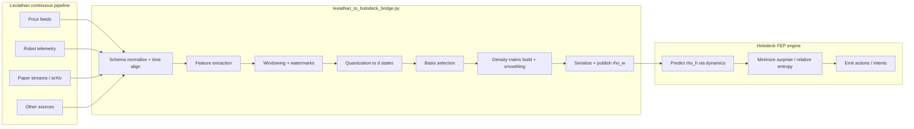
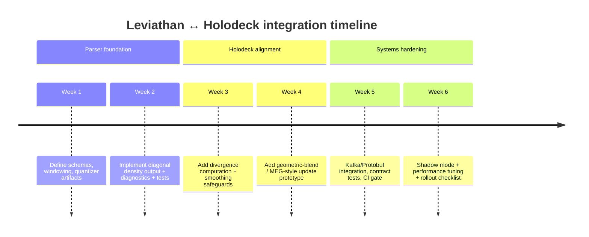

# Merging Leviathan Continuous Pipelines with a Holodeck FEP Density-Matrix Engine

## Executive summary

This report specifies an end-to-end merge design that turns Leviathan’s continuous, heterogeneous, high-frequency inputs (market data, robotic telemetry, research/paper streams, and other sources) into a **finite, discrete “observable world” density matrix** and then couples that output to a Holodeck-style **Free Energy Principle (FEP)** update loop that **minimizes surprise** via a KL-like divergence between density matrices (the **Umegaki quantum relative entropy**). citeturn0search13turn1search1turn1search2turn3search2turn0search0

The key architectural idea is to choose a single shared mathematical interface:

- Leviathan emits, at each discrete update step \(k\), a **world belief state** \(\rho^{(w)}_k \in \mathbb{C}^{d\times d}\) (PSD, trace 1), optionally with a **measurement channel** (noise model) \(\mathcal{N}_k\) and quality metadata. citeturn0search13turn1search9turn0search9  
- Holodeck maintains an **internal belief state** \(\rho^{(h)}_k\) in the same space and updates it by descending a **variational free-energy / surprise proxy** built from a quantum KL divergence \(S(\rho^{(w)}_k\|\rho^{(h)}_k)\) plus regularizers and temporal/dynamical constraints. citeturn0search0turn3search2turn1search9turn1search2

Because “KL divergence between density matrices” is not unique, the recommended default is **quantum relative entropy** \(S(\rho\|\sigma)=\mathrm{Tr}[\rho(\log\rho-\log\sigma)]\), introduced by entity["people","Hisaharu Umegaki","mathematician; qre 1962"] and foundational in QIT, with monotonicity under CPTP maps proved by entity["people","Göran Lindblad","physicist; qre monotonicity"]. citeturn1search1turn1search9turn1search2turn1search26

Deliverables in this report:

- A detailed intake parser design that performs preprocessing, synchronization, feature extraction, windowing, quantization, basis choice, density-matrix construction, normalization, and uncertainty/noise encoding. citeturn0search3turn4search4turn5search0turn0search13turn0search9  
- A Holodeck FEP architecture with explicit objectives, update rules (including matrix-exponentiated/mirror-descent style updates that preserve PSD/trace constraints), complexity bounds, and stability guidance. citeturn0search0turn3search2turn1search3turn3search0turn3search1  
- A concrete Python bridge file plan (and a full-file reference implementation) for `leviathan_to_holodeck_bridge.py`, including API surface, message formats, serialization, unit testing strategy, and CI/commit sequencing. citeturn5search2turn5search3turn6search2turn6search0

## System assumptions and shared mathematical interface

### Assumptions (explicit where user spec is underspecified)

Unless your existing Leviathan/Holodeck codebases dictate otherwise, this design assumes:

- **Ingestion rates (order-of-magnitude):**  
  - Market/price feeds: 1–50 kHz event rate per venue/asset (ticks/trades/quotes), with burstiness and microstructure noise. citeturn4search4turn4search32  
  - Robotics telemetry: 50–1000 Hz per sensor stream (IMU, joint states, pose). QoS/delivery may be best-effort for high-rate sensors. citeturn5search0turn5search1  
  - Paper streams: minutes-to-hours cadence for metadata; bulk updates daily for OAI-PMH; arXiv API rate limits for “legacy APIs” are effectively **one request every three seconds** per Terms of Use. citeturn6search2turn6search3turn6search0
- **Update cadence (discretization):** The intake parser produces one world density matrix every \(\Delta\) seconds (default \(\Delta=0.25\) s for “fast mode”, \(\Delta=1\) s for “stable mode”). The value of \(\Delta\) is a design lever balancing latency vs. estimator variance. High-frequency econometrics explicitly warns that the choice of sampling scheme and discretization interacts with microstructure noise and asynchronous trading. citeturn4search4turn4search39turn4search32  
- **Dimensionality constraint:** The observable Hilbert space dimension \(d\) is capped (default \(d=64\) or \(d=256\)). Full eigen-decompositions and matrix log/exp are \(O(d^3)\), so pushing \(d\) too high is usually dominated by stability and throughput concerns. citeturn1search3turn0search13turn2search6  
- **Density-matrix validity:** \(\rho\succeq 0\) (PSD), \(\mathrm{Tr}(\rho)=1\). This is the standard density-operator formalism. citeturn0search13turn0search9  
- **S³ projection interpretation:** “S³ projection engine” is treated as a **qubit-level/purification-friendly representation**: normalized complex 2-vectors live on \(S^3\subset\mathbb{R}^4\) (and SU(2) is diffeomorphic/homeomorphic to \(S^3\)), so a natural implementation is to maintain/push states through **unit-quaternion/SU(2)** parameterizations when \(d=2\) or when using qubit-factorized models. citeturn2search10turn2search13turn2search1

### Shared interface objects

At time step \(k\), Leviathan outputs:

- \(\rho^{(w)}_k\): world density matrix  
- optional \(\Sigma_k\) or “confidence metadata”: spectral entropy/purity, missingness indicators, effective sample size, etc.  
- optional \(\mathcal{N}_k\): a noise channel model (conceptually CPTP), used by Holodeck when interpreting \(\rho^{(w)}_k\) as a noisy measurement. Standard quantum noise channels (depolarizing, dephasing, amplitude damping) are canonical templates. citeturn0search9turn0search13

Holodeck maintains:

- \(\rho^{(h)}_k\): internal density matrix belief state  
- a dynamical model \(\mathcal{E}_\theta\) (CPTP evolution), optionally parameterized via GKSL/Lindblad generators for Markovian dynamics citeturn3search0turn3search1  
- a variational objective tied to FEP: minimizing a free-energy bound on surprise, typically expressed as “surprise + KL divergence” decompositions (classically), with quantum-relative-entropy analogs used here as the “density-matrix KL.” citeturn0search0turn3search2turn3search38

## Intake parser design for continuous streams to an observable-world density matrix

### Design goal

Build an **intake parser** that maps a continuous stream of multi-modal records \(x(t)\) into a discrete-time sequence \(\{\rho^{(w)}_k\}_{k\ge 0}\), where each \(\rho^{(w)}_k\) compresses “what is observably happening” during a window \([k\Delta,(k+1)\Delta)\) into a finite-dimensional quantum-information-style state estimate (density operator). citeturn0search13turn0search3turn4search4

### Pipeline stages

#### Ingest, schema normalization, and time alignment

1. **Input adapters**  
   Each source emits records with:  
   \[
   r_i = (\text{source\_id},\ t_i,\ \text{payload}_i,\ \text{quality}_i)
   \]
   where \(t_i\) is always an **event-time timestamp** at nanosecond or microsecond resolution (wall-clock + monotonic correction when possible). High-frequency market data and robotics telemetry both exhibit nonuniform sampling and must be treated as event streams rather than uniform time series by default. citeturn4search39turn5search0turn4search32

2. **Clock discipline and watermarking (stream processing)**  
   Use event-time windows with watermarks to bound lateness; this is critical when mixing feeds with different latencies (venues vs. robots vs. web/paper fetch). In practice, the transport layer often uses durable logs and stateful windowed aggregations; Kafka Streams explicitly supports windowed aggregations and exactly-once processing semantics. citeturn5search2turn5search18

3. **Schema normalization**  
   Normalize payloads into typed records. For strongly-evolving schemas, use an IDL (e.g., protobuf) to preserve compatibility and reduce overhead; Protocol Buffers are explicitly designed as a compact, language-neutral serialization format. citeturn5search11turn5search3turn5search7

4. **Deduplication & idempotency**  
   If the upstream transport can replay records, enforce idempotent keys (source_id, seq_no) and/or transactional “consume-transform-produce” semantics. Exactly-once is a first-class concern in Kafka ecosystem docs because it affects correctness. citeturn5search2turn5search18

#### Source-specific preprocessing and feature extraction

Let each preprocessed record produce a feature vector \(\phi_i\in\mathbb{R}^m\) plus an uncertainty summary (noise scale, missingness).

**Market/price feeds (examples, not exhaustive)**  
- Robust midprice: \(p^{mid}=(p^{bid}+p^{ask})/2\); log returns \(r=\log(p^{mid}_t/p^{mid}_{t-\delta})\).  
- Order-flow proxies: signed trade imbalance (if trades accessible).  
- Volatility/activity: realized-variation style summaries within the window are standard (realized volatility literature relies on quadratic variation proxies from intraday data). citeturn4search10turn4search30turn4search4  
- Microstructure noise awareness: at very high sampling rates, the observed price is contaminated; the econometrics literature explicitly develops estimators robust to such noise and nonsynchronous observations. citeturn4search32turn4search39turn4search4  

**Robotic telemetry (examples)**  
- Common robotics state estimation is explicitly uncertainty-aware (probabilistic robotics viewpoint), so telemetry features should carry covariance estimates where possible. citeturn5search0turn5search8  
- Include kinematic state summaries: \([x,y,z,\dot{x},\dot{y},\dot{z},q_w,q_x,q_y,q_z,\omega_x,\omega_y,\omega_z,\dots]\).  
- QoS metadata (dropped samples, best-effort links) is available in frameworks like ROS 2 QoS policies and should flow into uncertainty. citeturn5search1turn5search5turn5search13  

**Paper streams (arXiv as canonical example)**  
- Prefer metadata + abstracts over PDFs in “high-frequency” mode. arXiv’s API is Atom-based and intended for programmatic access; bulk metadata is available via OAI-PMH and updated daily; rate limits apply to legacy APIs. citeturn6search0turn6search4turn6search2turn6search3  
- Feature extraction options:
  - sparse hashed bag-of-words / TF-IDF (fast, stable)  
  - topic vectors / embeddings (richer, but needs model governance and drift monitoring)  
- Track arXiv Terms-of-Use constraints (rate limiting, branding, acknowledgement). citeturn6search2turn6search23turn6search0  

**Unspecified “other sources”**  
Use a fallback “adapter contract”: map payloads into a vector \(\phi\) plus a reliability score in \([0,1]\). Reliability should affect either (a) the observation noise channel \(\mathcal{N}\) or (b) mixture weights in the density. This matches probabilistic-sensor-fusion practice. citeturn5search0turn5search8

#### Temporal binning and multi-rate fusion

Define a discrete step \(k\) with window \(\mathcal{W}_k=[k\Delta,(k+1)\Delta)\). Collect all features in the window:
\[
\Phi_k = \{(\phi_i, w_i, t_i): t_i\in\mathcal{W}_k\}
\]

Key points for high-frequency data:

- **Calendar time vs. event time**: high-frequency finance explicitly shows that sampling scheme changes correlation estimates (Epps effect / asynchrony). The intake parser should therefore support multiple “time axes”: calendar-time windows, trade-count windows, or volume-time windows. citeturn4search39turn4search7turn4search3  
- **Lateness buffers**: choose a small allowed lateness (e.g., 1–2 \(\Delta\)) and re-emit corrected \(\rho^{(w)}_k\) if late data arrives (optional). Kafka-style log replay makes this feasible at the cost of downstream complexity. citeturn5search2turn5search18  

Within \(\mathcal{W}_k\), compute aggregated statistics:

- \(\bar{\phi}_k\): robust mean (Huber/Winsorized)  
- \(C_k\): covariance / second moment (optional)  
- \(n_k\): effective sample size (post-dedup + weighting)

These are not “quantum” yet; they are the pre-quantization sufficient statistics.

#### Quantization into a finite discrete observable alphabet

Quantization is the step that maps \(\phi\in\mathbb{R}^m\) to a finite alphabet \(\Omega=\{1,\dots,d\}\). Quantization theory emphasizes that this is a fundamental lossy step whose distortion/bitrate trade-offs must be chosen explicitly. citeturn0search3turn0search18

Recommended approaches (choose one, but keep pluggable):

1. **Vector quantization (VQ) to \(d\) codewords** (recommended default)  
   - Pretrain or adapt a codebook \(Q=\{c_j\in\mathbb{R}^m\}_{j=1}^d\) (k-means or online).  
   - For each feature vector \(\phi\), compute assignment probabilities:
     \[
     \pi_j(\phi)=\frac{\exp(-\|\phi-c_j\|^2/\tau)}{\sum_{\ell=1}^d\exp(-\|\phi-c_\ell\|^2/\tau)}
     \]
   Soft assignments avoid brittleness and provide a direct uncertainty handle through \(\tau\). Quantization surveys treat vector quantization and codebook design as core techniques. citeturn0search3turn0search18

2. **Product quantization / per-feature binning** (good for interpretability)  
   - Bin each feature dimension into \(b\) bins → multi-index state \((i_1,\dots,i_m)\)  
   - Compress by hashing or a learned factor model to keep \(d\) manageable  
   This is interpretable but can explode combinatorially without careful factorization. citeturn0search3

3. **Learned discrete latents** (high performance, higher governance cost)  
   - Train a discrete latent model whose latent states define \(\Omega\)  
   This moves you toward variational inference and needs careful monitoring; VI is explicitly cast as KL-minimizing approximation. citeturn3search3turn3search7

From the window, estimate a categorical distribution over \(\Omega\):
\[
p^{(w)}_k(j)=\frac{\sum_{(\phi_i,w_i)\in\Phi_k} w_i\ \pi_j(\phi_i)}{\sum_{(\phi_i,w_i)\in\Phi_k} w_i}
\]
This \(p^{(w)}_k\) is the “classical” discrete world belief.

#### Basis selection: choosing what the density matrix “means”

A density matrix is basis-dependent in terms of interpretability. The intake parser should declare a **basis ID** and treat basis transforms as versioned model artifacts.

1. **Computational basis (default)**  
   Interpret basis states \(|j\rangle\) as discrete observable bins/codewords (from VQ). Then the simplest mapping is diagonal:
   \[
   \rho^{(w)}_k=\mathrm{diag}(p^{(w)}_k)
   \]
   In QIT, classical distributions embed into density operators as diagonal matrices in a chosen basis; the density-operator formalism requires PSD and unit trace. citeturn0search13turn2search6turn1search2

2. **Data-driven orthonormal basis**  
   Learn a unitary \(U\) (e.g., PCA-like orthonormal transform) and represent \(\rho\) in the rotated basis \(\tilde{\rho}=U\rho U^\dagger\). This can concentrate information into low-rank structure, but interpretability shifts from “bins” to “modes.” (If you pursue information-geometric or manifold optimization, the choice of coordinates strongly impacts stability.) citeturn2search5turn2search2

3. **Qubit-factorized basis (when “S³ projection” is central)**  
   If \(d=2^n\), use an \(n\)-qubit tensor-product basis. For \(n=1\), state vectors live on \(S^3\) before quotienting by global phase; SU(2) is closely tied to \(S^3\) via unit quaternions. citeturn2search10turn2search13turn2search1

#### Density matrix construction beyond diagonal-only

Diagonal encoding is robust and fast, but you asked for a design that supports uncertainty and richer structure. A practical progression:

**Level 0 (diagonal-only “classical world”):**
\[
\rho^{(w)}_k=\mathrm{diag}(p^{(w)}_k)
\]
Pros: cheap, stable, interpretable; avoids complex-valued machinery. citeturn0search13turn1search2

**Level 1 (mixture of pure states for correlations / “coherence-like” terms):**
Construct normalized amplitude vectors \(|\psi_i\rangle\in\mathbb{C}^d\) from observations (one per event or per sub-aggregate), then:
\[
\rho^{(w)}_k = \sum_i \alpha_i |\psi_i\rangle\langle\psi_i|
\quad\text{with}\quad \alpha_i\ge 0,\ \sum_i\alpha_i=1
\]
This guarantees PSD and trace 1 by construction. The density-operator picture explicitly treats mixed states as convex combinations of projectors. citeturn0search13turn2search6

One simple amplitude construction from the categorical \(p\) is:
\[
|\psi\rangle = \sum_{j=1}^d \sqrt{p_j}\ e^{i\theta_j}\ |j\rangle
\]
where phases \(\theta_j\) can be:  
- 0 (purely real, simplest), or  
- derived from signed features (e.g., order-flow direction) to encode “directional” latent structure (requires governance).

**Level 2 (low-rank PSD from second moments):**
Let \(Y_k\in\mathbb{R}^{d\times T}\) be a matrix of \(d\)-dim assignment vectors over micro-intervals within \(\mathcal{W}_k\). Then:
\[
\rho^{(w)}_k \propto Y_k Y_k^\top
\]
Normalize by trace. This is a “Gram density” that encodes co-activation correlations; matrix-exponentiated-gradient literature uses PSD matrices of trace one as generalized probability objects. citeturn1search3turn1search7

#### Normalization, rank control, and numerical safeguards

1. **Trace normalization:**  
\[
\rho \leftarrow \rho / \mathrm{Tr}(\rho)
\]
Density operators require unit trace. citeturn0search13

2. **Hermiticity enforcement:**  
\[
\rho \leftarrow (\rho+\rho^\dagger)/2
\]
This limits numerical drift (especially if you later add complex phases).

3. **Full-rank “support protection” smoothing:**  
Quantum relative entropy can diverge if \(\mathrm{supp}(\rho)\not\subseteq \mathrm{supp}(\sigma)\). A standard engineering fix is to inject a small maximally mixed component:
\[
\rho \leftarrow (1-\varepsilon)\rho + \varepsilon\ I/d
\]
This parallels depolarizing-style uncertainty injection and prevents zero eigenvalues. citeturn0search9turn1search2turn1search9

4. **Rank cap (optional):**  
Compute eigendecomposition and keep top \(r\) eigenmodes if you must bound compute. (This is an inference/approximation choice, not a QIT axiom.)

#### Noise modeling and uncertainty encoding

You asked specifically for both noise modeling and uncertainty encoding; in this framework they are closely related:

- **Classical observation noise** (microstructure noise, sensor noise, missingness) should affect:
  1) the **window weights** \(w_i\),  
  2) the **soft assignment temperature** \(\tau\), and  
  3) the **mixing parameter** \(\varepsilon\) toward \(I/d\).

High-frequency econometrics treats market microstructure noise as a first-class contaminant; similarly, probabilistic robotics frameworks make uncertainty explicit and central. citeturn4search32turn4search39turn5search0turn5search8

- **Quantum-channel view**: treat the parser output as an estimate of an underlying “true” world state passed through a noisy channel:
  \[
  \rho^{(w)}_k = \mathcal{N}_k(\rho^{(\text{true})}_k)
  \]
  where \(\mathcal{N}_k\) is CPTP. Standard textbook noise channels (depolarizing, phase damping) motivate practical parameterizations and sanity checks. citeturn0search9turn0search13

### Comparative table: encoding schemes and defaults

| Encoding scheme | Construction | Advantages | Trade-offs / risks | Recommended default use |
|---|---|---|---|---|
| Diagonal (“classical”) | \(\rho=\mathrm{diag}(p)\) | Fastest; robust; interpretable bins; easy PSD/trace guarantee citeturn0search13turn2search6 | Cannot represent off-diagonal correlations; limited expressivity | Default for initial integration + production stability |
| Pure-state from \(p\) | \(|\psi\rangle=\sqrt{p}\); \(\rho=|\psi\rangle\langle\psi|\) | Compact; “S³-ready” when \(d=2\); maximal structure from \(p\) citeturn2search10turn2search1 | Overconfident (rank-1); brittle under noise; can amplify sampling error | Use when the engine truly requires pure-state geometry |
| Mixture of pure states | \(\rho=\sum_i \alpha_i|\psi_i\rangle\langle\psi_i|\) | Encodes diversity + uncertainty; PSD/trace safe by design citeturn0search13turn2search6 | More compute; requires defining \(|\psi_i\rangle\) map | Default “upgrade path” once diagonal works |
| Gram/low-rank PSD | \(\rho\propto YY^\top\) | Encodes co-activation structure; aligns with PSD-learning literature citeturn1search3turn1search7 | Requires care to avoid bias from windowing and scaling | Use when cross-source correlations matter and \(d\) is moderate |

## Holodeck FEP architecture and algorithmic specification for minimizing surprise

### Conceptual mapping to FEP

In the classical Free Energy Principle, variational free energy can be written as “surprise + KL divergence,” yielding a bound on negative log evidence (“surprise”) and motivating gradient-based updates that minimize free energy. citeturn0search0turn3search2turn3search38

Your Holodeck system can be made FEP-consistent by treating:

- \(\rho^{(h)}_k\) as the internal variational belief (recognition density analog),  
- \(\rho^{(w)}_k\) as the “measurement-informed target belief,”  
- and defining surprise as a divergence between these belief objects.

The QIT analog of KL divergence is the Umegaki quantum relative entropy:
\[
S(\rho\|\sigma)=\mathrm{Tr}\big[\rho(\log\rho-\log\sigma)\big]
\]
introduced by Umegaki and widely used as a distinguishability measure; monotonicity under CPTP maps is due to Lindblad and is central to information-processing interpretations. citeturn1search1turn1search9turn1search2turn1search26

### Why “S³ projection” matters (geometry & parameterization)

For qubit-like components, the geometry is special:

- a normalized complex 2-vector lives on \(S^3\) (unit sphere in \(\mathbb{R}^4\)),  
- while SU(2) is closely tied to \(S^3\) via unit quaternions,  
- and qubit density matrices admit Bloch-ball parameterizations. citeturn2search10turn2search13turn2search1

This motivates a practical implementation choice:

- If Holodeck is fundamentally qubit-factorized, represent \(\rho^{(h)}\) via **factorized qubit states** (or their generators), applying a projection step that ensures each factor stays on the feasible manifold (purified state on \(S^3\) or density on Bloch ball). citeturn2search18turn2search5turn0search13

image_group{"layout":"carousel","aspect_ratio":"16:9","query":["Bloch sphere density matrix representation diagram","unit quaternions S3 SU(2) visualization","quantum relative entropy illustration","active inference free energy principle diagram"],"num_per_query":1}

### Architecture: predict–update with CPTP dynamics and divergence minimization

A robust “FEP-like” architecture is a two-stage recursion:

1. **Prediction (generative dynamics):**
   \[
   \rho^{(h, pred)}_k = \mathcal{E}_\theta(\rho^{(h)}_{k-1})
   \]
   where \(\mathcal{E}_\theta\) is CPTP. If you want physically-inspired stability and guaranteed PSD/trace preservation, use GKSL/Lindblad semigroup evolutions:
   \[
   \frac{d\rho}{dt}=\mathcal{L}_\theta(\rho)
   \]
   where \(\mathcal{L}_\theta\) has the Lindblad form (GKSL theorem). citeturn3search0turn3search1turn3search29

2. **Correction (surprise minimization / variational update):**
   Solve a constrained optimization over density matrices:
   \[
   \rho^{(h)}_k
   =\arg\min_{\rho\in\mathcal{D}}
   \Big[
     S(\rho^{(w)}_k\|\rho)
     +\lambda\,R(\rho)
     +\beta\,\mathcal{T}(\rho,\rho^{(h,pred)}_k)
   \Big]
   \]
   where \(\mathcal{D}=\{\rho\succeq 0,\mathrm{Tr}(\rho)=1\}\), \(R\) is a regularizer, and \(\mathcal{T}\) ties corrections to predicted dynamics.

This mirrors the “belief updating as gradient descent on free energy” narrative in active inference process theories, but performed on density operators rather than scalar latent distributions. citeturn3search2turn0search0turn3search38

### Objective functions, regularization, and recommended form

Because you requested an explicit “minimize surprise (KL divergence) between internal and world density matrices,” the most direct objective is:

\[
\mathcal{J}_k(\rho^{(h)}_k)
=
S(\rho^{(w)}_k \| \rho^{(h)}_k)
+ \lambda_H \,(-S_{vN}(\rho^{(h)}_k))
+ \lambda_P \, \|\rho^{(h)}_k\|_F^2
+ \lambda_T \, S(\rho^{(h)}_k \| \rho^{(h,pred)}_k)
\]

Where:

- \(S(\cdot\|\cdot)\) is quantum relative entropy (Umegaki). citeturn1search2turn1search1  
- \(S_{vN}(\rho)=-\mathrm{Tr}(\rho\log\rho)\) is von Neumann entropy, standard in QIT. citeturn0search9turn2search6  
- The \(\lambda_H\) term discourages overconfident low-entropy beliefs (an “epistemic humility” prior).  
- The temporal term \(S(\rho^{(h)}_k\|\rho^{(h,pred)}_k)\) is a Bregman-like proximal penalty that stabilizes updates and implements a form of generalized smoothing akin to generalized free energy ideas (but mapped here into density space). citeturn3search38turn1search3turn1search7

### Optimization methods and update rules

Density matrices require constrained optimization (PSD + trace 1). Three families are practical:

#### Matrix exponentiated gradient / mirror descent (recommended default)

The matrix exponentiated gradient (MEG) approach preserves positive definiteness by updating in the log-domain:
\[
\rho \leftarrow \frac{\exp(\log\rho - \eta G)}{\mathrm{Tr}[\exp(\log\rho - \eta G)]}
\]
This is exactly the kind of update derived and analyzed in MEG literature for learning PSD matrices of trace one, motivated by von Neumann divergence as a matrix-valued Bregman divergence. citeturn1search3turn1search7

A very practical closed-form “geometric blending” update for combining prediction and observation is:

\[
\rho^{(h)}_k \propto
\exp\Big(
(1-\alpha)\log(\rho^{(h,pred)}_k+\varepsilon I/d)
+\alpha\log(\rho^{(w)}_k+\varepsilon I/d)
\Big)
\]
with trace normalization.

Interpretation: this is a matrix analog of the classical geometric mixture \(q \propto q_{pred}^{1-\alpha}p^\alpha\), and it behaves like a proximal/mirror step that (a) respects the constraint manifold and (b) avoids brittle projections. citeturn1search3turn1search7turn1search2

#### Projected gradient on a Cholesky/exponential parameterization

Parameterize \(\rho = AA^\dagger / \mathrm{Tr}(AA^\dagger)\) (Cholesky-like) or \(\rho = \exp(H)/\mathrm{Tr}[\exp(H)]\) with Hermitian \(H\). This turns constrained optimization into unconstrained optimization over \(A\) or \(H\), at the cost of expensive log/exp computations and potential conditioning issues. This is common in quantum estimation contexts because it guarantees PSD. citeturn0search13turn2search6

#### Riemannian/natural-gradient methods (advanced)

If Holodeck truly relies on geometric projections (S³/SU(2), Bloch-ball, Bures metric), natural gradients can improve stability on curved manifolds. The geometry of quantum states and metrics derived from statistical distinguishability (quantum Fisher/Bures) are developed in the literature. citeturn2search2turn2search5turn2search11

### Computational complexity and stability considerations

**Core costs (per update step)**  
- eigen-decomposition for \(\log\rho\) and \(\exp(\cdot)\): \(O(d^3)\)  
- multiplication: \(O(d^3)\) naive  
For moderate \(d\) (64–256), this is usually manageable if your update rate is \(\le 4\) Hz; for higher frequency you must use diagonal/low-rank approximations. citeturn1search3turn2search6

**Stability checklist**
- Always apply \(\varepsilon I/d\) smoothing before logs to prevent singularities in relative-entropy computations. citeturn1search2turn1search9  
- Bound step sizes \(\eta\) or blend \(\alpha\) and monitor eigenvalues; “too aggressive” updates cause near-rank-collapse and numerical blowups in log computations. (MEG literature emphasizes positivity-preserving log-exp updates precisely to avoid invalid matrices.) citeturn1search3turn1search7  
- Monitor: \(\mathrm{Tr}(\rho)\), minimum eigenvalue, purity \(\mathrm{Tr}(\rho^2)\), entropy, and divergence values. QIT texts treat purity/entropy as standard diagnostics. citeturn2search6turn0search9

### Comparative table: optimization algorithms and recommended defaults

| Algorithm | Constraint handling | Pros | Cons | Recommended default |
|---|---|---|---|---|
| Matrix exponentiated gradient (MEG) / mirror descent | Preserves PSD; trace by normalization citeturn1search3turn1search7 | Stable; principled via von Neumann divergence; natural for density matrices | Requires log/exp (eig-heavy); needs smoothing \(\varepsilon\) | **Yes (default)** for \(\Delta \ge 250\) ms and \(d\le256\) |
| Geometric log blend (prox-like) | PSD by exp(log blend); trace normalize citeturn1search3turn1search2 | Very simple; intuitive; good for “prediction + observation” fusion | Still needs eig for log; less flexible than full MEG | **Yes** as “first step” Holodeck update |
| Projected gradient (Cholesky / exp map) | PSD by parameterization citeturn0search13turn2search6 | Works with autodiff; integrates with deep models | Conditioning issues; tuning needed | Use if Holodeck is NN-heavy |
| Natural gradient (Bures / QFI geometry) | Manifold-aware citeturn2search2turn2search11 | Excellent stability on curved geometry, esp. qubit/S³ views | Complex implementation; higher constant factors | Use for qubit-factorized “S³ projection” core |

## Python bridge design and implementation for `leviathan_to_holodeck_bridge.py`

### Bridge responsibilities

`leviathan_to_holodeck_bridge.py` is responsible for:

1. Consuming Leviathan stream outputs (or raw upstream feeds, if Leviathan doesn’t yet emit features).  
2. Building \(\rho^{(w)}_k\) per window with declared basis + encoding scheme.  
3. Serializing and publishing \(\rho^{(w)}_k\) to Holodeck with enough metadata for reproducibility (basis ID, quantizer version, smoothing eps, window times, quality metrics).  
4. Optionally running a Holodeck-side update locally (useful for integration testing), but by default the bridge should be “world-state publisher,” not the full FEP engine.

### Data formats and serialization

**Event ingestion format (bridge input)**  
A pragmatic default is JSON Lines for early integration:

```json
{"source":"price","ts_ns":1710000000000000000,"payload":{"bid":101.2,"ask":101.3,"last":101.25,"size":200},"qid":"AAPL.NASDAQ"}
{"source":"telemetry","ts_ns":1710000000100000000,"payload":{"pos":[0.1,0.0,0.0],"vel":[0.0,0.0,0.0]},"qid":"robot_7"}
{"source":"paper","ts_ns":1710000000200000000,"payload":{"title":"...","abstract":"..."},"qid":"arxiv:2501.01234"}
```

For production, prefer schema-driven binary encoding. Protocol Buffers provides a compact wire format and supports schema evolution. citeturn5search11turn5search3turn5search7

**World density packet (bridge output)**

Minimum fields:

- `window_start_ns`, `window_end_ns`  
- `dim_d`  
- `basis_id` (string)  
- `encoding` (enum: diagonal, mixture, gram_lowrank)  
- `rho_real` (flattened row-major float64 list)  
- `rho_imag` (optional; usually all zeros if you keep Hermitian real)  
- `eps_smoothing`, `temperature_tau`  
- quality: `trace_err`, `min_eig`, `purity`, `entropy_est`, `missing_rate`

If output is shipped through Kafka, use transactional/EO semantics as appropriate; Kafka docs emphasize exactly-once processing for stateful stream applications. citeturn5search2turn5search18

### Unit tests and CI plan

**Unit tests (pytest) should cover:**
- Density validity: Hermitian, PSD (eigs \(\ge -\epsilon\)), trace ≈ 1. citeturn0search13turn2search6  
- Quantizer determinism: fixed seed/codebook yields stable assignments.  
- Windowing correctness: records map to correct \([k\Delta,(k+1)\Delta)\).  
- Relative entropy safety: smoothing prevents `log(0)`/singularity; computed values finite. citeturn1search2turn1search9  
- arXiv adapter backoff/rate limit compliance (mocked): respect “1 request every 3 seconds” and single connection constraints for legacy APIs. citeturn6search2turn6search0  

**CI (GitHub Actions) recommended stages:**
- `ruff` (lint), `mypy` (types), `pytest` (tests) for Python 3.11–3.13  
- “contract tests” for serialization (golden files)  
- optional performance smoke test (ensure per-window encoding stays under budget)

### Commit strategy (practical sequencing)

Use small, reviewable commits (Conventional Commits suggested):

1. `feat: scaffold bridge CLI and config`  
2. `feat: implement windowing + basic feature extractors`  
3. `feat: implement quantizer + diagonal density encoding`  
4. `test: add density validity tests + golden vectors`  
5. `feat: add entropy/purity diagnostics + smoothing`  
6. `feat: add optional MEG/geometric-blend holodeck update (integration mode)` citeturn1search3turn1search7  
7. `ci: add github actions for lint/test`  
8. `docs: add examples and schema references`

### Example mermaid: end-to-end flow



### Full-file reference implementation (single-file baseline)

This file is intentionally self-contained (numpy-only) so you can drop it into a repo and iterate. It implements:

- JSONL event ingestion  
- windowing  
- simple feature extractors (price/telemetry/text)  
- vector-quantizer with soft assignments  
- diagonal density matrix encoding (+ optional lowrank mixture)  
- metadata + JSON output sink  
- optional “geometric log blend” Holodeck update mode for integration tests

```python
#!/usr/bin/env python3
"""
leviathan_to_holodeck_bridge.py

Reference bridge from a continuous Leviathan-style ingestion stream to a discrete
Holodeck-style density-matrix observation stream.

Design goals:
- Deterministic, testable, self-contained (numpy-only baseline).
- Produces a valid density matrix: Hermitian PSD, trace=1.
- Supports windowing, quantization, basis declaration, smoothing, diagnostics.
- Serialization: JSON (baseline). Protobuf/Kafka recommended for production.

NOTE: This is a reference implementation, not an optimized HFT-grade component.
"""

from __future__ import annotations

import argparse
import dataclasses
import json
import math
import re
import sys
from dataclasses import dataclass
from typing import Any, Dict, Iterable, List, Optional, Tuple

import numpy as np


# ----------------------------
# Utilities: linear algebra
# ----------------------------

def hermitize(a: np.ndarray) -> np.ndarray:
    """Force Hermitian: (A + A†)/2."""
    return 0.5 * (a + a.conj().T)


def trace_normalize(rho: np.ndarray, eps: float = 1e-15) -> np.ndarray:
    tr = np.trace(rho).real
    if tr < eps:
        raise ValueError(f"Trace too small to normalize: {tr}")
    return rho / tr


def add_full_rank_smoothing(rho: np.ndarray, eps: float) -> np.ndarray:
    """
    rho <- (1-eps)*rho + eps*I/d
    Helps avoid singularities for log/relative-entropy and encodes uncertainty.
    """
    if eps <= 0.0:
        return rho
    d = rho.shape[0]
    return (1.0 - eps) * rho + (eps / d) * np.eye(d, dtype=rho.dtype)


def psd_project_by_eigs(rho: np.ndarray, tol: float = 1e-12) -> np.ndarray:
    """
    Project to PSD cone by clipping negative eigenvalues.
    Useful as a last-resort numerical safeguard.
    """
    rho_h = hermitize(rho)
    w, v = np.linalg.eigh(rho_h)
    w_clipped = np.clip(w, tol, None)
    rho_psd = (v * w_clipped) @ v.conj().T
    return trace_normalize(rho_psd)


def matrix_log_psd(rho: np.ndarray, min_eig: float = 1e-12) -> np.ndarray:
    """Matrix log for Hermitian PSD using eigendecomposition."""
    rho_h = hermitize(rho)
    w, v = np.linalg.eigh(rho_h)
    w = np.clip(w, min_eig, None)
    logw = np.log(w)
    return (v * logw) @ v.conj().T


def matrix_exp_hermitian(h: np.ndarray) -> np.ndarray:
    """Matrix exp for Hermitian using eigendecomposition."""
    h_h = hermitize(h)
    w, v = np.linalg.eigh(h_h)
    expw = np.exp(w)
    return (v * expw) @ v.conj().T


def von_neumann_entropy(rho: np.ndarray, min_eig: float = 1e-12) -> float:
    """S(rho) = -Tr rho log rho."""
    rho_h = hermitize(rho)
    w = np.linalg.eigvalsh(rho_h)
    w = np.clip(w, min_eig, None)
    return float(-np.sum(w * np.log(w)))


def purity(rho: np.ndarray) -> float:
    """Tr(rho^2)."""
    rho_h = hermitize(rho)
    return float(np.trace(rho_h @ rho_h).real)


# ----------------------------
# Event model
# ----------------------------

@dataclass(frozen=True)
class Event:
    source: str
    ts_ns: int
    payload: Dict[str, Any]
    qid: str = ""  # optional stream/entity id


def parse_jsonl_events(lines: Iterable[str]) -> Iterable[Event]:
    for ln in lines:
        ln = ln.strip()
        if not ln:
            continue
        obj = json.loads(ln)
        yield Event(
            source=str(obj["source"]),
            ts_ns=int(obj["ts_ns"]),
            payload=dict(obj.get("payload", {})),
            qid=str(obj.get("qid", "")),
        )


# ----------------------------
# Feature extraction
# ----------------------------

_WORD_RE = re.compile(r"[A-Za-z0-9_]+")

def hashed_bow(text: str, m: int, seed: int = 0) -> np.ndarray:
    """
    Simple hashed bag-of-words feature vector.
    Not a semantic embedding; intended as a deterministic, dependency-free baseline.
    """
    vec = np.zeros(m, dtype=np.float64)
    if not text:
        return vec
    for tok in _WORD_RE.findall(text.lower()):
        h = hash((seed, tok)) % m
        vec[h] += 1.0
    # log(1+x) scaling to reduce burstiness
    return np.log1p(vec)


def extract_features(event: Event, m: int) -> Tuple[np.ndarray, float]:
    """
    Returns: (phi, reliability) where reliability in [0,1].
    reliability is a coarse weight for missingness/noise.
    """
    src = event.source.lower()
    p = event.payload

    if src == "price":
        # Expected fields (example): bid, ask, last, size, maybe venue/flags.
        bid = float(p.get("bid", np.nan))
        ask = float(p.get("ask", np.nan))
        last = float(p.get("last", np.nan))
        size = float(p.get("size", 0.0))

        if not math.isfinite(bid) or not math.isfinite(ask) or ask <= 0 or bid <= 0:
            # Missing quote -> low reliability.
            phi = np.zeros(m, dtype=np.float64)
            return phi, 0.1

        mid = 0.5 * (bid + ask)
        spread = max(ask - bid, 0.0)
        # Basic normalized features into first few dims; rest are zeros.
        phi = np.zeros(m, dtype=np.float64)
        phi[0] = math.log(mid)
        phi[1] = math.log1p(spread / max(mid, 1e-12))
        phi[2] = math.log1p(max(size, 0.0))
        phi[3] = math.log(last) if math.isfinite(last) and last > 0 else phi[0]
        return phi, 0.9

    if src == "telemetry":
        # Expected fields (example): pos [x,y,z], vel [vx,vy,vz]
        pos = p.get("pos", [0.0, 0.0, 0.0])
        vel = p.get("vel", [0.0, 0.0, 0.0])
        phi = np.zeros(m, dtype=np.float64)
        for i in range(min(3, m)):
            phi[i] = float(pos[i])
        for i in range(min(3, m - 3)):
            phi[3 + i] = float(vel[i])

        # If any NaNs -> lower reliability
        rel = 0.9 if np.isfinite(phi[:6]).all() else 0.3
        phi = np.nan_to_num(phi, nan=0.0)
        return phi, rel

    if src == "paper":
        # Expected: title, abstract
        title = str(p.get("title", ""))
        abstract = str(p.get("abstract", ""))
        text = f"{title}\n{abstract}"
        phi = hashed_bow(text, m=m, seed=17)
        return phi, 0.7

    # Fallback: try to stringify payload and hash
    phi = hashed_bow(json.dumps(p, sort_keys=True), m=m, seed=23)
    return phi, 0.5


# ----------------------------
# Quantizer and density encoder
# ----------------------------

@dataclass
class Quantizer:
    d: int
    m: int
    tau: float = 1.0
    seed: int = 0
    codebook: Optional[np.ndarray] = None  # shape (d,m)

    def __post_init__(self) -> None:
        if self.codebook is None:
            rng = np.random.default_rng(self.seed)
            # Random Gaussian codebook baseline (replace with learned codebook in production).
            self.codebook = rng.normal(size=(self.d, self.m)).astype(np.float64)
            # Normalize codewords to unit norm for stable distances
            norms = np.linalg.norm(self.codebook, axis=1, keepdims=True) + 1e-12
            self.codebook = self.codebook / norms

    def soft_assign(self, phi: np.ndarray) -> np.ndarray:
        """Return pi in R^d with softmin over squared distances."""
        cb = self.codebook
        assert cb is not None
        # squared distances
        diff = cb - phi.reshape(1, -1)
        dist2 = np.sum(diff * diff, axis=1)  # shape (d,)
        # softmin: exp(-dist2/tau)
        tau = max(self.tau, 1e-6)
        logits = -dist2 / tau
        logits = logits - np.max(logits)  # stabilize
        w = np.exp(logits)
        s = np.sum(w)
        if s <= 0:
            # fallback uniform
            return np.ones(self.d, dtype=np.float64) / self.d
        return w / s


@dataclass
class DensityEncoder:
    d: int
    smoothing_eps: float = 1e-6
    encoding: str = "diagonal"  # diagonal | diagonal_plus_rank1
    rank1_weight: float = 0.15  # only used for diagonal_plus_rank1

    def encode_from_prob(self, p: np.ndarray) -> np.ndarray:
        """Produce rho from probability vector p."""
        p = np.asarray(p, dtype=np.float64)
        p = np.clip(p, 0.0, None)
        p = p / max(float(np.sum(p)), 1e-18)

        rho = np.diag(p).astype(np.complex128)

        if self.encoding == "diagonal_plus_rank1":
            # Simple amplitude encoding from p: psi_j = sqrt(p_j)
            psi = np.sqrt(p).astype(np.complex128)
            psi = psi / (np.linalg.norm(psi) + 1e-18)
            proj = np.outer(psi, psi.conj())
            w = float(np.clip(self.rank1_weight, 0.0, 1.0))
            rho = (1.0 - w) * rho + w * proj

        rho = hermitize(rho)
        rho = add_full_rank_smoothing(rho, self.smoothing_eps)
        rho = trace_normalize(rho)
        return rho


# ----------------------------
# Windowing
# ----------------------------

@dataclass
class WindowConfig:
    window_ms: int = 250
    allowed_lateness_ms: int = 0  # baseline ignores late corrections
    basis_id: str = "codebook_v0_computational"


@dataclass
class WorldPacket:
    window_start_ns: int
    window_end_ns: int
    basis_id: str
    encoding: str
    d: int
    rho_real: List[float]
    rho_imag: List[float]
    diagnostics: Dict[str, float]
    params: Dict[str, Any]

    def to_json(self) -> str:
        return json.dumps(dataclasses.asdict(self), separators=(",", ":"), sort_keys=True)


def compute_packet_diagnostics(rho: np.ndarray) -> Dict[str, float]:
    rho_h = hermitize(rho)
    tr = float(np.trace(rho_h).real)
    eigs = np.linalg.eigvalsh(rho_h).real
    min_eig = float(np.min(eigs))
    pur = purity(rho_h)
    ent = von_neumann_entropy(rho_h)
    return {
        "trace": tr,
        "min_eig": min_eig,
        "purity": pur,
        "von_neumann_entropy": ent,
    }


# ----------------------------
# Optional: Holodeck-side update (integration mode)
# ----------------------------

def geometric_log_blend_update(
    rho_pred: np.ndarray,
    rho_world: np.ndarray,
    alpha: float = 0.35,
    smoothing_eps: float = 1e-6,
) -> np.ndarray:
    """
    rho_new ∝ exp((1-alpha) log(rho_pred) + alpha log(rho_world))
    A simple proximal/mirror-style update that preserves PSD and trace.
    """
    a = float(np.clip(alpha, 0.0, 1.0))
    d = rho_pred.shape[0]
    rho_p = add_full_rank_smoothing(trace_normalize(hermitize(rho_pred)), smoothing_eps)
    rho_w = add_full_rank_smoothing(trace_normalize(hermitize(rho_world)), smoothing_eps)

    lp = matrix_log_psd(rho_p)
    lw = matrix_log_psd(rho_w)
    h = (1.0 - a) * lp + a * lw

    rho_new = matrix_exp_hermitian(h)
    rho_new = hermitize(rho_new)
    rho_new = trace_normalize(rho_new)
    return rho_new


# ----------------------------
# Bridge runner
# ----------------------------

def run_bridge(
    events: Iterable[Event],
    window_cfg: WindowConfig,
    quantizer: Quantizer,
    encoder: DensityEncoder,
    out_fp,
    holodeck_integration_mode: bool = False,
    holodeck_alpha: float = 0.35,
) -> None:
    win_ns = int(window_cfg.window_ms * 1_000_000)
    current_k: Optional[int] = None
    window_feats: List[Tuple[np.ndarray, float]] = []

    # Holodeck internal state (optional testing mode)
    rho_h: Optional[np.ndarray] = None

    def flush(k: int) -> None:
        nonlocal window_feats, rho_h

        if not window_feats:
            return

        # Aggregate probability vector p over the window via soft assignments.
        p_acc = np.zeros(quantizer.d, dtype=np.float64)
        w_acc = 0.0
        for phi, rel in window_feats:
            pi = quantizer.soft_assign(phi)
            w = float(np.clip(rel, 0.0, 1.0))
            p_acc += w * pi
            w_acc += w

        if w_acc <= 1e-12:
            p = np.ones(quantizer.d, dtype=np.float64) / quantizer.d
        else:
            p = p_acc / w_acc

        rho_world = encoder.encode_from_prob(p)

        # Optional Holodeck update step (integration testing)
        rho_out = rho_world
        if holodeck_integration_mode:
            if rho_h is None:
                rho_h = rho_world
            else:
                # very simple: treat rho_h as prediction (no dynamics) and blend toward world
                rho_h = geometric_log_blend_update(
                    rho_pred=rho_h,
                    rho_world=rho_world,
                    alpha=holodeck_alpha,
                    smoothing_eps=encoder.smoothing_eps,
                )
            rho_out = rho_h

        diag = compute_packet_diagnostics(rho_out)

        flat = rho_out.reshape(-1)
        pkt = WorldPacket(
            window_start_ns=k * win_ns,
            window_end_ns=(k + 1) * win_ns,
            basis_id=window_cfg.basis_id,
            encoding=encoder.encoding + ("+holodeck_update" if holodeck_integration_mode else ""),
            d=encoder.d,
            rho_real=[float(x.real) for x in flat],
            rho_imag=[float(x.imag) for x in flat],
            diagnostics=diag,
            params={
                "window_ms": window_cfg.window_ms,
                "tau": quantizer.tau,
                "smoothing_eps": encoder.smoothing_eps,
                "rank1_weight": encoder.rank1_weight,
                "holodeck_alpha": holodeck_alpha if holodeck_integration_mode else None,
            },
        )
        out_fp.write(pkt.to_json() + "\n")
        out_fp.flush()
        window_feats = []

    for ev in events:
        # Determine window index
        k = ev.ts_ns // win_ns
        if current_k is None:
            current_k = k

        # Flush if we moved to a new window
        while current_k is not None and k > current_k:
            flush(current_k)
            current_k += 1

        phi, rel = extract_features(ev, m=quantizer.m)
        window_feats.append((phi, rel))

    # Final flush
    if current_k is not None:
        flush(current_k)


def main(argv: Optional[List[str]] = None) -> int:
    ap = argparse.ArgumentParser()
    ap.add_argument("--window-ms", type=int, default=250)
    ap.add_argument("--d", type=int, default=64, help="density matrix dimension")
    ap.add_argument("--m", type=int, default=32, help="feature dimension")
    ap.add_argument("--tau", type=float, default=1.0, help="soft assignment temperature")
    ap.add_argument("--smoothing-eps", type=float, default=1e-6)
    ap.add_argument("--encoding", type=str, default="diagonal",
                    choices=["diagonal", "diagonal_plus_rank1"])
    ap.add_argument("--rank1-weight", type=float, default=0.15)
    ap.add_argument("--basis-id", type=str, default="codebook_v0_computational")
    ap.add_argument("--seed", type=int, default=0)
    ap.add_argument("--in", dest="in_path", type=str, default="-", help="input JSONL path or '-'")
    ap.add_argument("--out", dest="out_path", type=str, default="-", help="output JSONL path or '-'")

    ap.add_argument("--holodeck-integration-mode", action="store_true",
                    help="apply a simple internal update (for testing only)")
    ap.add_argument("--holodeck-alpha", type=float, default=0.35)

    args = ap.parse_args(argv)

    window_cfg = WindowConfig(
        window_ms=args.window_ms,
        basis_id=args.basis_id,
    )
    quantizer = Quantizer(d=args.d, m=args.m, tau=args.tau, seed=args.seed)
    encoder = DensityEncoder(
        d=args.d,
        smoothing_eps=args.smoothing_eps,
        encoding=args.encoding,
        rank1_weight=args.rank1_weight,
    )

    in_fp = sys.stdin if args.in_path == "-" else open(args.in_path, "r", encoding="utf-8")
    out_fp = sys.stdout if args.out_path == "-" else open(args.out_path, "w", encoding="utf-8")

    try:
        events = parse_jsonl_events(in_fp)
        run_bridge(
            events=events,
            window_cfg=window_cfg,
            quantizer=quantizer,
            encoder=encoder,
            out_fp=out_fp,
            holodeck_integration_mode=args.holodeck_integration_mode,
            holodeck_alpha=args.holodeck_alpha,
        )
    finally:
        if in_fp is not sys.stdin:
            in_fp.close()
        if out_fp is not sys.stdout:
            out_fp.close()
    return 0


if __name__ == "__main__":
    raise SystemExit(main())
```

### Example usage

- Convert a JSONL stream to world density packets, diagonal encoding:

```bash
python leviathan_to_holodeck_bridge.py --in leviathan_events.jsonl --out rho_world.jsonl --d 64 --m 32 --window-ms 250 --encoding diagonal
```

- Enable the optional in-bridge Holodeck update (integration test mode):

```bash
python leviathan_to_holodeck_bridge.py --in leviathan_events.jsonl --out rho_internal.jsonl --holodeck-integration-mode --holodeck-alpha 0.35
```

### Comparative table: basis choices

| Basis choice | Meaning of \(|j\rangle\) | Pros | Cons | Default |
|---|---|---|---|---|
| Computational codeword basis | “observable bin” (VQ codeword) | Interpretable; stable; easy diag mapping citeturn0search13turn0search3 | Expressivity limited without off-diagonals | **Yes** |
| Learned orthonormal basis | “mode” of variation | Can concentrate energy / yield low-rank dynamics citeturn2search5turn2search2 | Harder interpretability; drift management | Optional later |
| Qubit tensor basis | bitstring / factorization | Aligns with S³/SU(2) engine and qubit geometry citeturn2search10turn2search13 | Requires careful factor modeling; can be brittle | Use if Holodeck is qubit-native |

## Integration, testing, and rollout timeline

### Integration test strategy

Because you are merging two “core architectures,” the safest strategy is staged:

- **Stage A: Offline replay**  
  Replay recorded streams (market ticks + telemetry + paper metadata) into the parser; validate invariants (\(\rho\succeq 0\), trace 1) and monitor divergence stability (no infinities). Divergence singularities are a known issue without support protection. citeturn1search2turn1search9  

- **Stage B: Shadow mode online**  
  Run the bridge in production alongside existing Holodeck input (if any), but do not let Holodeck actions execute; measure latency and numerical stability.

- **Stage C: Closed-loop simulation**  
  If actions are trading intents or robotics controls, evaluate in a sandbox. Active inference frameworks treat action selection as coupled to belief updating; you want to validate the loop before real execution. citeturn3search2turn0search0  

- **Stage D: Graduated rollout**  
  Start with diagonal density outputs and low \(d\); only enable richer encodings and MEG-style updates once stability is proven.

### Mermaid timeline of integration phases



### Key acceptance metrics

- **Mathematical validity:** trace error \(\approx 0\), min eigenvalue \(\ge -10^{-10}\), finite entropy/divergence. citeturn0search13turn2search6turn1search2  
- **Operational:** end-to-end latency per window, dropped/lateness rates, determinism under replay.  
- **Model alignment:** average \(S(\rho^{(w)}_k\|\rho^{(h)}_k)\) falls or stays bounded; spikes correlate with known regime changes (news bursts, robot mode switches). Relative entropy is a standard distinguishability measure in QIT and is used to unify many results. citeturn1search2turn1search26  
- **High-frequency sanity checks:** correlation estimates and volatility proxies behave sensibly under sampling changes and microstructure noise; literature shows these effects are nontrivial at high frequency. citeturn4search39turn4search32turn4search4  

