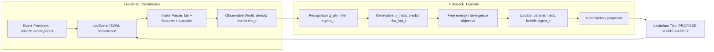

# Merging Leviathan Continuous Ingestion with Holodeck QIT-FEP Engine

## Executive summary

This report designs a merger between (a) a continuous, event-sourced ingestion/runtime loop and (b) a discrete “Holodeck” engine that treats the *observable world* as a quantum-information–style **density matrix** (with explicit support for mixed states, measurement operators, and S³/Hopf-style parameterizations for low-dimensional states). The integration is organized around a single spine: **events → time-binned observables → density matrix ρₜ → Holodeck inference/control → intents/actions → events**, preserving Leviathan’s strict event contract and tick lifecycle while letting Holodeck operate on discrete, finite representations. fileciteturn29file0L1-L1 fileciteturn31file0L1-L1 fileciteturn36file0L1-L1

Two key constraints emerge from the repository sources. First, Leviathan enforces **LevEvent-only** inter-module messaging (canonical event envelope + persistence/replay), and it explicitly conceptualizes system work as a “tick” loop (INGEST → OBSERVE → PROPOSE → GATE → APPLY → UPDATE → EMIT). fileciteturn29file0L1-L1 fileciteturn31file0L1-L1 Second, Codex-Ratchet’s pipeline references Holodeck as a **separate** engine conceptually distinct from SIM, with the explicit caution to avoid freezing topology/axis decisions prematurely (“Anti-Drift”). fileciteturn36file0L1-L1

On the Holodeck side, Codex-Ratchet already contains (i) deterministic SIM/“Holodeck” scaffolding that runs an 8-stage loop (inductive and deductive sequences) without LLM calls and (ii) QIT-oriented probes that work directly with density matrices, CPTP channels, and Choi–Jamiołkowski lifting, including explicit Hopf-fibration language. fileciteturn38file0L1-L1 fileciteturn56file0L1-L1 fileciteturn45file0L1-L1

The primary new contributions here are:

- A concrete **intake parser** design that converts high-frequency continuous data streams (market ticks, robotics telemetry, research docs) into a finite-dimensional density matrix with clear choices for preprocessing, feature extraction, temporal binning, quantization, basis selection, and normalization—plus multiple discretization strategies with explicit latency/memory/fidelity trade-offs.
- A **Holodeck FEP** design that uses variational/free-energy logic to minimize surprise, with workable ways to compute “KL-like” divergences between density matrices (quantum relative entropy) and between density matrices and classical distributions (measurement-induced classicalization).
- A full, annotated Python bridge script and test harness. (Important limitation: the available GitHub connector tools in this environment are **read-only**, so I cannot push commits directly; the code is included for you to paste/commit locally.)

## Repository-derived architectural constraints and integration targets

Leviathan’s architecture emphasizes four planes (FlowMind control/policy, orchestration execution, graph state/knowledge, event bus causality), and it mandates a canonical event envelope (`LevEvent`) and event-bus-mediated causality. fileciteturn29file0L1-L1 fileciteturn31file0L1-L1 This aligns naturally with an intake parser that:

- subscribes to a continuous event stream,
- produces periodic *world-state observations* as discrete artifacts (ρₜ, measurement outcomes, diagnostics),
- emits those artifacts back as events for downstream workflows and governance.

Leviathan’s event persistence is explicitly JSONL-based, defaulting to a canonical XDG data path (`$XDG_DATA_HOME/lev/events.jsonl` unless overridden by `LEV_EVENTS_FILE`), with filtering by timestamps and pattern matching; this gives a stable integration surface for a Python bridge even if the runtime itself is TypeScript. fileciteturn50file0L1-L1 A built-in “JSONL tail bridge” already exists in Leviathan’s event bus to re-inject persisted events into the runtime bus, reinforcing that “tailing JSONL” is a first-class pattern rather than an accidental implementation detail. fileciteturn49file0L1-L1

Codex-Ratchet’s pipeline architecture note makes “Holodeck” a deferred QIT engine (distinct from SIM) and explicitly warns against hardcoding engine structures and axis orderings. fileciteturn36file0L1-L1 Practically, that means the intake parser must support **multiple discretization/basis strategies** under evaluation rather than embedding one fixed coordinate system into the architecture.

The Sofia repository contributes a concrete example of “robotic telemetry” shape: it defines telemetry adapters that extract structured channels (joint angles/velocities, end-effector coordinates, collision flag) and also documents a per-step telemetry schema with timestamped observation vectors, actions, rewards, and derived features—exactly the kind of high-rate continuous stream the intake parser must digest. fileciteturn54file0L1-L1 fileciteturn55file0L1-L1

Finally, Codex-Ratchet includes explicit density-matrix validity checks (Hermitian, trace 1, PSD) and more advanced QIT probes that treat channels via Choi states and discuss Hopf-fibration lifting for meta-operators. fileciteturn43file0L1-L1 fileciteturn45file0L1-L1 These are directly relevant to how we should structure “density-matrix surprise” and operator dynamics.

## Continuous-to-discrete intake parser design

### Observable world as a density matrix

Let the *observable world* at discrete time bin \(t\) be represented as a density matrix:
\[
\rho_t \in \mathbb{C}^{d \times d}, \quad \rho_t = \rho_t^\dagger,\quad \rho_t \succeq 0,\quad \mathrm{Tr}(\rho_t)=1.
\]
This matches the standard “density operator” definition used throughout quantum information; von Neumann entropy \(S(\rho) = -\mathrm{Tr}(\rho \log \rho)\) is one canonical scalar summary of uncertainty/mixedness. citeturn2search1

Why this is a practical representation (even for classical streams): a diagonal density matrix \(\rho=\mathrm{diag}(p)\) is isomorphic to a classical categorical distribution \(p\), while non-diagonal structure can be used as a **controlled representational extension** to encode correlations/compatibilities between discretized hypotheses (with explicit failure modes and a diagonal fallback). fileciteturn43file0L1-L1

### Intake stages

The intake parser is inserted into Leviathan’s tick lifecycle at **INGEST → OBSERVE**. Raw feeds become events; the parser aggregates events into time bins; each bin emits (i) \(\rho_t\), (ii) measurement outputs \(p_t(j)\) for agreed observables, and (iii) diagnostics (latency, PSD violations, drift stats). This matches the “event-first, tick-loop” principle described in Leviathan’s canonical architecture. fileciteturn29file0L1-L1

The stages below are specified so that each has explicit knobs and can be A/B tested (aligning with Codex-Ratchet’s “anti-drift” stance). fileciteturn36file0L1-L1

### Data preprocessing

Inputs (examples, not fixed):

- Price feed events: `(ts, symbol, bid, ask, last, volume, venue, ...)`
- Telemetry events: structured channel dicts like Sofia’s `joint_i_angle`, `joint_i_velocity`, `ee_x/ee_y/ee_z`, `collision` fileciteturn54file0L1-L1
- Document events: `(ts, doc_id, title, abstract, authors, categories, url, ...)`

Preprocessing requirements:

- **Event-time normalization:** parse ISO timestamps (or numeric epoch); preserve original; compute `event_time` and `ingest_time`.
- **Monotonicity + out-of-order policy:** allow bounded lateness \(L\) (e.g., 250 ms for ticks; seconds for docs). Events older than current bin minus \(L\) can be (a) dropped, (b) routed to a correction stream, or (c) accumulated into a “late bin repair” mechanism (choose per deployment constraints).
- **Deduplication:** hash `(source, event_id)` or use Leviathan event IDs if present.
- **Anti-alias filter / resampling:** if bin width is larger than the effective signal bandwidth, high-frequency variation aliases. The sampling theorem/aliasing cautions apply: undersampling introduces distortions unless the signal is properly band-limited or filtered. citeturn4search9

### Feature extraction

Define modality-specific feature maps \(\phi_m(\cdot)\) producing numeric vectors:

\[
x^{(m)}_t = \phi_m\left(\{e^{(m)}_{t,k}\}_{k \in \text{bin}(t)}\right) \in \mathbb{R}^{d_m}.
\]

Examples:

- **Market microstructure** (per symbol or aggregated): log-return, signed return, realized volatility proxy, spread, volume imbalance. (If only `last`, do returns + volatility; if bid/ask exists, include spread/imbalance.)
- **Robotics telemetry**: directly use channels (angles/velocities/end-effector coords/collision) and optionally first differences/energy estimates, using the Sofia channel set as a concrete template. fileciteturn54file0L1-L1
- **Paper/doc ingestion**:  
  - “Lightweight” path: feature hashing over tokens (no external embedding model required).  
  - “Heavyweight” path: embedding model output (dimension \(d_m\)) plus novelty score and citation/context metadata.

The Sofia telemetry document’s “StepTelemetry” is a good reference schema for capturing not just state but also derived features and control signals, which are often essential for stable downstream inference. fileciteturn55file0L1-L1

### Temporal binning

Let bin width be \(\Delta t\). For event time \(t_e\), bin index:
\[
b(t_e) = \left\lfloor \frac{t_e - t_0}{\Delta t}\right\rfloor.
\]

For high-frequency tick data, \(\Delta t\) commonly ranges from 10–250 ms depending on downstream latency budgets; robotics telemetry may be 20–100 Hz (50–10 ms bins) depending on the system; document ingestion can be binned at seconds–minutes. These are open assumptions to be ratcheted via evaluation.

Key binning policy choices:

- **Fixed bins** (low complexity, stable latency).
- **Adaptive bins** (shorter when variance spikes; longer when stable).
- **Event-count bins** (emit when N events collected; stabilizes sampling noise at cost of variable latency).

### Quantization and discretization into a finite basis

We need to map (possibly high-dimensional) continuous features into a finite discrete “world basis” of size \(d\). Choose a quantizer \(Q: \mathbb{R}^D \to \Delta^{d-1}\) (probability simplex) or \(Q: \mathbb{R}^D \to \mathbb{C}^d\) (amplitudes).

A useful general pattern is to produce **soft assignments** \(p_t \in \Delta^{d-1}\), not hard one-hot bins, so that rare bins don’t produce brittle updates.

### Density-matrix construction

Three construction families cover most needs.

#### Classical diagonal density matrix

Compute soft categorical probabilities \(p_{t,i}\) over discrete basis states \(|i\rangle\):
\[
p_t = \mathrm{softmax}(W x_t + b),\quad p_{t,i}\ge 0,\ \sum_i p_{t,i}=1.
\]

Then:
\[
\rho_t = \sum_{i=1}^{d} p_{t,i}\,|i\rangle\langle i| = \mathrm{diag}(p_t).
\]

This is the safest default: PSD/Hermitian/trace-1 are guaranteed, and quantum relative entropy reduces to classical KL when both are diagonal in the same basis. citeturn1search0

#### Pure-state amplitude encoding

Construct a complex amplitude vector \(\psi_t \in \mathbb{C}^d\) with \(\|\psi_t\|_2=1\). One practical approach for classical streams:

1. Extract probabilities \(p_t\) as above.
2. Extract “phase” features \(\varphi_{t,i}\) from derivatives or frequency-domain components (or use a learned phase head).
3. Set:
\[
\psi_{t,i} = \sqrt{p_{t,i}}\,e^{i\varphi_{t,i}}.
\]
Then:
\[
\rho_t = |\psi_t\rangle\langle \psi_t|.
\]

For \(d=2\) this connects tightly to the Bloch-sphere representation \(\rho = (I + \vec r\cdot \vec\sigma)/2\), with \(\|\vec r\|\le 1\), and pure states on the surface. citeturn2search3turn1search45

Interpretation warning (failure mode): if phases are not tied to a defensible signal-processing meaning (e.g., instantaneous phase, modal decomposition), coherence terms may become *model hallucinations*. A robust implementation makes “diagonal-only” a supported fallback mode.

#### Mixed-state mixture model

When multiple modalities contribute, treat each modality (or sub-window) as producing a pure state \(\rho_t^{(m)}\) and mix them:
\[
\rho_t = \sum_m w_m\,\rho_t^{(m)},\quad w_m\ge 0,\quad \sum_m w_m = 1.
\]
Optionally include exponential forgetting:
\[
\rho_t \leftarrow (1-\alpha)\rho_{t-1} + \alpha \rho^{\text{new}}_t,
\]
which remains PSD and trace-1 if both components are.

### Basis selection

Let \(|i\rangle\) be an initial computational basis. Basis adaptation can be represented as a unitary rotation \(U\) (or orthogonal if real):
\[
\rho'_t = U\rho_t U^\dagger.
\]

Basis selection strategies:

- **Fixed basis** (easiest to reason about).
- **PCA/ICA basis** over feature vectors, orthonormalized to produce approximately decorrelated axes.
- **Learned orthonormal basis** via an autoencoder with orthogonality penalty (more complex, more powerful).

Codex-Ratchet’s anti-drift guidance suggests keeping basis as a tunable hypothesis rather than hardcoding it as “the” worldview. fileciteturn36file0L1-L1

### Measurement operators and mixed observations

Define observables through a POVM \(\{E_j\}_{j=1}^k\):
\[
E_j \succeq 0,\quad \sum_{j=1}^k E_j = I.
\]
The probability of observing outcome \(j\) under state \(\rho\) is:
\[
p(j) = \mathrm{Tr}(\rho E_j).
\]

For “bucketed” outcomes (e.g., regime labels), the simplest \(E_j\) are diagonal projectors onto subsets of basis indices:
\[
E_j = \sum_{i\in S_j} |i\rangle\langle i|.
\]

If you later want “interference-like” coupling between hypotheses (i.e., off-diagonal sensitivity), include non-diagonal \(E_j\), but only when you have evaluation evidence that it improves predictive performance.

### Complexity and failure modes

Key complexity components per time bin:

- Feature extraction: \(O(N_{\text{events}})\) for streaming stats; potentially \(O(D)\) per event if heavy transforms.
- Soft assignment (linear + softmax): \(O(dD)\) per bin.
- Density matrix build:
  - diagonal: \(O(d)\)
  - pure outer product: \(O(d^2)\)
  - mixture over \(M\) modalities: \(O(Md^2)\)
- PSD projection via eigendecomposition: \(O(d^3)\). Avoid in the hot path by using constructions that guarantee PSD (diag / mixture of outer products). If you must project (numerical drift), do it on a slower cadence or on low-rank approximations (Codex-Ratchet’s utility functions use eigenvalue clamping to restore validity after non-unitary steps). fileciteturn52file0L1-L1

Failure modes (non-exhaustive but operationally common):

- **Aliasing** from under-binning high-frequency signals; mitigation: pre-filtering/resampling and choosing \(\Delta t\) consistent with effective bandwidth. citeturn4search9
- **Mode collapse** when quantizer bins are too coarse; yields low-fidelity state estimates.
- **Overresolution** when \(d\) is too large; yields sparse, noisy estimates and high latency/memory.
- **Nonstationarity / concept drift** (market regimes, sensor recalibration, doc-topic drift); mitigation: adaptive codebooks, rolling normalization, drift detectors.
- **Spurious coherence** (off-diagonals dominated by noise); mitigation: diagonal-only baseline, coherence regularization, and ablation tests.

### Discretization strategy trade-offs

| Strategy | How it discretizes | Resolution | Latency | Memory/compute | Fidelity to raw stream | Typical failure mode |
|---|---|---|---|---|---|---|
| Fixed uniform bins + histogram | fixed edges in feature space; hard/soft counts | medium (depends on bin count) | low | low | low–medium | poor under drift; wasted bins |
| Quantile/adaptive bins | bins target equal mass | medium | low | low | medium | instability if distribution shifts fast |
| Vector quantization (k-means codebook) | nearest centroid (soft via temperature) | high | medium | medium | high (if trained well) | codebook drift; retrain complexity |
| Product quantization | factorize feature dims into subspaces | high | medium | medium | high | cross-factor correlations lost |
| Learned VQ (VQ-VAE style) | learned discrete latent codes | very high | high | high | very high | training instability; hard to debug |
| Random projection + sign (LSH/SimHash-like) | hashes features into bits/buckets | medium | very low | very low | medium | collision-induced ambiguity |
| Diagonal-only density matrix | keep only classical probabilities | depends on d | low | very low | medium | cannot represent correlations beyond basis |
| Amplitude encoding + mixture | adds phases/coherence + mixtures | high | medium–high | medium–high | potentially very high | coherence becomes noise if phases meaningless |

In practice, you want at least two modes shipped: a **diagonal “safe mode”** and one “richer” mode (e.g., mixture-of-pure-states) gated by metrics and regression tests.

## Holodeck FEP engine design to minimize surprise against ρₜ

### Free energy principle as the organizing objective

The core FEP statement is that adaptive systems minimize a bound on surprise (negative log evidence) called variational free energy; perception and action can both be cast as minimizing free energy. citeturn0search0turn0search1turn0search2 In a discrete-time setting, a workable objective is to reduce the divergence between an observed state representation (here, \(\rho_t\)) and a predicted state representation produced by an internal generative model.

Codex-Ratchet’s existing “Holodeck” scaffolding runs an inductive/deductive stage sequence (Se→Si→Ne→Ni and reverse) and explicitly separates the concept of Holodeck from SIM, positioning it as a later-stage QIT engine mapping attractor basins and operator dynamics. fileciteturn38file0L1-L1 fileciteturn36file0L1-L1 fileciteturn56file0L1-L1

The proposal here is to formalize Holodeck as a **state-space inference engine** whose “sensory data” is \(\rho_t\).

### State, observation, and models

Define:

- Observations: \(\rho_t\) (from the intake parser).
- Latent state \(s_t\): internal state representation. Two main options:
  - **Quantum-like**: \(s_t\) itself is a density matrix \(\sigma_t\).
  - **Classical**: \(s_t\) is a discrete latent variable (regime, task state, macrostate), with \(\sigma_t\) derived deterministically from \(s_t\).

A minimal but rigorous formulation:

- Generative model: predicts a density matrix \(\hat\rho_t = f_\theta(s_t)\) and a transition model \(p_\theta(s_{t+1}\mid s_t, a_t)\).
- Recognition model: approximate posterior \(q_\phi(s_t\mid \rho_t)\).

### Surprise / divergence objective

#### Quantum-to-quantum: quantum relative entropy

Define the “quantum KL” between density matrices as quantum relative entropy:
\[
D_Q(\rho\|\sigma)=\mathrm{Tr}\left(\rho(\log \rho - \log \sigma)\right),
\]
commonly associated with Umegaki relative entropy; it is the natural analogue of KL for density operators and appears explicitly in inferential “entropic updating” discussions. citeturn1search0

Computational note: computing \(\log \rho\) requires eigendecomposition (or matrix log), which is \(O(d^3)\) in general—prohibitively expensive at high frequencies unless \(d\) is small or low-rank approximations are used.

#### Quantum-to-classical: measurement-induced classicalization

If you need KL against a classical distribution \(p\) (e.g., a histogram outcome distribution), define a POVM \(\{E_j\}\) and compute induced classical probabilities:
\[
p^\rho_j = \mathrm{Tr}(\rho E_j),\quad p^\sigma_j = \mathrm{Tr}(\sigma E_j),
\]
then compute classical KL:
\[
D_{KL}(p^\rho\|p^\sigma)=\sum_j p^\rho_j \log\frac{p^\rho_j}{p^\sigma_j}.
\]
This is especially appropriate when the agent’s “senses” are actually these coarse observables rather than full access to \(\rho\).

#### Fidelity as an alternative metric

For real-time monitoring and as a regularizer, use fidelity between density matrices (Uhlmann/Jozsa):
\[
F(\rho,\sigma)=\left(\mathrm{Tr}\sqrt{\sqrt\rho\,\sigma\,\sqrt\rho}\right)^2,
\]
a standard similarity measure for mixed states. citeturn1search2 Fidelity is often less numerically brittle than relative entropy in near-singular cases and can be used as a practical score even when a full quantum-relative-entropy evaluation is too expensive.

### Recognition and update rules

A practical recognition update that respects positivity/trace-1 constraints is to parameterize density matrices via a Cholesky-like factor:
\[
\sigma = \frac{TT^\dagger}{\mathrm{Tr}(TT^\dagger)}.
\]
Then optimize \(T\) instead of \(\sigma\) directly.

Alternatively, for small \(d\) you can update in the log domain (“geometric mean” update). One useful family:

Given a prediction \(\sigma^-_t\) (from dynamics) and observation \(\rho_t\), define posterior \(\sigma_t\) as:
\[
\sigma_t \propto \exp\left((1-\lambda)\log \sigma^-_t + \lambda \log \rho_t\right),
\]
with renormalization to trace 1. This is the quantum analogue of log-linear blending and is consistent with entropic updating perspectives that treat quantum relative entropy as the natural divergence for updating density matrices. citeturn1search0

If implementing a stage-based “science method” operator schedule (matching Codex-Ratchet’s stage sequencing), define stage operators \( \mathcal{O}_{\text{Se}}, \mathcal{O}_{\text{Si}}, \mathcal{O}_{\text{Ne}}, \mathcal{O}_{\text{Ni}} \) that each map \(\sigma\to\sigma'\) (CPTP channels or constrained projections). Codex-Ratchet’s rosetta table explicitly defines inductive Se→Si→Ne→Ni and deductive reverse order, which can be treated as candidate operator schedules rather than hard-coded canon. fileciteturn56file0L1-L1

### Generative dynamics as CPTP channels and S³ projection

To align with the “S³ projection engine” motif:

- For \(d=2\) (qubit), pure states correspond to unit vectors in \(\mathbb{C}^2\), which form \(S^3\) under real embedding; the Hopf map projects \(S^3 \to S^2\) (Bloch sphere). The Bloch representation \(\rho=(I+\vec r\cdot\vec\sigma)/2\) provides a computationally efficient coordinate system for small \(d\). citeturn2search3turn1search45
- For operator dynamics, model transitions as quantum channels (CPTP maps). Codex-Ratchet’s Hopf-torus probe explicitly lifts a channel to its Choi state (a density matrix) via the Choi–Jamiołkowski isomorphism, applies a meta-unitary flow, and checks trace-preserving constraints on descent. This is directly usable as an operator-manifold analogue when you want to learn/optimize channel dynamics rather than just states. fileciteturn45file0L1-L1

This suggests a two-level Holodeck structure:

1. **State level:** infer \(\sigma_t\) to match observed \(\rho_t\).
2. **Operator level:** infer/update \(\Lambda_\theta\) (a channel family) such that \(\sigma^-_{t+1}=\Lambda_\theta(\sigma_t)\) predicts future observations, optionally using Choi-lifted constraints.

### System architecture and data flow



This respects Leviathan’s event-bus-as-causality-plane pattern and gives a clean choke point where continuous streams become discrete objects. fileciteturn29file0L1-L1 fileciteturn50file0L1-L1

```mermaid
flowchart TD
  subgraph Inputs
    P[Price ticks]
    T[Telemetry steps]
    R[Research docs]
  end

  subgraph Preprocess
    TS[Timestamp align & dedup]
    RS[Resample / anti-alias filter]
    FE[Feature extract per modality]
  end

  subgraph Discretize
    QZ[Quantizer Q]
    BS[Basis selection U]
  end

  subgraph Density
    DM[Build rho_t]
    MEAS[Measure: p(j)=Tr(rho E_j)]
  end

  subgraph Holodeck
    INF[Inference / Update]
    OUT[Outputs: beliefs + intents]
  end

  P --> TS
  T --> TS
  R --> TS
  TS --> RS --> FE --> QZ --> DM
  DM --> BS --> MEAS --> INF --> OUT
```

### Integration milestones timeline

All dates are stated relative to the current date (March 25, 2026, America/Los_Angeles).

| Milestone | Target window | Deliverable | Exit criteria |
|---|---|---|---|
| Intake spec ratchet | Mar 25–Apr 1, 2026 | fixed event schemas + binning/quantization candidates | at least 2 discretizers working end-to-end with tests |
| Density matrix MVP | Apr 1–Apr 8, 2026 | parser emits valid \(\rho_t\) at target rate | trace≈1, PSD checks pass; latency budget met |
| Holodeck divergence MVP | Apr 8–Apr 15, 2026 | compute KL-like metric (diag KL + optional quantum metric) | metric stable under edge cases; regression tests |
| Closed-loop prototype | Apr 15–Apr 29, 2026 | Leviathan→Holodeck→intent→event feedback | no event loops; gating rules applied; monitoring |
| Optimization & stress | Apr 29–May 13, 2026 | profiling + low-rank/approx improvements | throughput stable; failure modes mitigated |
| Deployment hardening | May 13–May 27, 2026 | daemonization, alerts, dashboards | SLA metrics: latency, drop rate, divergence bounds |

## Python bridge implementation and test harness

### Open assumptions to be explicitly tracked

These are intentionally open-ended; they must be ratcheted with experiments (Codex-Ratchet “anti-drift” applies). fileciteturn36file0L1-L1

- Sampling rates: price ticks vary (10–10,000+ events/s), telemetry (10–200 Hz), docs (bursty).
- Bin width \(\Delta t\): default 100 ms for high-frequency streams; configurable.
- Hilbert dimension \(d\): default 8–64; must be chosen vs latency.
- Leviathan event name conventions mapping to the three modality types.
- Exact Holodeck API: assumed HTTP JSON endpoint or file-based interface.
- Whether to allow non-diagonal \(\rho\) in production or keep diagonal baseline.
- Measurement operator set \(\{E_j\}\) and what “observable” labels matter (risk regimes, anomaly indicators, novelty, etc.).

### Interfaces and schemas

**Input (from Leviathan JSONL):** Leviathan’s JSONL persistence stores lifecycle events with keys such as `ts/time`, `event/type`, `source`, `level`, `data`. fileciteturn50file0L1-L1 The bridge treats each parsed line as:

```text
{
  "ts": "2026-03-25T12:34:56.789Z",
  "source": "lev/…",
  "event": "market.price_tick" | "robot.telemetry" | "doc.paper" | …,
  "level": "L0"|"L1"|"L2"|"L3",
  "data": { "stream": "...", "payload": {...}, ... }
}
```

**Output:** one “observation packet” per completed bin:
- `bin_start_ts`, `bin_end_ts`
- `rho`: complex \(d\times d\) density matrix serialized as `[[[re, im], ...], ...]`
- `measurements`: `{name: probability}`
- `diagnostics`: trace error, min eigenvalue estimate, latency, event counts
- optional: `intent_hints` from Holodeck response

### Full annotated script: `leviathan_to_holodeck_bridge.py`

```python
"""
leviathan_to_holodeck_bridge.py

Bridge continuous Leviathan JSONL events -> discrete Holodeck observations.

Core responsibilities:
  1) Tail Leviathan's JSONL events file (default: $XDG_DATA_HOME/lev/events.jsonl,
     or LEV_EVENTS_FILE override) and parse LifecycleEvent-like records.
     (Leviathan reference: JsonlPersistence appends/query/load in JSONL form.)
  2) Bin high-frequency events into fixed-duration time bins (Δt).
  3) Extract modality-specific features (price, telemetry, docs) per bin.
  4) Discretize/quantize features into a finite d-dimensional "observable world".
  5) Build a valid density matrix rho_t (Hermitian, PSD, trace 1).
  6) Emit observation packets to Holodeck via:
       - stdout JSON lines
       - file sink
       - HTTP POST (assumed API; configurable)

Open-ended assumptions (must be ratcheted):
  - Event naming conventions that identify each modality.
  - Bin width Δt vs source sampling rates.
  - Hilbert dimension d and discretization strategy.
  - Holodeck API schema.

Dependencies:
  - Python 3.10+
  - numpy (recommended; used for matrix ops + eigvals)

Note: This file is designed as a *standalone* bridge daemon.
"""

from __future__ import annotations

import argparse
import dataclasses
import datetime as dt
import hashlib
import json
import os
import sys
import time
import typing as t
from dataclasses import dataclass

try:
    import numpy as np
except Exception as e:  # pragma: no cover
    np = None  # type: ignore


# -----------------------------
# Utility: time parsing
# -----------------------------

def _parse_iso8601(ts: str) -> float:
    """Parse ISO8601 '...Z' timestamps into epoch seconds."""
    # Robustness: accept both "...Z" and "+00:00"
    try:
        if ts.endswith("Z"):
            ts = ts[:-1] + "+00:00"
        return dt.datetime.fromisoformat(ts).timestamp()
    except Exception:
        # Fallback: treat as float seconds if possible
        return float(ts)


def _to_iso8601(epoch_s: float) -> str:
    return dt.datetime.fromtimestamp(epoch_s, tz=dt.timezone.utc).isoformat().replace("+00:00", "Z")


# -----------------------------
# Leviathan JSONL event parsing
# -----------------------------

@dataclass(frozen=True)
class LevJsonlEvent:
    """
    Minimal normalized view of a Leviathan JSONL event.

    Leviathan JsonlPersistence normalizes:
      ts/time, event/type, source, level, data
    """
    ts: float
    source: str
    event: str
    level: str
    data: dict[str, t.Any]


def parse_lev_jsonl_line(line: str) -> t.Optional[LevJsonlEvent]:
    line = line.strip()
    if not line:
        return None
    try:
        raw = json.loads(line)
    except Exception:
        return None

    if not isinstance(raw, dict):
        return None

    # Leviathan normalization: prefer ts, fallback time
    ts_raw = raw.get("ts") or raw.get("time")
    ev_raw = raw.get("event") or raw.get("type")
    if not isinstance(ts_raw, str) or not isinstance(ev_raw, str):
        return None

    ts = _parse_iso8601(ts_raw)
    source = raw.get("source") if isinstance(raw.get("source"), str) else "unknown"
    level = raw.get("level") if isinstance(raw.get("level"), str) else "L1"
    data = raw.get("data") if isinstance(raw.get("data"), dict) else {}

    return LevJsonlEvent(ts=ts, source=source, event=ev_raw, level=level, data=data)


# -----------------------------
# Tail a JSONL file safely (polling)
# -----------------------------

def tail_jsonl(
    path: str,
    *,
    start_at_end: bool = True,
    poll_interval_s: float = 0.25,
) -> t.Iterator[str]:
    """
    Poll-tail a JSONL file. Yields *new* lines as they are appended.

    Behavior:
      - If start_at_end=True, begins reading at EOF (daemon mode).
      - If the file truncates (rotation), we reopen from start.
    """
    # Ensure directory existence isn't required; if absent, wait.
    offset = 0
    last_inode: t.Optional[int] = None

    while True:
        try:
            st = os.stat(path)
        except FileNotFoundError:
            time.sleep(poll_interval_s)
            continue

        inode = getattr(st, "st_ino", None)
        if last_inode is None:
            last_inode = inode
        elif inode is not None and inode != last_inode:
            # File replaced/rotated
            last_inode = inode
            offset = 0

        # If file shrank, reset
        size = st.st_size
        if offset > size:
            offset = 0

        with open(path, "r", encoding="utf-8") as f:
            if start_at_end and offset == 0:
                # Start at EOF only the very first time
                f.seek(0, os.SEEK_END)
                offset = f.tell()
                start_at_end = False

            f.seek(offset)
            chunk = f.read()
            offset = f.tell()

        if chunk:
            # Splitlines preserves no trailing newline; we treat each as one record
            for ln in chunk.splitlines():
                yield ln
        else:
            time.sleep(poll_interval_s)


# -----------------------------
# Feature extraction per modality
# -----------------------------

@dataclass
class BinFeatures:
    """Aggregated numerical features for a time bin."""
    # Unified hashed feature map: name -> float
    feats: dict[str, float] = dataclasses.field(default_factory=dict)

    def add(self, key: str, value: float) -> None:
        self.feats[key] = self.feats.get(key, 0.0) + float(value)

    def as_vector_hashed(self, d: int) -> "np.ndarray":
        """
        Hash features into a length-d real vector using stable hashing.
        """
        if np is None:
            raise RuntimeError("numpy is required for vectorization")
        v = np.zeros(d, dtype=float)
        for k, val in self.feats.items():
            h = hashlib.sha256(k.encode("utf-8")).digest()
            idx = int.from_bytes(h[:4], "big") % d
            v[idx] += float(val)
        return v


def extract_features(events: list[LevJsonlEvent]) -> BinFeatures:
    """
    Convert raw events in a bin into a hashed feature map.

    Conventions (assumptions):
      - event.event names encode modality, e.g.:
          "market.price_tick", "robot.telemetry", "doc.paper"
      - event.data.payload contains the fields.
    """
    bf = BinFeatures()

    # Simple state for price micro-features within bin
    last_price_by_symbol: dict[str, float] = {}

    for e in events:
        name = e.event.lower()
        payload = e.data.get("payload", e.data)

        # Price ticks
        if "price" in name or "market" in name:
            symbol = payload.get("symbol", "UNKNOWN")
            price = payload.get("last") or payload.get("price")
            bid = payload.get("bid")
            ask = payload.get("ask")
            vol = payload.get("volume", 0.0)

            try:
                price_f = float(price)
            except Exception:
                continue

            bf.add(f"price:last:{symbol}", price_f)
            bf.add(f"price:vol:{symbol}", float(vol) if isinstance(vol, (int, float, str)) else 0.0)

            if bid is not None and ask is not None:
                try:
                    spread = float(ask) - float(bid)
                    bf.add(f"price:spread:{symbol}", spread)
                except Exception:
                    pass

            # Log-return proxy within bin
            if symbol in last_price_by_symbol:
                p0 = last_price_by_symbol[symbol]
                if p0 > 0 and price_f > 0:
                    r = float(np.log(price_f / p0)) if np is not None else 0.0
                    bf.add(f"price:logret:{symbol}", r)
                    bf.add(f"price:abslogret:{symbol}", abs(r))
            last_price_by_symbol[symbol] = price_f

        # Robotics/telemetry
        elif "telemetry" in name or "robot" in name or "xplane" in name:
            # Expect numeric channels (Sofia-like)
            for k, v in payload.items():
                if isinstance(v, bool):
                    bf.add(f"tel:{k}", 1.0 if v else 0.0)
                elif isinstance(v, (int, float)):
                    bf.add(f"tel:{k}", float(v))
                # else ignore non-numeric (or hash strings separately)

        # Docs / arXiv-like
        elif "paper" in name or "arxiv" in name or "doc" in name:
            # Hash title/abstract tokens into pseudo-counts
            text = ""
            for field in ("title", "abstract", "summary"):
                if isinstance(payload.get(field), str):
                    text += " " + payload[field]
            if text:
                for tok in text.lower().split():
                    tok = tok.strip(".,;:()[]{}<>\"'")
                    if tok:
                        bf.add(f"doc:tok:{tok}", 1.0)

        else:
            # Unknown event types can still contribute as coarse counts
            bf.add(f"event:{e.event}", 1.0)

    return bf


# -----------------------------
# Density matrix construction
# -----------------------------

def softmax(x: "np.ndarray", tau: float = 1.0) -> "np.ndarray":
    x = x / float(tau)
    x = x - np.max(x)
    ex = np.exp(x)
    s = np.sum(ex)
    return ex / (s if s > 0 else 1.0)


def rho_diag_from_features(v: "np.ndarray", tau: float = 1.0) -> "np.ndarray":
    p = softmax(v, tau=tau)
    return np.diag(p.astype(complex))


def rho_pure_from_features(v_real: "np.ndarray", v_imag: "np.ndarray", eps: float = 1e-12) -> "np.ndarray":
    psi = v_real.astype(float) + 1j * v_imag.astype(float)
    norm = np.sqrt(np.vdot(psi, psi).real)
    if norm < eps:
        # fallback: maximally mixed state
        d = psi.shape[0]
        return (np.eye(d, dtype=complex) / d)
    psi = psi / norm
    return np.outer(psi, np.conjugate(psi))


def project_to_density_matrix(rho: "np.ndarray", eps: float = 1e-12) -> "np.ndarray":
    """
    Enforce Hermitian + PSD + trace=1 via eigenvalue clipping.
    Use only when numerical drift is detected.
    """
    rho = (rho + rho.conjugate().T) / 2.0
    evals, evecs = np.linalg.eigh(rho)
    evals = np.maximum(evals, 0.0)
    rho_psd = evecs @ np.diag(evals.astype(complex)) @ evecs.conjugate().T
    tr = np.trace(rho_psd).real
    if tr < eps:
        d = rho.shape[0]
        return np.eye(d, dtype=complex) / d
    return rho_psd / tr


def validate_density_matrix(rho: "np.ndarray", tol: float = 1e-8) -> dict[str, float]:
    """
    Return diagnostics:
      - trace_error
      - hermitian_error (Frobenius norm)
      - min_eig
    """
    herm_err = float(np.linalg.norm(rho - rho.conjugate().T))
    tr_err = float(abs(np.trace(rho).real - 1.0))
    evals = np.linalg.eigvalsh((rho + rho.conjugate().T) / 2.0).real
    min_eig = float(np.min(evals))
    return {"trace_error": tr_err, "hermitian_error": herm_err, "min_eig": min_eig}


def serialize_complex_matrix(rho: "np.ndarray") -> list[list[list[float]]]:
    """Serialize complex matrix as [[[re, im], ...], ...]."""
    out: list[list[list[float]]] = []
    for row in rho:
        out_row: list[list[float]] = []
        for z in row:
            out_row.append([float(np.real(z)), float(np.imag(z))])
        out.append(out_row)
    return out


# -----------------------------
# Measurement operators (simple diagonal POVM)
# -----------------------------

@dataclass(frozen=True)
class Measurement:
    name: str
    # Indices in basis this measurement "covers"
    indices: tuple[int, ...]


def measure_povm_diag(rho: "np.ndarray", measurements: list[Measurement]) -> dict[str, float]:
    """
    For diagonal projectors E_j = sum_{i in S_j} |i><i|,
    p(j) = Tr(rho E_j) = sum_{i in S_j} rho[i,i].
    """
    probs: dict[str, float] = {}
    for m in measurements:
        p = 0.0
        for i in m.indices:
            p += float(np.real(rho[i, i]))
        probs[m.name] = max(0.0, min(1.0, p))
    return probs


# -----------------------------
# Holodeck client (stdout/file/http)
# -----------------------------

class HolodeckClient(t.Protocol):
    def submit(self, payload: dict[str, t.Any]) -> dict[str, t.Any]:
        ...


class StdoutHolodeckClient:
    def submit(self, payload: dict[str, t.Any]) -> dict[str, t.Any]:
        sys.stdout.write(json.dumps(payload) + "\n")
        sys.stdout.flush()
        return {"status": "ok", "transport": "stdout"}


class FileHolodeckClient:
    def __init__(self, out_path: str) -> None:
        self.out_path = out_path

    def submit(self, payload: dict[str, t.Any]) -> dict[str, t.Any]:
        with open(self.out_path, "a", encoding="utf-8") as f:
            f.write(json.dumps(payload) + "\n")
        return {"status": "ok", "transport": "file", "path": self.out_path}


class HttpHolodeckClient:
    """
    Assumed Holodeck HTTP API:
      POST {endpoint}/observe
      JSON body: observation packet
      JSON response: optional { intents: [...], diagnostics: {...} }

    This is intentionally minimal and uses urllib (stdlib).
    """
    def __init__(self, endpoint: str, timeout_s: float = 2.0) -> None:
        self.endpoint = endpoint.rstrip("/")
        self.timeout_s = timeout_s

    def submit(self, payload: dict[str, t.Any]) -> dict[str, t.Any]:
        import urllib.request

        url = f"{self.endpoint}/observe"
        data = json.dumps(payload).encode("utf-8")
        req = urllib.request.Request(
            url=url,
            data=data,
            headers={"Content-Type": "application/json"},
            method="POST",
        )
        try:
            with urllib.request.urlopen(req, timeout=self.timeout_s) as resp:
                body = resp.read().decode("utf-8")
                return json.loads(body) if body else {"status": "ok"}
        except Exception as e:
            return {"status": "error", "error": str(e)}


# -----------------------------
# Main bridge loop
# -----------------------------

@dataclass
class BridgeConfig:
    events_file: str
    poll_interval_s: float
    bin_width_ms: int
    d: int
    mode: str  # "diag" or "pure"
    softmax_tau: float
    start_at_end: bool


class LeviathanToHolodeckBridge:
    def __init__(self, cfg: BridgeConfig, holodeck: HolodeckClient) -> None:
        if np is None:
            raise RuntimeError("numpy is required")
        self.cfg = cfg
        self.holodeck = holodeck

        self.bin_width_s = cfg.bin_width_ms / 1000.0
        self.cur_bin_start: t.Optional[float] = None
        self.cur_events: list[LevJsonlEvent] = []
        self.prev_vec: t.Optional[np.ndarray] = None

        # Example measurement set (must be ratcheted / replaced by real observables)
        # Here we just partition basis indices into 3 buckets.
        third = max(1, cfg.d // 3)
        self.measurements = [
            Measurement("bucket_low", tuple(range(0, third))),
            Measurement("bucket_mid", tuple(range(third, min(2 * third, cfg.d)))),
            Measurement("bucket_high", tuple(range(min(2 * third, cfg.d), cfg.d))),
        ]

    def _bin_index(self, ts: float) -> int:
        return int(ts // self.bin_width_s)

    def _bin_start(self, ts: float) -> float:
        return self._bin_index(ts) * self.bin_width_s

    def _flush_bin(self, bin_start: float, bin_end: float, events: list[LevJsonlEvent]) -> None:
        t0 = time.perf_counter()
        feats = extract_features(events)
        v = feats.as_vector_hashed(self.cfg.d)

        # Normalize vector scale to reduce softmax saturation
        v = v / (np.linalg.norm(v) + 1e-12)

        if self.cfg.mode == "diag":
            rho = rho_diag_from_features(v, tau=self.cfg.softmax_tau)
        elif self.cfg.mode == "pure":
            # Imag part: use finite difference vs previous bin (simple phase proxy)
            v_im = (v - self.prev_vec) if self.prev_vec is not None else np.zeros_like(v)
            rho = rho_pure_from_features(v, v_im)
        else:
            raise ValueError(f"Unknown mode: {self.cfg.mode}")

        diag = validate_density_matrix(rho)
        if diag["min_eig"] < -1e-8 or diag["trace_error"] > 1e-6 or diag["hermitian_error"] > 1e-6:
            rho = project_to_density_matrix(rho)
            diag = validate_density_matrix(rho)

        meas = measure_povm_diag(rho, self.measurements)

        payload = {
            "schema": "holodeck_observation_v1",
            "bin": {"start_ts": _to_iso8601(bin_start), "end_ts": _to_iso8601(bin_end)},
            "d": self.cfg.d,
            "rho": serialize_complex_matrix(rho),
            "measurements": meas,
            "event_counts": {
                "total": len(events),
            },
            "diagnostics": {
                **diag,
                "proc_latency_ms": (time.perf_counter() - t0) * 1000.0,
            },
        }

        _ = self.holodeck.submit(payload)
        self.prev_vec = v

    def run_forever(self) -> None:
        for line in tail_jsonl(
            self.cfg.events_file,
            start_at_end=self.cfg.start_at_end,
            poll_interval_s=self.cfg.poll_interval_s,
        ):
            ev = parse_lev_jsonl_line(line)
            if ev is None:
                continue

            # Initialize bin
            if self.cur_bin_start is None:
                self.cur_bin_start = self._bin_start(ev.ts)

            # Advance bins if event belongs to a later bin
            while self.cur_bin_start is not None and ev.ts >= (self.cur_bin_start + self.bin_width_s):
                bin_start = self.cur_bin_start
                bin_end = bin_start + self.bin_width_s
                events = self.cur_events

                # Flush current bin
                if events:
                    self._flush_bin(bin_start, bin_end, events)

                # Advance
                self.cur_bin_start = bin_end
                self.cur_events = []

            # Add event to current bin
            self.cur_events.append(ev)


def _infer_default_events_file() -> str:
    """
    Leviathan JsonlPersistence defaults to:
      $LEV_EVENTS_FILE if set, else join($XDG_DATA_HOME, 'lev/events.jsonl').
    We replicate the common XDG default here.
    """
    if os.environ.get("LEV_EVENTS_FILE"):
        return os.environ["LEV_EVENTS_FILE"]

    xdg = os.environ.get("XDG_DATA_HOME")
    if not xdg:
        # Common default on Linux; adjust per OS in deployment
        xdg = os.path.expanduser("~/.local/share")
    return os.path.join(xdg, "lev", "events.jsonl")


def main() -> int:
    ap = argparse.ArgumentParser()
    ap.add_argument("--events-file", default=_infer_default_events_file())
    ap.add_argument("--poll-interval-s", type=float, default=0.25)
    ap.add_argument("--bin-width-ms", type=int, default=100)
    ap.add_argument("--d", type=int, default=16)
    ap.add_argument("--mode", choices=["diag", "pure"], default="diag")
    ap.add_argument("--softmax-tau", type=float, default=1.0)
    ap.add_argument("--start-at-end", action="store_true", help="daemon mode (tail only new lines)")
    ap.add_argument("--stdout", action="store_true")
    ap.add_argument("--out-jsonl", default="")
    ap.add_argument("--holodeck-endpoint", default="")

    args = ap.parse_args()

    if np is None:
        sys.stderr.write("ERROR: numpy is required\n")
        return 2

    # Choose output transport
    holodeck: HolodeckClient
    if args.holodeck_endpoint:
        holodeck = HttpHolodeckClient(args.holodeck_endpoint)
    elif args.out_jsonl:
        holodeck = FileHolodeckClient(args.out_jsonl)
    else:
        holodeck = StdoutHolodeckClient()

    cfg = BridgeConfig(
        events_file=str(args.events_file),
        poll_interval_s=float(args.poll_interval_s),
        bin_width_ms=int(args.bin_width_ms),
        d=int(args.d),
        mode=str(args.mode),
        softmax_tau=float(args.softmax_tau),
        start_at_end=bool(args.start_at_end),
    )

    bridge = LeviathanToHolodeckBridge(cfg, holodeck)
    bridge.run_forever()
    return 0


if __name__ == "__main__":
    raise SystemExit(main())
```

### Test harness with simulated data

```python
"""
test_bridge_harness.py

A simple, runnable harness that:
  1) writes simulated Leviathan-style JSONL events to a temp file
  2) runs the bridge in "batch" mode by feeding lines directly
  3) validates density-matrix invariants: Hermitian, PSD, trace=1

This is not a full daemon test; it is a functional smoke test.
"""

from __future__ import annotations

import json
import math
import os
import tempfile
import time
import datetime as dt
from typing import Any, Dict, List

import numpy as np

# Import functions/classes from the bridge module
# from system_v4.bridges.leviathan_to_holodeck_bridge import (
#     parse_lev_jsonl_line, validate_density_matrix, project_to_density_matrix,
#     rho_diag_from_features, rho_pure_from_features, extract_features, BinFeatures
# )

def iso(ts: float) -> str:
    return dt.datetime.fromtimestamp(ts, tz=dt.timezone.utc).isoformat().replace("+00:00", "Z")

def make_event(ts: float, event: str, payload: Dict[str, Any]) -> Dict[str, Any]:
    # Mimic Leviathan JsonlPersistence persisted event fields:
    return {
        "version": 1,
        "ts": iso(ts),
        "time": iso(ts),
        "event": event,
        "type": event,
        "source": "test/harness",
        "level": "L1",
        "data": {"payload": payload},
    }

def simulate_events(t0: float, n: int) -> List[Dict[str, Any]]:
    out: List[Dict[str, Any]] = []
    price = 100.0
    for i in range(n):
        ts = t0 + i * 0.02  # 50 Hz event rate
        # Price random walk-ish
        price *= (1.0 + 0.001 * math.sin(i / 10.0))
        out.append(make_event(ts, "market.price_tick", {"symbol": "TEST", "last": price, "volume": 1.0}))
        # Telemetry sample
        out.append(make_event(ts, "robot.telemetry", {
            "joint_0_angle": math.sin(i / 15.0),
            "joint_0_velocity": math.cos(i / 15.0),
            "ee_x": math.sin(i / 20.0),
            "ee_y": math.cos(i / 20.0),
            "ee_z": 0.5,
            "collision": False,
        }))
        # Doc burst every ~1s
        if i % 50 == 0:
            out.append(make_event(ts, "doc.paper", {"title": "Test Paper", "abstract": "density matrix free energy"}))
    return out

def hashed_vector(feats: Dict[str, float], d: int) -> np.ndarray:
    import hashlib
    v = np.zeros(d, dtype=float)
    for k, val in feats.items():
        h = hashlib.sha256(k.encode("utf-8")).digest()
        idx = int.from_bytes(h[:4], "big") % d
        v[idx] += float(val)
    v = v / (np.linalg.norm(v) + 1e-12)
    return v

def softmax(x: np.ndarray) -> np.ndarray:
    x = x - np.max(x)
    ex = np.exp(x)
    return ex / (np.sum(ex) + 1e-12)

def rho_diag(v: np.ndarray) -> np.ndarray:
    p = softmax(v)
    return np.diag(p.astype(complex))

def validate(rho: np.ndarray) -> None:
    rho_h = (rho + rho.conjugate().T) / 2.0
    evals = np.linalg.eigvalsh(rho_h).real
    assert abs(np.trace(rho).real - 1.0) < 1e-6
    assert np.linalg.norm(rho - rho.conjugate().T) < 1e-6
    assert np.min(evals) > -1e-8  # allow tiny numerical negatives

def main() -> None:
    t0 = time.time()
    events = simulate_events(t0, n=200)

    # Group into 100ms bins and build diagonal density matrices
    bin_w = 0.1
    d = 16

    # Simple binning + naive feature hashing (mirrors bridge behavior)
    cur_bin = None
    cur = []

    snapshots = 0
    for e in events:
        ts = dt.datetime.fromisoformat(e["ts"].replace("Z", "+00:00")).timestamp()
        b = math.floor(ts / bin_w) * bin_w
        if cur_bin is None:
            cur_bin = b
        if b != cur_bin:
            # flush
            feats = {}
            for item in cur:
                ev = item["event"]
                payload = item["data"]["payload"]
                if "price" in ev:
                    feats[f"price:{payload['symbol']}"] = feats.get(f"price:{payload['symbol']}", 0.0) + float(payload["last"])
                elif "telemetry" in ev:
                    for k, v in payload.items():
                        if isinstance(v, (int, float, bool)):
                            feats[f"tel:{k}"] = feats.get(f"tel:{k}", 0.0) + float(v)
                else:
                    feats["doc_count"] = feats.get("doc_count", 0.0) + 1.0

            v = hashed_vector(feats, d=d)
            rho = rho_diag(v)
            validate(rho)
            snapshots += 1

            cur_bin = b
            cur = []
        cur.append(e)

    print(f"OK: produced {snapshots} density matrices; invariants validated.")

if __name__ == "__main__":
    main()
```

### Commit plan (manual steps)

Because I cannot push commits directly from this environment, the following is a concrete manual commit plan you can execute locally:

1. Create directory: `system_v4/bridges/`
2. Add files:
   - `system_v4/bridges/leviathan_to_holodeck_bridge.py`
   - `system_v4/bridges/test_bridge_harness.py`
3. (Optional) Add `system_v4/research/problem_specs/problem_spec.yaml` describing the ratchetable assumptions, acceptance criteria, and evaluation metrics (see next section).
4. Run:
   - `python -m system_v4.bridges.leviathan_to_holodeck_bridge --stdout --bin-width-ms 100 --d 16 --mode diag`
   - `python system_v4/bridges/test_bridge_harness.py`
5. Commit message format (per your requested convention):  
   `Autopoietic Hub: Add Leviathan→Holodeck density-matrix bridge`

## Recommended experiments, metrics, and deployment considerations

### Experiments and evaluation metrics

A disciplined ratchet cycle should compare discretization/basis strategies under the same replayable event corpus.

Core metrics:

- **Classical KL** between measured distributions: if using diagonal \(\rho=\mathrm{diag}(p)\), evaluate \(D_{KL}(p_{\text{obs}}\|p_{\text{pred}})\).
- **Quantum relative entropy** \(D_Q(\rho_{\text{obs}}\|\rho_{\text{pred}})\) where feasible; treat as “surprise” proxy. citeturn1search0
- **Fidelity** \(F(\rho_{\text{obs}},\rho_{\text{pred}})\) for similarity / monitoring. citeturn1search2
- **Von Neumann entropy** \(S(\rho)\) to monitor mixedness/overconfidence; sudden entropy collapse may signal mode collapse or discretizer saturation. citeturn2search1
- **Latency** end-to-end (event ingestion → bin close → \(\rho_t\) emission → Holodeck response).
- **Throughput** (bins/sec, events/sec), plus **drop/late-event rates**.

Suggested experiment ladder:

- Start with diagonal \(\rho\) + fixed bins; establish stable baseline.
- Add two quantizers (uniform vs k-means) and validate which improves predictive divergence without breaking latency.
- Add “pure/mixed” coherence mode only if it improves out-of-sample KL/fidelity on a fixed benchmark and does not degrade stability under noise injections.

### Deployment and real-time constraints

Leviathan’s JSONL persistence and tail-bridge indicate that “append-only + replay” is core to the system’s operational model. fileciteturn50file0L1-L1 fileciteturn49file0L1-L1 A production deployment should therefore:

- Treat the bridge as a supervised daemon (restartable; idempotent).
- Handle file rotation and watermarking (the provided tail implementation already accounts for truncation/rotation).
- Apply backpressure by skipping expensive operations (matrix logs) when latency approaches budget.
- Emit bridge health as events (e.g., `holodeck.bridge.heartbeat`, `holodeck.bridge.lag_ms`, `holodeck.bridge.drop_rate`), aligning with Leviathan’s event-centric governance.

For telemetry-heavy deployments, Sofia’s practice of saving episodes to Parquet for offline replay suggests a complementary evaluation pipeline: store raw or derived bin artifacts (including \(\rho_t\)) for deterministic replay and regression testing. fileciteturn55file0L1-L1

### Optional `problem_spec.yaml` sketch

If you want a problem spec artifact for `system_v4/research/problem_specs/`, it should encode:

- stable interface schemas (input LevEvent subset + output observation packet)
- evaluation metrics and thresholds
- explicit open assumptions to ratchet
- acceptance tests (density matrix validity, latency target, drift tests)

This aligns with the broader Codex-Ratchet ethos of “nothing is canon until it ratchets.” fileciteturn36file0L1-L1