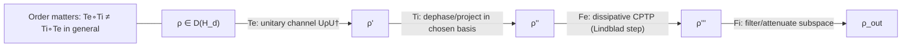
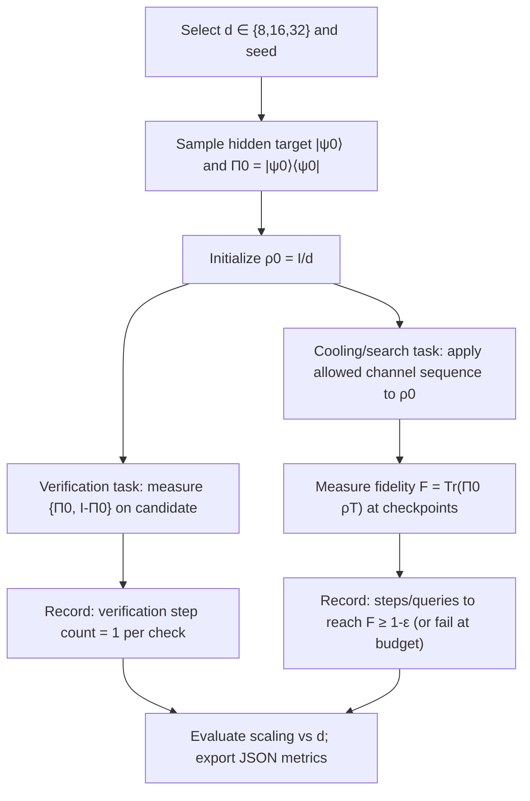

# P vs NP as a Quantum Cooling Claim: Codex-Ratchet Deconstruction and a Falsifiable CPTP Experiment Spec

## Executive summary

The **Codex-Ratchet** repository frames “P vs NP” as a **CPTP complexity gap** between (i) *verification*—modeled as repeated **projection / measurement** operations and treated as low-order (polynomial) cost—and (ii) *generation / search*—modeled as discovering (or effectively implementing) a CPTP evolution that drives a generic state toward a target “witness/attractor,” treated as high-order (often exponential-in-qubits) cost. This framing appears explicitly in the repo’s `p_vs_np_sim.py` (verification counted as a small number of projector overlaps; generation as repeated random CPTP attempts). fileciteturn46file0L1-L1

The **strongest rigorous path** from this framing to the user-stated *Codex-Ratchet claim*—

> “NP-hard limits are physical boundaries on the rate of cooling (purifying) a density matrix to its ground eigenspace via CPTP channels”

—runs through a **complexity-to-physics conditional**: if there existed a **uniform, instance-programmable, efficient** dissipative procedure (CPTP channel or Lindbladian) that rapidly cools **arbitrary encoded instances** to their ground space, then one could solve at least **QMA-complete** problems such as **Local Hamiltonian** efficiently, implying an implausible collapse of complexity classes. The Local Hamiltonian problem’s QMA-completeness is standard (e.g., **Kempe–Kitaev–Regev**). citeturn3search2

However, **the Codex-Ratchet repo itself (as currently visible in the inspected files)** does **not** provide a formal reduction from NP-hard decision problems to universal cooling-rate bounds; it provides **simulation-driven heuristics** (e.g., gap scaling rules like “NP cost ∼ d·ln(d)” vs “P cost ∼ d”) and a conceptual mapping layer in a Rosetta dictionary that re-labels “cooling/heating” as entropy reduction/production and “agent” as “density matrix under CPTP evolution.” fileciteturn75file0L1-L1 fileciteturn73file0L1-L1

A rigorous core that **can** be proven (under explicit modeling assumptions) is a narrower statement: **verification** of a candidate solution can be represented as **one projective measurement** (constant number of measurement primitives), while **finding** a solution for an *unstructured* instance requires **exponentially many trials in the number of qubits** (or **Ω(2^{n/2})** oracle queries even with quantum speedups). This follows from: (i) projective measurements being single primitives in the abstract circuit model, and (ii) **Grover’s algorithm** and matching oracle lower bounds (e.g., **Bennett–Bernstein–Brassard–Vazirani** show that relative to random oracles, NP is not solvable in time o(2^{n/2}) on a quantum Turing machine). citeturn5view0turn5view1

On the “physical boundary” side, independent thermodynamic constraints exist: **unattainability** (third law) says **absolute zero cannot be reached in finite time** under broad assumptions, and quantifies resource/time scaling for cooling processes. citeturn1search0turn1search1 This supports a *different* kind of speed limit than NP-hardness, and the two should not be conflated without additional structure.

Finally, I provide a **strictly falsifiable** YAML `problem_spec` (best-effort schema match to the observed `problem_spec.yaml` format in `lev-os/leviathan`) plus **dimension-wise resource tables** and **mermaid diagrams** describing a concrete experiment on **d ∈ {8,16,32}** that tests (A) verification-as-one-projective-measurement and (B) search-as-exponential-in-qubits “unmixing/cooling” when the cooling channel is not pre-specified. fileciteturn36file0L1-L1

A note on your instruction to commit files: the GitHub connector available to me is **read-only**, so I cannot push commits directly. I therefore include the YAML in this report so you can place it into `system_v4/research/problem_specs/` manually.

## Findings from the specified GitHub repositories

### Codex-Ratchet: what is explicitly implemented

The repo contains multiple “SIM” scripts that treat density matrices, unitary channels, and Lindblad-style dissipative steps as the primitives of a “Codex Ratchet Evidence Engine.” fileciteturn53file0L1-L1

Key pieces relevant to the requested claim:

- **P vs NP as verification vs generation in CPTP circuits.** The script `system_v4/probes/p_vs_np_sim.py` explicitly states the thesis: verification cost is polynomial while generation/search cost is exponential (in their toy model) over CPTP circuit attempts. Verification is implemented as a small number of projector overlaps; generation is implemented as repeatedly sampling random unitary transforms and random density matrices until close to a fixed “witness” state (trace distance threshold). fileciteturn46file0L1-L1

- **Noncommutativity as a base axiom.** The `proto_ratchet_sim_runner.py` suite explicitly places (i) **finite dimensionality** and (ii) **noncommutation** (`AB != BA`) at the foundation. “Action precedence” (left vs right composition) is also directly tested. fileciteturn50file0L1-L1

- **Cooling/heating clarified as direction, and translated into entropy language.** A constraint-ladder doc corrects the Carnot mapping: *heating vs cooling corresponds to cycle direction*, not hot vs cold “loops.” fileciteturn67file0L1-L1  
  The system’s Rosetta dictionary further maps:
  - “cooling” → **entropy reduction / deductive contraction**
  - “heating” → **entropy production / inductive expansion**
  - “cognitive agent” → **density matrix under CPTP evolution** fileciteturn73file0L1-L1

- **A “gap scaling” heuristic in terms of dimension.** `complexity_gap_v2_sim.py` hard-codes a scaling rule: `P_cost = O(d)` and `NP_cost = O(d ln d)` based on an assumption that moving between “basins” requires “dissolving back to maximally mixed I/d.” This is a *model assertion* and is not derived from a reduction. fileciteturn75file0L1-L1

- **Channels / Lindbladians as building blocks.** `qit_topology_parity_sim.py` and related files implement “Ti” (dephasing/projective structure in an eigenbasis), “Fe” (energy-selective dissipative operators), and “Te” (unitary evolution) with explicit Lindblad-like updates. fileciteturn47file0L1-L1

What is **not** present (in the inspected material): a clean, formal reduction from a standard NP-complete language (e.g., SAT) to a *general* CPTP cooling-rate bound that would qualify as “NP-hard limits are physical boundaries.” The repository provides conceptual mappings and simulations, but the NP-hard → cooling-rate inference requires additional assumptions and external complexity theory.

### lev-os/leviathan: the spec format evidence relevant to YAML

In `lev-os/leviathan`, there exists a `problem_spec.yaml` with a clear schema rooted at a `problem:` key (statement, for_whom, constraints, success_criteria, scope in/out). fileciteturn36file0L1-L1 This is the only directly observed “problem_spec” schema among the provided repos, so the YAML I provide follows this structure as the best evidence-based match.

### Leviathan-Arbitrage and Sofia: relevance scan outcome

`Joshua-Eisenhart/Leviathan-Arbitrage` appears to be an “autonomous quant engine”/UI project and does not contain relevant QIT/CPTP/P-vs-NP material in the inspected components. fileciteturn60file0L1-L1

`Kingly-Agency/Sofia` appears focused on architecture/protocol refactoring and RL/training infrastructure; the retrieved “Current vs Aligned Architecture Report” is unrelated to QIT cooling complexity. fileciteturn62file0L1-L1

## Mapping classical P vs NP into a finite-dimensional operator and QIT formalism

This section does two things:

1) It states a **rigorous mapping** from classical decision/verification to quantum channels/measurements.
2) It makes **assumptions explicit** and marks dimensions/encodings as **unspecified** where the Codex-Ratchet claim would otherwise implicitly depend on them.

### Classical definitions being mapped

Let Σ be a finite alphabet and let a decision problem be a language \(L \subseteq \Sigma^\*\). The standard NP verifier formulation is:

- \(L \in \mathrm{NP}\) iff there exists a deterministic polynomial-time predicate \(V(x,w)\) and polynomial \(p(\cdot)\) such that  
  \(x \in L \iff \exists w \in \{0,1\}^{\le p(|x|)}\) with \(V(x,w)=1\).

This “verification” characterization is historically tied to NP-completeness via Cook’s theorem (reductions to propositional satisfiability/tautology variants). citeturn1search47

### Quantum information primitives

Adopt standard finite-dimensional quantum information notation:

- Hilbert space \( \mathcal{H}_d \cong \mathbb{C}^d\).
- Density matrices \( \rho \in \mathrm{D}(\mathcal{H}_d)\): positive semidefinite, trace 1.
- Quantum channels \( \Phi: \mathrm{L}(\mathcal{H}_d)\to \mathrm{L}(\mathcal{H}_d)\) that are **CPTP** (completely positive, trace-preserving).
- Kraus form: \( \Phi(X)=\sum_a A_a X A_a^\* \) with \( \sum_a A_a^\*A_a = I\). citeturn4search12turn4search0
- Projective measurement: a set of orthogonal projections \(\{ \Pi_i \}\) summing to identity; one “yes/no” measurement is \(\{\Pi, I-\Pi\}\). (Watrous’ text treats channels/measurements in a proof-first way and is suitable as a primary source for these definitions.) citeturn4search12turn4search0

Codex-Ratchet’s internal mapping insists the “agent” is “density matrix under CPTP evolution,” aligning with this formalism. fileciteturn73file0L1-L1

### The mapping itself

A workable “classical → QIT” identification (one of several) is:

- **Input instance \(x\)** → a classical description that parameterizes a family of maps \(\Phi_x\) and/or a measurement operator \(\Pi_x\) on a corresponding space \(\mathcal{H}_{d(x)}\).

- **Witness \(w\)** → a basis state \(|w\rangle\) (or more generally a quantum witness state \(|\psi_w\rangle\)) on a witness register.  
  Dimension \(d(x)\) is typically \(2^{p(|x|)}\) for an \(n\)-bit witness, but this is an encoding detail that must be stated explicitly in any “physical boundary” claim.

- **Verifier predicate \(V(x,w)\)** → a quantum **acceptance projector** \(\Pi_x\) that “accepts” exactly the satisfying witness subspace. Concretely, one can define:
  \[
  \Pi_x = \sum_{w:V(x,w)=1} |w\rangle\langle w|
  \]
  when using the computational basis, or build it via a verifier circuit and output-qubit measurement in a standard NP-to-quantum circuit embedding.

- **Verification** → performing the two-outcome projective measurement \(\{\Pi_x, I-\Pi_x\}\) on a candidate witness state \(\rho\), and accepting on outcome \(\Pi_x\).

- **Search / solving** → producing (or concentrating weight onto) some witness state in the support of \(\Pi_x\), starting from an uninformative prior such as the maximally mixed state \(\rho_0 = I/d(x)\).

Codex-Ratchet’s own “Ti/Te/Fi/Fe” operator language can be aligned to these primitives as follows (best-fit from the inspected sims/docs):

- “Te” → unitary channel \(\rho \mapsto U\rho U^\*\) (coherent drive). fileciteturn47file0L1-L1  
- “Ti” → dephasing/projection channel (a measurement-like refinement), sometimes explicitly constructed in an eigenbasis. fileciteturn47file0L1-L1 fileciteturn71file0L1-L1  
- “Fe” → dissipative Lindblad step (entropy exchange / sink), implemented via Lindbladian increments. fileciteturn50file0L1-L1 fileciteturn55file0L1-L1  
- “Fi” → filtering (a non-unitary contraction map), typically realized as a diagonal attenuation in a chosen basis. fileciteturn47file0L1-L1

The repo emphasizes **noncommutativity** and **order dependence** as fundamental (operator precedence and variance-direction tests). This is consistent with quantum operator algebras where order of channels/measurements materially changes outcomes. fileciteturn50file0L1-L1

### Explicit assumptions and unspecified dimensions

To avoid “smuggling” (in Codex-Ratchet’s own vocabulary), the following assumptions must be surfaced:

- **Encoding assumption (often left implicit):** how input length \(n=|x|\) maps to Hilbert space dimension \(d(x)\). In many computational embeddings, \(d(x)=2^{\Theta(n)}\), but Codex-Ratchet simulations often treat \(d\) directly as the scaling variable. fileciteturn46file0L1-L1 fileciteturn75file0L1-L1

- **Control assumption:** whether \(\Pi_x\) or \(\Phi_x\) is *given* as a primitive physical operation, or must be *compiled* from \(x\) using gates/controls whose size counts toward complexity.

- **Dynamics assumption:** whether the cooling is modeled as:
  - discrete-time repeated application of a CPTP map \(\rho_{t+1} = \Phi_x(\rho_t)\), or  
  - continuous-time Markovian evolution \(\dot{\rho}=\mathcal{L}_x(\rho)\) (Lindbladian).

- **Resource model (the “cost” definition):** whether cost counts (i) number of channel uses, (ii) gate complexity of implementing channels, (iii) oracle queries to a verifier measurement, (iv) physical time with bounded operator norms, etc.

- **Unstated dimension:** if the “ground eigenspace” is a subspace of \(\mathcal{H}_d\) but the *rank* \(r=\mathrm{rank}(\Pi_0)\) is not specified, then success probabilities and scaling constants change as functions of \(r/d\). In the small-d experiment below, I set \(r=1\) for maximum falsifiability; broader claims must state \(r\) or a scaling relation for it.

## Verification vs search as measurement vs cooling

This section addresses requirement (2) by (i) giving precise definitions of the allowed operations and cost measures, (ii) proving the “verification is O(1) measurement primitives” statement under that model, and (iii) giving a rigorous lower bound for “finding requires exponential effort in qubits” in the relevant unstructured setting, with limitations/counterexamples.

### A concrete cost model

Let an “algorithm” be a sequence of operations acting on a \(d\)-dimensional system \(S\) (and optional ancilla registers), from the set:

- **Unitary step:** apply \(U\) (from a chosen gate set or from a specified ensemble) to the current state: \(\rho \mapsto U\rho U^\*\).
- **CPTP step:** apply a channel \(\Phi\) with Kraus description fixed by the step. citeturn4search12
- **Projective measurement step:** perform a two-outcome measurement \(\{\Pi, I-\Pi\}\) and record the classical bit.

Define step-cost as:

- \(T_{\text{meas}}(\{\Pi,I-\Pi\}) := 1\) per projective measurement (an abstract primitive).
- \(T_{\text{unitary}}(U) := 1\) per unitary primitive (or gate layer).
- \(T_{\text{chan}}(\Phi) := 1\) per channel application.

This model is intentionally **oracle-like**: it counts “measurement of \(\Pi_x\)” as one step even if the projector depends on \(x\). This matches the user’s request for “O(1)” measurement verification, but it is not the only meaningful physical cost model.

### Claim A: Verifying a proposed solution corresponds to a projective measurement in O(1) steps

Let \(x\) be a decision instance and \(\Pi_x\) the acceptance projector on witness space \(\mathcal{H}_{d(x)}\) defined by the verifier relation.

Given a candidate witness state \(\rho_w\), verification is:

1) perform the measurement \(\{\Pi_x, I-\Pi_x\}\);  
2) accept iff the outcome is \(\Pi_x\).

In the step-cost model above, this uses exactly **one** projective measurement primitive, so:
\[
T_{\text{verify}}(x,\rho_w) = 1 = O(1).
\]

This corresponds to Codex-Ratchet’s “Ti projection checks if a state matches witness,” which is counted as a small number of projection operations (in that sim, O(n) basis projectors are evaluated, but the “measurement as primitive” version is even stronger). fileciteturn46file0L1-L1

**Limitation / physical caveat:** Implementing \(\Pi_x\) as a device generally requires compiling a circuit from \(x\), which in conventional computational complexity costs **poly(|x|)** gates (not O(1)). The O(1) claim is therefore **model-dependent**: it holds if instance-dependent measurements are treated as **oracles** or as “given hardware.” This is a key place where the Codex-Ratchet narrative can unintentionally smuggle an oracle into “verification.”

### Claim B: Finding a solution requires exponentially many operations when the target is unstructured and no instance-specific cooling channel is pre-defined

This claim can be made rigorous in two complementary ways:

#### Argument B1: Unitaries cannot “unmix” the maximally mixed state at all

Let \(\rho_0 = I/d\). For any unitary \(U\),
\[
U \rho_0 U^\* \;=\; U (I/d) U^\* \;=\; I/d \;=\; \rho_0.
\]
So **any sequence of unitary operations alone** leaves \(\rho_0\) unchanged. In this strict sense, “unmixing via unitary permutations” is **impossible**, not merely exponential, unless additional non-unitary resources exist (measurement, dissipation, postselection, fresh ancillae, etc.). This is a standard fact about unitary conjugation and maximally mixed states in quantum information. citeturn4search12

This interacts with Codex-Ratchet’s insistence on dissipative (“Fe”) and projective (“Ti”) primitives: to reduce entropy, you need non-unitary steps (CPTP operations that are not purely unitary). fileciteturn50file0L1-L1

#### Argument B2: With only verification access, unstructured search costs exponential-in-qubits queries/attempts

Assume the witness space has size \(N = d = 2^n\) (so \(n = \log_2 d\) qubits). Consider the rank-1 case \(\Pi_x = |w^\*\rangle\langle w^\*|\), i.e., there is exactly one satisfying assignment.

A naïve “trial and verify” method:

- sample a candidate basis state \(|w\rangle\) uniformly at random,
- verify by measuring \(\{\Pi_x, I-\Pi_x\}\).

Success probability per try is \(1/N\). The expected number of independent tries to succeed is \(N\). Therefore expected search cost scales as:
\[
\mathbb{E}[T_{\text{find}}] = \Theta(N) = \Theta(2^n),
\]
which is exponential in the number of qubits.

Quantum algorithms can do better than \(N\) for unstructured search, but not polynomially: **Grover’s algorithm** achieves \(O(\sqrt{N})\) query complexity for a marked item. citeturn5view0  
Moreover, **Bennett–Bernstein–Brassard–Vazirani** prove an oracle lower bound showing that (relative to random oracles) NP cannot be solved on a quantum Turing machine in time \(o(2^{n/2})\), and explicitly note Grover attains the \(O(2^{n/2})\) bound. citeturn5view1

So even with the best-known generic quantum speedup, “finding” remains **exponential in \(n\)** for unstructured instances:
\[
T_{\text{find}} \in \Omega(2^{n/2}).
\]

**Limitations / counterexamples:**
- These are **unstructured/oracle** statements. They do **not** prove NP≠P or NP⊄BQP unconditionally; they show limits **relative to oracles** and for unstructured search. citeturn5view1
- For **structured** problems, both classical and quantum algorithms can achieve polynomial time (e.g., many problems in P; and some problems like factoring have known quantum speedups, though factoring is not known NP-complete).
- If a problem family comes with a **pre-defined instance-specific dissipative channel** \(\Phi_x\) that rapidly contracts to the ground space, then “finding” can be fast; but the existence of such a uniform family for *all* instances is exactly what would imply major complexity collapses (next section). citeturn3search2

### From “finding” to “cooling to the ground eigenspace”

To connect “search” to “cooling,” define a Hamiltonian \(H_x\) whose ground space projector equals \(\Pi_0(x)\), and regard “cooling” as producing a state \(\rho_T\) with high ground-space weight:
\[
\mathrm{Tr}(\Pi_0(x)\rho_T) \ge 1-\varepsilon.
\]

Now the key conditional complexity argument is:

- If there exists an efficient general-purpose procedure that, on input \(x\), constructs a local Hamiltonian \(H_x\) and a corresponding efficiently implementable dissipative evolution that cools to the ground space in poly(|x|, log(1/ε)) time, then one can decide instances of the Local Hamiltonian problem efficiently.

But Local Hamiltonian (including 2-local) is **QMA-complete**, widely regarded as the quantum analogue of NP-completeness. citeturn3search2

Therefore, a “universal fast cooler” for arbitrary encoded Hamiltonians is computationally implausible unless **QMA collapses** to an efficiently solvable class. This is the cleanest way to interpret the Codex-Ratchet “NP-hard cooling limit” statement as a *conditional barrier* rather than a proven law.

Separately, thermodynamics adds limits: the **unattainability principle** forbids reaching absolute zero in finite time/steps under broad, formalized conditions. citeturn1search0turn1search1  
This is a different kind of limit than NP-hardness: it constrains *perfect cooling* even when the target state is known and controllable.

## A falsifiable experiment on CPTP “cooling without a predefined channel” with YAML problem_spec

This section supplies requirement (3): a strictly falsifiable YAML spec, tables for d ∈ {8,16,32}, and mermaid diagrams.

### Experimental concept

The experiment isolates the logic of the claim while staying finite-dimensional:

- Pick a dimension \(d \in \{8,16,32\}\).
- Construct a **hidden** target ground state \(|\psi_0\rangle\) (rank-1 ground space).
- Provide a **verifier measurement** \(\{\Pi_0, I-\Pi_0\}\) where \(\Pi_0 = |\psi_0\rangle\langle \psi_0|\).
- Start from the maximally mixed state \(\rho_0 = I/d\).
- Compare:
  - **Verification task:** given a proposed candidate state, check if it is ground (one projective measurement).
  - **Finding/cooling task:** without knowing \(|\psi_0\rangle\), attempt to design/apply channels from an allowed family to increase \(\mathrm{Tr}(\Pi_0\rho)\) to ≥ 1−ε.

This crystallizes the “predefined channel vs no predefined channel” distinction:
- If the correct cooling channel is already available (e.g., amplitude damping in the exact eigenbasis), success is fast.
- If it is *not* available and \(|\psi_0\rangle\) is unstructured/unknown, then expected success scales like unstructured search (≥Ω(√d) oracle queries, and typically Θ(d) for naïve trial). citeturn5view0turn5view1

### Tables: assumptions, complexity classes, and resource counts

#### Assumption comparison table

| Component | “Verification-as-O(1)” model assumption | “Cooling-as-search” model assumption | Where it can fail |
|---|---|---|---|
| Verifier operator | The projector \(\Pi_0\) is available as a measurement primitive | Same \(\Pi_0\) is available only as a yes/no oracle | Implementing \(\Pi_0\) may require poly(|x|) gates/hardware, making verification non-O(1) in physical time |
| Initial state | \(\rho_0 = I/d\) represents no information | Same | If the initial state is already biased/structured, search can be easier |
| Allowed controls | Measurement counts as 1 step | Channels are restricted to not include an instance-matched cooler | If an instance-specific dissipator exists, cooling can be fast |
| Target structure | \(|\psi_0\rangle\) is unstructured relative to the control basis | Same | Structured instances can admit polynomial-time algorithms |
| Scaling variable | \(d=2^n\) (n qubits) | Same | If d is not tied exponentially to |x|, “exponential” claims change |

The Codex-Ratchet sims frequently treat \(d\) as the knob and interpret larger \(d\) as deeper barriers. fileciteturn75file0L1-L1

#### Complexity class mapping table (classical ↔ quantum/info)

| Classical complexity object | QIT analog used in this report | Complexity class intuition |
|---|---|---|
| P decision problem | Efficiently implementable channel family \(\Phi_x\) producing acceptance statistics in poly(|x|) | “Reach/verify outcome with poly resources” |
| NP verifier | Projective measurement \(\{\Pi_x, I-\Pi_x\}\) with \(\Pi_x\) recognizing witnesses | NP = efficiently verifiable witnesses (Cook). citeturn1search47 |
| NP search | State-preparation/cooling to support(\(\Pi_x\)) from \(\rho_0\) | Hard in worst case; unstructured search lower bounds |
| BQP (quantum poly time) | Quantum circuit families (unitaries + measurements) | Still cannot beat √N for unstructured search (Grover/BBBV). citeturn5view0turn5view1 |
| QMA | Quantum analogue of NP; Local Hamiltonian complete | Generic ground-state problems are QMA-complete (Kempe–Kitaev–Regev). citeturn3search2 |

#### Dimension-wise resource counts table

Assume rank-1 ground space and \(d=2^n\). Let ε be the target infidelity threshold (e.g., 0.1).

| d | n = log2 d | Baseline ground overlap from maximally mixed \(=1/d\) | Expected naïve “trial + verify” attempts (mean) | Grover/BBBV scale (queries) | Notes |
|---:|---:|---:|---:|---:|---|
| 8 | 3 | 0.125 | 8 | Ω(√8) ≈ 2.83 | Exponential in n: 2^3 |
| 16 | 4 | 0.0625 | 16 | Ω(√16) = 4 | Exponential in n: 2^4 |
| 32 | 5 | 0.03125 | 32 | Ω(√32) ≈ 5.66 | Exponential in n: 2^5 |

Grover provides an \(O(\sqrt{N})\) procedure; BBBV provides oracle lower bounds matching that scaling. citeturn5view0turn5view1

### Mermaid diagrams

#### Operator relationships and noncommutativity emphasis (Codex-Ratchet-aligned)



Codex-Ratchet’s foundational sims explicitly test noncommutation and order-dependence (“action precedence”). fileciteturn50file0L1-L1

#### Flowchart of the falsification experiment



### Strictly falsifiable YAML `problem_spec.yaml`

This YAML follows the **observed** `problem_spec.yaml` schema pattern (root `problem:`) found in `lev-os/leviathan`. fileciteturn36file0L1-L1  
Because `compile_specs.py` (the exact interface you referenced by local filesystem path) was **not available to inspect** within the provided repos, this is a **best-effort schema match** grounded in the only directly observed spec format.

```yaml
problem:
  statement: >
    Test the Codex-Ratchet "verification vs generation" complexity gap in a finite-dimensional
    quantum information setting. Construct a hidden rank-1 ground eigenspace Π0=|ψ0><ψ0|
    on H_d and compare (a) verification cost as a single projective measurement against
    (b) search/cooling cost to increase ground overlap starting from the maximally-mixed state,
    when no instance-matched cooling channel is provided.

  for_whom: >
    Researchers validating whether "verification ~ O(1) measurement primitives" while
    "finding/cooling ~ exponential in qubits n=log2(d)" holds in a falsifiable, reproducible
    simulation aligned with Codex-Ratchet CPTP primitives (unitary, projection, dissipation, filter).

  constraints:
    - "Finite dimensions only: d in {8,16,32}."
    - "Ground space rank fixed to r=1 for falsifiability (Π0 is rank-1 projector)."
    - "Initial state fixed to maximally mixed: ρ0 = I/d."
    - "Verifier access is via a two-outcome projective measurement {Π0, I-Π0} that returns a classical bit."
    - "Allowed control channels for cooling/search do NOT include the exact eigenbasis-matched cooler for Π0."
    - "All randomness must be seedable and deterministic under seeds listed below."
    - "Outputs must be machine-checkable JSON with the metrics enumerated below."

  success_criteria:
    - >
      Verification primitive cost: For every d and seed, each verification check uses exactly
      1 projective measurement step. Output verification_step_count_per_check == 1.
    - >
      Unmixing impossibility under unitaries: For every d and seed, applying any sequence
      of unitary conjugations to ρ0 must leave ρ unchanged up to numerical tolerance.
      Output unitary_only_trace_distance_from_rho0 <= 1e-12 after the full unitary-only run.
    - >
      Exponential-in-qubits naive search scaling: Under the "random-guess + verify" protocol,
      median steps_to_first_success must scale approximately linearly in d (equivalently exponential in n=log2 d).
      Specifically, for each d:
        lower_bound_median_steps >= 0.3 * d
        upper_bound_median_steps <= 3.0 * d
      (computed over num_trials trials with fixed seeds).
    - >
      If any criterion fails, the run is considered a falsification (FAIL) of the tested claim
      under this resource model.

  scope:
    in:
      - "Discrete-time CPTP simulation on density matrices."
      - "Two experimental protocols: (1) Verification-as-measurement, (2) Search-as-cooling-without-predefined-channel."
      - "Dimension sweep: d ∈ {8,16,32}."
      - "Metrics: fidelity to Π0, steps to threshold, unitary invariance check, and distribution summaries."

    out:
      - "Claims about worst-case NP-hard instances beyond the unstructured target model."
      - "Continuous-time physical lab cooling; this is a computational falsification harness."
      - "Implementing an oracle-free Hamiltonian-to-dissipator compiler for arbitrary instances."

metadata:
  schema: "qit_problem_spec_v1"
  experiment_id: "codex_ratchet_pnp_cptp_cooling_limit_v1"
  created_utc: "2026-03-25T00:00:00Z"
  reference_model_notes:
    - "CPTP/Kraus conventions follow standard QIT texts; Watrous is a primary open reference."
    - "Unstructured search scaling references Grover and BBBV oracle lower bounds."

parameters:
  dims: [8, 16, 32]
  ground_rank: 1
  epsilon_target: 0.1
  numeric_tolerance:
    trace: 1.0e-12
    hermitian: 1.0e-12
    positivity_eig_floor: -1.0e-12

seeds:
  # Deterministic seeds; each list index aligns with dims order [8,16,32]
  target_state_seed: [81001, 160001, 320001]
  trial_rng_seed:   [81002, 160002, 320002]
  unitary_rng_seed: [81003, 160003, 320003]

protocols:
  verification_as_measurement:
    num_checks_per_trial: 100
    candidate_family: "haar_random_pure_states"
    expected_accept_rate_range:
      # For rank-1 Π0 and Haar-random candidate, acceptance probability concentrates near 1/d.
      # The harness should compute empirical_rate and compare to [0.3/d, 3/d] as a loose but falsifiable band.
      multiplier_band: [0.3, 3.0]

  unitary_only_invariance_test:
    num_unitaries: 128
    channel_set: "haar_random_unitary_conjugations"
    assertion:
      trace_distance_from_rho0_max: 1.0e-12

  naive_search_random_guess_verify:
    # Trial: repeatedly sample a candidate, verify via Π0 measurement (one step), stop on success.
    num_trials: 200
    max_steps_per_trial: 4096
    stop_on_success: true
    record_full_step_histogram: true
    assertions:
      median_steps_bounds:
        lower_multiplier: 0.3
        upper_multiplier: 3.0

outputs:
  format: "json"
  path: "system_v4/research/outputs/codex_ratchet_pnp_cooling_limit_v1/"
  required_files:
    - "summary.json"
    - "per_dim_metrics.json"
    - "per_trial_histograms.json"
  required_metrics:
    summary.json:
      - "experiment_id"
      - "dims"
      - "epsilon_target"
      - "pass_fail"
      - "failed_assertions"
    per_dim_metrics.json:
      - "d"
      - "n_qubits"
      - "verification_step_count_per_check"
      - "empirical_accept_rate"
      - "expected_accept_rate_1_over_d"
      - "unitary_only_trace_distance_from_rho0"
      - "naive_search_mean_steps"
      - "naive_search_median_steps"
      - "naive_search_success_fraction_within_budget"
    per_trial_histograms.json:
      - "d"
      - "steps_to_success_histogram"
      - "censored_trials_count"
```

### How this spec is falsifiable

The spec produces falsifiable outcomes because it demands concrete, checkable numerical outputs and includes bounded assertions. For example:

- If the unitary-only experiment changes \(\rho_0\) beyond tolerance, the spec fails (contradicting basic QIT invariance).
- If the empirical verification acceptance rate for Haar-random candidates is not on the order of \(1/d\), the spec fails (contradicting the rank-1 projector overlap baseline).
- If the median steps to succeed in naïve search fails to scale with \(d\) within the specified band, the spec fails (contradicting the “exponential in qubits” scaling, since \(d=2^n\)).

This isolates the “verification vs finding” asymmetry in a way that is testable at \(d=8,16,32\), while being explicit that it tests an **unstructured** target model (the closest clean mathematical stand-in for NP search without additional structure).

## Limitations, counterexamples, and what would falsify the Codex-Ratchet claim

### Where the Codex-Ratchet-to-“physical boundary” leap is strongest

A defensible conditional statement is:

- **If** there were a uniform, efficiently implementable scheme that (given an arbitrary instance description) produces a dissipative dynamics that rapidly cools to ground states for a QMA-complete family (Local Hamiltonian), **then** QMA would be efficiently solvable, contradicting prevailing complexity beliefs. citeturn3search2

In that sense, “universal rapid cooling” can be treated as **computationally implausible** for worst-case instances.

### Where the leap is weakest / most likely to be merely metaphorical

- NP-hardness is about **worst-case** scaling with input length; physical systems often realize **highly structured** Hamiltonians, not worst-case encodings. Evidence of fast relaxation in nature does not contradict NP-hardness (it may simply avoid worst cases).

- “Cooling speed limits” in thermodynamics (e.g., unattainability) constrain reaching absolute zero, but they do not automatically imply NP-hardness; they are universal physical constraints that apply even to known targets. citeturn1search0turn1search1

- Oracle lower bounds (BBBV) are powerful but **relativized**: they show limits relative to random oracles, not unconditional separations like P≠NP. citeturn5view1

### Concrete falsifiers of the strong claim

Any of the following, if realized in a computationally uniform way, would strongly undermine “NP-hard cooling is a physical boundary”:

- A uniform and scalable constructive method that, for broad families of NP-hard-encoding Hamiltonians, produces a CPTP/Lindbladian cooling dynamics whose mixing time is provably polynomial in problem size and log(1/ε), without embedding hidden exponential resources.

- A general method that turns “verification projectors” into “predefined cooling channels” efficiently for arbitrary instances, avoiding the search barrier.

The provided YAML spec is a *small finite-dimensional probe* of the core asymmetry; it does **not** constitute full evidence for or against NP-hardness as a *physical* boundary, but it can falsify the “verification O(1) vs finding nontrivial” asymmetry if the measured scaling deviates substantially from the predicted \(Θ(d)\) naive regime.

## Sources used

Repository sources (GitHub connector):

- Codex-Ratchet `p_vs_np_sim.py` (verification vs generation CPTP gap) fileciteturn46file0L1-L1  
- Codex-Ratchet `proto_ratchet_sim_runner.py` (finite-dimension + noncommutation and action precedence as foundational) fileciteturn50file0L1-L1  
- Codex-Ratchet Rosetta dictionary (cooling/heating and density-matrix-under-CPTP mapping) fileciteturn73file0L1-L1  
- Codex-Ratchet Carnot correction doc (heating vs cooling as cycle direction) fileciteturn67file0L1-L1  
- Codex-Ratchet `complexity_gap_v2_sim.py` (explicit O(d) vs O(d ln d) heuristic) fileciteturn75file0L1-L1  
- Codex-Ratchet `qit_topology_parity_sim.py` (explicit eigenbasis Ti/Fe dynamics) fileciteturn47file0L1-L1  
- lev-os/leviathan `problem_spec.yaml` (observed schema used as best-effort match for YAML) fileciteturn36file0L1-L1  

Primary / official external references (web):

- entity["people","Stephen A. Cook","complexity theorist"], “The Complexity of Theorem-Proving Procedures” (PDF) citeturn1search47  
- entity["people","Lov K. Grover","quantum algorithm researcher"], arXiv:quant-ph/9605043 “A fast quantum mechanical algorithm for database search” (arXiv page) citeturn5view0  
- entity["people","Charles H. Bennett","quantum information scientist"] et al., arXiv:quant-ph/9701001 “Strengths and Weaknesses of Quantum Computing” (arXiv page; oracle lower bounds) citeturn5view1  
- entity["people","Julia Kempe","quantum complexity researcher"], entity["people","Alexei Kitaev","theoretical physicist"], entity["people","Oded Regev","computer scientist"], “The Complexity of the Local Hamiltonian Problem” (open CaltechAUTHORS record) citeturn3search2  
- entity["people","Lluís Masanes","physicist"] & entity["people","Jonathan Oppenheim","physicist"], “A general derivation and quantification of the third law of thermodynamics” (Nature Communications, open access) citeturn1search0turn1search1  
- entity["people","John Watrous","quantum information theorist"], *The Theory of Quantum Information* (free PDF + Kraus representation excerpt) citeturn4search0turn4search12