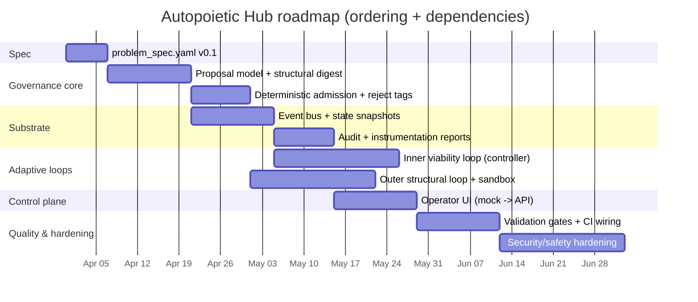

# Designing a problem_spec.yaml for an Autopoietic Hub

## Executive summary

An “Autopoietic Hub” can be made *concise yet implementable* if the specification treats **adaptation as a governed, testable control-plane process** rather than a free-form “self-evolving” runtime. Across the four referenced repositories, three recurring implementation-ready motifs emerge:

First, **determinism and anti-gaming mechanisms**: *Codex-Ratchet* formalizes “real change” via canonicalization + SHA-256 structural digests and explicitly rejects ID-only churn, providing a blueprint for auditable self-modification and reproducible evaluation. fileciteturn16file0L1-L1 fileciteturn17file0L1-L1

Second, **control-plane boundaries + measurable gates**: *lev-os/leviathan* demonstrates how to define control-plane scope, ports/interfaces, fail-closed approval semantics, BDD scenarios, and numeric validation gates in a way that is operationally enforceable (not aspirational). fileciteturn22file0L1-L1 fileciteturn24file0L1-L1

Third, **workspace/config cascades + observability-first UI**: *Sofia* shows a pragmatic pattern for “system self-description” via a root config file with workspace overrides, run isolation, and a dashboard/workspace browser scaffold that can be built UI-first and integrated incrementally. fileciteturn34file0L1-L1 fileciteturn35file0L1-L1

In the academic lineage, the “Autopoietic Hub” framing is most consistent when interpreted as: (a) a system with a maintained **organizational closure** (the hub’s internal process network and invariants) coupled to (b) an environment through **structural coupling**, and stabilized via (c) **adaptive control** and (d) sufficient internal regulatory variety to counter external disturbances. citeturn0search1turn0search5turn2search51turn1search0

Unspecified details that materially affect implementability remain **unspecified in the prompt** (and are flagged as such in the proposed YAML), including: target runtime/deployment environment, workload scale, latency/throughput SLOs, data classification (PII/PHI/regulated), and allowable autonomy level (human-in-the-loop vs. autonomous execution). These omissions should be resolved early because they drive security posture, evaluation rigor, and safe operating envelopes.

## Evidence from the four GitHub repositories

### Repository comparison table

| Repo | Visibility | Languages / runtimes (evidence) | License | Key artifacts relevant to a problem_spec.yaml | Relevance to Autopoietic Hub design |
|---|---:|---|---|---|---|
| Joshua-Eisenhart/Leviathan-Arbitrage | Public | TypeScript/React + Vite + Express; integrates Google GenAI SDK fileciteturn7file0L1-L1 | Unspecified (no LICENSE found at root during review) fileciteturn6file0L1-L1 | `README.md`, `package.json`, UI app scaffold and local run instructions fileciteturn6file0L1-L1 fileciteturn7file0L1-L1 | Provides a minimal “operator UI” pattern for an AI-integrated dashboard; useful as a reference for a thin control-plane surface. fileciteturn6file0L1-L1 |
| lev-os/leviathan | Private | TypeScript monorepo with `pnpm` workspaces + extensive specs/design + automated test gates fileciteturn31file0L1-L1 | MIT fileciteturn29file0L1-L1 | `docs/specs/spec-cms-control-plane.md`, `docs/design/design-sdlc-autodev-control-plane.md`, `.lev/validation-gates.yaml`, root `package.json` fileciteturn22file0L1-L1 fileciteturn23file0L1-L1 fileciteturn24file0L1-L1 fileciteturn31file0L1-L1 | Strongest “spec-as-executable contract” example: explicit boundaries, ports, fail-closed approvals, lifecycle gates, and deterministic routing discipline—directly transferable to an Autopoietic Hub control plane. fileciteturn22file0L1-L1 |
| Joshua-Eisenhart/Codex-Ratchet | Public | Python + JSON schemas + heavy spec documents (control-plane “bundle” artifacts) fileciteturn18file0L1-L1 fileciteturn19file0L1-L1 | MIT fileciteturn28file0L1-L1 | `ZIP_PROTOCOL_v2.md`, `STRUCTURAL_DIGEST_v1.md`, `A1_STRATEGY_v1.md`, `INSTRUMENTATION_REPORT_v1.schema.json` fileciteturn17file0L1-L1 fileciteturn16file0L1-L1 fileciteturn18file0L1-L1 fileciteturn19file0L1-L1 | Best source for governance-grade *determinism*, *anti-ID-churn*, *admission* vs *transport* separation, and measurable instrumentation signals (e.g., “digest pressure”). These map cleanly onto safe self-organization and adaptive change control. fileciteturn16file0L1-L1 |
| Kingly-Agency/Sofia | Private | Python 3.10+ (RL + FastAPI + websocket tooling implied by deps), plus a UI/dashboard layer in TS/React fileciteturn32file0L1-L1 fileciteturn35file0L1-L1 | MIT fileciteturn30file0L1-L1 | `.sofia.yaml` config cascade root defaults, detailed architecture + success criteria plans, `WorkspaceBrowser.tsx` UI-first incremental scaffolding fileciteturn34file0L1-L1 fileciteturn26file0L1-L1 fileciteturn35file0L1-L1 | Practical patterns for: config cascading (root→workspace), run isolation, “workspace browser” UI scaffolding, and instrumentation/health monitoring framing—useful for making the Hub operable and observable, not just theoretically self-organizing. fileciteturn34file0L1-L1 |

### Cross-repo module and pattern matrix

| Pattern needed for Autopoietic Hub | Where it appears (repo artifact) | What to reuse (how it informs problem_spec.yaml) |
|---|---|---|
| Deterministic change identity (“real change” vs cosmetic change) | *Codex-Ratchet* `STRUCTURAL_DIGEST_v1.md` fileciteturn16file0L1-L1 | Encode a normative structural digest rule for adaptation proposals; measure and alert on ID-churn. |
| Deterministic transport + “no implicit defaults” | *Codex-Ratchet* `ZIP_PROTOCOL_v2.md` fileciteturn17file0L1-L1 | Treat missing required fields as invalid; specify canonical serialization invariants for audit and replay. |
| Strategy objects with budgets + diversity constraints | *Codex-Ratchet* `A1_STRATEGY_v1.md` fileciteturn18file0L1-L1 | Represent adaptation as a bounded set of proposals (targets + alternatives), with explicit budget and structural diversity requirements. |
| Instrumentation schema emphasizing “digest pressure” | *Codex-Ratchet* `INSTRUMENTATION_REPORT_v1.schema.json` fileciteturn19file0L1-L1 | Add monitoring requirements: counts, reject tags, unique digest counts, and an “id_churn_signal” concept. |
| Control-plane boundary discipline + fail-closed governance | *lev-os/leviathan* CMS control plane spec fileciteturn22file0L1-L1 | Write the Hub spec as a control plane with explicit owned vs not-owned concerns, and require fail-closed behavior when approvals or required state are missing. |
| Validation gates as a first-class quality contract | *lev-os/leviathan* `.lev/validation-gates.yaml` fileciteturn24file0L1-L1 | Include measurable gates (static/contract/smoke), and make them part of success criteria + roadmap completion. |
| Scheduler vs worker loop separation (truthful exit reasons) | *lev-os/leviathan* SDLC autodev control plane design fileciteturn23file0L1-L1 | Specify two loops: an inner bounded control loop (per-task regulation) and an outer scheduler loop (structural adaptation), with explicit exit reasons and budgets. |
| Config cascade + workspace-first UI scaffold | *Sofia* `.sofia.yaml` and `WorkspaceBrowser.tsx` fileciteturn34file0L1-L1 fileciteturn35file0L1-L1 | Encode an override model in the spec (system→project→workspace→env). Provide an operator-facing workspace browser concept for introspection and safe edits. |
| Minimal web UI + LLM integration scaffold | *Leviathan-Arbitrage* README/package dependencies fileciteturn6file0L1-L1 fileciteturn7file0L1-L1 | Use as a reference for “thin UI surface” requirements: local dev instructions, environment-based provider keying, simple serving. |

### Primary-source links referenced

```text
GitHub repos:
- https://github.com/Joshua-Eisenhart/Leviathan-Arbitrage
- https://github.com/lev-os/leviathan
- https://github.com/Joshua-Eisenhart/Codex-Ratchet
- https://github.com/Kingly-Agency/Sofia

Academic / primary sources:
- https://doi.org/10.1007/978-94-009-8947-4  (Autopoiesis and Cognition, 1980)
- https://doi.org/10.1016/0303-2647(74)90031-8  (Autopoiesis paper, 1974)
- https://ashby.info/Ashby-Introduction-to-Cybernetics.pdf  (Ashby, 1956; requisite variety)
- https://portal.research.lu.se/en/publications/adaptive-control-2-ed/  (Åström & Wittenmark, 1995)
- https://viterbi-web.usc.edu/~ioannou/Robust_Adaptive_Control.htm  (Ioannou & Sun, 1996; author-hosted copy)
```

## Conceptual foundations and design implications

### Translating autopoiesis into an engineering spec

The term **autopoiesis** was introduced in biology to characterize living systems as *self-producing* unities; a canonical formulation describes a network of processes that produces components which recursively regenerate the network and constitute the system as a unity. citeturn0search1turn0search5 In the original 1974 framing (with a minimal computational model), autopoiesis is presented as a characterization of living organization, illustrated via simulation. citeturn0search0turn3view0turn4view0

Design implication for an “Autopoietic Hub”: the spec must define what counts as the Hub’s **organizational closure** (core invariants, system boundary, canonical state) and what is merely **structural coupling** to environment (inputs, actuators, external dependencies). Without this boundary, “self-organization” collapses into uncontrolled self-modification.

A practical formalization for engineering contexts is to treat autopoiesis and self-organization as **constraints on organization, not on components**—i.e., the identity is preserved by maintaining invariant relations while allowing structural parameters to change. This is consistent with formal modeling work that emphasizes organization over component specifics. citeturn0search2

### Translating self-organization into measurable constraints

In cybernetics, self-organization can be approached via principles that regulate large varieties of possible states. A central constraint is the **law of requisite variety**: “only variety can destroy variety,” meaning a regulator needs sufficient internal variety to counter disturbances. citeturn2search51 This gives a concrete requirement for the Hub: its control system must have enough modeled “response repertoire” (policies, fallbacks, safe modes) to handle the variety of environmental conditions it claims to operate in.

Self-organization is also treated explicitly in the cybernetics literature as a subject of formal analysis (e.g., Ashby’s “Principles of the Self-Organizing System”). citeturn1search10turn2search2 For engineering, the key is not to romanticize emergence, but to **specify the mechanism that updates parameters/structure**, and then to constrain it with budgets, correctness gates, and monitoring.

### Translating adaptive control into an implementable Hub loop

Adaptive control focuses on controllers that adjust in response to uncertainty and change (e.g., estimation, self-tuning regulators, model-reference adaptive control), and emphasizes implementation considerations and when adaptive techniques are appropriate. citeturn1search0 Robust adaptive control emphasizes guaranteeing robustness properties under unmodeled dynamics and disturbances, and exists as a mature body of work with explicit stability/robustness goals. citeturn1search18turn1search5

Engineering implication: the Hub’s “adaptive” part must be specified as (a) an **inner control loop** that maintains viability variables (stability, error rates, resource budgets), and (b) an **outer structural adaptation loop** that proposes and validates changes. The Hub should not rely on a single monolithic loop; it should declare exit reasons, budgets, and fail-safe modes, mirroring the “scheduler vs worker loop” separation seen in lev-os/leviathan design practice. fileciteturn23file0L1-L1

## Problem statement and objectives for the Autopoietic Hub

### Concise problem statement

The Autopoietic Hub is a system that continuously **maintains**, **regulates**, and **safely adapts** a network of internal processes (agents/services/workflows) while interacting with an external environment (tasks, users, tools, data sources). The current gap is that most “self-organizing” agent systems lack (1) explicit boundaries, (2) deterministic governance of change, (3) measurable success criteria, and (4) operational tooling for safe iteration.

This spec therefore defines the Hub as a **control plane** that governs the Hub’s own adaptive evolution (auth, approvals, scheduling, proposal validation) while keeping the operational state and external dependencies out of the control-plane’s canonical ownership—mirroring established control-plane boundary semantics. fileciteturn22file0L1-L1

### Objectives

The specification should be written so a team can build the Hub without reinterpretation. The minimum objectives implied by the combined repo evidence are:

The Hub must provide an operator-facing control plane that routes actions, enforces approvals, schedules changes, and renders an aggregated view without claiming ownership of downstream canonical state. fileciteturn22file0L1-L1

The Hub must represent self-modification/adaptation as **structured proposals** (not ad-hoc edits) and enforce “real change” via deterministic structural digests and canonicalization rules to prevent cosmetic churn and to enable reproducible evaluation. fileciteturn16file0L1-L1 fileciteturn17file0L1-L1

The Hub must implement bounded adaptive loops (inner vs outer), with explicit budgets and exit reasons so “autonomy” can be safely operated, interpreted, and tested. fileciteturn23file0L1-L1

The Hub must be observable with a defined instrumentation schema including counts, reject tags, digest pressure, and id churn signals. fileciteturn19file0L1-L1

### Unspecified requirements that must be flagged

The prompt does not specify deployment/runtime targets, performance targets, data sensitivity, or autonomy policy. These are critical “spec holes” because they determine architecture, security controls, and evaluation rigor. The proposed YAML explicitly marks these as UNSPECIFIED rather than guessing.

## System design: components, interfaces, data flows, and constraints

### Required components

The following component set is the smallest coherent implementation that satisfies the repo-derived patterns and the autopoiesis/adaptive-control framing:

**Control-plane surface** (operator UI + API/CLI). This is a thin surface whose job is to render state, accept proposals, and route actions; it should not implement “business logic” for adaptation beyond validation and routing, consistent with lev-os/leviathan’s boundary discipline and gate philosophy. fileciteturn22file0L1-L1 fileciteturn24file0L1-L1

**Event and state substrate** (event bus + state store + snapshot/digest). This is necessary for replayability and “organizational closure”: internal state transitions must be representable, audit-able, and (where required) deterministic, aligning with deterministic protocol + no-implicit-default principles. fileciteturn17file0L1-L1

**Proposal and validation subsystem**. All structural changes (new workflows, policy updates, module reconfiguration, agent capability changes) should be expressed as proposals with deterministic structural digests, and should be evaluated via validation gates (static/contract/smoke). fileciteturn16file0L1-L1 fileciteturn24file0L1-L1

**Inner (homeostatic) loop**: monitors viability metrics, runs the controller, and applies parameter-level adjustments within pre-approved bounds (setpoints, gains, rate limits). This is the adaptive control core. citeturn1search0turn1search18

**Outer (structural) loop**: proposes candidate structural changes (targets + alternatives), enforces budgets and diversity constraints, runs sandbox simulation/tests, and produces a change package for approval/apply. This mirrors the “strategy with targets/alternatives + budget + diversity_budget” pattern. fileciteturn18file0L1-L1

**Observability and audit**: structured metrics and reports (including digest pressure and reject tags), plus traceable audit logs. fileciteturn19file0L1-L1

**Config cascade / workspace model**: clear precedence order and override system (system → project → workspace → environment variables), so the Hub is self-describing and deterministic under the same inputs. This is supported by lev-os/leviathan’s config governance approach and Sofia’s root/workspace model. fileciteturn24file0L1-L1 fileciteturn34file0L1-L1

### Interfaces and ports

Following the “port” approach shown in lev-os/leviathan, define a narrow interface that captures the control-plane contract (example from CMS control plane). fileciteturn22file0L1-L1 Translating to the Hub implies a port that supports:

- proposal submission (structural change requests)
- approval workflows (fail-closed)
- scheduling (declarative until execution)
- observation/read aggregation (status views)
- execution routing (invoking the inner/outer loops, or external actuation)

This makes “autopoiesis” operational: internal processes can evolve, but only via governed and testable interfaces.

### Data flows

The Hub’s core data flows should be explicit because they define structural coupling and organizational closure.

```mermaid
flowchart LR
  subgraph ENV[Environment]
    E1[Tasks / Requests]
    E2[External Tools & Services]
    E3[Disturbances\n(load, drift, failures)]
  end

  subgraph HUB[Autopoietic Hub]
    CP[Control Plane\n(UI + API/CLI)]
    EB[Event Bus]
    SS[State Store\n+ Snapshots]
    VM[Viability Monitor]
    IC[Inner Controller\n(adaptive control)]
    OS[Outer Structural Loop\n(propose/validate/simulate)]
    PV[Proposal Validator\n+ Gates]
    AU[Audit Log + Metrics]
    CFG[Config/Policy Store\n(cascade)]
  end

  E1 --> CP
  CP --> EB
  EB --> SS
  SS --> VM
  VM --> IC
  IC --> EB

  VM --> OS
  OS --> PV
  PV --> CFG
  CFG --> OS
  PV --> CP

  EB --> AU
  SS --> AU
  PV --> AU
  OS --> AU

  OS -->|approved change| EB
  CP -->|operator approvals| PV

  HUB --> E2
  E3 --> VM
```

This diagram encodes the spec’s critical boundary: the environment provides disturbances and tasks, but adaptation flows through **proposal + validation** rather than ad-hoc mutation (a direct reuse of deterministic governance patterns). fileciteturn16file0L1-L1 fileciteturn24file0L1-L1

### Constraints and invariants

The following constraints are “load-bearing” because they ensure the Hub’s self-organization is safe and measurable rather than mystical:

**No implicit defaults**: missing required spec fields are invalid; the Hub must fail closed rather than guessing, which is explicitly required in deterministic protocol patterns. fileciteturn17file0L1-L1

**Fail-closed approvals**: approval-sensitive actions do not run if approval state is missing/ambiguous, mirroring the control-plane spec pattern. fileciteturn22file0L1-L1

**Structural digest for change identity**: proposals must be structurally compared via canonical normalization and digest; ID-only differences must not count as real change. fileciteturn16file0L1-L1

**Budgeted adaptation**: outer-loop structural changes require explicit budgets and diversity constraints—minimizing overfitting and ensuring the system has enough “variety” to manage variety while remaining bounded. fileciteturn18file0L1-L1 citeturn2search51

**Observable exit reasons and states**: automation loops must distinguish between no-work, dry-run, all-done, budget exhaustion, circuit breaker, etc., because operators need truthful semantics to run autonomy safely. fileciteturn23file0L1-L1

## Measurement: success criteria, evaluation methods, tests, metrics, and monitoring

### Measurable success criteria

A workable problem_spec.yaml should include both *functional* and *control-theoretic* success criteria:

**Governance correctness**
- 100% of structural mutations occur through proposal objects and validation gates (no direct mutation paths).
- Any proposal without required fields is rejected (no implicit defaults), and any proposal lacking approval (when required) is rejected/fail-closed. fileciteturn17file0L1-L1 fileciteturn22file0L1-L1

**Determinism and replayability**
- For deterministic subsystems (proposal digesting, admission decisions, canonicalization), repeated runs over identical inputs produce identical outputs, matching the determinism philosophy of canonical artifact rules. fileciteturn17file0L1-L1

**Anti-gaming / anti-churn**
- “ID churn signal” remains false under normal operations, and unique structural digest counts align with meaningful changes rather than cosmetic changes. fileciteturn19file0L1-L1

**Control stability / viability maintenance**
- Viability metrics remain within defined bounds under disturbances, with bounded overshoot and recovery time. (Exact thresholds are currently UNSPECIFIED and must be supplied for the target workload.) The need for explicit implementation guidance and robustness properties is consistent with adaptive control practice. citeturn1search0turn1search18

### Evaluation methods

A rigorous evaluation plan should mix three layers:

**Conformance testing for governance artifacts**: schema validation, canonicalization tests, digest determinism tests, and reject-tag determinism tests (mirroring spec-style validation outcomes). fileciteturn17file0L1-L1

**Simulation-based evaluation for adaptive behavior**: use a sandbox environment (synthetic disturbances, load shifts, delayed feedback) to verify stability and robustness claims; robust adaptive control literature treats unmodeled dynamics/disturbances as first-class. citeturn1search18turn1search0

**Operator-facing end-to-end trials**: smoke tests that exercise the entire loop via the control plane (submit proposal → validate → approve → schedule → apply → observe). This is consistent with both lev-os/leviathan “smoke gates” and Sofia’s phased UI-first approach (mock→API integration). fileciteturn24file0L1-L1 fileciteturn35file0L1-L1

### Recommended tests and monitoring

The following test/monitoring bundle is a minimal set that directly instantiates repo-derived instrumentation signals:

- **Unit tests**: structural digest computation; canonical JSON serialization; proposal schema validation; reject-tag mapping determinism. fileciteturn16file0L1-L1
- **Integration tests**: end-to-end “proposal pipeline” (submit→validate→apply), with stable trace/audit artifacts.
- **Property-based tests**: determinism invariants: `same input → same digest`, `excluded fields do not affect digest`, `ordering normalization is stable`. fileciteturn16file0L1-L1
- **Monitoring metrics** (inspired by INSTRUMENTATION_REPORT schema): counts of events, proposals, rejects; top reject tags; unique strategy/policy digests; id churn boolean; warnings list. fileciteturn19file0L1-L1
- **Operational dashboards**: a workspace browser / spec explorer to inspect config/policy state and proposal history, aligning with Sofia’s WorkspaceBrowser and Leviathan-Arbitrage style “AI app UI” scaffolds. fileciteturn35file0L1-L1 fileciteturn6file0L1-L1

## Implementation roadmap, security, safety, and ethical considerations

### Roadmap with milestones, effort, and dependencies

Effort levels are qualitative (low/med/high). Duration is intentionally not hard-coded because workload/SLO/runtime constraints are UNSPECIFIED; the Gantt below represents a plausible ordering, not a promise.

| Milestone | Deliverable | Effort | Depends on | Notes |
|---|---|---|---|---|
| Spec hardening | problem_spec.yaml v0.1 + schema validation approach | med | none | Must resolve UNSPECIFIED operational constraints early (deployment, SLOs, data policy). |
| Governance core | Proposal model + structural digest + deterministic admission decisions | high | spec hardening | Reuse structural digest and “no implicit defaults” concepts. fileciteturn16file0L1-L1 |
| Event/state substrate | Event envelope + state snapshots + audit log skeleton | med | governance core | Prioritize replay and observability fixtures. |
| Inner loop | Viability metrics + controller + bounded parameter adjustments | high | event/state | Adaptive control stability work; requires test harness. citeturn1search0turn1search18 |
| Outer loop | Structural adaptation strategy (targets/alternatives) + sandbox simulation | high | governance core + event/state | Must enforce budgets/diversity constraints. fileciteturn18file0L1-L1 |
| Control plane UI | Operator UI for proposals, approvals, and status | med | event/state + governance core | UI-first mock→API integration is viable. fileciteturn35file0L1-L1 |
| Gates & quality contract | Static/contract/smoke gates + CI wiring | med | all above | Gate-driven completion aligns with lev-os/leviathan practice. fileciteturn24file0L1-L1 |
| Security & safety hardening | Threat model + sandbox containment + red-team tests | high | governance + loops + UI | Particularly important due to self-modifying/autonomous behavior. |



### Security considerations

Because an Autopoietic Hub explicitly performs adaptation, it introduces a higher-risk attack surface than a static workflow system:

**Prompt and tool injection risks**: any environment-provided text or tool output can try to influence the Hub’s control decisions. The spec should require strict separation between untrusted inputs and control-plane policy logic, consistent with the “prompt injection prevention” concern present in lev-os/leviathan gates. fileciteturn24file0L1-L1

**Supply chain and integrity**: proposal artifacts and policy/config changes should be hashed and audited; deterministic digests help detect tampering and support reproducible review. fileciteturn16file0L1-L1

**Authorization and least privilege**: control-plane actions must be authenticated/authorized; approval-sensitive actions must fail closed when state is missing, which is already treated as a hard requirement in the control-plane spec example. fileciteturn22file0L1-L1

**Sandbox containment**: outer-loop structural tests must run in an isolated environment (resource limits, filesystem/network policy) to prevent “self-organization” from escaping safe boundaries.

### Safety and ethical considerations

Autopoiesis-inspired design can be misinterpreted as “self-justifying autonomy.” The spec should explicitly constrain autonomy levels, require human overrides, and define safe stop conditions. The need for bounded autonomy and truthful “exit reasons” is emphasized in lev-os/leviathan’s control-plane design approach. fileciteturn23file0L1-L1

The law of requisite variety suggests the Hub needs enough regulatory flexibility to handle environmental variety, but in socio-technical systems this must be balanced against safety: adding “variety” by granting broad tool powers creates risk. Therefore, variety should be achieved via **diverse pre-approved strategies and safe-mode fallbacks**, not unconstrained tool access. citeturn2search51turn1search18

## Proposed problem_spec.yaml

```yaml
version: "0.1.0"
kind: problem_spec
title: "Autopoietic Hub"
owner: "UNSPECIFIED"
last_reviewed: "2026-03-25"
lifecycle_state: "draft"
tags: ["autopoiesis", "self-organization", "adaptive-control", "control-plane", "governance"]

context:
  summary: >
    A governed control-plane + runtime substrate for an adaptive, self-organizing system.
    The Hub maintains internal organizational invariants while adapting parameters and (via proposals)
    structure in response to disturbances and changing tasks.
  target_runtime_environment: "UNSPECIFIED"          # e.g., k8s, single-node, edge device
  target_os: "UNSPECIFIED"
  scale_targets: "UNSPECIFIED"                        # e.g., events/sec, agents count, tenants
  performance_targets: "UNSPECIFIED"                  # latency/throughput SLOs
  data_classification: "UNSPECIFIED"                  # e.g., public, internal, PII, PHI
  autonomy_policy: "UNSPECIFIED"                      # e.g., human-in-loop required? bounded autonomy?
  primary_users: ["operators", "developers", "automated agents"]

problem:
  statement: >
    Current self-organizing/autonomous systems often lack explicit boundaries, deterministic change control,
    measurable gates, and operational observability. This leads to unsafe self-modification, inability to reproduce
    behavior, and weak evaluation. The Autopoietic Hub solves this by enforcing: (1) a strict control-plane boundary,
    (2) proposal-based adaptation with deterministic change identity, (3) bounded inner/outer adaptive loops, and
    (4) testable gates + instrumentation.
  non_goals:
    - "General artificial life simulation or unconstrained self-replication."
    - "Self-modifying code execution without governance, audit, and sandboxing."
    - "Replacing canonical external data stores; Hub aggregates/views but does not redefine authority."

objectives:
  - id: OBJ-1
    text: "Provide an operator-facing control plane to propose, approve, schedule, and observe adaptations."
  - id: OBJ-2
    text: "Represent structural adaptation as proposals with deterministic structural digests (anti-ID-churn)."
  - id: OBJ-3
    text: "Implement a bounded inner viability loop (adaptive control) and an outer structural loop (proposal + sandbox)."
  - id: OBJ-4
    text: "Make the system measurable: instrumentation reports, reject tags, digest-pressure metrics, and audit logs."

architecture:
  principles:
    - "Control-plane boundary: governance owns routing/approvals/scheduling/views; it does NOT own canonical downstream state."
    - "No implicit defaults: required fields missing => reject/fail-closed."
    - "Deterministic governance: proposal identity, admission, and reject-tagging are deterministic."
    - "Bounded autonomy: budgets, exit reasons, circuit breakers; safe stop is always possible."
    - "Observability-first: every loop tick and proposal transition emits structured telemetry."

  components:
    event_bus:
      responsibility: "Transport internal events between components; supports replay and auditing."
      interfaces: ["EventEmitterPort", "EventConsumerPort"]
    state_store:
      responsibility: "Persist Hub state snapshots and append-only history (authoritative for Hub internal organization)."
      interfaces: ["StateReadPort", "StateWritePort"]
    control_plane:
      responsibility: "UI/API/CLI for proposals, approvals, scheduling, and views (thin surface, no business logic)."
      interfaces: ["HubControlPort"]
    proposal_validator:
      responsibility: "Validate proposal schema, compute structural digests, run static/contract gates, emit reject tags."
      interfaces: ["ProposalValidationPort"]
    inner_controller:
      responsibility: "Adaptive control loop that maintains viability metrics within bounds using bounded parameter updates."
      interfaces: ["ControllerPort"]
    outer_structural_loop:
      responsibility: "Generate and evaluate structural proposals (targets + alternatives) under budgets and diversity constraints."
      interfaces: ["StructuralLoopPort"]
    sandbox:
      responsibility: "Isolated environment to run simulations/tests of proposals; enforces resource limits."
      interfaces: ["SandboxPort"]
    observability:
      responsibility: "Metrics, traces, structured instrumentation reports, and audit logs."
      interfaces: ["TelemetryPort", "AuditPort"]
    config_policy_store:
      responsibility: "Cascading config/policy resolution (system -> project -> workspace -> env) with deterministic outputs."
      interfaces: ["PolicyReadPort", "PolicyWritePort"]

interfaces:
  HubControlPort:
    methods:
      - name: "submitProposal"
        input: "AdaptationProposal"
        output: "ProposalReceipt"
      - name: "requestApproval"
        input: "ApprovalRequest"
        output: "ApprovalResult"
      - name: "schedule"
        input: "ScheduleRequest"
        output: "ScheduleResult"
      - name: "renderStatusView"
        input: "StatusViewRequest"
        output: "StatusView"

data_models:
  canonical_event_envelope:
    required_fields: ["event_id", "timestamp_utc", "source", "type", "payload", "schema_version"]
    notes: "All events are immutable once emitted."
  adaptation_proposal:
    required_fields: ["proposal_id", "spec_kind", "requires", "fields", "asserts", "operator_id", "structural_digest_v1"]
    constraints:
      - "proposal_id may change without changing structural_digest_v1; digest excludes ID-only fields."
  viability_state:
    required_fields: ["timestamp_utc", "metrics", "controller_mode", "budget_state"]
  instrumentation_report_v1:
    required_fields:
      - "status"
      - "counts"
      - "digest_pressure"
      - "top_reject_tags"
      - "warnings"

determinism:
  structural_digest_v1:
    included_fields: ["spec_kind", "requires", "fields", "asserts", "operator_id"]
    excluded_fields: ["proposal_id", "parent_proposal_id", "self_audit"]
    normalization:
      - "requires sorted lexicographically"
      - "fields sorted by (name, value)"
      - "asserts sorted by (token_class, token)"
      - "canonical JSON: UTF-8, LF, sorted keys, stable separators, trailing LF"
    hash: "sha256(lowercase hex)"
    rule: "Two proposals are distinct iff structural_digest differs."

validation_gates:
  - id: "gate:hub-static"
    description: "Lint/typecheck/schema validation; zero missing required fields."
    thresholds:
      type_errors: 0
      schema_errors: 0
  - id: "gate:hub-contract"
    description: "Contract tests for ports and fail-closed semantics."
    thresholds:
      approval_missing_fail_closed: "100%"
      determinism_replay_pass: "100%"
  - id: "gate:hub-smoke"
    description: "End-to-end: submitProposal -> validate -> approve -> schedule -> apply -> observe."
    thresholds:
      e2e_pass_rate: ">= 95%"

success_criteria:
  governance:
    - "All structural mutations occur through ProposalValidationPort (no bypass routes)."
    - "Approval-sensitive actions fail closed if approval state is missing."
  determinism:
    - "structural_digest_v1 deterministic across runs for identical proposals."
    - "reject tag mapping deterministic for identical invalid inputs."
  control:
    - "viability metrics remain within configured safe bounds under defined disturbance scenarios."
  observability:
    - "instrumentation report emitted every N ticks (N UNSPECIFIED) with counts + digest_pressure + reject tags."

evaluation:
  methods:
    - "Conformance: schema + canonicalization + digest determinism tests."
    - "Simulation: sandbox scenarios with disturbances; measure recovery time/overshoot."
    - "Operational: real-world usage smoke scenarios via control plane."

monitoring:
  metrics:
    - name: "proposal_accept_rate"
      type: "ratio"
    - name: "top_reject_tags"
      type: "histogram"
    - name: "unique_structural_digest_count"
      type: "counter"
    - name: "id_churn_signal"
      type: "boolean"
    - name: "loop_exit_reason_counts"
      type: "histogram"
  alerts:
    - "id_churn_signal == true for > X minutes (X UNSPECIFIED)"
    - "proposal rejects spike > baseline (baseline UNSPECIFIED)"
    - "viability metric out of bounds for > T seconds (T UNSPECIFIED)"

roadmap:
  tasks:
    - id: T-1
      name: "Finalize spec + resolve UNSPECIFIED operational constraints"
      effort: "med"
      depends_on: []
    - id: T-2
      name: "Implement proposal model + structural_digest_v1 + deterministic admission"
      effort: "high"
      depends_on: ["T-1"]
    - id: T-3
      name: "Implement event bus + state snapshots + audit log skeleton"
      effort: "med"
      depends_on: ["T-2"]
    - id: T-4
      name: "Implement inner controller + viability metrics + circuit breakers"
      effort: "high"
      depends_on: ["T-3"]
    - id: T-5
      name: "Implement outer structural loop + sandbox evaluation + budgets/diversity constraints"
      effort: "high"
      depends_on: ["T-2", "T-3"]
    - id: T-6
      name: "Build control-plane UI/API (mock-first -> real integration)"
      effort: "med"
      depends_on: ["T-3"]
    - id: T-7
      name: "Wire validation gates + CI + end-to-end smoke suite"
      effort: "med"
      depends_on: ["T-4", "T-5", "T-6"]
    - id: T-8
      name: "Security/safety hardening + threat model + red-team scenarios"
      effort: "high"
      depends_on: ["T-7"]

security_safety_ethics:
  security:
    requirements:
      - "Authentication + authorization required for control-plane write actions."
      - "Sandbox isolation for proposal evaluation; resource limits enforced."
      - "Secrets must never be stored in proposals, logs, metrics, or UI."
      - "Input/output validation on all tool adapters; treat environment content as untrusted."
  safety:
    requirements:
      - "Explicit safe-stop mechanism for both loops."
      - "Bounded autonomy: budgets and circuit breakers are mandatory."
      - "Human approval required for high-impact changes (policy: UNSPECIFIED)."
  ethics:
    requirements:
      - "Data classification must be declared; PII handling rules must be explicit."
      - "Auditability: all applied changes must have traceable proposal lineage."
```