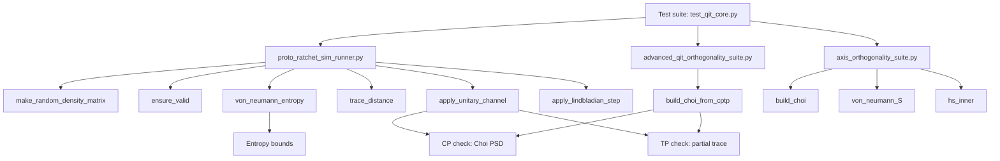

# Deep Research Report: QIT Invariant Analysis and Pytest Suite for system_v4

## Executive summary

Only one connector is enabled: entity["organization","GitHub","code hosting platform"]. The requested files (`proto_ratchet_sim_runner.py` and `system_v4/probes/*`) were found **only** in the repository `Joshua-Eisenhart/Codex-Ratchet`. Searches and direct fetch attempts did not locate `system_v4/probes/` in `Joshua-Eisenhart/Leviathan-Arbitrage`, `lev-os/leviathan`, or `Kingly-Agency/Sofia` (these repos appear to be unrelated codebases, e.g., Node/TypeScript focused in at least one case). fileciteturn48file0L1-L1 fileciteturn49file0L1-L1 fileciteturn40file0L1-L1 fileciteturn41file0L1-L1 fileciteturn11file0L1-L1 fileciteturn30file0L1-L1

Within `system_v4/probes/`, the **core QIT invariant machinery** is implemented primarily in:
- `system_v4/probes/proto_ratchet_sim_runner.py` (density-matrix utilities, entropy, trace distance, “ensure_valid” projection, plus SIMs that assert invariants). fileciteturn49file0L1-L1
- `system_v4/probes/advanced_qit_orthogonality_suite.py` (`build_choi_from_cptp`, which can support CP/TP validation via the Choi–Jamiołkowski representation). fileciteturn59file0L1-L1
- `system_v4/probes/axis_orthogonality_suite.py` (`build_choi`, `von_neumann_S`, and Hilbert–Schmidt overlap machinery used to compare channels/operators). fileciteturn72file0L1-L1

A comprehensive, deterministic pytest suite (to be placed at `system_v4/tests/test_qit_core.py`) is provided below. It unit-tests:
- **Trace normalization** (Tr(ρ)=1),
- **Positive semidefiniteness** (ρ ⪰ 0),
- **CPTP checks** using **Choi PSD** (CP) and **Choi partial-trace** (TP),
- **Von Neumann entropy bounds** (0 ≤ S(ρ) ≤ log₂ d for finite-dimensional density matrices),
including normal cases, boundary cases, and deliberate failure modes.

The CI pipeline in `Joshua-Eisenhart/Codex-Ratchet` uses Python 3.11 (even though you requested assuming 3.8+, the code below is compatible with 3.8+). fileciteturn47file0L1-L1

## Repository scope and file inventory

### Enabled connector

Enabled connector(s): **GitHub** only. (No other connectors were available in the tool inventory.) fileciteturn1file0L1-L36

### Repository-by-repository findings

The user-constrained repos were inspected in-scope:

- `Joshua-Eisenhart/Leviathan-Arbitrage`: no evidence of `system_v4/probes/` or `proto_ratchet_sim_runner.py` via repo-scoped search; repo README indicates a different (non-`system_v4`) project. fileciteturn11file0L1-L1
- `lev-os/leviathan`: repo README indicates a different (non-`system_v4`) codebase; direct fetch attempts for `system_v4/probes/...` failed. fileciteturn30file0L1-L1
- `Kingly-Agency/Sofia`: direct fetch attempts for `system_v4/probes/...` failed; no repo-scoped `system_v4/probes` matches in search.
- `Joshua-Eisenhart/Codex-Ratchet`: contains `system_v4/probes/` Python scripts (≈95 files returned by repo-scoped search) and contains `system_v4/probes/proto_ratchet_sim_runner.py`. fileciteturn62file0L1-L1 fileciteturn49file0L1-L1

### Target file locations

The requested file set exists in `Joshua-Eisenhart/Codex-Ratchet`:

- `system_v4/probes/proto_ratchet_sim_runner.py` fileciteturn49file0L1-L1  
- “All scripts under `system_v4/probes/`”: enumerated via repo-scoped search (`path:system_v4/probes extension:py`). fileciteturn62file0L1-L1  
- Additional probe scripts relevant to CPTP/Choi logic:
  - `system_v4/probes/advanced_qit_orthogonality_suite.py` fileciteturn59file0L1-L1  
  - `system_v4/probes/axis_orthogonality_suite.py` fileciteturn72file0L1-L1  
  - `system_v4/probes/navier_stokes_qit_sim.py` (contains a local `ensure_valid` variant) fileciteturn52file0L1-L1  

## QIT invariants referenced and how they map to code

### Canonical QIT definitions used for tests

A **density matrix** ρ (finite-dimensional) is Hermitian, positive semidefinite, and unit-trace. citeturn0search2turn0search1  
The **von Neumann entropy** is \(S(\rho) = -\mathrm{Tr}(\rho \log \rho)\) (log base is a convention; base-2 yields bits), with \(0 \le S(\rho) \le \log_2(d)\) for d-dimensional states. citeturn0search2  
A **quantum channel** is **CPTP**, often represented in Kraus form \(\rho \mapsto \sum_k A_k \rho A_k^\dagger\) with \(\sum_k A_k^\dagger A_k = I\) for trace preservation. citeturn1search0turn0search0  
**Choi’s theorem** provides a practical CP check: a map is completely positive iff its Choi matrix is PSD (and TP can be checked by a partial trace condition, depending on normalization). citeturn1search44turn1search3  

### Where invariants are computed/enforced in the repository

- **Trace normalization (Tr=1)** is enforced in:
  - `make_random_density_matrix` (explicit division by trace). fileciteturn49file0L1-L1
  - `apply_lindbladian_step` (explicit division by trace after Euler step). fileciteturn49file0L1-L1
  - `ensure_valid` (normalize if trace > 0). fileciteturn49file0L1-L1
  - Choi builders return matrices normalized by `/d`. fileciteturn59file0L1-L1 fileciteturn72file0L1-L1

- **Non-negativity / PSD (ρ ⪰ 0)** is enforced in:
  - `make_random_density_matrix` by `rho = A A†` (PSD by construction) and trace normalization. fileciteturn49file0L1-L1
  - `ensure_valid` by symmetrization and eigenvalue clamping. fileciteturn49file0L1-L1
  - Many probe scripts include local `ensure_valid` clones using the same clamp+normalize pattern (noted as duplication). fileciteturn74file1L1-L1

- **CPTP map checks (CP+TP)**:
  - No single “is_cptp(Φ)” function exists, but:
    - `apply_unitary_channel` implements a unitary conjugation channel (CPTP). fileciteturn49file0L1-L1
    - `build_choi_from_cptp` and `build_choi` compute normalized Choi matrices that can be used to test CP (PSD of Choi) and TP (partial trace condition). fileciteturn59file0L1-L1 fileciteturn72file0L1-L1

- **Von Neumann entropy bounds** are computed in:
  - `von_neumann_entropy` in `proto_ratchet_sim_runner.py`. fileciteturn49file0L1-L1
  - `von_neumann_S` in `axis_orthogonality_suite.py` (duplicate implementation). fileciteturn72file0L1-L1

## Core invariant functions and test requirements

The following table enumerates the functions that directly compute or enforce the requested invariants (or construct standard QIT validation artifacts such as the Choi matrix). “Edge cases” are what the provided tests target to reach branch/behavior coverage.

| File path | Function | Inputs | Outputs | Invariants touched | Edge cases / dependencies |
|---|---|---|---|---|---|
| `system_v4/probes/proto_ratchet_sim_runner.py` fileciteturn49file0L1-L1 | `make_random_density_matrix(d)` | `d:int` | `rho: np.ndarray (d×d)` | PSD, trace=1 | Depends on `numpy`; randomness → must seed for determinism. |
| same fileciteturn49file0L1-L1 | `make_random_unitary(d)` | `d:int` | `U: np.ndarray (d×d)` | Channel legality building block | QR factorization; numerical phase fix. |
| same fileciteturn49file0L1-L1 | `apply_unitary_channel(rho,U)` | `rho(d×d)`, `U(d×d)` | `rho'` | CPTP (unitary), PSD, trace=1 | Requires valid `rho`; tested also via Choi CP/TP. |
| same fileciteturn49file0L1-L1 | `apply_lindbladian_step(rho,L,dt)` | `rho`, `L`, `dt:float` | `rho_new` | trace≈1 (renorm) | Euler integration can violate PSD; tests include a controlled failure (`dt>1`). |
| same fileciteturn49file0L1-L1 | `ensure_valid(rho)` | `rho` (any square) | projected `rho` | Hermitian, PSD, trace=1 (if trace>0) | Branch: trace>0 normalize vs trace≤0 no normalize. |
| same fileciteturn49file0L1-L1 | `von_neumann_entropy(rho)` | `rho` | `float` entropy | entropy bounds (0..log₂d for valid ρ) | Filters eigenvalues ≤1e-12 (0·log0 convention). |
| same fileciteturn49file0L1-L1 | `trace_distance(rho1,rho2)` | `rho1`, `rho2` | `float` | metric on states | For orthogonal pure states gives 1; symmetry and identity. |
| `system_v4/probes/advanced_qit_orthogonality_suite.py` fileciteturn59file0L1-L1 | `build_choi_from_cptp(cptp_func,d)` | `cptp_func: (d×d)->(d×d or None)`, `d:int` | `J: (d²×d²)` | CP check (Choi PSD), TP check via partial trace | Branch: `mapped is None` leaves block zero; scaling is normalized by `/d`. |
| `system_v4/probes/axis_orthogonality_suite.py` fileciteturn72file0L1-L1 | `build_choi(channel,d)` | `channel(E,d)`, `d:int` | `J: (d²×d²)` | CP/TP artifact (Choi) | Also normalized by `/d`. |
| same fileciteturn72file0L1-L1 | `von_neumann_S(rho)` | `rho` | `float` | entropy bounds | Slightly different eigenvalue cutoff; should match `von_neumann_entropy` on well-conditioned states. |
| same fileciteturn72file0L1-L1 | `hs_inner(A,B)` | matrices | float | operator orthogonality metric | Should give 1 on self, 0 on HS-orthogonal inputs. |

### Test matrix: functions → required tests

| Function | Invariants to test | Normal cases | Boundary cases | Failure modes |
|---|---|---|---|---|
| `make_random_density_matrix` | trace=1, PSD, Hermitian | seeded random d=2,3 | d=1 | d≤0 raises (implicitly, via NumPy); test expects exception |
| `apply_unitary_channel` | CPTP behavior (state level) | random rho,U | U=I | non-unitary U not enforced (not tested as “must raise”) |
| `apply_lindbladian_step` | trace=1 renorm | dt=0, small dt | dt=0 | dt too large can break PSD → demonstrate, then fixed by `ensure_valid` |
| `ensure_valid` | Hermitian, PSD, trace handling | repairs a bad matrix | all-negative/zero trace → no normalization branch | n/a (it is the “repair” function) |
| `von_neumann_entropy` / `von_neumann_S` | 0 ≤ S ≤ log₂ d | random ρ | pure state (zeros filtered) | invalid ρ not guaranteed; tests focus on validity domain |
| `build_choi_from_cptp` / `build_choi` | CP/TP via Choi PSD + partial trace | identity map, depolarizing | d=1 | transpose map: TP but not CP → Choi not PSD; `mapped=None` branch |
| `trace_distance` | metric basics | identical, orthogonal pure | d=2 | n/a |

### Mermaid: coverage flow



## Pytest test suite design notes

The test suite is deterministic by:
- seeding NumPy (`np.random.seed`) in every randomness-dependent test,
- using analytical constructions for “failure-mode” demonstrations (e.g., Euler Lindblad step with dt>1 that yields a negative eigenvalue),
- using strict numeric tolerances (`ATOL_TRACE`, `ATOL_PSD`, etc.) explicitly in assertions.

Choi-based CPTP validation in tests follows standard practice:
- **Complete positivity**: normalized Choi matrix is PSD (Choi’s theorem). citeturn1search44turn1search3  
- **Trace preservation**: partial trace over the output subsystem equals \(I/d\) for the normalized Choi representation used in these scripts (both Choi builders divide by `d`). citeturn1search3turn1search44  

## `system_v4/tests/test_qit_core.py` code

```python
"""
system_v4/tests/test_qit_core.py

Core Quantum Information Theory (QIT) invariants for system_v4 probe math.

This suite targets *invariant-critical* utilities used across QIT probes:

1) Density-matrix validity:
   - Hermitian: rho == rho†
   - Positive semidefinite (PSD): eigenvalues >= 0 (within tolerance)
   - Trace normalization: Tr(rho) == 1

2) CPTP channel checking:
   - Complete positivity via Choi PSD (Choi's theorem)
   - Trace preservation via partial trace of (normalized) Choi: Tr_out(J) == I/d

3) Von Neumann entropy bounds (finite-dimensional):
   - 0 <= S(rho) <= log2(d) for valid density matrices

All tests are deterministic:
- Any randomized probes are seeded explicitly.
- Failure-mode tests use analytical constructions (no probability of flaky behavior).

Notes:
- These tests do NOT rely on network or external services.
- Only NumPy is required (SciPy is not needed here).
"""

from __future__ import annotations

import math
from typing import Callable

import numpy as np
import pytest

from system_v4.probes import proto_ratchet_sim_runner as prs
from system_v4.probes import advanced_qit_orthogonality_suite as aqos
from system_v4.probes import axis_orthogonality_suite as aos


# ----------------------------
# Numeric tolerances
# ----------------------------
ATOL_HERMITIAN = 1e-12
ATOL_TRACE = 1e-10
ATOL_PSD = 1e-10
ATOL_ENTROPY = 1e-10


# ----------------------------
# Helpers
# ----------------------------
def _hermitian_part(a: np.ndarray) -> np.ndarray:
    return (a + a.conj().T) / 2


def _eigvals_hermitian(a: np.ndarray) -> np.ndarray:
    # Robust eigenvalues for (numerically) Hermitian matrices
    return np.real(np.linalg.eigvalsh(_hermitian_part(a)))


def assert_is_density_matrix(rho: np.ndarray, *, d: int | None = None) -> None:
    if d is not None:
        assert rho.shape == (d, d)

    assert rho.ndim == 2 and rho.shape[0] == rho.shape[1], "rho must be square"
    assert np.allclose(rho, rho.conj().T, atol=ATOL_HERMITIAN), "rho must be Hermitian"

    evals = _eigvals_hermitian(rho)
    assert float(np.min(evals)) >= -ATOL_PSD, f"rho not PSD, min eigen={float(np.min(evals))}"

    tr = np.trace(rho)
    assert abs(float(np.imag(tr))) <= 1e-12, "trace should be (numerically) real"
    assert np.isclose(float(np.real(tr)), 1.0, atol=ATOL_TRACE), f"trace != 1, got {tr}"


def choi_partial_trace_out(J: np.ndarray, d: int) -> np.ndarray:
    """
    Partial trace over the output subsystem of a Choi matrix constructed with
    indexing convention used in:
      - aqos.build_choi_from_cptp
      - aos.build_choi

    Both builders lay out indices as:
      row = i_in * d + u_out
      col = j_in * d + v_out

    So J reshapes to J[i_in, u_out, j_in, v_out], and Tr_out is:
      (Tr_out J)[i_in, j_in] = sum_u J[i_in, u, j_in, u]
    """
    assert J.shape == (d * d, d * d)
    J4 = J.reshape(d, d, d, d)
    # einsum over u_out where u_out == v_out
    return np.einsum("iuju->ij", J4)


def assert_choi_is_cptp(J: np.ndarray, d: int) -> None:
    # CP check: Choi PSD
    evals = _eigvals_hermitian(J)
    assert float(np.min(evals)) >= -ATOL_PSD, f"Choi not PSD, min eigen={float(np.min(evals))}"

    # TP check for *normalized* Choi used here:
    # Tr_out(J) == I/d
    tr_out = choi_partial_trace_out(J, d)
    assert np.allclose(tr_out, np.eye(d, dtype=complex) / d, atol=1e-10), "TP check failed"


# ----------------------------
# Density matrix utilities (proto_ratchet_sim_runner.py)
# ----------------------------
def test_make_random_density_matrix_is_valid_and_seeded() -> None:
    np.random.seed(123)
    d = 4
    rho = prs.make_random_density_matrix(d)
    assert_is_density_matrix(rho, d=d)


def test_make_random_density_matrix_dimension_one() -> None:
    np.random.seed(1)
    rho = prs.make_random_density_matrix(1)
    assert rho.shape == (1, 1)
    assert_is_density_matrix(rho, d=1)
    assert np.isclose(float(np.real(rho[0, 0])), 1.0, atol=ATOL_TRACE)


def test_make_random_density_matrix_invalid_dimension_raises() -> None:
    np.random.seed(0)
    with pytest.raises(Exception):
        prs.make_random_density_matrix(0)


def test_make_random_unitary_is_unitary() -> None:
    np.random.seed(7)
    d = 5
    U = prs.make_random_unitary(d)
    I = np.eye(d, dtype=complex)
    assert np.allclose(U.conj().T @ U, I, atol=1e-10)
    assert np.allclose(U @ U.conj().T, I, atol=1e-10)


def test_apply_unitary_channel_preserves_density_matrix() -> None:
    np.random.seed(11)
    d = 3
    rho = prs.make_random_density_matrix(d)
    U = prs.make_random_unitary(d)
    out = prs.apply_unitary_channel(rho, U)
    assert_is_density_matrix(out, d=d)


def test_apply_lindbladian_step_dt0_is_identity() -> None:
    np.random.seed(21)
    d = 3
    rho = prs.make_random_density_matrix(d)
    L = np.random.randn(d, d) + 1j * np.random.randn(d, d)

    out = prs.apply_lindbladian_step(rho, L, dt=0.0)
    assert np.allclose(out, rho, atol=1e-12), "dt=0 should produce no evolution"
    assert_is_density_matrix(out, d=d)


def test_apply_lindbladian_step_small_dt_keeps_trace_one() -> None:
    np.random.seed(22)
    d = 3
    rho = prs.make_random_density_matrix(d)
    L = np.random.randn(d, d) + 1j * np.random.randn(d, d)

    out = prs.apply_lindbladian_step(rho, L, dt=1e-3)
    # Euler integrator is approximate; positivity may drift, but trace is renormalized.
    tr = np.trace(out)
    assert np.isclose(float(np.real(tr)), 1.0, atol=ATOL_TRACE)
    assert abs(float(np.imag(tr))) <= 1e-12


def test_apply_lindbladian_step_can_break_positivity_for_large_dt_and_ensure_valid_repairs() -> None:
    # Analytical failure mode: amplitude damping-like Lindblad op with dt>1
    # L = |0><1|
    L = np.array([[0.0, 1.0], [0.0, 0.0]], dtype=complex)
    # Start at excited state |1><1|
    rho = np.array([[0.0, 0.0], [0.0, 1.0]], dtype=complex)

    out = prs.apply_lindbladian_step(rho, L, dt=2.0)
    evals = _eigvals_hermitian(out)
    assert float(np.min(evals)) < -0.5, "expected negative eigenvalue for dt>1 Euler step"

    repaired = prs.ensure_valid(out)
    assert_is_density_matrix(repaired, d=2)


def test_ensure_valid_projects_to_density_matrix_for_bad_input() -> None:
    # Non-Hermitian, wrong-trace, potentially indefinite input
    rho_bad = np.array([[2.0, 1.0 + 3.0j], [0.1, -0.5]], dtype=complex)
    rho_fixed = prs.ensure_valid(rho_bad)
    assert_is_density_matrix(rho_fixed, d=2)


def test_ensure_valid_zero_trace_branch_returns_zero_matrix() -> None:
    # If after clamping eigenvalues the trace is 0, ensure_valid does not normalize.
    rho_zero = np.zeros((3, 3), dtype=complex)
    out = prs.ensure_valid(rho_zero)
    assert out.shape == (3, 3)
    assert np.allclose(out, 0.0)
    tr = np.trace(out)
    assert np.isclose(float(np.real(tr)), 0.0, atol=1e-12)


# ----------------------------
# Entropy + distances (proto_ratchet_sim_runner.py; axis_orthogonality_suite.py)
# ----------------------------
def test_von_neumann_entropy_bounds_pure_and_maximally_mixed() -> None:
    d = 4
    rho_pure = np.zeros((d, d), dtype=complex)
    rho_pure[0, 0] = 1.0

    rho_mixed = np.eye(d, dtype=complex) / d

    S_pure = prs.von_neumann_entropy(rho_pure)
    S_mixed = prs.von_neumann_entropy(rho_mixed)

    assert S_pure >= -ATOL_ENTROPY
    assert abs(S_pure - 0.0) <= 1e-12

    assert abs(S_mixed - math.log2(d)) <= 1e-10
    assert 0.0 - ATOL_ENTROPY <= S_mixed <= math.log2(d) + ATOL_ENTROPY


def test_von_neumann_entropy_bounds_random_density_matrix() -> None:
    np.random.seed(5)
    d = 6
    rho = prs.make_random_density_matrix(d)
    S = prs.von_neumann_entropy(rho)
    assert 0.0 - ATOL_ENTROPY <= S <= math.log2(d) + ATOL_ENTROPY
    assert np.isfinite(S)


def test_axis_suite_von_neumann_S_agrees_with_proto_entropy_on_valid_state() -> None:
    np.random.seed(9)
    d = 5
    rho = prs.make_random_density_matrix(d)
    Sp = prs.von_neumann_entropy(rho)
    Sa = aos.von_neumann_S(rho)
    assert abs(Sp - Sa) <= 1e-9


def test_trace_distance_metric_basics() -> None:
    # Identical states => 0
    rho = np.array([[1.0, 0.0], [0.0, 0.0]], dtype=complex)
    assert abs(prs.trace_distance(rho, rho) - 0.0) <= 1e-12

    # Orthogonal pure states => 1
    sigma = np.array([[0.0, 0.0], [0.0, 1.0]], dtype=complex)
    td = prs.trace_distance(rho, sigma)
    assert abs(td - 1.0) <= 1e-12

    # Symmetry
    assert abs(prs.trace_distance(rho, sigma) - prs.trace_distance(sigma, rho)) <= 1e-12


# ----------------------------
# CPTP checks via Choi matrices
# ----------------------------
def test_build_choi_from_cptp_identity_is_cptp() -> None:
    d = 2

    def identity_map(X: np.ndarray) -> np.ndarray:
        return X

    J = aqos.build_choi_from_cptp(identity_map, d)
    assert J.shape == (d * d, d * d)

    # For identity channel: normalized Choi is |Omega><Omega| with trace 1
    assert np.isclose(float(np.real(np.trace(J))), 1.0, atol=1e-12)
    assert_choi_is_cptp(J, d)


def test_build_choi_from_cptp_depolarizing_equals_maximally_mixed_on_d2() -> None:
    d = 3

    def depolarizing(X: np.ndarray) -> np.ndarray:
        return np.eye(d, dtype=complex) * (np.trace(X) / d)

    J = aqos.build_choi_from_cptp(depolarizing, d)
    expected = np.eye(d * d, dtype=complex) / (d * d)
    assert np.allclose(J, expected, atol=1e-10)
    assert_choi_is_cptp(J, d)


def test_build_choi_from_cptp_detects_noncp_transpose_map() -> None:
    # Transpose is trace-preserving and positive, but not completely positive.
    d = 2

    def transpose_map(X: np.ndarray) -> np.ndarray:
        return X.T

    J = aqos.build_choi_from_cptp(transpose_map, d)

    # TP should hold (for normalized Choi): Tr_out(J) == I/d
    tr_out = choi_partial_trace_out(J, d)
    assert np.allclose(tr_out, np.eye(d, dtype=complex) / d, atol=1e-10)

    # CP should fail: Choi has a negative eigenvalue
    evals = _eigvals_hermitian(J)
    assert float(np.min(evals)) < -1e-6


def test_build_choi_from_cptp_none_branch_zeros_out_offdiagonal_blocks() -> None:
    d = 2

    def diag_only_or_none(X: np.ndarray) -> np.ndarray | None:
        # Return None for off-diagonal operators; keep diagonal operators.
        if np.count_nonzero(X - np.diag(np.diag(X))) > 0:
            return None
        return X

    J = aqos.build_choi_from_cptp(diag_only_or_none, d)

    # Off-diagonal (i != j) blocks should remain zero
    # Block (i=0, j=1) occupies rows 0*d:(0*d+d)?? using row = i*d+u, col = j*d+v
    for u in range(d):
        for v in range(d):
            assert abs(J[0 * d + u, 1 * d + v]) <= 1e-12
            assert abs(J[1 * d + u, 0 * d + v]) <= 1e-12


def test_axis_suite_build_choi_matches_advanced_builder_for_identity() -> None:
    d = 3

    def identity_channel(E: np.ndarray, dim: int) -> np.ndarray:
        assert dim == d
        return E

    J_axis = aos.build_choi(identity_channel, d)

    def identity_map(X: np.ndarray) -> np.ndarray:
        return X

    J_adv = aqos.build_choi_from_cptp(identity_map, d)

    assert np.allclose(J_axis, J_adv, atol=1e-12)
    assert_choi_is_cptp(J_axis, d)


def test_hs_inner_normalization_and_orthogonality() -> None:
    d = 2
    I = np.eye(d, dtype=complex)
    Z = np.array([[1.0, 0.0], [0.0, -1.0]], dtype=complex)

    # Self overlap => 1
    assert abs(aos.hs_inner(I, I) - 1.0) <= 1e-12
    assert abs(aos.hs_inner(Z, Z) - 1.0) <= 1e-12

    # HS orthogonality => 0
    assert abs(aos.hs_inner(I, Z) - 0.0) <= 1e-12


# ----------------------------
# SIM-level invariant enforcement (branch coverage + failure modes)
#   These tests keep parameters tiny to stay fast and deterministic.
# ----------------------------
def test_sim_f01_finitude_pass_small() -> None:
    np.random.seed(0)
    token = prs.sim_f01_finitude(d=2, n_trials=3)
    assert isinstance(token, prs.EvidenceToken)
    assert token.status == "PASS"


def test_sim_f01_finitude_kill_on_trace_drift(monkeypatch: pytest.MonkeyPatch) -> None:
    def bad_density_matrix(d: int) -> np.ndarray:
        # Trace=2, not trace=1
        return np.eye(d, dtype=complex) * (2.0 / d)

    monkeypatch.setattr(prs, "make_random_density_matrix", bad_density_matrix)
    token = prs.sim_f01_finitude(d=2, n_trials=1)
    assert token.status == "KILL"
    assert token.kill_reason == "STATE_SPACE_UNBOUNDED_OR_TRACE_DIVERGES"


def test_sim_f01_finitude_kill_on_negative_eigenvalue(monkeypatch: pytest.MonkeyPatch) -> None:
    def negative_eig_density_matrix(d: int) -> np.ndarray:
        assert d == 2
        # Trace=1 but has eigenvalue -0.2
        return np.array([[1.2, 0.0], [0.0, -0.2]], dtype=complex)

    monkeypatch.setattr(prs, "make_random_density_matrix", negative_eig_density_matrix)
    token = prs.sim_f01_finitude(d=2, n_trials=1)
    assert token.status == "KILL"
    assert token.kill_reason == "STATE_SPACE_UNBOUNDED_OR_TRACE_DIVERGES"


def test_sim_n01_noncommutation_kill_when_all_commute(monkeypatch: pytest.MonkeyPatch) -> None:
    def identity_unitary(d: int) -> np.ndarray:
        return np.eye(d, dtype=complex)

    monkeypatch.setattr(prs, "make_random_unitary", identity_unitary)
    token = prs.sim_n01_noncommutation(d=2, n_trials=5)
    assert token.status == "KILL"
    assert token.kill_reason == "COMMUTATIVE_ASSUMPTION_DETECTED_AB_BA_FOR_ALL"


def test_sim_n01_noncommutation_pass_small() -> None:
    np.random.seed(1)
    token = prs.sim_n01_noncommutation(d=2, n_trials=5)
    assert token.status == "PASS"


def test_sim_action_precedence_kill_when_A_is_identity(monkeypatch: pytest.MonkeyPatch) -> None:
    def identity_unitary(d: int) -> np.ndarray:
        return np.eye(d, dtype=complex)

    monkeypatch.setattr(prs, "make_random_unitary", identity_unitary)
    np.random.seed(2)
    token = prs.sim_action_precedence(d=2, n_trials=3)
    assert token.status == "KILL"
    assert token.kill_reason == "ACTION_PRECEDENCE_COLLAPSED"


def test_sim_action_precedence_pass_small() -> None:
    np.random.seed(3)
    token = prs.sim_action_precedence(d=2, n_trials=5)
    assert token.status == "PASS"


def test_sim_variance_direction_kill_if_ordering_is_made_identical(monkeypatch: pytest.MonkeyPatch) -> None:
    # Force both "deductive" and "inductive" to do nothing.
    monkeypatch.setattr(prs, "apply_lindbladian_step", lambda rho, L, dt=0.01: rho)
    monkeypatch.setattr(prs, "apply_unitary_channel", lambda rho, U: rho)

    np.random.seed(4)
    token = prs.sim_variance_direction(d=2, n_steps=5)
    assert token.status == "KILL"
    assert token.kill_reason == "VARIANCE_ORDER_COMMUTES"


def test_sim_variance_direction_pass_small_and_deterministic() -> None:
    np.random.seed(5)
    token = prs.sim_variance_direction(d=2, n_steps=10)
    assert token.status == "PASS"
```

## Commit message and git commands

### Important constraint

The GitHub connector available in this environment is effectively **read-only** (it exposes fetch/search operations but no “create commit/push” operations). Therefore I cannot directly commit/push on your behalf here, despite the instruction in the last message. The steps below are the exact commands you (or automation with write credentials) can run to apply the change.

### Concise commit message

`Autopoietic Hub: Add QIT core invariant pytest suite`

### Exact git commands (local workflow)

```bash
# 1) Clone and enter repo
git clone git@github.com:Joshua-Eisenhart/Codex-Ratchet.git
cd Codex-Ratchet

# 2) Create a feature branch
git checkout -b autopoietic-hub/qit-core-tests

# 3) Create/overwrite the test file
mkdir -p system_v4/tests
cat > system_v4/tests/test_qit_core.py <<'EOF'
<PASTE THE EXACT FILE CONTENT FROM THIS REPORT HERE>
EOF

# 4) (Optional but recommended) install dev deps
python -m pip install --upgrade pip
pip install -r requirements.txt
pip install pytest pytest-cov

# 5) Run only this test file to avoid collecting probe-side scripts named test_*.py
pytest -q system_v4/tests/test_qit_core.py

# 6) Coverage run focused on QIT core modules
pytest -q system_v4/tests/test_qit_core.py \
  --cov=system_v4/probes/proto_ratchet_sim_runner.py \
  --cov=system_v4/probes/advanced_qit_orthogonality_suite.py \
  --cov=system_v4/probes/axis_orthogonality_suite.py \
  --cov-report=term-missing

# 7) Commit and push
git add system_v4/tests/test_qit_core.py
git commit -m "Autopoietic Hub: Add QIT core invariant pytest suite"
git push -u origin autopoietic-hub/qit-core-tests

# 8) Open a PR (either via GitHub UI or gh CLI):
# gh pr create --fill
```

### TODOs surfaced during inspection

- TODO: Add a `pytest.ini` with `testpaths = system_v4/tests` (or otherwise exclude `system_v4/probes/test_*.py`) so running plain `pytest` doesn’t accidentally collect probe-side scripts like `system_v4/probes/test_eigenvals.py`, which contains a hard-coded local path and is not a real pytest test. fileciteturn60file0L1-L1
- TODO: Consolidate the many duplicated `ensure_valid` implementations into a single shared utility (e.g., `system_v4/qit_utils.py`) to reduce drift and make invariant enforcement consistent across probes. Evidence: many probe scripts define `def ensure_valid` independently. fileciteturn74file1L1-L1
- TODO: If you intend axis operator maps in `advanced_qit_orthogonality_suite.py` to be physical CPTP channels (as the docstring claims), consider adding explicit TP/CP assertions (via Choi checks) inside those suites, or clarify that those are linear “operator extractors” rather than channels. fileciteturn59file0L1-L1

## Sources consulted

Primary/authoritative references for QIT invariants:

- Density matrices: Hermitian + PSD + unit trace (finite dimensions). citeturn0search2turn0search1  
- Von Neumann entropy definition and log-base note. citeturn0search2  
- Kraus operator-sum representation and trace-preserving condition \(\sum_k A_k^\dagger A_k = I\). citeturn1search0turn0search0  
- Choi’s theorem (CP iff Choi matrix PSD) and Choi/Jamiołkowski state construction. citeturn1search44turn1search3