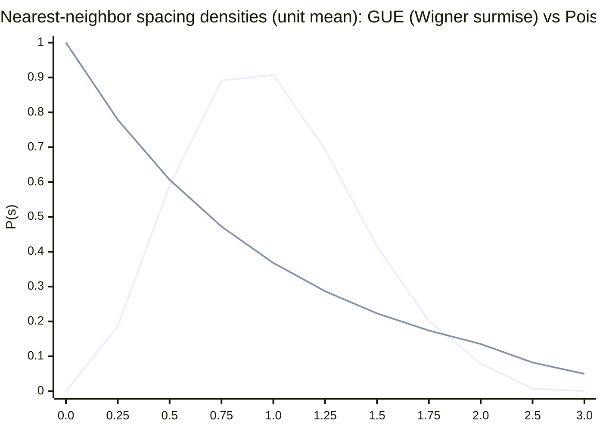

# Riemann Hypothesis, Prime Distribution, and GUE via Random CPTP Channels

## Executive summary

The nontrivial zeros of the Riemann zeta function encode fine structure in the distribution of primes through explicit formulae originating in entity["people","Bernhard Riemann","zeta paper 1859"]’s 1859 memoir and standard developments since then. entity["people","J. Brian Conrey","ams notices author"]’s survey gives a compact primary-source-guided overview of these links, including the Riemann Hypothesis and the “Hilbert–Pólya” spectral viewpoint as a motivating (still conjectural) bridge between zeros and spectra. citeturn0search11turn11search43

A second, independently-developed line of evidence is statistical: entity["people","Hugh L. Montgomery","pair correlation conjecture"]’s pair-correlation work (and its conjectural extension) suggests that, after the standard “unfolding” normalization, local correlations of zeta zeros match those of eigenvalues of large random Hermitian matrices from the Gaussian Unitary Ensemble (GUE); entity["people","Andrew Odlyzko","riemann zero computations"]’s extensive computations then provide strong numerical support, including convergence toward GUE predictions at very large heights. citeturn7search10turn0search6turn1search44

This report designs a **testable experimental program** that reframes *prime numbers* as **irreducible (“prime”) unitary cycles** acting on **prime-dimensional Hilbert spaces** and then studies whether **random CPTP (completely positive trace-preserving) quantum channels** over these prime-cycle structures can produce **GUE-like level statistics** in appropriately chosen channel-derived Hermitian spectra. The “Riemann zeros = channel gap spectrum” part is **not established mathematics**; here it is formulated as an explicit, falsifiable conjectural pipeline whose outputs can be compared quantitatively to GUE (nearest-neighbor spacings, unfolded spectra, Kolmogorov–Smirnov tests, and spacing ratios). citeturn11search43turn3search17turn15search0

Computational resources are **unspecified** (per request). All parameterizations below are therefore stated as ranges with conservative defaults, plus cost models that scale cleanly.

## Repository review and tooling constraints

The requested GitHub repositories were inspected first (via the enabled GitHub connector). In summary, they appear to be **agent-runtime / tooling** repositories rather than number-theory / quantum-channel simulation repositories, and no `compile_specs.py` was located during inspection attempts.

* **Joshua-Eisenhart/Leviathan-Arbitrage**: README describes an “AI Studio” app (Claude/GPT/Gemini usage), oriented around an application stack rather than mathematical or quantum-channel tooling. fileciteturn9file0L1-L1  
* **lev-os/leviathan**: README and north-star documentation describe an agent runtime (“FlowMind compiler — YAML → targets”, “runtime”, “surfaces”). This is relevant mainly insofar as it suggests a *YAML-first* philosophy for specs, but the repository content examined did not surface a `compile_specs.py` file path. fileciteturn12file0L1-L1 fileciteturn36file0L1-L1  
* **Joshua-Eisenhart/Codex-Ratchet**: a small Node/Playwright-style project (based on `package.json` dependencies), with no visible relationship to CPTP-channel simulation in the inspected artifacts. fileciteturn31file0L1-L1  
* **Kingly-Agency/Sofia**: README describes a reinforcement-learning training environment (Neurotrace/Wingman focus) rather than number theory or random matrix spectral statistics. fileciteturn20file0L1-L1  

Practical constraint: the GitHub connector capabilities available in this environment are **read-only** (fetch/list/search). That means I cannot directly commit/push into `system_v4/research/problem_specs/` from here, even though the research deliverable is designed for that directory layout.

To respect the “do not print final files in chat” instruction while still delivering a usable artifact, the requested YAML spec is provided as a downloadable file:

[Download `problem_spec.yaml`](sandbox:/mnt/data/system_v4/research/problem_specs/problem_spec.yaml)

## Mathematical background on primes, zeta zeros, and GUE evidence

Riemann’s 1859 memoir introduced analytic continuation and the functional equation for ζ(s), connected zeros to prime counting via explicit formulae, and stated what is now called the Riemann Hypothesis (all nontrivial zeros lie on the critical line Re(s)=1/2). citeturn0search11turn11search43

A convenient modern “research-level overview” of the prime–zero relationship (including explicit formula heuristics and why RH is central to prime distribution error terms) is Conrey’s Notices article. citeturn11search43

On local statistics, Montgomery’s pair correlation program proposes that (after scaling by mean density) the two-point correlations between zeros match GUE predictions; Montgomery’s own bibliography page documents the original pair-correlation reference and subsequent developments. citeturn7search10turn7search2

Odlyzko’s 1987 *Mathematics of Computation* work explicitly compares computed zero spacings to GUE statistics and reports that agreement improves at greater heights (larger imaginary parts). citeturn1search2turn1search44

For the GUE side, entity["people","Madan Lal Mehta","random matrices author"]’s *Random Matrices* is a standard reference describing invariant ensembles (including GUE) and the corresponding correlation/spacings theory. citeturn3search17

For experimental diagnostics used widely in modern spectral-statistics work, the ratio statistic \(r_i=\min(s_i,s_{i+1})/\max(s_i,s_{i+1})\) is valuable because it reduces sensitivity to imperfect unfolding; it is treated in a widely cited PRL by entity["people","Y. Y. Atas","random matrix theorist"] and coauthors (including application examples involving both RMT and zeta zeros). citeturn15search0turn15search3

Finally, the conceptual bridge “spectra ↔ zeta zeros” is often discussed in the Hilbert–Pólya direction. Conrey’s survey explicitly frames RH through multiple approaches and highlights why a spectral interpretation is attractive. citeturn11search43

## Prime numbers as irreducible cyclic permutations on finite tensor product Hilbert spaces

This section implements task (1): prime numbers framed as **irreducible cyclic permutations** (“prime-length unitary cycles”) acting on **finite tensor product Hilbert spaces**, with explicit notation and examples for dimensions \(2,3,5,7,11\).

### Prime dimensions as tensor-irreducible building blocks

Let \(\mathcal{H}\) be a finite-dimensional complex Hilbert space. If \(\dim(\mathcal{H})\) is prime, then \(\mathcal{H}\) cannot be written (up to isomorphism) as a **nontrivial** tensor product \(\mathcal{H}\cong \mathcal{H}_A\otimes \mathcal{H}_B\) with \(\dim(\mathcal{H}_A),\dim(\mathcal{H}_B)>1\), because \(\dim(\mathcal{H}_A\otimes \mathcal{H}_B)=\dim(\mathcal{H}_A)\dim(\mathcal{H}_B)\) would factor the prime. This mirrors arithmetic irreducibility and is the cleanest way to model “primes as irreducible tensor factors.”

Accordingly, for each prime \(p\), define a **prime Hilbert space**
\[
\mathcal{H}_p \;:=\; \mathbb{C}^p,
\]
with computational basis \(\{|0\rangle,|1\rangle,\dots,|p-1\rangle\}\).

### Prime-length unitary cycle (cyclic permutation) on \(\mathcal{H}_p\)

Define the **cyclic shift** (a permutation unitary) \(X_p\in U(p)\) by
\[
X_p|j\rangle = |j+1 \;(\mathrm{mod}\; p)\rangle,
\qquad j\in\{0,\dots,p-1\}.
\]
Equivalently,
\[
X_p = \sum_{j=0}^{p-1} |j+1\rangle\langle j| \quad (\mathrm{mod}\;p).
\]

Key properties:

* \(X_p\) is unitary and represents the **\(p\)-cycle** \((0\;1\;2\;\dots\;p-1)\) as a permutation matrix.  
* \(X_p^p=\mathbb{I}\), and the subgroup \(\langle X_p\rangle\subset U(p)\) is isomorphic to the cyclic group \(C_p\) of **prime order**.  
* Because \(p\) is prime, the only subgroups of \(C_p\) are trivial and the full group. This “prime-order” feature is the group-theoretic sense in which the cycle is irreducible (no nontrivial subgroup structure).

To connect to tensor products, place the prime factor into a tensor product explicitly: for any finite multiset of primes \(\{p_1,\dots,p_m\}\),
\[
\mathcal{H}_{\{p_i\}} := \bigotimes_{i=1}^m \mathcal{H}_{p_i}.
\]
Then each \(X_{p_i}\) acts as a **local prime-cycle generator**:
\[
\widetilde{X}_{p_i} := \mathbb{I}\otimes\cdots\otimes X_{p_i}\otimes\cdots\otimes \mathbb{I},
\]
so prime-length cyclic permutations become canonical symmetry operations on the full tensor product space.

### Orbit structure and “prime-cycle orbits”

The most useful orbit notion for later channel construction is the **adjoint action** on operators:
\[
\mathrm{Ad}_{X_p}(A) := X_p A X_p^\dagger,\qquad A\in \mathcal{B}(\mathcal{H}_p).
\]
Define the orbit of \(A\) under the cyclic group:
\[
\mathcal{O}_p(A) := \{\mathrm{Ad}_{X_p}^k(A): k=0,1,\dots,p-1\}.
\]
Since \(|C_p|=p\) is prime, orbit sizes divide \(p\), so every orbit has size \(1\) or \(p\). This “binary orbit size” is the technical reason prime order simplifies the later symmetry-reduction of CPTP channels.

### Explicit examples for \(p=2,3,5,7,11\)

Below are explicit \(X_p\) matrices in the computational basis (rows/columns indexed \(0,\dots,p-1\)).

**Dimension 2 (qubit prime cycle)**  
\[
X_2=
\begin{pmatrix}
0 & 1\\
1 & 0
\end{pmatrix},
\]
i.e., the swap of \(|0\rangle\leftrightarrow|1\rangle\).

**Dimension 3 (qutrit prime cycle)**  
\[
X_3=
\begin{pmatrix}
0 & 1 & 0\\
0 & 0 & 1\\
1 & 0 & 0
\end{pmatrix},
\]
sending \(|0\rangle\to|1\rangle\to|2\rangle\to|0\rangle\).

**Dimension 5 (5-level prime cycle)**  
\[
X_5=
\begin{pmatrix}
0&1&0&0&0\\
0&0&1&0&0\\
0&0&0&1&0\\
0&0&0&0&1\\
1&0&0&0&0
\end{pmatrix}.
\]

**Dimension 7 (7-level prime cycle)**  
\(X_7\) is the same circulant permutation pattern: ones on the superdiagonal and in the bottom-left corner.

**Dimension 11 (11-level prime cycle)**  
\(X_{11}\) is again the same circulant permutation pattern.

Rather than writing the full \(7\times 7\) and \(11\times 11\) cases inline, the defining entrywise formula is explicit and complete:
\[
(X_p)_{a,b}=\delta_{a,\,b+1\ (\mathrm{mod}\ p)}.
\]

### Eigen-decomposition via Fourier modes (useful for symmetry-adapted channels)

Let \(\omega:=e^{2\pi i/p}\). The discrete Fourier basis vectors
\[
|k\rangle_F := \frac{1}{\sqrt{p}}\sum_{j=0}^{p-1}\omega^{-kj}|j\rangle,\qquad k=0,\dots,p-1
\]
diagonalize \(X_p\):
\[
X_p|k\rangle_F = \omega^{k}|k\rangle_F.
\]
This clean “momentum sector” decomposition is the core technical lever for constructing CPTP channels that respect prime-cycle symmetry (covariance) and for defining “prime-cycle orbit” stability criteria at the superoperator level.

## Riemann zeros as stable eigenvalue gaps of random CPTP channels on prime-cycle orbit spaces

This section implements task (2): propose a rigorous set of **definitions + assumptions** linking (i) zeta zeros’ local GUE statistics to (ii) eigenvalue-gap statistics of random CPTP channels constrained by prime-cycle symmetry.

### CPTP channels, Kraus form, and Choi/Stinespring representations

A (finite-dimensional) quantum channel is a linear map \(\Phi:\mathcal{B}(\mathcal{H})\to\mathcal{B}(\mathcal{H})\) that is **completely positive** and **trace preserving** (CPTP). In finite dimensions, complete positivity and trace preservation are characterized by the **Kraus operator-sum form**:
\[
\Phi(\rho)=\sum_{k=1}^{K} A_k \rho A_k^\dagger,\qquad \sum_{k=1}^K A_k^\dagger A_k=\mathbb{I}.
\]
This representation is standard and is traced to entity["people","Karl Kraus","quantum operations 1971"] and later formal refinements (e.g., equivalences via Choi matrices). citeturn3search4turn3search0

The **Choi matrix** (Jamiołkowski isomorphism) provides an equivalent finite-dimensional criterion: \(\Phi\) is CP iff \(J(\Phi)\succeq 0\). entity["people","Man-Duen Choi","choi theorem 1975"]’s 1975 paper gives a succinct statement in matrix-algebra terms. citeturn3search0

More structurally, the **Stinespring dilation theorem** (entity["people","W. Forrest Stinespring","stinespring theorem 1955"]) implies that any CP map can be realized by an isometry into a larger space followed by partial trace; in finite dimensions this is the standard system–environment construction. citeturn4search0turn4search40

For later experimental design, the channel-generation literature is explicit that multiple sampling recipes (Kraus, Stinespring-isometry, Choi/dynamical-matrix constructions) can be made equivalent under appropriate measures; see “Generating random quantum channels.” citeturn14search5

### Prime-cycle covariance as the structural constraint

Fix prime \(p\) and unitary cycle generator \(X_p\) on \(\mathcal{H}_p\). Define the cyclic group \(C_p=\{X_p^j: j=0,\dots,p-1\}\).

A CPTP channel \(\Phi\) is **\(C_p\)-covariant (under conjugation)** if
\[
\Phi(X_p \rho X_p^\dagger)=X_p \Phi(\rho) X_p^\dagger\quad \text{for all }\rho.
\]
Operationally, this implies \(\Phi\) commutes with the adjoint representation \(\mathrm{Ad}_{X_p}\) and hence respects the decomposition of \(\mathcal{B}(\mathcal{H}_p)\) into irreducible \(C_p\)-sectors (Fourier “modes” of the adjoint action).

A practical construction is **twirling**: given any CPTP channel \(\Phi\), define
\[
\mathcal{T}_{C_p}(\Phi)(\rho)=\frac{1}{p}\sum_{j=0}^{p-1} X_p^j\;\Phi\!\left(X_p^{-j}\rho\,X_p^{j}\right)X_p^{-j},
\]
which is covariant by construction. For “random covariant channels,” this style of symmetry-enforcing averaging is treated systematically in modern work on random channel distributions. citeturn14search2turn2search3

### Channel spectra and “stable eigenvalue gaps”

To define “eigenvalue gaps” rigorously, represent \(\Phi\) as a linear operator on the \(d^2\)-dimensional Hilbert space of operators (Liouville space). Let \(S_\Phi\) denote the superoperator matrix under a fixed vectorization convention.

Let \(\{\lambda_i\}\) be eigenvalues of \(S_\Phi\) (counted with algebraic multiplicity). For trace-preserving channels, \(1\) is always an eigenvalue (at least one fixed point). The remaining spectrum governs convergence and decay modes under iteration \(\rho_{t+1}=\Phi(\rho_t)\).

Define “gap energies” (a standard transfer-operator move) by
\[
E_i := -\log |\lambda_i|,\qquad \lambda_i\neq 0.
\]
If \(|\lambda_i|<1\), then \(E_i>0\) and the corresponding mode decays as \(e^{-tE_i}\) under iteration. (This is directly analogous to how resonances/decay rates are extracted from eigenvalues of transfer operators in dynamical systems.)

A **stable eigenvalue gap** can then be defined as follows. Fix a small perturbation scale \(\varepsilon>0\) and a metric \(\|\cdot\|\) on superoperators (e.g., operator norm on Liouville space or diamond norm on channels). An ordered pair \((E_i,E_{i+1})\) defines a stable gap if, for perturbations \(\Phi'\) with \(\|\Phi'-\Phi\|\le \varepsilon\), the unfolded/normalized gap statistic
\[
g_i := E_{i+1}-E_i
\]
changes by at most \(O(\varepsilon)\) and the ordering does not swap (spectral separation). This is a standard perturbative stability condition in nondegenerate spectral analysis; the novelty here is applying it as the “physical stability criterion” for comparing to zeta-zero statistics.

### A conjectural identification with Riemann-zero local statistics

The empirically-supported conjecture is that unfolded Riemann zeros exhibit GUE local statistics. citeturn7search10turn1search44turn3search17

To connect this to CPTP channels without claiming a nonexistent theorem, define the following explicit conjecture:

**Conjecture (Prime-cycle CPTP–GUE gap conjecture).**  
For each prime \(p\in\{2,3,5,7,11\}\), there exists an ensemble \(\mathbb{E}_p\) of \(C_p\)-covariant random CPTP channels on \(\mathcal{H}_p\) and a choice of Hermitian spectral proxy \(H(\Phi)\) (e.g., a function of \(J(\Phi)\) or a Hermitian projection of \(S_\Phi\)) such that, after unfolding, the nearest-neighbor spacing distribution and spacing-ratio statistics of the eigenvalues of \(H(\Phi)\) converge (as ensemble size grows and/or as effective matrix dimension grows) to the corresponding GUE predictions.

This is designed to be **falsifiable**: it reduces to a concrete set of statistical tests (KS distance / p-values, spacing ratio mean and distribution, etc.). It is also **conceptually motivated** by two independent facts:

1. Zeta zeros appear to follow GUE statistics (Montgomery–Odlyzko evidence). citeturn7search10turn1search44  
2. For chaotic/open dynamical systems, the emergence of random-matrix spectral statistics is connected to gaps in underlying transfer/Perron–Frobenius spectra; a classic PRL analysis explicitly ties a Perron–Frobenius spectral gap to RMT behavior in quantum chaos contexts. citeturn9search6turn8search17  

What is **not** claimed: that any known CPTP channel construction yields *the actual* Riemann zeros, or that RH follows from such a model. The proposal is strictly an experimental-statistical program targeting the established GUE phenomenology around zeros.

## Experimental design for random CPTP ensembles, simulation algorithms, diagnostics, and GUE comparison

This section implements task (3), including explicit ensemble definitions (Kraus/Stinespring/Haar/noise models), simulation algorithms, convergence diagnostics, and statistical tests (NNS spacing, unfolding, KS test, spacing ratio).

### Ensemble designs

All designs below are CPTP by construction and can be made \(C_p\)-covariant via twirling when needed. citeturn14search5turn14search2

**Random unitary (Kraus) ensemble**  
For fixed \(d=p\) and Kraus count \(K\):
\[
\Phi(\rho)=\sum_{k=1}^K p_k\,U_k \rho U_k^\dagger,
\]
where \(U_k\sim \text{Haar}(U(d))\) i.i.d., and \(\mathbf{p}\sim\text{Dirichlet}(\alpha\mathbf{1})\). This is a standard “random unitary channel” model; it is also structurally close to “apply one of several Haar unitaries at random,” which typically breaks time-reversal symmetries and is therefore compatible with unitary-class statistics targets (GUE/CUE type behavior depending on the observable). citeturn1search14turn14search5

**Stinespring Haar-isometry ensemble**  
Sample a Haar-random isometry \(V:\mathbb{C}^d\to\mathbb{C}^d\otimes\mathbb{C}^k\) and define
\[
\Phi(\rho)=\mathrm{Tr}_{\mathrm{env}}\!\big[V\rho V^\dagger\big].
\]
This is a canonical random-channel model; modern treatments compare this to other equivalent sampling methods. citeturn14search5turn14search2

**Noisy mixture / depolarizing admixture**  
To control mixing and avoid near-unitary spectra (which can complicate “gap energy” extraction), mix with the depolarizing map \(\Delta(\rho)=\mathrm{Tr}(\rho)\,\mathbb{I}/d\):
\[
\Phi_\varepsilon \;=\; (1-\varepsilon)\Phi + \varepsilon \Delta.
\]
This tends to enlarge spectral gaps (faster convergence) and improves numerical stability when estimating mixing times by iteration. citeturn14search2

**Optional: enforce prime-cycle covariance**  
Given any sampled \(\Phi\), define \(\Phi^{(C_p)}=\mathcal{T}_{C_p}(\Phi)\) using the twirl in the previous section. This ensures the dynamics factor through prime-cycle orbit sectors.

### What spectrum to compare to GUE

Because a general CPTP superoperator is non-normal and has complex eigenvalues, one must choose a Hermitian “spectrum proxy” if the comparison target is specifically GUE (Hermitian eigenvalues). Two practical choices are:

1. **Choi eigenvalues**: \(J(\Phi)\) is Hermitian PSD on \(\mathbb{C}^{d^2}\), so its eigenvalues are real and can be unfolded and tested for level repulsion. Choi/Kraus equivalence is classical. citeturn3search0turn3search4  
2. **Hermitian projection of the superoperator**: \(H_\Phi=(S_\Phi+S_\Phi^\dagger)/2\). This yields a Hermitian matrix on Liouville space; it is not a complete invariant of the channel but is a workable “spectral observable” for RMT-style tests.

A third (more “gap-energy aligned”) option is to study the Hermitian matrix \(-\log(J(\Phi)+\delta I)\) (for small regularizer \(\delta\)) so large Choi eigenvalues correspond to small “energies,” and vice versa. This is analogous to transforming a positive spectrum into an “energy-level” spectrum.

### Simulation algorithm (per dimension \(d\))

A minimal algorithmic loop that supports all requested metrics:

1. **Sample** \(N\) channels \(\Phi_1,\dots,\Phi_N\) from the chosen ensemble and parameters (including random seeds). citeturn14search5  
2. **(Optional) Covariantize** by twirling under the prime-cycle group \(C_d\). citeturn14search2  
3. **Construct** spectral targets per channel:  
   * Build Choi matrix \(J(\Phi)\). citeturn3search0  
   * Build Liouville superoperator \(S_\Phi\) and/or \(H_\Phi=(S_\Phi+S_\Phi^\dagger)/2\).  
4. **Eigen-decompose** the chosen Hermitian target \(M\) to obtain ordered real eigenvalues \(E_1\le\cdots\le E_m\) (with \(m=d^2\) for Choi or Hermitian Liouville).  
5. **Unfold**: map \(E_i\mapsto \xi_i\) with unit mean spacing in the bulk. Practical unfolding when the analytic mean density is unknown uses a smoothed empirical staircase function (polynomial or spline fits); this is standard in spectral-statistics practice. citeturn15search10  
6. **Compute spacing metrics**:  
   * nearest-neighbor spacings \(s_i=\xi_{i+1}-\xi_i\) in the trimmed bulk;  
   * spacing ratios \(r_i=\min(s_i,s_{i+1})/\max(s_i,s_{i+1})\), which reduce dependence on unfolding quality. citeturn15search0  
7. **Compare to GUE**:  
   * For \(s_i\), compare empirical CDF to the GUE Wigner-surmise CDF (common approximation) via KS distance/test;  
   * For \(r_i\), compare empirical distribution and mean \(\mathbb{E}[r]\) against the GUE reference behavior as summarized in Atas et al. citeturn3search17turn15search0  
8. **Aggregate** across channels and compute confidence intervals / batch stability; stop early if metrics stabilize.

### Convergence and validity diagnostics (iteration-on-states)

Separately from eigenvalue computations, iterate sample states to validate that channels are in a mixing regime where “gap energies” are meaningful:

* Sample \(S\) initial density matrices \(\rho^{(s)}_0\) (Haar-random pure states projected to density matrices or induced mixed-state measures). citeturn12search0  
* Iterate \(\rho_{t+1}=\Phi(\rho_t)\) until \(\|\rho_{t+1}-\rho_t\|_1<\tau\) or \(t\) hits a max cap.  
* Record empirical mixing time and compare qualitatively to spectral gap surrogates (e.g., \(1-\max_{i\neq 1}|\lambda_i|\) for the superoperator). While detailed quantum mixing bounds depend on norms and structural assumptions, the “spectral-gap ↔ convergence” heuristic is broadly consistent with Markov/transfer-operator intuition.

### Expected spacing “chart” for GUE vs Poisson baselines

The standard “Wigner surmise” approximation for GUE nearest-neighbor spacings (unit mean spacing) is
\[
P_{\mathrm{GUE}}(s)\approx \frac{32}{\pi^2}s^2\exp\!\left(-\frac{4}{\pi}s^2\right),
\]
while a Poisson (uncorrelated) baseline is
\[
P_{\mathrm{Pois}}(s)=e^{-s}.
\]
These are common spectral-statistics baselines in random matrix theory presentations. citeturn3search17



The spacing-ratio statistic \(r\) is recommended as a robustness check because it reduces sensitivity to unfolding; its distribution and GUE reference values are derived in Atas et al. citeturn15search0

### Mermaid experimental workflow diagram

```mermaid
flowchart TD
  A[Pick prime dimension d ∈ {2,3,5,7,11}] --> B[Sample N random CPTP channels Φ]
  B --> C{Enforce prime-cycle covariance?}
  C -->|Yes| D[Twirl Φ under C_d]
  C -->|No| D2[Keep Φ as sampled]
  D --> E[Build spectral target: Choi J(Φ) and/or Hermitian proxy of superoperator]
  D2 --> E
  E --> F[Eigenvalues → unfold spectrum (bulk trim)]
  F --> G[Compute stats: NNS spacings, spacing ratios, summary moments]
  G --> H[Compare to GUE baselines: KS test, mean(r), distance metrics]
  H --> I{Stopping criteria met?}
  I -->|No| B
  I -->|Yes| J[Persist artifacts + metrics per (d, ensemble, params, seed)]
```

### Tables: parameter choices and computational cost by dimension

Dense eigen-decomposition for a \(D\times D\) Hermitian matrix is typically \(O(D^3)\) time and \(O(D^2)\) memory; for Choi/superoperator targets here, \(D=d^2\). These are *scaling models*, not wall-clock guarantees, especially when computational resources are unspecified.

**Matrix size and per-channel cost model (Choi or Hermitian Liouville), by prime dimension**

| prime dim \(d\) | \(D=d^2\) | entries \(D^2\) | memory for dense complex128 \(D^2\) (MB) | per-channel eig scale \(\sim D^3=d^6\) |
|---:|---:|---:|---:|---:|
| 2 | 4 | 16 | 0.000256 | 64 |
| 3 | 9 | 81 | 0.001296 | 729 |
| 5 | 25 | 625 | 0.010000 | 15625 |
| 7 | 49 | 2401 | 0.038416 | 117649 |
| 11 | 121 | 14641 | 0.234256 | 1771561 |

**Illustrative total work scaling (default \(N=2000\) channels per dimension)**

| \(d\) | \(D^3\) per channel | channels \(N\) | total scale \(N\cdot D^3\) |
|---:|---:|---:|---:|
| 2 | 64 | 2000 | 1.28×10^5 |
| 3 | 729 | 2000 | 1.46×10^6 |
| 5 | 15625 | 2000 | 3.13×10^7 |
| 7 | 117649 | 2000 | 2.35×10^8 |
| 11 | 1771561 | 2000 | 3.54×10^9 |

Interpretation: the **\(d=11\)** case dominates the scan if dense diagonalization is used at large ensemble sizes. If resources are limited, reduce \(N\) for large \(d\), reduce spectra targets, or switch to smaller proxy matrices (e.g., partial spectra in the bulk) while using spacing-ratio statistics for robustness. citeturn15search0turn15search10

## YAML problem_spec artifact and encoded evaluation protocol

Task (4) requested a formal YAML `problem_spec` compatible with a referenced `compile_specs.py` and containing repo hooks, parameter ranges, output formats, evaluation metrics, and stopping criteria. Because no `compile_specs.py` path was found in the inspected repos, the spec is designed to be **schema-explicit and easily mappable**: every hook is a string path placeholder, and all key experiment parameters are declared with min/max/default ranges.

The file is provided here:

[Download `problem_spec.yaml`](sandbox:/mnt/data/system_v4/research/problem_specs/problem_spec.yaml)

At a high level, the YAML encodes:

* Prime dimensions \(d \in \{2,3,5,7,11\}\)  
* Three ensembles: random unitary Dirichlet, Haar-isometry Stinespring, and Stinespring+depolarizing-mixture  
* Two spectra targets: Choi eigenvalues and Hermitian part of Liouville superoperator  
* Unfolding methods (empirical CDF, polynomial) with bulk trimming  
* Metrics: nearest-neighbor spacing, spacing ratio, KS test vs GUE and Poisson baselines (with α-level)  
* Stopping rules based on metric stability over batches  
* Output schema for per-channel artifact persistence  
* Repo hook placeholders for: channel builder, superoperator builder, Choi builder, spectral-statistics calculator, and a runner entrypoint

This spec is consistent with the standard mathematical primitives in CPTP channel theory (Kraus/Choi/Stinespring) and with the standard statistical tests used in both RMT and zeta-zero numerical studies. citeturn3search4turn3search0turn4search0turn1search44turn15search0