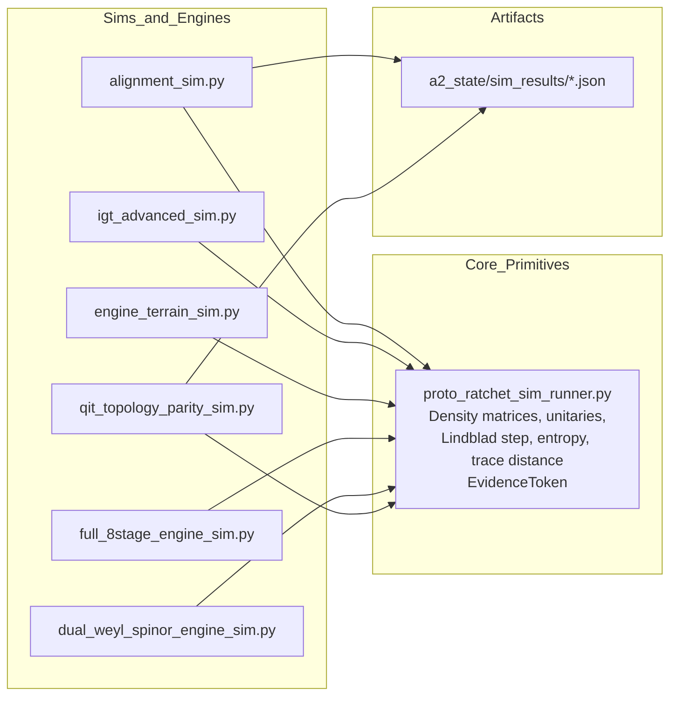
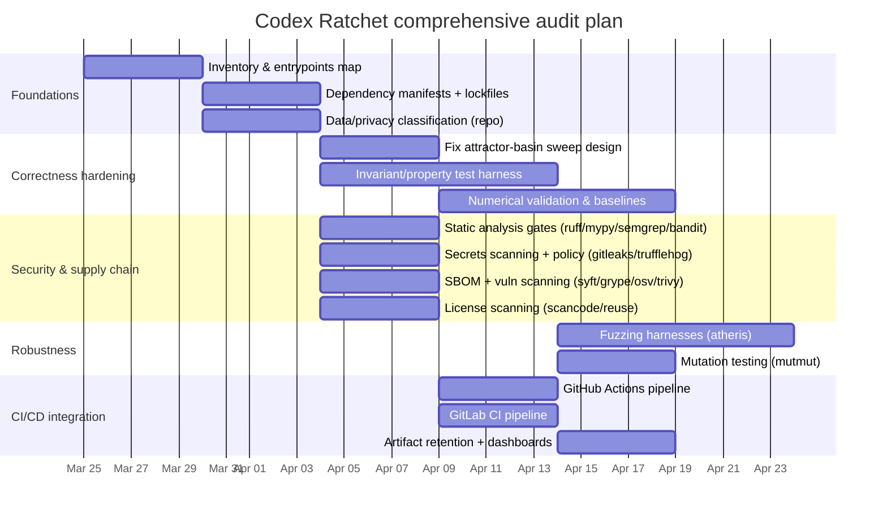

# Comprehensive Security, Correctness, and Quality Audit of the Codex Ratchet Repository

## Executive summary

This deep audit reviews the public entity["company","GitHub","code hosting platform"] repository owned by entity["people","Joshua Eisenhart","repo owner"] and focuses especially on the QIT simulation suite you cited for “attractor basin” formation and system updates. citeturn12view2turn14view0turn15view0turn44view0

The most consequential risks and blockers observed in the current repo state are:

- **Scientific/correctness risk in the attractor-basin sweep**: the γ sweep in `sim_proto_attractor_basin` generates a **new random Lindblad operator for each γ**, so the sweep is not isolating “γ vs convergence” on a fixed channel family; this undermines interpretability of the “critical damping threshold” output. citeturn15view0  
- **Reproducibility/operability gaps**: Python dependencies are not declared in a standard manifest (no `requirements.txt`/Poetry lock visible), while the code clearly depends on `numpy` and other third-party packages elsewhere (e.g., `networkx`, `lxml`). This prevents reliable CI and vulnerability audits for Python (pip-audit / osv-scanner) until a manifest exists. citeturn15view0turn43view0turn38search1turn38search2  
- **Repository hygiene and “wrong file executed” risk**: `system_v4/probes/` contains many duplicated scripts with a `" 2.py"` suffix (including `qit_topology_parity_sim 2.py`), which increases the chance of running the wrong version and makes audits harder. citeturn14view0turn34view1  
- **Privacy and compliance risk**: the public repo includes extensive state/log-like material under `system_v3/a2_state/` and docs/scripts that embed absolute local paths (including your username and workstation paths), which can leak sensitive context and complicate open-source licensing/compliance posture. citeturn36view0turn32view0turn43view0  
- **Attack-surface configuration issue**: `serve_dashboard.py` binds an HTTP server to `("", PORT)` (all interfaces) rather than localhost, which is unnecessary for local visualization and can expose artifacts on shared networks if run on a server. citeturn35view0  

High-level recommendation: treat the QIT sims as a *research-grade computation system* and prioritize (1) determinism + parameterized experiment definitions, (2) invariants and numerical validation, (3) dependency manifests + supply-chain scanning, and (4) CI automation producing auditable artifacts (SARIF/JSON/SBOM). citeturn15view0turn23view1turn38search1turn40search4turn45search1  

## Repository context and what the QIT simulations are building

The repo is predominantly Python (GitHub language report shows ~99% Python) and is structured as a multi-layer “system_v3 / system_v4” build with specs, runtime scaffolding, probes (simulations), and tooling. citeturn12view2turn28view2turn30view0  

### What appears to be the “QIT engines” in code

In the current repository, the “QIT engine” idea is implemented as **operator/channel process cycles over density matrices**, plus “evidence token” emission. It is not a single monolithic `sim_engine.py` (a file name mentioned in the other thread); instead, the functionality is distributed across `system_v4/probes/*` simulations.

Key building blocks:

- `proto_ratchet_sim_runner.py` defines the base primitives used throughout the sims: random density matrices, random unitaries, unitary channel application, a Lindbladian step (Euler), von Neumann entropy, trace distance, and an evidence token model. citeturn13view0turn15view0turn17view0  
- Several higher-level sims import these primitives and implement specific “process cycles” or structural tests:
  - `alignment_sim.py` implements a 3-agent alignment scenario and writes JSON evidence output to `a2_state/sim_results`. citeturn17view0turn18view0  
  - `igt_advanced_sim.py` defines “IGT” claims and operator kernels, including context-aware Ti projection behavior, and a negentropy function. citeturn44view0  
  - `engine_terrain_sim.py` defines operator kernels such as **Fe** (Lindblad damping) and **negentropy(ρ) = log(d) − S(ρ)** and then checks pattern matches / emits evidence tokens. citeturn22view1turn22view2turn22view3  
  - `full_8stage_engine_sim.py` describes and implements an 8-stage cycle with explicit stage operators and includes entropy tracking, Landauer-cost computation, and cycle parameters (including γ scaling in its Lindblad operator). citeturn23view0turn23view1  
  - `dual_weyl_spinor_engine_sim.py` explicitly distinguishes Type-1 (dissipation→rotation) and Type-2 (rotation→weak dissipation), and encodes a 720°/two-cycle spinor condition in the narrative and simulation. citeturn24view0turn24view2turn24view3  
  - `qit_topology_parity_sim.py` explicitly frames topology parity tests between Type-1 and Type-2, including “Landauer-bounded trace operations” and “energy-selective detailed-balance Lindbladians.” citeturn34view0  

### Architecture sketch of the simulation subsystem



This matches the repeated import pattern in the sims (they extend the `sys.path` to import from the probes folder and reuse `proto_ratchet_sim_runner` functions). citeturn17view0turn44view0turn34view0  

## Audit methodology and toolchain

This section provides a comprehensive audit playbook **tailored to what is actually present in this repository** (Python-heavy, simulation-centric, with some Node tooling). Where a requested item is not currently applicable (e.g., cryptographic key management), it is explicitly flagged and options are provided.

### Inventory and mapping

**Methodology**  
Build an authoritative inventory of: modules, entry points, simulation runners, data/artifact directories, and external/tooling dependencies. In this repo, mapping also needs to account for the extensive state/docs under `system_v3/a2_state` and “spec overlay” structure in `system_v4/specs`. citeturn28view2turn30view0turn36view0turn14view0  

**Tools and commands (open-source / standard)**  
- Repository map + entrypoints:
  - `python -m compileall -q .` (syntax sanity for Python). (No external citation needed; interpreter behavior is stable.)
  - `rg -n "if __name__ == \"__main__\"" system_v4/probes` (requires ripgrep).
- Dependency extraction (until proper manifests exist):
  - `python -c "import pkgutil, sys; ..."`, or use `pipreqs` (not primary/official, so treat as temporary).  
- For Node side: `npm ls` + lockfile inspection; `package.json` shows `playwright` as a devDependency. citeturn27view1turn45search14turn45search16  

**Expected artifacts**  
- `inventory/ENTRYPOINTS.md` listing canonical runs (proto runner, major sims).  
- `inventory/DEPENDENCIES.md` extracted imports (Python + Node).  
- `inventory/DATA_SURFACES.md` describing what’s under `system_v3/a2_state` and what is safe to publish. citeturn36view0turn30view0  

**Interpretation**  
Your audit cannot be “comprehensive” until the dependency story is made explicit (especially Python). Inventory is the prerequisite for all scanning and for reproducible simulation results in CI.

### Static analysis (linting, types, dependency vulns, licenses)

**Methodology**  
Apply:
1) uniform lint/format, 2) type-checking boundaries, 3) security SAST, 4) dependency vulnerability scanning, 5) secret scanning, 6) SBOM + license scanning.

**Recommended tools (primary/official)**  
- Lint/format: Ruff (docs and CLI). citeturn37search0turn37search8  
- Types: mypy (CLI docs) and/or Pyright (docs). citeturn37search1turn37search6  
- SAST: Semgrep local scans. citeturn37search3turn37search7  
- Python security lint: Bandit. citeturn38search0turn38search8  
- Dependency vulns:
  - pip-audit (PyPA). citeturn38search1turn38search17  
  - OSV-Scanner (lockfile/SBOM scanning; note data-sent/privacy). citeturn38search6turn38search2  
  - Trivy for filesystem/lockfiles (`package-lock.json` is present). citeturn38search3turn25view2  
- Secrets: Gitleaks and/or TruffleHog. citeturn39search0turn39search5  
- SBOM + supply chain:
  - Syft (SBOM generation) + Grype (scan SBOM). citeturn40search4turn40search1  
  - SLSA provenance concepts (build provenance). citeturn40search3turn40search11  
  - Sigstore cosign attach sbom guidance (optional, for containerized artifacts). citeturn40search2  
- License scanning:
  - ScanCode CLI. citeturn41search0turn41search4  
  - REUSE lint (licensing hygiene). citeturn41search1turn41search17  
  - CycloneDX Python SBOM tooling (optional alternative SBOM pipeline). citeturn41search6turn41search14  
  - SPDX SBOM definition/spec. citeturn41search3turn41search11  

**Canonical commands (examples)**  
These commands assume you add a Python dependency manifest; until then, you can only run code scanners that don’t require an environment vulnerability audit.

```bash
# Python lint/format
ruff check .
ruff format --check .

# Type checking (choose one, or run both)
mypy .
pyright

# SAST
semgrep scan --config p/default .

# Python security lint
bandit -r . -f json -o reports/bandit.json

# Secrets scanning
gitleaks git -v --report-format sarif --report-path reports/gitleaks.sarif
trufflehog git --fail main HEAD --json > reports/trufflehog.json

# Dependency vulns (requires dependency manifests / lockfiles)
pip-audit -r requirements.txt -f json -o reports/pip-audit.json
osv-scanner scan --format json -L package-lock.json > reports/osv.json

# Filesystem scanning (lockfile-aware)
trivy fs . --format json -o reports/trivy-fs.json

# SBOM + vuln scan
syft dir:. -o cyclonedx-json > reports/sbom.cdx.json
grype sbom:reports/sbom.cdx.json -o json > reports/grype.json

# License scanning
scancode -l -n 4 --json-pp reports/licenses.json .
reuse lint
```

**Expected outputs and how to interpret**  
- Ruff/mypy/pyright: treat as *quality gates*; failing findings should block merges once baseline is established. citeturn37search8turn37search1turn37search6  
- Semgrep/Bandit: treat as *security review inputs*, not automatically exploitable; triage by reachability and by whether the code handles untrusted inputs. citeturn37search7turn38search0  
- pip-audit / OSV-Scanner / Trivy: prioritize vulnerabilities in *runtime* dependencies, then dev tooling; OSV-Scanner explicitly documents what metadata it sends unless `--offline` is used (useful for privacy). citeturn38search1turn38search6turn38search3  
- Syft/Grype: SBOM becomes your “bill of materials” artifact; Grype scans SBOMs. citeturn40search4turn40search1  
- ScanCode / REUSE: build a license posture; REUSE lint is a compliance check for license tagging mechanics. citeturn41search0turn41search1  

### Dynamic testing (unit/integration, fuzzing, harnesses, CI)

**Methodology**  
For simulation-heavy repos, dynamic testing should emphasize **invariants** and **numerical/physical validity**:
- Trace(ρ)=1 (within tolerance), Hermiticity, PSD eigenvalues, stability under repeated steps, and “does channel respect CPTP assumptions given the discretization strategy used.” citeturn15view0turn23view1turn44view0  

**Recommended tools**  
- Pytest baseline. citeturn42search10turn42search14  
- Coverage.py for coverage artifacts. citeturn42search11turn42search3  
- Hypothesis for property-based tests (excellent for invariants). citeturn42search0turn42search4  
- Atheris for coverage-guided fuzzing (especially good for crashers / numerical edge cases / unexpected NaNs). citeturn42search9turn42search21  
- mutmut for mutation testing (already referenced in `pyproject.toml`). citeturn25view0turn45search0  

**Expected artifacts**  
- JUnit XML test results; coverage XML (`coverage.xml`) for CI visualizations. citeturn42search3  
- Fuzz corpora + minimized crashers (committed in a quarantined folder, not in the main tree).

### Cryptography and “protocol” review

**Repository reality check (as observed)**  
The QIT simulation modules reviewed are built on numerical linear algebra and do not implement cryptographic primitives or secure messaging protocols; imports and content are dominated by `numpy`, `json`, filesystem operations, and internal “process cycle” operator logic. citeturn44view0turn15view0turn34view0  

**How to interpret this in your requested audit dimensions**  
- **Key management / forward secrecy / replay**: currently *not directly applicable* unless there is a separate messaging/control-plane protocol layer you plan to deploy externally.  
- What *is* applicable: treat the “process cycle” as a **protocol/state machine over ρ**, and audit it for:
  - Explicit stage ordering and non-commutation assumptions (Type-1 vs Type-2 ordering is explicitly modeled). citeturn24view2turn24view0turn15view0  
  - Clear state-transition invariants and “no silent downgrade” semantics (e.g., don’t let operators collapse into a commutative approximation without detection). citeturn15view0turn22view3  

### Threat modeling and attack surface analysis

Even simulation-only projects have material security risks in practice: supply chain, leaked data, and “running untrusted inputs” from datasets, corpora, or graph files.

Threat model sketch:

```mermaid
flowchart TB
  Dev[Researcher/dev workstation] --> Repo[Codex Ratchet repo]
  Repo --> Sims[Simulation runners & probes]
  Sims --> Artifacts[Artifacts: sim_results JSON,\nlogs, dashboards]
  Repo --> State[State/docs surfaces\n(system_v3/a2_state,\ndocs, specs)]
  Repo --> Deps[Dependencies\n(PyPI, npm)]
  CI[CI runner] --> Repo
  CI --> Deps
  CI --> Artifacts
  Attacker[Adversary] --> Deps
  Attacker --> Repo

  classDef boundary fill:#fff,stroke:#999,stroke-dasharray: 5 5;
  class Deps,CI boundary;
```

Key *assets* and *trust boundaries* in this repo include:
- Artifacts and state surfaces (`system_v3/a2_state`) that may contain sensitive operational detail or private context. citeturn36view0turn30view0  
- Dependency boundaries (npm lockfile + future Python requirements). citeturn25view2turn27view1turn38search1turn38search6  

### Performance, scalability, and resource usage

**Methodology**  
- Profile critical sim loops (esp. attractor searches), check asymptotic scaling, and guard against “trial explosion.”  
- Determine if eigen-decompositions or pairwise metrics dominate runtime (typical in density-matrix sims).

In `sim_proto_attractor_basin`, pairwise trace distances scale O(n²) in number of initial states, which can become expensive if you increase `n_initial_states` substantially. citeturn15view0  

### Secure coding and configuration issues

**Methodology**  
- Review filesystem writes, path handling, local server binding, and any serialization/parsing of external files.  
- Ensure no debug scripts hardcode absolute machine paths in shared code.

This repo includes scripts with absolute paths and local-environment assumptions (e.g., GraphML debug file). citeturn43view0  

### Compliance and privacy considerations

**Methodology**  
- Identify whether the repo contains: personal data, derived memory logs, secrets, or private workspace metadata.  
- Establish licensing posture and ensure license files exist and are consistent.

The repo contains extensive dated state documents and JSON in a public directory tree and docs that reference local filesystem locations, implying a non-trivial privacy/compliance surface. citeturn36view0turn32view0turn43view0  

## Detailed findings for the current Codex Ratchet repository

This section lists concrete, repo-specific findings, with risk impact, effort estimate, and verification steps.

### Attractor-basin sweep is not isolating γ as the independent variable

**Evidence**  
In `sim_proto_attractor_basin`, a new random `L_base` is created **inside** the loop over `gamma_values`, then scaled by `gamma`. This means each γ uses a different dissipator direction/operator, so convergence differences confound γ with operator choice. citeturn15view0  

**Risk impact**: **High** (this directly affects whether the produced “attractor basin” is meaningful for system updates).  
**Estimated effort**: **Low–Medium** (code change + rerun experiments + update plots).

**Remediation (prioritized)**  
- Fix the experimental design:
  1) Generate one `L_base` (and one `U`) outside the γ loop;  
  2) For each γ, set `L = (L_base / ||L_base||) * γ`;  
  3) Repeat across multiple seeds (outer repetition) to build confidence intervals. citeturn15view0  
- Record outputs as structured artifacts (CSV/JSON) per seed and γ. The repo already writes JSON in several sims; standardize a schema. citeturn17view0turn34view0  

**Verification steps**  
- Confirm γ sweep results are stable across:
  - identical channel direction with different γ, and  
  - multiple independent seeds (report mean±CI for convergence metric).  
- Add a unit/property test: “γ sweep should change only strength, not operator identity.”

### Numerical validity and “physical state” invariants are not consistently enforced across sims

**Evidence**  
- `proto_ratchet_sim_runner.py` uses an Euler Lindblad step and renormalizes trace but does not show consistent PSD projection in the step itself; other sims implement explicit `ensure_valid` PSD projection. citeturn15view0turn18view0turn44view0  
- Several sims explicitly perform eigenvalue clamping and renormalization after updates. citeturn17view0turn23view1turn44view0  

**Risk impact**: **High** (invalid density matrices can distort trace distance and entropy metrics, producing misleading “convergence” or “negentropy” effects).  
**Estimated effort**: **Medium** (centralize invariants, add tests, potentially change integrator).

**Remediation (prioritized)**  
- Centralize a single `ensure_valid_density_matrix(rho, tol=...)` in one module and use it consistently after every non-unitary step (especially for Euler-integrated dissipators).  
- Add property tests (Hypothesis) asserting invariants for `apply_unitary_channel`, `apply_lindbladian_step`, Ti-like projections, and Fe-like dissipators. citeturn42search0turn42search4  
- For higher-fidelity physics, consider using a CP-preserving method (e.g., Kraus map discretization) or cross-checking a subset of results against a trusted solver as a validation harness (research choice; not mandated).

**Verification steps**  
- CI test suite asserts:
  - `rho == rho.conj().T` within tolerance,  
  - `min(eigvals) >= -eps`,  
  - `abs(trace(rho) - 1) <= eps`,  
  - no NaNs/Infs.  
- Save failing matrices as artifacts for debugging.

### Simulation thresholds and “PASS/KILL” semantics are under-specified for research use

**Evidence**  
- `sim_proto_attractor_basin` uses a hard convergence threshold `mean_dist < 0.01` and picks the first γ passing it; this is not justified within the code as a statistically grounded criterion. citeturn15view0  
- Various sims define “PASS/KILL” evidence tokens based on a single run’s behavior (e.g., divergence threshold in variance ordering). citeturn15view0turn22view3turn23view0  

**Risk impact**: **Medium–High** (false confidence; difficult to compare runs or reproduce claims).  
**Estimated effort**: **Medium**.

**Remediation (prioritized)**  
- Define a formal experiment protocol:
  - parameter ranges,  
  - number of seeds,  
  - acceptance criteria (e.g., “95% of seeds converge with max_dist below X”).  
- Store experiment metadata (seed, γ, dt, steps, operator hashes).  
- Build a small “experiment registry” format (YAML/JSON). The repo already has strong spec practice in `system_v4/specs`; mirror that discipline for experiments. citeturn30view0turn28view2  

**Verification steps**  
- Re-run identical experiments across machines and confirm artifact equivalence (or bounded drift).  
- Add regression tests: “changing code must not change baseline experiment outputs beyond tolerance.”

### Dependency and supply-chain posture is incomplete for Python, partially specified for Node

**Evidence**  
- `package.json` declares `playwright` ^1.58.2 and a placeholder test script; `package-lock.json` exists. citeturn27view1turn25view2  
- The Python project lacks a standard dependency manifest in the visible root config; `setup.cfg` and `pyproject.toml` are currently used only for `mutmut` configuration. citeturn25view0turn26view3turn15view0  
- You have existing `mutmut` paths-to-mutate configured. citeturn25view0turn45search0  

**Risk impact**: **High** (cannot reliably reproduce environments; cannot run pip-audit effectively; weak supply-chain guarantees).  
**Estimated effort**: **Medium**.

**Remediation (prioritized)**  
- Choose a Python dependency strategy and lock it:
  - `requirements.in` + `pip-tools`-generated `requirements.txt`, or  
  - Poetry (`poetry.lock`), or  
  - UV lock.  
- Run pip-audit after locks exist. citeturn38search1turn38search17  
- Add OSV-Scanner and Trivy scans in CI (Trivy explicitly supports lockfile-aware filesystem scans). citeturn38search2turn38search3  
- Generate SBOMs with Syft and scan with Grype. citeturn40search4turn40search1  
- (Optional) For release artifacts (containers/wheels), follow SLSA provenance concepts and attach SBOMs with cosign in an OCI workflow. citeturn40search3turn40search2  

**Verification steps**  
- CI produces:
  - locked dependency files,  
  - vulnerability reports (JSON),  
  - SBOM (CycloneDX or SPDX),  
  - and fails on policy thresholds.

### Repo hygiene risks: duplicate “ 2.py” files and mixed state/data in a public repo

**Evidence**  
- `system_v4/probes/` contains many duplicate scripts suffixed with `" 2.py"`; `qit_topology_parity_sim 2.py` appears alongside the main version. citeturn14view0turn34view1  
- The repo contains large, dated operational state records and JSON in `system_v3/a2_state/`, implying risk of inadvertently publishing sensitive content. citeturn36view0turn30view0  
- Files include absolute local paths (e.g., GraphML debug script path). citeturn43view0  
- Docs include local filesystem paths and machine-specific notes. citeturn32view0  

**Risk impact**: **High** (privacy + operational leakage; auditability and correctness risk from running wrong code).  
**Estimated effort**: **Medium–High** (cleanup + split repos or restructure assets).

**Remediation (prioritized)**  
- Consolidate duplicates:
  - pick canonical versions,  
  - delete or archive “2.py” variants into `archive/` or `attic/` (excluded from CI),  
  - add a “canonical entrypoints” manifest for sims.  
- Add secret scanning gates (Gitleaks/TruffleHog) and treat findings as blocking for main. citeturn39search0turn39search5  
- Decide which `system_v3/a2_state` artifacts are safe to publish; consider moving sensitive state to private storage or Git LFS with strict access controls, and ensuring `.gitignore` protects runtime state. citeturn36view0  

**Verification steps**  
- CI jobs:
  - fail if new “ 2.py” files appear,  
  - fail if absolute paths matching `/Users/` or `C:\Users\` appear (simple grep guard),  
  - fail on verified secret findings.

### Local dashboard server binds to all interfaces

**Evidence**  
`serve_dashboard.py` uses `socketserver.TCPServer(("", PORT), Handler)`, binding to all interfaces and serving from the tools directory, then opening a browser. citeturn35view0  

**Risk impact**: **Medium** (exposure depends on where it’s run; on shared hosts it can expose telemetry artifacts).  
**Estimated effort**: **Low**.

**Remediation**  
- Bind explicitly to localhost (`("127.0.0.1", PORT)`), and optionally add a CLI flag `--host`.  
- If the dashboard reads JSON results, ensure it sanitizes file loads and does not allow directory traversal (SimpleHTTPRequestHandler is safer with fixed directory, but still better to bind local). citeturn35view0  

**Verification steps**  
- Add a test or manual check: server reachable only via localhost.  
- CI can run a minimal “starts and stops” smoke test without networking exposure.

## Remediation plan and timeline

### Prioritized checklist

**P0 — correctness and safety gates (do first)**  
- Fix γ sweep design in `sim_proto_attractor_basin` (hold operator fixed; scale only γ; multiple seeds; record metadata). citeturn15view0  
- Create Python dependency manifest + lockfile so audits are meaningful; then add pip-audit + OSV scanning gates. citeturn38search1turn38search2turn25view0  
- Add invariant/property tests for density-matrix validity around dissipative steps and projections (pytest + Hypothesis). citeturn42search0turn42search10turn44view0turn15view0  
- Secrets + sensitive data review: run Gitleaks/TruffleHog, and decide policy for `system_v3/a2_state` publicly. citeturn39search0turn39search5turn36view0  

**P1 — auditability and CI**  
- Consolidate duplicate “2.py” files and enforce canonical entrypoints. citeturn14view0turn34view1  
- Add lint/format/type/SAST baseline gates (Ruff, mypy/Pyright, Semgrep, Bandit). citeturn37search8turn37search1turn37search7turn38search0  
- Add SBOM generation and scanning (Syft + Grype; optionally SPDX/CycloneDX). citeturn40search4turn40search1turn41search3turn41search14  

**P2 — deeper assurance**  
- Add Atheris fuzzing harnesses for numerical edge cases (NaN/Inf/state validity). citeturn42search9turn42search21  
- Add mutation testing for critical modules (mutmut is already configured). citeturn25view0turn45search0  
- License/compliance scan (ScanCode + REUSE lint). citeturn41search0turn41search1  

### Timeline (Gantt-style)

Assuming work starts the next day after your stated date, with no time/budget constraint but aiming for a rigorous, reviewable outcome:



## CI/CD integration blueprint

This section proposes concrete integrations for both GitHub and GitLab, and includes sample harnesses for sims/fuzzing. These pipelines are designed to produce *auditable artifacts* (JSON, SARIF, SBOM, coverage) and to enforce a policy that protects your attractor-basin work from silent regressions.

### CI policy principles

- Establish a **baseline mode** first (report-only), then move to blocking mode once false positives are tuned.  
- Every run should emit:
  - lint/type/SAST output,  
  - test+coverage,  
  - vulnerability scan reports,  
  - SBOM(s),  
  - and a “known-good experiment” result for your attractor-basin suite. citeturn42search3turn40search4turn38search21turn37search7  

### GitHub Actions example

Use GitHub workflow syntax as documented by GitHub. citeturn45search1turn45search9  

```yaml
# .github/workflows/audit.yml
name: codex-ratchet-audit

on:
  push:
  pull_request:

jobs:
  audit:
    runs-on: ubuntu-latest
    steps:
      - uses: actions/checkout@v4

      - name: Set up Python
        uses: actions/setup-python@v5
        with:
          python-version: "3.12"

      - name: Install Python deps
        run: |
          python -m pip install --upgrade pip
          # Replace with your chosen lock strategy:
          # python -m pip install -r requirements.txt
          python -m pip install ruff mypy semgrep bandit pytest hypothesis coverage pip-audit

      - name: Ruff (lint + format check)
        run: |
          ruff check .
          ruff format --check .

      - name: Type check (mypy)
        run: |
          mypy .

      - name: Semgrep (SAST)
        run: |
          semgrep scan --config p/default . --json > reports/semgrep.json || true

      - name: Bandit (Python security lint)
        run: |
          bandit -r . -f json -o reports/bandit.json || true

      - name: Tests + coverage
        run: |
          coverage run -m pytest -q
          coverage xml -o reports/coverage.xml

      - name: Dependency vulns (pip-audit)
        run: |
          # Requires a lock/requirements file to be meaningful
          pip-audit -r requirements.txt -f json -o reports/pip-audit.json || true

      - name: Upload audit artifacts
        uses: actions/upload-artifact@v4
        with:
          name: audit-reports
          path: reports/
```

### GitLab CI example

GitLab CI configs are defined in `.gitlab-ci.yml`, and GitLab supports structured “artifacts:reports” types. citeturn45search6turn45search2turn42search19  

```yaml
# .gitlab-ci.yml
stages:
  - lint
  - test
  - security

lint:
  stage: lint
  image: python:3.12
  script:
    - pip install -U pip
    - pip install ruff mypy semgrep bandit
    - ruff check .
    - ruff format --check .
    - mypy .
    - semgrep scan --config p/default . --json > semgrep.json || true
    - bandit -r . -f json -o bandit.json || true
  artifacts:
    paths:
      - semgrep.json
      - bandit.json

test:
  stage: test
  image: python:3.12
  script:
    - pip install -U pip
    - pip install pytest hypothesis coverage
    - coverage run -m pytest -q
    - coverage xml -o coverage.xml
  artifacts:
    reports:
      cobertura: coverage.xml

security:
  stage: security
  image: alpine:3.20
  script:
    - echo "Run Trivy/OSV scans here (install binaries or use containers)."
  allow_failure: true
```

### Sample testing and fuzz harnesses for your QIT sims

#### Property-based invariants test (Hypothesis + pytest)

Hypothesis integrates naturally into pytest-based suites. citeturn42search0turn42search10  

```python
# tests/test_density_matrix_invariants.py
import numpy as np
from hypothesis import given, strategies as st

from system_v4.probes.proto_ratchet_sim_runner import (
    make_random_density_matrix,
    make_random_unitary,
    apply_unitary_channel,
    apply_lindbladian_step,
)

def is_hermitian(rho: np.ndarray, tol=1e-8) -> bool:
    return np.allclose(rho, rho.conj().T, atol=tol)

def trace_close_to_one(rho: np.ndarray, tol=1e-8) -> bool:
    return abs(np.trace(rho) - 1.0) <= tol

@given(
    d=st.integers(min_value=2, max_value=8),
    dt=st.floats(min_value=1e-5, max_value=1e-2),
)
def test_unitary_and_lindblad_preserve_basic_sanity(d: int, dt: float) -> None:
    rho = make_random_density_matrix(d)
    U = make_random_unitary(d)

    rho_u = apply_unitary_channel(rho, U)
    assert is_hermitian(rho_u)
    assert trace_close_to_one(rho_u)

    # Fuzz L operator shape/content a bit
    L = (np.random.randn(d, d) + 1j * np.random.randn(d, d))
    L = L / np.linalg.norm(L)

    rho_l = apply_lindbladian_step(rho, L, dt=dt)
    assert np.isfinite(np.real(rho_l)).all()
    assert np.isfinite(np.imag(rho_l)).all()
    assert is_hermitian(rho_l)
    assert trace_close_to_one(rho_l, tol=1e-5)
```

#### Coverage-guided fuzzing harness (Atheris)

Atheris is a coverage-guided fuzzer for Python and integrates with libFuzzer concepts. citeturn42search9turn42search21  

```python
# fuzz/fuzz_proto_lindblad.py
import sys
import atheris
import numpy as np

from system_v4.probes.proto_ratchet_sim_runner import (
    make_random_density_matrix,
    apply_lindbladian_step,
)

def TestOneInput(data: bytes) -> None:
    fdp = atheris.FuzzedDataProvider(data)

    d = fdp.ConsumeIntInRange(2, 8)
    dt = fdp.ConsumeFloatInRange(1e-6, 5e-2)

    rho = make_random_density_matrix(d)

    # Build a complex matrix L from fuzzer bytes
    raw = fdp.ConsumeBytes(d * d * 16)
    if len(raw) < d * d * 16:
        return

    arr = np.frombuffer(raw, dtype=np.float64, count=d * d * 2)
    re = arr[0::2].reshape((d, d))
    im = arr[1::2].reshape((d, d))
    L = re + 1j * im
    n = np.linalg.norm(L)
    if not np.isfinite(n) or n == 0.0:
        return
    L = L / n

    rho2 = apply_lindbladian_step(rho, L, dt=dt)

    # Crash on invalid numerical states
    if not np.isfinite(np.real(rho2)).all():
        raise RuntimeError("Non-finite real component")
    if not np.isfinite(np.imag(rho2)).all():
        raise RuntimeError("Non-finite imaginary component")

def main():
    atheris.Setup(sys.argv, TestOneInput)
    atheris.Fuzz()

if __name__ == "__main__":
    main()
```

### Reference links (official/primary)

```text
Repository:
- https://github.com/Joshua-Eisenhart/Codex-Ratchet

Core tooling (official docs):
- Ruff: https://docs.astral.sh/ruff/
- mypy: https://mypy.readthedocs.io/
- Pyright: https://microsoft.github.io/pyright/
- Semgrep CLI: https://semgrep.dev/docs/getting-started/cli
- Bandit: https://bandit.readthedocs.io/
- pip-audit: https://github.com/pypa/pip-audit
- OSV-Scanner: https://google.github.io/osv-scanner/
- Trivy: https://trivy.dev/docs/
- Gitleaks: https://github.com/gitleaks/gitleaks
- TruffleHog: https://github.com/trufflesecurity/trufflehog
- Syft: https://github.com/anchore/syft
- Grype: https://github.com/anchore/grype
- SLSA: https://slsa.dev/
- Sigstore Cosign (SBOM attach): https://docs.sigstore.dev/cosign/signing/other_types/
- ScanCode Toolkit: https://scancode-toolkit.readthedocs.io/
- REUSE lint: https://reuse.readthedocs.io/
- Hypothesis: https://hypothesis.readthedocs.io/
- Atheris: https://github.com/google/atheris
- pytest: https://docs.pytest.org/
- Coverage.py: https://coverage.readthedocs.io/
- GitHub Actions workflow syntax: https://docs.github.com/actions/using-workflows/workflow-syntax-for-github-actions
- GitLab CI YAML: https://docs.gitlab.com/ci/yaml/
```