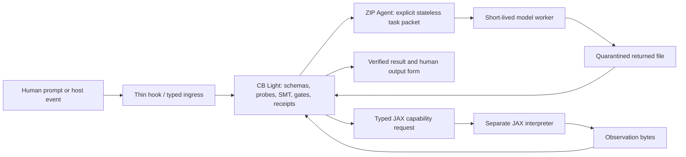

# ConstraintBox integrated architecture

ConstraintBox is deterministic Python code around short-lived, replaceable
model workers. Models may propose text or files. They do not decide whether an
operation ran, passed a gate, or became authoritative.

## The parts and their authority

| Part | What it does | What it cannot do |
|---|---|---|
| CB Light | Validates finite packets, runs declared probes and solvers, records dispositions and receipts | Import JAX, infer scientific meaning, or trust model prose |
| ZIP Agent | Expands ordered task files, binds parentage and required outputs, retries bounded failures, builds a deterministic return ZIP | Let a worker invent an operation or write CB authority |
| Thin hooks | Capture or relay a host event and remove unmanaged launch authority | Choose models, evaluate a basin, or mint PASS/ADMIT |
| Waves | Compose skills, deterministic tools, mini-MMM salience, bounded loops, and receipts | Promote themselves or replace the Light gate |
| JAX route | Runs declared batched numerical observations in a separate interpreter | Enter the Light environment or decide a gate |
| Context ledger | Preserves owner prompts, plans, failures, contradictions, and progress outside chat context | Make the latest summary canon or erase older evidence |
| Model worker | Reads explicit files and returns explicit files | Serve as evidence that it complied |

## One system, two Python interpreters

The system is integrated through a protocol, not by mixing every package into
one environment.

1. The Light interpreter owns CB, ZIP Agent, schemas, solvers, and receipts.
2. The JAX interpreter owns the declared numerical capability.
3. A Light request names the operation and binds its input.
4. JAX returns observation bytes and runtime identity.
5. Light verifies the crossing and retains the claim ceiling.

The negative boundary is load-bearing: importing `jax` in Light must fail.

## Hooks and the box

A hook is not the box. It is one host-specific seam into the box. The portable
hook adapter recognizes managed and unmanaged execution routes, emits a
machine-readable result, and relays a managed request. Semantic decisions stay
inside the deterministic CB operation.

Cancellation is never success. A missing, cancelled, bypassed, or crashed CB
route has no authoritative result receipt.

## ZIP Agent process

A ZIP_JOB is both a stateless work order and the communication protocol:

1. CB verifies packet structure, identities, hashes, task order, skills, MMM
   bytes, and required output declarations.
2. CB supplies one task's declared files to a worker.
3. The worker returns bounded output bytes.
4. CB validates those bytes. Invalid output may be retried under the declared
   finite retry policy.
5. CB constructs and hashes the return ZIP. Only the verified return ZIP is the
   operation result.

Nested work is another explicit child ZIP request. A worker cannot privately
spawn a child and narrate that it happened.

## Probes, maps, basins, and gates

These remain different objects:

- A **probe** is an executed observation with a named input, operation, output,
  and replay path.
- A **map** is a measured relation assembled from many such observations.
- A **basin** is a stable region supported by that relation and its declared
  update or indistinguishability rule.
- A **gate** is deterministic code compiled only when a region is stable enough
  for one bounded decision.

The included structured probe defines `open` as support extension and `bind`
as restriction induced by named observations. It executes both orders, includes
commuting and noncommuting controls, and cross-checks exact and JAX results. It
does not establish chirality, physical time, or a mature manifold.

## Current package boundary

Included:

- current CB Light source, config, lock inputs, fixtures, and lifecycle scripts;
- ZIP Agent source and tests;
- a curated, portable wave/skill/MMM pack;
- thin host/provider adapters used by tested routes;
- structured-map and Light/JAX crossing operations;
- compact current context plus the full selected prompt/plan/progress corpus;
- bounded verification evidence.

Excluded:

- virtual environments and downloaded packages;
- bulk historical receipts, caches, and raw 6,144-row campaign data;
- Archive and `system_v5` as live dependencies;
- CB Heavy engine estates;
- model credentials, provider sessions, and machine-specific authentication;
- unadmitted experimental process-box or basin-runtime prototypes.

## Claim ceiling

This package can prove local source/runtime boundaries and replay the included
finite operations. It does not prove cross-platform portability, a live model
council, CB Heavy readiness, a scientific manifold, or production security.
Those require their own current receipts.
