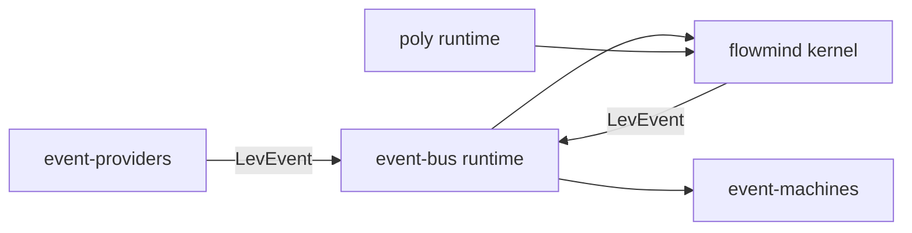

# Spec: Lev Runtime Kernel

## 1. Purpose

This spec defines the canonical hard-cut runtime kernel contract.

Kernel behavior is distributed across explicit runtime owners:

- `core/flowmind/src/kernel` for declaration execution and transition control
- `core/event-bus/src/runtime` for event persistence/replay/checkpoint/recovery runtime
- `core/event-machines` for transition machine execution
- `core/event-providers` for source adapter ingestion
- `core/poly` for daemon lifecycle/process orchestration

No legacy surfaces are part of this kernel contract.

## 2. Kernel Topology

```text
core/
  flowmind/src/kernel/
  event-bus/src/runtime/
  event-machines/
  event-providers/
  poly/
```

## 3. Ownership Contract

| Kernel concern | Owner | Rule |
|---|---|---|
| Transition declaration + execution | flowmind kernel | deterministic execution path |
| Event transport + persistence | event-bus runtime | append/replay/checkpoint owned by bus |
| State machine transitions | event-machines | machine state changes are bus-observable |
| Source ingress | event-providers | providers translate native payloads to LevEvent |
| Process/daemon lifecycle | poly | only poly owns daemon lifecycle |

## 4. Mandatory Invariants

1. Inter-module events use `LevEvent` only.
2. FlowMind emits transition-significant events through event-bus.
3. Event-bus runtime is the single owner of replay/checkpoint/recovery.
4. Event-machines observe transitions from bus events, not hidden side channels.
5. Event-providers never bypass event-bus to mutate runtime state.
6. Poly owns daemon lifecycle commands and runtime process supervision.
7. Retired identifiers are not resolvable in active runtime paths.

## 5. Package Contract

Required package set:

- `@lev-os/poly`
- `@lev-os/event-bus`
- `@lev-os/event-machines`
- `@lev-os/event-providers`
- `@lev-os/core-platforms`
- `@lev-os/core-sdlc`

## 6. Runtime Flow



## 7. Failure Semantics

1. Missing canonical package import: fail during module resolution.
2. Missing runtime owner contract: fail during startup validation.
3. Invalid event payload contract: reject and emit error event.
4. Persistence/checkpoint failures: fail-fast with explicit runtime error.

No alternate reroute behavior is permitted.

## 8. BDD Scenarios

### Scenario A: hard-cut imports

Given retired package identifiers
When runtime imports are resolved
Then only canonical package names resolve

### Scenario B: event pipeline

Given provider events arrive
When FlowMind executes transitions
Then event-bus persists/replays and event-machines observe transitions

### Scenario C: daemon ownership

Given daemon lifecycle commands
When command routing executes
Then runtime ownership resolves only through poly

### Scenario D: no retired surface

Given a call path requiring retired behavior
When execution starts
Then runtime fails explicitly and does not reroute

## 9. Validation Triad

### Static Gate

- zero retired identifiers in active runtime contracts
- zero alternate-reroute language in active runtime manifests/specs

### Contract Gate

- every active runtime owner has coherent `package.json` and `config.yaml`
- exports/bin declarations map to canonical owners only

### Runtime Smoke Gate

- CLI routing smoke
- event-bus publish/subscribe smoke
- flowmind kernel transition smoke
- core-platform plugin load smoke

## 10. Exit Criteria

Kernel hard-cut is complete when:

1. Static, contract, and smoke gates all pass.
2. Canonical docs/specs contain no retired ownership identifiers.
3. Runtime imports resolve only through canonical package names.
